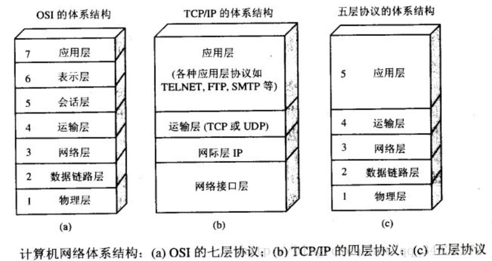

<!--
 * @Author: your name
 * @Date: 2020-04-18 08:42:44
 * @LastEditTime: 2020-04-30 07:46:45
 * @LastEditors: Please set LastEditors
 * @Description: In User Settings Edit
 * @FilePath: \JavaScholar\docs\2.net\3.TCP\1-TCP.md
 -->

# 1 网络协议

## 1.0 例子引入网络协议相关概念

那么这个是比较常见的协议举例问题。蓝军有两支部队，被绿军分割，每一支蓝军数量都没有超过绿军，但是两个部队总数是大于绿军的，那么现在我就想进行进行通信，就会进行如下操作：

这样就会无限的循环下去，因为两边的蓝军始终无法确定对否能够收到我发出去的信号。

那么会引出几个概念：

1. 计算机网络协议：
2. 计算机网络协议组成：
3. 对等实体：
4. 对等层：
5. 实体：
6. 服务访问点：
7. 接口：

## 1.1 

再这样的情况下，经过了很多长的时间有了好几种网络协议：

目前主流的网络协议主要有：

OSI模型只是作为一个理论模型，用得不多，主要是TCP

应⽤层

应用层(application-layer)的任务是通过应用进程间的交互来完成特定网络应用。应用层协议定义的是应用进程(进程:主机中正在运行的程序)间的通信和交互的规则。对于不同的网络应用需要不同的应用层协议。在互联网中应用层协议很多，如域名系统DNS，支持万维网应用的HTTP协议，支持电子邮件的SMTP协议等等。我们把应用层交互的数据单元称为报文。

