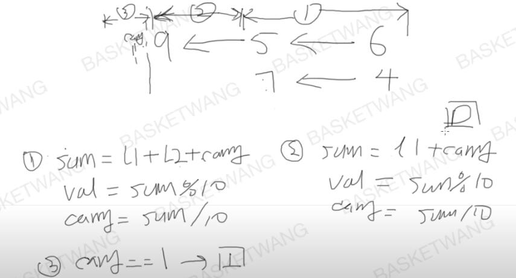

<!--
 * @Author: 孙浩然
 * @Date: 2020-05-25 12:55:19
 * @LastEditors: 孙浩然
 * @LastEditTime: 2020-05-25 15:15:04
 * @FilePath: \docs\4.algorithm\3.leetcode\leetcode02.md
 * @博客地址: 个人博客，如果各位客官觉得不错，请点个赞，谢谢。[地址](https://codefool0307.github.io/JavaScholar/#/)
--> 
# LeetCode02 两数相加

首先复习一下什么是链表？


给出两个 非空 的链表用来表示两个非负的整数。其中，它们各自的位数是按照 逆序 的方式存储的，并且它们的每个节点只能存储 一位 数字。

如果，我们将这两个数相加起来，则会返回一个新的链表来表示它们的和。

您可以假设除了数字 0 之外，这两个数都不会以 0 开头。

思路：



分成三种情形：

1. l1、l2都存在
2. l1或者l2有一个存在
3. l1、l2都不存在

同时还需要设置节点val和carry值

```java
class Solution {
    public ListNode addTwoNumbers(ListNode l1, ListNode l2) {
       if (l1==null) return l2;
       if (l2==null) return l1;
       //开始设置节点操作了
       ListNode dummy=new ListNode(0);
       ListNode current=dummy;
       int carry=0;

       while (l1!=null && l2!=null){
           int sum=l1.val+l2.val+carry;
           int val=sum%10;
           carry=sum/10;

           ListNode listNode = new ListNode(val);
           current.next=listNode;
           current.next=current;
           l1=l1.next;
           l2=l2.next;
       }
       while(l1!=null){
           int sum=l1.val+carry;
           int val=sum%10;
           carry=sum/10;

           ListNode listNode = new ListNode(val);
           current.next=listNode;
           current.next=current;
           l1=l1.next;
       }
        while(l2!=null){
            int sum=l1.val+carry;
            int val=sum%10;
            carry=sum/10;

            ListNode listNode = new ListNode(val);
            current.next=listNode;
            current.next=current;
            l2=l2.next;
        }
        if (carry!=0){
            current.next=new ListNode(carry);
        }
        return dummy.next;
    }
}
```