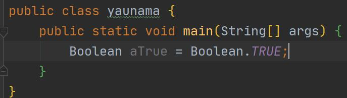

# 1 数据类型
## 1.1 基本数据类型

### 1.1.0 基本数据类型综述

目前基本数据类型在jdk发布的源码当中共分为了三部分：

1. 布尔类型
2. 字符类型
3. 数值类型

注：正好与[面经](/docs/9.interview/1.面经/1-java基础.md/#1java基础-数据类型-8种常见类型)契合

注：jdk源码在src\java.base\java\lang中


### 1.1.1 布尔类型源码解析 

Boolean关注点：

1. boolean类型可以创建对象，但是参数只有包含一个字段，如new Boolean（true），不可以new Boolean（true，false）👉

2. Boolean与String的相互转换 👉

Boolean源码有：

1. x个方法👉
2. x个构造函数👉
3. x个成员变量👉
   


#### 1.1.1.1 函数头

```java
package java.lang;

import jdk.internal.HotSpotIntrinsicCandidate;//会替代JDK源码实现，获取更高的效率

public final class Boolean implements java.io.Serializable,//实现对象的序列化，
                                                          // 为了解决 在对 对象流 进行读写操作时所引发的问题（序列化详细介绍）
                                      Comparable<Boolean>//两数之间的比较问题
{
```

#### 1.1.1.2 成员变量 

##### 1.1.1.2.1 成员变量第一部分

```java
    /* boolean的成员变量（第一部分）*/
    public static final Boolean TRUE = new Boolean(true);
    public static final Boolean FALSE = new Boolean(false);
```


##### 1.1.1.2.1 成员变量第二部分

```java
    //boolean的成员变量（第二部分）------>表示基本类型boolean的class对象
    //告诉编译器忽略uncheck的警告信息，
    //如使用List，ArrayList等未进行参数化产生的警告信息
    @SuppressWarnings("unchecked") 
    public static final Class<Boolean> TYPE = (Class<Boolean>) Class.getPrimitiveClass("boolean");

```
为什么会是一个TYPE呢?

 1. int的包装类是Integer，但是Integer.class ==?== int.class 是绝对不相等的，因为这个是两份字节码文件
   
 2. 但是我自己创建了一个getPrimitiveClass方法，通过这个方法来确定使用什么class文件

注意：
    
1. 这个方法不属于Class
    
2. 程序

```java
   Integer.TYPE==int.class;//YES
   Integer.TYPE == Integer.class;//ERROR
```

3. 在java中有两种对象：

    * 实例对象，如 Boolean aBoolean = new Boolean(true);
    * Class对象 每一个类只要运行就会产生一个class对象，它包含了与类有关的信息，实例对象就是通过class对象产生的

4. [getPrimitiveClass方法](http://www.java2s.com/Code/Java/Reflection/isPrimitivetypegetPrimitiveClassgetTypeDefaultValue.htm)
   
```java
public static final Class<?> getPrimitiveClass(String typeName) {
   if (typeName.equals("byte"))
       return byte.class;
   if (typeName.equals("short"))
       return short.class;
   if (typeName.equals("int"))
       return int.class;
   if (typeName.equals("long"))
       return long.class;
   if (typeName.equals("char"))
       return char.class;
   if (typeName.equals("float"))
       return float.class;
   if (typeName.equals("double"))
       return double.class;
   if (typeName.equals("boolean"))
       return boolean.class;
   if (typeName.equals("void"))
       return void.class;
   throw new IllegalArgumentException("Not primitive type : " + typeName);
}
```
  
##### 1.1.1.2.1 成员变量第二部分

```java
    private final boolean value;

    private static final long serialVersionUID = -3665804199014368530L;
```
#### 1.1.1.3 构造函数

```java
   
    @Deprecated(since="9")//Deprecated的属性，表示已被弃用的版本
    public Boolean(boolean value) {
        this.value = value;
    }
    
    @Deprecated(since="9")
    public Boolean(String s) {
        this(parseBoolean(s));//this(true或者其他)调用的就是构造参数
    }
```
构造函数不常用了，因为我有了静态工厂，用它干嘛用？

#### 1.1.1.4 方法

##### 1.1.1.4.1 方法————将字符串参数解析为布尔值
```java
    /*
     * 作用：将字符串参数解析为布尔值
     * 如何实现：如果字符串参数不是null，并且忽略大小写，等于字符串true

     * Example: {@code Boolean.parseBoolean("True")} returns {@code true}.<br>
     * Example: {@code Boolean.parseBoolean("yes")} returns {@code false}.
     */
    public static boolean parseBoolean(String s) {
        return ((s != null) && s.equalsIgnoreCase("true"));
    }
```
##### 1.1.1.4.2 方法————返回boolean对象的值

```java
    /*
     作用：返回boolean对象的值
     如何实现：直接返回定义好的值就好了-------------|
     */                                           |
    @HotSpotIntrinsicCandidate//获取更高的效率     | 
    public boolean booleanValue() {               |
        return value;-----------------------------|
    }
```
但是这样确实能返回找到的值，但是下面这个方法

会优于构造器实现，同时时空性比较好

```java
    @HotSpotIntrinsicCandidate
    public static Boolean valueOf(boolean b) {
        return (b ? TRUE : FALSE);
    }

    public static Boolean valueOf(String s) {//会首先将String转换为Boolean
        return parseBoolean(s) ? TRUE : FALSE;
    }

    //返回的是String类型
    public static String toString(boolean b) {
        return b ? "true" : "false";
    }
   
    public String toString() {
        return value ? "true" : "false";
    }
```
##### 1.1.1.4.3 方法————hash和equals方法

```java
   
    @Override
    public int hashCode() {
        return Boolean.hashCode(value);
    }

    public static int hashCode(boolean value) {
        return value ? 1231 : 1237;
    }//默认规定好的

    public boolean equals(Object obj) {
        if (obj instanceof Boolean) {  //用来测试一个对象是否为一个类的实例
            return value == ((Boolean)obj).booleanValue();
        }
        return false;
    }
```

##### 1.1.1.4.4 方法————获取系统Boolean值

```java
    /**
     * 当且仅当以参数命名的系统属性存在，也就是说首先
      设置一个系统属性的boolean值，当系统属性的值equal(“true”)时，返回true，否则返回false，并且返回值是boolean型
    */
    public static boolean getBoolean(String name) {
        boolean result = false;
        try {
            result = parseBoolean(System.getProperty(name));//读取JVM中的系统属性
        } catch (IllegalArgumentException | NullPointerException e) {
        }
        return result;
    }
```

例子：

```java
        String s1="false";
        System.setProperty(s1, "false");//设置一个系统属性值
        //对系统属性值判定
        boolean aBoolean2 = Boolean.getBoolean(s1);
        System.out.println(aBoolean2);
```

##### 1.1.1.4.5 方法————比较问题

```java

    public int compareTo(Boolean b) {
        return compare(this.value, b.value);
    }

    public static int compare(boolean x, boolean y) {
        return (x == y) ? 0 : (x ? 1 : -1);
    }

```

##### 1.1.1.4.6 方法————逻辑与或非

```java
    public static boolean logicalAnd(boolean a, boolean b) {
        return a && b;
    }

    public static boolean logicalOr(boolean a, boolean b) {
        return a || b;
    }

    public static boolean logicalXor(boolean a, boolean b) {
        return a ^ b;
    }
}

```

### 1.1.2 布尔类型源码解析 

## 1.1 基本数据类型


## 1.2 引用数据类型


## 1.3 包装数据类型


