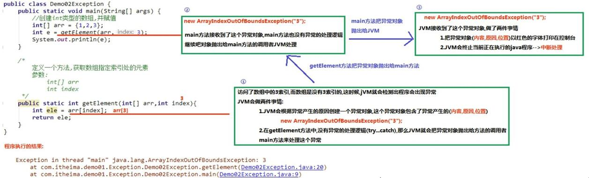

<!--
 * @Author: your name
 * @Date: 2020-04-16 15:30:12
 * @LastEditTime: 2020-04-17 08:35:27
 * @LastEditors: Please set LastEditors
 * @Description: In User Settings Edit
 * @FilePath: \docs\1.basics\1.java-basic\12-异常.md
 -->
## 12.0 异常综述

## 12.1 异常体系结构

异常本身就是一个类。产生异常就是创建了一个异常对象并抛出了一个异常对象

Java处理异常的方式就是中断处理

注：异常并不是语法错误

异常共分为了两个大类：
* Error
   * Java虚拟机无法解决的严重问题：StackOverflowError和OOM问题，一般不便携针对性代码进行处理
* Exception
   * 因编程错误或偶然外在因素导致的错误
  
为了解决这些错误，就有两个概念必须知道了：
1. 编译时异常
   说白了就是你在写程序的时候，语法不正确或者其他原因需要加入jar包/相应的语法才能消除
2. 运行时异常
   这个应该就是你的逻辑有问题，比如数组超出界限一类的。

异常过程的解析：

## 12.2 异常处理机制

### 12.2.0 异常处理的关键字：

1. try...catch
2. finally
3. throw
4. throws

这部分详见[关键字](3-关键字.md)

### 12.2.1 常见异常

* java.lang.RuntimeException
* java.io.IOExeption
* java.lang.ClassNotFoundException
* java.lang.InterruptedException
* java.io.FileNotFoundException
* java.sql.SQLException

### 12.2.1 异常处理机制一：try-catch-finally

## 12.3自定义异常