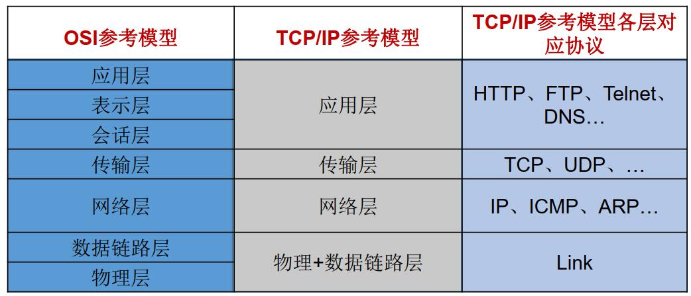
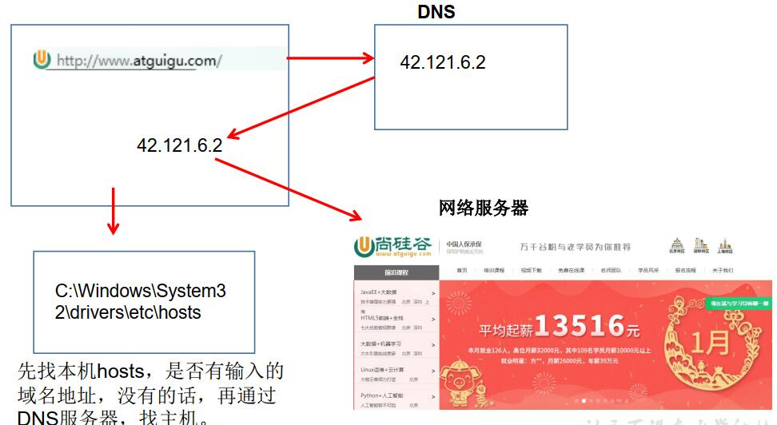
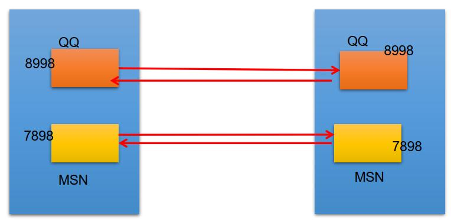
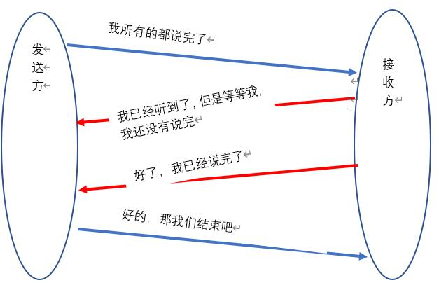

<!--
 * @Author: your name
 * @Date: 2020-04-18 07:50:30
 * @LastEditTime: 2020-04-18 09:46:47
 * @LastEditors: Please set LastEditors
 * @Description: In User Settings Edit
 * @FilePath: \JavaScholar\docs\1.basics\1.java-basic\14-网络编程.md
 -->
# 14 网络编程

## 14.0 网络编程综述

网络编程的目的就是通过网络协议与其他计算机实现数据交换

## 14.1 网络通信要素

### 14.1.0 网络中的主机如何通信

1. 通信双方地址
   * IP
   * 端口号
2. 一定的规则（网络通信协议）
   * OSI参考模型
   * [TCP/IP参考模型]()



### 14.1.1 IP和端口号

* IP地址
  * 分类方式1：IPV4、IPV6（主流）
  * 分类方式2：公网地址和私有地址
  * IP地址会有一个<font color=red bgcolor="yellow">InetAdress类</font>
     1. Internet上的主机有两种方式表示地址：
        域名（hostName）：www.baidu.com
        IP地址（hostAdress）：202.108.35.210
     2. InetAddress类主要表示IP地址， 两个子类： Inet4Address、 Inet6Address。
     3. InetAddress 类 对 象 含 有 一 个 Internet 主 机 地 址 的 域 名 和 IP 地 址 ：www.baidu.com 和 202.108.35.210。
     4. 使用域名容易记忆，当在连接网络时输入一个主机的域名后， 域名服务器(DNS)
负责将域名转化成IP地址，这样才能和主机建立连接。 -------域名解析

     

     5. InetAdress类常用方法：
   
        ```java
        1. public static InetAddress getLocalHost()
        2. public static InetAddress getByName(String host)
        3.public String getHostAddress()： 返回 IP 地址字符串（以文本表现形式） 。
        4.public String getHostName()： 获取此 IP 地址的主机名
        5.public boolean isReachable(int timeout)： 测试是否可以达到该地址
        ```
<b>一、程序</b>

```java
import java.net.InetAddress;
import java.net.UnknownHostException;
public class IP01 {
    public static void main(String[] args) throws UnknownHostException {
        InetAddress adress1 = InetAddress.getByName("www.baidu.com");
        //获取网站的IP字符串
        byte[] address = adress1.getAddress();
        //获取网站的域名
        String hostName = adress1.getHostName();
        //获取网站的IP地址
        String hostAddress = adress1.getHostAddress();
        System.out.println(address);
        System.out.println(hostName);
        System.out.println(hostAddress);
        //获取本机的域名和IP地址
        InetAddress address2 = InetAddress.getLocalHost();
        System.out.println(address2);
    }
}
```

<b>二、结果展示</b>

```java
[B@1b6d3586
www.baidu.com
39.156.66.18
DESKTOP-TO0NJPC/169.254.222.133
```
<b>三、可能存在的问题</b>
 暂无


* 端口号
  * 公认端口&#8195;&#8195;0~1023，被预先定义的服务通信占用，如:HTTP占用端口
80， FTP占用端口21， Telnet占用端口23
  * 注册端口&#8195;&#8195;1024~49151,分配各用户进程或者应用程序
  * 动态/私有端口&#8195;&#8195;49152~65535

* Scoket：这个是端口号与IP地址组合得出一个网络套接字<b><font color="#FF0000">套</font><font color="#AA0055">接</font><font color="#5500AA">字</font></b>



### 14.1.2 网络通信协议
    网络通信协议具体会在第二部分进行详细讲解

#### 14.1.2.1 较为重要的协议

传输层协议中有两个非常重要的协议：
 1. 传输控制协议TCP(Transmission Control Protocol)
 2. 用户数据报协议UDP(User Datagram Protocol)。

目前学习重点是TCP/IP， 其两个主要协议：传输控制协议(TCP)和网络互联协议(IP)实际上是一组协议，包括多个具有不同功能且互为关联的协议。
* 三次握手与四次握手
   1. 三次握手较为好理解
     
   2. 四次握手
     

还有一个是UDP不做过多解释了，貌似用的不是很多

#### 14.1.2.2 Scoket

* Socket分类：
1. 流套接字（stream socket）：使用TCP提供可依赖的字节流服务
2. 数据报套接字（datagram socket）：使用UDP提供“尽力而为”的数据报服务

* Scoket的常用方法：
  
  ```java

  1. Socket类的常用构造器：
    public Socket(InetAddress address,int port)创建一个流套接字并将其连接到指定 IP 地址的指定端口号。
    public Socket(String host,int port)创建一个流套接字并将其连接到指定主机上的指定端口号。
  2. Socket类的常用方法：
    public InputStream getInputStream()返回此套接字的输入流。 可以用于接收网络消息
    public OutputStream getOutputStream()返回此套接字的输出流。 可以用于发送网络消息
    public InetAddress getInetAddress()此套接字连接到的远程 IP 地址；如果套接字是未连接的， 则返回 null。
    public InetAddress getLocalAddress()获取套接字绑定的本地地址。 即本端的IP地址
    public int getPort()此套接字连接到的远程端口号；如果尚未连接套接字， 则返回 0。
    public int getLocalPort()返回此套接字绑定到的本地端口。 如果尚未绑定套接字， 则返回 -1。 即本端的端口号。
    public void close()关闭此套接字。 套接字被关闭后， 便不可在以后的网络连接中使用（即无法重新连接或重新绑定） 。 需要创建新的套接字对象。 关闭此套接字也将会关闭该套接字的 InputStream 和OutputStream。
    public void shutdownInput()如果在套接字上调用 shutdownInput() 后从套接字输入流读取内容， 则流将返回 EOF（文件结束符） 。 即不能在从此套接字的输入流中接收任何数据。
    public void shutdownOutput()禁用此套接字的输出流。 对于 TCP 套接字， 任何以前写入的数据都将被发送， 并且后跟 TCP 的正常连接终止序列。 如果在套接字上调用 shutdownOutput() 后写入套接字输出流，则该流将抛出 IOException。 即不能通过此套接字的输出流发送任何数据。
```


## 14.2 TCP编程


## 14.3 UDP编程


## 14.4 URL编程

