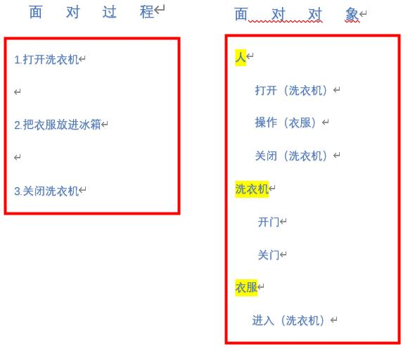

<!--
 * @Author: your name
 * @Date: 2020-04-18 14:11:31
 * @LastEditTime: 2020-04-20 17:04:40
 * @LastEditors: your name
 * @Description: In User Settings Edit
 * @FilePath: \docs\1.basics\1.java-basic\18-面对对象.md
 -->
# 18面对对象

## 18.0 面向对象综述

## 18.1 面向对象与面向过程

### 18.1.1 区分

~~书本上的解释就是。。。。。。。。。。（不想去粘贴了）~~

我认为的面对对象与过程（以洗衣服为例）



其实我觉得面对对象从执行者（士兵）变成了面对对象的指挥者（将军）

### 18.1.2 面对对象

类和对象是面对对象的核心概念
可以理解类就是一张图纸，可以根据这个图纸涉及很多类型的楼房（对象）

#### 18.1.2.1 类

那么类的成员就有：
  1. 属性——成员变量
  2. 行为——成员方法

其中，类的语法格式主要是
       
     ```java
         修饰符 class 类名{
             属性声明；
             方法声明；
         }
     ```

修饰符可以使用权限修饰符和其他修饰符,详见[3-关键字](./3-关键字.md)

##### 18.1.2.1.1 属性（变量）

1. 成员变量 
   
   在方法体外，类体内声明的变量

2. 局部变量
   
   在方法体内声明的变量

##### 18.1.2.1.2 方法

* 方法的重载
  
  允许同名方法，但是只要参数个数或者参数类型不同就可以了（与返回类型无关）

* 可变参数
  
  方法的参数如果有多个，可以采用如：

  方法名（参数类型名...参数名）这个0个、1个、多个都可以使用

* 值传递机制
  较为重要（单独讲解）

自定义类，基本思路也是这个的，但是

类创建之后，我们是如何使用java类的

那么，就依赖于对象

#### 18.1.2.1 类

* 对象
   1. 创建对象语法：类名 对象名=new 类名()
   2. 如何访问呢：  对象名.对象成员/对象方法
      - 注意：如果成员或者方法用static修饰了成了静态的，那就不能这么操作了

对象内存是如何使用的？

之后进行补充

