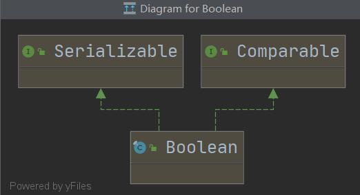
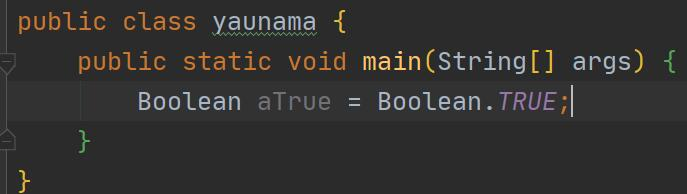
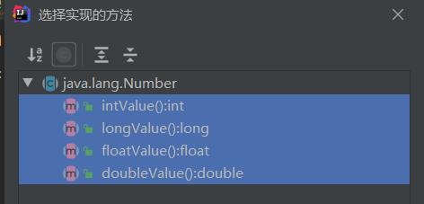

# 1 创建工程

## 1.1 创建工程








注意：

因为maven需要从远端进行传输文件，那么我们就要把maven的源更改为本地源：

1. 找到maven文件里面的setting.xml文件,修改为:

```java
<mirrors>
   <mirror>
      <id>alimaven</id>
      <name>aliyun maven</name>
      <url>http://maven.aliyun.com/nexus/content/groups/public/</url>
      <mirrorOf>central</mirrorOf>        
    </mirror>
```

2. 到settings中，找到maven，更换几个参数：如下


## 1.2 项目结构

借鉴大佬codesheep的相关文章

在《阿里巴巴Java开发手册》有专门的的介绍


按这本书上说的，一般分为如下几层：

* 开放接口层
* 终端显示层
* Web 层
* Service 层
* Manager 层
* DAO 层
* 外部接口或第三方平台

具体根据书中的各个部分进行详细阐述，主要分为了三大部分，如图：


* <font color=red style="background:yellow"><b>项目根目录/src/main/java</b></font>：放置项目Java源代码
* <font color=red style="background:yellow"><b>项目根目录/src/main/resources</b></font>：放置项目静态资源和配置文件
* <font color=red style="background:yellow"><b>项目根目录/src/test/java</b></font>：放置项目测试用例代码

而位于/src/main/java目录下的Java源代码的组织结构大家比较关心，这地方也只能给出一个通常典型的结构，

各个目录详细介绍：

```java
|_annotation：放置项目自定义注解
|_aspect：放置切面代码
|_config：放置配置类
|_constant：放置常量、枚举等定义
   |__consist：存放常量定义
   |__enums：存放枚举定义
|_controller：放置控制器代码
|_filter：放置一些过滤、拦截相关的代码
|_mapper：放置数据访问层代码接口
|_model：放置数据模型代码
   |__entity：放置数据库实体对象定义
   |__dto：存放数据传输对象定义
   |__vo：存放显示层对象定义
|_service：放置具体的业务逻辑代码（接口和实现分离）
   |__intf：存放业务逻辑接口定义
   |__impl：存放业务逻辑实际实现
|_utils：放置工具类和辅助代码
```

然后接下来/src/main/resources目录，里面主要存放静态配置文件和页面静态资源等东西：

```java
|_mapper：存放mybatis的XML映射文件（如果是mybatis项目）
|_static：存放网页静态资源，比如下面的js/css/img
   |__js：
   |__css：
   |__img：
   |__font：
   |__等等
|_template：存放网页模板，比如thymeleaf/freemarker模板等
   |__header
   |__sidebar
   |__bottom
   |__XXX.html等等
|_application.yml       基本配置文件
|_application-dev.yml   开发环境配置文件
|_application-test.yml  测试环境配置文件
|_application-prod.yml  生产环境配置文件
```

项目结构划分总结

如果从一个用户访问一个网站的情况来看，对应着上面的项目代码结构来分析，可以贯穿整个代码分层：


对应代码目录的流转逻辑就是：


一些注意事项

1. Contorller层参数传递建议不要使用HashMap，建议使用数据模型定义

2. Controller层里可以做参数校验、异常抛出等操作，但建议不要放太多业务逻辑，业务逻辑尽量放到Service层代码中去做

3. Service层做实际业务逻辑，可以按照功能模块做好定义和区分，相互可以调用

4. 功能模块Service之间引用时，建议不要渗透到DAO层（或者mapper层），基于Service层进行调用和复用比较合理

5. 业务逻辑层Service和数据库DAO层的操作对象不要混用。Controller层的数据对象不要直接渗透到DAO层（或者mapper层）；同理数据表实体对象Entity也不要直接传到Controller层进行输出或展示。

## 1.3 运行第一个springboot项目

由于目前需要在本地进行运行，那么需要对springmvc中增加，

去spring官网寻找到一个Serving Web Content with Spring MVC
之后：
1. pom.xml中导入相关依赖
2. 创建一个Controller
3. 创建一个html文件（2.3在springmvc中复习一下）


<b>一、程序</b>

```java
<dependency>
            <groupId>org.springframework.boot</groupId>
            <artifactId>spring-boot-starter-thymeleaf</artifactId>
</dependency>

@Controller
public class helloContoller {

    @GetMapping("/hello")
    public String greeting(@RequestParam(name="name") String name, Model model) {
        model.addAttribute("name", name);
        return "hello";
    }
}

<!DOCTYPE HTML>
<html xmlns:th="http://www.thymeleaf.org">
<head>
    <title>Getting Started: Serving Web Content</title>
    <meta http-equiv="Content-Type" content="text/html; charset=UTF-8" />
</head>
<body>
<p th:text="'Hello, ' + ${name} + '!'" />
</body>
</html>
```

<b>二、结果展示</b>

会出现预期结果

<b>三、可能存在的问题</b>

1. 可能会出现如下问题：


主要原因在于没有输入正确的网址，目前是初始状态，
就目前程序来说应该是输入localhost：9997/hello才可以进行展示
很多东西没有完善，如put、get等

修改后：


2. 修改端口号：在resoureces中构建一个properties文件，进行server.Port=xxxx修改


## 1.4 github托管

创建一个仓库

Git init
git add re.md
git commit -m "留言"
git remote add orgin ssh的地址
git push -u origin master


住：要用vim把用户名与密码进行注册
vim .git
避免commit就用一个名字，是的每个仓库的名字和昵称是隔离的


使用IDEA中的终端进行处理
Git init
git status查看当前状态
git add . 放入咱村里面，GitHub就知道了
git commit -m ""
git status
Git remote add orgin ssh
git push -u origin master

之后创建redme.md文件

之后从Git add 。开始
git push(不太还)
或者使用git commit --amend --no-edit
之后还是先Git add .

git push就可以了


