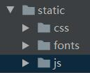
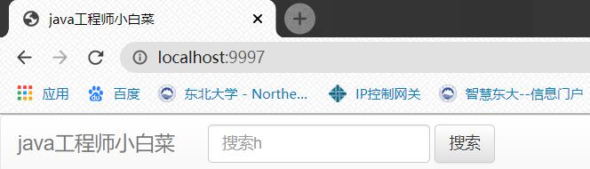
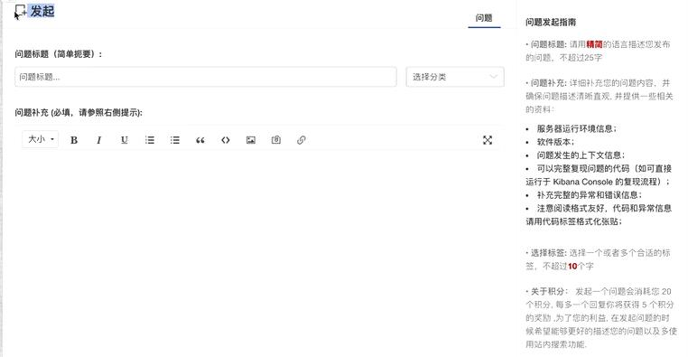

<!--
 * @Author: 孙浩然
 * @Date: 2020-05-18 19:31:07
 * @LastEditors: 孙浩然
 * @LastEditTime: 2020-05-22 17:08:17
 * @FilePath: \docs\10.project\02-快速搭建页面.md
 * @博客地址: 个人博客，如果各位客官觉得不错，请点个赞，谢谢。[地址](https://codefool0307.github.io/JavaScholar/#/)
--> 
# 2 页面设计

## 2.1 导航栏设计

1. 下载boostrap，并放置在项目的static目录下



2. 对templates下的index.html导入boostrap的相关配置 

```java
<link rel="stylesheet" href="css/bootstrap.min.css">
    <link rel="stylesheet" href="css/bootstrap-theme.min.css">
    <script src="js/bootstrap.min.js" type="application/javascript"></script>
```

3. 找到相对应的导航条的款式并对源码进行copy

4. 创建一个IndexConrtoller用来引导index

```java
@Controller
public class IndexController {
@GetMapping("/")
    public String index(){ return "index";}
}
```
5. 运行结果
   



注意：

@RequestParam(name="name") String name, Model model) 

一旦使用这个之后，就必修要在网站中实现put等操作，详见SpringMVC的相关内容


## 2.2 发布问题设计

那么根据相应的网站，我们进行设计，模板就是：



那么根据这个，去设计我们自己的博客系统提问栏目

那么copy一下index.html

那么根据模板，要考虑两件事情：

1. 分成了两块，可以考虑栅格系统
2. 如何设置发起提问

### 2.2.1 栅格系统

```java
<div class="row">
            <div class="col-lg-9 col-md-12 col-sm-12 col-xs-12" style="background-color: red;height: 300px" ></div>
            <div class="col-lg-3 col-md-12 col-sm-12 col-xs-12" style="background-color: green;height: 500px"></div>
</div>
```

想要查看呢，我就得创建一个类

```java
public class PublishContoller {

    @GetMapping("/public")
    public String publish() {
        return "public";
    }
}
```
那么我们就根据栅格系统进行设置

```java
<div class="container-fluid main">
            <div class="row">
                <div class="col-lg-9 col-md-12 col-sm-12 col-xs-12">
                    <h2><span class="glyphicon glyphicon-plus" aria-hidden="true"></span> 发起</h2>
                    <hr>

                    <form action="">
                        <div class="form-group">
                            <label for="title">问题标题（简单扼要）:</label>
                            <input type="text" class="form-control" id="title" name="title"
                                   placeholder="问题标题……">
                        </div>
                        <div class="form-group">
                            <label for="title">问题补充 (必填，请参照右侧提示):</label>
                            <textarea name="description" id="description"
                                      class="form-control"
                                      cols="30"
                                      rows="10"></textarea>
                        </div>
                        <div class="form-group">
                            <label for="tag">添加标签:</label>
                            <input type="text" class="form-control" id="tag" name="tag"
                                   placeholder="输入标签，以，号分隔">
                            </div>
                        <button type="submit" class="btn btn-success">
                            发布
                        </button></form></div>

                <div class="col-lg-3 col-md-12 col-sm-12 col-xs-12">
                    <h3>问题发起指南</h3>
                    • 问题标题: 请用精简的语言描述您发布的问题，不超过25字 <br>
                    • 问题补充: 详细补充您的问题内容，并确保问题描述清晰直观, 并提供一些相关的资料<br>
                    • 选择标签: 选择一个或者多个合适的标签，用逗号隔开，每个标签不超过10个字<br>
                </div>
            </div>
```

与此同时，设置了背景色

```java
body {
    background-color: #efefef;
}
.main {
    background-color: white;
    margin: 30px;
}
```

## 2.3 