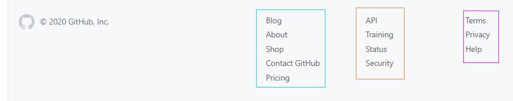
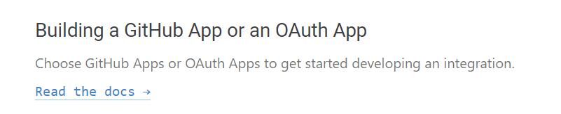
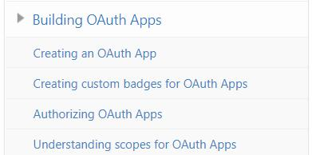
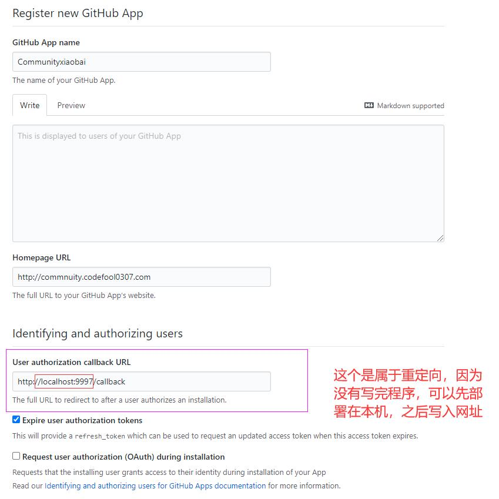
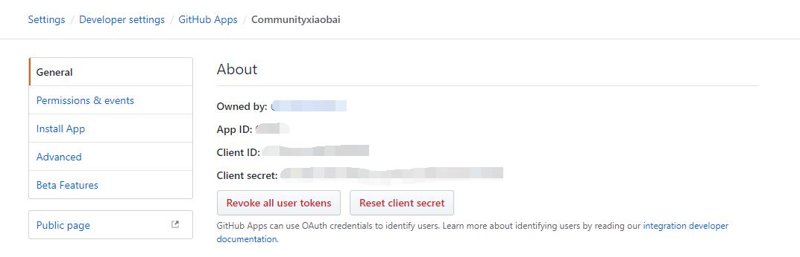
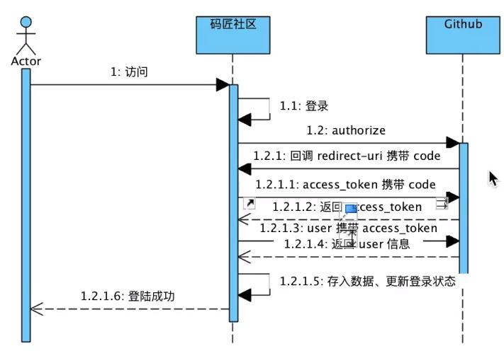
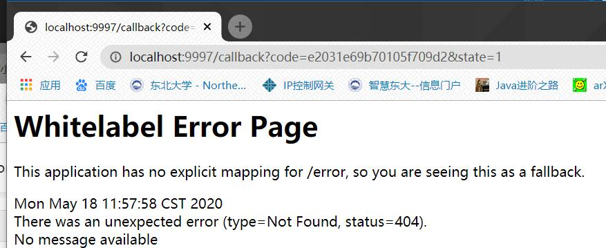
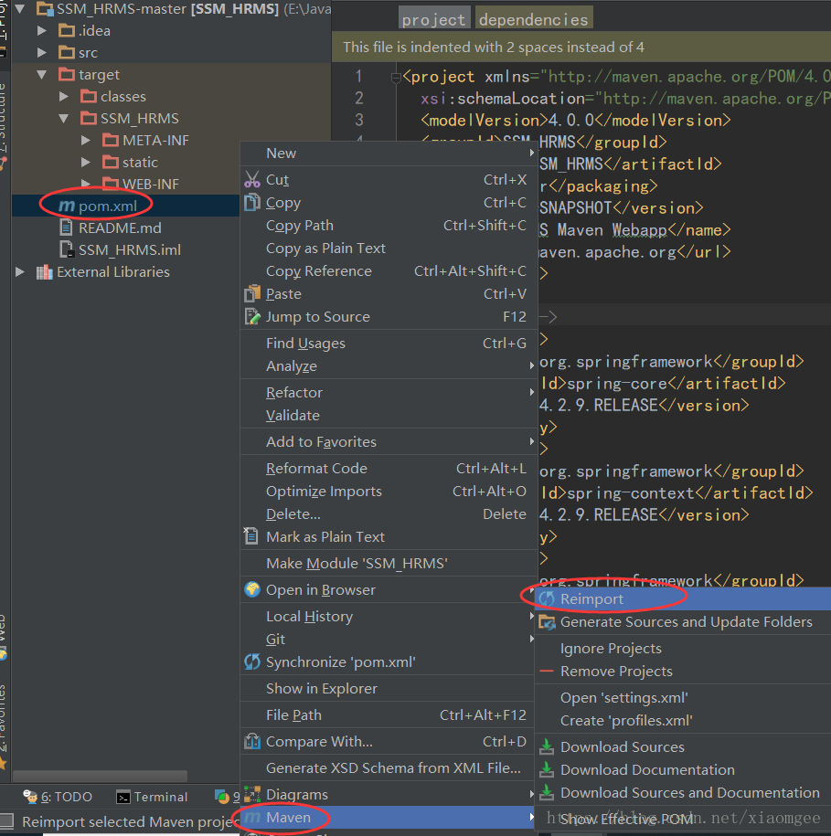

<!--
 * @Author: 孙浩然
 * @Date: 2020-05-18 09:19:17
 * @LastEditors: 孙浩然
 * @LastEditTime: 2020-05-18 14:41:53
 * @FilePath: \docs\10.project\03-Github登录.md
 * @博客地址: 个人博客，如果各位客官觉得不错，请点个赞，谢谢。[地址](https://codefool0307.github.io/JavaScholar/#/)
--> 
<!--
 * @Author: 孙浩然
 * @Date: 2020-05-18 09:19:17
 * @LastEditors: 孙浩然
 * @LastEditTime: 2020-05-18 09:19:18
 * @FilePath: \docs\10.project\01.Project01\03-Github登录.md
 * @博客地址: 个人博客，如果各位客官觉得不错，请点个赞，谢谢。[地址](https://codefool0307.github.io/JavaScholar/#/)
--> 

# 3.GitHub登录

经过创建导航条之后，我们就可以进行github的登录设计了

## 3.1 Github APP
1. 首先在github官网下方会有几个相关连接



2. 找到API进行并找得到GitHub APP



## 3.2 创建Github APP的账号

创建一个app账号，并且跟着说明文档走



之后开始创建



之后会提示注册成功



## 3.3 登录流程



理解：

[silu](https://developer.github.com/apps/building-github-apps/identifying-and-authorizing-users-for-github-apps/)

1. 用户发送访问请求，在社区的页面点击登录，会把自己的client、id、Client secret进行构造（1.1）

2. 通过使用一个authorize授权地址调用github，验证完用户名和密码之后，github会重新访问社区，回调之前就写好的redirect-uri地址，并且携带一个code（1.2-1.2.1）

3. 社区接收到code的时候会再次调用github的access_token并携带code，如果验证正确，github会直接返回access_token（1.2.1.1-1.2.1.2）

4. 再次使用access_token调用github的user的api，会获取到github的user信息（1.2.1.3-1.2.1.4）

5. 返回user信息之后会存入数据库、更新登录状态（1.2.1.5）

6. 最后返回到用户，表示登陆成功（1.2.1.6）

## 3.4 代码

[githubAPP登录文档](https://developer.github.com/apps/building-github-apps/identifying-and-authorizing-users-for-github-apps/)

<font color=red size='9'>1. 根据登录流程文档，index.html中让登录按键绑定一个登录地址并且携带参数：</font>
   
   | Name 姓名       | Type 类型 | Description 描述                                                                   |
|---------------|---------|----------------------------------------------------------------------------------|
| client_id    | string  | Required. 当你选择你的应用程序的时候，你可以在你的GitHub App settings 应用程序设置你的GitHub应用程序的客户端ID(clent_id)。 |
| redirect_uri | string  | 在您的应用程序中，授权后将发送用户的 URL。 中提供的 URL 必须完全匹配用户授权回调 URL                                |
| state         | string  | 这应该包含一个随机字符串，以防止伪造攻击，并可能包含任何其他任意数据                                               |
| login         | string  |  建议用于登录和授权应用程序的特定帐户                                                              |


```java
<li><a href="https://github.com/login/oauth/authorize?client_id=Iv1.2bc3b748c47800d6&redirect_uri=http://localhost:9997/callback&scope=user&state=1">登录</a></li>
```

注:scope=user&state=1可以不填写，具体填写内容之后详细阐述

那么运行之后，就会进行登录：

目前因为没有编写地址，所以登陆之后会跳转到这个页面：




<font color=red size='9'>2. 解析出code地址，通过code调用access_token</font>
   
   <font color=blue size='7'>1. 创建AuthorizeContoller</font>

```java
@Controller
public class AuthorizeController {
    public String callback(@RequestParam(name = "code")String name,
                           @RequestParam(name = "state")String state){
        return "index";

    }
}
```
这样就可以完成了参数的接收，两参数在进行调用access来进行接收就好了，由于接收是post，那么用java模拟post请求就可以了，一般是使用第三方的如HttpClient，但是这次试用OKhttp

这个是OKHttp的post
```java
public static final MediaType JSON
    = MediaType.get("application/json; charset=utf-8");

OkHttpClient client = new OkHttpClient();

String post(String url, String json) throws IOException {
  RequestBody body = RequestBody.create(json, JSON);
  Request request = new Request.Builder()
      .url(url)
      .post(body)
      .build();
  try (Response response = client.newCall(request).execute()) {
    return response.body().string();
  }
}
```
   <font color=blue size='7'>2. 创建GithubProvider来接收</font>
```java
@Component
public class GithubProvider {
    public String getAccessToken(AccessTokenDTO accessTokenDTO){
        MediaType mediaType = MediaType.get("application/json; charset=utf-8");
        OkHttpClient client = new OkHttpClient();
        RequestBody body = RequestBody.create(mediaType, JSON.toJSONString(accessTokenDTO));
        Request request = new Request.Builder()
                .url("https://github.com/login/oauth/access_token")
                .post(body)
                .build();
        try (Response response = client.newCall(request).execute()) {
            String string = response.body().string();
            System.out.println(string);//由于不知道会成什么
            return string;
        }catch(Exception e){

        }
       return null;
    }
```
因为GitHub在接收的时候，由于需要把社区的id、serect等传输到


因为request等必须使用的是okhttp的


注：如何自动导入



error=incorrect_client_credentials&error_description=The+client_id+and%2For+client_secret+passed+are+incorrect.&error_uri=https%3A%2F%2Fdeveloper.github.com%2Fapps%2Fmanaging-oauth-apps%2Ftroubleshooting-oauth-app-access-token-request-errors%2F%23incorrect-client-credentials


null


