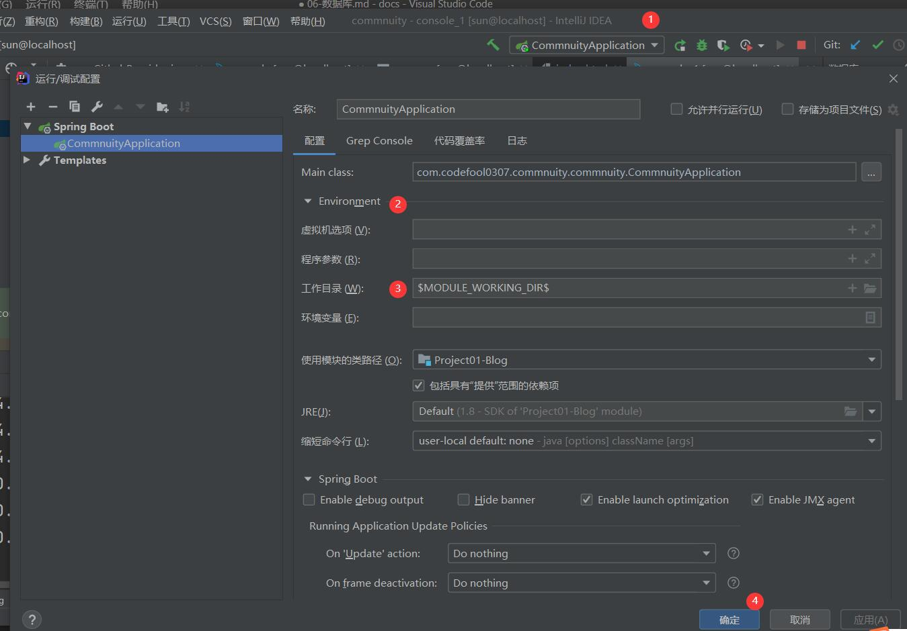
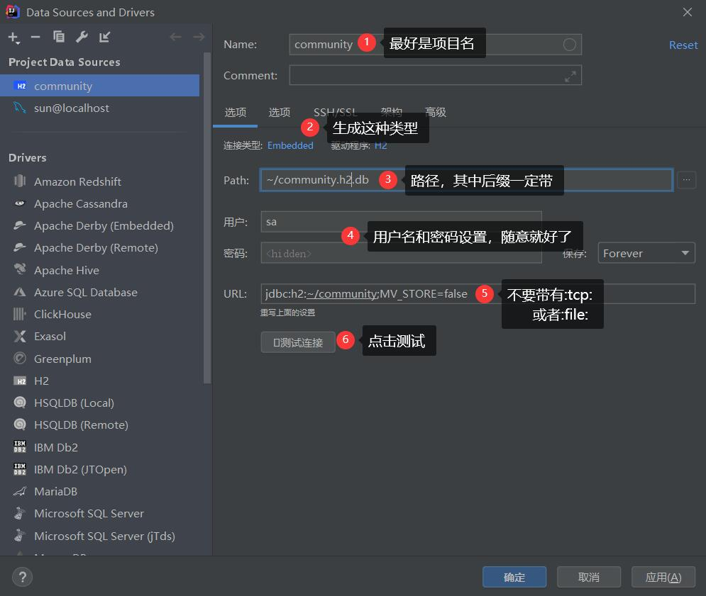
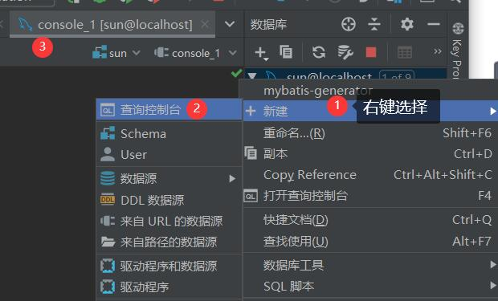
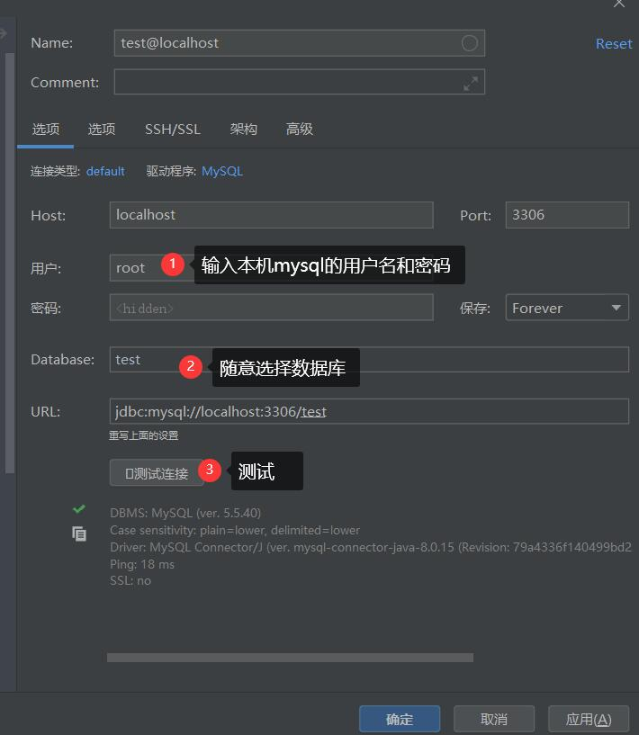
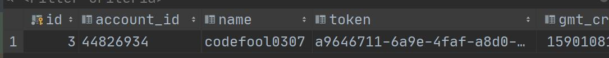
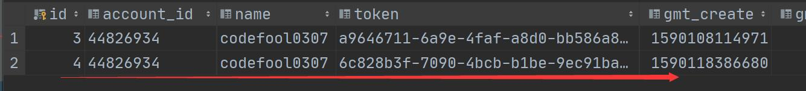
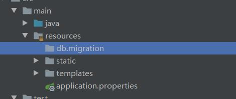
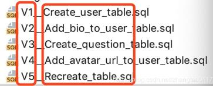

<!--
 * @Author: 孙浩然
 * @Date: 2020-05-19 20:14:52
 * @LastEditors: 孙浩然
 * @LastEditTime: 2020-05-22 12:36:20
 * @FilePath: \docs\10.project\06-数据库.md
 * @博客地址: 个人博客，如果各位客官觉得不错，请点个赞，谢谢。[地址](https://codefool0307.github.io/JavaScholar/#/)
--> 
# 6 数据库
## 6.1 UML规范


1. 泛化关系(generalization)

泛化关系为 is-a 的关系；两个对象之间如果可以用 is-a 来表示，就是泛化关系。

2. 实现关系(realization)

如图为例，电脑和可计算处理器就是实现关系，通常程序里面实现关系表现为继承抽象类。比如我们平时写的 Readable,Printable等接口的实现。

3. 聚合关系(aggregation)

如图码农和部门就是聚合关系。与组合关系不同的是，整体和部分不是强依赖的，即使整体不存在了，部分仍然存在。如图为例， 部门撤销了，码农换一个工作还是码农嘛。

4. 组合关系(composition)

组合关系同样表示整体由部分构成的关系，不同之处在于整体和部分是强依赖关系，如果整体不存在了，部分也不复存在。如图为例，如果公司倒闭了，那么何来部门呢？

5. 关联关系(association)

它是描书不同的类对象之间的关系，通常不会随着状态的变化而变化，可以理解为被关联者属于关联者的一部分。如图为例，手机就是码农的一部分，不会因为他上班与否而变化所属关系。通常情况在程序里面以类变量的方式表现。

6. 依赖关系(dependency)

他通常描述一个对象在运行期间会用到另一个对象的关系。如图为例码农只有在工作的时候才会用到 Mac 电脑，所以这种依赖关系是依赖于运行状态的。通常情况下是在程序里面通过构造函数、形参等体现。

## 6.2 数据库版本

### 6.2.1 h2数据库连接

#### 6.2.1.1 h2数据库文件配置

因为是初次使用MySQL在springboot当中，那么可以使用H2数据库

首先需要查看[H2的数据库](http://www.h2database.com/html/quickstart.html)

1. 打开[maven仓库](https://mvnrepository.com/?__cf_chl_jschl_tk__=d6a3fa4592e689759a9a19b436ed0981a261de7e-1589891616-0-AZEjcXjpVXXT2HxfLt2BPqsA6ndjasL1phqS-_Aai1p8xbTq_-6n_Rha6i6k6Z2wJXnFxLiw92Yfrstx4LibtLD4fQDNUz2BobnehW3_cjb2QLn_APytxVGu9j0DDGCpXAKsGskIA59zxBFjQ8QKAf1CjLNRuAqKYgBCQpfK18L5aQa3BIceExRgahNe9pahdQHU01OcJI1wwQCYDGDWhi9E2-VC4DO2xpkTROVx-iWQEGSt4qpKnGL7-3STftxGedmAThxbzrsYgafQS8Bm_3VcnHiVXeTvt-3b7B33SfmCyQR7Xpl8WEJ7hSFPoAJVATz4NlHxXCdu2HzDnZYAuP4)寻找相应的导入jar包

```java
<dependency>
    <groupId>com.h2database</groupId>
    <artifactId>h2</artifactId>
    <version>1.4.200</version>
    <scope>test</scope>
</dependency>
```

2. 使用JDBC的驱动类，那么会发现在jar包中就已经保存了驱动类，所以不需要再导入了

3. 创建相对应的数据库，这次我们使用IDEA所对应的database(会在之后介绍如何使用)

#### 6.2.1.2 h2数据库配置

 

 


#### 6.2.1.3 存在的问题：

1. 问题1：Wrong user name or password 
   
```java
There was an unexpected error (type=Internal Server Error, status=500).

nested exception is org.apache.ibatis.exceptions.PersistenceException: ### Error updating database. Cause: org.springframework.jdbc.CannotGetJdbcConnectionException: Failed to obtain JDBC Connection; nested exception is org.h2.jdbc.JdbcSQLInvalidAuthorizationSpecException: Wrong user name or password 【28000-199】 ### The error may exist in cn/edu/hnnu/community/mapper/UserMapper.java (best guess) ### The error may involve cn.edu.hnnu.community.mapper.UserMapper.insert ### The error occurred while executing an update ### Cause: org.springframework.jdbc.CannotGetJdbcConnectionException: Failed to obtain JDBC Connection; nested exception is org.h2.jdbc.JdbcSQLInvalidAuthorizationSpecException: Wrong user name or password 【28000-199】
```
如何解决呢？可以再数据库的sql语句输入窗口，输入

```java
CREATE USER IF NOT EXISTS 【用户名】 PASSWORD '密码';

ALTER USER 【用户名】 admin true ;
```
那么如何打开IDEA的数据库命令窗口呢？



2. 问题2：如果问题1还是无法解决的话，采用如下方案：

   1. 先去把原来的db文件找到，删除如下图两个文件：

      

   2. 重新创建，一定要配置好用户名和密码   
   
      

3. 问题3：如果在问题2的基础上出现了：Table "USER" not found。

   那么一定是你的path路径不是全名，也就是说没有带.h2.db，如上图圆圈3

4. 无法显示数据的原因：

   暂时没有找到，之后试试吧

但是h2我解决了两天还是问题百出。可能个人能力有限，所以还是是用我自己熟悉的mysql吧

### 6.2.2 mysql数据库连接

#### 6.2.2.1 mysql数据库的配置

1. 首先去系统中查看当前系统的时区

```java
mysql -ulocalhost -uroot -p
输入密码后，进入mysql
show variables like "%time_zone%";
如果是UTC就可以了，不是的话，进行下一步
set global time_zone = '+8:00';
```

但是不能永久使用，为了方便，进屋mysql安装包，找到my.ini以管理员的模式启动，在最后添加

```java
default-time_zone = '+8:00'
```

2. 完毕后，pom.xml设置jar包

注意：一个mysql、一个数据连接池

```java
<dependency>
            <groupId>mysql</groupId>
            <artifactId>mysql-connector-java</artifactId>
            <version>8.0.19</version>
        </dependency>
        <dependency>
            <groupId>com.alibaba</groupId>
            <artifactId>druid</artifactId>
            <version>1.1.14</version>
</dependency>
```
3. application.pro设置

```java
spring.datasource.url=jdbc:mysql://localhost/sun?serverTimezone=Asia/Shanghai
spring.datasource.username=root
spring.datasource.password=root
spring.datasource.driver-class-name=com.mysql.cj.jdbc.Driver
spring.datasource.type=com.alibaba.druid.pool.DruidDataSource
```

注意：  
   * 数据库地址必须写上时区
   * 如果mysql版本是8.0之后，不再使用之前的com.mysql.jdbc.Driver


#### 6.2.2.2 mysql问题

1. 问题1：时区问题

```java
java.sql.SQLException: The server time zone value '�й���׼ʱ��' is unrecognized or represents more than one time zone. You must configure either the server or JDBC driver (via the 'serverTimezone' configuration property) to use a more specifc time zone value if you want to utilize time zone support.
```

数据库时间需要设置


#### 6.2.2.3 mysql安装



### 6.2.3 数据库表格设计


就可以创建表格了，然后


### 6.2.4 MyBatis设计

本项目是使用的MyBatis实现，因为初次使用MyBatis所以进入

[MyBatis官方说明文档](http://mybatis.org/spring-boot-starter/mybatis-spring-boot-autoconfigure/)

1. 在maven中导入相对应的jar包

```java
<dependency>
    <groupId>org.mybatis.spring.boot</groupId>
    <artifactId>mybatis-spring-boot-starter</artifactId>
    <version>2.1.1</version>
</dependency>
```

2. 之后我们快速导入

但是发现MyBatis官方文档中没有对数据库设置用户和密码，那么我们就进入到spring官方文档中进行查看会发现：

[spring官方文档](https://docs.spring.io/spring-boot/docs/2.0.0.RC1/reference/htmlsingle/#boot-features-embedded-database-support)

就有关于说明，说明主要有两条：

1. 导入相对应的用户名等要去到properties文件
 
    6.2.1进行了介绍了

2. 放入相对应的jar包

```java
<dependency>
            <groupId>org.springframework.boot</groupId>
            <artifactId>spring-boot-starter-jdbc</artifactId>
        </dependency>
```

3. 创建一个mapper——usermapper

因为我们的目的是获取user存入数据库的内容，那么需要完成两个小任务：
* 存入数据库必须要使用Model，创建model——User
* 导入@Insert语句

```java
public class UserMapper {
    private Long user;
    private String accountId;
    private String name;
    private String token;
    private Long gmtCreate;
    private Long gmtModified;
```

```java
package com.codefool0307.commnuity.commnuity.mapper;

import com.codefool0307.commnuity.commnuity.Model.User;
import org.apache.ibatis.annotations.Insert;
import org.apache.ibatis.annotations.Mapper;

@Mapper
public interface UserMapper {
    @Insert("insert into user(name,account_id,token,gmt_modified) values (#{name},#{accountid},#{token},#{gmtCreate},#{gmtModified})")
     void insert(User user);
}


```

4. 运行程序

```java
@Controller
public class AuthorizeController {
    @Autowired
    private GithubProvider githubProvider;

    @Value("${github.client.id}")
    private String clientid;

    @Value("${github.client.secret}")
    private String clientsecret;

    @Value("${github.client.uri}")
    private String redirecturi;

    @Autowired
    private UserMapper userMapper;

    @GetMapping("/callback")
    public String callback(@RequestParam(name = "code")String code,
                           @RequestParam(name = "state")String state,
                           HttpServletRequest request){
        AccessTokenDTO accessTokenDTO = new AccessTokenDTO();
        accessTokenDTO.setClient_id(clientid);
        accessTokenDTO.setClient_secret(clientsecret);
        accessTokenDTO.setCode(code);
        accessTokenDTO.setRedirect_uri(redirecturi);
        accessTokenDTO.setState(state);
        String accessToken = githubProvider.getAccessToken(accessTokenDTO);
        GihubUser githubuser = githubProvider.getUser(accessToken);
        if (githubuser!=null){
            //然后对user信息进行设置
            User user = new User();
            user.setToken(UUID.randomUUID().toString());
            user.setName(githubuser.getName());
            user.setAccountId(String.valueOf(githubuser.getId()));
            user.setGmtCreate(System.currentTimeMillis());
            user.setGmtModified(user.getGmtModified());
            userMapper.insert(user);
            request.getSession().setAttribute("user",githubuser);
            return "redirect:/";
        }else{
            return "redirect:/";
        }

    }
}
```

登陆成功了，登陆成功之后，我们就可以去数据库当中看是否有数据插入

发现插入了数据



## 6.3 持久化存储

那么就采用了cookie与session

因为登陆成功之后，如何往前端写一个cookie

主要思想就是：

1. 以token为依据绑定前后端状态，获取用户信息，生成一个token，存储到数据库中，并放入cookie中

2. 然后把cookie里面key=token的信息获取到，然后去数据库查询是否存在

1~4程序

关掉数据库，并且运行


F12看一下生成了token


然后把cookie里面key=token的信息获取到，然后去数据库查询是否存在


下一步到indexcontroller

注入usermapper   步骤5~7

既然cookie可以存这么多信息，为什么user信息不存？安全性

然后看8，不用数据库

手动写一个key、value并且在登陆验证的时候手动的识别，去数据库查看。


1. 通过token作为一个中间介质，往前端写入cookie

```java
public class AuthorizeController {
    @Autowired
    private GithubProvider githubProvider;

    @Value("${github.client.id}")
    private String clientid;

    @Value("${github.client.secret}")
    private String clientsecret;

    @Value("${github.client.uri}")
    private String redirecturi;

    @Autowired
    public UserMapper userMapper;

    @GetMapping("/callback")
    public String callback(@RequestParam(name = "code")String code,
                           @RequestParam(name = "state")String state,
                           HttpServletResponse response){
        AccessTokenDTO accessTokenDTO = new AccessTokenDTO();
        accessTokenDTO.setClient_id(clientid);
        accessTokenDTO.setClient_secret(clientsecret);
        accessTokenDTO.setCode(code);
        accessTokenDTO.setRedirect_uri(redirecturi);
        accessTokenDTO.setState(state);
        String accessToken = githubProvider.getAccessToken(accessTokenDTO);
        GihubUser githubuser = githubProvider.getUser(accessToken);
        if (githubuser!=null){
            User user = new User();
            //生成全局唯一标识符
            String token = UUID.randomUUID().toString();
            user.setToken(token);
            user.setName(githubuser.getName());
            user.setAccountId(String.valueOf(githubuser.getId()));
            user.setGmtCreate(System.currentTimeMillis());
            user.setGmtModified(user.getGmtModified());
            userMapper.insert(user);//插入数据库的过程就是写入session
            //request.getSession().setAttribute("user",githubuser);
            //开始手动写入cookie
            Cookie cookie = new Cookie("token", token);
            response.addCookie(cookie);
            return "redirect:/";
        }else{
            return "redirect:/";
        }

    }
}
```

2. 对cookie中存放的token的值进行获取

```java
@Controller
public class IndexController {
    @Autowired
    private UserMapper userMapper;

@GetMapping("/")
    public String index(HttpServletRequest request){
    Cookie[] cookies = request.getCookies();
    for (Cookie s : cookies) {
        if (s.getName().equals("token")){
            String token = s.getValue();
            User user=userMapper.findByToken(token);
            if (user!=null){
                request.getSession().setAttribute("user",user);
            }
            break;
        }
    }
    return "index";}
}
```

3. 运行成功之后，可以查看



获取账号后，直接写入session

## 6.4 集成Flyway

在数据库中，由于开发需求，可能要自己不断地往里面添加，但是每次用sql语句进行插入的时候太过于浪费时间，那么查询一下[flyway官方文档](https://flywaydb.org/)

1. pom文件加入flyway依赖
      
注：
      * 在plugins中加入！！！
      
      * 版本号和你自己的数据库要一致！！！
      
      * 路径、用户、密码要核对正确！！！
      
      * 1.4.200版即使migrate成功也无法成功创建表，要换成1.4.199！！！

```java
           <plugin>
                <groupId>org.flywaydb</groupId>
                <artifactId>flyway-maven-plugin</artifactId>
                <version>6.2.2</version>
                <configuration>
                    <url>数据库路径</url>
                    <user>用户名</user>
                    <password>密码</password>
                </configuration>
                <dependencies>
                    <dependency>
                        <groupId>com.h2database</groupId>
                        <artifactId>h2</artifactId>
                        <version>1.4.199</version>
                    </dependency>
                </dependencies>
            </plugin>
```

2. 在resource中创建db/migration文件夹
  
  
      
3. 编写数据库脚本

在db/migration文件下，创建sql文件。其命名格式必要严格按照以下格式：



开头必须以V1，V2等开口，第几个文件就V几，接着就是两个下划线 __ ，后面就用sql功能简介说明的格式命令

```java
CREATE TABLE USER
(
    ID int AUTO_INCREMENT PRIMARY KEY NOT NULL,
    ACCOUNT_ID VARCHAR(100),
    NAME VARCHAR(50),
    TOKEN VARCHAR(36),
    GMT_CREATE BIGINT,
    GMT_MODIFIED BIGINT
);
```
注：一定要断开自己写的数据库，并且删除数据库

4. 运行mvn flyway:migrate
    
     在IDEA的terminal运行命令：mvn flyway:migrate

       注：在这里可能出现mysql5.5不支持了，那么就得更新了，更新到5.7就可以了。
           同时时间还要设置

5. 运行结果，成功创建user表

   在table中会生成一个flyway_schema_history，用来记录我们每一次的migrate记录。


