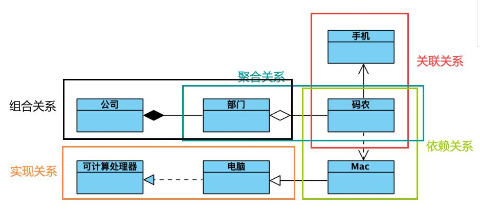
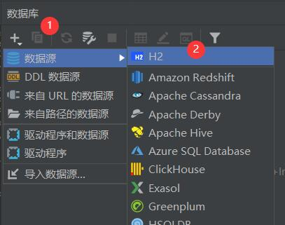
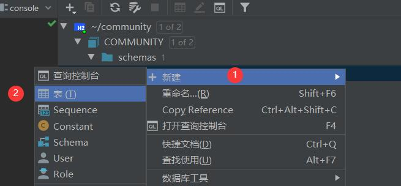
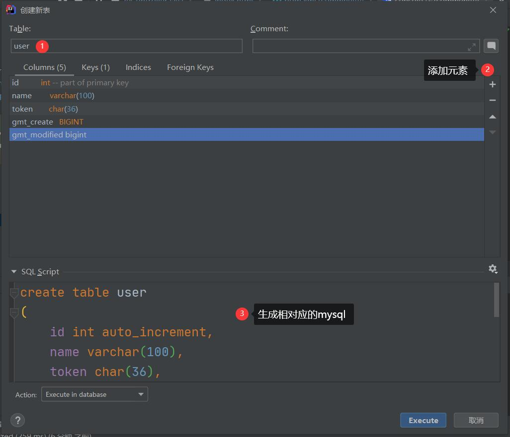
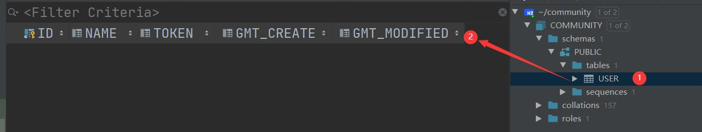

<!--
 * @Author: 孙浩然
 * @Date: 2020-05-19 20:14:52
 * @LastEditors: 孙浩然
 * @LastEditTime: 2020-05-22 07:09:17
 * @FilePath: \docs\10.project\06-数据库.md
 * @博客地址: 个人博客，如果各位客官觉得不错，请点个赞，谢谢。[地址](https://codefool0307.github.io/JavaScholar/#/)
--> 
# 6 数据库
# 6.1 UML规范



1. 泛化关系(generalization)

泛化关系为 is-a 的关系；两个对象之间如果可以用 is-a 来表示，就是泛化关系。

2. 实现关系(realization)

如图为例，电脑和可计算处理器就是实现关系，通常程序里面实现关系表现为继承抽象类。比如我们平时写的 Readable,Printable等接口的实现。

3. 聚合关系(aggregation)

如图码农和部门就是聚合关系。与组合关系不同的是，整体和部分不是强依赖的，即使整体不存在了，部分仍然存在。如图为例， 部门撤销了，码农换一个工作还是码农嘛。

4. 组合关系(composition)

组合关系同样表示整体由部分构成的关系，不同之处在于整体和部分是强依赖关系，如果整体不存在了，部分也不复存在。如图为例，如果公司倒闭了，那么何来部门呢？

5. 关联关系(association)

它是描书不同的类对象之间的关系，通常不会随着状态的变化而变化，可以理解为被关联者属于关联者的一部分。如图为例，手机就是码农的一部分，不会因为他上班与否而变化所属关系。通常情况在程序里面以类变量的方式表现。

6. 依赖关系(dependency)

他通常描述一个对象在运行期间会用到另一个对象的关系。如图为例码农只有在工作的时候才会用到 Mac 电脑，所以这种依赖关系是依赖于运行状态的。通常情况下是在程序里面通过构造函数、形参等体现。

# 6.2 MySQL

MySQL的相关语言请详见[第三部分数据库](/3.database/1.MySQL/1-数据库相关概念.md)

因为是初次使用MySQL在springboot当中，那么可以使用H2数据库

首先需要查看[H2的数据库](http://www.h2database.com/html/quickstart.html)

那么根据快速入门来看：

1. 打开[maven仓库](https://mvnrepository.com/?__cf_chl_jschl_tk__=d6a3fa4592e689759a9a19b436ed0981a261de7e-1589891616-0-AZEjcXjpVXXT2HxfLt2BPqsA6ndjasL1phqS-_Aai1p8xbTq_-6n_Rha6i6k6Z2wJXnFxLiw92Yfrstx4LibtLD4fQDNUz2BobnehW3_cjb2QLn_APytxVGu9j0DDGCpXAKsGskIA59zxBFjQ8QKAf1CjLNRuAqKYgBCQpfK18L5aQa3BIceExRgahNe9pahdQHU01OcJI1wwQCYDGDWhi9E2-VC4DO2xpkTROVx-iWQEGSt4qpKnGL7-3STftxGedmAThxbzrsYgafQS8Bm_3VcnHiVXeTvt-3b7B33SfmCyQR7Xpl8WEJ7hSFPoAJVATz4NlHxXCdu2HzDnZYAuP4)寻找相应的导入jar包

```java
<dependency>
    <groupId>com.h2database</groupId>
    <artifactId>h2</artifactId>
    <version>1.4.200</version>
    <scope>test</scope>
</dependency>
```

2. 使用JDBC的驱动类，那么会发现在jar包中就已经保存了驱动类，所以不需要再导入了

3. 创建相对应的数据库，这次我们使用IDEA所对应的database





就可以创建表格了，然后





之后，我们通过MyBatis实现

那么我们就进入[MyBatis官方说明文档](http://mybatis.org/spring-boot-starter/mybatis-spring-boot-autoconfigure/)

1. 在maven中导入相对应的jar包

```java
<dependency>
    <groupId>org.mybatis.spring.boot</groupId>
    <artifactId>mybatis-spring-boot-starter</artifactId>
    <version>2.1.1</version>
</dependency>
```

2. 之后我们快速导入

但是发现MyBatis官方文档中没有对数据库设置用户和密码，那么我们就进入到spring官方文档中进行查看会发现：

[spring官方文档](https://docs.spring.io/spring-boot/docs/2.0.0.RC1/reference/htmlsingle/#boot-features-embedded-database-support)

就有关于说明，说明主要有两条：

1. 导入相对应的用户名等到properties文件

```java
spring.datasource.url=jdbc:h2:~community
spring.datasource.username=sa
spring.datasource.password=123
spring.datasource.driver-class-name=org.h2.Driver
```

2. 放入相对应的jar包

```java
<dependency>
            <groupId>org.springframework.boot</groupId>
            <artifactId>spring-boot-starter-jdbc</artifactId>
        </dependency>
```

3. 创建一个mapper——usermapper

但是我们的目的是获取user存入数据库的内容，那么需要完成两个小任务：
* 存入数据库必须要使用Model，创建model——User
* 导入@Insert语句

```java
public class UserMapper {
    private Long user;
    private String accountId;
    private String name;
    private String token;
    private Long gmtCreate;
    private Long gmtModified;
```

```java
package com.codefool0307.commnuity.commnuity.mapper;

import com.codefool0307.commnuity.commnuity.Model.User;
import org.apache.ibatis.annotations.Insert;
import org.apache.ibatis.annotations.Mapper;

@Mapper
public interface UserMapper {
    @Insert("insert into user(name,account_id,token,gmt_modified) values (#{name},#{accountid},#{token},#{gmtCreate},#{gmtModified})")
     void insert(User user);
}


```

4. 运行程序

```java
@Controller
public class AuthorizeController {
    @Autowired
    private GithubProvider githubProvider;

    @Value("${github.client.id}")
    private String clientid;

    @Value("${github.client.secret}")
    private String clientsecret;

    @Value("${github.client.uri}")
    private String redirecturi;

    @Autowired
    private UserMapper userMapper;

    @GetMapping("/callback")
    public String callback(@RequestParam(name = "code")String code,
                           @RequestParam(name = "state")String state,
                           HttpServletRequest request){
        AccessTokenDTO accessTokenDTO = new AccessTokenDTO();
        accessTokenDTO.setClient_id(clientid);
        accessTokenDTO.setClient_secret(clientsecret);
        accessTokenDTO.setCode(code);
        accessTokenDTO.setRedirect_uri(redirecturi);
        accessTokenDTO.setState(state);
        String accessToken = githubProvider.getAccessToken(accessTokenDTO);
        GihubUser githubuser = githubProvider.getUser(accessToken);
        if (githubuser!=null){
            User user = new User();
            user.setToken(UUID.randomUUID().toString());
            user.setName(githubuser.getName());
            user.setAccountId(String.valueOf(githubuser.getId()));
            user.setGmtCreate(System.currentTimeMillis());
            user.setGmtModified(user.getGmtModified());
            userMapper.insert(user);
            request.getSession().setAttribute("user",githubuser);
            return "redirect:/";
        }else{
            return "redirect:/";
        }

    }
}
```

登陆成功了，登陆成功之后，我们就可以去数据库当中看是否有数据插入

发现插入了数据


注：
1. 出现下面这个问题

```java
There was an unexpected error (type=Internal Server Error, status=500).

nested exception is org.apache.ibatis.exceptions.PersistenceException: ### Error updating database. Cause: org.springframework.jdbc.CannotGetJdbcConnectionException: Failed to obtain JDBC Connection; nested exception is org.h2.jdbc.JdbcSQLInvalidAuthorizationSpecException: Wrong user name or password 【28000-199】 ### The error may exist in cn/edu/hnnu/community/mapper/UserMapper.java (best guess) ### The error may involve cn.edu.hnnu.community.mapper.UserMapper.insert ### The error occurred while executing an update ### Cause: org.springframework.jdbc.CannotGetJdbcConnectionException: Failed to obtain JDBC Connection; nested exception is org.h2.jdbc.JdbcSQLInvalidAuthorizationSpecException: Wrong user name or password 【28000-199】
```
如何解决呢？

知道数据库的sql语句输入窗口，输入

```java
CREATE USER IF NOT EXISTS 【用户名】 PASSWORD '密码';

ALTER USER 【用户名】 admin true ;
```


create table user
(
	id int auto_increment,
	name varchar(100),
	account_id varchar(100),
	token char(36),
	gmt_create bigint,
	gmt_modified bigint,
	constraint USER_PK
		primary key (id)
);


登陆成功之后，如何往前端写一个cookie

以token为依据绑定前后端状态

获取用户信息，生成一个token，存储到数据库中，并放入cookie中


1~4程序

关掉数据库，并且运行


F12看一下生成了token


然后把cookie里面key=token的信息获取到，然后去数据库查询是否存在


下一步到indexcontroller

注入usermapper   步骤5~7

既然cookie可以存这么多信息，为什么user信息不存？安全性

然后看8，不用数据库


手动写一个key、value并且在登陆验证的时候手动的识别，去数据库查看。


java.sql.SQLException: The server time zone value '�й���׼ʱ��' is unrecognized or represents more than one time zone. You must configure either the server or JDBC driver (via the 'serverTimezone' configuration property) to use a more specifc time zone value if you want to utilize time zone support.


数据库时间需要设置