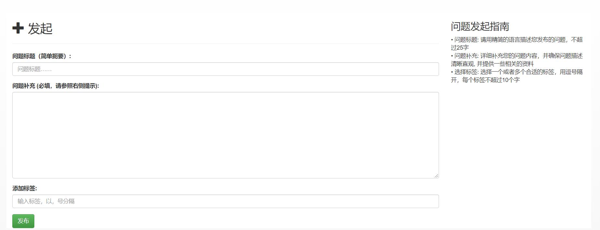
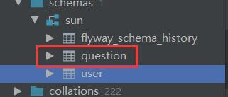
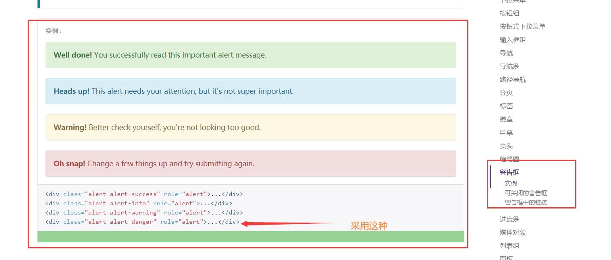
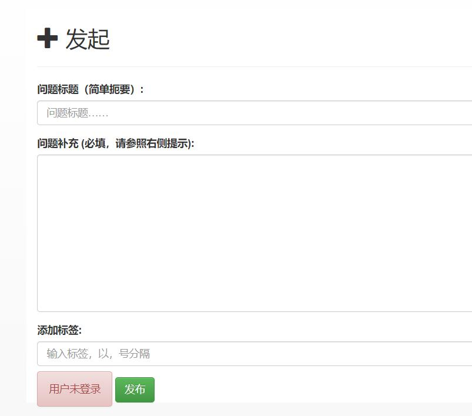
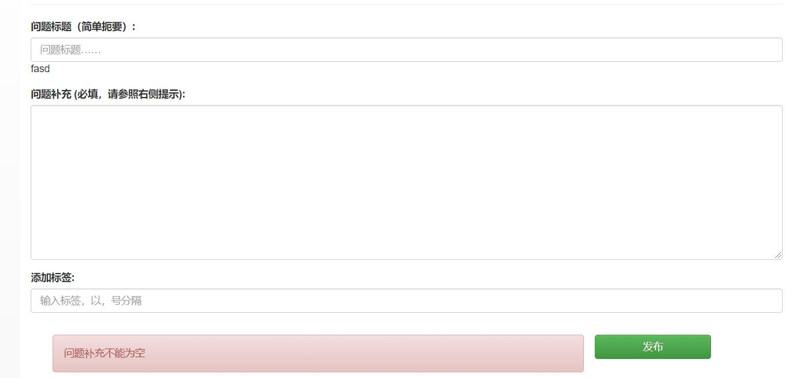

<!--
 * @Author: 孙浩然
 * @Date: 2020-05-22 09:02:47
 * @LastEditors: 孙浩然
 * @LastEditTime: 2020-06-02 08:58:58
 * @FilePath: \docs\10.project\07-回复与评论.md
 * @博客地址: 个人博客，如果各位客官觉得不错，请点个赞，谢谢。[地址](https://codefool0307.github.io/JavaScholar/#/)
--> 
# 7 博客功能

## 7.1 文章发布

### 7.1.1 对问题框设计服务端程序
因为之前完成了关于发起问题的页面设计



那么应该需要什么内容呢？仿照ES设置回复数和浏览数，点赞数等功能

首先创建question的数据库，V3__Create_question_table

创建完成之后，放在了db的V3

```java
create table question
(
    id int auto_increment primary key,
    title varchar(50),
    description text,
    gmt_create bigint,
    gmt_modified bigint,
    creator int,
    comment_count int default 0,
    view_count int default 0,
    like_count int default 0,
    tag varchar(256)
);
```
之后mvn flyway:migration



那么生成完毕之后，
然后开始写数据库文件，创建一个questionmapper

同时写question类

```java
public class Question implements Serializable {

    private Integer id;
    
    private String title;
    
    private String description;
    
    private Long gmtCreate;
    
    private Long gmtModified;
    
    private Integer creator;
    
    private Integer commentCount;
    
    private Integer viewCount;
    
    private Integer likeCount;
    
    private String tag;
```
注：直接使用的是EasyCode插件可以自动生成

```java
@Mapper
public interface QuestionMapper {
     @Insert("insert into question(title,description,gmt_modified,creator,tag) values (#{title},#{description},#{gmtCreate},#{gmtModified},#{creator},#{tag})")
    public void create(Question question);

}
```
之后，在public.html中对页面进行设置变量


在public  54行<form action="">写入/public，然后method=post，

注意：get渲染页面，post执行请求

```js
  <form action="/public" method="post">
                        <div class="form-group">
                            <label for="title">问题标题（简单扼要）:</label>
                            <input type="text" class="form-control" id="title" name="title"
                                   placeholder="问题标题……">
                        </div>
```

之后再publicController中再次创建一个方法，主要是针对于public.html来接收页面发来的请求

```java
@Controller
public class PublishController { 
     
@Autowired
    private QuestionMapper questionMapper;

@GetMapping("/publish")
    public String publish(Model model) {
        model.addAttribute("tags", TagCache.get());
        return "publish";
    }
@PostMapping("/publish")
    public String doPublish(
            @RequestParam(value = "title") String title,
            @RequestParam(value = "description") String description,
            @RequestParam(value = "tag") String tag，
            ) {
                 return "publish";}
```
之后再都dopublish中添加question的详细细节

```java
        Question question = new Question();
        question.setTitle(title);
        question.setDescription(description);
        question.setTag(tag);
```      
  
但是如何获取user呢，是通过IndexController方式的方式来获取

```java
 Cookie[] cookies = request.getCookies();
    for (Cookie s : cookies) {
        if (s.getName().equals("token")){
            String token = s.getValue();
            User user=userMapper.findByToken(token);
            if (user!=null){
                request.getSession().setAttribute("user",user);
            }
            break;
        }
```

那么这样之后，就要在参数里面注入HttpServletRequest

```java
 public String dopublish(
            @RequestParam("title") String title,
            @RequestParam("description") String description,
            @RequestParam("tag") String tag,
            HttpServletRequest httpServletRequest,
    ){

        return "public";
    }
```

同时如果我想把服务端的东西传入到页面，那么我就必须写入model中，

```java
  @PostMapping("/public")
    public String dopublish(
            @RequestParam("title") String title,
            @RequestParam("description") String description,
            @RequestParam("tag") String tag,
            HttpServletRequest httpServletRequest,
            Model model
    ){

        return "public";
    }
```

这样既可以往页面写东西了


```java
User user = null;

Cookie[] cookies = request.getCookies();
    for (Cookie s : cookies) {
        if (s.getName().equals("token")){
            String token = s.getValue();
            User user=userMapper.findByToken(token);
            if (user!=null){
                request.getSession().setAttribute("user",user);
            }
            break;
        }
    }

        if (user == null) {
            model.addAttribute("error", "用户未登录");
            return "publish";
        }
```

那么整个程序就可以写为：

```java
@PostMapping("/public")
    public String dopublish(
            @RequestParam("title") String title,
            @RequestParam("description") String description,
            @RequestParam("tag") String tag,
            HttpServletRequest request,
            Model model
    ){

        User user=null;
        Cookie[] cookies = request.getCookies();
        for (Cookie s : cookies) {
            if (s.getName().equals("token")){
                String token = s.getValue();
                user=userMapper.findByToken(token);
                if (user!=null){
                    request.getSession().setAttribute("user",user);
                }
                break;
            }
        }
        //如果user没有登录就失败
        if (user ==null){
            model.addAttribute("error","用户未登录");
            return "public";
        }

        Question question = new Question();
        question.setTitle(title);
        question.setDescription(description);
        question.setTag(tag);
        question.setCreator(user.getAccountId());
        question.setGmtCreate(System.currentTimeMillis());
        question.setGmtModified(question.getGmtCreate());
        //为什么需要一个create方法呢？
        questionMapper.create(question);
        return "redirect:/";
    }
}
```

为了实现能够显示错误信息，那么我们需要在public.html中根据boostrap的找到[警告框](https://v3.bootcss.com/components/#alerts)




开始修改public.html文件

```js

<span class="alert alert-danger" th:text="${error}"></span>
                        <button type="submit" class="btn btn-success">
                            发布
                        </button></form></div>

                <div class="col-lg-3 col-md-12 col-sm-12 col-xs-12">
                    <h3>问题发起指南</h3>
                    • 问题标题: 请用精简的语言描述您发布的问题，不超过25字 <br>
                    • 问题补充: 详细补充您的问题内容，并确保问题描述清晰直观, 并提供一些相关的资料<br>
                    • 选择标签: 选择一个或者多个合适的标签，用逗号隔开，每个标签不超过10个字<br>
                </div>
```

那么运行程序

结果如下：



但是这样展示也不是太好看，为了更好地展示一下，开始进行相应的的调整，首先进行的是：

```js
<div class="container-fluid main">
                            <div class="row">
                        <div class="alert alert-danger col-lg-9 col-md-12 col-sm-12 col-xs-12" th:text="${error}"></div>
                                <div class="col-lg-3 col-md-12 col-sm-12 col-xs-12">
                                    <button type="submit"
                                            class="btn btn-success col-lg-9 col-md-12 col-sm-12 col-xs-12">
                                        发布
                                    </button>
                                </div>
                                </div></div></form></div>
```

当点击登录后，会出现问题，登录标志消失了，所以需要去AuthrizeController中进行修改：

```java

if (githubuser!=null && githubuser.getId()!=null){
```

对页面没有错误信息不进行展示


### 7.1.2 增加发布按钮，并且设置服务端程序

在index.html中增加发布按钮，并放置到public.html中,运行程序

```js
<li th:if="${session.user}!=null">
                    <a href="/public">
                        发布
                    </a>
</li>
```

但是这样添加增加了太多的工作量，为了减少无用功，之后会学习一个插件，

### 7.1.2 问题框的信息如何保存

工作前，当页面点击完发布以后，发布的信息是没有的，如何添加呢

1. 当出现页面问题，信息依然可以保留，使用model解决
2. 对html的相关配置进行改善
3. 对错误信息进行校验

```java
@PostMapping("/public")
    public String dopublish(
            @RequestParam("title") String title,
            @RequestParam("description") String description,
            @RequestParam("tag") String tag,
            HttpServletRequest request,
            Model model
    ){
        model.addAttribute("title", title);
        model.addAttribute("description", description);
        model.addAttribute("tag", tag);

        if (title ==null || title=="") {
            model.addAttribute("error", "标题不能为空");
            return "public";
        }
        if (description ==null || description=="") {
            model.addAttribute("error", "问题补充不能为空");
            return "public";
        }
        if (tag ==null || tag=="") {
            model.addAttribute("error", "标签不能为空");
            return "public";
        }
```
```js

<form action="/public" method="post">
                        <div class="form-group">
                            <label for="title">问题标题（简单扼要）:</label>
                            <input type="text" class="form-control" th:text="${title}" id="title" name="title"
                                   placeholder="问题标题……">
                        </div>
                        <div class="form-group">
                            <label for="title">问题补充 (必填，请参照右侧提示):</label>
                            <textarea name="description" id="description"
                                      class="form-control"
                                      th:text="${description}"
                                      cols="30"
                                      rows="10"></textarea>
                        </div>
                        <div class="form-group">
                            <label for="tag">添加标签:</label>
                            <input type="text" class="form-control" th:text="${tag}" id="tag" name="tag"
                                   placeholder="输入标签，以，号分隔">
                            </div>
```

运行，点击



但是这样会出现一个显示位置不太正确，那么为了解决这个问题关键在于：在html中标签不正确


1. 改为th：value就可以了
2. 对参数进行增加变量

```js
<!-- 对展示框的三部分进行展示并且保留数据-->
                    <form action="/public" method="post">
                        <div class="form-group">
                            <label for="title">问题标题（简单扼要）:</label>
                            <input type="text" class="form-control" th:value="${title}" id="title" name="title"
                                   placeholder="问题标题……">
                        </div>
                        <div class="form-group">
                            <label for="title">问题补充 (必填，请参照右侧提示):</label>
                            <textarea name="description" id="description"
                                      class="form-control"
                                      th:value="${description}"
                                      cols="30"
                                      rows="10"></textarea>
                        </div>
                        <div class="form-group">
                            <label for="tag">添加标签:</label>
                            <input type="text" class="form-control" th:value="${tag}" id="tag" name="tag"
                                   placeholder="输入标签，以，号分隔">
                            </div>
```

```java
@RequestParam(value = "title", required = false) String title,
            @RequestParam(value = "description", required = false) String description,
            @RequestParam(value = "tag", required = false) String tag,
```


### 7.1.3 头像展示

#### 7.1.3.1 数据库头像

为了添加一个头像，那么就需要去去db中添加一个头像的属性

那么为了快速添加：

创建一个V4xxxx.sql的文件

```sql
alter table user add avatar_url varchar(100) null;
```

事后通过mvn flyway:migration运行

这样就生成了一个变量


注：为什么有时候不执行呢？

一定是大写V 数字递增并且两个下划线注意注意

同时还需要在User方法中添加属性

```java
private String avatarUrl;
```

但是呢，这种添加方法太过于麻烦，还得写get/set等等，

#### 7.1.3.2 Lombok简化类的处理

由于之前的类执行太麻烦，引入了[Lombok](https://projectlombok.org/setup/maven)

1. 引入maven

```java
<dependencies>
	<dependency>
		<groupId>org.projectlombok</groupId>
		<artifactId>lombok</artifactId>
		<version>1.18.12</version>
		<scope>provided</scope>
	</dependency>
</dependencies>
```

2. 导入@Data

   * 在AccessTokenDTO、Question、User加入

   * 同时在User、GihubUser设置avatar_url属性
      那么既然在user等添加了字段，想一下还需要在哪里添加字段呢？

```java
@Mapper
public interface UserMapper {
    @Insert("insert into user(name,account_id,token,gmt_create,gmt_modified,avatar_url) values (#{name},#{accountId},#{token},#{gmtCreate},#{gmtModified},#{avatar_url})")
    void insert(User user);
    @Select("select * from user where token=#{token}")
    User findByToken(String token);
}
```
注：在usermapper放入属性，这样就可以让数据库获取到了，但是如何获取user的值呢？那么就需要去github获取，那么就需要使用gihubUser类，添加avatar_url属性

同时在AuthorizedController中设置

```java
user.setAvatar_url(githubuser.getAvatar_url());
```

#### 7.1.3.3 页面删除所有的cookie

一旦删除之后，会出现  No message avaliable的报错问题，会出现一个空指针异常

为了解决这个问题，在测试中发现，可能是因为页面没有cookie信息，如果没有了cookie直接运行，那么就是获取不到的

```java
@Controller
public class IndexController {
    @Autowired
    private UserMapper userMapper;

@GetMapping("/")
    public String index(HttpServletRequest request){
    Cookie[] cookies = request.getCookies();
    if (cookies!=null && cookies.length!=0){
        for (Cookie s : cookies) {
            if (s.getName().equals("token")){
                String token = s.getValue();
                User user=userMapper.findByToken(token);
                if (user!=null){
                    request.getSession().setAttribute("user",user);
                }
                break;
            }
        }
    }

    return "index";
}
}
```

### 7.1.4 完成首页问题列表功能

#### 7.1.4.1 布局服务器设置

##### 7.1.4.1.0 综述

在第二部分完成了关于首页当中栏目设计，那么就需要在服务端进行相对应的设计

那么开始分析一下逻辑：

1. 首先我们需要访问的就是indexContorller，通过对IndexController中<font color=red>检验登录状态</font>，检验完成后，跳转到相对应的首页页面
2. 如果想在页面返回之前在页面上显示数据，那么我们需要在返回index页面之前进行查询（如何在页面显示就需要使用model属性）

##### 7.1.4.1.1 获取问题栏目

1. 首先对于question中的所有字段导入数据库操作，就需要需要一个qustionmapper进行操作,之后在questionmapper中加入一个实现方法

```java
@Mapper
public interface QuestionMapper {
     @Insert("insert into question (title,description,gmt_create,gmt_modified,creator,tag) values (#{title},#{description},#{gmtCreate},#{gmtModified},#{creator},#{tag})")
    public void create(Question question);
    @Select("select * from question")
    List<Question> list();
}
```

2. 那么就可以在服务端，将数据库获取的信息传输到页面中

```java
@Controller
public class IndexController {
    @Autowired
    private UserMapper userMapper;

    @Autowired
    private QuestionMapper questionMapper;
@GetMapping("/")
    public String index(HttpServletRequest request,
                        Model model){
    Cookie[] cookies = request.getCookies();
    if (cookies!=null && cookies.length!=0){
        for (Cookie s : cookies) {
            if (s.getName().equals("token")){
                String token = s.getValue();
                User user=userMapper.findByToken(token);
                if (user!=null){
                    request.getSession().setAttribute("user",user);
                }
                break;
            }
        }
    }
    List<Question> questionList = questionMapper.list();
    model.addAttribute("question",questionList);
    return "index";
}
}
```

<font color=red size='6'>问题1：</font>

但是呢，虽然question定义了很多属性，但是没有头像，如何获取头像，就需要user，而user表中的creator与question类creator相同，那么就要把question类creator关联到user表的id，这样question就可以拿到user的头像属性

需要在question加入user对象，那问题就是不需要有user对象这个概念的

需要用dto——————传输层，增加一个QuestionDTO，并加入user属性

```java
@Data
public class QuestionDTO {
    private Long id;
    private String title;
    private String description;
    private String tag;
    private Long gmtCreate;
    private Long gmtModified;
    private Long creator;
    private Integer viewCount;
    private Integer commentCount;
    private Integer likeCount;
    private User user;
}
```
这样，我们就需要在在indexContorller中返回questionDTO，

```java
List<QuestionDTO> questionlist = qestionMapper.list();
```
<font color=red size='6'>问题2：</font>

但是questionmapper针对question，不会依赖user，那么需要service，

在service中不仅可以使用questionmapper也可以使用usermapper，起到组装作用——>这样就会使得我既可以使用questionmapper的方法也可以使用usermapper的方法

1. 需要把信息这样就嵌入到model里面

一、对问题栏的所有的creator来获取user，把user信息放入到questionDTO中

注：为什么要放入questionDTO

```java
@Service
public class QuestionService {
    @Autowired
    private QuestionMapper questionmapper;
    @Autowired
    private UserMapper userMapper;


    public List<QuestionDTO> list() {
        List<Question> question = questionmapper.list();
        List<QuestionDTO> questionDTOList = new ArrayList<>();
        for (Question questions : question) {
              User user = userMapper.findId(questions.getCreator());
            QuestionDTO questionDTO = new QuestionDTO();
            //需要把所有的question转换为questionmapper
            BeanUtils.copyProperties(questions,questionDTO);
            questionDTO.setUser(user);
            questionDTOList.add(questionDTO);
        }
    }
```

```java
@Mapper
public interface UserMapper {
    @Insert("insert into user(name,account_id,token,gmt_create,gmt_modified,avatar_url) values (#{name},#{accountId},#{token},#{gmtCreate},#{gmtModified},#{avatar_url})")
    void insert(User user);
    @Select("select * from user where token=#{token}")
    User findByToken(String token);

    //本次添加
    @Select("select * from where id=#{id}")
    User findId(@Param("id") Integer id);
}
```
这样我就在就把信息这样就嵌入到model里面了。但是怎么在index里面进行展示呢

之后到index.html中写入一个js循环


可能驼峰标识可能存在问题，在这种基础上就需要进行修改了

那么就需要去mybastis官方文档中查看


mybatis.configuration.map-underscore-to-camel-case=true


那么查看断点已经可以使用了

页面上时间显示，如何解决

查看spring末班

查找format查看时间


删掉测试输出栏目


这样就可以正常显示了


这样就可以显示到页面上去了

### 7.1.5 热启动

由于调试过程中自己调试都需要重启服务。太麻烦，那么我们就可以使用

改动一点东西就需要重启，这样太漫长了。spring devloper Tools
自动重启的工具

引入依赖，就可以自动重启了，


重启项目
修改一个东西


这样rebuild  设置自动编译


三个键+？

找到complier  when  app  running  勾选，
改个

自动运行


liveRel,作用是干啥呢，自动刷新的作用。

在google
中加入liveRel中，点击就可以更新了


## 7.2 回复


## 7.3 评论