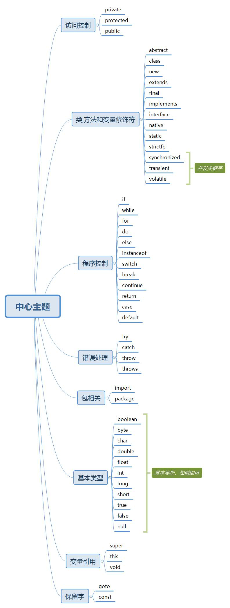
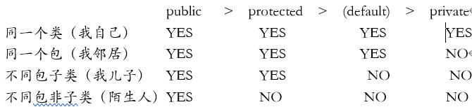
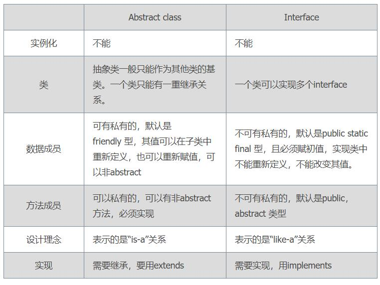

<!--
 * @Author: 孙浩然
 * @Date: 2020-04-15 22:09:19
 * @LastEditors: 孙浩然
 * @LastEditTime: 2020-07-02 10:41:40
 * @FilePath: \Java-Point\docs\1.basics\1.java-basic\3-关键字.md
 * @博客地址: 个人博客，如果各位客官觉得不错，请点个赞，谢谢。[地址](https://codefool0307.github.io/JavaScholar/#/)
--> 
# 3 关键字

## 3.0 关键字综述

## 3.1 访问控制

主要是应用于类、方法或者字段上。可以进行信息保护的作用。

注意：private修饰的关键字我可以通过反射访问到，那么private有啥意义？详见面经

## 3.2 类、方法和 变量修饰符

### 3.2.1 abstract关键字和interface关键字(在笔试选择高频)

Abstract和interface是支持抽象类定义的两种机制。正是由于这两种机制的存在，才赋予了Java强大的面向对象能力。abstract和interface之间在对于抽象类定义的支持方面具有很大的相似性，区别：

### 3.2.9 static关键字

### 3.2.12 transient关键字

静态优先于非静态加载到内存中(静态优先于对象进入到内存中)
被static修饰的成员变量不能被序列化的,序列化的都是对象
        private static int age;
        oos.writeObject(new Person("小美女",18));
        Object o = ois.readObject();
        Person{name='小美女', age=0}
    
transient关键字:瞬态关键字
  被transient修饰成员变量,不能被序列化
   private transient int age;
   oos.writeObject(new Person("小美女",18));
   Object o = ois.readObject();
   Person{name='小美女', age=0}

