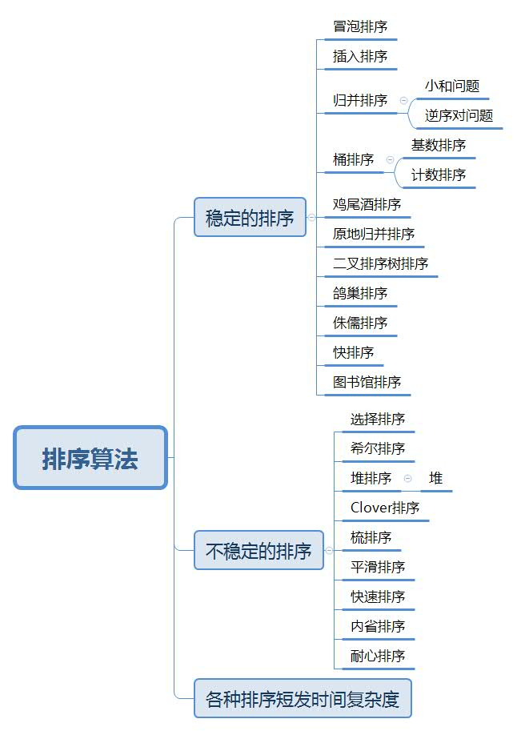
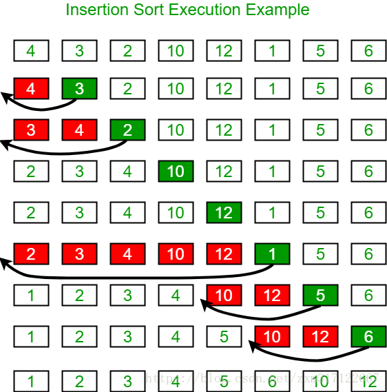
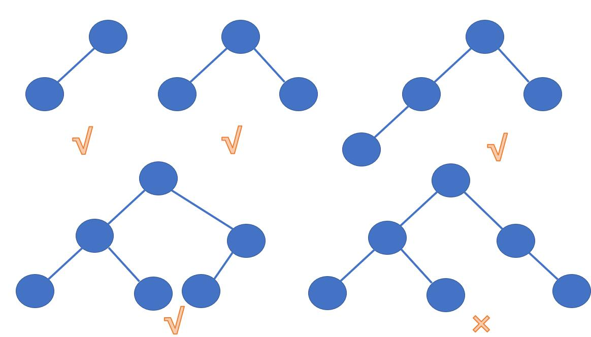

# 9 排序算法
## 9.0 排序算法综述


## 9.1 冒泡排序

冒泡排序是最原始的排序算法，其主导思想就是：

1. 第一趟排序，第1个和第2个比较，比较完成之后，交换两者顺序，第2个和第三个比较，比较完成之后，交换两者顺序...直到比较到最后一个数值，这样最后一个数值就在最后一位了
2. 那你的最后一位已经定了，那就在从确定n-1位确定就好了

关键在于：

1. 两两比较怎么做？
2. 如何做到长度控制？


```java
public class BubbleSort {
    public static void main(String[] args) {
          int[] arr={2,4,1,7,5,3,9};
          sort(arr);
        for (int i = 0; i < arr.length; i++) {
            System.out.print(arr[i]+"\t");
        }
    }

    public static void sort(int[] arr){
        if (arr==null || arr.length<2){
            return;
        }
        //第一个循环主要是进行0~N-1，0~N-2.......
        for (int i = arr.length-1; i >0; i--) {
            //在0~x之间进行遍历两两比较
            //  01  12  23  34  45  
            for (int j = 0; j < i; j++) {
                if (arr[j]>arr[j+1]){
                    swap(arr,j,j+1);
                }
            }
        }
    }
    public static void swap(int[] arr,int i,int j){
        int temp=arr[i];
        arr[i]=arr[j];
        arr[j]=temp;
    }
}
```

## 9.2 选择排序
基本思路：假设数组为 [1....n]，每一趟，<font color=red>选择一个值</font>与<font color=red>数组剩下的值</font>进行比较，<font color=#2fe32>互换最小值的索引</font>并<font color=#f7873>交换</font>

```java
public class SelectSort {
    public static void main(String[] args) {
        int[] arr={2,4,1,7,5,3,9};
        sort(arr);
        for (int i = 0; i < arr.length; i++) {
            System.out.print(arr[i]+"\t");
        }
    }
    public static void sort(int[] arr){
        for (int i = 0; i < arr.length; i++) {
            int min=i;
            for (int j = i+1; j < arr.length ; j++) {
                min =arr[min] < arr[j]?min:j;
            }
            swap(arr,i,min);
        }
    }
    public static void swap(int[] arr,int i,int j){
        int temp=arr[i];
        arr[i]=arr[j];
        arr[j]=temp;
    }
}
```


## 9.3 插入排序

基本思路：左看看右看看
假设数组为 [1....n]，选出一个数值与<font color=green>左侧的值</font><font color=blue>比较交换</font>直到<font color=red>越界为止</font>


此图借鉴了这位大佬的辛苦劳作，再次说明
https://blog.csdn.net/zxm317122667/article/details/83344178


```java
ublic class InsertionSort {
    public static void main(String[] args) {
        int[] arr={2,4,1,7,5,3,9};
        Sort(arr);
        for (int i = 0; i < arr.length; i++) {
            System.out.print(arr[i]+"\t");
        }
    }
    public static void Sort(int[] arr){
        //第一个for循环是找到一个基准数值
        for (int i = 1; i < arr.length; i++) {
            //第二个for循环是把基准书左侧的所有数值进行比较并交换
            for (int j = i-1; j >= 0 && arr[j]>arr[j+1]; j--) {
                swap(arr,j,j+1);
            }
        }
    }
    public static void swap(int[] arr,int i,int j){
        int temp=arr[i];
        arr[i]=arr[j];
        arr[j]=temp;
    }
}
```

## 9.4 归并排序

### 9.4.1 整体思路

左边排序，右边排序--->整体排序

1. 首先将数组分割，分为左右两部分
2. 对每一部分利用指针的思想，进行比较排序
3. 堆排序好的数组放置在辅助数组中，最后放置到原数组


### 9.4.2 leetcode 912

```java
class Solution {
   public int[] sortArray(int[] nums) {
          if (nums==null || nums.length<2){
              return nums;
          }
        process(nums,0,nums.length-1);
        return nums;
    }
    public void process(int[] nums,int L ,int R){
        if (L==R){
            return;
        }
        int mid=L+((R-L)>>1);
        process(nums,L,mid);
        process(nums,mid+1,R);
        merge(nums,L,R,mid);
    }

    public void merge(int[] nums,int L,int R,int mid){
        int p1=L;
        int p2=mid+1;
        int[] help = new int[R-L+1];
        int i=0;

        while(p1<=mid && p2<=R){
            help[i++]=nums[p1]<=nums[p2]?nums[p1++]:nums[p2++];
        }
        while(p1<=mid){
            help[i++]=nums[p1++];
        }
        while(p2<=R){
            help[i++]=nums[p2++];
        }

        for (int j = 0; j < help.length; j++) {
            nums[L+j]=help[j];
        } 
    }
}
```

1. 注意一旦数组的区间超过范围会出现以下错误：

```java
java.lang.ArrayIndexOutOfBoundsException: Index 4 out of bounds for length 4
  at line 22, Solution.merge
  at line 14, Solution.process
  at line 13, Solution.process
  at line 4, Solution.sortArray
  at line 54, __DriverSolution__.__helper__
  at line 84, __Driver__.main
```

2. 那么这个复杂度是怎样的呢？

首先就利用递归的公式了

T(N) = 2T（N/2）+o(N)

log(2,2)=1,则复杂度为O（NlogN）


### 9.4.3 归并排序扩展——小和问题

定义：在一个数组中，每一个数左边比当前数小的数累加起来，叫做这个数组的小和

例如：一个数组[1,3,4,2,5] ,1右边比1大的有4个，就记录4个1（4x1）以此类推

```java
package Sort;
public class Demo200809_MergeSort_xiaohe {
    public static void main(String[] args) {
        int[] arr={1,3,4,2,5};
        int i = mergesort(arr);
        System.out.println(i);
    }

    public static int mergesort(int[] nums){
        if (nums==null || nums.length<2){
            return 0;
        }
       return process(nums,0,nums.length-1);
    }
    public static int process(int[] nums,int L,int R){
       if (L==R){
           return 0;
       }
       int mid=L+((R-L)>>1);
       return process(nums,L,mid)+process(nums,mid+1,R)+merge(nums,L,R,mid);
    }
    public static int merge(int[] nums,int L,int R,int mid){
        int p1=L;
        int p2=mid+1;
        int i=0;
        int[] help = new int[R-L+1];
        int res=0;

        while(p1<=mid && p2<=R){
            //因为左侧指针<右侧指针，那么左侧指针<右侧所有的数
            //为什么呢？因为层级排序中，底层已经排序完成了，
            //比如说 7 2 3 6 8 3 4 9
            //  7 2 3 6 ---->  7 2  和   3  6 ----> 7和2    3和6
            //这样7与2比较 7比2大，不用，没有小和，交换
            //3和6,3<6,那么3与6就不进行交换了
            //一次进行递增就好了
         res += nums[p1]<nums[p2]?(R-p2+1)*nums[p1]:0;
         help[i++]=nums[p1]<nums[p2]?nums[p1++]:nums[p2++];
        }

        while(p1<=mid){
            help[i++]=nums[p1++];
        }

        while(p2<=R){
            help[i++]=nums[p2++];
        }

        for (int j = 0; j < help.length; j++) {
            nums[L+j]=help[j];
        }
        return res;
    }
}

```


### 9.4.4 归并排序扩展——逆序对

之后补充代码

## 9.5 堆排序

### 9.5.1 堆原理

~~堆结构就是用数组实现的完全二叉树结构~~

这样看，太啰嗦了，就这么说吧，你可以把堆想象成完全二叉树，但是实际上，它是一个数组

什么是完全二叉树，可以查看[二叉树](./3-二叉树.md)

但是，说一下完全二叉树的简单易学的概念：从左到右<font color="#FF0000">依次</font>变满的，如图：



一定要记得是从左到右依次填满，才可以的！！！！！

这个只不过是一个理想的形式

比如说一个数组

6 4 8

那么我们就把他想象成一个完全二叉树

那么二叉树就如下下面这个动图


那么通过这个图我们发现了一个规律：
父节点：(i-1)/2
左孩子：2*i+1
右孩子：2*i+2

那么是通过 有效区 这个概念来进行控制他的范围的

根据这两概念，比如说这个数组，如果有效区是size=3，

那么我们肯定6是头节点，那么哪个是他的左孩子根据公式就是2*i+1--->数组坐标是1的元素


好了，那么我么通过堆就发现了这么两个概念

1. 父子关系，建立父子关系
2. 有效区，控制范围


那么想到堆，就会想到<font color="#FF0000">大根堆</font>与<font color="#FF0000">小根堆</font>

那么什么是大根堆呢：

每一颗子树的最大值一定是子树的头节点，并且扩展到整个二叉树中才能是大根堆，如：


本次主要介绍大根堆方式

开始进入正题，

还是以上面的例子为主，由于左右两个孩子是4和8，但是他确实不是大根堆，我就想把它变成大根堆，怎么变呢？

就把孩子与父节点进行交换


假设上面这个数组，添加了几个元素

6 4 8 5 9

那么继续按照上面的思路，


那么规定这个过程就是<font color=red size='5'>heapinsert过程</font>

当前节点与父节点进行比较

```java
public static void heapInsert(int[] arr,int index){
        while(arr[index]>arr[(index-1)/2]){
            swap(arr,index,(index-1)/2);
            index=(index-1)/2;//停止的关键在于idnex为0，
                              //并且不在大于了
        }
    }
```

如果出现在某个位置元素突然发生变化，那么我们就需要先比较左右孩子，再根据最大的孩子与父节点进行比较

```java
public static void heapify(int[] arr,int index,int size){
        int left=2*index+1;
        //左孩子小于size，右孩子不一定小于size，主要是防止右孩子越界
        while(left<size){
            //两个孩子比较，但是一定要保证不越界
            int largest= left+1 < size && arr[left+1]>arr[left]
                    ? arr[left+1]
                    : arr[left];
            //最大的孩子与父进行比较
            largest=arr[largest]<arr[index]?index:largest;
            if (largest==index)break;
            //互换元素
            swap(arr,index,largest);
            //然后，不断往上走
            index=largest;
            left=2*index+1;
        }
    }
```


那么堆排序就是思路：
1. 首先变成大根堆，但是呢无法完成左右孩子的大小判断
2. 开始解决左右孩子无法判断的问题---采用heapify并且缩小范围方案
   


```java
package Sort;
import java.util.Arrays;
public class Demo200811_HeapSort {
    public static void main(String[] args) {
          int[] a={1,4,0,2,7};
        System.out.println(Arrays.toString(a));

        heapsort(a);

        System.out.println(Arrays.toString(a));

    }

    public static void heapsort(int[] nums){
        if (nums==null ||nums.length<2){
            return;
        }
         //变成大根堆
        for (int i = 0; i < nums.length; i++) {
            HeapInsert(nums,i);
        }
        //左右两个孩子怎么比较呢？
        int size=nums.length;
        swap(nums,0,--size);
        while (size>0){
            Heapify(nums,0,size);
            swap(nums,0,--size);
        }
    }


    //把数组排序成大根堆的形式
    public static void HeapInsert(int[] nums,int index){
        while (nums[index]>nums[(index-1)/2]){
            swap(nums,index,(index-1)/2);
            index=(index-1)/2;
        }

    }
    //数组改变的话，进行判断
    public static void Heapify(int[] nums,int index,int heapsize){
        int left=2*index+1;

        while(left<heapsize){
            //比较左右两个孩子哪个大哪个小
            int max=nums[left]<nums[left+1] && left+1<heapsize
                    ?left+1
                    :left;//为什么是这种写法？
            //那么较大值，就可以与父节点进行比较了
            max=nums[max]>nums[index]?max:index;

            //但是如果父子相等，那么退出就好了
            if (max==index) {break;}

            //然后比较完成后开始互换元素
            swap(nums,index,max);

            //这样连接起来
            index=max;     //看箭头方向确定左右侧
            left=2*index+1;
        }
    }

    public static void swap(int[] nums,int i,int j){
        int temp=nums[i];
        nums[i]=nums[j];
        nums[j]=temp;
    }
}


```

## 9.6 快速排序

### 9.6.1 荷兰国旗问题

首先让我们先学习一下荷兰国旗问题：

针对一个数组arr，给定一个区分值num，将其分为了小于等于num区域放在左边，大于num区域放在右边

主要原则就是：
1. 当前数≤区分值
&emsp;当前数与≤区下一个数换
&emsp;≤区右移，指针右移
2. 当前数>区分值
&emsp;≤区不动，指针右移


那么这样就使得，区分值左右分离了-------->左侧小于，右侧大于

继续升级，

针对一个数组arr，给定一个区分值num，将其分为了小于num区域放在左边，等于num区域放在中间，大于num区域放在右边

1. 当前数<区分值
 &emsp;当前数与≤区下一个数换
 &emsp;≤区右移，指针右移
2. 当前数=区分值
   指针直接跳下一个
3. 当前数>区分值
&emsp;当前数与>区前一个数换
 &emsp;>区左移，指针不动

 

只要小于，就可以继续前进
只要大于，就看对方运动


```java
public static int[] partition(int[] arr,int L,int R,int p){
        int less=L-1;//<区域的边界
        int more=R+1;//>区域的边界
        int index=L;//用index来表示指针
        while (index<more){
            if (arr[index]<p){
                swap(arr,index++,++less);
            }if(arr[index]>p){
                swap(arr,index,--more);
            }else {
                index++;
            }
        }
        return new int[]{less+1,more-1};//记录等于区域的左右边界
    }
```


快排的主要思路就是

那么这个<font color=red>数</font>就有好几种选择方式，

方式1. 选择最后一个数作为区分值，就是上面这个程序
方式2. 选择有边界作为区分值，每次都是右边界
方式3. 随机选择一个数，复杂度为O（N*logN）

```java
public class QuickSort {
    public static void main(String[] args) {
        int[] arr={3,6,1,4,4,6,2,8,3,8,10};
        quicksort(arr);
        System.out.println(Arrays.toString(arr));
    }

    public static void quicksort(int[] arr){
        if (arr==null || arr.length<2){
            return;
        }
        process(arr,0,arr.length-1);
    }
    public static void process(int[] arr,int L,int R){
     if (L<R){
         swap(arr, L+(int) (Math.random()*(R-L+1)),R);//把选出来的数值放在最后
         int[] p = partition2(arr, L, R);
         process(arr,L,p[0]-1);
         process(arr,p[1]+1,R);
     }

    }
    public static int[] partition2(int[] arr,int L,int R){
        int less=L-1;
        int more=R;
        while (L<more){
            if (arr[L]<arr[R]){
                swap(arr,++less,L++);
            }else if(arr[L]>arr[R]){
                swap(arr,--more,L);
            }else {
                L++;
            }
        }
        swap(arr,more,R);//交换的目的是把随机选择的数给换回来
        return new int[]{less+1,more};
    }
    public static void swap(int[] arr,int i,int j){
        int temp=arr[i];
        arr[i]=arr[j];
        arr[j]=temp;
    }
}


```


## 9.7 比较器

比较器在C++是冲在比较运算符，Java中叫比较器

比较器主要是用请详见[4-集合](/1.basics/1.java-basic/4-集合.md)

## 9.8 桶排序

### 9.8.0 综述

桶排序分为了

* <font color=red>计数排序</font>

* <font color=yellow>基数排序</font>

### 9.8.1 计数排序

假设有一个数组arr=[17,23,0,96,17,23],其中所有数据的范围在0~200之间，那么我就创造一个辅助数组help=[],共有201个
元素，

那么我的这个辅助数组不是用来存储数字，而是存储arr某个数字出现的频率，

比如说下图，


这个辅助数组干嘛呢，他就在记录arr每个数字在help数组出现的频率

### 9.8.2 基数排序

基数排序的基本条件：样本是以十进制的非负数

比如说一个数组[13,17,9,23,27,100]，思路：

1. 确定好最大位数，就遍历几遍
2. 根据每位数进行计数排序
3. 确定好<=0元素个数一共有几个，<=1元素个数一共有几个。。。。。。。<=9桶中元素个数
   一共有几个
   * 目的主要是在放入桶的时候，确定好每个桶有几个数值，比如说第2桶，他不就是<=2个数-<=1个数<font color='red'>（后话，不是这一步的目的）</font>
4. 从右→左判断arr原数组中每一个数字个位数数值

```java
public static void radixsort(int[] nums,int L ,int R,int digit){//digit表示最大数一共有几位
        final int raidx=10;//表示十进制

        //表示辅助空间大小
        int[] bucket = new int[R - L + 1];

        int i=0;
        int j=0;

        //第一步、根据最大数个数进行遍历
        for (int d = 1; d <= digit; d++) {
            //第二步、进行计数排序，分别对每个数值的个位放入桶（数组）中，再将十位百位放入
            //首先放入个位，如何放置？
            //那么就靠这个getDigit函数，然后按照计数排序的思路，进行入桶操作
            int[] count = new int[raidx];
            for (i = L; i < R; i++) {
                //开始个位入桶，挨个来吧，27---7，23---3等等
                j = getDigit(nums[i], d);
                //入桶统计
                count[j]++;
            }
            //第三步、入完桶，看看<=0元素个数一共有几个，<=1元素个数一共有几个。。。。。。。<=9桶中元素个数
            for (i = 1; i < raidx; i++) {
                count[i]=count[i]+count[i-1];
            }
            //比如说count桶 [0 1 2 3 4 5 6 7 8 9]
            //    <=0有几个  1 4 6 6 6 6 6 6 6 6


            //第四步、进行排序操作
            //比如说，[022 021 032 031 001 100]
            for (i = R; i >=L ; i--) {
              j = getDigit(nums[i], d); //判断每个数值的数位是多少，比如说001的个位数是1，
              //看看<=1所有的桶中元素个数数量（看上面的for循环），看了看有4个，
              //然后看看他是在哪个范围上（0-3范围（这个范围是根据计数个数确定的）），
              ///而我要倒出元素，就需要先把大范围的数值倒出来，也就是把3倒出来
              bucket[count[j]-1]=nums[i];
              count[j]--;//计数完毕，就消除
            }
            //从桶中放入数组中
            for (i = L,j=0; i <=R ; i++,j++) {
                nums[i]=bucket[j];
            }
        }
    }
    //主要完成的工作就是判断我用的是这个数值的哪一位数字
    //比如说27,给定的d=1，d=2，d=3，
    //那可以判定出他的个位数是7，十位数是2，百位数是0（因为要按照最高位进行补齐操作）
    public static int getDigit(int x,int d){
        //pow函数，是a^b
        return ((x/((int)Math.pow(10,d-1)))%10);
    }
```

注：

再次还有一个问题，你是怎么确定出他是几位数的？

```java


## 9.9 总结

