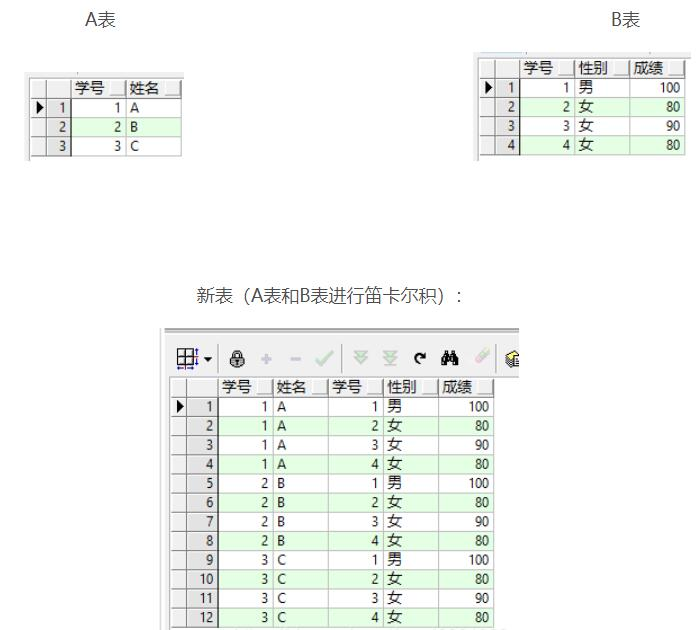
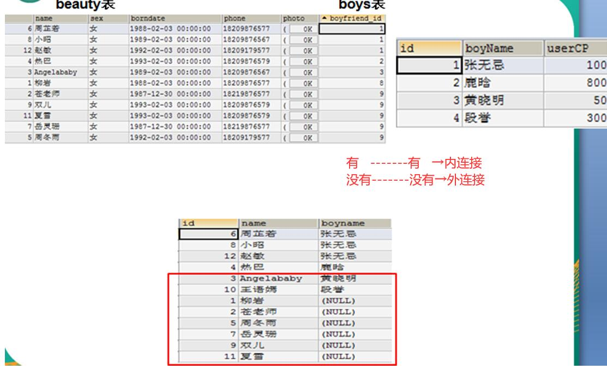
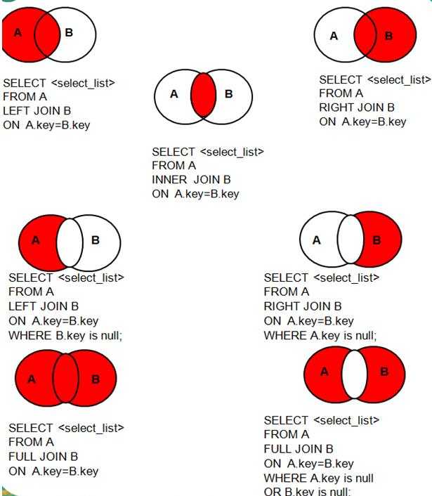

# 3 SQL语句

# 3.0 SQL语句分类

* DDL（Data Definition Language）：数据定义语言，用来定义数据库对象：库、表、列等；如create/drop/alter
* <font color=red ><b>DML（Data Manipulation Language）：数据操作语言，用来定义数据库记录（数据）；</b></font>
* DCL（Data Control Language）：数据控制语言，用来定义访问权限和安全级别；
* <font color=red ><b>DQL（Data Query Language）：数据查询语言，用来查询记录（数据）。</b></font>

通过例子进行的解释


## 3.1 DQL——查询语言

### 3.1.1 语法：

```java
SELECT 
selection_list /*要查询的列名称*/
FROM 
table_list /*要查询的表名称*/
WHERE 
condition /*行条件*/
GROUP BY 
grouping_columns /*对结果分组*/
HAVING 
condition /*分组后的行条件*/
ORDER BY
sorting_columns /*对结果分组*/
LIMIT 
offset_start, row_count /*结果限定*/
```

### 3.1.2 功能：

#### 3.1.2.1 基础查询

select 查询列表 from 表名;

注：

1. select 查询列表  类似于System.out.println(打印内容)，但是System.out.println()的打印内容，只能有一个。

2. select后面跟的查询列表，可以有多个部分组成，中间用逗号隔开例如：select 字段1,字段2,表达式 from 表;

3. 执行顺序:① from子句② select子句

4. 查询列表可以是：字段、表达式、常量、函数等

```java

USE myemployees;

# 1.查询常量

SELECT 100;

# 2.查询表达式

SELECT 100%5;

# 3 查询字段
# 3-1.查询单个字段

SELECT `last_name` FROM `employees`;

# 3-2.查询多个字段

SELECT  `first_name`, `last_name` FROM `employees`;

# 3-3. 查询所有的字段

SELECT * FROM `employees`;# 注意：使用F12进行对齐

# 4.查询函数

SELECT DATABASE();
SELECT VERSION();

# 5.起别名

# 5-1 as关键字

SELECT `last_name` AS "姓  名" FROM `employees`;

# 5-2 空格

SELECT `last_name`  "username" FROM `employees`;

# 6.拼接

SELECT CONCAT(`last_name`,`first_name`) "姓名" FROM employees;

# 7. distinct去重

SELECT DISTINCT `department_id` FROM `employees`;

# 8. 查看表格结构

DESC employees;

SHOW COLUMNS FROM employees;

# 9.显示出表employees的全部列，各个列用逗号链接，列头显示 OUT_PUT

SELECT CONCAT(`first_name`,',',`last_name`,',',`email`,',',`phone_number`,',',`job_id`,',',`salary`,',',IFNULL(commission_pct,''))  "OUT_PUT" FROM `employees`; 

# 10.ifnull判断这个元素是否为空

```
注：

1. mysql中将字符型数据强制转换成数值型,如果无法转换，则直接当做0处理'张无忌'+100===>100
2. 其中一个操作数为null，null+100====》 null


#### 3.1.2.2 条件查询

select 查询列表 from  表名 where 筛选条件;

执行顺序：①from子句②where子句③select子句

如：

select last_name,first_name from employees where salary>20000;

注：

1. 按关系表达式筛选

关系运算符：>   <    >=   <=     =       <>(相当于！=，不等于)     

2. 按逻辑表达式筛选

逻辑运算符：and    or   not

```java
# 1.按照关系表达式进行选择

# 1-1 查询部门编号不是100的员工

SELECT * FROM employees WHERE `department_id` <> 100;

# 1-2 查询工资<15000的姓名、工资

SELECT `last_name`,`salary` FROM employees WHERE `salary`<15000;

# 2.按逻辑表达式筛选

# 2-1 查询编号不是50-100之间的员工姓名、部门编号、邮箱

SELECT `last_name`,`department_id`,`email` FROM employees WHERE `department_id`<50 OR `department_id`>100;

# 2-2 查询奖金率》0.03或者员工编号在60-110之间的员工信息

SELECT * FROM employees WHERE `commission_pct`>0.03 OR (`department_id`>=60 AND `department_id`<=100);
```

#### 3.1.2.3 模糊查询

1. like:一般和通配符搭配使用，对字符型数据进行部分匹配查询
   
常见的通配符：
_ 任意单个字符
% 任意多个字符,支持0-多个
like/not like 

2. in：查询某字段的值是否属于指定的列表之内

a  in(常量值1,常量值2,常量值3,...)
a not in(常量值1,常量值2,常量值3,...)

3. between and：判断某个字段的值是否介于xx之间

between and/not between and

4. is null/is not null

```java

#1 like
 
# 1-1 查询姓名中包含字符a的员工信息

SELECT * FROM employees WHERE `last_name` LIKE "%a%";

# 1-2 查询姓名中包含最后一个字符为e的员工信心

SELECT * FROM employees WHERE `last_name` LIKE "%a";

# 1-3 查询姓名中包含第三个字符为x的员工信息

SELECT * FROM employees WHERE `last_name` LIKE "__x%";

# 1-4 查询姓名中包含第二个字符为_的员工信息

SELECT * FROM employees WHERE `last_name` LIKE "_$_%" ESCAPE "$";

#2 in

# 2-1 查询部门编号是30/50/90的员工名、部门编号

SELECT `last_name`,`department_id` FROM employees WHERE `department_id` IN(30,50,90);

# 2-2 查询工种编号不是SH_CLERK或者IT_PROG的员工信息

SELECT * FROM `employees` WHERE `job_id` NOT IN('SH_CLERK','IT_PROG');

#3 between

# 3-1 查询部门编号是30-90之间的部门编号、员工姓名

SELECT `department_id`,`last_name` FROM `employees` WHERE `department_id` BETWEEN 30 AND 90;

# 3-2 查询年薪不是100000-200000之间的员工姓名、工资、年薪

SELECT `last_name`,`salary`,`salary`*12*(1+`commission_pct`) 
FROM `employees`
WHERE `salary`*12*(1+`commission_pct`)  
BETWEEN 100000 AND 2000000;
# 注意运行前后顺序，如果在年薪加入别名，让where 别名，会运行失败，
# 原因在于先运行from→where→select，你的年薪别名是在select

# 4 is null/is not null

#4-1 查询没有奖金的员工

SELECT * FROM `employees` WHERE `commission_pct` IS NULL;
```
注：
1. =		只能判断普通的内容

2. IS              只能判断NULL值

<=>             安全等于，既能判断普通内容，又能判断NULL值

#### 3.1.2.4 排序查询

select 查询列表 from 表名【where 筛选条件】order by 排序列表

执行顺序：①from子句②where子句③select子句④order by 子句

举例：

select last_name,salaryfrom employeeswhere salary>20000order by salary ;

注：

1. 排序列表可以是单个字段、多个字段、表达式、函数、列数、以及以上的组合
2. 升序 ，通过 asc   ，默认行为
   降序 ，通过 desc

```java
# 排序
# 1.单个字段排序——将员工编号>120的员工信息进行工资的升序

SELECT * FROM `employees` WHERE `department_id`>120 ORDER BY salary;

# 2.按照表达式排序——对有奖金的员工，按工资降序

SELECT * FROM `employees` WHERE `commission_pct` IS NOT NULL ORDER BY salary DESC;

# 3.按照别名排序——对有奖金的员工，按年薪降序

SELECT * ,`salary`*12*(1+IFNULL(`commission_pct`,'0')) AS 年薪
FROM `employees` 
WHERE `commission_pct` IS NOT NULL 
ORDER BY 年薪 DESC;

# 4 按照多个字段排序——查询员工的姓名、工资、部门编号，先按工资升序，再按部门编号降序

SELECT * FROM `employees` ORDER BY `salary` ASC,`department_id` DESC;

# 5 按照列数排序

SELECT * FROM `employees` ORDER BY 2 DESC;
```

注：相关练习详见[练习]()

#### 3.1.2.5 分组查询

select 查询列表 from 表名 where 筛选条件 group by 分组列表 having 分组后筛选 order by 排序列表;

执行顺序：①from子句②where子句③group by 子句④having子句⑤select子句⑥order by子句

注：
1. 分组查询中的筛选分为两类

```java
			   筛选的基表	使用的关键词		位置
分组前筛选		原始表		where			group by 的前面

分组后筛选		分组后的结果集  having			group by的后面

where——group by ——having
```

```java

# 分组查询
USE myemployees;
# 1.查询每个工种员工的平均工资
SELECT AVG(salary),job_id
FROM employees
GROUP BY `job_id`;

# 2.查询每个领导手下人数

SELECT COUNT(*),`manager_id`
FROM employees
WHERE manager_id IS NOT NULL
GROUP BY `manager_id`;

# 3.查询邮箱中包含a字符的每个部门的最高工资

SELECT MAX(salary) `department_id`
FROM employees
WHERE `email` LIKE "%a%"
GROUP BY `department_id`;

# 4.查询每个领导手下有奖金的员工的平均工资

SELECT AVG(salary) `manager_id`
FROM `employees`
WHERE `commission_pct` IS NOT NULL
GROUP BY `manager_id`

# 5. 查询哪个部门的员工个数>5
SELECT COUNT(*) ,`department_id`
FROM `employees`

GROUP BY `department_id`
HAVING COUNT(*)>5;

# 6.每个工种有奖金的员工的最高工资>12000的工种编号和最高工资
SELECT job_id,MAX(`salary`)
FROM `employees`
WHERE `commission_pct` IS NOT NULL
GROUP BY `job_id`
HAVING MAX(`salary`)>12000

# 7.按照多字段分组
# 7.1 查询每个工种每个部门的最低工资、并按最低工资排序

SELECT `job_id`,`department_id`,MIN(`salary`)
FROM `employees`
GROUP BY `job_id`,`department_id` 
ORDER BY MIN(`salary`) DESC

```
##### 3.1.2.5.1 分组函数

分组函数清单：

sum(字段名)：求和
avg(字段名)：求平均数
max(字段名)：求最大值
min(字段名)：求最小值
count(字段名)：计算非空字段值的个数


#### 3.1.2.6 常见函数

常见函数：
   * 字符函数
		concat
		substr
		length（str）
		char_length
		upper
		lower
		trim
		left
		right
		lpad
		rpad
		instr
		strcmp
	* 数学函数
		abs
		ceil
		floor
		round
		truncate
		mod	
	* 日期函数
		now 
		curtime
		curdate
		datediff
		date_format
		str_to_date
	* 流程控制函数
		if
		case

##### 3.1.2.6.1 常见函数

```java
# 常见函数
# 1.concat拼接字符串
SELECT CONCAT("hello",first_name,last_name) 备注 
FROM employees

# 2.length获取长度
SELECT LENGTH(first_name),first_name
FROM employees

# 3.char_length 获取字符个数
SELECT CHAR_LENGTH(first_name),first_name
FROM employees

# 4.substring截取子串

SELECT SUBSTRING('kajfhskhfkhakj',3,7)

# 5.instr获取字符第一次出现的索引

SELECT INSTR('hellokjsdfagkhhelloksdfkahhello','hello')

# 6.TRIM去掉前后指定的字符

SELECT TRIM('   大哥 二哥 都是 我哥     ') AS a;
SELECT TRIM(' ' FROM '   大哥 二哥 都是 我哥     ') AS b;

# 7.左填充 lpad/右填充 rpad
SELECT LPAD('大哥',4,'二哥');

SELECT RPAD('大哥',4,'三哥');

# 8.大写upper/小写lower

# 查询员工表姓名：要求：首字符大写， 其他字符小写，名所有字符大写，且姓和名之间用_分割，最后别名OUTPUT

SELECT CONCAT(UPPER(SUBSTR(`first_name`,1,1)),LOWER(SUBSTR(`first_name`,2)),'_',UPPER(`first_name`)) OUTPUT
FROM employees;

# 9.strcmp比较两个字符大小

SELECT STRCMP('321','123');

# 10.left/right截取子串

SELECT LEFT('武林外传',1)

SELECT RIGHT('武林外传',1)
```

##### 3.1.2.6.2 数学函数

```java
# 数学函数

# 1.绝对值ABS

SELECT ABS(-2.4)

# 2.ceil 向上取整(坐标轴来看是往右看)

SELECT CEIL(-1.98)

# 3.floor 向下取整

SELECT FLOOR(9.87)

# 4.round 四舍五入

SELECT ROUND(6.168751797496579)

# 5.truncate 截断，与四舍五入类似，但是要注意用法

SELECT TRUNCATE(6.1241,3)

# 6.mod取余

SELECT MOD(-10,3)
   # 注：a%b=a-a/b*b
```

##### 3.1.2.6.3 日期函数

```java
# 日期函数

# 1.now

SELECT NOW()

#2. curdate

SELECT CURDATE();

#3. curtime

SELECT CURTIME();

#4. datediff

SELECT DATEDIFF('1900-01-01','1949-10-01')

# 5. date_format

SELECT DATE_FORMAT('1900-01-01','%Y年%M月%d日')

# 6.str_to_date 按照制定个是解析日期

SELECT STR_TO_DATE('3/14 1898','%m/%d %Y')
```

#### 3.1.2.7 连接查询——sql92

说明：又称多表查询，当查询语句涉及到的字段来自于多个表时，就会用到连接查询



笛卡尔乘积现象：表1 有m行，表2有n行，结果=m*n行

	发生原因：没有有效的连接条件
	如何避免：添加有效的连接条件

分类：

	按年代分类：
	1、sql92标准:仅仅支持内连接
		  内连接：
			等值连接
			非等值连接
			自连接
	2、sql99标准【推荐】：支持内连接+外连接（左外和右外）+交叉连接
	按功能分类：
		  内连接：
			等值连接
			非等值连接
			自连接
		  外连接：
			左外连接
			右外连接
			全外连接
		
		交叉连接


语法:
select 查询列表 from 表1 别名,表2 别名 where 连接条件 and 筛选条件 group by 分组列表 having 分组后筛选 order by 排序列表

执行顺序：
1、from子句 2、where子句 3、and子句 4、group by子句 5、having子句 6、select子句 7、order by子句

##### 3.1.2.7.1 等值连接


等值连接：
    在上图的新表上做筛选，选出符合条件的
      sql92：select * from A,B where A.学号=B.学号

注：
① 多表等值连接的结果为多表的交集部分
② n表连接，至少需要n-1个连接条件,比如说有3个表连接，那么就得where a 逻辑符号 b
③ 两表连接必须是存在共同项
④ 一般需要为表起别名
⑤ 可以搭配前面介绍的所有子句使用，比如排序、分组、筛选

```java
#sql92链接，只有内连接

USE girls

# 1.引入：
# 查询女神名对应的男神名

SELECT `name`,`boyName`
FROM `beauty`,`boys`
WHERE `beauty`.`boyfriend_id`=`boys`.`id`;

# 2.起别名

# 查询员工名、工种号、工种名
SELECT e.`last_name`,e.`job_id`,j.`job_title`
FROM `employees` e,`jobs` j
WHERE e.`job_id`=j.`job_id`

# 3.两个表顺序进行调换
SELECT e.`last_name`,e.`job_id`,j.`job_title`
FROM `jobs` j,`employees` e
WHERE e.`job_id`=j.`job_id`

# 4.加入筛选
# 查询有奖金的员工名、部门名
SELECT e.`last_name`,d.`department_name`,e.`commission_pct`
FROM `employees` e,`departments` d
WHERE e.`department_id`=d.`department_id`
AND `commission_pct` IS NOT NULL

# 5.分组 
# 查询每个城市的部门个数
SELECT l.city ,COUNT(*)
FROM `locations` l,`departments` d
WHERE l.`location_id`=d.`location_id`
GROUP BY city

# 6.实现三表连接

# 查询员工名、部门名和所在的城市
SELECT e.`last_name`,d.`department_name`,l.city
FROM `employees` e,`departments` d,`locations` l
WHERE e.`department_id`=d.`department_id` 
AND d.`location_id`=l.`location_id`
```
##### 3.1.2.7.2 非等值连接

其实很简单 不是WHERE a = b 形式的都行，比如用between and 或者大于小于号
我们现在来个案例 对于员工工资做个离散的等级划分 好像小学的A = 90~100 分 一样
例子：select * from B,B mm where B.奖金>mm.奖金

```java
# sql92非等值连接（大体理解就是不再使用=）
# 查询员工的工资和工资级别
SELECT e.`salary`,j.`job_title`
FROM employees e,jobs j
WHERE salary BETWEEN `min_salary` AND `max_salary`;
ORDER BY e.salary DESC;
```
##### 3.1.2.7.3 自连接

一张表里面，栏目属性之间的判断。
之前都是两张表间 甚至可以多张表间 WHERE e.id = f.id = g.id 这种形式

```java
SELECT e.`last_name`,m.`manager_id`
FROM `employees` e,`employees` m
WHERE e.`employee_id`=m.`manager_id`
```
#### 3.1.2.8 连接查询——sql99

语法：
SELECT 查询列表
FROM 表名1 别名【INNER】 JOIN  表名2 别名
ON 连接条件
WHERE 筛选条件
GROUP BY 分组列表
HAVING 分组后筛选
ORDER BY 排序列表;

SQL92和SQL99的区别：

	SQL99，使用JOIN关键字代替了之前的逗号，并且将连接条件和筛选条件进行了分离，提高阅读性！！！
主要的与上面一样，例子：

##### 3.1.2.8.1 内连接
```java
SELECT e.`last_name`,j.`department_name`
FROM `employees` e JOIN `departments` j
ON e.`department_id` = j.`department_id`
```

##### 3.1.2.8.2 外连接
 
比如说两个表中



外连接的主要特点是：查询出来的结果存在不满足条件的可能。

主要分为了：左连接、右连接

* 左连接：
SELECT * FROM emp e LEFT OUTER JOIN dept d ON e.deptno=d.deptno;
注意：OUTER可以省略
左连接是先查询出左表（即以左表为主），然后查询右表，右表中满足条件的显示出来，不满足条件的显示NULL。
* 右连接
右连接与左连接正好相反。

```java
#sql99外连接

USE girls;
# 查询所有女神的记录，以及对应的男神名，如果没有对应的男神，则显示null
SELECT b.*,bo.*
FROM beauty b 
LEFT JOIN boys bo ON b.`boyfriend_id`=bo.`id`
ORDER BY boyfriend_id DESC;

# 查询哪个女神没有男朋友

SELECT b.*
FROM beauty b
LEFT JOIN boys bo ON b.`boyfriend_id`=bo.`id`
WHERE `boyfriend_id` IS NULL
```
注：
1. on 后面是需要跟着两个表的连接条件，而不是筛选
2. 

#### 3.1.2.9 子查询

出现在其他语句的内部的select语句，称为子查询或内查询
	
	里面嵌套其他select语句的查询语句，称为主查询或外查询

注：

  子查询不一定必须出现在select语句内部，只是出现在select语句内部的时候较多！

示例：

```java
	select first_name from employees where department_id >(
       select department_id from departments
       where  location_id=1700
) 
```

分类：

按子查询出现的位置进行分类：

1. select后面
	
	要求：子查询的结果为单行单列（标量子查询）

2. from后面
	
	要求：子查询的结果可以为多行多列

3. where或having后面 ★
	
	要求：子查询的结果必须为单列

4. exists后面
	
	要求：子查询结果必须为单列（相关子查询）
	
特点：
	1. 子查询一般放在小括号中
	2. 子查询的执行优先于主查询
	3. 单行子查询对应了 单行操作符：> < >= <= = <>
	   多行子查询对应了 多行操作符：any/some  all in   

```java
#一、放在where或having后面
#一）单行子查询
USE myemployees
#案例1：谁的工资比 Abel 高?
# 第一步，查询abel工资
SELECT salary
FROM `employees`
WHERE `last_name`='Abel'
# 第二步，谁比abel高呢
SELECT `last_name`,salary
FROM `employees`
WHERE salary>(
		SELECT salary
		FROM `employees`
		WHERE `last_name`='Abel'
)

# 返回job_id与141号员工相同，salary比143号员工多的员工姓名，job_id 和工资
# 第一步、查询141号job_id
SELECT `job_id`
FROM `employees`
WHERE `employee_id`=141

# 第二步、查找工资比143号多的

SELECT `salary`
FROM `employees`
WHERE `employee_id`=143

# 第三步、汇总
SELECT `last_name`,`job_id`,`salary`
FROM `employees`
WHERE job_id=(
		SELECT `job_id`
		FROM `employees`
		WHERE `employee_id`=141
)
AND
       salary>(
		SELECT `salary`
		FROM `employees`
		WHERE `employee_id`=143   
       
)

#案例3：公司工资最少的员工的last_name,job_id和salary
# 查询最低工资
SELECT MIN(salary)
FROM `employees`

# 查询

SELECT last_name,job_id,salary
FROM `employees`
WHERE `salary`=(
SELECT MIN(salary)
FROM `employees`
)

#案例4：查询最低工资大于50号部门最低工资的部门id和其最低工资
# 最低工资
SELECT MIN(salary)
FROM `employees`

# 50号部门
SELECT MIN(`salary`)
FROM `employees`
WHERE `department_id`=50

# 比较
SELECT `department_id`,`salary`
FROM `employees`
GROUP BY `department_id`
WHERE (
SELECT MIN(`salary`)
FROM `employees`
WHERE `department_id`=50
)<MIN(salary)

#二）多行子查询
/*

in:判断某字段是否在指定列表内  
x in(10,30,50)


any/some:判断某字段的值是否满足其中任意一个

x>any(10,30,50)
x>min()

x=any(10,30,50)
x in(10,30,50)


all:判断某字段的值是否满足里面所有的

x >all(10,30,50)
x >max()

*/

#案例1：返回location_id是1400或1700的部门中的所有员工姓名

# 14000或者17000
SELECT `department_id`
FROM `departments`
WHERE `location_id` IN(14000,17000)

# 查询
SELECT `last_name`
FROM `employees`
WHERE `department_id` IN(
SELECT DISTINCT `department_id`
FROM `departments`
WHERE `location_id` IN(14000,17000)
)
```
未补充完成程序


#### 3.1.2.10 分页查询

应用场景：当页面上的数据，一页显示不全，则需要分页显示

分页查询的sql命令请求数据库服务器——>服务器响应查询到的多条数据——>前台页面

语法：

select 查询列表 from 表1 别名 join 表2 别名 on 连接条件 where 筛选条件 group by 分组 having 分组后筛选 order by 排序列表 limit 起始条目索引,显示的条目数

执行顺序：

1》from子句 2》join子句 3》on子句 4》where子句 5》group by子句 6》having子句 7》select子句 8》order by子句 9》limit子句

特点：
①起始条目索引如果不写，默认是0
②limit后面支持两个参数
参数1：显示的起始条目索引
参数2：条目数

公式：

假如要显示的页数是page，每页显示的条目数为size

select * from employees limit (page-1)*size,size;

#### 3.1.2.11 联合查询

当查询结果来自于多张表，但多张表之间没有关联，这个时候往往使用联合查询，也称为union查询

语法：
select 查询列表 from 表1  where 筛选条件  
	union
select 查询列表 from 表2  where 筛选条件  


特点：

1、多条待联合的查询语句的查询列数必须一致，查询类型、字段意义最好一致
2、union实现去重查询
   union all 实现全部查询，包含重复项

```java
#案例：查询所有国家的年龄>20岁的用户信息

SELECT * FROM usa WHERE uage >20 UNION
SELECT * FROM chinese WHERE age >20 ;
```

## 3.2 DDL——查询语言

### 3.2.1 语法：

主要分为库的管理与表的管理

1. 库——创建、删除
2. 表——创建、修改、删除、赋值

### 3.2.2 功能：

#### 3.2.2.1 库的管理

一、创建数据库

```java
CREATE DATABASE stuDB;
CREATE DATABASE IF NOT EXISTS stuDB;
```
二、删除数据库

```java
DROP DATABASE stuDB;
DROP DATABASE IF EXISTS stuDB;
```

#### 3.2.2.2 表的管理
##### 3.2.2.2.1 语法

语法：
CREATE TABLE [IF NOT EXISTS] 表名(
	字段名  字段类型  【字段约束】,
	字段名  字段类型  【字段约束】,
	字段名  字段类型  【字段约束】,
	字段名  字段类型  【字段约束】,
	字段名  字段类型  【字段约束】
	

);

##### 3.2.2.2.2 几个概念

1. 数据类型：
```java
	1、整型
		TINYINT SMALLINT  INT  BIGINT 
	2、浮点型
		FLOAT(m,n)
		DOUBLE(m,n) 
		DECIMAL(m,n)
		m和n可选
	3、字符型
		CHAR(n):n可选
		VARCHAR(n)：n必选
		TEXT
		n表示最多字符个数
	4、日期型
		DATE TIME  DATETIME TIMESTAMP
	5、二进制型
		BLOB 存储图片数据
```
2. 常见约束
   
说明：用于限制表中字段的数据的，从而进一步保证数据表的数据是一致的、准确的、可靠的！
```java
NOT NULL 非空：用于限制该字段为必填项
DEFAULT 默认：用于限制该字段没有显式插入值，则直接显式默认值
PRIMARY KEY 主键：用于限制该字段值不能重复，设置为主键列的字段默认不能为空
	一个表只能有一个主键，当然可以是组合主键
	
UNIQUE 唯一：用于限制该字段值不能重复
		字段是否可以为空		一个表可以有几个
		
	主键	×				1个
	唯一    √				n个
CHECK检查：用于限制该字段值必须满足指定条件
	CHECK(age BETWEEN 1 AND 100)
	
	
FOREIGN KEY 外键:用于限制两个表的关系,要求外键列的值必须来自于主表的关联列
	要求：
	①主表的关联列和从表的关联列的类型必须一致，意思一样，名称无要求
	②主表的关联列要求必须是主键
```
```java
DROP TABLE IF EXISTS stuinfo;
CREATE TABLE IF NOT EXISTS stuinfo(
	stuid INT PRIMARY KEY,#添加了主键约束
	stuname VARCHAR(20) UNIQUE NOT NULL,#添加了唯一约束+非空
	stugender CHAR(1) DEFAULT '男',#添加了默认约束
	email VARCHAR(20) NOT NULL,
	age INT CHECK( age BETWEEN 0 AND 100),#添加了检查约束，mysql不支持
	majorid INT,
	CONSTRAINT fk_stuinfo_major FOREIGN KEY (majorid) REFERENCES major(id)#添加了外键约束

);
```

##### 3.2.2.2.3 表的管理

```java
#一、创建
CREATE TABLE IF NOT EXISTS stuinfo(
	stuid INT ,
	stuname VARCHAR(20),
	stugender CHAR(1),
	email VARCHAR(20),
	borndate DATETIME

);
#二、修改
语法：ALTER TABLE 表名 ADD|MODIFY|CHANGE|DROP COLUMN 字段名 字段类型 【字段约束】;

#1.修改表名

ALTER TABLE stuinfo RENAME TO students;


#2.添加字段
ALTER TABLE students ADD COLUMN borndate TIMESTAMP NOT NULL;

DESC students;

#3.修改字段名

ALTER TABLE students CHANGE COLUMN borndate birthday DATETIME NULL;

#4.修改字段类型
ALTER TABLE students MODIFY COLUMN birthday TIMESTAMP ;
#5.删除字段

ALTER TABLE students DROP COLUMN birthday;

DESC students;

#三、删除表 √

DROP TABLE IF EXISTS students;

#四、复制表√

#仅仅复制表的结构

CREATE TABLE newTable2 LIKE major;

#复制表的结构+数据

CREATE TABLE newTable3 SELECT * FROM girls.`beauty`;

#案例：复制employees表中的last_name,department_id,salary字段到新表 emp表，但不复制数据

CREATE TABLE emp 
SELECT last_name,department_id,salary 
FROM myemployees.`employees`
WHERE 1=2;
```

## 3.3 DML——数据处理语句

```java
#一、数据 的插入
/*

语法：
插入单行：
	insert into 表名(字段名1,字段名2 ,...) values (值1，值2,...);
插入多行：
	insert into 表名(字段名1,字段名2 ,...) values
	 (值1，值2,...),(值1，值2,...),(值1，值2,...);

特点：

①字段和值列表一一对应
包含类型、约束等必须匹配

②数值型的值，不用单引号
非数值型的值，必须使用单引号

③字段顺序无要求

*/
SELECT * FROM stuinfo;

#案例1：要求字段和值列表一一对应，且遵循类型和约束的限制
INSERT INTO stuinfo(stuid,stuname,stugender,email,age,majorid)
VALUES(1,'吴倩','男','wuqian@qq.com',12,1); 


INSERT INTO stuinfo(stuid,stuname,stugender,email,age,majorid)
VALUES(6,'李宗盛2','女','wuqian@qq.com',45,2); 

#案例2：可以为空字段如何插入

#方案1：字段名和值都不写
INSERT INTO stuinfo(stuid,stuname,email,majorid)
VALUES(5,'齐鱼','qiqin@qq.com',2); 


#方案1：字段名写上，值使用null

INSERT INTO stuinfo(stuid,stuname,email,age,majorid)
VALUES(5,'齐鱼','qiqin@qq.com',NULL,2); 

SELECT * FROM stuinfo;


#案例3：默认字段如何插入

#方案1：字段名写上，值使用default
INSERT INTO stuinfo(stuid,stuname,email,stugender,majorid)
VALUES(7,'齐小鱼','qiqin@qq.com',DEFAULT,2); 

#方案2：字段名和值都不写

INSERT INTO stuinfo(stuid,stuname,email,majorid)
VALUES(7,'齐小鱼','qiqin@qq.com',2); 


#案例4：可以省略字段列表，默认所有字段
INSERT INTO stuinfo VALUES(8,'林忆莲','女','lin@126.com',12,3);


INSERT INTO stuinfo VALUES(NULL,'小黄','男','dd@12.com',12,3);


SELECT * FROM stuinfo;

#二、数据 的修改

/*
语法：
update 表名 set 字段名 = 新值,字段名=新值,...
where 筛选条件;
*/


#案例1：修改年龄<20的专业编号为3号，且邮箱更改为 xx@qq.com


UPDATE stuinfo SET majorid = 3,email='xx@qq.com'
WHERE age<20;


#三、数据 的删除
/*

方式1：delete语句

	语法：delete from 表名 where 筛选条件;
方式2：truncate语句
	语法：truncate table 表名;

*/

#案例1：删除姓李所有信息

DELETE FROM stuinfo WHERE stuname LIKE '李%';

#案例2：删除表中所有数据
TRUNCATE TABLE stuinfo ;


#【面试题】delete和truncate的区别

1.delete可以添加WHERE条件
  TRUNCATE不能添加WHERE条件，一次性清除所有数据
2.truncate的效率较高
3.如果删除带自增长列的表，
  使用DELETE删除后，重新插入数据，记录从断点处开始
  使用TRUNCATE删除后，重新插入数据，记录从1开始
  
  SELECT * FROM gradeinfo;

  TRUNCATE TABLE gradeinfo;
  
  INSERT INTO gradeinfo(gradename)VALUES('一年级'),('2年级'),('3年级');
  
4.delete 删除数据，会返回受影响的行数
  TRUNCATE删除数据，不返回受影响的行数
  
5.delete删除数据，可以支持事务回滚
  TRUNCATE删除数据，不支持事务回滚

/*
补充：设置自增长列

1、自增长列要求必须设置在一个键上，比如主键或唯一键
2、自增长列要求数据类型为数值型
3、一个表至多有一个自增长列

*/

CREATE TABLE gradeinfo(
	gradeID INT PRIMARY KEY AUTO_INCREMENT,
	gradeName VARCHAR(20)
);

SELECT * FROM gradeinfo;

INSERT INTO gradeinfo VALUES(NULL,'一年级'),(NULL,'2年级'),(NULL,'3年级');


INSERT INTO gradeinfo(gradename)VALUES('一年级'),('2年级'),('3年级');


```
