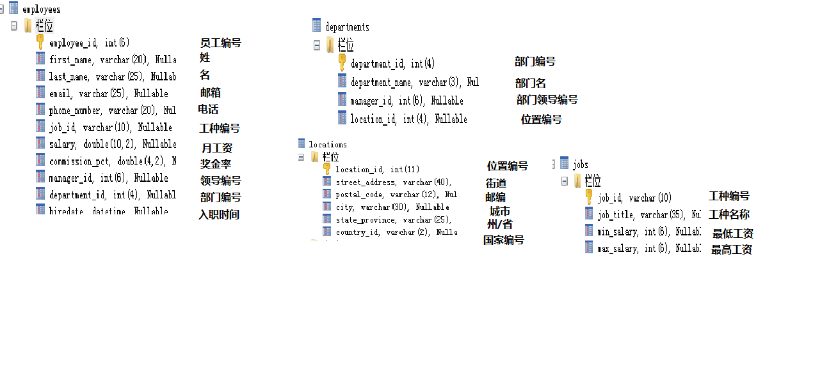

# 3 SQL语句

# 3.0 SQL语句分类

* DDL（Data Definition Language）：数据定义语言，用来定义数据库对象：库、表、列等；如create/drop/alter
* <font color=red ><b>DML（Data Manipulation Language）：数据操作语言，用来定义数据库记录（数据）；</b></font>
* DCL（Data Control Language）：数据控制语言，用来定义访问权限和安全级别；
* <font color=red ><b>DQL（Data Query Language）：数据查询语言，用来查询记录（数据）。</b></font>

通过例子进行的解释




## 3.1 DQL——查询语言

### 3.1.1 语法：

```java
SELECT 
selection_list /*要查询的列名称*/
FROM 
table_list /*要查询的表名称*/
WHERE 
condition /*行条件*/
GROUP BY 
grouping_columns /*对结果分组*/
HAVING 
condition /*分组后的行条件*/
ORDER BY
sorting_columns /*对结果分组*/
LIMIT 
offset_start, row_count /*结果限定*/
```

### 3.1.2 功能：

#### 3.1.2.1 基础查询

select 查询列表 from 表名;

注：

1. select 查询列表  类似于System.out.println(打印内容)，但是System.out.println()的打印内容，只能有一个。

2. select后面跟的查询列表，可以有多个部分组成，中间用逗号隔开例如：select 字段1,字段2,表达式 from 表;

3. 执行顺序:① from子句② select子句

4. 查询列表可以是：字段、表达式、常量、函数等

```java

USE myemployees;

# 1.查询常量

SELECT 100;

# 2.查询表达式

SELECT 100%5;

# 3 查询字段
# 3-1.查询单个字段

SELECT `last_name` FROM `employees`;

# 3-2.查询多个字段

SELECT  `first_name`, `last_name` FROM `employees`;

# 3-3. 查询所有的字段

SELECT * FROM `employees`;# 注意：使用F12进行对齐

# 4.查询函数

SELECT DATABASE();
SELECT VERSION();

# 5.起别名

# 5-1 as关键字

SELECT `last_name` AS "姓  名" FROM `employees`;

# 5-2 空格

SELECT `last_name`  "username" FROM `employees`;

# 6.拼接

SELECT CONCAT(`last_name`,`first_name`) "姓名" FROM employees;

# 7. distinct去重

SELECT DISTINCT `department_id` FROM `employees`;

# 8. 查看表格结构

DESC employees;

SHOW COLUMNS FROM employees;

# 9.显示出表employees的全部列，各个列用逗号链接，列头显示 OUT_PUT

SELECT CONCAT(`first_name`,',',`last_name`,',',`email`,',',`phone_number`,',',`job_id`,',',`salary`,',',IFNULL(commission_pct,''))  "OUT_PUT" FROM `employees`; 

# 10.ifnull判断这个元素是否为空

```
注：

1. mysql中将字符型数据强制转换成数值型,如果无法转换，则直接当做0处理'张无忌'+100===>100
2. 其中一个操作数为null，null+100====》 null


#### 3.1.2.2 条件查询

select 查询列表 from  表名 where 筛选条件;

执行顺序：①from子句②where子句③select子句

如：

select last_name,first_name from employees where salary>20000;

注：

1. 按关系表达式筛选

关系运算符：>   <    >=   <=     =       <>(相当于！=，不等于)     

2. 按逻辑表达式筛选

逻辑运算符：and    or   not

```java
# 1.按照关系表达式进行选择

# 1-1 查询部门编号不是100的员工

SELECT * FROM employees WHERE `department_id` <> 100;

# 1-2 查询工资<15000的姓名、工资

SELECT `last_name`,`salary` FROM employees WHERE `salary`<15000;

# 2.按逻辑表达式筛选

# 2-1 查询编号不是50-100之间的员工姓名、部门编号、邮箱

SELECT `last_name`,`department_id`,`email` FROM employees WHERE `department_id`<50 OR `department_id`>100;

# 2-2 查询奖金率》0.03或者员工编号在60-110之间的员工信息

SELECT * FROM employees WHERE `commission_pct`>0.03 OR (`department_id`>=60 AND `department_id`<=100);
```

#### 3.1.2.3 模糊查询

1. like:一般和通配符搭配使用，对字符型数据进行部分匹配查询
   
常见的通配符：
_ 任意单个字符
% 任意多个字符,支持0-多个
like/not like 

2. in：查询某字段的值是否属于指定的列表之内

a  in(常量值1,常量值2,常量值3,...)
a not in(常量值1,常量值2,常量值3,...)

3. between and：判断某个字段的值是否介于xx之间

between and/not between and

4. is null/is not null

```java

#1 like
 
# 1-1 查询姓名中包含字符a的员工信息

SELECT * FROM employees WHERE `last_name` LIKE "%a%";

# 1-2 查询姓名中包含最后一个字符为e的员工信心

SELECT * FROM employees WHERE `last_name` LIKE "%a";

# 1-3 查询姓名中包含第三个字符为x的员工信息

SELECT * FROM employees WHERE `last_name` LIKE "__x%";

# 1-4 查询姓名中包含第二个字符为_的员工信息

SELECT * FROM employees WHERE `last_name` LIKE "_$_%" ESCAPE "$";

#2 in

# 2-1 查询部门编号是30/50/90的员工名、部门编号

SELECT `last_name`,`department_id` FROM employees WHERE `department_id` IN(30,50,90);

# 2-2 查询工种编号不是SH_CLERK或者IT_PROG的员工信息

SELECT * FROM `employees` WHERE `job_id` NOT IN('SH_CLERK','IT_PROG');

#3 between

# 3-1 查询部门编号是30-90之间的部门编号、员工姓名

SELECT `department_id`,`last_name` FROM `employees` WHERE `department_id` BETWEEN 30 AND 90;

# 3-2 查询年薪不是100000-200000之间的员工姓名、工资、年薪

SELECT `last_name`,`salary`,`salary`*12*(1+`commission_pct`) 
FROM `employees`
WHERE `salary`*12*(1+`commission_pct`)  
BETWEEN 100000 AND 2000000;
# 注意运行前后顺序，如果在年薪加入别名，让where 别名，会运行失败，
# 原因在于先运行from→where→select，你的年薪别名是在select

# 4 is null/is not null

#4-1 查询没有奖金的员工

SELECT * FROM `employees` WHERE `commission_pct` IS NULL;
```
注：
1. =		只能判断普通的内容

2. IS              只能判断NULL值

<=>             安全等于，既能判断普通内容，又能判断NULL值

#### 3.1.2.4 排序查询

select 查询列表 from 表名【where 筛选条件】order by 排序列表

执行顺序：①from子句②where子句③select子句④order by 子句

举例：

select last_name,salaryfrom employeeswhere salary>20000order by salary ;

注：

1. 排序列表可以是单个字段、多个字段、表达式、函数、列数、以及以上的组合
2. 升序 ，通过 asc   ，默认行为
   降序 ，通过 desc

```java
# 排序
# 1.单个字段排序——将员工编号>120的员工信息进行工资的升序

SELECT * FROM `employees` WHERE `department_id`>120 ORDER BY salary;

# 2.按照表达式排序——对有奖金的员工，按工资降序

SELECT * FROM `employees` WHERE `commission_pct` IS NOT NULL ORDER BY salary DESC;

# 3.按照别名排序——对有奖金的员工，按年薪降序

SELECT * ,`salary`*12*(1+IFNULL(`commission_pct`,'0')) AS 年薪
FROM `employees` 
WHERE `commission_pct` IS NOT NULL 
ORDER BY 年薪 DESC;

# 4 按照多个字段排序——查询员工的姓名、工资、部门编号，先按工资升序，再按部门编号降序

SELECT * FROM `employees` ORDER BY `salary` ASC,`department_id` DESC;

# 5 按照列数排序

SELECT * FROM `employees` ORDER BY 2 DESC;
```

注：相关练习详见[练习]()


