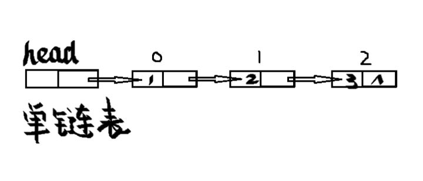

<!--
 * @Author: your name
 * @Date: 2020-04-15 22:09:19
 * @LastEditTime: 2020-04-27 20:55:23
 * @LastEditors: Please set LastEditors
 * @Description: In User Settings Edit
 * @FilePath: \docs\4.algorithm\1.algorithm\2-链表.md
 -->
# 2 链表

# 2.0 链表综述

n个节点离散分配，彼此通过指针相连，每个节点只有一个前驱节点，每个节点只有一个后续节点，首节点没有前驱节点，尾节点没有后续节点。

这样的一个优势就是只需要知道链表的第一个元素就能找到其他所有的元素

根据每个节点有前驱节点和后继节点，我们可以将链表进行了分类：

1. 单向链表
2. 双向链表
3. 循环链表
4. 双向循环链表

注意：
1. 每个节点可以分成两部分：
    * 数据域
    * 指针域
  
2. 注意头节点不存放具体的数据

## 2.1 单链表反转



1. 把头节点的下一个元素放到下一个元素的next域中
2. 再让下一个元素直接指向pre
3. 那么把当前节点当做pre
4. 把下一个节点的next域当做head


<b>一、程序</b>

```java
ublic class SingleLinkedList {
    
    public static Node reverseList(Node head){
        Node pre=null;
        Node next=null;
        while(head!=null){
            next=head.next;
            head.next=pre;
            head=pre;
            head=next;
        }
        return pre;
    }
}

class Node{
           public int val;
           public Node next;
           public Node(int val) {
                   this.val = val;
            }
}
```

<b>二、结果展示</b>

```java

```

<b>三、可能存在的问题</b>

## 2.1 双链表反转