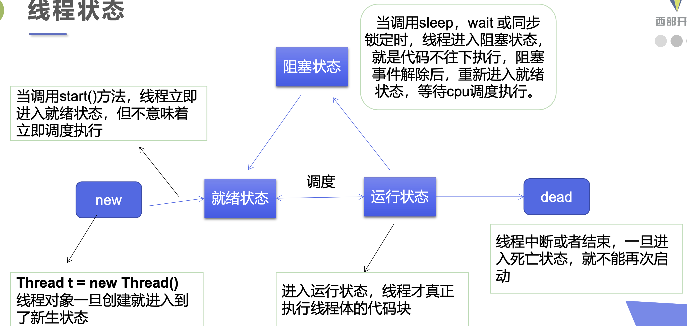
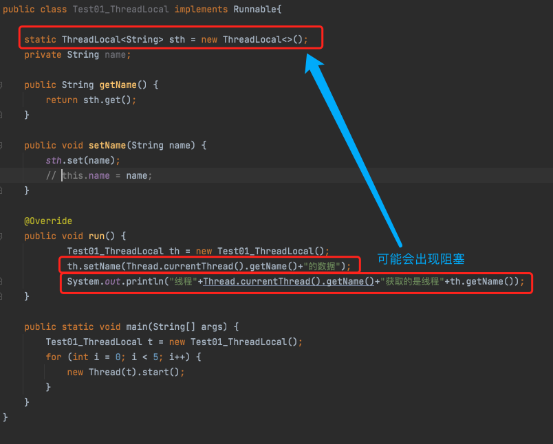

# 1. Java特性

## 1.1. Java特点

1. 简单易学；
2. <font color=red size='5'>⾯向对象（封装，继承，多态）；</font>
3. <font color=red size='5'>平台⽆关性（ Java 虚拟机实现平台⽆关性）；</font>
4. 可靠性；
5. 安全性；
6. <font color=red size='5'>⽀持多线程；</font>
7. <font color=red size='5'>⽀持⽹络编程并且很⽅便；</font>
8. 编译与解释并存；

## 1.2. go和java的区别

1. Go上不允许函数重载，必须具有方法和函数的唯一名称。java允许函数重载。
2. Java默认允许多态。而，Go没有。
3. Go语言的继承通过匿名组合完成：基类以Struct的方式定义，
   子类只需要把基类作为成员放在子类的定义中，支持多继承。
4. java并没有提供多参返回，若要实现多参返回，一般将返回参数封装入Map、List 这类集合类型中，

## 1.3. java创建对象过程

1. java源码被编译为class文件
2. 等到类需要初始化的时候，比如说new、反射
3. class文件被虚拟机通过类加载器加载到jvm
4. 初始化对象，我们就可以使用了

# 2. 面对对象

## 2.1. 面对对象的原则

1. 单一职责原则
   * 一个类，最好只做一件事，只有一个引起它的变化
2. 开放封闭原则
   * 对抽象编程，而不对具体编程
3. 里式替换原则
   * 子类必须能够替换其基类（这个是继承的关键）
4. 依赖倒置原则
   * 抽象不依赖于具体，具体依赖于抽象
5. 接口隔离原则
   * 使用多个小的专门的接口，而不要使用一个大的总接口

注：设计模式还有六大原则，确实问过好几次

## 2.2. 全局变量+局部变量

局部变量和成员变量的**共同点**：
   １．都是先声明后使用
   ２.声明的格式都是一样的
   ３.都有作用域
局部变量和成员变量的**不同点**：
   1、位置：
      属性:在类中方法等结构外
      局部变量:在方法中方法的形参，构造器中，构造器的形参，代码块中
   2、默认值：
      基本数据类型：byte,short,int,long ->0
                  float,double ->0.0
                  char->\u0000
                  boolean ->false
      引用数据类型:类，接口，数组->null
      局部变量:没有默认值
   3、权限修饰符：
      属性:private,protected,public,缺省的
      局部变量:不能使用权限修饰符
   4、内存：
      属性:在堆中的对象中
      局部变量:在栈中

## 2.3. 构造器

### 2.3.1. ⼀个类的构造⽅法作⽤

主要作⽤是完成对类对象的初始化⼯作。
可以执⾏。因为⼀个类即使没有声明构造⽅法也会有默认的不带参数的构造⽅法。

### 2.3.2. 构造⽅法特点

1. 名字与类名相同。
2. 没有返回值，但不能⽤ void 声明构造函数。
3. ⽣成类的对象时⾃动执⾏，⽆需调⽤。

### 2.3.3. 构造方法可不可以被重写和重载

构造方法可以被重载。
构造方法不可以被重写，因为重写发生在父类和子类之间，要求方法名称相同，
而构造方法的名称是和类名相同的，而子类类名不会和父类类名相同，所以不可以被重写。

### 2.3.4. 构造函数能用private修饰吗

可以的，用private修饰的构造方法不允许被new了
因为编译会出现访问private私有的成员

## 2.4. 变量、代码块、构造器执行顺序

Java程序中类中个元素的初始化顺序 初始化的原则是：

   1. 先初始化静态部分，再初始化动态部分，
   2. 先初始化父类部分，后初始化子类部分，
   3. 先初始化变量，再初始化代码块和构造器。

1.父类的静态成员变量（如果是第一次加载类）---》2.父类的静态代码块（如果是第一次加载类）
3.子类的静态成员变量（如果是第一次加载类）---》4.子类的静态代码块（如果是第一次加载类）
5.父类的普通成员变量--》6.父类的动态代码块---》7.父类的构造器方法
8.子类的普通成员变量--》9.子类的动态代码块--》10.子类的构造器方法

## 2.5. 内部类

### 2.5.1. 分类

1. 静态内部类（static inner class）
2. 成员内部类（member inner class）
3. 局部内部类（local inner class）
4. 匿名内部类（anonymous inner class）

### 2.5.2. 内部类的好处

内部类的第一个好处就体现出来了 隐藏你不想让别人知道的操作，也即封装性
一个内部类对象可以访问创建它的外部类对象的内容，甚至包括私有变量

### 2.5.3 内部类应用场景

## 2.6 三大特性

1. 封装
2. 继承
3. 多态

## 2.(6-1) 封装

### 2.(6-1).1 概念

封装可以被认为是一个保护屏障，防止该类的代码和数据被外部类定义的代码随机访问

### 2.(6-1).2 优点

1. 良好的封装能够减少耦合。
2. 类内部的结构可以自由修改。
3. 可以对成员变量进行更精确的控制。
4. 隐藏信息，实现细节。

## 2.(6-2) 继承

通过继承我们可以把父类中公开的 和 受保护方法和属性 让子类进行共享使用。从而达到复用的目的

### 2.(6-2).1 继承的应用场景

后续补充

### 2.(6-2).2 继承会产生什么问题

1. 如果说子类中有父类相同的方法和属性的时候，会引发[重写（覆盖问题）]()
2. 子类能否获取父类所有的方法和属性，就要取决于[访问权限]()

### 2.(6-2).3 继承的好处

父类除了能够很好的把一些公共的方法和属性进行封装，让其子类继承达到复用以外。
还可以可以分担职责，比如说把公共的东西抽离放入父类就是体现了这一作用。

## 2.(6-3) 多态

就是说，Java中的任何一个类都是多态的，它们能保存不止一种类型的对象。
它们可以保存的是除了自身对象以外，还可以保存声明类型的子类的对象。
当把子类对象赋值给父类对象的引用的时候，就会引发多态。

### 2.(6-3).1 多态的必要条件（实现方式、机制）

1. 继承
2. 重写
3. 父类的引用指向子类的对象

### 2.(6-3).2 多态的绑定机制

jvm方法当中引入了动态和静态绑定机制

#### 2.(6-3).2.1 静态绑定

在程序执行前方法已经被绑定，此时由编译器或其它连接程序实现。
针对static方法和final方法由于不能被继承，
因此在编译时就可以确定他们的值，他们是属于前期绑定的。

#### 2.(6-3).2.2 动态绑定

第一步、根据对象的声明类型(或者说对象引用的类型)找到“合适”的方法：
    ① 如果能在声明类型中匹配到方法名还有参数类型完全一样的方法，那么这个方法是最合适的。
    ② 如果不满足的话，那么可以通过将参数类型进行自动转型之后再进行匹配。
       如果匹配到多个自动转型后的方法签名f(A)和f(B)，
       如果传递给f(A)方法的参数都可以传递给f(B)，则f(A)最合适。反之f(B)最合适 。
    ③ 如果仍然在声明类型中找不到“合适”的方法，则编译阶段就无法通过。
第二步、根据在堆中创建对象的实际类型找到对应的方法表，从中确定具体的方法在内存中的位置。

比如说有一个animal的父类，还有一个dog的子类并继承animal的父类
我认为的是在编译期间，Anim对象类型调用的f1方法，
是将方法表中的索引项11是指向Anim这个对象类型的，而在运行期间，
Anim对象类型在堆内存中创建的实际对象是Cat，
所以jvm会根据内存中真实的对象引用重新去给f1的方法表索引项赋值，

### 2.(6-3).3 多态的好处

1. 应用程序不必为每一个派生类编写功能调用，只需要对抽象基类进行处理即可。
   大大提高程序的可复用性。
2. 派生类的功能可以被基类的方法或引用变量所调用，可以提高可扩充性和可维护性。

### 2.(6-3).4 多态的例子

```java
public class A {
    public String show(D obj) {return ("A and D");}
    public String show(A obj) {return ("A and A");} 
}

public class B extends A{
    public String show(B obj){return ("B and B");}
    public String show(A obj){return ("B and A");} 
}

public class C extends B{}

public class D extends B{}

public class Test {
    public static void main(String[] args) {
        A a1 = new A();
        A a2 = new B();
        B b = new B();
        C c = new C();
        D d = new D();
    }
}
```

## 2.10. 抽象类

普通类是一个完善的功能类，可以直接产生实例化对象，
并且在普通类中可以包含有构造方法、普通方法、
static方法、常量和变量等内容。
而抽象类是指在普通类的结构里面增加抽象方法的组成部分。

### 2.10.1. 抽象类可以有构造函数

可以有， 抽象类可以声明并定义构造函数。
它可以用来初始化抽象类内部声明的通用变量，并被各种实现使用。

### 2.10.2. 抽象类可以实现接口

可以， 抽象类可以通过使用关键字implements来实现接口。

### 2.10.3. 抽象类可以是 final 的吗

不可以， Java 抽象类不能是 final 的。
将它们声明为final的将会阻止它们被继承，而这正是使用抽象类唯一的方法。

### 2.10.4. Java 抽象类可以有 static 方法吗

可以， 抽象类可以声明并定义 static 方法。

### 2.10.5. 可以创建抽象类的实例吗（new 类）

不可以，

1. 对象实例化的时候，关键字new向JVM申请内存，这个类的成员会被保存到内存中
   而抽象类，没有具体的成员，没办法准确分配内存。
2. 可能也是设计层面上的解释，不希望实例化

### 2.10.6. 何时选用抽象类

1. 在java应用程序中，有一些相关的类需要共享一些代码行，那么你可以将这些代码行放在抽象类中，
   并且这个抽象类应该由所有这些相关类进行扩展。
2. 可以在抽象类中定义非静态或非最终字段，以便您可以通过方法访问和修改它们所属的对象的状态。
3. 可以期望扩展抽象类的类具有许多公共方法或字段，或者需要除 public 之外的访问修饰符
   （例如 protected 和 private）。

### 2.10.6. 何时选用接口

它是一个完全的抽象，接口中声明的所有方法都必须由实现此接口的类来实现。
一个类可以实现多个接口。它被称为多重继承。
您想指定特定数据类型的行为，但不关心谁实现其行为。

## 2.11. 区别

### 2.11.1. 接⼝和抽象类的区别

1. 所有⽅法在接⼝中不能有实现，⽽抽象类可以有⾮抽象的⽅法。
2. 抽象类中的成员变量可以是各种类型的，而接口中的成员变量只能是public static final类型的；
3. ⼀个类可以实现多个接⼝，但只能实现⼀个抽象类。
4. 接口中不能含有静态代码块以及静态方法，而抽象类可以有静态代码块和静态方法；
5. 从设计层⾯来说，抽象类作为很多子类的父类，是一种模板式设计，接口是一种行为规范

### 2.11.2. 继承和接口区别

1. java类可以一次继承多个接口，用implements 接口1，接口2
2. 如果是接口继承接口的话也可以用extends，接口是多继承的，java类才是单继承
3. 接口继承接口可以不实现父接口中的方法，可以声明自己的新方法，
4. 类实现接口时，一定要实现接口中声明的方法，
   如果接口中没有定义抽象方法则不需要，
   但是如果发生某个类实现了一个接口A,如果B是A的父接口，
   且B中有抽象方法，则该类必须实现A和B中的所有抽象方法
5. 抽象方法只能定义在抽象类中，抽象类实现接口，可以不实现接口中的抽象方法
   继承接口是说的接口来继承接口，是接口与接口间的

### 2.11.3. 为什么要设计接口、抽象类还有实现类

比如说我要实现A类的多样式

接口：定义了a-1，a-2几个接口，让所有的程序都遵守这个。
抽象类：我默认实现了一个样式。如果其他扩展的样式不想做这部分的工作就不用实现了。
实现类：我只实现我需要关心的方法，如a-1就不用再实现了，只需要实现a-2就可以了。

# 3. 关键字

## 3.1. public/privtate/protected/default关键字

### 3.1.1. 关键字有哪些？

1. public可以在任何地方使用，除非这个包不可见
2. private只能在本类中使用
3. protected可以在本类、相同包、子类或者不同包的子类
4. default可以在本类、相同的包、子类（相同的包）中进行使用

### 3.1.2. 为什么要有这几个关键字？

**ps:回答主要包含他的产生原因+使用场景**

因为在实际开发场景中，有一些变量或者方法根据不同的业务功能选择暴露和不暴露，那么我们就需要选择合适的关键字

1. 如果说成员变量都是private修饰的话，它们不希望被其他任何外部的类访问。只能被类内部的成员函数访问。
2. protected,如果在开发中，一个父类想让子类去获取成员属性和方法的话，尽量定义成protected
3. public任何地方都可以访问

### 3.1.3. 通过反射访问private成员和方法，既然能访问为什么要private？

1. private并不是解决安全问题的，如果想让解决代码的安全问题，请用别的办法。
2. private的意义是OOP（面向对象编程）的封装概念。

## 3.2. final关键字

#### 3.2.0.1. final关键字的用法

1. final修饰的类不能被继承
2. final修饰的方法不能被重写；
   如果一旦使用fianl修饰方法，那么就是为了防止继承类改变他的含义
   同时因为在早期的java实现版本中，会将final方法转换为内嵌调用。
   如果方法过于庞大，可能看不到内嵌调用带来的任何性能提升。
   但是现在的版本，不需要使用final进行优化了。
3. final修饰的变量是常量，如果是基本数据类型的变量，
   则其数值一旦在初始化之后便不能更改；
   如果是引用类型的变量，
   则在对其初始化之后便不能让其指向另一个对象。但是对象的内容是可变的

#### 3.2.0.2. final、finally、finalize 的区别

1. final 用于声明属性，方法和类，分别表示属性不可变，
         方法不可覆盖，类不可继承。
2. finally 是异常处理语句结构的一部分，表示总是执行。
3. finalize 是 Object 类的一个方法，
   在垃圾收集器执行的时候会调用被回收对象的此方法，
   可以覆盖此方法提供垃圾收集时的其他资源回收，
   例如关闭文件等。

#### 3.2.0.3. 类的final变量和普通变量区别

一旦使用final修饰的时候，必须在定义变量或者构造器中进行初始化赋值
比如说我在判断几个string类型的变量是否相等的时候，
假如说，

string a=“hello2”
final string b=“hello”
string c=“hello”

那么c+2==a一定是false，b+2==a一定是true

因为final变量如果是基本数据类型或者是string类型的时候，如果在编译期间知道他的确切值，
那么编译器会把他当作编译期常量使用，变量c需要在运行时通过链接进行。

1. [string用fianl修饰]()

#### 3.2.0.4. 匿名内部类中使用的外部局部变量为什么只能是final变量？

详见<https://www.cnblogs.com/dolphin0520/p/3811445.html>

## 3.3. static关键字

#### 3.3.0.5. static关键字的作用

1. static关键字的主要作用是方便在没有创建对象的情况下来进行调用（方法/变量）
   被static关键字修饰的方法或者变量不需要依赖于对象来进行访问，只要类被加载了，就可以通过类名去进行访问。
2. static代码块可以提高效率

#### 3.3.0.6. static方法

##### 3.3.0.6.1. 为什么static不能访问非静态方法？

因为非静态方法或者说变量必须要依赖于对象才能够被调用，
但是静态方法可以被非静态方法所调用

ps：简单一句话，静态方法是好人

##### 3.3.0.6.2. 构造器是静态方法呢？

我认为不是，

由于this是调用当前方法的对象，静态方法不属于任何对象，所以静态方法中不能使用this，而构造器可以使用this关键字，

##### 3.3.0.6.3. 什么情况下构造器可以是静态的？

由于实例构造器无法被隐藏或者覆写，不参与多态，因此可以做静态绑定，可以认定是静态的

#### 3.3.0.7. static变量

##### 3.3.0.7.1. 静态变量和非静态变量的区别

1. 静态变量被所有的对象所共享，在内存中只有一个副本，它当且仅当在类初次加载时会被初始化。
2. 非静态变量是对象所拥有的，在创建对象的时候被初始化，存在多个副本，各个对象拥有的副本互不影响。

#### 3.3.0.8. static代码块

##### 3.3.0.8.1. 为什么说static块可以用来优化程序性能

只会在类加载的时候执行一次

比如说，我想要判断我用户的年龄是否是在5-18岁，那么如果不使用static的时候，
每次判断范围的时候，都需要生成startage和endage两个对象，造成了空间浪费，
那么使用static代码块，只需要加载一次就够用了

例子如下：

没有使用static之前：

```java
class Person{
    private Date birthDate;
    public Person(Date birthDate) {this.birthDate = birthDate;}
     
    boolean isBornBoomer() {
        Date startDate = Date.valueOf("5");
        Date endDate = Date.valueOf("18");
        return birthDate.compareTo(startDate)>=0 && birthDate.compareTo(endDate) < 0;}}
```

使用static之后：

```java
class Person{
    private Date birthDate;
    private static Date startDate,endDate;
    static{
        startDate = Date.valueOf("1946");
        endDate = Date.valueOf("1964");
    }
    public Person(Date birthDate) {this.birthDate = birthDate;}
    boolean isBornBoomer() {return birthDate.compareTo(startDate)>=0 && birthDate.compareTo(endDate) < 0;}}
```

#### 3.3.0.9. static使用场景

1. main函数必须要使用static，因为程序在执行main方法的时候没有创建任何对象，因此只能通过类名来访问。
2. static不可以修饰局部变量（java规定）

## 3.4. new关键字

#### 3.4.0.10. 什么时候我们可以new一个类？

一般只是简单的认为，我定义好了一个类（class）之后，我就可以new了，
其实我们忽略了一个关键性的因素，那就是忽略了编辑器为我们所做的工作，
一般来说，开发者写的java代码对应存放在.java文件里面，
java编译器会讲java文件变异成对应的.class字节码文件，


JVM虚拟机在获得.class文件的字节流之后，经过加载，连接，初始化这几个步骤之后，
这个class文件才是我们可以new的类。

同时在加载.class文件时，虚拟机会将这个将这个字节流所代表的静态存储结构转化为方法区的运行时数据结构，
并在内存中生产一个代表这个类的java.lang.Class对象作为方法区这个类的各种数据的访问入口，为类变量分配内存并设置类变量的初始值，
调用<clinit>()方法初始化类，该方法是由编译器自动收集类中的所有类变量的赋值动作和静态语句块中的语句合并产生。
在加载的所有阶段，只会有静态变量和静态代码块初始化。成员变量并不会初始化。
此时，在虚拟机当中我们就已经做完了new一个类之前的所有动作。

[类加载过程](./2.JVM.md/)

#### 3.4.0.11. new的底层原理

当new一个类的时候，虚拟机识别到关键字new，会使用虚拟机提供的new指令去创建所定织定的对象

1. 校验。检查这个指令的参数是否能在常量池中定位到一个符号引用，并检查这个符号引用代表的类是否
   已经被虚拟机加载过、解析、和初始化过。如果没有，就必须先执行类的加载过程
   如果有，则根据关键new后紧跟的构造方法去创建一个类的对象出来
2. 分配内存。为新生的对象分配内存。对象所需内存大小在类加载完成后就可以完全确定。
   为对象分配空间的任务等同于把一块大小确定的java内存从java堆中划分出来。
   除了划分可用空间以外还需要考虑并发状态下分配内存的冲突问题，
   这个时候有两种解决办法：一是采用CAS配上失败重试，二是预先分配一小块的TLAB内存。
3. 初始化。内存分配完成后，虚拟机需要将分配到的内存空间都初始化为零值（不包括对象头），
   这一操作保证了对象的实例字段在Java代码中可以不赋初始值就可以直接使用。
4. 设置。接下来虚拟机要对对象进行必要的设置，例如对象是哪个类的实例、如何才能找到类的元数据信息、
   对象的哈希码、GC的对象分代年龄等信息。这新信息储存在对象头中（Object Header）之中
5. 真正按程序员意愿初始化赋值。在上面的工作都完成后，从虚拟机的角度来看，一个新的对象已经产生，
   但从Java的角度来看，对象的创建才刚刚开始——<init>方法还没有执行，所有的字段还都为零。
   因此在执行完new指令之后会接着执行<init>方法，把对象按照程序员的意愿进行初始化，
   这样一个真正开用的对象才算创建完成。所谓程序员的意愿，
   就是我们new对象的时候指定的构造方法

##### 3.4.0.11.1. 局部变量为什么不进行初始化会出现编译错误？

局部变量必须经过显示初始化之后才能使用，系统不会为局部变量执行初始化。
定义了局部变量以后，系统并没有给局部变量进行初始化，直到程序给这个局部变量赋给初值时，
系统才会为这个局部变量分配内存空间，并将初始值保存到这块内存中。

##### 3.4.0.11.2. new一个对象时内存空间担保/如何保证够用？

• CAS加上失败重试保证更新操作的原子性
• 为每个线程预先分配一块内存，使用TLAB

#### 3.4.0.12. 两种new对象的区别

1.第一种方式：A  a = new  a();
2.第二种方式：(new A()).toString();

两种区别是
第一种，new 一个对象时有引用变量a指向这个对象，栈内存会存放饮用变量，并且指向null，
第二种，在初始化的时候，并没有制定任何一个引用变量指向这个对象。

#### 3.4.0.13. class类提供的newInstance和关键字new有什么不同

1. newInstance是一个方法，new是一个关键字，newInstance使用它是有局限性的，
   因为它生成的对象只能调用无参的构造函数

2. 虚拟机实现的指令是不一样的， 关键字new，使用的是虚拟机new指令；
   newInstance方法使用的虚拟机指令是invokevirtual指令
   一是使用关键字new进行实例化时，虚拟机会根据new后面所紧接着的我们指定的构造方法进行实例化，
   而Class类提供的newInstance方法则默认使用参数为空的构造方法进行实例化。
   二是在使用new关键字进行实例化时我们的实例化的类可以是没有被加载的，
   所谓未加载就是指虚拟机当中还没有根据我们写的类的代码去获取字节流并创建一个对应的Class对象出来。
    而使用newInstance方法则必须先对类进行加载。 因此回到这个问题上来说，
   在jvm底层的计算机指令两者是不完全一样的，但是newInstance方法进行实例化和new进行实例化的逻辑
   肯定是同一块代码执行的。但是这两个方法执行时虚拟机所做的事情不完全一样

## 3.5. transient关键字

#### 3.5.0.14. transient关键字的作用

阻⽌实例中那些⽤此关键字修饰的的变量序列化；
当对象被反序列化时，被transient修饰的变量值不会被持久化和恢复
transient只能修饰变量，不能修饰类和⽅法。

## 3.6. 区别

### 3.6.1. static和final区别

1. static主要是把成员变量保存一份副本
2. final主要是用来保证变量不可变

### 3.6.2. final与abstract区别

1. abstract可以用来修饰类和方法，不能用来修饰属性和构造方法；
   使用abstract修饰的类是抽象类，需要被继承，
   使用abstract修饰的方法是抽象方法，需要子类被重写。
2. final可以用来修饰类、方法和属性，不能修饰构造方法。
   使用final修饰的类不能被继承，使用final修饰的方法不能被重写，
   使用final修饰的变量的值不能被修改，所以就成了常量。
   final修饰基本类型变量，其值不能改变，由原来的变量变为常量；
   但是final修饰引用类型变量，栈内存中的引用不能改变，
   但是所指向的堆内存中的对象的属性值仍旧可以改变。

### 3.6.3. 重载和重写的区别

1. 方法的重载和重写都是实现多态的方式，
   区别在于重载实现的是编译时的多态性，
   而重写实现的是运行时的多态性。

2. 重载发生在一个类中，同名的方法如果有不同的参数列表
   （参数类型不同、参数个数不同或者二者都不同）则视为重载；
   重写发生在子类与父类之间，
   重写要求子类被重写方法与父类被重写方法有相同的参数列表，
   有兼容的返回类型，比父类被重写方法更好访问，
   不能比父类被重写方法声明更多的异常。
   重载对返回类型没有特殊的要求，不能根据返回类型进行区分。

## 3.7. this关键字

#### 3.7.0.1. this关键字的作用

this代表当前对象，哪个对象调用了this所在的函数，this就代表哪个对象

#### 3.7.0.2. this关键字的应用

1. 当成员变量和局部变量重名，可以用关键字this区分，例如

```java
class Person
{
 private String name;
 private int age;
 Person(String name){//成员变量和局部变量重名，可以用关键字this区分
  this.name = name;}
 public void speak(){//输出时，会默认为成员增加this关键字，用来代表具体对象的数据
  System.out.println(this.name+"："+this.age);}}
```

2. this关键字也可以用于在构造函数中调用其他构造函数,例如

```java
class Person{
   Person()
 {
  name = "baby";
  age = 1;
  System.out.println("Person run");
 }
 Person(String name)
 {
  //成员变量和局部变量重名，可以用关键字this区分
  this.name = name;
 }
 Person(String name,int age)
 {
  //调用其他构造函数时，只能定义在构造函数的第一行，因为初始化动作要先执行
  this();
  this.name = name;
  this.age = age;
 }
}
```

## 3.8. super关键字

就给父类的私有成员变量进行赋值使用

## 3.9. 重载与重写关键字

1. 重载——函数或者方法有同样的名称，
         但是参数列表不相同的情形
2. 重写——Java的子类与父类中有两个名称
        参数列表都相同的方法的情况。
        由于他们具有相同的方法签名，
        所以子类中的新方法将覆盖父类中原有的方法

重载：overload
重写：override

### 3.9.1. Java中是否可以重写一个private或者是static的方法？

1. Java中static方法不能被覆盖，因为方法覆盖是基于运行时动态绑定的，
   而static方法是编译时静态绑定的。

2. Java中也不可以覆盖private的方法，
   因为private修饰的变量和方法只能在当前类中使用，
   如果是其他的类继承当前类
   是不能访问到private 变量或方法的

# 4. 数据类型

## 4.1. 数据类型种类

1. 字符型  char
2. 布尔型  boolean
3. 数值型
   1. 整型：byte、short、int、long
   2. 浮点型：float、double

<font color=red>特别注意</font>：String不是基本数据类型，是引用类型。

### 4.1.1. java为什么除了基本数据类型还要有引用数据类型

引用类型在堆里，基本类型在栈里。
栈空间小且连续，往往会被放在缓存。
引用类型cache miss（缓存未命中）率高且要多一次解引用。
对象还要再多储存一个对象头，
对基本数据类型来说空间浪费率太高

### 4.1.2. String为什么不是基本数据类型

1. 基本类型仅表示简单的数据类型，
   引用类型可以表示复杂的数据类型，
   还可以操作这种数据类型的行为
2. java虚拟机处理基础类型与引用类型的方式是不一样的，
   对于基本类型，java虚拟机会为其分配数据类型实际占用的内存空间，
   而对于引用类型变量，
   他仅仅是一个指向堆区中某个实例的指针。

### 4.1.3. 引用类型有哪几种

类或者接口，泛型类型，数组类型

## 4.2. 数据类型范围

`数值型`
byte：-2^7 ~ 2^7-1，
short：-2^15 ~ 2^15-1
int：-2^31 ~ 2^31-1
long：-2^63 ~ 2^63-1，
`浮点型：`
float：4字节。
double：8字节。
`字符型：`
char：2字节。

### 4.2.1. 为什么byte类型是-128~+127

使用原码或反码表示的范围为[-127, +127],
-0并没有反码补码表示，
而使用补码表示的范围为[-128, 127]

## 4.3. 包装类

### 4.3.1. 概念

比如说集合类中，要求元素必须是Object类，
而int、double等基本数据类型无法使用，
那么我们就把基本数据类型包装起来，
使其具有对象的特征，并让他有了属性和方法

### 4.3.2. 包装类的类型

### 4.3.3. 包装类使用场景

1. 场景一、将基本数据类型放入集合类
2. 场景二、包装类型和基本类型的大小比较
3. 场景三、包装类型的运算
4. 场景四、三目运算符的使用如果i是包装类，j是null就会NPE报错
5. 场景五、函数参数与返回值

### 4.3.4. 包装类带来的问题

1. 包装对象的数值比较，不能简单的使用==，虽然-128到127之间的数字可以，
   但是这个范围之外还是需要使用equals比较~~。
2. 如果包装类对象为null，
   那么自动拆箱时就有可能抛出NPE（NullPointException）。
3. 如果一个for循环中有大量拆装箱操作
   会浪费很多资源。

## 4.4. 缓存机制

### 4.4.1. Integer缓存机制

Integer对小数据（-128~=127）具有缓存机制，
当jvm在初始化的时候，如果数据是小数据，
那么就会把数据存储在本地内存当中，
当下次使用的时候该数据的时候，
那么就可以直接从本地内存进行调用，就不需要再次创建对象来解决

1. 其中会有一个valueof函数，用来判断内存中是否有着这个数值，
   * 如果说有，那么直接从内存进行读取
   * 如果说没有，那么就需要创建一个对象
2. 在jvm初始化的时候，低值是不能改变的，
   但是高值是可以改变的，可以通过jvm进行参数设置，
   但是只有Integer源码可以对高值、低值进行改变。

## 4.5. 普通数据类型与包装类区别

### 4.5.1. int与Integer区别

1. Integer是int的包装类 ，int则是java的一种基本数据类型
2. Integer变量必须实例化后才能使用，而int变量不需要
3. Integer的默认值是null, int的默认值是0

注：

1. 非new生成的Integer变量和new Integer生成的变量比较时，
   结果为false。
   因为非new生成的Integer变量指向的是java常量池中的对象，
   而new Integer0生成的变量指向堆中新建的对象，两者在内存中的地址不同

```java
Integer i = new Integer(100);
Integer j = 100;
Syatem.out.print(i == J); //false
```

2. Integer变量和int变量比较时，只要两个变量的值是相等的，则结果为true

## 4.6. 转型与不同类型计算

### 4.6.1. String转出int型， 判断能不能转？ 如何转？

可以转， 得处理异常 Integer.parseInt(s) 主要为 NumberFormatException：

### 4.6.2. short s1 = 1; s1 = s1 + 1;有什么错? short s1 = 1; s1+=1;有什么错?

对于 short s1 = 1; s1 = s1 + 1;
由于 s1+1运算时会自动提升表达式的类型，
所以结果是 int型，
再赋值给 short 类型 s1时，
编译器将报告需要强制转换类型的错误。
对于 short s1 = 1; s1 += 1;
由于 +=是 java 语言规定的运算符，
java 编译器会对它进行特殊处理，因此可以正确编译

## 4.7. 值传递与引用传递

1. 值传递是对基本型变量而言的,
   传递的是该变量的一个副本,改变副本的值不影响原变量的值

2. 引用传递一般是对于引用类型变量而言的,
   传递的是该对象地址的一个副本，是一个地址。
      * 如果说改变了原地址的值（注意是  值  ），那么会影响
      * 如果改变了副本地址，如new 一个原地址不会改变  

一般认为,java传递都是值传递.

### 4.7.1. 值传递与引用传递的举例

1. 基本类型
那我先说一下基本类型作为参数传递的例子：

```java
public class Test1 {
       public static void main(String[] args) {
        int n = 3;
        System.out.println("Before change, n = " + n);
        changeData(n);
        System.out.println("After changeData(n), n = " + n);
    }
public static void changeData(int n) {
        n = 10;
    }}
```

基本类型作为参数传递时，是传递值的拷贝，
无论你怎么改变这个拷贝，原值是不会改变的，输出的结果证明了这一点：

```java
Before change, n = 3
After changeData(n), n = 3
```

2. 引用类型

```java
   public class TransferTest2 {
    public static void main(String[] args) {
        Person person = new Person();
        System.out.println(person);
        change(person);
        System.out.println(person);
    }
//
    public static void change(Person p) {
        p = new Person();
    }
}

/**
 * Person类
 */
class Person {

}
```

两次打印结果一致。

在调用change()方法后，person变量并没发生改变。

01.当程序执行到第3行 Person person = new Person()时，
   程序在堆内存（heap）中开辟了一块内存空间用来存储Person类实例对象，
   同时在栈内存（stack）中开辟了一个存储单元来存储该实例对象的引用，

02.当程序执行到第5行 change(person)时，person作为参数（实参）传递给饿了change()方法。
   这里是person将自己的存储单元的内容传递给了change()方法的p变量。
   此后在change()方法中对p变量的一切操作都是针对于p变量所指向的存储单元，
   与perosn所指向的存储单元就没有关系了。

## 4.8. 深拷贝与浅拷贝

1. 浅拷⻉：对基本数据类型进⾏值传递，
          对引⽤数据类型进⾏引⽤传递的拷⻉。
2. 深拷⻉：对基本数据类型进⾏值传递，
          对引⽤数据类型，创建⼀个新的对象，
          并复制其成员变量。

### 4.8.1. 浅拷贝方法

1. 通过拷贝<font color=red>构造方法</font>实现浅拷贝：
   * 拷贝构造方法指的是该类的构造方法参数为该类的对象。
2. 通过重写clone()方法进行浅拷贝
   * 使用clone方法的类必须实现Cloneable接口

### 4.8.2. 深拷贝方法

1. 序列化
   * 序列化为数据流，在反序列化回来，就可以得到这个对象
2. 利用Kryo框架，这是一个快速高效的Java序列化框架
3. 利用json转化方式
   * 对象转化为JSON，再序列化为对象
4. 人工构建对象

### 4.8.3. 深拷贝与浅拷贝的区别

深拷贝和浅拷贝最根本的区别在于是否真正获取一个对象的复制实体，而不是引用。
比如说我有两个数值，A和B，B复制了A，修改A的时候，看B是否发生变化：
如果B跟着也变了，说明是浅拷贝，修改堆内存中的同一个值
如果B没有改变，说明是深拷贝，修改堆内存中的不同的值、
浅拷贝（shallowCopy）只是增加了一个指针指向已存在的内存地址，
深拷贝（deepCopy）是增加了一个指针并且申请了一个新的内存，
使这个增加的指针指向这个新的内存，
使用深拷贝的情况下，
释放内存的时候不会因为出现浅拷贝时释放同一个内存的错误。

### 4.8.4. 赋值和浅拷贝的区别

当我们把一个对象赋值给一个新的变量时，
赋的其实是该对象的在栈中的地址，
而不是堆中的数据。
两个对象指向的是同一个存储空间，
无论哪个对象发生改变，
其实都是改变的存储空间的内容，
因此，两个对象是联动的。
浅拷贝是按位拷贝对象，它会创建一个新对象，
这个对象有着原始对象属性值的一份精确拷贝。
如果属性是基本类型，拷贝的就是基本类型的值；
如果属性是内存地址（引用类型），拷贝的就是内存地址 ，
因此如果其中一个对象改变了这个地址，
就会影响到另一个对象。
即默认拷贝构造函数只是对对象进行浅拷贝复制(逐个成员依次拷贝)，
即只复制对象空间而不复制资源。

## 4.9. ==、===与equals

### 4.9.1. ==与===区别

1. == 表示相等 （值相等）
2. ===表示恒等（类型和值都要相等）

### 4.9.2. == 与 equals

1. == : 它的作⽤是判断两个对象的地址是不是相等。
   基本数据类型⽐较的是值，引⽤数据类型⽐较的是内存地址

2. equals() : 它的作⽤也是判断两个对象是否相等。但它⼀般有两种使⽤情况：

   * 情况 1：类没有覆盖equals()⽅法。
            则通过equals()⽐较该类的两个对象时，
            等价于通过“==”⽐ 较这两个类。
   * 情况 2：类覆盖了equals()⽅法。⼀般，
             我们都覆盖 equals() ⽅法来⽐较两个对象的内容是否相等；
             若它们的内容相等，则返回true。

### 4.9.3. 应用

#### 4.9.3.1. 比较两个类是否相等

==或者equals方法（equals看看有没有覆盖重写了）

#### 4.9.3.2. 比较两个对象是否相等

equals覆盖重写之后的方法

## 4.10 hashcode与equals方法

### 4.10.1 两者的关系

没有任何关系

#### 4.10.1.1 为什么重写 equals 方法一定要重写 hashCode 方法？

又要重写equals方法又要重写hashcode方法的原因在于：

1. equals方法是用来判断两个对象是否相等的，
2. hashcode更多的是用来让比如说hashmap可以存放更多的元素，减少hash碰撞问题。
   是你的话i如果补充些hashcode的话，那可能两个相同的对象放入到了不同的位置，元素的唯一性就不存在了

## 4.11. i++与++i的问题

### 4.11.1. i++和++i的区别，及其线程安全问题

i++：先赋值再自加。
++i：先自加再赋值。

1. 如果i是局部变量（在方法里定义的），那么是线程安全的。
   因为局部变量是线程私有的，别的线程访问不到
2. 如果i是全局变量（类的成员变量），那么是线程不安全的。
   因为如果是全局变量的话，同一进程中的不同线程都有可能访问到。

如果有大量线程同时执行i++操作，
i变量的副本拷贝到每个线程的线程栈，
当同时有两个线程栈以上的线程读取
线程变量，假如此时是1的话，
那么同时执行i++操作，再写入到全局变量，
最后两个线程执行完，i会等于3而不
会是2，所以，出现不安全性。

如果使用voliate无法保证原子性

### 4.11.2. i++和++i是否为原子操作

不是原子操作
比如说i++
分为三个阶段：

1. 内存到寄存器
2. 寄存器自增
3. 回内存
这三个阶段中间都可以被中断分离开.
++i首先要看编译器是怎么编译的，
如果编译成了“inc dword ptr[i]”，这是原子操作

### 4.11.3. 如何实现i++和++i的原子性呢？

总线锁和缓存锁两个机制来保证原子性，可以通过处理器提供的很多LOCK前缀的指令来实现。

1. 总线锁：多个处理器可能会同时从各自的缓存中读取变量，并分别进行操作，
   在分别写入内存中，想要保证读改写共享变量的操作是原子的，就要使用总线锁来解决，
   即使用处理器提供的一个LOCK#信号，当有一个处理器在总线上输出此信号时，
   其他处理器的请求将被阻塞，此时该处理器可以独占共享内存。
2. 缓存锁：频繁使用的内存将会缓存在处理器的高速缓存里，
   内存区域如果被缓存到处理器的缓存行里，并且在Lock操作期间被锁定，
   那么当他执行锁操作回写到内存时，其他处理器会检查各自缓存行内的内存地址，
   如果发现自己的缓存行对应的地址被修改了，就会将缓存行置于无效状态，
   下次访问时，重新从内存中读取数据到缓存行，并允许它的缓存一致性机制
   （通常采用嗅探技术来实现，即缓存不仅仅是在内存传输的时候才和总线打交道，
   而是时刻不停的在窥探总线上发生的数据交换，并跟踪其他缓存在做什么，
   所以当一个缓存代表它所属的处理器去读写内存时，其他处理器都会得到通知，
   从而保证各个缓存保持同步）来保证操作的原子性。此时，处理器不会在总线上输出LOCK#信号。
总线锁会把CPU和内存之间的通信锁住，导致其他处理器不能操作其他内存地址的数据，
所以总线锁的开销比较大，在某些场合下，会使用缓存锁来代替总线锁进行优化。
但是，当操作的数据不能被缓存在处理器内部或要操作的数据会跨多个缓存行时，
处理器会调用总线锁。对于有些处理器不支持缓存锁，
就算锁定的内存区域在处理器的缓存行，这时也会调用总线锁。

# 5. 集合

## 5.1. 集合分类

集合框架有Map和Collection两大类

1. Collection
   1. List
        * Arraylist： Object数组
        * Vector： Object数组
        * LinkedList： 双向链表(JDK1.6之前为循环链表， JDK1.7取消了循环)
   1. Set
        * HashSet（⽆序，唯⼀） : 基于 HashMap 实现的，
                                  底层采⽤ HashMap 来保存元素
        * LinkedHashSet： LinkedHashSet 继承于 HashSet，
                         并且其内部是通过 LinkedHashMap 来实现的。
                         有点类似于我们之前说的LinkedHashMap
                         其内部是基于 HashMap 实现⼀样，不过还是有⼀点点区别的
        * TreeSet（有序，唯⼀）： 红⿊树(⾃平衡的排序⼆叉树)
   2. Queue
2. Map
    1. HashMap： JDK1.8之前HashMap由数组+链表组成的，
                 数组是HashMap的主体，
                 链表则是主要为了解决哈希冲突⽽存在的（“拉链法”解决冲突）。
                  JDK1.8以后在解决哈希冲突时有了较⼤的变化，
                  当链表⻓度⼤于阈值（默认为8）时，
                  将链表转化为红⿊树，以减少搜索时间
    2. LinkedHashMap： LinkedHashMap 继承⾃ HashMap，
                      所以它的底层仍然是基于拉链式散列结构
                      即由数组和链表或红⿊树组成。
                      LinkedHashMap 在上⾯结构的基础上，
                      增加了⼀条双向链表，
                      使得上⾯的结构可以保持键值对的插⼊顺序。
                      同时通过对链表进⾏相应的操作，
                      实现了访问顺序相关逻辑。
    3. Hashtable： 数组+链表组成的，数组是 HashMap 的主体，
                   链表则是主要为了解决哈希冲突⽽存在的
    4. TreeMap： 红⿊树（⾃平衡的排序⼆叉树）

## 5.2. hashmap

### 5.2.1. 数据结构

1. （`数据插入`）JDK1.7用的是`头插法`，而JDK1.8及之后使用的都是`尾插法`，
                  JDK1.7采用头插法虽然能够提高插入的效率，但是为了安全,防止环化，因为resize的赋值方式，
                  也就是使用了单链表的头插入方式，同一位置上新元素总会被放在链表的头部位置，
                  在旧数组中同一条Entry链上的元素，通过重新计算索引位置后，有可能被放到了新数组的不同位置上。
                  所以使用头插会改变链表的上的顺序，但是如果使用尾插，在扩容时会保持链表元素原本的顺序，
                  保持之前节点的引用关系，就不会出现逆序且链表死循环的问题
2. (`扩容方式`)扩容存储位置的计算方式也不一样：
               1. 在JDK1.7的时候是直接用hash值和需要扩容的二进制数进行&
               2. 在JDK1.8的时候是扩容前的原始位置+扩容的大小值=JDK1.8的计算方式，
                  但是这种方式就相当于只需要判断Hash值的新增参与运算的位是0还是1就直接迅速计算出了扩容后的存储方式。
3. （`哈希冲突`）JDK1.7的时候使用的是`数组+单链表`的数据结构。
               HashMap通过key的hashCode经过哈希函数处理过后得到hash值，然后通过(n-1)&hash判断当前元素存放的位置，
               如果当前位置存在元素的话，就判断该元素与要存入的元素的hash值以及key是否相同，如果相同的话，直接覆盖，
               不相同就通过拉链法解决冲突。但是在JDK1.8及之后时，使用的是数组+链表+红黑树的
               数据结构,当链表的深度达到8的时候，也就是默认阈值，就会自动扩容把链表转成红黑树的数据结构，以减少搜索时间。

### 5.2.2. (1-1) 链表插入法

#### 5.2.2.1. (1-1).1 头插法

1）创建头节点，维护head指针（引用）来指向头节点；
2）newNode表示待插入节点，维护newnode指向新节点；
3）
case1:当链表为空时，即首次插入新节点，将head.next指向新插入节点，即head.next = newNode;
case2:如果不是首次插入新节点，将新节点插入到head和head.next指向节点之间，即
newnode.next = head.next;
head.next = newNode;

#### 5.2.2.2. (1-1).2 尾插法

1）创建头节点，维护head指针（引用）来指向头节点；
2）newNode表示待插入节点，维护tail指针，指示链表尾节点，当tail.next == null时，表示tail指向尾节点；
3）
case1:当链表为空时，即首次插入新节点，将head.next指向新插入节点，即head.next = newNode;
case2:如果不是首次插入新节点，需要遍历整个链表定位到尾节点，并将新节点插入到尾节点之后，即
tail.next = newNode;

##### 5.2.2.2.1. (1-1).2.1 为什么要改为尾插法

<https://juejin.cn/post/6844904017269637128>

### 5.2.3. (1-2) 扩容

#### 5.2.3.1. (1-2).1 什么时候扩容

当向容器添加元素的时候，会判断当前容器的元素个数，
如果元素个数 > 阈值（数组长度*负载因子），那么就需要扩容了

##### 5.2.3.1.1. (1-2).1.1 插入一万个元素之后会不会扩容，扩容扩多少

HashMap 是否扩容，由 threshold 决定，而 threshold 又由初始容量和 loadFactor 决定。

1. HashMap 构造方法传递的 initialCapacity，它实际表示 table 的容量。
   * 只是代表了 table 数组容量为 1000
2. 构造方法传递的initialCapacity，
   最终会被tableSizeFor()方法动态调整为2的N次幂，
   以方便在扩容的时候，计算数据在newTable中的位置。

* 虽然你传入了10000，但是实际传入的是10000/loadFactor，但是呢会调整为最接近的2 的 N 次幂
  * 如：实际传入了10000/0.75=13333，最接近的是2^13=16384，那么就采用16384

3. 如果设置了table的初始容量，
   会在初始化 table 时，
   将扩容阈值 threshold 重新调整为 table.size * loadFactor。

* 那么可以储存的最大容量就是：16384*0.75=12288

#### 5.2.3.2. (1-2).2 扩容的流程

扩容其实就是做了两件事情，1）计算新的容量和扩容阀值，并创建新的 table 数组；2）将老的 table 复制到新的 table 数组中。

1. 受限我们先判断 oldCap 大于 0 ，说明 table 非空，说明是`两倍扩容`操作。
   一旦超过最大容量，则直接设置阀值为Integer.MAX_VALUE ，不再允许扩容。
   那么我就要开始两倍扩容了，所以直接使用 oldThr << 1 位运算的方案。这个方案更快一些
2. 如果说oldCap 等于 0 ，说明 table 为空，说明是初始化操作
   oldThr 大于 0 ，说明使用的是【非默认构造方法】，就需要使用oldThr 作为新的容量。
   oldThr 等于 0 ，说明使用的是【默认构造方法】，则使用 DEFAULT_INITIAL_CAPACITY 作为新的容量，
                  然后计算新的 newThr 阀值。
3. 如果还从来没有计算过新的阀值，则使用 newCap * loadFactor 作为新的阀值。

那么之后，我就可以开始做复制操作了

1. 如果 e 节点只有一个元素，直接赋值给新的 table 即可。
2. 如果 e 节点是红黑树节点，则通过红黑树分裂处理。
3. 如果 e 节点是链表，以为 HashMap 是成倍扩容，这样原来位置的链表的节点们，
                     会被分散到新的 table 的两个位置中去。

#### 5.2.3.3. (1-2).3 扩容与插入问题

在JDK1.7的时候是先进行扩容后进行插入，而在JDK1.8的时候则是先插入后进行扩容的
JDK1.7中的话，是先进行扩容后进行插入的，就是当你发现你插入的桶是不是为空，
说明存在值就发生了hash冲突，那么就必须得扩容，但是如果不发生Hash冲突的话，说明当前桶是空的（后面并没有挂有链表），
那就等到下一次发生Hash冲突的时候在进行扩容，但是当如果以后都没有发生hash冲突产生，
那么就不会进行扩容了，减少了一次无用扩容，也减少了内存的使用

#### 5.2.3.4. (1-2).3 扩容作用

1. 扩容
2. 初始化数组

#### 5.2.3.5. (1-2).4 死循环问题

一般在多线程会发生

<https://blog.csdn.net/weixin_30326745/article/details/95859533>

### 5.2.4. (1-3) 哈希冲突

#### 5.2.4.1. (1-3).1 概念

就是说，一个新数据，要插入某个位置的时候，在同一个位置里，已经有了一个数据了，那么我这个新数据应该去哪里？
这个就是哈希冲突

#### 5.2.4.2. (1-3).2 哈希函数---如何减少hash冲突

1. 直接定址法：直接以key或者key上加上某个常数作为哈希地址
2. 数字分析法：提取key中取值比较均匀的数字作为哈希地址
3. 除留余数法：用key除以某个不大于哈希表长度m的数，将所得余数作为哈希地址
4. 分段叠加法：按照哈希表地址位数将关键字分成了位数相等的几部分，
              其中最后一部分可以比较短，然后将这几部分相加，舍弃最
              高位仅为后的结果就是该关键字的哈希地址
5. 平方取中法：如果key的各部分分部都不均匀，可以先求出他的平方值，
              然后按照需求求取中间的几位作为哈希地址
6. 伪随机数法：采用一个伪随机数作为哈希函数

#### 5.2.4.3. (1-3).3 如何解决hash冲突

1. 拉链法
   创建一个链表数组，数组中每一格就是一个链表。
   若遇到哈希冲突，则将冲突的值加到链表中即可。
2. 开发地址法
   所有输入的元素全部存放在哈希表里，
   先通过哈希函数进行判断，若是发生哈希冲突，
   就以当前地址为基准，根据再寻址的方法（探查序列），
   去寻找下一个地址，若发生冲突再去寻找，
   直至找到一个为空的地址为止。
3. 建立一个公共溢出区
   假设哈希函数的值域为[0,m-1],则设向量HashTable[0..m-1]为基本表，
   另外设立存储空间向量OverTable[0..v]用以存储发生冲突的记录。
4. 再哈希法
   当发生冲突时，使用第二个、第三个、哈希函数计算地址，
   直到无冲突时。缺点：计算时间增加。
   比如上面第一次按照姓首字母进行哈希，
   如果产生冲突可以按照姓字母首字母第二位进行哈希，
   再冲突，第三位，直到不冲突为止

##### 5.2.4.3.1. (1-3).3 拉链法弊端与优化

1. （弊端）假定说我有一个数据，恰巧，所有数据的hash函数处理后，得到的hash值都在同一位置，
          这样哈希表就成了一个链表，当我们在这样的数据结构中去查找某个元素的话，时间复杂度又变回了o(n)。
          这样hashmap存在的意义就不打了，

2. （优化）因为二叉查找树的查询效率是远远高于链表的。
          因此，当哈希表中的链表过长时我们就可以把这个链表变成一棵红黑树。
   **ps：主要考察的就是hashmap的树化**

#### 5.2.4.4. (1-3).4 扰动函数

主要是通过对 key 值类型自带的哈希函数生成的散列值进行位移计算来扰乱散列值，
以达到降低哈希碰撞的概率的方法。

```java
static final int hash(Object key) {
    int h;
    // h = key.hashCode() 计算哈希值
    // ^ (h >>> 16) 高 16 位与自身进行异或计算，保证计算出来的 hash 更加离散
    return (key == null) ? 0 : (h = key.hashCode()) ^ (h >>> 16);
}
```

##### 5.2.4.4.1. (1-3).4.1 为什么有 ^ (h >>> 16) 一段代码

1. 因为散列值是一个int类型，考虑到2进制32位带符号范围前后加起来差不多有40亿的映射空间，
   只要哈希函数映射的比较均匀松散，一般很难出现碰撞现象的。
2. 但是40亿长度的数组，内存是放不下的，毕竟hashmap扩容前的默认长度才16，
   所以我们可以对数组长度取模运算，得到的余数才能访问数组下标
3. 那么我只取余数这几位可能碰撞也会很严重，如果说散列本身没有做好，分布上成等差数列，
   恰好呈现规律性重复，这样就效果很差了，所以就可以采用扰动函数并且右位移动16位，
   让自己的高半区和低半区做异或，这样做的目的就是混合原始哈希码的高位和低位，加大低位的随机性

### 5.2.5. (1-4) HashMap树化---性能提升

#### 5.2.5.1. (1-4).1 HashMap为什么要树化

假定说我有一个数据，恰巧，所有数据的hash函数处理后，得到的hash值都在同一位置，
这样哈希表就成了一个链表，当我们在这样的数据结构中去查找某个元素的话，时间复杂度又变回了o(n)。
这样hashmap存在的意义就不打了，

##### 5.2.5.1.1. (1-4).1.1 为什么不把链表全部换为红黑树

1. 链表的结构比红黑树简单，构造红黑树要比构造链表复杂，
   所以在链表的节点不多的情况下，从整体的性能看来，
   如果把链表全部换为红黑树，效率反而更低。
2. HashMap频繁的resize（扩容），
   扩容的时候需要重新计算节点的索引位置，
   也就是会将红黑树进行拆分和重组，
   其实这是很复杂的，
   这里涉及到红黑树的着色和旋转，
   所以为链表树化设置一个阀值是非常有必要的。

##### 5.2.5.1.2. (1-4).1.2 为什么是使用红黑树而不是AVL树？

在CurrentHashMap中是加锁了的，实际上是读写锁，
如果写冲突就会等待，如果插入时间过长必然等待时间更长。
同时因为AVL树需要更高的旋转次数才能在修改时正确地重新平衡数据结构，
所以红黑树相对AVL树他的插入更快！

##### 5.2.5.1.3. (1-4).1.3 为什么选择红黑树而不用查找树

红黑树是为了解决二叉查找树的缺陷，
二叉查找树在特殊情况下会变成一条线性结构
这就跟原来使用链表结构一样了，造成很深的问题，
遍历查找会非常慢。
而红黑树在插入新数据后可能需要
通过左旋，右旋、变色这些操作来保持平衡，
引入红黑树就是为了查找数据快，解决链表查询深度的问题

#### 5.2.5.2. (1-4).2 hashmap树化门槛

* 链表长度大于8
* 数组长度大于64

##### 5.2.5.2.1. (1-4).2.1 链表转化为红黑树的阈值是8

1. 中间有个差值7可以有效防止链表和树频繁转换，降低效率
2. 由于treenodes的大小大约是常规节点的两倍，
   因此我们仅在容器包含足够的节点以保证使用时才使用它们，
   当它们变得太小（由于移除或
   调整大小）时，
   它们会被转换回普通的node节点，
   容器中节点分布在hash桶中的频率遵循泊松分布，
   桶的长度超过8的概率非常非常小。

### 5.2.6. 添加键值对

1. 初始化table
   判断table是否为空或为null，
   否则执行resize()方法（resize方法一般是扩容时调用，也可以调用来初始化table）。

2. 计算hash值
   根据键值key计算hash值。（因为hashCode是一个int类型的变量，是4字节，32位，
   所以这里会将hashCode的低16位与高16位进行一个异或运算，来保留高位的特征，
   以便于得到的hash值更加均匀分布）

3. 插入或更新节点
   根据(n - 1) & hash计算得到插入的数组下标i，然后进行判断
   1. 数组为空(table[i]==null)
      那么说明当前数组下标下，没有hash冲突的元素，直接新建节点添加。
   2. 等于下标首元素，table[i].hash == hash &&(table[i]== key || (key != null && key.equals(table[i].key)))
      判断table[i]的首个元素是否和key一样，如果相同直接更新value。
   3. 数组下标存的是红黑树，table[i] instanceof TreeNode
      判断table[i] 是否为treeNode，即table[i] 是否是红黑树，如果是红黑树，则直接在树中插入键值对。
   4. 数组下标存的是链表
      上面的判断条件都不满足，说明table[i]存储的是一个链表，
      那么遍历链表，判断是否存在已有元素的key与插入键值对的key相等，
      如果是，那么更新value，如果没有，那么在链表末尾插入一个新节点。
      插入之后判断链表长度是否大于8，大于8的话把链表转换为红黑树。

4. 扩容
   插入成功后，判断实际存在的键值对数量size是否
   超多了最大容量threshold(一般是数组长度*负载因子0.75)，
   如果超过，进行扩容。

#### 5.2.6.1. HashMap为什么可以插入空值?

HashMap在put的时候会调用hash()方法来计算key的hashcode值，
可以从hash算法中看出当key==null时返回的值为0。
因此key为null时，
hash算法返回值为0，不会调用key的hashcode方法。

### 5.2.7. (2-1) put操作

#### 5.2.7.1. (2-1).1 put操作流程

HashMap通过key的hashCode经过扰动函数处理过后得到hash值，
然后通过计算判断当前元素存放的位置

1. 如果数组的这个位置是空的，把key放进去，put操作就完成了。
2. 如果数组位置不为空，就判断该元素与要存入的元素的hash值以及key是否相同，
   如果相同的话，直接覆盖
3. 若果不相等，这个元素必然是个链表。
   遍历链表逐一比对value，
   如果value在链表中不存在，就把新建节点，
   将value放进去，put操作完成。
4. 如果链表中value存在，
   则替换原节点的value，put操作完成。
5. 如果链表节点数已经达到8个，
   首先判断当前hashMap的长度，
   如果不足64，只进行resize，
   扩容table，如果达到64就将冲突的链表为红黑树。

##### 5.2.7.1.1. (2-1).1.1 为什么HashMap 中 String、Integer 这样的包装类适合作为 key 键

#### 5.2.7.2. (2-1).2 手写put操作

```java
public V put(K key, V value) {
        if (key == null)
            return putForNullKey(value);
        int hash = hash(key.hashCode());
        int i = indexFor(hash, table.length);
        for (Entry<K,V> e = table[i]; e != null; e = e.next) {
            Object k;
            if (e.hash == hash && ((k = e.key) == key || key.equals(k))) {
                V oldValue = e.value;
                e.value = value;
                e.recordAccess(this);
                return oldValue;
            }
        }
  
        modCount++;
        addEntry(hash, key, value, i);
        return null;
    }
```

### 5.2.8. (2-2) get操作

#### 5.2.8.1. (2-2).1 get操作流程

1. 查找位置。
2. 如果访问的节点是bucket里的第一个节点，则直接命中；
3. 如果有冲突，则通过key.equals(k)去树或链表中查找对应的entry。

#### 5.2.8.2. (2-2).2 手写get操作

```java

 public V get(Object key) {
        //定义一个Node对象来接收
        Node<K,V> e;
        //调用getNode()方法，返回值赋值给e，如果取得的值为null，
        //就返回null，否则就返回Node对象e的value值
        return (e = getNode(hash(key), key)) == null ? null : e.value;
    }

 //取hash值方法，HashMap的put方法的也是调用了这个方法，
 //get方法也调用这个方法，保证存取时key值对应的hash值是一致的，这样才能正确对应 
 static final int hash(Object key) {
        int h;
        return (key == null) ? 0 : (h = key.hashCode()) ^ (h >>> 16);
    }
    
     
final Node<K,V> getNode(int hash, Object key) {
        //定义几个变量 
        Node<K,V>[] tab; Node<K,V> first, e; int n; K k;
        //首先是判断数组table不能为空且长度要大于0，同时把数组长度tab.length赋值给n
        if ((tab = table) != null && (n = tab.length) > 0 &&
             //其次是通过[(n - 1) & hash]获取key对应的索引，
             //同时数组中的这个索引要有值，然后赋值给first变量
            (first = tab[(n - 1) & hash]) != null) {
            //这个first其实就是链表头的节点了，接下来判断first的hash值是否等于传进来key的hash值
            if (first.hash == hash && 
                //再判断first的key值赋值给k变量，
                //然后判断其是否等于key值，
                //或者判断key不为null时，key和k变量的equals比较结果是否相等
                ((k = first.key) == key || (key != null && key.equals(k))))
                //如果满足上述条件的话，说明要找的就是first节点，直接返回
                return first;
            //走到这步，就说明要找的节点不是首节点，
            //那就用first.next找它的后继节点 ，并赋值给e变量，在这个变量不为空时   
            if ((e = first.next) != null) {
                //如果首节点是树类型的，那么直接调用getTreeNode()方法去树里找
                if (first instanceof TreeNode)
                     //这里就不跟进去了，获取树中对应key的节点后直接返回
                    return ((TreeNode<K,V>)first).getTreeNode(hash, key);
                //走到这步说明结构还是链表    
                do {
                    //这一步其实就是在链表中遍历节点，找到和传进来key相符合的节点，然后返回
                    if (e.hash == hash &&
                        ((k = e.key) == key || (key != null && key.equals(k))))
                        return e;
                  //获取e节点的后继节点，然后赋值给e，不为空则进入循环体  
                } while ((e = e.next) != null);
            }
        }
        //以上条件都不满足，说明没有该key对应的数据节点，返回null
        return null;
    }
```

#### 5.2.8.3. (2-2).3 get时间复杂度

1. get的平均时间复杂度为O(1),在极端情况下，可能退化为o(n)

##### 5.2.8.3.1. (2-2).1 为什么get时间复杂度会退化？

因为key并不是一个整数，可以放在指向数组的指定下标，那么就需要使用hash函数，
通过hash函数计算得倒一个整数
但是计算出来的hash值可能会超过数组容量，那么就需要对得到的值取余数组size作为数组的下标，
但是呢，最后计算的结果很有可能会存在相同的结果，也就是哈希冲突的问题，在hashmap中采用了链表法，对于相同的值放入对应下标的链表中，
那么假设每个key经过hash(key) % size 对应唯一下标，则 get 时间复杂度是 O(1) 。
k个key经过hash(key) % size 对应唯一下标，那么在 get 这 k 个 key 的时间复杂度是 O(k) 。
那么假设k恰好等于N，那么就会出现O(N)的时间复杂度的情况。

##### 5.2.8.3.2. (2-2).2 可以解决最差o(n)时间复杂度问题

1. 红黑树
2. 跳表

这两种数据结构可以使得使时间复杂度变为o(logn),
所以
在jdk7中引入了数组+链表
在jdk8中引入了数组+链表+红黑树，在时间和空间复杂度中做取舍。

同时为了能够使得hashmap达到o(1)的时间复杂度，那么就要实现一个萝卜一个坑的思想，不会出现重复hash值，所以在hashmap的键值对达到阈值后，我就需要进行扩容操作。

`牵扯到的其他知识点：`

1. 扩容
2. 负载因子
3. hashmap的数据结构
4. 时间复杂度计算
5. hash函数以及hash函数如何计算

### 5.2.9. HashMap的特点

1. 底层实现是 链表数组，JDK 8 后又加了 红黑树
2. key 用 Set 存放，所以想做到 key 不允许重复，key 对应的类需要重写 hashCode 和 equals 方法
3. 允许空键和空值（但空键只有一个）
4. 元素是无序的，而且顺序会不定时改变
5. 插入、获取的时间复杂度基本是 O(1)（如果说让元素分布在均匀的话）

### 5.2.10. HashMap的属性

```java
transient Node<K,V>[] table;
transient Set<Map.Entry<K,V>> entrySet;
transient int size;
transient int modCount;
int threshold;
final float loadFactor;
```

#### 5.2.10.1. loadFactor加载因子

##### 5.2.10.1.1. 概念

hashmap是根据局端来确定在哈希表中的存储位置的
但是呢，如果说如果空间利用率高，那么经过的哈希算法计算存储位置的时候，
会发现很多存储位置已经有数据了，这样就会发生了哈希冲突，如果为了避免发生哈希冲突，
增大数组容量，就会导致空间利用率不高。

所以我就可以用一个机制来判断，我里面的状态到底是一个什么样的，也就有了加载因子

##### 5.2.10.1.2. loadFactor为什么是0.75

1. 加载因子太大的话发生冲突的可能就会大，查找的效率反而变低
2. 太小的话频繁 rehash，导致性能降低

#### 5.2.10.2. table数组

##### 5.2.10.2.1. 为什么table数组没有在构造函数中进行？

table数组的初始化并不是在构造函数中进行的，table数组在hashmap中采用的是延迟初始化，
只有往hashmap添加键值对的时候，在`resize()`方法中才可以进行真正的初始化。

#### 5.2.10.3. size---元素个数

#### 5.2.10.4. capacity---容量

##### 5.2.10.4.1. (1-2).2.1 HashMap的容量为什么一定要是2的n次方？

因为调用put方法进行添加key-value键值对时，具体确定此元素的位置是通过取模运算解决的。
但是"模"运算的消耗相对较大，通过位运算h & (length-1)也可以得到取模后的存放位置，而位运算的运行效率高，
但只有length的长度是2的n次方时，h & (length-1) 才等价于 h % length。

而且当数组长度为2的n次幂的时候，不同的key算出的index相同的几率较小，那么数据在数组上分布就比较均匀，
也就是说碰撞的几率小，相对的，查询的时候就不用遍历某个位置上的链表，这样查询效率也就较高了。

### 5.2.11. HashMap构造函数

#### 5.2.11.1. 种类

一共有四个构造函数，

1. HashMap()
2. HashMap(int initialCapacity)
3. HashMap(int initialCapacity, float loadFactor)
4. HashMap(Map<? extends K, ? extends V> m)

```java
static final int DEFAULT_INITIAL_CAPACITY = 1 << 4; //定义的了默认初始化容量是2^4，也就是16
static final float DEFAULT_LOAD_FACTOR = 0.75f;//默认负载因子
public HashMap() {//默认构造函数
    this.loadFactor = DEFAULT_LOAD_FACTOR; //谁使用这个构造函数，那么就试用默认容量
}

public HashMap(int initialCapacity) {
    this(initialCapacity, DEFAULT_LOAD_FACTOR);
}

static final int MAXIMUM_CAPACITY = 1 << 30;//定义了hashmap数组的最大容量
public HashMap(int initialCapacity, float loadFactor) {
    // 校验 initialCapacity 参数
    if (initialCapacity < 0)
        throw new IllegalArgumentException("Illegal initial capacity: " +
                                           initialCapacity);
    // 避免 initialCapacity 超过 MAXIMUM_CAPACITY
    if (initialCapacity > MAXIMUM_CAPACITY)
        initialCapacity = MAXIMUM_CAPACITY;
    // 校验 loadFactor 参数
    if (loadFactor <= 0 || Float.isNaN(loadFactor))
        throw new IllegalArgumentException("Illegal load factor: " +
                                           loadFactor);
    // 设置 loadFactor 属性
    this.loadFactor = loadFactor;// 谁 调用这个构造函数的负载因子就用 标注 参数负载因子
    // <X> 计算 threshold 阀值
    this.threshold = tableSizeFor(initialCapacity);//通过这个函数来进行控制返回 最小的2的n次方
}

public HashMap(Map<? extends K, ? extends V> m) {
    // 设置加载因子
    this.loadFactor = DEFAULT_LOAD_FACTOR;
    // <X> 批量添加到 table 中
    putMapEntries(m, false);
}
```

### 5.2.12. 线程安全问题

1. JDK1.7
   同时由于JDK1.7在并发执行put造作导致扩容行为从而导致环形链表，在获取数据遍历链表形成死循环，
   同时hashmap迭代器的fail-fast策略，一旦在使用地带器过程中出现并发操作，就会跑出异常。
2. JDK1.8
   虽然JDK1.8虽然解决了死循环问题，但是可能出现数据覆盖问题
   比如说线程A进入后还未进行数据插入时挂起，而线程B正常执行，从而正常插入数据，
   然后线程A获取CPU时间片，此时线程A不用再进行hash判断了，线程A会把线程B插入的数据给覆盖，发生线程不安全。

#### 5.2.12.1 线程安全的Map

* Hashtable
* ConcurrentHashMap
* Collections.synchronizedMap(Map)

1. Hashtable、SynchronizedMap源码中是使用synchronized来保证线程安全的
2. ConcurrentHashMap沿用了与它同时期的HashMap版本的思想，
   底层依然由“数组”+链表+红黑树的方式思想，但是
   ConcurrentHashMap没有对整个hash表进行锁定，
   而是采用了分离锁（segment）的方式进行局部锁定。
   具体体现在，它在代码中维护着一个segment数组。

但是首选hashtable

#### 5.2.12.2 设计线程安全的map

1. 使用synchronized来进行约束：
2. 使用JDK1.5版本所提供的lock机制
3. 使用JDK提供的读写锁
4. 使用JDK1.5提供的ConcurrentHashMap,
   该类将Map的存储空间分为若干块,
   每块拥有自己的锁,减少了多个线程争夺同一个锁的情况

#### 5.2.12.3 Collections.synchronizedMap(Map)

在SynchronizedMap内部维护了一个普通对象Map，还有排斥锁mutex
在调用这个方法的时候就需要传入一个Map，
有两个构造器，如果你传入了mutex参数，则将对象排斥锁赋值为传入的对象。
如果没有，则将对象排斥锁赋值为this，即调用synchronizedMap的对象，就是上面的Map。
创建出synchronizedMap之后，再操作map的时候，就会对方法上锁

### 5.2.13 遍历

第1种方法 - for-each遍历HashMap.entrySet，使用HashMap.remove()删除(结果：抛出异常)。
第2种方法 - for-each遍历HashMap.keySet，使用HashMap.remove()删除(结果：抛出异常)。
第3种方法 - 使用HashMap.entrySet().iterator()遍历删除(结果：正确删除)。

## 5.3 ConcurrentHashMap

### 5.3.1 数据结构

ConcurrentHashMap 底层是基于 数组 + 链表 组成的

1. 在JDK1.7中，
   ConcurrentHashMap由Segment数组结构和HashEntry数组组成。
   * 首先是Segment，是一种可重入锁，在 ConcurrentHashMap 里扮演锁的角色，
   * HashEntry则用于存储键值对数据。
   * ConcurrentHashMap 里包含一个 Segment 数组来实现锁分离，Segment的结构和 HashMap 类似，
                        一个 Segment里包含一个 HashEntry 数组，每个 HashEntry 是一个链表结构的元素，
                        每个 Segment守护者一个 HashEntry 数组里的元素，
                        当对 HashEntry数组的数据进行修改时，必须首先获得它对应的 Segment 锁。
2. 在JDK1.8中
   * 取消了segment数组，直接用table保存数据，锁的粒度更小，减少并发冲突的概率。采用table数组元素作为锁，
                      从而实现了对每一行数据进行加锁，进一步减少并发冲突的概率，并发控制使用Synchronized和CAS来操作。
   * 存储数据时采用了数组+ 链表+红黑树的形式。

#### 5.3.1.1 为什么不用分段锁？

分段锁的优势在于保证在操作不同段 map 的时候可以并发执行，操作同段 map 的时候，进行锁的竞争和等待。
这相对于直接对整个map同步synchronized是有优势的。
缺点在于分成很多段时会比较浪费内存空间(不连续，碎片化); 操作map时竞争同一个分段锁的概率非常小时，
分段锁反而会造成更新等操作的长时间等待; 当某个段很大时，分段锁的性能会下降。

#### 5.3.1.1 为什么不用ReentrantLock而用synchronized

1. 减少内存开销:如果使用ReentrantLock则需要节点继承AQS来获得同步支持，增加内存开销，而1.8中只有头节点需要进行同步。
2. 内部优化:synchronized则是JVM直接支持的，JVM能够在运行时作出相应的优化措施：锁粗化、锁消除、锁自旋等等。

### 5.3.(1-1) 分段锁原理

在进行数据定位的时候，会首先找到 segment, 然后在 segment 中定位 bucket。如果多线程操作同一个 segment,
就会触发 segment 的锁 ReentrantLock

### 5.3.3 ConcurrentHashMap读写

通过读写操作，来实现了并发安全和高效的并发

1. ConcurrentHashMap在读操作时不需要加锁，
   也就是说在get操作时，会发现get操作全程是没有加任何锁的
   主要是因为get操作可以无锁是由于Node的元素val和指针next是用volatile修饰的，
   在多线程环境下线程A修改结点的val或者新增节点的时候是对线程B可见的
   而数组用volatile修饰主要是保证在数组扩容的时候保证可见性
2. 在写操作会加入锁，将键、值构造为Entry节点加入到对应的Segment段里

### 5.3.4 添加键值对

1. 判断null值
   判断key==null 或者 value == null，如果是，抛出空指针异常。

2. 计算hash
   根据key计算hash值(计算结果跟HashMap是一致的，写法不同)。

3. 进入for循环，插入或更新元素
   1. 如果 tab==null || tab.length==0，说明数组未初始化
      说明当前数组tab还没有初始化。
      那么调用initTable()方法初始化tab。
      在initTable方法中，为了控制只有一个线程对table进行初始化，
      当前线程会通过CAS操作对SIZECTL变量赋值为-1，
      如果赋值成功，线程才能初始化table，
      否则会调用Thread.yield()方法让出时间片。
   2. 如果f ==null，说明当前下标没有哈希冲突的键值对
      说明当前数组下标还没有哈希冲突的键值对。
      Node<K,V> f是根据key的hash值计算得到数组下标，下标存储的元素，
      f可能是null，也有可能是链表头节点，红黑树根节点或迁移标志节点ForwardNode）
      那么根据key和value创建一个Node，使用CAS操作设置在当前数组下标下，并且break出for循环。
   3. 如果f != null && f.hash = -1，说明存储的是标志节点，表示在扩容
      说明ConcurrentHashMap正在在扩容，当前的节点f是一个标志节点，
      当前下标存储的hash冲突的元素已经迁移了。
      那么当前线程会调用helpTransfer()方法来辅助扩容，
      扩容完成后会将tab指向新的table，然后继续执行for循环。
   4. 除上面三种以外情况，说明是下标存储链表或者是红黑树
      说明f节点是一个链表的头结点或者是红黑树的根节点，
      那么对f加sychronize同步锁，然后进行判断：
      * f.hash > 0
         如果是f的hash值大于0，当前数组下标存储的是一个链表，f是链表的头结点。
         对链表进行遍历，如果有节点跟当前需要插入节点的hash值相同，
         那么对节点的value进行更新，
         否则根据key，value创建一个Node<K,V>，添加到链表末尾。
      * f instanceof TreeBin
         如果f是TreeBin类型，那么说明当前数组下标存储的是一个红黑树，
         f是红黑树的根节点，调用putTreeVal方法，插入或更新节点。
         如果f是TreeBin类型，那么说明当前数组下标存储的是一个红黑树，
         f是红黑树的根节点，调用putTreeVal方法，插入或更新节点。
   5. 插入完成后，判断binCount（数组下标存储是一个链表时，binCount是链表长度），
      当binCount超过8时，并且数组的长度大于64时，
      那么调用treeifyBin方法将链表转换为红黑树。最后break出for循环。

4. 判断是否需要扩容
   调用addCount()对当前数组长度加1，在addCount()方法中，
   会判断当前元素个数是否超过sizeCtl(扩容阈值，总长度*0.75)，
   如果是，那么会进行扩容，如果正处于扩容过程中，当前线程会辅助扩容。

#### 5.3.4.1 为什么ConcurrentHashMap（hashtable）为何不支持null键和null值

ConcurrentHashmap和Hashtable都是支持并发的，
这样会有一个问题，当你通过get(k)获取对应的value时，
如果获取到的是null时，你无法判断，
它是put（k,v）的时候value为null，
还是这个key从来没有做过映射。HashMap是非并发的，
可以通过contains(key)来做这个判断。
而支持并发的Map在调用m.contains（key）和m.get(key),m可能已经不同了。

### 5.3.(4-1) put流程

1. 根据 key 计算出 hashcode 。
2. 判断是否需要进行初始化。
   * 如果没有初始化则进入initTable()方法进行初始化工作
   * 如果已经初始化了，进入无限循环，判断key对应的数组下标是否有值了
3. 如果key对应的下标没有值，通过CAS原理插入，插入成功则退出循环，插入失败则继续循环
4. 如果key对应的下标已经存在值,判断此时hash==MOVED(-1),则进入帮助扩容。
5. 如果key对应的下标已经存在值，但是hash!=MOVED,则需要对数组的这个下标进行加锁了，以保证线程的安全。
6. 如果数组的这个下标是一个链表，则对操作链表（判断链表用hash>=0）
7. 如果数组的这个下标是一个红黑树，则操作红黑树。
8. 插入成功后，如果链表的长度已经达到了红黑树的阀门8，
   则首先判断此时数组的长度是否大于64，如果小于64则进行扩容，如果大于等于64则链表变成红黑树
9. 判断容器是否扩容

#### 5.3.(4-1).2 手写put操作

```java
public V put(K key, V value) {
        return putVal(key, value, false);
    }
    final V putVal(K key, V value, boolean onlyIfAbsent) {
    if (key == null || value == null) throw new NullPointerException();
    int hash = spread(key.hashCode());//对hashCode进行再散列，算法为(h ^ (h >>> 16)) & HASH_BITS
    int binCount = 0;
 //这边加了一个循环，就是不断的尝试，
 //因为在table的初始化和casTabAt用到了compareAndSwapInt、compareAndSwapObject
//因为如果其他线程正在修改tab，那么尝试就会失败，所以这边要加一个for循环，不断的尝试
    for (Node<K,V>[] tab = table;;) {
        Node<K,V> f; int n, i, fh;
        // 如果table为空，初始化；否则，根据hash值计算得到数组索引i，
        //如果tab[i]为空，直接新建节点Node即可。注：tab[i]实质为链表或者红黑树的首节点。
        if (tab == null || (n = tab.length) == 0)
            tab = initTable();

        else if ((f = tabAt(tab, i = (n - 1) & hash)) == null) {
            if (casTabAt(tab, i, null,
                         new Node<K,V>(hash, key, value, null)))
                break;                   // no lock when adding to empty bin
        }
        // 如果tab[i]不为空并且hash值为MOVED(-1)，说明该链表正在进行transfer操作，返回扩容完成后的table。
        else if ((fh = f.hash) == MOVED)
            tab = helpTransfer(tab, f);
        else {
            V oldVal = null;
            // 针对首个节点进行加锁操作，而不是segment，进一步减少线程冲突
            synchronized (f) {
                if (tabAt(tab, i) == f) {
                    if (fh >= 0) {
                        binCount = 1;
                        for (Node<K,V> e = f;; ++binCount) {
                            K ek;
                            // 如果在链表中找到值为key的节点e，直接设置e.val = value即可。
                            if (e.hash == hash &&
                                ((ek = e.key) == key ||
                                 (ek != null && key.equals(ek)))) {
                                oldVal = e.val;
                                if (!onlyIfAbsent)
                                    e.val = value;
                                break;}
                            // 如果没有找到值为key的节点，直接新建Node并加入链表即可。
                            Node<K,V> pred = e;
                            if ((e = e.next) == null) {
                                pred.next = new Node<K,V>(hash, key,
                                                          value, null);
                                break;}}}
                    // 如果首节点为TreeBin类型，说明为红黑树结构，执行putTreeVal操作。
                    else if (f instanceof TreeBin) {
                        Node<K,V> p;
                        binCount = 2;
                        if ((p = ((TreeBin<K,V>)f).putTreeVal(hash, key,
                                                       value)) != null) {
                            oldVal = p.val;
                            if (!onlyIfAbsent)
                                p.val = value;} }}}
            if (binCount != 0) {
                // 如果节点数>＝8，那么转换链表结构为红黑树结构。
                if (binCount >= TREEIFY_THRESHOLD)
                    treeifyBin(tab, i);
                if (oldVal != null)
                    return oldVal;
                break;}}}
    // 计数增加1，有可能触发transfer操作(扩容)。
    addCount(1L, binCount);
    return null;}
@SuppressWarnings("unchecked")
static final <K,V> Node<K,V> tabAt(Node<K,V>[] tab, int i) {
    return (Node<K,V>)U.getObjectVolatile(tab, ((long)i << ASHIFT) + ABASE);
}

/*
 *但是这边为什么i要等于((long)i << ASHIFT) + ABASE呢,计算偏移量
 *ASHIFT是指tab[i]中第i个元素在相对于数组第一个元素的偏移量，而ABASE就算第一数组的内存素的偏移地址
 *所以呢，((long)i << ASHIFT) + ABASE就算i最后的地址
 * 那么compareAndSwapObject的作用就算tab[i]和c比较，如果相等就tab[i]=v否则tab[i]=c;
*/
static final <K,V> boolean casTabAt(Node<K,V>[] tab, int i,
                                    Node<K,V> c, Node<K,V> v) {
    return U.compareAndSwapObject(tab, ((long)i << ASHIFT) + ABASE, c, v);
}

static final <K,V> void setTabAt(Node<K,V>[] tab, int i, Node<K,V> v) {
    U.putObjectVolatile(tab, ((long)i << ASHIFT) + ABASE, v);
}
```

#### 5.3.(4-1).3 hashmap与ConcurrentHashMap中put的区别

一个加锁，一个没有加锁

### 5.3.(4-2) get流程

1. 根据计算出来的 hashcode 寻址，如果就在桶上那么直接返回值。
2. 如果是红黑树那就按照树的方式获取值。
3. 就不满足那就按照链表的方式遍历获取值。

#### 5.3.(4-2).2 手写get操作

```java
//会发现源码中没有一处加了锁
public V get(Object key) {
    Node<K,V>[] tab; Node<K,V> e, p; int n, eh; K ek;
    int h = spread(key.hashCode()); //计算hash
    if ((tab = table) != null && (n = tab.length) > 0 &&
      (e = tabAt(tab, (n - 1) & h)) != null) {//读取首节点的Node元素
        if ((eh = e.hash) == h) { //如果该节点就是首节点就返回
            if ((ek = e.key) == key || (ek != null && key.equals(ek)))
                return e.val;
        }
//hash值为负值表示正在扩容，这个时候查的是ForwardingNode的find方法来定位到nextTable来
//eh=-1，说明该节点是一个ForwardingNode，正在迁移，此时调用ForwardingNode的find方法去nextTable里找。
//eh=-2，说明该节点是一个TreeBin，
//此时调用TreeBin的find方法遍历红黑树，
//由于红黑树有可能正在旋转变色，所以find里会有读写锁。
//eh>=0，说明该节点下挂的是一个链表，直接遍历该链表即可。
        else if (eh < 0)
            return (p = e.find(h, key)) != null ? p.val : null;
        while ((e = e.next) != null) {//既不是首节点也不是ForwardingNode，那就往下遍历
            if (e.hash == h &&
             ((ek = e.key) == key || (ek != null && key.equals(ek))))
                 return e.val;
        }
    }
    return null;
}
```

### 5.3.5 扩容机制

#### 5.3.5.1 扩容机制流程

1. 通过计算CPU核心数和Map数组的长度得到每个线程要帮助处理多少个桶，
   并且这里每个线程处理都是平均的。默认每个线程处理 16 个桶。
   因此，如果长度是 16 的时候，扩容的时候只会有一个线程扩容。
2. 初始化临时变量,将其在原有基础上扩容两倍。
3. 死循环开始转移。多线程并发转移就是在这个死循环中，
   根据一个 finishing 变量来判断，该变量为 true 表示扩容结束，否则继续扩容。
   1. 进入一个 while 循环，分配数组中一个桶的区间给线程，
     默认是 16. 从大到小进行分配。当拿到分配值后，进行i--递减。
     这个 i 就是数组下标。（其中有一个 bound 参数，
     这个参数指的是该线程此次可以处理的区间的最小下标，超过这个下标，就需要
     qiyeweix重新领取区间或者结束扩容，还有一个 advance 参数，
     该参数指的是是否继续递减转移下一个桶，
     如果为 true，表示可以继续向后推进，反之，说明还没有处理好当前桶，不能推进)
   2. 出 while 循环，进 if 判断，判断扩容是否结束，如果扩容结束，清空临死变量，
     更新 table 变量，更新库容阈值。如果没完成，但已经无法领取区间（没了），
     该线程退出该方法，并将 sizeCtl 减一，表示扩容的线程少一个了。如果减完这个数以后，
     sizeCtl 回归了初始状态，表示没有线程再扩容了，
     该方法所有的线程扩容结束了。（这里主要是判断扩容任务是否结束，如果结束
     了就让线程退出该方法，并更新相关变量）。然后检查所有的桶，防止遗漏。
   3. 如果没有完成任务，且 i 对应的槽位是空，尝试 CAS 插入占位符，让 putVal 方法的线程感知。
   4. 如果 i 对应的槽位不是空，且有了占位符，那么该线程跳过这个槽位，处理下一个槽位。
   5. 如果以上都是不是，说明这个槽位有一个实际的值。开始同步处理这个桶。
   6. 到这里，都还没有对桶内数据进行转移，只是计算了下标和处理区间，
     然后一些完成状态判断。同时，如果对应下标内没有数据
     或已经被占位了，就跳过了。
4. 之后处理每个桶的行为都是同步的。防止 putVal 的时候向链表插入数据。
   1. 如果这个桶是链表，那么就将这个链表根据 length 取于拆成两份，
     取于结果是 0 的放在新表的低位，取于结果是 1 放在新表的高位。
   2. 如果这个桶是红黑数，那么也拆成 2 份，方式和链表的方式一样，
     然后，判断拆分过的树的节点数量，如果数量小于等于 6，
     改造成链表。反之，继续使用红黑树结构。
   3. 到这里，就完成了一个桶从旧表转移到新表的过程。

#### 5.3.5.2 什么时候会发生扩容机制

1. put操作（插入键值对）
2. putAll操作（批量插入键值对）
3. remove操作（移除元素，底层实现是用null空值代替原位元素）
4. replace操作（对已存在的键值对替换值）
5. computeIfAbsent操作（若key对应的value为空，会将第二个参数的返回值存入并返回）

#### 5.3.5.3 hashmap与ConcurrentHashMap中扩容的区别

1. concurrenthashmap中扩容时候会判断这个值，如果超过阈值就要扩容，
   首先根据运算得到需要遍历的次数i，
   然后利用tabAt方法获得i位置的元素f，
   初始化一个forwardNode实例fwd，如果f == null，
   则在table中的i位置放入fwd，
   否则采用头插法的方式把当前旧table数组的指定任务范围的数据给迁移到新的数组中，
   然后 给旧table原位置赋值fwd。
   直到遍历过所有的节点以后就完成了复制工作，
   把table指向nextTable，并更新sizeCtl为新数组大小的0.75倍 ，
   扩容完成。在此期间如果其他线程的有读写操作
   都会判断head节点是否为forwardNode节点，如果是就帮助扩容
2. 在JDK8里面，HashMap的底层数据结构已经变为数组+链表+红黑树的结构了，
   因为在hash冲突严重的情况下，链表的查询效率是O(n），
   所以JDK8做了优化对于单个链表的个数大于8的链表，
   会直接转为红黑树结构算是以空间换时间，这样以来查询的效率就变为O(logN)

### 5.3.6 效率

#### 5.3.6.1 为什么 ConcurrentHashMap 比 HashTable 效率要高？

HashTable 使用一把锁（锁住整个链表结构）处理并发问题，多个线程竞争一把锁，容易阻塞；
而在ConcurrentHashMapJDK 1.7 中使用分段锁（ReentrantLock + Segment + HashEntry），
相当于把一个 HashMap 分成多个段，每段分配一把锁，这样支持多线程访问。
锁粒度：基于 Segment，包含多个 HashEntry。JDK 1.8 中使用 CAS + synchronized + Node + 红黑树。
锁粒度：Node（首结点）（实现 Map.Entry<K,V>）。锁粒度降低了。

## 5.4 TreeMap

### 5.4.1 TreeMap数据结构

TreeMap是一个通过红黑树实现有序的key-value集合，可以保证元素按key值的大小进行遍历

### 5.4.2 排序规则

#### 5.4.2.1 种类

1. 默认排序
2. 采用Comparable接口排序
3. 采用Comparator接口排序

#### 5.4.2.1 默认排序规则

根据key值的首字符去进行比较判断的，并按照从小到大升序排序。

#### 5.4.2.2 采用Comparable接口排序

将key实现Comparable接口，重写其中的compareTo方法，需要自己定义了

#### 5.4.2.3 采用Comparator接口排序

当我们并不想把key值拿来实现Comparable接口时，可以在创建TreeMap对象的时候传入排序规则，也就是实现了Comparator接口

### 5.4.3 put、get操作

put元素的时候会去通过二分法查找是否有相同的key,没有则会将该元素放在红黑树的一个子节点上，
然后通过红黑树的自平衡处理来生成一个有序树。在通过get去获取元素的时候，
也通过二分法去树的节点上查找，直到找到自己的节点，通过key比较返回0则表示已查找到，返回value值,否则返回null。

### 5.4.2 TreeMap使用场景

1. 需要基于排序的统计功能：
2. 需要快速增删改查的存储功能：
3. 需要快速增删改查而且需要保证遍历和插入顺序一致的存储功能：

## 5.5 LinkedHashmap

### 5.5.1 数据结构

LinkedHashMap的数据存储和HashMap的结构一样采用数组+单向链表的形式，
只是在每次节点Entry中增加了用于维护顺序的before和after变量维护了一个双向链表来保存LinkedHashMap的存储顺序，
当调用迭代器的时候不再使用HashMap的的迭代器，而是自己写迭代器来遍历这个双向链表即可。

## 5.6 HashTable

### 5.6.1 数据结构

底层使用数组实现，数组中每一项是个单链表，即数组和链表的结合体
Hashtable在底层将key-value当成一个整体进行处理，这个整体就是一个Entry对象。
Hashtable底层采用一个Entry[]数组来保存所有的key-value对，
当需要存储一个Entry对象时，会根据key的hash算法来决定其在数组中的存储位置，
在根据equals方法决定其在该数组位置上的链表中的存储位置；
当需要取出一个Entry时，也会根据key的hash算法找到其在数组中的存储位置，
再根据equals方法从该位置上的链表中取出该Entry。
synchronized是针对整张Hash表的，即每次锁住整张表让线程独占

### 5.6.2 快速失败机制

#### 5.6.2.1 原理

在用迭代器遍历一个集合对象时，如果遍历过程中对集合对象的内容进行了修改（增加、删除、修改），
则会抛出Concurrent Modification Exception。

迭代器在遍历时直接访问集合中的内容，并且在遍历过程中使用一个 modCount 变量。
集合在被遍历期间如果内容发生变化，就会改变modCount的值。
每当迭代器使用hashNext()/next()遍历下一个元素之前，
都会检测modCount变量是否为expectedmodCount值，是的话就返回遍历；否则抛出异常，终止遍历。

#### 5.6.2.2 应用场景

java.util包下的集合类都是快速失败的，不能在多线程下发生并发修改（迭代过程中被修改）算是一种安全机制吧。

## 5.7 ArrayLlist

### 5.7.1 数据结构

ArrayList是List接口的可变数组非同步实现，并允许包括null在内的所有元素。
底层使用数组实现该集合是可变长度数组，数组扩容时，会将老数组中的元素重新拷贝一份到新的数组中，
每次数组容量增长大约是其容量的1.5倍，这种操作的代价很高。采用了Fail-Fast机制，面对并发的修改时，迭代器很快就会完全失败，
而不是冒着在将来某个不确定时间发生任意不确定行为的风险remove方法会让下标到数组末尾的元素向前移动一个单位，
并把最后一位的值置空，方便GC

### 5.7.2 数组(Array)和列表(ArrayList)有什么区别？

1. 定义上： Array 可以包含基本类型和对象类型， ArrayList 只能包含对象类型。
2. 容量上： Array 大小固定， ArrayList 的大小是动态变化的。
3. 操作上： ArrayList 提供更多的方法和特性，

使用基本数据类型或者知道数据元素数量的时候
可以考虑Array;
ArrayList处理固定数量
的基本类型数据类型时
会自动装箱来减少编码工作量，
但是相对较慢。

### 5.7.3 扩容机制

1. 当前数组是由默认构造方法生成的空数组并且第一次添加数据。
   此时minCapacity等于默认的容量（10）
   那么根据下面逻辑可以看到最后数组的容量会从0扩容成10。
   而后的数组扩容才是按照当前容量的1.5倍进行扩容；
2. 当前数组是由自定义初始容量构造方法创建并且指定初始容量为0。
   此时minCapacity等于1那么根据下面逻辑可以看到最后数组的
   容量会从0变成1。但是
   一旦我们执行了初始容量为0，那么根据下面的算法前四次扩容每次都 +1，
   在第5次添加数据进行扩容的时候才是按照当前容量的1.5倍进行扩容。
3. 当扩容量（newCapacity）大于ArrayList
   数组定义的最大值后会调用hugeCapacity来进行判断。
   如果minCapacity已经大于Integer的最大值（溢出为负数）
   那么抛出OutOfMemoryError（内存溢出）
   否则的话根据与MAX_ARRAY_SIZE的比较情况确定是
   返回Integer最大值还是MAX_ARRAY_SIZE。
   这边也可以看到ArrayList允许的最大容量
   就是Integer的最大值（-2的31次方~2的31次方减1）。

### 5.7.4 add操作

#### 5.7.4.1 add操作流程

#### 5.7.4.2. add操作是不是原子操作

不是原子操作，原因主要是elementData[size++] = e可以继续进行拆分

### 5.7.5 扩容

#### 5.7.5.1 扩容机制

#### 5.7.5.2 Arraylist初始大小以及扩容大小

ArrayList添加第一个元素时，数组的容量设置为10
当ArrayList数组超过当前容量时，扩容至1.5倍（遇到计算结果为小数的，向下取整），
第一次扩容后，容量为15，第二次扩容至22

#### 5.7.5.3 线程安全

因为在多线程中操作一个ArrayList对象，则会出现不确定的结果，
arraylist线程不安全

##### 5.7.5.3.1 如何解决ArrayList线程不安全问题呢？

1. 用Vector代替ArrayList
2. 用Collections.synchronized(new ArrayList<>())
   * 因为Collections.synchronizedList封装后的list，
      list的所有操作方法都是带synchronized关键字的，
      相当于所有操作都会进行加锁，
      所以使用它是线程安全的但是除迭代数组之外
1. CopyOnWriteArrayList
   * 写操作：添加元素时，
            不直接往当前容器添加，而是先拷贝一份数组，
            在新的数组中添加元素后，
            在将原容器的引用指向新的容器。
            因为数组时用volatile关键字修饰的，
            所以当array重新赋值后，
            其他线程可以立即知道（volatile的可见性）
   * 读操作：读取数组时，读老的数组，不需要加锁。
   * 读写分离：写操作是copy了一份新的数组进行写，
              读操作是读老的数组，所以是读写分离。

### 5.7.6 时间复杂度

add(E e)方法
添加元素到末尾，平均时间复杂度为O(1)。

add(int index, E element)方法
添加元素到指定位置，平均时间复杂度为O(n)。

get(int index)方法
获取指定索引位置的元素，时间复杂度为O(1)。

remove(int index)方法
删除指定索引位置的元素，时间复杂度为O(n)。

remove(Object o)方法
删除指定元素值的元素，时间复杂度为O(n)。

## 5.8 vector

### 5.8.1 数据结构

底层数据结构为数组，支持快速随机访问
Vector有四个不同的构造函数。 无参构造的容量默认值为10
很多方法都加入了synchronized同步语句，来确保线程安全。
Vector在查找给定元素索引值等方法中，
源码都将该元素的值分为null和不为null两种情况处理，
Vector中允许元素为null

### 5.8.2 扩容机制

扩充容量的方法ensureCapacityHelper。
与ArrayList不同的是，
Vector在每次增加元素(可能是1个，也可能是一组)时，
都要调用该方法来确保足够的容量。
当容量不足以容纳当前的元素个数时，
就看构造方法中传入的容量增长系数CapacityIncrement是否为0，
如果不为0，就设置新的容量为 旧容量 + 容量增长量；
如果为0，设置新的容量为旧的容量的2倍，如果设置后的容量还不够，
则直接新的容量设置为 旧容量 + 传入参数所需要的容量
而后同样用Arrays.copyof()方法将元素拷贝到新的数组。

### 5.8.3 线程安全

由于vector中Add方法加了synchronized，来保证add操作是线程安全的

## 5.9 linkedlist

### 5.9.1 数据结构

LinkedList是List接口的双向链表非同步实现，并允许包括null在内的所有元素。底层的数据结构是基于双向链表的，
该数据结构我们称为节点，双向链表节点对应的类Node的实例，
Node中包含成员变量：prev，next，item。其中，prev是该节点的上一个节点，
next是该节点的下一个节点，item是该节点所包含的值。
它的查找是分两半查找，先判断index是在链表的哪一半，然后再去对应区域查找，这样最多只要遍历链表的一半节点即可找到

## 5.10 set

### 5.10.1 数据结构

1. 在调用add方法添加元素时,先判断该元素的hash值
   和集合中原有元素的hash值,不一样则添加进来.
2. 如果你存入的对象的 key 值已经存在的话，
   那么新的 value 将会取代老的 value 值，但是并不会添加新的元素进去

## 5.11 hashset

### 5.11.1 数据结构

HashSet由哈希表(实际上是一个HashMap实例)支持，不保证set的迭代顺序，并允许使用null元素。
基于HashMap实现，API也是对HashMap的行为进行了封装，可参考HashMap

### 5.11.2 内存泄漏

当一个对象被存储进HashSet集合中以后，
就不能修改该对象的参与计算哈希值的属性值了，
否则对象修改后的哈希值与最初存储进
HashSet集合中时的哈希值就不同了，
在这种情况下，
即使在contains方法使用该对象的去HashSet集合中检索对象，
也将返回找不到对象的结果，
这也会导致无法从HashSet集合中删除当前对象，造成内存泄露。

### 5.11.3. 线程安全

HashSet不安全，
底层add操作可以保证可见性、原子性。所以不是线程安全的

#### 5.11.3.1. HashSet如何保证线程安全

1. 使用Collections.synchronizedSet
2. 使用CopyOnWriteArraySet

## 5.12 TreeSet

### 5.12.1 数据结构

底层是基于TreeMap来实现的，
所以底层结构也是红黑树，
因为他和HashSet不同的是不需要重写hashCode()和equals()方法，
因为它去重是依靠比较器来去重，
因为结构是红黑树，
所以每次插入都会遍历比较来寻找节点插入位置，
如果发现某个节点的值是一样的那就会直接覆盖。

## 5.13 LinkedHashSet

### 5.13.1. 数据结构

对于LinkedHashSet而言，
它继承与HashSet、又基于LinkedHashMap来实现的。
LinkedHashSet底层使用LinkedHashMap来保存所有元素，
它继承与HashSet，其所有的方法操作上又与HashSet相同。

## 5.14 线程安全/非线程安全的集合

1. 线程安全

* Vector
* HashTable
* StringBuffer

2. 非线程安全

* ArrayList
* LinkedList
* HashMap
* HashSet
* TreeMap
* TreeSet
* StringBulider

## 5.15 集合区别与使用场景

### 5.15.1. set和list、map的区别

1. List(对付顺序的好帮手)：List接口存储一组不唯一
                        （可以有多个元素引用相同的对象），
                          有序的对象
2. Set(注重独一无二的性质):不允许重复的集合。
                          不会有多个元素引用相同的对象。
3. Map(用Key来搜索的专家):使用键值对存储。
                        Map会维护与Key有关联的值。
                        两个Key可以引用相同的对象，
                        但Key不能重复，典型的Key是String类型，
                        但也可以是任何对象。

### 5.15.6. ConcurrentHashMap、Hashmap区别和适用场景

1. ConcurrentHashMap对桶数组进行了分段，而HashMap并没有。
2. ConcurrentHashMap在每一个分段上都用锁进行了保护。
   HashMap没有锁机制。所以，前者线程安全的，后者不是线程安全的。

<font color="#986078">使用场景：</font>

1.安全因素

### 5.15.2 HashMap、Treemap、linkedHashMap区别和适用场景

1. 线程安全：都不是线程安全的
2. 底层：TreeMap的底层是红黑树，能够按照键值进行升序排列，
        而HashMap与linkedHashMap是基于哈希表实现，
3. 时间复杂度：Treemap由于是红黑树，hashmap要更快一些，
4. 内存，由于Treemap使用的是红黑树，内存要大于另外两个，
        又因为linkedhashmap多维护了一个双向链表，也要大约hashmap
5. 其他：hashmap排序是无序的。另外两种排序有序

<font color="#986078">使用场景：</font>

如果你需要得到一个有序的结果时就应该使用TreeMap
（因为HashMap中元素的排列顺序是不固定的）。
除此之外，由于HashMap有更好的性能，
所以大多不需要排序的时候我们会使用HashMap。
LinkedHashMap：在需要输出的顺序和输入的顺序相同的情况下

### 5.15.5. HashTable、Hashmap区别和适用场景

1. HashMap 是线程不安全的，HashTable 是线程安全的；
2. 由于线程安全，所以 HashTable 的效率比不上 HashMap；
3. Hashtable使用的是安全失败机制，所以读到的不一定是最新的数据
4. HashMap最多只允许一条记录的键为null，允许多条记录的值为null，
   而 HashTable不允许；
5. HashMap 默认初始化数组的大小为16，
   HashTable 为 11，前者扩容时，扩大两倍，后者扩大两倍+1；
6. HashMap 需要重新计算 hash 值，
   而 HashTable 直接使用对象的 hashCode

<font color="#986078">使用场景：</font>

1. 若在单线程中，我们往往会选择HashMap；
2. 而在多线程中，则会选择Hashtable。(02)，
3. 若不能插入null元素，则选择Hashtable；否则，可以选择HashMap。

### 5.15.7. Hashset、Hashmap区别和适用场景

待定

1. 接口：实现了Map接⼝ 实现Set接⼝
2. 存储：存储键值对 仅存储对象
3. 添加元素：调⽤ put（）向map中添加元素
            调⽤ add（） ⽅法向Set中添加元素
4. 计算：HashMap使⽤键（Key）计算Hashcode
         HashSet使⽤成员对象来计算hashcode值，
         对于两个对象来说hashcode可能相同，
         所以equals()⽅法⽤来判断对象的相等性，

<font color="#986078">使用场景：</font>

### 5.15.8. treeset、hashset区别和适用场景

1. TreeSet 是二差树实现的,
   Treeset中的数据是自动排好序的，不允许放入null值
   HashSet 是哈希表实现的,HashSet中的数据是无序的，
   可以放入null，但只能放入一个null，
   两者中的值都不能重复，就如数据库中唯一约束
2. HashSet要求放入的对象必须实现HashCode()方法，
   放入的对象，是以hashcode码作为标识的，而具有相同内容的String对象，
   hashcode是一样，所以放入的内容不能重复。
   但是同一个类的对象可以放入不同的实例

<font color="#986078">使用场景：</font>

在我们需要排序的功能时，我们才使用TreeSet。

### 5.15.2. arraylist、linkedlist区别和适用场景

1. 是否保证线程安全： ArrayList在单线程下是线程安全的，
                    多线程下由于多个线程不断抢夺资源，
                    所以会出现不安全
                    和 LinkedList 都是不同步的，也就是不保证线程安全；
2. 底层数据结构： Arraylist 底层使用的是 Object 数组；
                 LinkedList 底层使用的是 双向链表 数据结构
3. 插入和删除是否受元素位置的影响：
   ① ArrayList 采用数组存储，所以插入和删除元素的时间复杂度受元素位置的影响。
   ② LinkedList 采用链表存储，插入删除元素时间复杂度不受元素位置的影响，
                如果是要在指定位置i插入和删除元素的话需要先移动到指定位置再插入。
4. 是否支持快速随机访问： LinkedList 不支持高效的随机元素访问，
                        而 ArrayList 支持。
                        快速随机访问就是通过
                        元素的序号快速获取元素对象(对应于get(int index) 方法)。
5. 内存空间占用： ArrayList的空间浪费主要体现在在list列表的结尾会预留一定的容量空间，
                 而LinkedList的空间花费则体现在
                 它的每一个元素都需要消耗比ArrayList更多的空间
                 （因为要存放直接后继和直接前驱以及数据）

<font color="#986078">使用场景：</font>

当需要对数据进行对此访问的情况下选用ArrayList，
当需要对数据进行多次增加删除修改时采用LinkedList。

### 5.15.3. vector、Arraylist区别和适用场景

1. 线程：Vector是多线程安全的，
2. 底层：两个都是数组实现，
3. 时间复杂度：Vector类中的方法很多有synchronized进行修饰，
              这样就导致了Vector在效率上无法与ArrayList相比
4. 内存：但是当空间不足的时候，
         两个类的增加方式是不同。
         vector增长率为目前数组长度的100%,
         而arraylist增长率为目前数组长度的一部分
5. 其他：Vector可以设置增长因子，而ArrayList不可以

<font color="#986078">使用场景：</font>

1. 安全因素
2. 在集合中使用数据量比较大的数据

### 5.15.9. JDK与Redis的hashmap的区别

1. HashMap由于对链表size超过8采用二叉树结构，
   使得get操作随着激烈冲突导致变成一个类二叉树，
   时间复杂度为O(log(n))较redis的字典表O(n)，性能提升明显。
2. Redis的rehash由于采用渐进式的方式，
   对于大数据量下的rehash操作性能提升明显。
   这也是由于HashMap大部分用于临时且数据量不是特别大的数据，
   redis的hash用于存储避免大数据情况导致异常，
   双方的侧重点不一样。
3. Redis的单链表在冲突的情况下是从表头插入，
   时间复杂度为O(1)，而HashMap则为O(n)。

# 6. Collections

## 6.1. collection与collections的区别

java.util.Collection 是一个集合接口
Collections则是集合类的一个工具类/帮助类，其中提供了一系列静态方法

## 6.2. Collections有哪些静态方法

1. 排序(Sort)
2. 混排（Shuffling）
3. 反转(Reverse)
4. 替换所有的元素(Fill)
5. 拷贝(Copy)
6. 返回Collections中最小元素(min)
7. 返回Collections中最小元素(max)

## 6.3. Comparable和Comparator区别

1. 实现Comparable的类，该类就具有自身比较的功能；
   Comparator的实现，是一个外部比较工具器

# 7. 队列

## 7.1 安全的队列

concurrentlinkedqueue
concurrentlinkeddeque
arrayblockingqueue
linkedblockingqueue
linkedblockingquque
linkedtransferqueue
synchronousqueue
priorityblockqueue
delayqueue

## 7.1. 队列分类

常见的有界队列为

1. ArrayBlockingQueue 基于数组实现的阻塞队列
2. LinkedBlockingQueue 其实也是有界队列，
                       但是不设置大小时就时Integer.MAX_VALUE，
                       内部是基于链表实现的
3. SynchronousQueue 比较奇葩，内部容量为零，适用于元素数量少的场景，
                   尤其特别适合做交换数据用，内部使用 队列来实现公平性的调度，
                   使用栈来实现非公平的调度，在Java6时替换了原来的锁逻辑，使用CAS代替了

常见的无界队列

1. ConcurrentLinkedQueue 无锁队列，底层使用CAS操作，通常具有较高吞吐量，
                         但是具有读性能的不确定性，
                         遍历时修改不会抛异常
2. PriorityBlockingQueue 具有优先级的阻塞队列
3. DelayedQueue 延时队列，比如说清掉缓存中超时的缓存数据
                任务超时处理
4. LinkedTransferQueue 简单的说也是进行线程间数据交换的利器，
                       比如消费者线程从一个队列中取元素，发现队列为空，他就生成一个空元素放入队列 ,
                       所谓空元素就是数据项字段为空。
                       然后消费者线程在这个字段上旅转等待。这叫保留。
                       直到一个生产者线程意欲向队例中放入一个元素，
                       这里他发现最前面的元素的数据项字段为 NULL，
                       他就直接把自已数据填充到这个元素中，
                       完成了元素的传送。

## 7.2. 队列区别

### 7.2.1. ArrayBlockingQueue与LinkedBlockingQueue

ArrayBlockingQueue 实现简单，表现稳定，添加和删除使用同一个锁，通常性能不如后者
LinkedBlockingQueue 添加和删除两把锁是分开的，所以竞争会小一些

# 8. IO

## 8.1. 读取

### 8.1.1. IO读取方法

1、FileInputStrem和FileOnputStream字节流逐字节读写（速度最慢）
2、FileInputStrem和FileOnputStream构造一个缓冲数组进行读写（速度提升）
3、利用字节缓冲区流BufferedInputStream和BufferedOutputStream来直接逐字节读写（速度较快）
4、利用字节缓冲区流BufferedInputStream和BufferedOutputStream通过构造一个缓冲数组进行读写（速度最快）
5、利用字符流InputStreamWriter和 OutputStreamWriter直接按字节读取
6、字符流InputStreamWriter和 OutputStreamWriter直接用缓冲区数组读写
7、字符缓冲流BufferedWriter和BufferedReader直接逐字节读写
8、字符缓冲流BufferedWriter和BufferedReader按照数组大小逐块读写
9、字符缓冲流BufferedWriter和BufferedReader按逐行读写（应用于文本读写）

### 8.1.2. IO读取例----将c盘的文件复制到d盘

```java
public class CopyTextFileTest {

public static void main(String[] args) {

               FileReader fr = null;

               FileWriter fw = null;


                  try {
                  //1,创建一个字符读取流读取与源数据相关联。
                  fr = new FileReader("demo.txt");
                  //2,创建一个存储数据的目的地。
                  fw = new FileWriter("copyDemo.txt");
                  //3,创建一个字符数组将读取流对象和写入流对象相连接。
                  char[] buf = new char[1024];
                  //4,每次读取的长度不一样，所以定义一个变量.
                  int len = 0;
                  //5,用循环读取文件中的数据
                  while((len= fr.read(buf)) != -1)//判断是否读取完没
                  fw.write(buf,0,len);//为了只读取有效的数据
                  } catch (Exception e) {
                  }finally{
                  try {fr.close();} catch (IOException e) {e.printStackTrace();}
                  try {fw.close();} catch (IOException e) {e.printStackTrace();}}}}
```

## 8.2. BIO\NIO\AIO

BIO: 同步阻塞 I/O 模式，数据的读取写入必须阻塞在一个线程内等待其完成。
NIO: NIO 是一种同步非阻塞的I/O模型
AIO: AIO 也就是NIO2。在引入了NIO的改进版,
     它是异步非阻塞的IO模型。异步IO是基于事件和回调机制实现的，
     也就是应用操作之后会直接返回，不会阻塞在那里，
     当后台处理完成，操作系统会通知相应的线程进行后续的操作。

### 8.2.1. BIO与NIO的区别

1. IO流是阻塞的，NIO流是不阻塞的。
   比如说，单线程中从通道读取数据到buffer，
   同时可以继续做别的事情，当数据读取到
   buffer中后，线程再继续处理数据。
   Java IO的各种流是阻塞的。这意味着，
   当一个线程调用 read() 或 write() 时，
   该线程被阻塞，直到一些数据被读取，
   或数据完全写入。该线程在此期间不能干其他任何事情了
2. IO面向流(Stream oriented)，
   而NIO面向缓冲区(Buffer oriented)。
   在面向流的I/O中,可以将数据直接写入或者将数据直接读到Stream对象中。
   在从流读到缓冲区，因为Buffer是一个对象，
   它包含一些要写入或者要读出的数据。
   NIO是直接读到Buffer中进行操作。
3. NIO通过Channel（通道）进行读写。
   通道是双向的，可读也可写，而流的读写是单向的。
   无论读写，通道只能和Buffer交互。因为 Buffer，通道可以异步地读写。
4. NIO有选择器，而IO没有。
   线程之间的切换对于操作系统来说是昂贵的，
   因此选择器用于使用单个线程处理多个通道提高系统效率选择器是有用的。

## 8.3. IO模型

1. 阻塞式IO模型
2. 非阻塞IO模型
3. IO复用模型
4. 信号驱动IO模型
5. 异步IO模型

## 8.4 IO多路复用

### 8.4.1 原因

因为为每个请求分配⼀个进程/线程的⽅式不合适，
想找到一个只使⽤⼀个进程来维护多个，比如说Socket是有的，那就是 I/O 多路复⽤技术。

### 8.4.1 多路复用实现方式

主要包括
       select
       poll
       epoll

#### 8.4.1.1 select/poll/epoll如何获取⽹络事件？

在获取事件时，先把所有连接（⽂件描述符）传给内核，再由内核返回产⽣了事件的连接，然后在⽤户态中再处理这些连接对应的请求即可。

### 8.4.(1-1) select

select 实现多路复⽤的⽅式是，将已连接的 Socket 都`放到`⼀个⽂件描述符**集合**，然后调⽤select函数将⽂件描述符集合
拷⻉到内核⾥，让内核来检查是否有⽹络事件产⽣，检查的⽅式很粗暴，
就是通过遍历⽂件描述符集合的⽅式，当检查到有事件产⽣后，将此 Socket 标记为可读或可写，
接着再把整个⽂件描述符集合拷⻉回⽤户态⾥，然后⽤户态还需要再通过遍历的⽅法找到可读或可写的Socket，然后再对其处理。

所以，对于 select 这种⽅式，需要进⾏ 2 次「遍历」⽂件描述符集合，⼀次是在内核态⾥，
⼀个次是在⽤户态⾥ ，⽽且还会发⽣ 2 次「拷⻉」⽂件描述符集合，先从⽤户空间传⼊内核空间，由内核修改后，再传出到⽤户空间中。

select 使⽤固定⻓度的 BitsMap，表示⽂件描述符集合，⽽且所⽀持的⽂件描述符的个数是有限制的，
在 Linux 系统中，由内核中的 FD_SETSIZE 限制， 默认最⼤值为 1024 ，只能监听 0~1023 的⽂件描述符。

### 8.4.(1-2) poll

poll不⽤BitsMap来存储所关注的⽂件描述符，主要是⽤动态数组，以链表形式来组织，
没有了⽂件描述符个数限制，但是还是有系统⽂件描述符限制。
使⽤「线性结构」存储进程关注的 Socket集合，因此都需要遍历⽂件描述符集合来找到可读或可写的 Socket，时间复杂度为 O(n)，
⽽且也需要在⽤户态与内核态之间拷⻉⽂件描述符集合，这种⽅式随着并发数上来，性能的损耗会呈指数级增⻓。

### 8.4.(1-3) epoll

epoll主要是为了解决select/poll的问题

1. 第⼀点，epoll 在内核⾥使⽤红⿊树来跟踪进程所有待检测的⽂件描述字，把需要监控的socket 通过 epoll_ctl() 函数加⼊内核中
   的红⿊树⾥，红⿊树是个⾼效的数据结构，增删查⼀般时间复杂度是 O(logn) ，通过对这棵⿊红树进⾏操作，
   这样就不需要像 select/poll 每次操作时都传⼊整个 socket 集合，只需要传⼊⼀个待检测的 socket，
   减少了内核和⽤户空间⼤量的数据拷⻉和内存分配。
2. 第⼆点， epoll 使⽤事件驱动的机制，内核⾥维护了⼀个链表来记录就绪事件，当某个socket 有事件发⽣时，
   通过回调函数内核会将其加⼊到这个就绪事件列表中，当⽤户调⽤epoll_wait() 函数时，
   只会返回有事件发⽣的⽂件描述符的个数，不需要像 select/poll 那样轮询扫描整个 socket 集合，⼤⼤提⾼了检测的效率

所以，epoll 的⽅式即使监听的 Socket 数量越多的时候，效率不会⼤幅度降低，能够同时监听的Socket 的数⽬也⾮常的多了，
上限就为系统定义的进程打开的最⼤⽂件描述符个数。因⽽，epoll 被称为解决 C10K 问题的利器。

#### 8.4.(1-3).1 epoll两种事件触发模式

1. 边缘触发
2. ⽔平触发

主要区别就是在于：

使⽤边缘触发模式时，当被监控的 Socket 描述符上有可读事件发⽣时，服务器端只会从
epoll_wait 中苏醒⼀次，即使进程没有调⽤ read 函数从内核读取数据，也依然只苏醒⼀
次，因此我们程序要保证⼀次性将内核缓冲区的数据读取完；
使⽤⽔平触发模式时，当被监控的 Socket 上有可读事件发⽣时，服务器端不断地从
epoll_wait 中苏醒，直到内核缓冲区数据被 read 函数读完才结束，⽬的是告诉我们有数
据需要读取

## 8.5. 同步、异步与阻塞、非阻塞

同步：执行一个操作之后， 等待结果，
     然后执行其他后续的操作
异步：执行一个操作后，可以去执行其他的操作，
     然后等待通知再回来执行刚才没有执行完的操作
阻塞：进程给CPU传达一个任务后，
     一直等待CPU处理完成，然后执行后面的操作
非阻塞：进程给CPU传达一个任务后，
       继续处理其他的操作，隔段时间来询问之前的操作是否完成

## 8.6. IO涉及的设计模式

装饰模式和适配器模式

1. 装饰着模式

由于java I/O库需要很多性能的各种组合，如果这些性能都是用继承来实现，
那么每一种组合都需要一个类，这样就会造成大量行重复的类出现。
如果采用装饰模式，那么类的数目就会大大减少，性能的重复也可以减至最少。
因此装饰模式是java I/O库基本模式。装饰模式的引进，造成灵活性和复杂性的提高。
因此在使用 java I/O 库时，
必须理解java I/O库是由一些基本的原始流处理器和围绕它们的装饰流处理器所组成的。

2. 适配器模式

在OutputStream类型中，所有的原始流处理器都是适配器类。
ByteArrayOutputStream是一个适配器类。
ByteArrayOutputStream继承了OutputStream类型，
同事持有一个对byte数组的引用。
它把一个byte数组的接口适配成OutputStream类型的接口

# 9. Object类

一共有11种方法

1. `Object()`
   Object类的构造方法。
2. `registerNatives()`
   为了使JVM发现本机功能，
   他们被一定的方式命名。
   例如，对于java.lang.Object.registerNatives，
   对应的C函数命名为Java_java_lang_Object_registerNatives。
   通过使用registerNatives
   或者更确切地说，JNI函数RegisterNatives，
   可以命名任何你想要你的C函数。
3. clone方法
   clone()函数的用途是用来另存一个当前存在的对象。
   只有实现了Cloneable接口才可以调用该方法，
   否则抛出CloneNotSupportedException异常。
4. getClass方法
   final方法，用于获得运行时的类型。
   该方法返回的是此Object对象的
   类对象/运行时类对象Class。
   效果与Object.class相同。
5. toString方法
   toString()方法返回该对象的字符串表示
6. finalize方法
   当垃圾回收器确定不存在对该对象的更多引用时，由对象的垃圾回收器调用此方法。
7. equals方法
   equals用来比较两个对象的内容是否相等。
   默认情况下(继承自Object类)，
   equals和==是一样的，除非被覆写(override)了。
8. hashCode方法
   该方法用来返回其所在对象的物理地址（哈希码值），
   常会和equals方法同时重写，
   确保相等的两个对象拥有相等的hashCode。
9. wait方法
  导致当前的线程等待，
  直到其他线程调用此对象的
  notify() 方法或 notifyAll() 方法。
10. notify方法
   唤醒在此对象监视器上等待的单个线程。
11. notifyAll方法
   唤醒在此对象监视器上等待的所有线程。

## 9.1. 为什么操作线程方法会在Object对象中

1. 这些方法存在于同步中；
2. 使用这些方法必须标识同步所属的锁；
3. 锁可以是任意对象，所以任意对象调用方法一定定义在Object类中。

# 10. String---不可变

## 10.1 数据结构

因为存储数据的char数组是使用final进行修饰的

## 10.2 String为什么是final的？

1. 它创建的时候HashCode就被缓存了，不需要重新计算，这样在键值对就运行很快
2. 为了线程安全，可以被多个线程调用
3. 只有字符串不变，才能实现字符串池，提高效率

### 10.2.1 为什么用了+号就可以改变不可变？

```java
        String str = "不一样的";
        str = str + "科技宅";
        System.out.println(str);
```

在使用+ 进行拼接的时候，实际上jvm是初始化了一个StringBuilder进行拼接的。

## 10.3 String的内部属性

1. 创建一个能够容纳两个数组长度的数组
2. 使用getChars方法，将对象数组中赋值到新的数组中，偏移量为0；
3. 使用getChars()方法将，参数数组赋值到新的数组中，偏移量对象数组的长度。
4. 通过String构造器将数组转换成为新的字符串。

## 10.4 String的常用方法

1. 求字符串长度----length方法
2. 求字符串某一位置字符----charAt方法
3. 提取子串-----substring方法
4. 字符串比较-----compareTo方法
5. 字符串连接-----concat方法
6. 用于查找当前字符串中字符或子串----indexOf方法
7. 字符串中字符的大小写转换-----toLowerCase方法/toUpperCase方法
8. 字符串中字符的替换-----replace方法

### 10.4.1 substring原理

这个方法是通过new String（偏移量，数量，原字符串值）的构造方法，
进行创建对象，这个方法的好处是为了提高效率实现快速的共享，
但是由于要赋值原有的数据进行截取，
在新的截取的字符串中包含了原来的所有的内容，
占据了相应的内存，但是实际数值只是其中一部分，浪费了大量的内存空间

### 10.4.2 String扩容

首先字符串的内容是由一个字符数组 char[] 来存储的，由于数组的长度及索引是整数，
且String类中返回字符串长度的方法length() 的返回值也是int ，所以通过查看java源码中的类Integer
我们可以看到Integer的最大范围是2^31 -1,由于数组是从0开始的，所以数组的最大长度可以使【0~2^31】
通过计算是大概4GB。但是通过翻阅java虚拟机手册对class文件格式的定义
以及常量池中对String类型的结构体定义我们可以知道对于索引定义了u2，就是无符号占2个字节，
2个字节可以表示的最大范围是2^16 -1 = 65535。其实是65535，但是由于JVM需要1个字节表示结束指令，
所以这个范围就为65534了。超出这个范围在编译时期是会报错的，但是运行时拼接或者赋值的话范围是在整形的最大范围。

## 10.5 拼接方式

1. 使用+
2. 使用concat
3. 使用StringBuilder
4. 使用StringBuffer
5. 使用StringUtils.join

## 10.6 创建对象

### 10.7.1 String str = new String("abc");创建了几个对象

分情况讨论：

1. 如果常量池中没有abc，会创建两个
   * 一个是new  String 创建的一个新的对象
   * 一个是常量“abc”对象的内容创建出的一个新的String对象
2. 如果常量池有，会创建一个

### 10.7.2 String str="abc",堆和常量池中的情况

因为String是不可变的，由final关键字修饰过了，
“abc”字符串，就是作为字面量（常量)写在class的常量池里。
"abc"的一个引用会被存到同样在Non Heap区的字符串常量池(String Pool)里。
而“abc”本体还是和所有对象一样，创建在Heap堆区。
因为一直有一个引用驻留在字符串常量池，所以不会被GC清理掉。
也就是这个abc对象会生存到整个线程结束。
字符串常量池的具体位置是在过去说的永生代里，方法区的外面。
等主线程开始创建str变量的时候，虚拟机就会到字符串常量池里找，
看有没有能equals("abc")的String。如果找到了，
就在栈区当前栈帧的局部变量表里创建str变量，然后把字符串常量池里对
abc对象的引用复制给str变量。
找不到的话，才会在heap堆重新创建一个对象，
然后把引用驻留到字符串常量区。然后再把引用复制栈帧的局部变量表。

### 10.7.3. String str = new String("abc");堆和常量池中的情况

因为new关键字会在Heap堆申请一块全新的内存，来创建新对象。
虽然字面还是"Hello"，但是完全不同的对象，有不同的内存地址。
运行程序用到运行了new String的类的时候，这个类文件的信息就会被解析到内存的方法区里。
class文件里常量池里大部分数据会被加载到“运行时常量池”。
String s1 = new String(“123”);，
这里要编译时首先涉及到 “123” 这个字面量，因此会先在常量池中创建 “123” 这个对象，
然后通过 new 关键字在堆中再创建一个 “123” 的对象

## 10.8. ==与equals问题

### 10.8.1. 两个st1 = "abc"相等问题

==、equals肯定是相等的

```java
public class Demo2_String {
   public static void main(String[] args) {
     String st1 = "abc";
     String st2 = "abc";
     System.out.println(st1 == st2);
     System.out.println(st1.equals(st2)); }}
```

`==比较运算符`
它可以基本数据类型和引用数据类型是否相等，
如果是基本数据类型，==比较的是值是否相等，
如果是引用数据类型，==比较的是两个对象的内存地址是否相等。
字符串不属于基本数据类型，字符串对象属于引用数据类型，
在上面把“abc”同时赋值给了st1和st2两个字符串对象，
指向的都是同一个地址，
所以第一个打印语句中的==比较输出结果是true
如果从内存过程来看的话就是
第一步、运行先编译，然后当前类.class文件加载进入内存的方法区
第二步，main方法压入栈内存
之后呢，常量池创建一个“abc”对象，产生一个内存地址
然后把“abc”内存地址赋值给main方法里的成员变量st1，
这个时候st1根据内存地址，指向了常量池中的“abc”。
因为常量池有个特点，如果发现已经存在，就不在创建重复的对象
运行到代码 String st2 =”abc”,
由于常量池存在“abc”，所以不会再创建，
直接把“abc”内存地址赋值给了st2
最后st1和st2都指向了内存中同一个地址，
所以两者是完全相同的。

`equals的比较`，

equals是Object这个父类的方法，在String类中重写了这个equals方法，
只有当且仅当该参数不为null，
并且是与此对象表示相同字符序列的 String 对象时，结果才为 true。
由于st1和st2的值都是“abc”，两者指向同一个对象，当前字符序列相同，
所以第二行打印结果也为true。

### 10.8.2. 一个创建对象，一个str1=“abc”

==是false，equals是true

```java
public class Demo2_String {
   public static void main(String[] args) {
     String st1 = new String("abc");
     String st2 = "abc";
     System.out.println(st1 == st2);
     System.out.println(st1.equals(st2));}}
```

`==`
==比较的st1和st2对象的内存地址，由于st1指向的是堆内存的地址，
st2看到“abc”已经在常量池存在，就不会再新建，
所以st2指向了常量池的内存地址，所以==判断结果输出false

### 10.8.3. 两个new String对象

==是false，equals是true

```java
public class Demo2_String {
   public static void main(String[] args) {
     String st1 = new String("abc");
     String st2 = new String("abc");
     System.out.println(st1 == st3);
     System.out.println(st1.equals(st3));
   }
}
```

str1与str2这两个对象在堆内存里分别在不同的内存地址，
是因为我们“new”一个对象的时候，内存会为它开劈一个新的内存空间
String.equal() 只看两者是否为String，长度是否相等，
以及每个字符的值是否相等，很显然str1和str2满足这三点要求，
所以返回结果为真。

## 10.9. 常量优化机制

### 10.9.1. 一个a+b+c，一个abc

都是真

```java
public class Demo2_String {
   public static void main(String[] args) {
     String st1 = "a" + "b" + "c";
     String st2 = "abc";
     System.out.println(st1 == st2);
     System.out.println(st1.equals(st2));
   }
}
```

“a”,”b”,”c”三个本来就是字符串常量，
进行+符号拼接之后变成了“abc”，
“abc”本身就是字符串常量（Java中有常量优化机制），
所以常量池立马会创建一个“abc”的字符串常量对象，
在进行st2=”abc”,这个时候，常量池存在“abc”，
所以不再创建。
所以，不管比较内存地址还是比较字符串序列，都相等。

### 10.9.2. 一个str1+c，一个abc

==是false，equals是true

```java
public class Demo2_String {
   public static void main(String[] args) {
     String st1 = "ab";
     String st2 = "abc";
     String st3 = st1 + "c";
     System.out.println(st2 == st3);
     System.out.println(st2.equals(st3));
   }
}
```

任何数据和字符串进行加号（+）运算，
最终得到是一个拼接的新的字符串。
而这个拼接的原理是由StringBuilder
或者StringBuffer类和里面的append方法实现拼接，
然后调用toString（）把拼接的对象转换成字符串对象，
最后把得到字符串对象的地址赋值给变量
从内存过程上来看的话就是
首先常量池创建“ab”对象，并赋值给st1，所以st1指向了“ab”
其次常量池创建“abc”对象，并赋值给st2，所以st2指向了“abc”
由于这里走的+的拼接方法，
所以第三步是使用StringBuffer类的append方法，
得到了“abc”，这个时候内存假设用0x0011表示的是一个StringBuffer对象，
调用了Object的toString方法把StringBuffer对象装换成了String对象。
把String对象（0x0022）赋值给st3
因为比较一个是“abc”，另外一个是拼接得到的“abc”，
所以equals比较，这个是输出true，

## 10.11. 区别

### 10.11.1. String、StringBuffer和StringBuilder区别

1. 运行速度上：StringBuilder>StringBuffer>String(因为String每次都要生成新对象)
2. 线程安全：StringBuffer，String
3. 是否可变：只有String不可变
4. 底层实现：StringBuffer用了同步块synchronized

### 10.11.2. 处理数据量较大的字符串用string还是stringbuilder，为什么

Stringbuilder，操作字符串效率更高
虽然StringBuffer虽然也可以处理字符而且线程安全，但是处理字符相对Stringbuilder慢

### 10.11.3. 为什么StringBuffer和StringBuilder比String更快（不变性）

1. string类设计成final类型，每次有修改操作时，都会赋值给新的对象。
2. 因为赋值给新的对象，原来的对象就不再引用，就会进行回收。
3. 因为string拼接的扩容机制，当在某个点上，会发生oom(内存用完了)

## 10.12. 线程安全

直接通过synchronized 关键字来实现同步操作

## 10.13. 应用

### 10.13.1. 如何把一段逗号分割的字符串转换成一个数组?

1 用正则表达式，代码大概为： String [] result = orgStr.split(“,”);
2 用 StingTokenizer

### 10.13.2. String 和 char[] 数组谁更适合存密码

相对来说是String更合适，原因是底层有final关键字进行了修饰

# 11. 反射

## 11.1. 概念

反射就是java可以给我们在运行时获取类的信息

## 11.2. 反射会导致性能问题

由于反射的时候调用了native方法，可能暂时无法准确判断
可能造成的原因也是可能是
在程序运行时操作class有关，比如需要判断是否安全、是否允许这样操作、入参是否正确
是否能够在虚拟机中找到需要反射的类、主要是这一系列判断条件导致了反射耗时；
也有可能是因为调用natvie方法，需要使用JNI接口，导致了性能问题
在四种访问方式当中，直接访问实例的方式效率最高；
其次是直接调用方法的方式；
接着是通过反射访问实例的方式；
最慢的是通过反射访问方法的方式

### 11.2.1. 如何避免反射导致的性能问题

不要过于频繁地使用反射，大量地使用反射会带来性能问题；
通过反射直接访问实例会比访问方法快很多，所以应该优先采用访问实例的方式。

## 11.3. 哪些类不能反射

枚举，因为枚举类类的修饰abstract，所以没法实例化，反射也无能为力

## 11.4. 反射优缺点

优点： 动态编译可以最大程度地支持多态，
      而多态最大的意义在于降低类的耦合性，
      因此反射的优点就很明显了:解耦以及提高代码的灵活性。

缺点： 1、性能瓶颈：反射相当于一系列解释操作，
          通知 JVM 要做的事情，
          性能比直接的 java 代码要慢很多。
      2、安全问题，让我们可以动态操作改变类的属性同时也增加了类的安全隐患。

## 11.5. 反射的应用场景

1. 使用 JDBC 连接数据库时使用 Class.forName()通过反射加载数据库的驱动程序；
2. Spring 框架的 IOC（动态加载管理 Bean）创建对象以及 AOP（动态代理）功能都和反射有联系；
3. 动态配置实例的属性；

## 11.6. Class类

### 11.6.1. Class类的作用

Class主要是反射的源头，
不光可以取得对象所在类的信息，
也可以通过Class类的方法进行对象的实例化操作，
正常情况下，使用new关键字为对象实例化，
如果现在已经实例化好了class对象，
则就可以通过Class类中提供的newInstance()方法。

### 11.6.2. 获取class对象方法

1. Object类的getClass();
2. 任何数据类型（包括基本数据类型）都有一个“静态”的class属性
3. 通过Class类的静态方法：forName(常用)

### 11.6.3. Class.forName和classloader.loadClass的区别

1. 初始化不同:
   * Class.forName()会对类初始化，而loadClass()只会装载或链接。
   * foranme在类加载的时候会执行静态代码块，loadclass只有在调用newInstance方法的时候才会执行静态代码块
2. 类加载器不同:
   * Class.forName(String)方法(只有一个参数)，哪个调用了forname就用那个类加载器
   * ClassLoader.loadClass()方法是一个实例方法，调用时需要自己指定类加载器

# 12. 泛型

## 12.1. 概念

1. 允许在定义类和接口的时候使⽤类型
2. 泛型可以提⾼代码的复⽤性

## 12.2. 编译器如何处理泛型

1. Code specialization：在实例化一个泛型类或泛型方法时
                        都产生一份新的字节码or二进制代码。
2. Code sharing：对每个泛型类只生成唯一的一份目标代码；
                 该泛型类的所有实例都映射到这份目标代码上，
                 在需要的时候执行类型检查和类型转换。

## 12.3. 为什么Java要用这种编译器

1. C++和C#是使用Code specialization的处理机制，他有几个缺点:
   * 导致代码膨胀。
   * 在引用类型系统中，浪费空间
2. Java编译器通过Code sharing方式为每个泛型类型创建唯一的字节码表示，
   并且将该泛型类型的实例都映射到这个唯一的字节码表示上。
   将多种泛型类形实例映射到唯一的字节码表示是通过类型擦除（type erasue）实现的。

## 12.4. 类型擦除

### 12.4.1. 类型擦除的概念

Java的泛型基本上都是在编译器这个层次上实现的，
在生成的字节码中是不包含泛型中的类型信息的，
使用泛型的时候加上类型参数，
在编译器编译的时候会去掉，
这个过程成为类型擦除。

### 12.4.2. 类型擦除过程

1. 将所有的泛型参数用最顶级的父类型进行替换。
2. 移除所有的类型参数

### 12.4.3. 多态时是否会出现类型擦除

会出现类型擦除
编译器在编译一个继承自泛型类的子类时，
为了方法覆盖的签名匹配，保留泛型类型的多态性，会生成一个桥接方法

## 12.5. 泛型带来的问题

1. 虚拟机中没有泛型，只有普通类和普通方法,
   所有泛型类的类型参数在编译时都会被擦除,
   泛型类并没有自己独有的Class类对象。
   比如并不存在List<String>.class或是List<Integer>.class，而只有List.class。
2. 创建泛型对象时需要指明类型，让编译器尽早的做参数检查
3. 不要忽略编译器的警告信息，那意味着潜在的ClassCastException等着你。
4. 静态变量是被泛型类的所有实例所共享的。
5. 泛型的类型参数不能用在Java异常处理的catch语句中。

## 12.6. 应用

### 12.6.1. List泛型和原始类型List之间的区别

 List<Object>和原始类型List之间的区别?

1. 在编译时编译器不会对原始类型进行类型安全检查，会对带参数的类进行检查
2. 你可以把任何带参数的类型传递给原始类型List，但是list会产生编译错误

### 12.6.2. List泛型和原始类型List泛型之间的区别?

List<?>和原始类型List<Object>之间的区别?

List<?>是一个未知类型的List，而List<Object> 其实是任意类型的List。
你可以把List<String>, List<Integer>赋值给
List<?>，却不能把List<String>赋值给 List<Object>。

### 12.6.3. 子类继承父类的public可以写成private吗

可以写，但是变为private之后，需要对方法重写写get/set方法

# 13. 异常

## 13.1. 分类

1. Error表⽰系统级的错误，
        是java运⾏环境内部错误或者硬件问题，
        不能指望程序来处理这样的问题
2. Exception 表⽰程序需要捕捉、需要处理的常，
             是由与程序设计的不完善⽽出现的问题，
             程序必须处理的问题。

### 13.1.1. Error和Exception的区别

1. Exception是java程序运行中可预料的异常情况，
            可以获取到这种异常，并且对这种异常进行业务外的处理。
2. Error是java程序运行中不可预料的异常情况，
          这种异常发生以后，
          会直接导致JVM不可处理或者不可恢复的情况。
          所以这种异常不可能抓取QQ到，
          比如OutOfMemoryError、NoClassDefFoundError等。

### throw和throws的区别

1. throw：
   throw语句用在方法体内，表示抛出异常，有方法体内的语句处理。
   throw是具体向外抛出异常的动作，所以它抛出的是一个异常实例，执行throw一定是抛出了某种异常。

2. throws：
   throws语句是用在方法声明后面，表示如果抛出异常，由该方法的调用者来进行异常的处理。
   throws主要是声明这个方法会抛出某种类型的异常，让它的使用者知道需要捕获的异常的类型。
   throws表示出现异常的一种可能性，并不一定会发生这种异常。

# 14.序列化与反序列化

## 14.1 概念

序列化：对象序列化的最主要的用处就
       是在传递和保存对象的时候，
       保证对象的完整性和可传递性。
       序列化是把对象转换成有序字节流，
       以便在网络上传输或者保存在本地文件中。
       核心作用是对象状态的保存与重建。
反序列化：客户端从文件中或网络上获得序列化后的对象字节流，
         根据字节流中所保存的对象状态及描述信息，
         通过反序列化重建对象。

## 14.2 为什么需要序列化与反序列化

一：对象序列化可以实现分布式对象。
   主要应用比如说：RMI(即远程调用Remote Method Invocation)
   要利用对象序列化运行远程主机上的服务，就像在本地机上运行对象时一样。
二：java对象序列化不仅保留一个对象的数据，
   而且递归保存对象引用的每个对象的数据。
   可以将整个对象层次写入字节流中，
   可以保存在文件中或在网络连接上传递。
   利用对象序列化可以进行对象的"深复制"，
   即复制对象本身及引用的对象本身。
   序列化一个对象可能得到整个对象序列。
三：序列化可以将内存中的类写入文件或数据库中。
    比如：将某个类序列化后存为文件，
    下次读取时只需将文件中的数据反序列化就
    可以将原先的类还原到内存中。
    也可以将类序列化为流数据进行传输。
    就是将一个已经实例化的类转成文件存储，
    下次需要实例化的时候只要反序列化即可
    将类实例化到内存中并保留序列化时类中的所有变量和状态。
四：对象、文件、数据，有许多不同的格式，很难统一传输和保存。
    序列化以后就都是字节流了，无论原来是什么东西，
    都能变成一样的东西，就可以进行通用的格式传输或保存，
    传输结束以后，要再次使用，就进行反序列化还原，
    这样对象还是对象，文件还是文件。

## 14.3 哪些不会被序列化

1. 被static修饰的属性不会被序列化
2. 凡是被transient修饰符修饰的字段也是不会被序列化的

对于static修饰的，因为序列化保存的是对象的状态而非类的状态，所以会忽略static静态域也是理所应当的。

对于transient，如果在序列化某个类的对象时，就是不希望某个字段被序列化（比如这个字段存放的是隐私值，如：密码等），
那这时就可以用transient修饰符来修饰该字段。

## 14.4. 序列化和反序列化应用场景

（1）将对象或者异常等写入文件，通过文件交互传输信息；
（2）将对象或者异常等通过网络进行传输。

## 14.5. 实现

1. 通过实现Serializable接口

```java
    public class UserInfo implements Serializable{
    private String userName;
    private String usePass;
    ....}

public class UserInfoTest {
    
    /**
     * 序列化对象到文件
     * @param fileName
     */
    public static void serialize(String fileName){
        try {
            ObjectOutputStream out=new ObjectOutputStream(new FileOutputStream(fileName));
            
            out.writeObject("序列化的日期是：");//序列化一个字符串到文件
            out.writeObject(new Date());//序列化一个当前日期对象到文件
            UserInfo userInfo=new UserInfo("郭大侠","961012",21);
            out.writeObject(userInfo);//序列化一个会员对象
            
            out.close();
            
        } catch (FileNotFoundException e) {
            e.printStackTrace();
        } catch (IOException e) {
            e.printStackTrace();
        }
    }
    
    /**
     * 从文件中反序列化对象
     * @param fileName
     */
    public static void deserialize(String fileName){
        try {
            ObjectInputStream in=new ObjectInputStream(new FileInputStream(fileName));
            
            String str=(String) in.readObject();//刚才的字符串对象
            Date date=(Date) in.readObject();//日期对象
            UserInfo userInfo=(UserInfo) in.readObject();//会员对象
            
            System.out.println(str);
            System.out.println(date);
            System.out.println(userInfo);
            
        } catch (FileNotFoundException e) {
            e.printStackTrace();
        } catch (IOException e) {
            e.printStackTrace();
        } catch (ClassNotFoundException e) {
            e.printStackTrace();
        }
    }
```

2. 通过实现ExternalSeri alizable方法

因为一个类中我们只希望序列化一部分数据，
其他数据都使用transient修饰的话显得有点麻烦，
这时候我们使用externalizable接口，指定序列化的属性。

```java
//实现Externalizable接口序列化
public class UserInfo implements Externalizable{
 private String userName;
 private String usePass;
 private int userAge;

 测试函数同上
```

### 14.5.1. externalizable和Serializable的区别

1. 实现serializable接口是默认序列化所有属性，如果有不需要序列化的属性使用transient修饰。
2. 实现serializable接口的对象序列化文件进行反序列化不走构造方法，
   载入的是该类对象的一个持久化状态，再将
   这个状态赋值给该类的另一个变量

### 14.5.2. 什么是serialVersionUID

1. 这样做是为了serialVersionUID是用来验证版本一致性的，
   保证安全的，因为⽂件存储中的内容可能被篡改。
2. 在进⾏反序列化时， JVM会把传来的字节流中的
   serialVersionUID与本地相应实体类的
   serialVersionUID进⾏⽐较，
   如果相同就认为是⼀致的，
   可以进⾏反序列化，
   否则就会出现序列化版本不⼀致的异常

## 14.6. java对象如何实现反序列化

* 实现Serializable接口的对象在反序列化时不需要调用对象所在类的构造方法。
* 实现externalSerializable接口的方法在反序列化时会调用构造方法。

## 14.7. 该接口并没有方法和字段，为什么只有实现了该接口的类的对象才能被序列化呢？

这是因为，在序列化操作过程中会对类型进行检查，
要求被序列化的类必须属于Enum、Array和Serializable类型其中的任何一种。

## 14.8. 序列化协议

1. COM,COM的序列化的原理利用了编译器中虚表,使得其学习成本巨大.
2. CORBA，COBRA的主要问题是版本之间兼容性较差,以及使用复杂晦涩.
3. XML&5OAP，无论是性能还是间接性比较差
4. Thrift在时空开销上不太理想
5. JSON，序列化后数据更加简洁，而且解析速度较快
6. protobuf、avro不仅兼容json格式，解析速度更快

# 15. 注解

## 15.1. 元注解以及分类

定义其他注解的注解 ，共四个

1. @Target（表示该注解可以用于什么地方）
2. @Retention（表示再什么级别保存该注解信息）
3. @Documented（将此注解包含再javadoc中）
4. @Inherited（允许子类继承父类中的注解）

## 15.2. Java常用注解

1. @Override 表示当前方法覆盖了父类的方法
2. @Deprecation 表示方法已经过时,方法上有横线，使用时会有警告。
3. @SuppressWarnings 表示关闭一些警告信息(通知java编译器忽略特定的编译警告)
4. SafeVarargs (jdk1.7更新) 表示：专门为抑制“堆污染”警告提供的。
5. @FunctionalInterface (jdk1.8更新) 表示：用来指定某个接口必须是函数式接口，否则就会编译出错。

# 16. 枚举

## 16.1. enum线程安全

## 16.2. switch 是否可用于String类型的判断

JDK1.7开始支持

# 17. 时间类

## 17.1. SimpDateFormat是线程不安全的类，如何改为线程安全

1. SimpleDateFormat变成了局部变量，就不会被多个线程同时访问到了，就避免了线程安全问题。
2. 通过加锁，使多个线程排队顺序执行。避免了并发导致的线程安全问题。
3. ThreadLocal 可以确保每个线程都可以得到单独的一个 SimpleDateFormat 的对象

# 18. JDK8新特性

1. 接口可以添加默认方法，default;
2. lambda表达式，对于接口可以直接用()->{}方式来表达，
   小括号表示方法入参，花括号内表示方法返回值，如Collections的sort()方法：
3. 函数式接口
4. 新的日期和时间API
5. 并发增强
6. 支持多重注解
7. 特性四、反射的加强 。JDK8加强了反射，它允许你直接通过反射获取参数的名字
8. Stream API
9. JavaScript引擎Nashorn
10. Java虚拟机（JVM）的新特性,PermGen空间被移除了，取而代之的是Metaspace（JEP 122）

# 19. 字符集

## 19.1. 字符集种类

ASCII字符集、GB2312字符集、BIG5字符集、GB18030字符集、Unicode字符集

## 19.2. Unicode字符集

### 19.2.1. 有了Unicode为啥还需要UTF-8

unicode虽然统一了字符的二进制编码，但没有规定如何存储。
如果Unicode统一规定，每个符号就要用三个或四个字节表示，
因为字符太多，只能用这么多字节才能表示完全。
一旦这么规定，那么每个英文字母前都必然有二到三个字节是0，
因为所有英文字母在ASCII中都有，都可以用一个字节表示，剩余字节位置就要补充0。
如果这样，文本文件的大小会因此大出二三倍，这对于存储来说是极大的浪费。
这样导致一个后果：出现了Unicode的多种存储方式。
UTF-8就是Unicode的一个使用方式
UTF-8使用可变长度字节来储存 Unicode字符，
例如ASCII字母继续使用1字节储存，重音文字、希腊字母或西里尔字母等使用2字节来储存，
而常用的汉字就要使用3字节。辅助平面字符则使用4字节。

### 19.2.2. UTF-8编码原理

它是一种变长的编码方式。
它可以使用1~4个字节表示一个符号，
根据不同的符号而变化字节长度。
1）对于单字节的符号，字节的第一位（字节的最高位）设为0，
后面7位为这个符号的unicode码。因此对于英语字母，UTF-8编码和ASCII码是相同的。
2）对于n字节的符号（n>1），第一个字节的前n位都设为1，
第n+1位设为0，后面字节的前两位一律设为10。
剩下的没有提及的二进制位，全部为这个符号的unicode码。

# 20. JDK涉及到的设计模式


# 21.OOM

## 21.1 发生的原因

1. 堆溢出
2. 栈溢出
3. 方法区溢出
4. 本地直接内存溢出

1. 对于堆来说，
   * 比如说堆的大小不合理，比如说限制了堆的最大值为10M，但是我创建了一个字节数组对象，假设需要20M，直接导致OO
   * 或者说出现 JVM 处理引用不及时，导致堆积起来，内存无法释放等。比如我创建了一个arraylist集合，不断地往集合里添加元素
     这样造成了应用程序在垃圾收集上花费了太多时间，但是却没有什么卵用，
     默认超过 98% 的时间用来做GC却回收了不到2%的内存时将会抛出 OutOfMemoryError 异常。
2. 对于虚拟机栈和本地方法栈来说，
   * 如果我写了一个数组，已经超过了java虚拟机可以支持的数组大小，会抛出 OutOfMemoryError。
   * 如果我们写一段程序不断的进行递归调用，而且没有退出条件，就会导致不断地进行压栈。
     JVM 实际会抛出 StackOverFlowError；
   * 比如说jvm向操作系统请求创建新线程的时候，但是操作系统也无法创建新的 native 线程时就会抛出
3. 对于方法区来说
   * 如果是JDK1.8之前的话，也就是永久代，存储了每个类的信息，但是如果有太多的类或者太大的类没有被加载到方法去会出现OOM
   * 如果是JDK1.8之后的话，也就是元空间，一般不会出现，因为他直接在用的是本机的内存，
                        但是如果出现，可能是太多的类或者太大的类加载元空间导致的

[参考文献](https://www.cnblogs.com/xiangpeng/p/13955026.html)

## 21.2 如何解决

1. （堆大小不合理）
   * 检查一下代码是否存在优化的空间；
   * 依据内存溢出时的快照文件 xx.hprof 来判断是否存在内存泄露，不需要的对象有没有被回收掉；
   * 调节虚拟机的堆参数(-Xms -Xmx)，适当调大堆内存。

2. （垃圾堆积）
   * 程序启动添加 JVM 参数 -XX:-UseGCOverheadLimit 推迟异常报出，而并非彻底解决了问题；
   * 分析快照文件 xx.hprof，排除代码问题，若确实堆内存不足，通过参数 -Xmx 适度调整堆内存大小。

3. （永久代问题）
   * 可以根据具体情况采用 -XX:MaxPermSize=64m 参数来加大分配的内存进行解决。

4. （元空间）
   * 优化参数配置，适度调大该值 -XX:MaxMetaspaceSize；
   * 着重关注代码生成以及依赖的三方包。

5. （本地内存满了）
   * 可以通过参数 -XX:MaxDirectMemorySize 适度调整直接内存的容量大小；
   * 或者优化代码

6. （StackOverflowError）
   * 如果真需要递归调用的存在，可以适度调整参数 -Xss 的大小来解决

7. （本地方法栈）
   * 优化代码，考虑使用线程池及线程池的数量设置是否合适；
   * 检查操作系统本身的线程数是否可以适度调整。

8. （超过大小）
   * 检查代码是否有必要创建这么大号的数组，是否可以采用集合、拆分等其它方式处理。

# --------------------------------------------------------------------------------------------------------

# 22.类

## 22.1 类的生命周期

类的生命周期包括：加载、连接、初始化、使用和卸载

## 22.2 类加载过程

### 22.2.1 主要流程

类的加载过程分为：加载->连接->初始化。连接过程又可分为三步:验证->准备->解析

1. 加载，
      就是把类的`class文件`读入内存，并为之创建一个java.lang.Class对象。类的加载过程是由类加载器来完成，
      类加载器由JVM提供。我们开发人员也可以通过继承ClassLoader来实现自己的类加载器。
2. 连接
   通过类的加载，内存中已经创建了一个Class对象。链接负责将二进制数据合并到 JRE中。
   链接需要通过验证、准备、解析三个阶段。
   * 验证阶段用于检查被加载的类是否有正确的内部结构，并和其他类协调一致。即是否满足java虚拟机的约束。
   * 类准备阶段负责为类的类变量分配内存，并设置默认初始值。
   * 解析的话，因为引用其实对应于内存地址，在编写代码时，使用引用，方法时，类知道这些引用方法是不知道内存地址的，
             因为类还未被加载到虚拟机中，你无法获得这些地址。比如说，对于一个方法的调用，
             编译器会生成一个包含目标方法所在的类、目标方法名、接收参数类型以及返回值类型的符号引用，
             来指代要调用的方法。解析阶段的目的，就是将这些符号引用解析为实际引用。
             如果符号引用指向一个未被加载的类，或者未被加载类的字段或方法，
             那么解析将触发这个类的加载（但未必会触发解析与初始化）
3. 初始化，类的初始化阶段，虚拟机主要对`类变量初始化`。虚拟机调用< clinit>方法，进行类变量的初始化。

**------以上三个就是类加载过程，加上4、5两条就是一个类的生命周期-----------**

4. 使用，new出对象程序中使用
5. 卸载，执行垃圾回收
    卸载类需要满足3个要求:
         1. 该类的所有的实例对象都已被GC，也就是说堆不存在该类的实例对象。
         2. 该类没有在其他任何地方被引用
         3. 该类的类加载器的实例已被GC

### 22.2.2 class文件来源

1. 从本地文件系统内加载class文件
2. 从JAR包加载class文件
3. 通过网络加载class文件
4. 把一个java源文件动态编译，并执行加载。

### 22.2.3 类变量初始化

1. 在定义时初始化
2. 在静态初始化块内初始化

#### 22.2.3.1 ClassLoader只会对类进行加载，不会进行初始化

可以使用使用Class.forName()会强制导致类的初始化。

### 22.2.3 类初始化时机

1. 当虚拟机启动时，初始化用户指定的主类；
2. 当遇到用以新建目标类实例的new指令时，初始化new指令的目标类；
3. 当遇到调用静态方法或者使用静态变量，初始化静态变量或方法所在的类；
4. 子类初始化过程会触发父类初始化；
5. 如果一个接口定义了default方法，那么直接实现或者间接实现该接口的类的初始化，会触发该接口初始化；
6. 使用反射API对某个类进行反射调用时，初始化这个类；
7. Class.forName()会触发类的初始化

### 22.3.4 final定义的初始化

对于一个使用final定义的常量，如果在编译时就已经确定了值，在引用时不会触发初始化，
因为在编译的时候就已经确定下来，就是“宏变量”。如果在编译时无法确定，在初次使用才会导致初始化。

## 22.3 类加载机制

1. `全盘负责`，当一个类加载器负责加载某个Class时，该Class所依赖的和引用的其他Class也将由该类加载器负责载入，
             除非显示使用另外一个类加载器来载入
2. `父类委托`，先让父类加载器试图加载该类，只有在父类加载器无法加载该类时才尝试从自己的类路径中加载该类
3. `缓存机制`，缓存机制将会保证所有加载过的Class都会被缓存，当程序中需要使用某个Class时，
             类加载器先从缓存区寻找该Class，只有缓存区不存在，系统才会读取该类对应的二进制数据，
             并将其转换成Class对象，存入缓存区。

## 22.4 类加载器

### 22.4.1 类加载器种类

1. `引导类加载器bootstrapclassloader`
    Bootstrap ClassLoader为根类加载器，负责加载java的核心类库。根加载器不是ClassLoader的子类，是有C++实现的
2. `扩展类加载器 extensions class loader`
　　扩展类加载器，负责加载系统熟悉指定的目录的jar包。比如说可以将自己写的工具包放到这个目录下，可以方便自己使用。
3. `应用程序类加载器 application class loader`
   系统（应用）类加载器，负责加载加载来自java命令的-classpath选项、java.class.path系统属性，
   或者CLASSPATH环境变量所指定的JAR包和类路径。
   程序可以通过ClassLoader.getSystemClassLoader()来获取系统类加载器。
   如果没有特别指定，则用户自定义的类加载器默认都以系统类加载器作为父加载器。

### 22.4.2 自定义类加载器

```java
public class Hello {
   public void test(String str){
       System.out.println(str);}}
--------------------------------------------------------------------------
public class MyClassloader extends ClassLoader {
    private byte[] getBytes(String fileName) throws IOException {
        File file = new File(fileName);
        long len = file.length();
        byte[] raw = new byte[(int) len];
        try (FileInputStream fin = new FileInputStream(file)) {
            //一次性读取Class文件的全部二进制数据
            int read = fin.read(raw);
            if (read != len) {
                throw new IOException("无法读取全部文件");
            }
            return raw;}}
    @Override
    protected Class<?> findClass(String name) throws ClassNotFoundException {
        Class clazz = null;
        //将包路径的(.)替换为斜线(/)
        String fileStub = name.replace(".", "/");
        String classFileName = fileStub + ".class";
        File classFile = new File(classFileName);

        //如果Class文件存在，系统负责将该文件转换为Class对象
        if (classFile.exists()) {
            try {
                //将Class文件的二进制数据读入数组
                byte[] raw = getBytes(classFileName);
                //调用ClassLoader的defineClass方法将二进制数据转换为Class对象
                clazz = defineClass(name, raw, 0, raw.length);
            } catch (IOException e) {
                e.printStackTrace();}}
        //如果clazz为null,表明加载失败，抛出异常
        if (null == clazz) {
            throw new ClassNotFoundException(name);
        }
        return clazz;}
----------------------------------------------------------------------------------------
    public static void main(String[] args) throws Exception {
        String classPath = "loader.Hello";
        MyClassloader myClassloader = new MyClassloader();
        Class<?> aClass = myClassloader.loadClass(classPath);
        Method main = aClass.getMethod("test", String.class);
        System.out.println(main);
        main.invoke(aClass.newInstance(), "Hello World");}}
//输出结果
//Hello World
```

### 22.4.3 类加载器的应用场景

比如说，依赖冲突吧，基于maven的pom进制可以方便的进行依赖管理，但是由于maven依赖的传递性，
会导致我们的依赖错综复杂，这样就会导致引入类冲突的问题。最典型的就是NoSuchMethodException异常了。

我们可以通过自定义加载器进行解决，为每个中间件自定义一个加载器，这些加载器之间的关系是平行的，彼此没有依赖关系。
这样每个中间件的classloader就可以加载各自版本的fastjson。
因为一个类的全限定名以及加载该类的加载器两者共同形成了这个类在JVM中的惟一标识

## 22.5 类加载异常

### 22.5.1 种类

1. 加载阶段异常
2. 类型不兼容
3. 其他一些原因

### 22.5.2 加载阶段异常

#### 22.5.2.1 加载阶段异常种类

1. ClassNotFoundException
   它发生在加载阶段，当应用程序尝试使用其字符串名称，通过其字符串名称加载类时抛出：
   * 类Class的forName()方法。
   * 类ClassLoader的findSystemClass method() 。
   * 类ClassLoader的loadClass()方法。
   但找不到具有指定名称的类的定义。因此，如果显式尝试加载类失败，则抛出ClassNotFoundException

2. NoClassDefFoundError也是发生在加载阶段
   如果Java虚拟机或ClassLoader实例尝试加载类的定义
   作为常规方法调用的一部分或使用新表达式创建新实例的一部分而抛出，则ClassLoader的定义。
   当前正在编译的类在编译时就存在搜索到的类定义，但是无法再找到该定义。

### 24.3.3. 类型不兼容

ClassCastException

### 24.3.4. 其他原因

1. UnsatisfiedLinkError
当程序尝试加载不存在或放错位置的本机库时会出现这个异常，
如果Java虚拟机无法找到声明为native的方法的适当本地语言定义，则抛出该异常。

2. ClassCircularityError
   无法加载类或接口，因为它将是其自己的超类或超接口。

3. ClassFormatError
  在指定请求的已编译类或接口的二进制数据格式错误。

4. ExceptionInInitializerError
   如果初始化通过抛出一些异常突然完成E ，
   和如果类的E没有Error或它的一个子类，
   那么这个类的一个新实例ExceptionInInitializerError ，
   与E作为参数，创建并用来代替E 。
   如果Java虚拟机尝试创建ExceptionInInitializerError类的新实例，
   但由于发生Out-Of-Memory-Error而无法创建新实例，则OutOfMemoryError对象。

## 22.6 双亲委派机制

### 22.6.1 工作流程

1. 类加载器从已加载的类中查询该类是否已加载，如果已加载则直接返回。
2. 如果在已加载的类中未找到该类，则委托给父类加载器去加载，
   * 父类也会采用同样的策略查看自己加载的类中是否包含该类，如果没有则委托给父类，以此类推一直到启动类加载起。
3. 如果启动类加载器加载失败，会使用拓展类加载器来尝试加载，继续失败则会使用AppClassLoader来加载，
   继续失败则会抛出一个异常ClassNotFoundException，然后再调用当前加载器的findClass()方法进行加载。

### 22.6.2 双亲委派模型带来了什么好处呢？

双亲委派模型保证了Java程序的稳定运行，可以避免类的重复加载（JVM 区分不同类的方式不仅仅根据类名，
相同的类文件被不同的类加载器加载产生的是两个不同的类），
也保证了 Java 的核心 API 不被篡改。如果没有使用双亲委派模型，
而是每个类加载器加载自己的话就会出现一些问题，比如我们编写一个称为 java.lang.Object 类的话，
那么程序运行的时候，系统就会出现多个不同的 Object 类。

### 22.6.3 打破双亲委派机制

#### 22.6.3.1 如何理解打破双亲委派机制

就是说，只要加载类的时候，不是按照应用clasasloader--》扩展classloader--》根classloader进行查找，
就算打破
因为还在class核心的方法在loaderclass累的loadclass方法上，
那比如说，我自己定义个classloader，重写了loaderclass方法，不依照往上开始寻找类加载器，就算是打破了

#### 22.6.3.2 打破双亲委派机制的应用场景

比如说tomcat，
比如说我们在进行项目部署的时候，我们把war包放到了tomcat的webapp下，这样就意味着，一个tomcat可以运行多个web应用程序
假设，我有两个web应用程序，都有一个共同的类，user类，并且他们的类全限定名一样，但是他们具体实现时不一样的

### 22.6.(3-1) tomcat双亲委派机制

#### 22.6.(3-1).1 tomcat如何保证不会冲突

不会
tomcat给每个web应用创建一个类加载器实例，该类加载器重写了loadclass方法，
优先加载在当前应用目录下的类，如果当前找不到了，才一层层找，就保证了web应用层隔离

#### 22.6.(3-1).2 tomcat有没有别的类加载器

# 23.内存管理

一共分为了内存分配和回收

1. 内存分配
   主要是 Java虚拟机在执行Java程序的过程中会把它所管理的内存划分为若干个不同的数据区域。
   这些区域存储不同类型的数据，这些区域的内存分配和销毁的时间也不同，有的区域随着虚拟机进程的启动而存在，
   有些区域则是依赖用户线程的启动和结束而建立和销毁。Java虚拟机管理的内存包括五个运行时数据区域
2. 回收
   对于虚拟机栈空间，当方法调用结束后，基本类型变量、引用类型变量、形参占据的空间会被自动释放，
   但引用类型指向的对象在堆中，堆中的无用内存由垃圾回收线程回收，GC线程优先级最低，
   只有当没有工作线程存在时GC线程才会执行，或者堆空间不足时会自动触发GC线程工作。
   除了回收内存，GC线程还负责整理堆中的碎片。

# 24.垃圾回收

## 24.1 回收概念

由于内存处理是编程人员容易出现问题的地方，忘记或者错误的内存回收会导致程序或系统的不稳定甚至崩溃，
Java提供的GC功能可以自动监测对象是否超过作用域从而达到自动回收内存的目的，
Java 语言没有提供释放已分配内存的显示操作方法，GC是在堆空间和永久区

## 24.2 垃圾回收的优点

1. 可以有效的防止内存泄露
2. 有效的使用可以使用的内存。

## 24.3 对象回收

### 24.3.1 什么样的对象需要回收

对象到GC Roots没有引用链， 那么这个对象不可用， 需要回收

### 24.3.2 如何判断一个类是无用的类

1. 该类所有的实例都已经被回收，
       也就是 Java 堆中不存在该类的任何实例。
2. 加载该类的 ClassLoader 已经被回收。
3. 该类对应的 java.lang.Class 对象没有在任何地方被引用，
       无法在任何地方通过反射访问该类的方法。

虚拟机可以对满足上述 3 个条件的无用类进行回收，
这里说的仅仅是“可以”，而并不是和对象一样不使用了就会必然被回收。

### 24.3.3 如何判断一个常量是废弃常量

假如在常量池中存在字符串 "abc"，
如果当前没有任何 String 对象引用该字符串常量的话，
就说明常量 "abc" 就是废弃常量，
如果这时发生内存回收的话而且有必要的话，"abc" 就会被系统清理出常量池。

## 24.4 判断垃圾（判断对象死亡）

### 24.4.1 两种方法

1. 引用计数法
   给对象中添加一个引用计数器，每当有一个地方引用它，计数器就加 1；当引用失效，计数器就减 1；
   任何时候计数器为 0 的对象就是不可能再被使用的。这个方法实现简单，效率高，但是目前主流的虚拟机中
   并没有选择这个算法来管理内存，其最主要的原因是它很难解决对象之间相互循环引用的问题。
   所谓对象之间的相互引用问题，比如说对象 objA 和 objB 相互引用着对方之外，这两个对象之间再无任何引用。
   但是他们因为互相引用对方，导致它们的引用计数器都不为 0，于是引用计数算法无法通知 GC 回收器回收他们。

2. 可达性分析算法
   这个算法的基本思想就是通过一系列的称为“GC Roots”的对象作为起点，
   从这些节点开始向下搜索，节点所走过的路径称为引用链，
   当一个对象到 GC Roots 没有任何引用链相连的话，则证明此对象是不可用的。

### 24.4.2 GC根结点

#### 24.4.2.1 哪些可以作为GC roots对象

1. 虚拟机栈中引用的对象
2. 方法区中类静态属性引用的对象
3. 方法区中常量引用的对象
4. 本地方法栈中Native方法引用的对象

#### 24.4.2.1 如何获取根节点

oopmap

在HotSpot中，对象的类型信息里有记录自己的OopMap，
记录了在该类型的对象内什么偏移量上是什么类型的数据。
所以从对象开始向外的扫描可以是准确的；这些数据是在类加载过程中计算得到的。

可以把oopMap简单理解成是调试信息。
在源代码里面每个变量都是有类型的，但是编译之后的代码就只有变量在栈上的位置了。
oopMap就是一个附加的信息，告诉你栈上哪个位置本来是个什么东西。
这个信息是在JIT编译时跟机器码一起产生的。因为只有编译器知道源代码跟产生的代码的对应关系。
每个方法可能会有好几个oopMap，就是根据safepoint把一个方法的代码分成几段，
每一段代码一个oopMap，作用域自然也仅限于这一段代码。
循环中引用多个对象，肯定会有多个变量，编译后占据栈上的多个位置。
那这段代码的oopMap就会包含多条记录。

### 24.4.3 不可达的对象是否非死不可

并非是“非死不可”的，这时候它们暂时处于“缓刑阶段”，要真正宣告一个对象死亡，至少要经历两次标记过程;
可达性分析法中不可达的对象被第一次标记并且进行一次筛选，筛选的条件是此对象是否有必要执行finalize方法。
当对象没有覆盖finalize方法，或finalize方法已经被虚拟机调用过时，虚拟机将这两种情况初为沿右必要执行。
被判定为需要执行的对象将会被放在一个队列中进行第二次标记，除非这个对象与引用链上的任何一个对象简历关联，
否则就会真的回收。

## 24.5 四种引用

1. 强引用
   一般的 Object obj = new Object() ，就属于强引用。
   如果有 GCroots 的强引用，垃圾回收器绝对不会回收它，
   当内存不足时宁愿抛出 OOM 错误，使得程序异常停止，也不会回收强引用对象。
2. 软引用
   垃圾回收器在内存充足的时候不会回收它，而在内存不足时会回收它。
   软引用一般用来实现一些内存敏感的缓存，只要内存空间足够，对象就会保持不被回收掉
3. 弱引用
   垃圾回收器在扫描到该对象时，无论内存充足与否，都会回收该对象的内存
4. 虚引用
   最弱，被垃圾回收的时候收到一个通知，如果一个对象只具有虚引用，
   那么它和没有任何引用一样，任何时候都可能被回收。
   虚引用主要用来跟踪对象被垃圾回收器回收的活动。

### 24.5.1 软引用于弱引用的区别

## 24.6 垃圾回收算法

### 24.6.1 种类

1. `标记-清除算法`
   算法分为“标记”和“清除”阶段：
   ⾸先标记出所有需要回收的对象，在标记完成后统⼀回收所有被标记的对象。
   它是最基础的收集算法，后续的算法都是对其不⾜进⾏改进得到。这种垃圾收集算法会带来两个明显的问题：
      1. 效率问题
      2. 空间问题（标记清除后会产⽣⼤量不连续的碎⽚）
2. `复制算法`
   为了解决效率问题， 它可以将内存分为⼤⼩相同的两块，每次使⽤其中的⼀块。当这⼀块的内存使⽤完后，
   就将还存活的对象复制到另⼀块去，然后再把使⽤的空间⼀次清理掉。这样就使每次的内存回收都是对内存区间的⼀半进⾏回收。
   算法付出的代价就是内存空间要浪费一半，主要就是在新生代的两片幸存区进行的
3. `标记-整理算法`
   在清理垃圾的基础上，进行了碎片，让所有存活的对象向⼀端移动，然后直接清理掉端边界以外的内存。

### 24.6.2 标记清除与复制算法优缺点

1. 标记清除的方式节省内存但是两次扫描需要更多的时间，对于垃圾比较小的情况占由优势。
   复制收集更快速但是需要额外开辟一块用来复制的内存，对垃圾比例较大的情况占优势。
   特别的，复制收集由局部性的优点。
2. 在复制收集的过程中，会按照对象被引用的顺序将对戏那个复制到新空间中，于是，
   关系比较近的对象被放在距离较近的内存空间的可能性会提高，
   这叫做局部性。局部性高的情况下，内存缓存会更有效地运作，程序的性能会提高。

## 24.7 垃圾回收器

### 24.7.1 种类

1. 部分回收
   1. 新生代收集器：Serial、    Parallel Scavenge、ParNew
   2. 老年代收集器：Serial Old、Parallel Old、     CMS；
2. 整堆回收：G1

### 24.7.2 Serial与Serial Old

单线程垃圾回收器
在开始垃圾回收时，所有的用户线程必须全部暂停之后，会触发stw，
垃圾回收器线程开始工作，标记并回收垃圾，
然后STW结束，用户线程恢复正常
`优势：`

   1. 简单⽽⾼效
   2. 由于没有线程交互的开销，⾃然可以获得很⾼的单线程收集效率。
`劣势`
   1. 随着物理内存不断变大，stw时间会变长，会造成服务器卡顿

### 24.7.3 Parallel Scavenge和Parallel Old

多线程垃圾回收器
在开始垃圾回收时，所有的用户线程必须全部暂停之后，会触发stw（停顿时间），
垃圾回收器线程开始工作，但是变成了多线程的标记并回收垃圾，
然后STW结束，用户线程恢复正常

### 24.7.4 ParNew和CMS

#### 24.7.4.1 工作流程

1. 在初始标记阶段，只会标记根对象（GC roots对象）的第一层，也就是标记预gc roots直接关联的对象还有年轻代指向老年代的对象
2. 在并发标记阶段，不会停止用户线程，这个阶段主要从gc roots向下追溯，标记所有可达的对象
3. 在并发预处理，主要是希望能减少重新标记所消耗的时间，因为并发标记阶段由于用户线程是没有被挂起的，所以对象有可能会发生变化
               可能有些对象，从新生代晋升到老年代，可能分配到老年代或者说对象引用发生了变化
               所以在这个阶段，会扫描可能由于并发标记是导致老年代发生变化的对象，并且标记为dirty卡页
               对于新生代对象，我们还得便利一遍看看在并发标记阶段有没有引用老年代，在这过程可能会发生minorgc
4. 在重新标记阶段，会stw，这个停顿时间取决于并发预处理
5. 在并发清除阶段，一遍用户线程在执行，一遍gc线程在回收不可达对象，这个过程可能用户线程在不断产生垃圾，只能等到下次处理了。

在开始垃圾回收时，CMS介入，所有的用户线程必须全部暂停之后，会触发stw，
在`初始标记`垃圾的阶段，
之后就可以进入真正并发阶段，用户线程继续的同时，CMS也在同时进行垃圾标记
垃圾回收器线程开始工作，但是变成了多线程的标记并回收垃圾，
同时为了防止`错标`，之后会触发stw，然后进入`重新标记`，以多线程的的方式，重新修正错误的标记
然后再以并发的方式，清理垃圾，此时由于用户线程也在运行，新产生的垃圾不能够及时清理，这些`浮动垃圾`只能等待下一轮回收

##### 24.7.4.1.1 CMS的错标如何产生的

比如说，当我调用了一个obj.close()方法，这个是一个异步方法然后obj设置为null，那么cms把这个obj回收了
但是呢，假定500ms之后，close方法当中obj又把自身引用this传递给了其他对象，那么obj从垃圾又回到了正常使用状态
但是cms并不知情，依然把obj回收掉

##### 24.7.4.1.2 为什么产生浮动垃圾

在并发标记和重标记中出现的，比如说obj被线程A引用，gc将其标记到，但是gc线程继续扫买哦的时候，obj已经不被引用了
但是已经被标记了，所以垃圾就留了下来
就是说在并发标记阶段，把原本消亡的对象错误的标记为存活

#### 24.7.4.2 CMS步骤

初始标记、并发标记、并发预处理、重新标记、并发清除

重新标记只会讲之间为标记的重新检查是否标记，而不会检查已经标记的是否失效。

##### 24.7.4.2.1 并发标记解决什么问题

主要是要消减这一部分的停顿时间。让垃圾回收器和用户线程同时运行，并发工作

因为在可达性分析算法中，必须要保障一致性快照才能分析，也就是说，必须要冻结用户线程的运行
如果说我们不进行并发标记的话，只有垃圾回收线程
首先需要找到根节点，在这个过程中，由于GC Roots是远远少于整个java堆中的全部对象的，
                 而且在OopMap此类优化技巧的加持下，它带来的停顿时间是非常短暂且相对固定的，
                 可以理解为不会随着堆里面的对象的增加而增加
接下来，我们需要从GC Roots往下继续遍历对象图，进行"标记"过程。而这一步的停顿时间必然是随着java堆中的对象增加而增加的。
                也就是说堆约大，存储的对象越多，对象图结构越复杂，要标记更多对象，所以产生的停顿时间也自然就长了。
那么，有了并发标记阶段，将大大减少了停顿时间

##### 24.7.4.2.2 并发标记带来了什么问题

主要会产生两个问题

1. 本来可达的对象，变得不可达了
   这样的话，把原本消亡的对象错误的标记为存活，只不过是产生了一些浮动垃圾而已,下一次清理就可以了，
2. 本来不可达的内存，变得可达了
   如果说把原本存活的对象错误的标记为`已消亡`，这就是`非常严重的后果`了，
   一个程序还需要使用的对象被回收了，那程序肯定会因此发生错误。
   比如说吧，并发标记阶段用户线程里 new 了一个对象，而它在初始标记和并发标记中是不会能够从 GC Roots 可达的，
   如果没有重新标记阶段来将这个对象标记为可达，那么它会在清理阶段被回收，这是严重的错误，
   是必须要在重新标记阶段来处理的，所以这就是重新标记阶段实际上的任务。

##### 24.7.4.2.3 并发标记为什么还能对象消失？

[参考文献](https://juejin.cn/post/6844904070788939790)

##### 24.7.4.2.4 怎么解决并发标记的对象消失？

方法主要有：`增量更新`和`原始快照`

CMS主要是基于增量更新来做并发标记的，G1则采用的是原始快照的方式

1. 增量更新
   主要是黑色对象一旦插入了指向白色对象的引用之后，它就变回了灰色对象
   增量更新用的是写后屏障(Post-Write Barrier)，记录了所有新增的引用关系。
2. 原始快照
   无论引用关系删除与否，都会按照刚刚开始扫描那一刻的对象图快照开进行搜索。
   原始快照用的是写前屏障(Pre-Write Barrier)，将所有即将被删除的引用关系的旧引用记录下来。

[参考文献](https://juejin.cn/post/6844904070788939790)

#### 24.7.4.3 CMS优缺点

优点
   并发操作：在gc线程工作的时候，用户线程不会完全停止，用户线程在部分场景下，会与gc线程一起并发执行
缺点

1. 空间需要预留，因为cms垃圾收集器可以一边回收垃圾，一边处理用户线程，那么需要在这个过程中保证有充足的内存空间让用户使用
               如果cms运行过程中预留空间不够了，就会出现concurrent mode failure错误，那么就会启动serial old垃圾收集器
               进行老年代垃圾回收，就会产生较长的时间停顿。
2. 还有就是内存碎片，cms本质上实现了标记清除算法，那么就会产生内存碎片，由于碎片太多，有可能会导致内存空间不足而触发fullgc
               那么fullgc这个过程堆碎片进行整理，就会设计到移动和标记了，也会产生一个时间停顿问题。

### 24.7.5 G1

#### 24.7.5.1 组成

G1允许用户手动设置一个期望的STW时间，然后G1只能保证无线靠近这个时间

1. 首先，G1先把整个堆内存划分为若干相等大小的区域，然后保留了伊甸区、幸存者区、老年代的概念，但是在物理上不在连续了
2. 每一个区域按照需要进行设定，
   当一块区域被年轻代使用的时候，他就属于年轻代；
   当清空回收后，又被老年代使用时，它属于老年代
3. 在GC扫描的时候，它就不用扫描整块内存，只需要扫描特定区域就可以了
4. G1还涉及了利用空间换时间的算法细节
   当G1进行垃圾回收的时候，根据你设定的STW时间，将需要扫描的区域进行价值排序，
   因为不同的区域垃圾数量不同，回收时间也不一样
4. G1采用了复制算法，直接对碎片进行整理
5. 同时G1单独存放大对象，再被回首之前，内存的位置始终不会发生改变，这样就可以避免移动大对象

#### 24.7.5.2 工作流程

在G1收集器中，可以分为了minorGC和mixedGC
在minorGC中，等到伊甸区满了之后，会触发minorGC，同时会发生stop the world
            因为g1中，新生代和老年代所占堆得空间是没有那么固定的，会根据我们自己设置的stw进行调整，
            所以动态的改变收集年轻代区的个数就可以控制minorgc的开销（minorgc的过程请看）

* minorgc + mixedgc  

最后在清理阶段，主要是清点和重置标记状态，会根据停顿预测模型（也就是自己设定的值）来决定本次回收多少region

#### 24.7.5.3 步骤

初始标记、并发标记、最终标记、筛选回收

初始标记、并发标记、重新标记、并发清除-----CMS

#### 24.7.5.4 优缺点

`优点：`
1、空间整合：g1使用Region独立区域概念，g1利用的是标记复制法，不会产生垃圾碎片
2、分代收集：g1可以自己管理新生代和老年代
3、并行于并发：g1可以通过机器的多核来，并发处理stw停顿，
              减少停顿时间，并且可不停顿java线程执行GC动作，可通过并发方式让GC和java程序同时执行。
4、可预测停顿：g1除了追求停顿时间，还建立了可预测停顿时间模型，
              能让制定的M毫秒时间片段内，消耗在垃圾回收器上的时间不超过N毫秒

#### 24.7.5.5 g1有没有可能存在浮动垃圾

因为g1在解决并发标记解读那引用变更问题，采用的是stab算法（这个算法见区别`第四条`）
但是stab算法有个问题就是如果在开始的时候，g1认为他是获得，那么在此次gc中不会对他进行回收，
即使在并发阶段上对象已经变为了垃圾。

### 24.7.6 区别

#### 24.7.6.1 CMS与G1区别

`区别一： 使用范围不一样`
CMS收集器是老年代的收集器，可以配合新生代的Serial和ParNew收集器一起使用
G1收集器收集范围是老年代和新生代。不需要结合其他收集器使用
`区别二： STW的时间`
CMS收集器以最小的停顿时间为目标的收集器。
G1收集器可预测垃圾回收的停顿时间（建立可预测的停顿时间模型）
`区别三： 垃圾碎片`
CMS收集器是使用“标记-清除”算法进行的垃圾回收，容易产生内存碎片
G1收集器使用的是“标记-整理”算法，进行了空间整合，降低了内存空间碎片。
`区别四： 垃圾回收的过程不一样`
在重新标记阶段，cms会扫描所有的线程栈和年轻代作为root
g1在gc开始的时候，为存活的对象做了一次快照，在并发阶段，把每一次发生引用关系变化时旧的引用值给记下来
然后在重新标记夹断只扫描着发生锅边糊的引用，看看有没有还有存活的，放入到gc roots上

## 24.8 分代回收策略

### 24.8.1 概念

不同的对象的生命周期是不一样的。因此，不同生命周期的对象可以采取不同的收集方式，以便提高回收效率。

### 24.8.2 工作流程

1. 分代回收器有两个分区：老生代和新生代，
   新生代默认的空间占比总空间的 1/3，老生代的默认占比是2/3。

2. 新生代使用的是复制算法，新生代里有 3 个分区：Eden、To Survivor、From Survivor，
   它们的默认占比是 8:1:1，主要是：
     把 Eden + From Survivor 存活的对象放入 To Survivor 区；
     然后清空 Eden 和 From Survivor 分区；
     From Survivor 和 To Survivor 分区交换，From Survivor 变 To Survivor，
     To Survivor 变 From Survivor。

3. 每次在 From Survivor 到 To Survivor 移动时都存活的对象，
   年龄就 +1，当年龄到达 15（默认配置是15）时，升级为老生代。
   大对象也会直接进入老生代。老生代当空间占用到达某个值之后就会触发全局垃圾收回，
   一般使用标记整理的执行算法。以上这些循环往复就构成了整个分代垃圾回收的整体执行流程。

### 24.8.3 分代回收算法

1. 新生代：复制算法

大部分JVM的GC对于新生代都采取Copying算法，
因为新生代中每次垃圾回收都要回收大部分对象，
即要复制的操作比较少，但通常并不是按照 1： 1 来划分新生代。
一般将新生代划分为一块较大的 Eden 空间和两个较小的 Survivor 空间(From Space, To Space)，
每次使用Eden 空间和其中的一块 Survivor 空间，
当进行回收时，将该两块空间中还存活的对象复制到另一块 Survivor 空间中。

2. 老年代：标记整理算法

老年代因为每次只回收少量对象，因而采用Mark-Compact算法。

   1. JAVA 虚拟机提到过的处于方法区的永生代(Permanet Generation)，
      它用来存储 class 类，常量，方法描述等。对永生代的回收主要包括废弃常量和无用的类。
   2. 对象的内存分配主要在新生代的 Eden Space 和 Survivor Space
      的 From Space(Survivor 目前存放对象的那一块)，
      少数情况会直接分配到老生代。
   3. 当新生代的 Eden Space 和 From Space 空间不足时就会发生一次 GC，
      进行 GC 后， EdenSpace 和 From Space 区的存活对象会被挪到 To Space，
      然后将 Eden Space 和 FromSpace 进行清理。
   4. 如果 To Space 无法足够存储某个对象，则将这个对象存储到老生代。
      在进行 GC 后，使用的便是 Eden Space 和 To Space 了，如此反复循环。
      当对象在 Survivor 区躲过一次 GC 后，其年龄就会+1。
      默认情况下年龄到达 15 的对象会被移到老生代中。

#### 24.8.3.1 为什么新生代都是复制算法，老年代都是标记整理算法

因为新生代对象生存时间比较短，80%都是要回收的对象，采用标记-清除算法则内存空间碎片化严重，
采用复制算法可以灵活高效，且便与整理空间。标记整理算法解决来标记-清除算法的内存碎片化的问题，
又解决了复制算法的两个Survivor区的问题，因为老年代的空间比较大，不可能采用复制算法，特别占用内存空间，

## 24.9 三色标记算法

GCRoot如果想查找到存活对象，会根据可达分析算法分析，遍历整个引用链 ,
按照是否访问过该对象分成三种不同的颜色盒子（容器）：白色、灰色、黑色盒子。

* 白色：这个对象没有被访问过 （没有被GCRoot扫描过，有可能是为垃圾对象）；
* 灰色：这个对象已经被访问过（被GCRoot扫描过），且本对象中的属性没有被GCRoot扫描，
          该对象就是为灰色对象；如果该对象的属性被扫描的情况下，从灰色变为黑色。
* 黑色：这个对象已经被访问过（被GCRoot扫描过），且本对象中的属性已经被GCRoot扫描过，该对象就是为黑色对象。

## 24.10 GC（垃圾回收动作）

### 24.10.1 种类

1. 针对新生代的垃圾回收动作，叫做`minorGC`
2. 针对老年代的垃圾回收动作，叫做`majorGC`
   * 由于majorGC发生的同时也会伴随着minorGC的发生，所以也可以叫做`fullGC`

### 24.10.2 minorGC

#### 24.10.2.1 触发机制

当程序不断的创建新对象，JVM 会往 Eden 区塞，当 Eden 区内存空间满了的时候，就会触发 Minor GC

##### 24.10.2.1.1 S0满会不会触发 Minor GC

不会，

#### 24.10.2.2 minorGC过程

1. 根扫描
2. 更新和处理RSet
3. 复制对象

首先是根扫描，就是一个初始标记的过程，就是只会标记根对象（GC roots对象）的第一层
其次是更新和处理RSet，因为在CMS回收过程中，是通过卡表来进行全表扫描老年代的对象的，
     因为minorgc是回收年轻代的对象，但是老年代有对象引用着年轻代，那这些被老年代引用的对象也不能回收掉，
     那么为了解决跨代引用的问题就是用了RSet，也就是在每个region都有 rset，他主要是记录了其他region引用了
     当前region的对象关系
     - 对于年轻代region，他的rest只保存了来自老年代的引用（都要gc了）
     - 对于老年代region，他的rest只保存了来自老年代的引用
     这样的话，其实就是堆处理rest的信息，然后将老年代对象持有年轻代对象的相关引用都放入到gc roots上，来避免回收掉
最后，把扫描之后存活的对象往空的存活区或者说老年代进行存放，其他的伊甸区进行清除
最后会处理一下软引用、弱引用这些引用，结束收集

### 24.10.3 majorGC

#### 24.10.3.1 触发机制

当老年代空间不足时，会先尝试触发 Major GC，如果空间还是不足，则触发 Major GC

### 24.10.4 fullGC

#### 24.10.4.1 触发机制

1. 调用 System.gc() 方法，但不是必然执行，可以理解为建议执行
2. 老年代空间不足，新来的对象老年代放不下了
3. 方法区空间不足
4. 通过 Minor GC 后进入老年代的平均大小大于老年代可用内存
5. 由 Eden 区、S0 区向 S1 复制的对象太大了，导致直接进入老年代，但是老年代内存不够

#### 24.10.4.2 fullgc过程

如果在mixedgc中无法跟上用户线程分配内存的速度，导致老年代填满无法继续进行mixedgc，会降级到serial old gc
来收集整个gc heap，其实主要是空间不足把

#### 24.10.4.3 fullgc优化

1. 缩小Concurrent Marking的时间；
2. 或者调大old gen区域。

### 24.10.5 mixedGC

当堆空间的占用率达到了一定的默认阈值之后，会触发mixedgc，
mixedgc会依赖全局并发标记来统计region的数据
并发标记一定会回收年轻代，并会采集部分老年代的region进行回收

在初始标记阶段，会共用minorgc的stw，复用了扫描gc roots的操作，也就是新生代和老年代都会扫，速度会比较快
在并发标记阶段，不会有stw，gc线程和用户线程一起执行，gc线程只负责收集各个region存活对象的信息
               从gc roots往下追溯，查找整个堆存活的对象
接下来就是重新标记阶段，标记那些在并发标记阶段发生变化的对象

#### 24.10.3.1. 全局并发标记

步骤主要分为了：

1. 初始标记
2. 并发标记
3. 最终标记
4. 清理

### 24.3.4 如何减少 GC 的次数

1. 对象不用时最好显示置为 NULL，一般而言，为Null的对象都会被作为垃圾处理，所以将不用的对象显示地设为Null，
   有利于GC收集器判定垃圾，从而提高了GC的效率。
2. 尽量少使用 System,gc()此函数建议JVM进行主GC，虽然只是建议而非一定，
   但很多情况下它会触发主GC，从而增加主GC的频率，也即增加了间歇性停顿的次数。
3. 尽量少使用静态变量，静态变量属于全局变量，不会被GC回收，他们会一直占用内存。
4. 尽量使用 StringBuffer,而不使用 String 来累加字符串，由于String是固定长的字符串对象，累加String对象时，
   并非在一个String对象中扩增，而是重新创建新的String对象，如str5 = str1 + str2 + str3 + str4，
   这条语句执行过程中会产生多个垃圾对象，因为对 + 操作时都必须创建新的String对象，
   但这些过度对象对系统来说是没有意义的，只会增加更多的垃圾。
   避免这种情况可以改用StringBuffer来累加字符串，因StringBuffer是可变长的，
   它在原有的基础上进行扩展，不会产生中间对象。
5. 分散对象创建或删除的时间，集中在短时间内大量创建新对象，
   特别是大对象，会导致突然需要大量内存，JVM在面临这种情况时，只能进行主GC，
   以回收内存或整合内存碎片，从而增加主GC的频率。集中删除对象，道理也是一样的。
   它使得突然出现了大量的垃圾对象，空闲时间必然减少，从而大大增加了下一次创建新对象时强制主GC的机会。
6. 尽量少用 finaliza 函数
7. 如果有需要使用经常用到的图片，可以使用软引用类型，将图片保存在内存中，而不引起 outofmemory
8. 能用基本类型入 INT 就不用对象 Integer
   基本类型变量占用的内存资源比包装类对象占用的少得多，如果没有必要，最好使用基本变量。
9. 增大-Xmx 的值

# 25.JVM内存模型

## 25.1 内存模型分类

方法区（但是JDK1.8之后开始使用了元空间，同时把类的静态变量和字符串常量池都放入到了堆内存中）、
虚拟机栈、本地方法栈、堆、程序技术器五部分

### 28.1.1. 线程共享和私有

线程间共享：堆、方法区
线程私有：虚拟机栈（也有被称为Java栈）、本地方法栈、程序计算器

### 28.1.2. 可能发生OOM

除了`程序计数器`，其他的都有可能出现OOM问题

[OOM原因](#21oom)

### 28.1.3. 哪里可能发生垃圾回收

1. 栈：栈中的生命周期是跟随线程，所以一般不需要关注。
2. 堆：堆中的对象是垃圾回收的重点。
3. 方法区：这一块也会发生垃圾回收，不过这块的效率比较低，一般不是我们关注的重点。

## 28.2. 堆

### 28.2.1. 堆的概念

`对象实例及数组`会在堆上进行内存分配，但也不是绝对。另外堆也是垃圾收集的主要区域
堆被划分成两个不同的区域：新生代 ( Young )、老年代 ( Old )。
新生代 ( Young ) 又被划分为三个区域：伊甸区、两个存活区
这样划分的目的是为了使 JVM 能够更好的管理堆内存中的对象，包括内存的分配以及回收。

### 28.2.2. 堆的分类

新生代和老年代

#### 28.2.2.1. 新生代

##### 28.2.2.1.1. 概念

所有新生成的对象首先都是放在年轻代的。
年轻代的目标就是尽可能快速的收集掉那些生命周期短的对象。

##### 28.2.2.1.2. 新生代分类

1. Eden区
2. SurvivorFrom区
3. SurvivorTo区

eden和survivor默认比例是8:1:1，进行垃圾回收采用的是分代复制算法。
每次新生代的使用，会是eden区和一块survivor区。当我们进行垃圾回收的时候，
清除正在使用的区域，将其中的存货对象，放入到另一个survivor区域，并进行整理，
保证空间的连续。如果对象长时间存活，则将对象移动到老年区。
存活下来的对象，他的年龄会增长1。当对象的年龄一次次存活，一次次增长，到达15的时候，
这些对象就会移步到老年代。在年轻代执行gc的时候，
如果老年代的连续空间小于新生代对象的总大小，
就会触发一次full gc。是为了给新生代做担保，
保证新生代的老年对象可以顺利的进入到老年代的内存区。

###### 28.2.2.1.2.1. 为什么是8：1：1

假设当内存使用达到98%时才GC就有点晚了，应该是多一些预留10%内存空间，
这预留下来的空间我们称为S区（有两个s区  s1 和  s0），
S区是用来存储新生代GC后存活下来的对象，而我们知道新生代GC算法使用的是复制回收算法。
所以我们实际GC发生是在，新生代内存使用达到90%时开始进行，
复制存活的对象到S1区，要知道GC结束后在S1区活下来的对象，
在下一次GC的范围是，eden区和S1，把这两部分存活的对象放入S0区，
如此反复，下一次GC范围是eden区和S0区，一句话每次GC范围是eden区+一个S区。
（比例是，eden：s1:s0=80%:10%:10%=8:1:1）这里的eden区（80%） 和其中的一个  S区（10%） 合起来共占据90%，
GC就是清理的他们，始终保持着其中一个  S  区是空留的，保证GC的时候复制存活的对象有个存储的地方。
这样做的好处是
高效！！！，GC 算法总体就是三种：1 复制  2 标记  3标记整理，
垃圾回收算法将这几种选择起来相互组合。毫无疑问，只存在少量存活的对象，
只需复制少量存活的对象，远远比标记和标记整理高效多。

#### 28.2.2.2. 老年代

##### 28.2.2.2.1. 概念

老年代中存放的对象是存活了很久的，年龄大于15的对象。
在老年代触发的gc叫major gc也叫full gc。
full gc会包含年轻代的gc。但老年代只要执行gc就一定是full gc。
full gc采用的是标记-清除算法。会产生内存碎片。
在执行full gc的情况下，会阻塞程序的正常运行。
老年代的gc比年轻代的gc效率上慢10倍以上。对效率有很大的影响。

#### 28.2.2.3. 区别

1. 新生代和老年代是针对于分代收集算法来定义的，
   新生代又分为Eden和Survivor两个区。加上老年代就这三个区。

2. 数据会首先分配到Eden区 当中，如果是大对象那么会直接放入到老年代（大对象是指需要大量连续内存空间的java对象）

3. 当Eden没有足够空间的时候就会 触发jvm发起一次Minor GC。如果对象经过一次Minor GC还存活，
   并且又能被Survivor空间接受，那么将被移动到Survivor空 间当中。并将其年龄设为1，
   对象在Survivor每熬过一次Minor GC，年龄就加1，
   当年龄达到一定的程度（默认为15）时，就会被晋升到老年代 中了，
   当然晋升老年代的年龄是可以设置的。
   如果老年代满了就执行：Full GC 因为不经常执行，
   因此采用了 Mark-Compact算法清理

## 28.3. 方法区

### 28.3.1. 概念

在jdk1.8以后，主要通过`元空间`来替代`永久代`作为`方法区`的实现
同时把类的静态变量和字符串常量池都放入到了堆内存中
主要存储已经被虚拟机加载的类信息、常量、静态变量、即时编译器编译后的代码等数据

### 28.3.2. 元空间

#### 28.3.2.1. 概念

不再与堆连续，在内存上独立出来，直接存在于本地内存中

#### 28.3.2.2. 为什么要进行元空间代替持久代呢?

1. 元空间存储不在虚拟机中了，而是本地方法内存，jvm不会再出现方法区的内存溢出问题，
   来解决了永久代容易出现溢出，出现oom问题
2. JVM加载的class的总数，方法的大小等都很难确定，因此对永久代大小的指定难以确定。
   太小的永久代容易导致永久代内存溢出，太大的永久代则容易导致虚拟机内存紧张。

### 28.3.3. JVM的方法区可以实现垃圾回收

因为和堆的垃圾回收效率相比，方法区的回收效率实在太低，但是此部分内存区域也是可以被回收的。

方法区的垃圾回收主要有两种，分别是对废弃常量的回收和对无用类的回收。

## 28.4. 虚拟机栈

### 28.4.1. 概念

每个线程在创建的时候都会创建一个虚拟机栈，每次方法调用都会创建一个栈帧，
在栈帧里面主要保存着局部变量表、操作数栈、动态链接和返回地址
这样他就主要是用来保存方法的局部变量、部分变量的计算等等

## 28.5. 本地方法栈

### 28.5.1. 概念

虚拟机栈主要是用于管理java函数的调用
本地方法栈主要是管理本地方法，也就是一些c语言实现的

## 28.6. 程序计数器

因为会有现成切换的现象存在，那么伴随着这个现象的话，就存在着中断和恢复
我就得找一个地方把当前线程的执行信息进行保存，所以就有了程序计数器

### 28.6.1 程序计数器为什么是私有的?

程序计数器私有主要是为了线程切换后能恢复到正确的执⾏位置。

## 28.7 JVM内存模型与Java内存模型

JVM内存模型是真的内存结构管理，
Java内存模型只是为了适应和解决多线程通信而产生的一种模型，通过一些关键字修饰就可以实现并发。

## 28.8 区别

### 28.8.1 堆和栈的区别

1. 运行速度来说，栈的运行速度更快一些
   因为栈是编译时分配空间，而堆是动态分配（运行时分配空间），所以栈的申请速度快
   还有就是栈的物理地址空间是连续的，而堆未必，查找堆的链表也会耗费较多时间，所以存储寻址速度慢。
   cpu有专门的寄存器(rsp，rbp）来操作栈，堆是使用间接寻址的，所以栈快。

2. 堆栈缓存不同
   栈使用的是一级缓存， 它们通常都是被调用时处于存储空间中，调用完毕立即释放。
   堆则是存放在二级缓存中，生命周期由虚拟机的垃圾回收算法来决定

#### 28.8.1.1 为什么不多用栈

栈的地址空间必须连续，如果任其任意成长，会给内存管理带来困难。
对于多线程程序来说，每个线程都必须分配一个栈，因此没办法让默认值太大。

# 29. Java内存模型(JMM)

## 29.1. 概念

JMM主要是一种规则或者说是规范
比如说线程A在修改某个数据的时候，当写入到共享内存的时候，线程B是可以见到的，
JMM就是为了解决java多线程堆共享数据读写一致性而产生的一种模型

ps:JMM定义了一些语法集，这些语法集映射到Java语言中就是volatile、synchronized等关键字。

## 29.2. JVM对JMM（Java内存模型）的实现

在JVM内部，java内存模型把内存分为了两部分：1）线程栈区；2）堆区
也就是说，堆区作为主内存，主要是存放线程创建的实例对象，因为会造成主内存和工作内存不一致的问题可能存在线程安全问题，
        线程栈也就是工作区域，主要是存放，主内存中的变量赋值，就不会存在线程安全问题。

## 29.3. JMM带来的问题

1. 可见性问题
2. 竞争现象
3. 重排序问题

### 29.3.1. 可见性

#### 29.3.1.1. 可见性问题

比如说有两个工作内存，a和b，当a线程从主存中拷贝共享变量到自己的缓存中，将变量+1操作
因为这个+1操作还没有更新到主存中，那么线程b如果进行读取就是错误的数据

#### 29.3.1.2. 解决可见性问题

我们可以使用java volatile关键字或者是加锁
比如说
当线程A对volatile修饰的变量修改时，会把修改后的新值即时刷入主内存中，同时根据缓存一致性协议的实现
当线程B读取被A修改的变量时，由于失效了就会重新读取主存中的值创建新的副本，
这样就保证了变量被线程A修改后对线程B来说是可见的了。

### 29.3.2. 竞争现象

#### 29.3.2.1. 竞争现象问题

比如说有两个工作内存，a和b，当a线程从主存中拷贝共享变量到自己的缓存中，将变量+1操作
同时b线程也读取数据，进行了+1操作，这个同一个变量进行了两次加载
但是如果是串行之行，数据依然正确；如果并行的，可能就会出现错误。

#### 29.3.2.2. 解决竞争现象问题

synchronized关键字

### 29.3.3. 重排序

#### 29.3.3.1. 重排序问题

#### 29.3.3.2. 解决重排序问题

1. 内存屏障禁止重排序

2. 临界区

## 29.4. Happens-Before

### 29.4.1. 什么是happen-before

主要是阐述了操作之间的内存可见性
主要因为cpu和编译器上都有指令重排的问题，也就是说
在某些场景下，一组操作不能进行重排序，前面一个操作的结果对后续操作必须是可见的

### 29.4.2. 原则

1. 程序顺序规则：一个线程中的每个操作，happens-before于该线程中的任意后续操作。
2. 监视器锁规则：对一个锁的解锁，happens-before于随后对这个锁的加锁。
3. volatile变量规则：对一个volatile域的写，happens-before于任意后续对这个volatile域的读。
4. 传递性：如果A happens-before B，且B happens-before C，那么A happens-before C。
5. start()规则：如果线程A执行操作ThreadB.start()（启动线程B），
               那么A线程的ThreadB.start()操作happens-before于线程B中的任意操作。
6. join()规则：如果线程A执行操作ThreadB.join()并成功返回，
              那么线程B中的任意操作happens-before于线程A从ThreadB.join()操作成功返回。
7. 程序中断规则：对线程interrupted()方法的调用先行于被中断线程的代码检测到中断时间的发生。
8. 对象finalize规则：一个对象的初始化完成（构造函数执行结束）先行于发生它的finalize()方法的开始。

## 29.5. 同步约定

1. 线程解锁前，必须把共享变量的最新值刷新到主内存中
2. 线程加锁时，将清空工作内存中共享变量的值，从而使用共享变量时需要从主内存中重新获取最新的值
3. 注意：加锁与解锁需要是同一把锁

# 30.JVM对象头

## 30.1 分类

对象在内存中存储的布局可以分为三个区域，分别是对象头、实例数据以及填充数据

1. 实例数据 存放类的属性数据信息，包括父类的属性信息，这部分内存按4字节对齐。
填充数据 由于虚拟机要求对象起始地址必须是8字节的整数倍。填充数据不是必须存在的，仅仅是为了字节对齐。
对象头 在HotSpot虚拟机中，对象头又被分为两部分，分别为：Mark Word(标记字段)、Class Pointer(类型指针)。如果是数组，那么还会有数组长度。对象头是本章内容的重点，下边详细讨论。

# 30. 内存屏障

## 30.1. 什么是内存屏障

每个CPU都会有自己的缓存，缓存的目的就是为了提高性能，避免每次都要向内存取。但是这样的弊端也很明显：
不能实时的和内存发生信息交换，分在不同CPU执行的不同线程对同一个变量的缓存值不同。

## 30.2. 内存屏障作用

阻止屏障两侧的指令重排序；
强制把写缓冲区/高速缓存中的脏数据等写回主内存，让缓存中相应的数据失效。

## 30.3. 内存屏障分类

1. Load Barrier   读屏障
2. Store Barrier  写屏障

## 30.4. 内存屏障插入策略

# 31. 缓存一致性协议

## 31.1. 为什么有缓存一致性协议

比如说，处理器1与处理器2都从主内存读取了同一个数据分别存储到自己的高速缓存区域，
然后，两个处理器都对这一数据进行了修改。那么再同步回主内存的时候应该以哪条数据为准呢？
这一问题就是缓存一致性问题，为了解决一致性的问题，所以引入了缓存一致性协议

## 31.2. 概念

当CPU写数据时，如果发现操作的变量是共享变量，即在其他CPU中也存在该变量的副本，
会发出信号通知其他CPU将该变量的缓存行置为无效状态，因此当其他CPU需要读取这个变量时，
发现自己缓存中缓存该变量的缓存行是无效的，那么它就会从内存重新读取。

## 31.3. (2-1) 嗅探机制

每个处理器通过嗅探在总线上传播的数据来检查自己缓存的值是不是过期了，
当处理器发现自己缓存行对应的内存地址被修改，就会将当前处理器的缓存行设置成无效状态，
当处理器对这个数据进行修改操作的时候，会重新从系统内存中把数据读到处理器缓存里。

# 32. 重排序

## 32.1 概念

为了提高性能，编译器和处理器常常会对既定的代码执行顺序进行指令重排序。

## 32.2 类型

1. 编译器优化的重排序。
   编译器在不改变单线程程序语义的前提下，可以重新安排语句的执行顺序;
2. 指令级并行的重排序。
   现代处理器采用了指令级并行技术来将多条指令重叠执行。如果不存在数据依赖性，
   处理器可以改变语句对应机器指令的执行顺序;
3. 内存系统的重排序。
   由于处理器使用缓存和读/写缓冲区，这使得加载和存储操作看上去可能是在乱序执行的。

## 32.3 as-if-serial

一种语义

# 33. ——————————————————————————————————————————————————————————————————————————————————————————

# 34.进程

## 34.1 概念

比如说我们编写的代码只是⼀个存储在硬盘的静态⽂件，通过编译后就会⽣成⼆进制可执⾏⽂件，
当我们运⾏这个可执⾏⽂件后，它会被装载到内存中，接着 CPU 会执⾏程序中的每⼀条指令，那么这个运⾏中的程序，就被称为「进程」

### 34.1.1 一个进程最多可以创建多少个线程？

这个主要是跟`进程的虚拟内存空间`和`系统参数限制`有关系

1. 进程的虚拟内存空间上限，因为创建一个线程，操作系统需要为其分配一个栈空间，
                         如果线程数量越多，所需的栈空间就要越大，那么虚拟内存就会占用的越多。
2. 系统参数限制，虽然 Linux 并没有内核参数来控制单个进程创建的最大线程个数，
                但是有系统级别的参数来控制整个系统的最大线程个数。

## 34.2 进程状态（进程生命周期）

运行状态（Runing）：该时刻进程占用 CPU；
就绪状态（Ready）：可运行，但因为其他进程正在运行而暂停停止；
阻塞状态（Blocked）：该进程正在等待某一事件发生（如等待输入/输出操作的完成）
                     而暂时停止运行，这时，即使给它CPU控制权，它也无法运行；
创建状态（new）：进程正在被创建时的状态；
结束状态（Exit）：进程正在从系统中消失时的状态；
挂起状态，它表示进程没有占有物理内存空间。
         挂起状态可以分为两种：
               *阻塞挂起状态：进程在外存（硬盘）并等待某个事件的出现；
               * 就绪挂起状态：进程在外存（硬盘），但只要进入内存，即刻立刻运行；

### 34.2.1 进程的状态变迁

NULL -> 创建状态：一个新进程被创建时的第一个状态；
创建状态 -> 就绪状态：当进程被创建完成并初始化后，
                     一切就绪准备运行时，
                     变为就绪状态，这个过程是很快的；
就绪态 -> 运行状态：处于就绪状态的进程被操作系统的进程调度器选中后，
                    就分配给 CPU 正式运行该进程；
运行状态 -> 结束状态：当进程已经运行完成或出错时，
                      会被操作系统作结束状态处理；
运行状态 -> 就绪状态：处于运行状态的进程在运行过程中，
                      由于分配给它的运行时间片用完，
                      操作系统会把该进程变为就绪态，
                      接着从就绪态选中另外一个进程运行；
运行状态 -> 阻塞状态：当进程请求某个事件且必须等待时，例如请求 I/O 事件；
阻塞状态 -> 就绪状态：当进程要等待的事件完成时，它从阻塞状态变到就绪状态；

### 34.2.2 创建进程

操作系统允许⼀个进程创建另⼀个进程，⽽且允许⼦进程继承⽗进程所拥有的资源，当⼦进程被终⽌时，
其在⽗进程处继承的资源应当还给⽗进程。同时，终⽌⽗进程时同时也会终⽌其所有的⼦进程。

创建进程的过程主要是

1. 为新进程分配⼀个唯⼀的进程标识号，并申请⼀个空⽩的 PCB，PCB 是有限的，若申请失败则创建失败；
2. 为进程分配资源，此处如果资源不⾜，进程就会进⼊等待状态，以等待资源；
3. 初始化 PCB；
4. 如果进程的调度队列能够接纳新进程，那就将进程插⼊到就绪队列，等待被调度运⾏；

### 34.2.2 终止进程

进程可以有 3 种终⽌⽅式：正常结束、异常结束以及外界⼲预（信号 kill 掉）。
终⽌进程的过程

1. 查找需要终⽌的进程的 PCB；
2. 如果处于执⾏状态，则⽴即终⽌该进程的执⾏，然后将 CPU 资源分配给其他进程；
3. 如果其还有⼦进程，则应将其所有⼦进程终⽌；
4. 将该进程所拥有的全部资源都归还给⽗进程或操作系统；
5. 将其从 PCB 所在队列中删除；

### 34.2.3 阻塞进程

当进程需要等待某⼀事件完成时，它可以调⽤阻塞语句把⾃⼰阻塞等待。⽽⼀旦被阻塞等待，它只能由另⼀个进程唤醒。
阻塞进程的过程

1. 找到将要被阻塞进程标识号对应的 PCB；
2. 如果该进程为运⾏状态，则保护其现场，将其状态转为阻塞状态，停⽌运⾏；
3. 将该 PCB 插⼊到阻塞队列中去；

### 34.2.4 唤醒进程

进程由「运⾏」转变为「阻塞」状态是由于进程必须等待某⼀事件的完成，所以处于阻塞状态的进程是绝对不可能叫醒⾃⼰的。
如果某进程正在等待 I/O 事件，需由别的进程发消息给它，则只有当该进程所期待的事件出现时，
才由发现者进程⽤唤醒语句叫醒它。

唤醒进程的过程

1. 在该事件的阻塞队列中找到相应进程的 PCB；
2. 将其从阻塞队列中移出，并置其状态为就绪状态；
3. 把该 PCB 插⼊到就绪队列中，等待调度程序调度；
4. 进程的阻塞和唤醒是⼀对功能相反的语句，如果某个进程调⽤了阻塞语句，则必有⼀个与之对应的唤醒语句。

## 34.3 进程间通信

### 34.3.1 实现方式

1. 管道
2. 消息队列
3. 共享内存
4. 信号量
5. 信号
6. socket

### 34.3.2 管道

就是内核里面的一串缓存。
从管道的一段写入的数据，实际上是缓存在内核中的，
另一端读取，也就是从内核中读取这段数据。
另外，管道传输的数据是无格式的流且大小受限。

将前一个命令的输出，作为后一个命令的输入

### 34.3.2 消息队列

比如说A 进程要给 B 进程发送消息，A 进程把数据放在对应的消息队列后就可以正常返回了，
B 进程需要的时候再去读取数据就可以了。同理，B 进程要给 A 进程发送消息也是如此

消息队列提供了一种从一个进程向另一个进程发送一个数据块的方法。  
每个数据块都被认为含有一个类型，接收进程可以独立地接收含有不同类型的数据结构。
我们可以通过发送消息来避免命名管道的同步和阻塞问题。
但是消息队列与命名管道一样，每个数据块都有一个最大长度的限制。
使用消息队列进行进程间通信，可能会收到数据块最大长度的限制约束等，
这也是这种通信方式的缺点。如果频繁的发生进程间的通信行为，
那么进程需要频繁地读取队列中的数据到内存，
相当于间接地从一个进程拷贝到另一个进程，这需要花费时间。

### 34.3.3 共享内存

系统加载一个进程的时候，分配给进程的内存并不是实际物理内存，
而是虚拟内存空间。那么我们可以让两个进程各自拿出一块虚拟地址空间来，
然后映射到相同的物理内存中，这样，两个进程虽然有着独立的虚拟内存空间，
但有一部分却是映射到相同的物理内存，这就完成了内存共享机制了。

### 34.3.4 信号量

因为共享内存最大的问题就是多进程竞争内存的问题，
信号量的本质就是一个计数器，用来实现进程之间的互斥与同步。
例如信号量的初始值是 1，然后 a 进程来访问内存1的时候，我们就把信号量的值设为 0，
然后进程b 也要来访问内存1的时候，看到信号量的值为 0 就知道已经有进程在访问内存1了，
这个时候进程 b 就会访问不了内存1。所以说，信号量也是进程之间的一种通信方式。

### 34.3.5 Scoket

## 34.4 进程间同步

1. 互斥量(Mutex)：采用互斥对象机制，
   只有拥有互斥对象的线程才有访问公共资源的权限。
   因为互斥对象只有一个，所以可以保证公共资源不会被多个线程同时访问。
   比如 Java 中的 synchronized 关键词和各种 Lock 都是这种机制。
2. 信号量(Semphares) ：它允许同一时刻多个线程访问同一资源，但是需要控制同一时刻访问此资源的最大线程数量
3. 事件(Event) :Wait/Notify：通过通知操作的方式来保持多线程同步，还可以方便的实现多线程优先级的比较操

## 34.5 进程切换

### 34.5.1 过程

进程是由内核管理和调度的，所以进程的切换只能发⽣在内核态。
首先是进程资源的切换，进程的上下⽂切换不仅包含了虚拟内存、栈、全局变量等⽤户空间的资源，
还包括了内核堆栈、寄存器等内核空间的资源。
通常，会把交换的信息保存在进程的 PCB，当要运⾏另外⼀个进程的时候，我们需要从这个
进程的 PCB 取出上下⽂，然后恢复到 CPU 中，这使得这个进程可以继续执⾏

假设有两个进程，那么进行切换的时候

进程1会保存上下文，然后加载进程2上下文

### 34.5.1 使用场景

1. 为了保证所有进程可以得到公平调度，CPU 时间被划分为⼀段段的时间⽚，这些时间⽚再被轮流分配给各个进程。
   这样，当某个进程的时间⽚耗尽了，进程就从运⾏状态变为就绪状态，系统从就绪队列选择另外⼀个进程运⾏；
2. 进程在系统资源不⾜（⽐如内存不⾜）时，要等到资源满⾜后才可以运⾏，这个时候进程也会被挂起，并由系统调度其他进程运⾏；
3. 当进程通过睡眠函数 sleep 这样的⽅法将⾃⼰主动挂起时，⾃然也会重新调度；
4. 当有优先级更⾼的进程运⾏时，为了保证⾼优先级进程的运⾏，当前进程会被挂起，由⾼优先级进程来运⾏；
5. 发⽣硬件中断时，CPU 上的进程会被中断挂起，转⽽执⾏内核中的中断服务程序；

# 35.线程

## 35.1 概念

线程是进程当中的一条执行流程
同一个进程内多个线程之间可以共享代码段、数据段、打开的文件等资源，
但每个线程都有独立一套的寄存器和栈，这样可以确保线程的控制流是相对独立的

## 35.2 为什么使用多线程

多线程主要是能够提高系统的资源利用率，比如说现在要跑一个定时任务，
这个任务的链路执行时间和过程都非常长，就可以使用一个线程池讲定时任务请求进行处理。
还有就是说，我们系统web服务器假定用的是tomcat，tomcat处理每一个请求都会从线程连接池里面用一个线程去处理。

## 35.3 为什么使用线程

## 35.2 创建线程方式

1. 继承Thread类
2. 实现Runnable接口
3. 实现Callable接口


### 35.2.1 callable接口有什么使用场景

比如说，某个app页面是通过三个https网页下的h5页面，如果用三个接口实现会非常繁琐，如果用一个接口串行实现，耗时会多，
那么我可以使用callable实现，通过get方法进行相关阻塞。

### 35.2.2 创建方式比较

#### 35.2.2.1 Thread创建与Runnable创建有什么区别

1 继承Thread类的线程类不能再继承其他父类，因此要想有多个父类，实现
   Runnalbe接口更合适
2. runnable接口，只需要只需要一个资源就可以进行多份代理
   不用多次创建new TestThread()对象

#### 35.2.2.2 Runnable和Callable区别（修改）

Runnable 接⼝不会返回结果或抛出检查异常，
但是 Callable 接⼝可以。
所以，如果任务不需要返回结果或抛出异常推荐使⽤ Runnable 接⼝，
这样代码看起来会更加简洁。

1. [引用文献-创建线程方式](https://blog.csdn.net/qq_26542493/article/details/109258438?utm_medium=distribute.pc_relevant.none-task-blog-2~default~baidujs_title~default-0.no_search_link&spm=1001.2101.3001.4242.1)

### 35.2.3. run()方法和start()方法的区别

线程的run()方法是由java虚拟机直接调用的，
如果我们没有启动线程（没有调用线程的start()方法）而是在应用代码中直接调用run()方法，
那么这个线程的run()方法其实运行在当前线程（即run()方法的调用方所在的线程）之中，
而不是运行在其自身的线程中，从而违背了创建线程的初衷；

## 35.3 线程状态（线程生命周期）



### 35.3.1 停止线程

#### 35.3.1.1 停止线程有哪几种方式

1. 设置标志位
2. 使用stop强制中断程序，但是由于造成数据的不同步，所以一般不使用
3. 使用interrupt方法中断线程


#### 35.3.1.2 为什么不在使用jdk方法让其停止？

当在一个线程对象上调用stop()方法时，这个线程对象所运行的线程就会立即停止
比如说一个线程正在执行一个sychronized方法

```java
sychronized{
   x=2;
   y=3;
}
```

由于方法是同步的，那么多个线程访问的时候，总能保证x和y能够同时赋值
但是如果某一个线程执行到x=2时候，突然执行stop方法，那么会产生一个残废数据

#### 35.3.1.3 停止线程与中断线程区别

### 35.3.2 阻塞线程

1. sleep
2. join----使得t.join()中的t优先执行


### 35.3.3. 守护线程

线程分为了用户线程和守护线程
虚拟机必须要确保用户线程执行完毕，虚拟机不用等待守护线程执行完毕。

### 35.3.4 区别

#### 35.3.4.1 wait、notify区别

1. wait() 与 notify/notifyAll() 是Object类的方法，在执行两个方法时，要先获得锁。
2. 当线程执行wait()时，会把当前的锁释放，然后让出CPU，进入等待状态。
3. 当执行notify/notifyAll方法时，会唤醒一个处于等待该 对象锁 的线程，然后继续往下执行，
   直到执行完退出对象锁锁住的区域（synchronized修饰的代码块）后再释放锁。

#### 35.3.4.2 sleep() 和 wait() 的区别

调用sleep方法的线程不会释放对象锁，而调用wait() 方法会释放对象锁

#### 35.3.4.3 sleep() 和 yield() 区别

1. sleep()会给其他线程执行机会，不会理会其他线程的优先级
   yield()只会给优先级相同，或者优先级更高的线程执行机会

2. sleep()从阻塞到就绪状态
   yield()直接进入就绪状态

3. sleep()需要抛出 InterruptedException
   yield()不需要抛出任何异常

## 35.4 线程通信

多线程之间的通信能够避免对同一共享变量的争夺。
比如说最常见的生产者消费者模型
仅有synchronized是不够的，synchronized可阻止并发更新同一个共享资源, 实现了同步
但是synchronized 不能用来实现不同线程之间的消息传递 (通信)

### 35.4.1 实现线程通信的方式

1. volatile关键字
2. 使用Object类的wait() 和 notify() 方法
3. 使用JUC工具类 CountDownLatch


## 35.5.线程安全

### 35.5.1 什么事线程安全

就是多个线程执行某个类，这个类始终能表现出正确的行为，那么这个类就是线程安全的。
比如说，我有一个count变量，在service方法中不断的累加这个count变量，
假设在相同的条件下，count变量每次执行的结果都是相通的，那么就是线程安全的

### 35.5.2 线程安全的本质

其本质就是资源问题，
当一个共享资源被一个线程读操作时，该资源不能被其他线程任意写；
当一个共享资源被一个线程写操作时，该资源不能被其他线程任意读写；

### 35.5.3 线程安全如何保证

可以通过线程同步实现线程安全

1. 能不能保证操作的原子性，可以考虑atomic包下的类够不够我们使用
2. 能不能保证操作的可见性，考虑volatile够不够我们使用
3. 如果涉及线程的控制，比如说一次能使用多少个线程，可以考虑semaphore
4. 如果说是集合的话，可以考虑concurrent包下的集合类
5. 如果synchronized无法满足的话，可以考虑lock包下的类

主要还是根据实际情况选择

### 35.5.4 实现线程安全方式

1. sychronized同步方式
2. volatile
3. atomic原子类
4. lock锁

## 35.6 线程同步

线程同步是线程安全的一种手段

因为当我们有多个线程要同时访问一个变量或对象时，如果这些线程中既有读又有写操作时，就会导致变量值或对象的状态出现混乱，
从而导致程序异常。
举个例子，如果一个银行账户同时被两个线程操作，一个取100块，一个存钱100块。假设账户原本有0块，
如果取钱线程和存钱线程同时发生，会出现什么结果呢？取钱不成功，账户余额是100.取钱成功了，
账户余额是0.那到底是哪个呢？很难说清楚。因此多线程同步就是要解决这个问题。

### 35.6.1 线程同步方式

1. 同步方法
2. 同步代码块
3. lock锁


## 35.7 线程竞争

### 35.7.1 概念

在竞争态条件下，多个线程对同一竞态资源的抢夺会引发线程安全问题。
竞态资源是对多个线程可见的共享资源，

### 35.7.2 存在的问题

1. 线程在操作某个共享资源的过程中被其他线程所打断，时间片耗尽而被迫切换到其他线程
2. 共享资源被其他线程修改后的不到告知，造成线程间数据不一致
3. 由于编译器优化等原因，若干操作指令的执行顺序被打乱，造成结果的不可预期

## 35.8 交替打印（交替打印线程）

1. 使用synchronized同步块和wait、notify方法控制线程
2. 利用lock锁
3. ReentrantLock结合Condition
4. Semaphore信号量方式


[参考文献](https://blog.csdn.net/xiaokang123456kao/article/details/77331878)

## 35.9 并行与并发

1. 并行：多个cpu实例或者多台机器同时执行一段处理逻辑，是真正的同时。
2. 并发：通过cpu调度算法，让用户看上去同时执行，实际上从cpu操作层面不是真正的同时。
        并发往往在场景中有公用的资源，那么针对这个公用的资源往往产生瓶颈，
        我们会用TPS或者QPS来反应这个系统的处理能力。

## 35.10 线程的上下文切换

这还得看线程是不是属于同⼀个进程：

1. 当两个线程不是属于同⼀个进程，则切换的过程就跟进程上下⽂切换⼀样；
2. 当两个线程是属于同⼀个进程，因为虚拟内存是共享的，所以在切换时，虚拟内存这些资源就保持不动，
   只需要切换线程的私有数据、寄存器等不共享的数据；

## 35.11 线程的实现

### 35.11.1 分类

1. ⽤户线程：在⽤户空间实现的线程，不是由内核管理的线程，是由⽤户态的线程库来完成线程的管理；
2. 内核线程：在内核中实现的线程，是由内核管理的线程；
3. 轻量级进程：在内核中来⽀持⽤户线程；

### 35.11.(1-1) ⽤户线程

### 35.11.(1-1).1 概念

⽤户线程是基于⽤户态的线程管理库来实现的，
线程控制块（TCB）也是在库⾥⾯来实现的，对于操作系统⽽⾔是看不到这个 TCB 的，它只能看到整个进程的 PCB。
所以，⽤户线程的整个线程管理和调度，操作系统是不直接参与的，
⽽是由⽤户级线程库函数来完成线程的管理，包括线程的创建、终⽌、同步和调度等。

### 35.11.(1-1).2 优缺点

⽤户线程的优点：

   1. 每个进程都需要有它私有的线程控制块（TCB）列表，⽤来跟踪记录它各个线程状态信息
    （PC、栈指针、寄存器），TCB 由⽤户级线程库函数来维护，可⽤于不⽀持线程技术的
    操作系统；
   2. ⽤户线程的切换也是由线程库函数来完成的，⽆需⽤户态与内核态的切换，所以速度特别
    快；
⽤户线程的缺点：

   1. 由于操作系统不参与线程的调度，如果⼀个线程发起了系统调⽤⽽阻塞，那进程所包含的
    ⽤户线程都不能执⾏了。
   2. 当⼀个线程开始运⾏后，除⾮它主动地交出 CPU 的使⽤权，否则它所在的进程当中的其
    他线程⽆法运⾏，因为⽤户态的线程没法打断当前运⾏中的线程，它没有这个特权，只有
    操作系统才有，但是⽤户线程不是由操作系统管理的。
   3. 由于时间⽚分配给进程，故与其他进程⽐，在多线程执⾏时，每个线程得到的时间⽚较
    少，执⾏会⽐较慢；

### 35.11.(1-2) 内核线程

### 35.11.(1-2).1 概念

内核线程是由操作系统管理的，线程对应的 TCB ⾃然是放在操作系统⾥的，
这样线程的创建、终⽌和管理都是由操作系统负责。

### 35.11.(1-2).2 优缺点

内核线程的优点：

1. 在⼀个进程当中，如果某个内核线程发起系统调⽤⽽被阻塞，并不会影响其他内核线程的运⾏；
2. 分配给线程，多线程的进程获得更多的 CPU 运⾏时间；

内核线程的缺点：

1. 在⽀持内核线程的操作系统中，由内核来维护进程和线程的上下⽂信息，如 PCB 和TCB；
2. 线程的创建、终⽌和切换都是通过系统调⽤的⽅式来进⾏，因此对于系统来说，系统开销⽐较⼤；

### 35.11.(1-3) 轻量级线程

### 35.11.(1-3).1 概念

### 35.11.(1-3).2 优缺点

# 36. 线程、进程与协程区别

## 36.1. 线程与进程的区别

进程是计算机中已运行程序的实体，进程是操作系统资源分配的最小单位。
而线程是在进程中执行的一个任务，是CPU调度和执行的最小单位。
他们两个本质的区别是是否单独占有内存地址空间及其它系统资源（比如I/O）：

1. 进程单独占有一定的内存地址空间，所以进程间存在内存隔离，数据是分开的，
   数据共享复杂但是同步简单，各个进程之间互不干扰；
   而线程共享所属进程占有的内存地址空间和资源，数据共享简单，但是同步复杂。

2. 进程单独占有一定的内存地址空间，一个进程出现问题不会影响其他进程，
   不影响主程序的稳定性，可靠性高；一个线程崩溃可能影响整个程序的稳定性，可靠性较低。

3. 进程单独占有一定的内存地址空间，进程的创建和销毁不仅需要保存寄存器和栈信息，
   还需要资源的分配回收以及页调度，开销较大；线程只需要保存寄存器和栈信息，开销较小。

## 36.2 为什么线程相⽐进程能减少开销

1. 线程的创建时间⽐进程快，因为进程在创建的过程中，还需要资源管理信息，⽐如内存管理信息、⽂件管理信息
   ⽽线程在创建的过程中，不会涉及这些资源管理信息，⽽是共享它们；
2. 线程的终⽌时间⽐进程快，因为线程释放的资源相⽐进程少很多；
3. 同⼀个进程内的线程切换⽐进程切换快，因为线程具有相同的地址空间（虚拟内存共享），
   这意味着同⼀个进程的线程都具有同⼀个⻚表，那么在切换的时候不需要切换⻚表。
   ⽽对于进程之间的切换，切换的时候要把⻚表给切换掉，⽽⻚表的切换过程开销是⽐较⼤的；
4. 由于同⼀进程的各线程间共享内存和⽂件资源，那么在线程之间数据传递的时候，就不需要经过内核了，
   这就使得线程之间的数据交互效率更⾼了；

所以，不管是时间效率，还是空间效率线程⽐进程都要⾼。

## 36.2. 线程与协程的区别

（1）一个线程可以有多个协程，一个进程也可以单独拥有多个协程。
（2）进程线程都是同步机制，而协程则是异步
（3）协程能够保留上一次调用时的状态，每次过程重入时，就相当于进入上一次调用状态
    不需要多线程的锁机制：因为只有一个线程，也不存在同时写变量冲突，
    在协程中控制共享资源不加锁，只需要判断状态就好了，所以执行效率比多线程高很多。

# 37.并发三大特性

## 37.1. 分类

1. 原子性 : 要么所有的操作都执行，要么都不执行。
2. 可见性 ：当一个线程修改了共享变量，那么另外的线程都是立即可以看到修改后的最新值。
3. 有序性 ：代码在执行的过程中的先后顺序，Java 在编译器以及运行期间的优化，
            代码的执行顺序未必就是编写代码时候的顺序。
            volatile 关键字可以禁止指令进行重排序优化。

## 37.2. 原子性

## 37.3. 可见性

### 37.3.1. 概念

当一个线程修改了共享变量的值，其他线程能够看到修改的值。

### 37.3.2. 共享变量不可见的原因

1. 线程交叉执行
2. 重排序结合线程交叉执行
3. 共享变量更新后的值没有在工作内存与主存间及时更新

### 37.3.3. 如何保障可见性

1. 加锁，比如说某一个线程进入synchronized代码块前后，线程会获得锁，清空工作内存，
        从主内存拷贝共享变量最新的值到工作内存成为副本，执行代码，
        将修改后的副本的值刷新回主内存中，线程释放锁。
        而获取不到锁的线程会阻塞等待，所以变量的值肯定一直都是最新的。
2. Volatile修饰共享变量。
3. 通过Lock接口保障可见性。
4. 通过Atomic类型保障可见性。

## 37.4. 有序性

程序执行的顺序按照代码的先后顺序执行代码的执行步骤有序

valotile：通过禁止指令重排序保证有序性
synchronized：通过加锁互斥其它线程的执行保证可见性

# 38.可重入

## 38.1. 概念

同一线程在调用 自己类 中其他synchronized方法/块或调用父类的synchronized方法/块都不会阻碍该线程的执行
如果一个线程去试图操作其他线程所持有的资源的话，就会阻塞。
如果当前锁不是可重入性，会等待当前对象锁的释放，实际上该对象锁已被当前线程所持有，不可能再次获得，就会产生死锁

## 38.2. 可重入的条件

1. 不在函数内使用静态或全局数据
2. 不调用不可重入函数
3. 使用本地数据（工作内存），或者通过制作全局数据的本地拷贝来保护全局数据。
4. 不返回静态或全局数据，所有数据都由函数的调用者提供。

## 38.3. 可重入与线程安全

# 39.synchronized

## 39.1 能够实现什么锁

1. 悲观锁：synchronized关键字实现的是悲观锁，每次访问共享资源时都会上锁。
2. 非公平锁：synchronized关键字实现的是非公平锁，即线程获取锁的顺序并不一定是按照线程阻塞的顺序。
           也就是说获取锁
3. 可重入锁：synchronized关键字实现的是可重入锁，即已经获取锁的线程可以再次获取锁。
4. 独占锁或者排他锁：synchronized关键字实现的是独占锁，即该锁只能被一个线程所持有，其他线程均被阻塞。

### 39.1.1 为什么synchronized是非公平锁

synchronize都是先尝试获取，获取不到才升级放到队列上，所以是非公平
就是说在偏向锁的时候，如果当前id和markword存储的不想等，那么CAS尝试更换线程ID，

* CAS成功就获得锁
* CAS失败就升级为轻量级锁
轻量级锁实际上也是通过CAS来抢占锁资源的，只不过需要把markword拷贝到lockrecord，
* 抢占成功到锁就属于这个线程
* 自旋失败一定次数后会升级为重量级锁
重量级锁通过monitor对象中的队列存储线程，但是线程进入队列前，还是先会尝试获取锁，如果获取不到就进入线程等待队列

所以synchronized肯定就是非公平了

## 39.2. 概念

1. 解决的是多个线程之间访问资源的同步性，
   synchronized关键字可以保证
   被它修饰的⽅法或者代码块在任意时刻只能有⼀个线程执⾏。
2. 在Java早期版本中， synchronized属于重量级锁，效率低下，
   因为监视器锁（monitor）是依赖于底层的操作系统的 Mutex Lock 来实现的，
   Java 的线程是映射到操作系统的原⽣线程之上的。
   如果要挂起或者唤醒⼀个线程，都需要操作系统帮忙完成，
   ⽽操作系统实现线程之间的切换时需要从⽤户态转换到内核态，
   这个状态之间的转换需要相对⽐较⻓的时间，时间成本相对较⾼，
   但是在JDK1.6对锁的实现引⼊了⼤量的优化，
   如⾃旋锁、适应性⾃旋锁、锁消除、锁粗化、偏向锁、轻量级锁等技术来减少锁操作的开销。

## 39.3 synchronized主要作用

1. 只需要基础的同步功能时，用synchronized。
2. Lock应该确保在finally块中释放锁。如果使用synchronized，JVM确保即使出现异常，锁也能被自动释放。
3. 使用Lock时，Java虚拟机很难得知哪些锁对象是由特定线程锁持有的。

## 39.4 synchronized优缺点

优点：

缺点

   1. 不能设置锁超时时间---这个问题就可以使用reentrantlock
   2. 不能通过代码释放锁---这个问题就可以使用reentrantlock
   3. 容易造成死锁

## 39.5 synchronized三大特性

1. 保证原子性
2. 保证可见性
3. 保证有序性---禁止指令重排

## 39.(5-1) 原子性

在Java中，为了保证原子性，提供了两个高级的字节码指令monitorenter和monitorexit
通过monitorenter和monitorexit指令，可以保证被synchronized修饰的代码在同一时间只能被一个线程访问，
在锁未释放之前，无法被其他线程访问到。因此，
在Java中可以使用synchronized来保证方法和代码块内的操作是原子性的。

比如说线程1在执行monitorenter指令的时候，会对Monitor进行加锁，加锁后其他线程无法获得锁，
除非线程1主动解锁。即使在执行过程中，由于某种原因，比如CPU时间片用完，线程1放弃了CPU，
但是，他并没有进行解锁。而由于synchronized的锁是可重入的，下一个时间片还是只能被他自己获取到，
还是会继续执行代码。直到所有代码执行完。这就保证了原子性。

## 39.(5-2) 可见性

被synchronized修饰的代码，在开始执行时会加锁，执行完成后会进行解锁。而为了保证可见性，
有一条规则是这样的：对一个变量解锁之前，必须先把此变量同步回主存中。这样解锁后，后续线程就可以访问到被修改后的值。
所以，synchronized关键字锁住的对象，其值是具有可见性的。

## 39.(5-3) 有序性

由于synchronized修饰的代码，同一时间只能被同一线程访问。那么也就是单线程执行的。所以，可以保证其有序性。

### 39.(5-3).1 synchronized能否阻止指令重排

synchronized无法避免指令重排，但是因为内部有一个as-if-serial语义
就是说不管怎么重排序，单线程程序的执行结果都不能被改变。编译器和处理器无论如何优化，都必须遵守as-if-serial语义。
而synchronized属于一个先获取锁，他获取之后，其他的都获取不到了，也就是同一时间只能被同一线程访问。
那么也就是单线程执行的。那么也就不会存在能不能阻止指令重排的问题了。

## 39.6可重入性

在Java中，线程获得对象锁的操作是以线程为单位的，而不是以调用为单位的。
synchronized是基于原子性的内部锁机制，是可重入的

### 39.6.1. synchronized可重入锁实现

每个锁关联一个线程持有者和一个计数器。当计数器为0时表示该锁没有被任何线程持有，那么任何线程都都可能获得该锁而调用相应方法。
当一个线程请求成功后，JVM会记下持有锁的线程，并将计数器计为1。此时其他线程请求该锁，则必须等待。
而该持有锁的线程如果再次请求这个锁，就可以再次拿到这个锁，同时计数器会递增。
当线程退出一个synchronized方法/块时，计数器会递减，如果计数器为0则释放该锁。

## 39.7 底层原理（如何做到加锁解锁）

主要是通过monitor对象来完成的，

1. 首先当多个线程同时访问同步代码块时，首先会进入到EntryList中，
   然后通过CAS的方式尝试将Monitor中的owner字段设置为当前线程，同时count加1，
   如果发现之前的owner的值就是指向当前线程的，recursions也需要加1。如果CAS尝试获取锁失败，
   则进入到EntryList中。
2. 当获取锁的线程调用wait()方法，则会将owner设置为null，同时count减1，recursions减1，
   当前线程加入到WaitSet中，等待被唤醒。
3. 当前线程执行完同步代码块时，则会释放锁，count减1，recursions减1。
   当recursions的值为0时，说明线程已经释放了锁。

## 39.8 synchronized线程安全

当把可能发生冲突的代码包裹在synchronized或者lock里面后，同一时刻只会有一个线程执行该段代码，
其他线程必须等该线程执行完毕释放锁以后，才能去抢锁，获得锁以后，才拥有执行权，这样就解决的数据的冲突，实现了线程的安全。

### 39.8.1 用synchronized就一定线程安全吗？

线程安全不安全这个要取决于Monitor是不是同一个

因为java中的同步是基于进入和退出管程（Moniter）对象来实现的
在JVM中，对象在内存中的区域分成三部分：对象头，实例变量，填充数据。
对象头：是实现synchronized锁对象的基础
比如说因为静态方法和实例方法锁的对象是不一致的（Monitor不是同一个），所以会线程不安全

## 39.9 synchronized锁的应用场景

1. 两个线程同时访问 一个对象 的同步方法，会顺序执行
2. 两个线程访问的 两个对象 的同步方法，会并行运行，但是如果想要实现同步的话，锁的级别应该到类锁（疑问点）
3. 两个线程访问的是synchronized静态方法，不管是不是同一个对象，那么都会顺序执行
4. 同时访问同步方法和非同步方法，因为锁类型不同所以不会受影响
5. 访问同一个对象的不同的普通同步方法，锁类型相同，就会顺序执行
6. 同时访问静态synchronized方法和非静态synchronized方法，
   这样就得看锁的级别，锁类型相同，就是同步，不相同，则并行。
7. 方法抛异常后会释放锁

[锁的应用场景](https://blog.csdn.net/sailor125/article/details/10013274)

## 39.10 重量级锁存在的性能问题

### 39.10.1 存在的问题

由于monitor是重量级锁的加锁方式，如果我的程序存在了大量的锁竞争现象，
那么会引起程序频繁的在用户态和内核态进行切换，严重影响到程序的性能。

### 39.10.2 优化方案

JDK1.6中引入偏向锁和轻量级锁对synchronized进行优化。
此时的synchronized一共存在四个状态：无锁状态、偏向锁状态、轻量级锁状态和重量级锁状态。
随着锁竞争激烈程度，锁的状态会出现一个升级的过程。
即可以从偏向锁升级到轻量级锁，再升级到重量级锁。
锁升级的过程是单向不可逆的，即一旦升级为重量级锁就不会再出现降级的情况。

## 39.11 锁升级过程

1. 比如说我new了一个object，object o = new Obejct()
   这个时候只是一个`普通的对象`，没有被当成锁，然后，用Mark Word记录对象的HashCode，
   然后锁标志位，也就是状态标记为001，
2. 如果没有设置启动偏向锁，那么就会直接进入到轻量级锁
3. 如果启动了`偏向锁`，那么打开偏向锁，new出来的对象，就是一个默认就是一个可偏向匿名对象101
4. 偏向锁的升级时刻就是说`当一个线程获得了偏向锁`，在执行时，只要有另一个线程`尝试`获得偏向锁，
   并且当前持有偏向锁的线程还在同步块中执行，则该偏向锁就会升级成轻量级锁。
   当`获取偏向锁的线程再次进入同步块`时，这个时候，线程发现是匿名偏向状态，也就是锁对象的Mark Word没有存储线程ID
      会用CAS指令，将mark word中的thread id由0改成当前线程Id。
       - 如果**成功**，则代表获得了偏向锁，继续执行同步块中的代码。
       - 如果**失败**，将偏向锁撤销，升级为轻量级锁。
   当`没有获得锁的线程进入同步块`时，发现当前是偏向锁状态，并且存储的是其他线程ID，也就是其他线程正在持有偏向锁，
      就会进入到撤销偏向锁的逻辑里，一般来说，会在safepoint中去查看偏向的线程是否还存活
      * 如果线程存活且还在同步块中执行，则将锁升级为轻量级锁，原偏向的线程继续拥有锁，只不过持有的是轻量级锁，
        继续执行代码块，执行完之后按照轻量级锁的解锁方式进行解锁，而其他线程则进行自旋，尝试获得轻量级锁。
      * 如果偏向的线程已经不存活或者不在同步块中，则将对象头的mark word改为无锁状态（unlocked）
5. 一但升级，就会需要把偏向锁解锁，将线程的栈中的最近一条lock record的obj字段设置为null。
6. 这个时候，如果没有多线程竞争，那么我就可以进行轻量级锁
   1. 加锁过程中，
      JVM会为每个线程在当前线程的栈帧中创建用于存储锁记录的空间，也就是Displaced Mark Word。
      如果一个线程获得锁的时候发现是轻量级锁，会把锁的Mark Word复制到自己的Displaced Mark Word里面。
      然后线程尝试用CAS操作将锁的Mark Word替换为自己线程栈中拷贝的锁记录的指针。
      * 如果成功，当前线程获得锁，
      * 如果失败，表示Mark Word已经被替换成了其他线程的锁记录，说明在与其它线程竞争锁，
                当前线程就尝试使用自旋来获取锁。
   2. 释放过程中，当前线程会使用CAS操作将Displaced Mark Word的内容复制回锁的Mark Word里面。
      * 如果没有发生竞争，那么这个复制的操作会成功。
      * 如果有其他线程因为自旋多次导致轻量级锁升级成了重量级锁，那么CAS操作会失败，此时会释放锁并唤醒被阻塞的线程。
7. 如果有锁竞争但是呢不是很激烈，我就可以用用自旋锁优化，自旋失败后再升级为重量级锁。
8. 升级为`重量级锁`，而重量级锁会设置几种状态用来区分请求的线程：
   1. Contention List：所有请求锁的线程将被首先放置到该竞争队列，
                       其实这个队列是先进后出的，更像是栈，就是当Entry List为空时，
                       Owner线程会直接从Contention List的队列尾部（后加入的线程中）取一个线程，
                       让它成为OnDeck线程去竞争锁。
                       主要是刚来获取重量级锁的线程是回进行自旋操作来获取锁，
                       获取不到才会进从Contention List，所以OnDeck线程主要与刚进来还在自旋，
                       还没有进入到Contention List的线程竞争
   2. Entry List：Contention List中那些有资格成为候选人的线程被移到Entry List，
                  主要是为了减少对Contention List的并发访问，因为既会添加新线程到队尾，也会从队尾取线程。
   3. Wait Set：那些调用wait方法被阻塞的线程被放置到Wait Set。
   4. OnDeck：任何时刻最多只能有一个线程正在竞争锁，该线程称为OnDeck。
   5. Owner：获得锁的线程称为Owner
9. 首先是线程在进入Contention List时阻塞等待之前，程会先尝试自旋使用CAS操作获取锁，
      如果获取不到就进入Contention List队列的尾部。
   然后Owner线程在解锁时，如果Entry List为空，那么会先将Contention List中队列尾部的部分线程
      移动到Entry List
   之后Owner线程在解锁时，如果Entry List不为空，从Entry List中取一个线程，让它成为OnDeck线程，
      Owner线程并不直接把锁传递给OnDeck线程，而是把锁竞争的权利交给OnDeck，OnDeck需要重新竞争锁，
      JVM进行竞争切换。主要是与还没有进入到Contention List，还在自旋获取重量级锁的线程竞争
   之后，就是OnDeck线程获取到锁，成为Owner线程进行执行。
   然后，Owner线程调用锁对象的wait（）方法进行等待，会移动到Wait Set中，并且会释放CPU资源，也同时释放锁，
   最后，就是当其他线程调用锁对象的notify（）方法，之前调用wait方法等待的这个线程
        才会从Wait Set移动到Entry List，等待获取锁。

### 39.11.1 为什么有自旋锁了还需要重量级锁

自旋是消耗CPU资源的，如果锁的时间长，或者自旋线程多，CPU会被大量消耗。
重量级锁有等待队列，所有拿不到锁的进入等待队列，不需要消耗CPU资源

### 39.11.2 偏向锁是否一定比自旋锁效率高？

不一定，在明确知道会有多线程竞争的情况下，偏向锁肯定会涉及锁撤销，这时候直接使用自旋锁。
JVM启动过程，会有很多线程竞争（明确），所以默认情况启动时不打开偏向锁，过一段儿时间再打开。

## 39.12 synchronized优化

1. 锁膨胀（也是锁升级）
2. 锁消除
3. 锁粗化
4. 自适应自旋锁

### 39.12.1 锁消除

在某些情况下，JVM 虚拟机如果检测不到某段代码被`共享`和`竞争`的可能性，就会将这段代码所属的同步锁消除掉，
从而到底提高程序性能的目的。
一般是使用逃逸分析，比如StringBuffer类，
StringBuffer 的变量属于一个局部变量，并且不会从该方法中逃逸出去，
所以此时我们就可以使用锁消除（不加锁）来加速程序的运行。

### 39.12.2 锁粗化

将多个连续的加锁、解锁操作连接在一起，扩展成一个范围更大的锁。
比如说，我用StringBuffer的append方法

```java
public String method() {
    StringBuilder sb = new StringBuilder();
    for (int i = 0; i < 10; i++) {
        // 伪代码：加锁操作
        sb.append("i:" + i);
        // 伪代码：解锁操作
    }
    return sb.toString();
}
```

如果在 for 循环中定义锁，那么锁的范围很小，但每次 for 循环都需要进行加锁和释放锁的操作，性能是很低的；
但如果我们直接在 for 循环的外层加一把锁，那么对于同一个对象操作这段代码的性能就会提高很多

而锁粗化主要是如果检测到同一个对象执行了连续的加锁和解锁的操作，则会将这一系列操作合并成一个更大的锁，
从而提升程序的执行效率。

### 39.12.3 自适应自旋锁

自旋锁是指通过自身循环，尝试获取锁的一种方式
自旋锁优点在于它避免一些线程的挂起和恢复操作，因为挂起线程和恢复线程都需要从用户态转入内核态，
这个过程是比较慢的，所以通过自旋的方式可以一定程度上避免线程挂起和恢复所造成的性能开销。

但是，如果长时间自旋还获取不到锁，那么也会造成一定的资源浪费，
所以我们通常会给自旋设置一个固定的值来避免一直自旋的性能开销。
然而对于 synchronized 关键字来说，它的自旋锁更加的“智能”，synchronized 中的自旋锁是自适应自旋锁，

就是说线程自旋的次数不再是固定的值，而是一个动态改变的值，这个值会根据前一次自旋获取锁的状态来决定此次自旋的次数。
比如上一次通过自旋成功获取到了锁，那么这次通过自旋也有可能会获取到锁，所以这次自旋的次数就会增多一些，
而如果上一次通过自旋没有成功获取到锁，那么这次自旋可能也获取不到锁，
所以为了避免资源的浪费，就会少循环或者不循环，以提高程序的执行效率。
简单来说，如果线程自旋成功了，则下次自旋的次数会增多，如果失败，下次自旋的次数会减少。

# 40.ReentrantLock

## 40.1. 能实现什么锁

1. 悲观锁
2. 默认是非公平的，但是可以根据构造函数调整
3. 可重入锁

ps：lock是公平锁

## 40.2 特性

1. 可重入性
2. 支持线程中断
3. 超时机制

## 40.(1-1) 重入性的实现原理

想要支持可重入性，主要还是要解决好

1. 在线程获取锁的时候，如果已经获取锁的线程是当前线程的话则直接再次获取成功；
2. 由于锁会被获取n次，那么只有锁在被释放同样的n次之后，该锁才算是完全释放成功。

假定是非公平锁的话，

1. 在加锁操作的时候，如果该锁已经被线程所占有了，会继续检查占有线程是否为当前线程，
                  如果是的话，同步状态加1返回true，表示可以再次获取成功。
                  每次重新获取都会对同步状态进行加一的操作
2. 在释放锁的时候，释放必须得等到同步状态为0时锁才算成功释放，否则锁仍未释放。
                如果锁被获取n次，释放了n-1次，该锁未完全释放返回false，
                只有被释放n次才算成功释放，返回true。

假定说是公平锁的话

1. 在加锁操作的时候，获取状态的state的值，如果state=0即代表锁没有被其它线程占用，
                  但是并不代表同步队列没有线程在等待，
                  如果state!=0则代表锁正在被其它线程占用，
                  就开始判断同步队列是否存在线程(节点)，如果不存在则直接将锁的所有者设置成当前线程，
                  且更新状态state，然后返回true。判断锁的所有者是不是当前线程，如果是则更新状态state的值，
                  然后返回true，如果不是，那么返回false，即线程会被加入到同步队列中
2. 在释放锁的时候，释放必须得等到同步状态为0时锁才算成功释放，否则锁仍未释放。
                如果锁被获取n次，释放了n-1次，该锁未完全释放返回false，
                只有被释放n次才算成功释放，返回true。

## 40.(1-2) 超时等待方式获取锁

如果在超时时间内没有获取到锁，那么就会返回false，而不是一直"死循环"获取。

1. 判断当前节点是否已经中断，已经被中断过则抛出异常，如果没有被中断过则尝试获取锁，
   获取失败则调用doAcquireNanos方法使用超时等待的方式获取锁。
2. 将当前节点封装成独占模式的节点加入到同步队列的队尾中。
3. 进入到"死循环"中，但是这个死循环是有个限制的，也就是当线程达到超时时间了仍未获得锁，那么就会返回false，结束循环。
   在超时时间内没有被中断，那么线程会从超时等待状态转成了就绪状态，然后被CPU调度继续执行循环，
   而这时候线程已经达到超时等到的时间，返回false。

## 40.(1-3) 等待/通知机制

比如说，线程t1先获取到锁，先输出了，然后线程t1调用await方法，调用这个方法的结果就是线程t1释放了锁进入等待状态，
等待唤醒，接下来线程t2获取到锁，输出了，同时线程t2调用signal方法，
调用这个方法的结果就是唤醒一个在条件队列(Condition)的线程，
然后线程t1被唤醒，而这个时候线程t2并没有释放锁，线程t1也就没法获得锁，
等线程t2继续执行，输出了之后，线程t2释放锁且输出，这时候线程t1获得锁，
继续往下执行输出了线程被唤醒----Thread-0，然后释放锁输出。

## 40.4 加锁解锁（AQS实现）

非公平加锁解锁

A线程准备进去获取锁，首先判断了一下state状态，发现是0，所以可以CAS成功，并且修改了当前持有锁的线程为自己。
这个时候B线程也过来了，也是一上来先去判断了一下state状态，发现是1，那就CAS失败了，
只能乖乖去等待队列，等着唤醒了
某一时刻，A持有久了，也有点腻了，准备释放掉锁，所以改了state状态，抹掉了持有锁线程的痕迹，准备去叫醒B。
这个时候有个线程C过来了，发现state=0，果断CAS修改为1，还修改了当前持有锁的线程为自己。
B线程被A叫醒准备去获取锁，发现state居然是1，CAS就失败了，只能继续回去等待队列，

公平加锁解锁

线程A现在想要获得锁，先去判断下state，发现也是0，去看了看队列，自己居然是第一位，果断修改了持有线程为自己。
线程b过来了，去判断一下state，是state=1，那cas就失败了呀，所以只能乖乖去排队了。
线程A持有没多久就释放了，改掉了所有的状态就去唤醒线程B了，
这个时候线程C进来了，但是他先判断了下state发现是0，然后去看了看队列，发现前面有一个线程，所以排队在线程B之后。
线程B得到A的召唤，去判断state了，发现值为0，自己也是队列的第一位，可以得到了锁。

## 40.5 ReentrantLock使用场景

1. 场景1：如果已加锁，则不再重复加锁，多用于进行非重要任务防止重复执行，
         如，清除无用临时文件，检查某些资源的可用性，数据备份操作等
2. 场景2：如果发现该操作已经在执行，则尝试等待一段时间，等待超时则不执行，
         防止由于资源处理不当长时间占用导致死锁情况
3. 场景3：如果发现该操作已经加锁，则等待一个一个加锁，主要用于对资源的争抢
         如：文件操作，同步消息发送，有状态的操作等）
4. 场景4：可中断锁，取消正在同步运行的操作，来防止不正常操作长时间占用造成的阻塞

# 41. volatile

## 41.1 概念

volatile 关键字的主要作用就是保证变量的可见性然后还有一个作用是防止指令重排序。
比如说，
线程可以把变量保存本地内存（比如机器的寄存器）中，
而不是直接在主存中进行读写。这就可能造成一个线程在主存中修改了一个变量的值，
而另外一个线程还继续使用它在寄存器中的变量值的拷贝，造成数据的不一致。
要解决这个问题，就需要把变量声明为volatile，

## 41.2 volatile主要作用

1. 不是内存屏障却能完成类似内存屏障的功能，阻止屏障两遍的指令重排序
2. 锁总线，其它CPU对内存的读写请求都会被阻塞，直到锁释放，不过实际后来的处理器都采用锁缓存替代锁总线，
   因为锁总线的开销比较大，锁总线期间其他CPU没法访问内存
3. lock后的写操作会回写已修改的数据，同时让其它CPU相关缓存行失效，从而重新从主存中加载最新的数据

## 41.3 优缺点

缺点是，volatile最好不要大量使用，这个主要是因为Volatile的MESI缓存一致性协议，
需要不断的从主内存嗅探和cas不断循环，无效交互会导致总线带宽达到峰值。

## 41.4 volatile三大特性

1. 保证可见性
2. 不保证原子性
3. 禁止指令重排

## 41.(4-1) 可见性

当一个线程写入该值后，另一个线程读取的必定是新值。

### 41.(4-1).1 实现原理

是通过缓存一致性来完成的

1. 每个处理器会通过嗅探总线上的数据来查看自己的数据是否过期，一旦处理器发现自己缓存对应的内存地址被修改，
   就会将当前处理器的缓存设为无效状态。此时，如果处理器需要获取这个数据需重新从主内存将其读取到本地内存。
2. 当处理器写数据时，如果发现操作的是共享变量，会通知其他处理器将该变量的缓存设为无效状态。

## 41.(4-2) 不保证原子性

比如说有两个线程，我有一个数据int a=10，我进行+1操作，
线程1对变量进行自增操作的时候，线程1先去主内存中读取a的原始值，之后线程1发生了堵塞，
由于线程1没有进行修改操作，所以无法满足happens-before规则
线程2对变量进行自增操作的时候，线程2先去主内存中读取a的原始值，然后a变为了11，然后写入主内存中，
同时线程1已经不堵塞了，由于已经读取到了数据，所以直接进行自增操作，也就是a变为了11，然后写入到内存中，
这样线程1和线程2完成操作之后，a只是11，而不是12


### 41.(4-2).1 如何保证原子性

JUC有线程的原子类为AtomicInteger类，因为AtomicInteger底层用到了CAS

### 41.(4-2).2 volatile都不能保证原子性，为什么还要使用？

1. volatile是轻量级的同步机制，对性能的影响比synchronized小。

* 比如线程试图通过类似于数绵羊的传统方法进入休眠状态，为了使这个示例能正确执行，
    sleep必须为volatile变量。否则，当asleep被另一个线程修改时，执行判断的线程却发现不了。

2. 因为synchorized和lock是排他锁（悲观锁），如果有多个线程需要访问这个变量，
   将会发生竞争，只有一个线程可以访问这个变量，其他线程被阻塞了，会影响程序的性能。

## 41.(4-3) 禁止指令重排

主要是java内存模型定义了4中内存屏障规范
在volatile前后加上了内存屏障，这样的话，编译器和cpu就无法进行重排序

在每个volatile写操作的前面插入一个StoreStore屏障。在每个volatile写操作的后面插入一个StoreLoad屏障。
在每个volatile读操作的后面插入一个LoadLoad屏障。在每个volatile读操作的后面插入一个LoadStore屏障。

## 41.5 volatile实现原理

被volatile关键字修饰的变量会存在一个“lock:”的前缀。
Lock前缀，但是他并不是一种内存屏障，但是它能完成类似内存屏障的功能。Lock会对CPU总线和高速缓存加锁，
它先对总线和缓存加锁，然后执行后面的指令，在Lock锁住总线的时候，其他CPU的读写请求都会被阻塞，直到锁释放。
最后释放锁后会把高速缓存中的脏数据全部刷新回主内存，同时呢，写回内存的操作会使在其他CPU里缓存了该地址的数据无效。

就比如说，
当对线程a、b同时对主存中的一个变量，用volatile修饰的变量i进行操作的时候，
a线程进行了些操作，那么线程a就会发出LOCK#指令
发出的LOCK#指令锁总线（或锁缓存行），因为它会锁住总线，导致其他CPU不能访问总线，不能访问总线就意味着不能访问系统内存，
然后释放锁，最后刷新回主内存（瞬间完成的，写回时候其他缓存行失效），
同时让线程b高速缓存中的缓存行内容失效。线程a向主存回写最新修改的i
线程b读取变量i，那么线程b发现对应地址的缓存行被锁了，等待锁的释放，
缓存一致性协议会保证它读取到最新的值（重新从主存读）

## 41.6 volatile线程安全

volatile不是保护线程安全的。
它保护的是变量安全。
主要的功能是保护变量不被主函数和中断函数反复修改造成读写错误。

ps：通过volatile原子性考虑

### 41.6.1. 为什么i++操作无法保证线程安全

因为i++不是原子操作，i++主要包含了三步：1）获取i；2）i自增；3）回写i

比如说线程a、b同时自增i
由于volatile可见性，因此步骤1两条线程一定拿到的是最新的i，也就是相同的i
但是从第2步开始就有问题了，有可能出现的场景是线程A自增了i并回写，但是线程B此时已经拿到了i，不会再去拿线程A回写的i，
因此对原值进行了一次自增并回写，这就导致了线程非安全，也就是你说的多线程技术器结果不对
也就是线程B的缓存行内容的确会失效。但是此时线程B中i的值已经运行在加法指令中，不存在需要再次从缓存行读取i的场景。

## 41.7 volatile应用场景

1. volatile用于保障 long/double 型变量的读、写操作的原子性
2. 使用volatile变量作为状态标志。在这种情况中，应用程序的某个状态由一个线程设置，
   其他线程会读取该状态并以该状态作为其计算的依据
   或者仅仅读取并输出这个状态值。
   此时使用 volatile变量作为同步机制的好处是一个线程能够
   “通知” 另外一个线程某种事件例如，网络连接断连之后重新连上的发生，
   而这些线程又无须因此而使用锁，从而避免了锁的开销以及相关问题。
3. 使用 volatile  保障可见性。在这种情况中，多个线程共享一个可变状态变量 ，
   其中一个线程更新了该变量之后。其他线程在元须加锁的情况下也能够看到该更新。
4. 使用 volatile变量替代锁。volatile 关键字并非锁的替代品，
   但是在一定的条件下它比锁更合适 （ 性能开销小 、代码简单 ）
   多个线程共享一组可变状态变量的时候，
   通常我们需要使用锁来保障对这些变量的更新操作的原子性，
   以避免产生数据不一致问题。
   利用 volatile 变量写操作具有的原子性 ，
   我们可以把这一组可变状态变量封装成一个对象，
   那么对这些状态变量的更新操作就可以通过
   创建一个新的对象并将该对象引用赋值给相应的引用型变量来实现。
   在这个过程中， volatile 保障了原子性和可见性。从而避免了锁的使用。

## 41.8 应用场景

双重检测锁定的单例模式

# 42. ThreadLocal

## 42.1. 概念

在多线程并发的场景下，我们可以通过threadlocal在同一线程不同组件中传递公共变量，
ThreadLocal的作用主要是做数据隔离，填充的数据只属于当前线程，不会互相影响的。



### 42.1.1. ThreadLocal变量与一般成员变量区别

## 42.2. 原理

每个Thread线程内部有一个Map（也就是ThreadLocalMap）
map里面存储着ThreadLocal对象和value值，由ThreadLocal向map获取或者设置线程变量值
这样，对于不同的线程，每次获取副本的时候，别的线程不知道当前线程副本值，这样就可以造成线程隔离。

## 42.3. 内存泄漏问题

一旦ThreadLocal不再使用，就需要被回收。但是此时由于ThreadLocalMap中的Entry数组持有了ThreadLocal。
导致ThreadLocal不能够被回收而出现内存泄漏。

比如使用线程池的时候，线程结束是不会销毁的，会再次使用的就可能出现内存泄露 。
在web应用中，每次http请求都是一个线程，tomcat容器配置使用线程池时会出现内存泄漏问题

### 42.3.1. ThreadLocal如何防止内存泄漏？

每次使用完ThreadLocal，都调用它的remove()方法，清除数据。

## 42.4. 应用场景

1. 比如说JDBC，ThreadLocal能够实现当前线程的操作都是用同一个Connection，保证了事务

## 42.5. 源码分析

### 42.5.1. set方法

### 42.5.2. get方法

# 43. CAS

## 43.1. 概念

比较并交换，

1. 首先修改前记录数据的内存地址V；
2. 之后读取数据的当前的值，记录为A；
3. 再者修改数据的值变为B；
4. 最后查看地址V下的值是否仍然为A，若为A，则用B替换它；
   若地址V下的值不为A，表示在自己修改的过程中，其他的线程对数据进行了修改，则不更新变量的值，
   而是重新从步骤2开始执行，这被称为自旋；

## 43.2. CAS存在的问题以及解决方案

### 43.2.1. 存在的问题

1. ABA问题
   比如说有三个线程，要对一个变量进行修改，假设num=100
   1. 线程T1首先读取了num的值，将它记录为旧预期A1 = 100，然后它想要将num的值修改为80，记录B2 = 80，
      在执行num = B2前，线程发生了切换，切换到线程T2；
   2. 假设T2修改了num的值，将它从100修改为80，然后线程再度切换，T3开始执行；
   3. T3修改了num，将它从80重新修改为100，线程再次切换回T1；
   4. T1从上次运行的断点恢复，也就是准备用B1的值覆盖num，但是由于CAS机制，它需要先检测num的值是否等于它记录的预期值A1，
      然后它发现A1 = num = 100，认为num没有被修改过，于是用B1覆盖了num；
2. 对于资源竞争严重（线程冲突严重）的情况，CAS自旋的概率会比较大，从而浪费更多的CPU资源
3. 只能保证一个共享变量的原子操作

### 43.2.2. 解决方案

1. ABA问题解决方案
   可以使用原子包下的一个atomicstampedreference类，就是加了个版本，比对的是内存值+版本是否一致。
   加上时间戳来标识不同阶段的数值。
   比如:J.U.C包为了解决这个问题，提供了一个带有标记的原子引用类“AtomicStampedReference”，
   它可以通过控制变量值的版本来保证CAS的正确性，
   如果需要解决ABA问题，改用传统的互斥同步（典型的就是synchronized和Lock）可能会比原子类更高效。

2. 自旋问题
   限制自旋次数，防止进入死循环。

3. 保证多个共享变量的原子性
   如果需要对多个共享变量进行操作，可以使用加锁方式(悲观锁)保证原子性，
   或者可以把多个共享变量合并成一个共享变量进行CAS操作。

## 43.3. CAS优缺点

1. 优点
   CAS是一种乐观锁，其优点就是不需要加锁就能进行原子操作；
2. 缺点
   CAS机制只能用在对某一个变量进行原子操作，无法用来保证多个变量或语句的原子性（synchronized可以）；
   假设在修改数据的过程中经常与其他线程修改冲突，将导致需要多次的重新尝试；

## 43.4. CAS原理

CAS操作并不会锁住共享变量，也就是一种非阻塞的同步机制来实现的，就比如乐观锁吧

乐观锁总是假设最好的情况，每次去操作数据都认为不会被别的线程修改数据，
所以在每次操作数据的时候都不会给数据加锁，即在线程对数据进行操作的时候，
别的线程不会阻塞仍然可以对数据进行操作，只有在需要更新数据的时候才会去判断数据是否被别的线程修改过，
如果数据被修改过则会拒绝操作并且返回错误信息给用户。

## 43.5. CAS优化

JDK8中使用了一个longadder类，通过
使用分段CAS以及自动分段迁移的方式来大幅度提升多线程高并发执行CAS操作的性能

1. 首先有一个base值，刚开始多线程来不停的累加数值，都是对base进行累加的，
   比如刚开始累加成了base = 5。
2. 接着如果发现并发更新的线程数量过多，就会开始施行分段CAS的机制，
   也就是内部会搞一个Cell数组，每个数组是一个数值分段。
3. 这时，让大量的线程分别去对不同Cell内部的value值进行CAS累加操作，
   这样就把CAS计算压力分散到了不同的Cell分段数值中了
4. 这样就可以大幅度的降低多线程并发更新同一个数值时出现的无限循环的问题，
   大幅度提升了多线程并发更新数值的性能和效率！
5. 而且他内部实现了自动分段迁移的机制，也就是如果某个Cell的value执行CAS失败了，
   那么就会自动去找另外一个Cell分段内的value值进行CAS操作。
   这样也解决了线程空旋转、自旋不停等待执行CAS操作的问题，
   让一个线程过来执行CAS时可以尽快的完成这个操作。
6. 最后，如果你要从LongAdder中获取当前累加的总值，就会把base值和所有Cell分段数值加起来返回给你。

## 43.6. CAS应用

CAS 的使用能够避免线程的阻塞。
比如说，令牌桶限流器，就是系统以恒定的速度向桶内增加令牌。每次请求前从令牌桶里面获取令牌。
如果获取到令牌就才可以进行访问。当令牌桶内没有令牌的时候，拒绝提供服务。

# 44. 原子类

## 44.1. 概念

原子类所做的工作就是保证只能保证一个`基本数据类型`、`对象`、或者`数组`的原子性

## 44.2. 分类

1. 更新基本类型
2. 原子更新数组
3. 原子更新引用
4. 原子更新属性

## 44.3. 优缺点

优势： 粒度更细，效率更高
缺点就是由于Atomic用到了如下自旋,在高并发的情况下性能不好.

## 44.4. 原理

抓哟还是通过CAS来实现的

# 45. AQS

## 45.1 概念

AQS就是可以给我们实现一个实现锁的框架，他内部的关键点在于：

1. 一个先进显出的队列，
2. state状态变量

就是说会把需要等待的线程以node的形式放入到这个先进先出的队列上，state变量表示了当前锁的状态
比如说，有一个锁，有很多线程去抢这把锁，所有在等待的线程会打包成一个个节点，然后每个节点会组成为一个单链表的形式
当a线程拿完之后，b拿，然后所有等待锁的线程会组成为一个队列

像reentrantlock、semaphore都是通过aqs实现的。

## 45.2 原理

当一个线程调用acquire()方法获取同步状态的时候，如果此时能成功获取到同步状态，那么就直接返回；
如果不能获取到同步状态，此时就表示同步状态已经被其他线程获取到了，那么这个时候，
当前线程就需要开始等待，此时当前线程会先将自己封装成一个Node，然后这个Node加入到同步队列中。
在加入到同步队列之前，需要判断队列有没有被初始化，即队列中有没有节点存在。
如果head=null则表示当前同步队列还没有初始化，所以这个时候当前线程做的第一件事，就是初始化队列。
当前线程需要先初始化head节点，因此它会new一个Node，然后将这个Node赋值给head，注意head节点表示的是获取到同步状态的线程。
接着当前线程再将自己封装成一个Node，然后将head的next属性指向这个Node，这样就将自己加入到了队列中。
注意head节点的thread属性始终都是null，因为head节点是当前线程创建的，而当前线程只知道有线程获取到了同步状态，
但是却不知道是谁获取到了，所以此时当前线程在初始化head节点的时候，只能让head节点的thread属性为null。
当前线程再将自己加入到队列之后，还需要将tail指向自己。在设置head属性和tail属性时，由于存在多个线程并发的可能，
所以需要使用AQS提供的compareAndSetHead()、compareAndSetTail()方法，这两个方法会调用Unsafe类的CAS方法，
能保证原子性。
同步队列中首节点表示的是获取到同步状态的线程，当首节点代表的线程释放了同步状态，由于AQS遵循FIFO，
所以此时线程在释放同步状态后还需要唤醒后面节点的线程去获取同步状态。当有线程获取到同步状态后，
需要将自己代表的节点设置为同步队列的首节点。由于此时肯定只有一个线程获取到同步状态，
因此此时在更新head属性时，不需要通过CAS方法来保证原子性，只需要使用setHead()方法即可。

## 45.3. 模式

1. 独占，就是说锁只能被一个线程独占
2. 共享，就是说多个线程可以同时执行

3. Exclusive（独占锁）：只有⼀个线程能执⾏，如ReentrantLock。⼜可分为公平锁和⾮公平锁：
   * 公平锁：按照线程在队列中的排队顺序，先到者先拿到锁
   * ⾮公平锁：当线程要获取锁时，⽆视队列顺序直接去抢锁，谁抢到就是谁的
4. Share（共享）：多个线程可同时执⾏，如Semaphore/CountDownLatch。 Semaphore、
CountDownLatch、 CyclicBarrier、 ReadWriteLock 我们都会在后⾯讲到。

## 45.4. 同步队列

CLH同步队列是一个FIFO双向队列，AQS依赖它来完成同步状态的管理，当前线程如果获取同步状态失败时，
AQS则会将当前线程已经等待状态等信息构造成一个节点（Node）并将其加入到CLH同步队列，
同时会阻塞当前线程，当同步状态释放时，会把首节点唤醒（公平锁），使其再次尝试获取同步状态。

## 45.5. -4：AQS应用场景

1. reentrantlock的可重入机制
   ReentrantLock类使用AQS同步状态来保存锁重复持有的次数。当锁被一个线程获取时，
   ReentrantLock也会记录下当前获得锁的线程标识，以便检查是否是重复获取，
   以及当错误的线程试图进行解锁操作时检测是否存在非法状态异常。
   ReentrantLock也使用了AQS提供的ConditionObject，还向外暴露了其它监控和监测相关的方法。
2. 自定义同步工具

# 46. 区别

## 46.1 synchronized和volatile的区别

1. volatile本质是在告诉jvm当前变量在寄存器中的值是不确定的,需要从主存中读取
   synchronized则是锁定当前变量,只有当前线程可以访问该变量,其他线程被阻塞住.
2. volatile属性的读写操作都是无锁的，它不能替代synchronized，因为它没有提供原子性和互斥性。
   因为无锁，不需要花费时间在获取锁和释放锁上，所以说它是低成本的。
   所以volatile不会造成线程的阻塞，synchronized可能会造成线程的阻塞.
3. volatile仅能实现变量的修改可见性
   synchronized则可以保证变量的修改可见性和原子性.
4. 当一个域的值依赖于它之前的值时，volatile就无法工作了，如n=n+1,n++等。
   如果某个域的值受到其他域的值的限制，那么volatile也无法工作，
   如Range类的lower和upper边界，必须遵循lower<=upper的限制。

## 46.2 synchronized和ReentrantLock的区别

1. synchronized既可以修饰方法，也可以修饰代码块
   ReentrantLock需要lock()和unlock()方法配合才能使用
2. ReentrantLock提供了一种能够中断等待锁的线程的机制，也就是说正在等待的线程可以选择放弃等待，改为处理其他事情。
   假如业务代码中有两个线程，Thread1 Thread2。假设 Thread1 获取了对象object的锁，
   Thread2将等待Thread1释放object的锁。
   * 如果说使用synchronized。如果Thread1不释放，Thread2将一直等待，不能被中断。
     synchronized也可以说是Java提供的原子性内置锁机制。内部锁扮演了互斥锁的角色，
     一个线程引用锁的时候，别的线程阻塞等待。
   * 使用ReentrantLock。如果Thread1不释放，Thread2等待了很长时间以后，可以中断等待，转而去做别的事情。
3. ReentrantLock可以同时绑定多个Condition对象，只需多次调用newCondition方法即可。
   synchronized中，锁对象的wait()和notify()或notifyAll()方法可以实现一个隐含的条件。
   但如果要和多于一个的条件关联的时候，就不得不额外添加一个锁。
4. ReentrantLock 构造器的一个参数是boolean值，它允许您选择想要一个公平（fair）锁，还是一个不公平（unfair）锁。
   synchronized的锁只能是是非公平锁

## 46.3 synchronizedLock和的区别

1. Lock是显示锁，需要手动开启和关闭。synchronized是隐士锁，可以自动释放锁。
2. Lock是一个接口，是JDK实现的。synchronized是一个关键字，是依赖JVM实现的。
3. Lock是可中断锁，synchronized是不可中断锁，需要线程执行完才能释放锁。
4. 发生异常时，Lock不会主动释放占有的锁，必须通过unlock进行手动释放，因此可能引发死锁。
   synchronized在发生异常时会自动释放占有的锁，不会出现死锁的情况。
5. Lock可以判断锁的状态，synchronized不可以判断锁的状态。

## 46.4 synchronized和ThreadLocal区别

## 46.5 synchronized和CAS的区别

1. synchronized锁每次只会让一个线程去操作共享资源
2. CAS相当于没加锁，多个线程都可以直接操作共享资源，在实际去修改的时候才去判断能否修改成功

## 46.6 ThreadLocal和Lock区别

1. lock 的资源是多个线程共享的，所以访问的时候需要加锁。
   ThreadLocal 是每个线程都有一个副本，是不需要加锁的。
2. lock 是通过时间换空间的做法。
   ThreadLocal 是典型的通过空间换时间的做法。

## 46.7 如何选择应该使用什么样的关键字

1. 当只有一个线程写，其它线程都是读的时候，可以用volatile修饰变量
2. 当多个线程写，那么一般情况下并发不严重的话可以用Synchronized，Synchronized并不是一开始就是重量级锁，
   在并发不严重的时候，比如只有一个线程访问的时候，是偏向锁；当多个线程访问，但不是同时访问，这时候锁升级为轻量级锁；
   当多个线程同时访问，这时候升级为重量级锁。所以在并发不是很严重的情况下，使用Synchronized是可以的。
   不过Synchronized有局限性，比如不能设置锁超时，不能通过代码释放锁。
3. ReentranLock 可以通过代码释放锁，可以设置锁超时。
4. 高并发下，Synchronized、ReentranLock 效率低，因为同一时刻只有一个线程能进入同步代码块，
   如果同时有很多线程访问，那么其它线程就都在等待锁。这个时候可以使用并发包下的数据结构，
   例如ConcurrentHashMap，LinkBlockingQueue，以及原子性的数据结构如：AtomicInteger。

# 47. 线程池

## 47.1. 线程池优势

1. 它帮我们管理线程，避免增加创建线程和销毁线程的资源损耗。
   因为线程其实也是一个对象，创建一个对象，需要经过类加载过程，销毁一个对象，需要走GC垃圾回收流程，都是需要资源开销的。
2. 提高响应速度。 如果任务到达了，相对于从线程池拿线程，重新去创建一条线程执行，速度肯定慢很多。
3. 重复利用。 线程用完，再放回池子，可以达到重复利用的效果，节省资源。

## 47.2. 生命周期（状态）

1. RUNNING：表示线程池处于运行状态，
           这时候的线程池可以接受任务和处理任务。值是-1，
2. SHUTDOWN：表示线程池不接受新任务，但仍然可以处理队列中的任务，
             二进制值是0。调用showdown()方法会进入到SHUTDOWN状态。
3. STOP：表示线程池不接受新任务，也不处理队列中的任务，
         同时中断正在执行任务的线程，值是1。调用showdownNow()方法会进入到STOP状态。
4. TIDYING：表示所有的任务都已经终止，并且工作线程的数量为0。值是2。
            SHUTDOWN和STOP状态的线程池任务执行完了，工作线程也为0了就会进入到TIDYING状态。
5. TERMINATED：表示线程池处于终止状态。值是3

## 47.3. (2-1) 线程池回收机制

1. 未调用shutdown() ，RUNNING状态下全部任务执行完成的场景
   线程数量大于corePoolSize，线程超时阻塞，超时唤醒后CAS减少工作线程数，
   如果CAS成功，返回null，线程回收。否则进入下一次循环。
   当工作者线程数量小于等于corePoolSize，就可以一直阻塞了。
2. 调用shutdown() ，全部任务执行完成的场景
   shutdown() 会向所有线程发出中断信号，这时有两种可能。
   2.1）所有线程都在阻塞
        中断唤醒，进入循环，都符合第一个if判断条件，都返回null，所有线程回收。
   2.2）任务还没有完全执行完
        至少会有一条线程被回收。在processWorkerExit(Worker w, boolean completedAbruptly)
        方法里会调用tryTerminate()，向任意空闲线程发出中断信号。
        所有被阻塞的线程，最终都会被一个个唤醒，回收。

## 47.4. (2-2) 线程池复用

线程复用的实质就是在Tread内的Runnable的run()方法中不断的获取任务，
执行任务。线程池内将保留核心线程数量的死循环线程，
其余线程在没有任务时在超时间后若再无任务则销毁(run()方法执行结束)。

## 47.5. (2-3) 线程池死亡问题

### 47.5.1. (2-3).1 单一线程池中线程死亡该怎么办

每个线程都有个计时器，发现线程卡死直接杀死掉，
最好是及时移除超时任务，重启线程池

### 47.5.2. (2-3).2 如何防止线程池线程死掉

比较简单的就是利用线程池，线程死掉后，会自动再创建线程。
如果是主线程的话，就用一个监视线程来管理，如果主线程死掉，
通知监视线程，监视线程再创建一个线程。如果监视线程死掉，那就彻底挂了。
心跳机制，线程每隔一段时间往另一服务器进程发送数据包，
如果服务器进程长时间没有到心跳包，则说明当前线程已经死机！

## 47.6. 创建方式

通过ThreadPoolExecutor（四ruande抛类a个再丢特）来进行创建
因为使用ThreadPoolExecutor创建的线程你能够更加了解到线程池的运行规则，比买呢资源耗尽的风险。

## 47.7. (3-1) 线程池参数

### 47.7.1. (2-1).1 种类

1. corePoolSize： 线程池核心线程数最大值
2. maximumPoolSize： 线程池最大线程数大小
3. keepAliveTime： 线程池中非核心线程空闲的存活时间大小
4. unit： 线程空闲存活时间单位
5. workQueue： 存放任务的阻塞队列
6. threadFactory： 用于设置创建线程的工厂，可以给创建的线程设置有意义的名字，可方便排查问题。
7. handler：  线城池的饱和策略事件，主要有四种类型。

### 47.7.2. (2-1).2 corePoolSize 核心线程大小

就是说，在创建完线程池之后，核心线程先不创建，在`接到任务`之后`创建`核心线程就可以了。
并且会一直存在于线程池中（即使这个线程啥都不干），有任务要执行时，如果核心线程没有被占用，
会优先用核心线程执行任务。数量一般情况下设置为CPU核数的二倍即可。
但是呢，还是要看业务是什么样子的，是cpu密集还是io密集

#### 47.7.2.1. (2-1).2.1 为什么有核心线程与非和县城

通过区分是否是核心线程，我们就可以控制系统中线程的数量。
当线程池中线程数未达到核心线程数coreSize时，来一个任务加一个线程是可以的，也可以提高任务执行的效率。
当线程池中线程数达到核心线程数后，得控制一下线程的数量，来任务了先进队列，
如果任务执行足够快，这些核心线程很快就能把队列中的任务执行完毕，完全没有新增线程的必要。
当队列中任务也满了，这时候光靠核心线程就无法及时处理任务了，所以这时候就需要增加新的线程了，
但是线程也不能无限制地增加，所以需要控制其最大线程数量maxSize。

### 47.7.3. (2-1).3 maximumPoolSize 线程池最大线程数量

线程总数=核心线程数+非核心线程数

### 47.7.4. (2-1).4 keepAliveTime 空闲线程存活时间

就是说，如果任务少，但线程池中线程多，非核心线程不能白养着，
超过这个时间不工作的就会被干掉，但是核心线程会保留。

### 47.7.5. (2-1).2 Timeunit 空间线程存活时间单位

TimeUnit是一个枚举类型，是作为空闲线程存活时间的单位

### 47.7.6. (2-1).2 workQueue 工作队列

#### 47.7.6.1. (2-1).2.1 概念

因为任务进来之后会先分配给核心线程执行，核心线程如果都被占用，并不会立刻开启非核心线程执行任务，
而是将任务插入任务队列等待执行，核心线程会从任务队列取任务来执行，
任务队列可以设置最大值，一旦插入的任务足够多，达到最大值，才会创建非核心线程执行任务。

#### 47.7.6.2. (2-1).2.2 分类

1. SynchronousQueue（塞考牛脯kyou）
2. LinkedBlockingQueue
3. ArrayBlockingQueue
4. DelayQueue

#### 47.7.6.3. (2-1).2.3 SynchronousQueue

这个队列接收到任务的时候，会直接提交给线程处理，而不保留它，如果所有线程都在工作，
那就新建一个线程来处理这个任务！所以为了保证不出现<线程数达到了maximumPoolSize而不能新建线程>的错误，
使用这个类型队列的时候，maximumPoolSize一般指定成Integer.MAX_VALUE，即无限大

#### 47.7.6.4. (2-1).2.4 LinkedBlockingQueue

这个队列接收到任务的时候，如果当前已经创建的核心线程数小于线程池的核心线程数上限，
则新建线程(核心线程)处理任务；如果当前已经创建的核心线程数等于核心线程数上限，则进入队列等待。
由于这个队列没有最大值限制，即所有超过核心线程数的任务都将被添加到队列中，
这也就导致了maximumPoolSize的设定失效，因为总线程数永远不会超过corePoolSize

#### 47.7.6.5. (2-1).2.5 ArrayBlockingQueue

可以限定队列的长度，接收到任务的时候，如果没有达到corePoolSize的值，
则新建线程(核心线程)执行任务，如果达到了，则入队等候，如果队列已满，
则新建线程(非核心线程)执行任务，又如果总线程数到了maximumPoolSize，
并且队列也满了，则发生错误，或是执行实现定义好的饱和策略

#### 47.7.6.6. (2-1).2.6 DelayQueue

队列内元素必须实现Delayed接口，这就意味着你传进去的任务必须先实现Delayed接口。
这个队列接收到任务时，首先先入队，只有达到了指定的延时时间，才会执行任务

### 47.7.7. (2-1).2 threadFactory 线程工厂

创建一个新线程时使用的工厂，可以用来设定线程名、是否为daemon线程等等

### 47.7.8. (2-1).2 handler 拒绝策略（饱和策略）

当任务队列和线程池都满了时所采取的应对策略，默认是AbordPolicy， 表示无法处理新任务，并抛出 RejectedExecutionException 异常。

1. AbordPolicy
2. CallerRunsPolicy：用调用者所在的线程来处理任务。此策略提供简单的反馈控制机制，能够减缓新任务的提交速度。
3. DiscardPolicy：不能执行的任务，并将该任务删除。
4. DiscardOldestPolicy：丢弃队列最近的任务，并执行当前的任务。

#### 47.7.8.1. (2-1).2.1 自定义拒绝策略实现

1. 拒绝策略的接口实现

```java
public interface RejectedExecutionHandler {
    void rejectedExecution(Runnable r, 
    ThreadPoolExecutor executor);
}
```

2. 自定义拒绝策略的代码示例

```java
public class RejectThreadPoolDemo {
    public static class MyTask implements Runnable {
        @Override
        public void run() {
            System.out.println(System.currentTimeMillis()
                    + ":Thread ID:" + Thread.currentThread().getId());
            try {
                Thread.sleep(100);
            } catch (InterruptedException e) {
                e.printStackTrace();
            }
        }
    }

    public static void main(String args[]) throws InterruptedException {
        MyTask myTask = new MyTask();

        ExecutorService executorService = new ThreadPoolExecutor(5, 5, 0L,
            TimeUnit.SECONDS, 
            new LinkedBlockingDeque<Runnable>(10),   
            Executors.defaultThreadFactory()
                , new RejectedExecutionHandler() {
            @Override
            public void rejectedExecution(Runnable r, ThreadPoolExecutor executor) {
                //打印丢弃的任务
                System.out.println(r.toString() + " is discard");
            }
        });
        for (int i = 0; i < 100; i++) {
            executorService.submit(myTask);
            Thread.sleep(10);
        }
    }
}
```

### 47.7.9. 线程池如何考量线程数

线程数更多的要看自己的业务是什么样子的，是cpu密集还是io密集
CPU密集型：核心线程数 = CPU核数 + 1
IO密集型：核心线程数 = CPU核数 * 2+1
但是还是需要压测一下才能确定出具体的数据。

## 47.8. (3-2) 常用线程池

### 47.8.1. (3-2).1 分类

1. 固定线程数量的线程池---newFixedThreadPool
2. 可以缓存线程的线程池---newCachedThreadPool
3. 单线程线程池---newSingleThreadExecutor
4. 通过设置固定时间进行定期执行的线程池---newScheduledThreadPool

#### 47.8.1.1. (3-2).1.1 减少使用executors线程池原因

因为exectuors（a个在给它si）的几个线程池，比如说

1. FixedThreadPool 和 SingleThreadExecutor
   允许请求的队列长度为 Integer.MAX_VALUE,可能堆积大量的请求，从而导致 OOM。
2. CachedThreadPool 和 ScheduledThreadPool
   允许创建的线程数量为 Integer.MAX_VALUE ，可能会创建大量线程，从而导致 OOM。

所以我们会尽量使用有界队列，控制线程创建数量。

还有就是实际使用中需要根据自己机器的性能、业务场景来手动配置线程池的参数比如核心线程数、使用的任务队列、饱和策略等等。
同时自定义的线程池有助于查找和定位

### 47.8.2. (3-2).2 newFixedThreadPool

1. （工作过程）这种方式，就是说，提交任务之后。如果线程数少于核心线程，那么创建核心线程执行任务
             如果线程数等于核心线程，把任务添加到LinkedBlockingQueue阻塞队列
             如果线程执行完任务，去阻塞队列取任务，继续执行。
2. （特   点）这种方式来说，核心线程数和最大线程数大小一样
             没有所谓的非空闲时间，即keepAliveTime为0
             阻塞队列为无界队列LinkedBlockingQueue
3. （应用场景）像这种适用于处理CPU密集型的任务，确保CPU在长期被工作线程使用的情况下，
             尽可能的少的分配线程，即适用执行长期的任务。

#### 47.8.2.1. (3-2).2.1 使用无界队列的线程池会导致内存飙升吗？

会的，newFixedThreadPool使用了无界的阻塞队列LinkedBlockingQueue，
如果线程获取一个任务后，任务的执行时间比较长假设，我有一个demo，Thread.sleep(10000),也就是10s
这样就会导致队列的任务越积越多，导致机器内存使用不停飙升， 最终导致OOM。

### 47.8.3. (3-2).2 newCachedThreadPool

1. （工作过程）比如说，他在工作的时候，如果提交任务的速度大于处理任务的速度时，每次提交一个任务，
             就必然会创建一个线程。极端情况下会创建过多的线程，耗尽 CPU 和内存资源。
             因为默认设置非核心线程磨人的存活时间只有60s，那么这样的话，因为空闲 60 秒的线程会被终止，
             长时间保持空闲的 CachedThreadPool 不会占用任何资源。
             当提交任务的时候，因为没有核心线程，所以任务直接加到SynchronousQueue队列。
             判断是否有空闲线程，如果有，就去取出任务执行。如果没有空闲线程，就新建一个线程执行。
             执行完任务的线程，还可以存活60秒，如果在这期间，接到任务，可以继续活下去；否则，被销毁。
2. （特   点）这种方式来说，核心线程数和没有，最大线程数就是Integer.MAX_VALUE
             阻塞队列是SynchronousQueue
3. （应用场景）像这种适用于并发执行大量短期的小任务。

### 47.8.4. (3-2).3 newSingleThreadExecutor

1. （工作过程）提交任务之后，看看线程池有没有一条线程在，如果没有，新建线程执行任务
             如果有，讲任务加到阻塞队列
             当前的唯一线程，从队列取任务，执行完一个，再继续取，一个人（一条线程）夜以继日地干活。
2. （特   点）核心线程数为1，最大线程数也为1
             阻塞队列是LinkedBlockingQueue，keepAliveTime为0
3. （应用场景）像这种适用于串行执行任务的场景，一个任务一个任务地执行。

### 47.8.5. (3-2).4 newScheduledThreadPool

1. （工作过程）添加一个任务，然后线程池中的线程从 DelayQueue 中取任务，
             线程从 DelayQueue 中获取 time 大于等于当前时间的task
             执行完后修改这个 task 的 time 为下次被执行的时间，这个 task 放回DelayQueue队列中
2. （特   点）最大线程数为Integer.MAX_VALUE，阻塞队列是DelayedWorkQueue，keepAliveTime为0
3. （应用场景）像这种适用于周期性执行任务的场景，需要限制线程数量的场景

## 47.9. (3-3) 线程池工作流程（原理）

第一步 ：线程池判断`核心线程池`里的线程是否都在执行任务。如果不是，则创建一个新的`工作线程`来执行任务。
        如果`核 心线程池`里的线程都在执行任务，则执行第二步。
第二步 ：线程池判断`工作队列`是否已经满。如果`工作队列`没有满，则将新提交的任务存储在这个工作队列里进行等待。
         如果`工作队列`满了，则执行第三步。
第三步 ：线程池判断线程池的线程是否都处于工作状态。如果没有，则创建一个新的工作线程来执行任务。
        如果已经满了，则交给饱和策略来处理这个任务。
即任务处理优先级：核心线程池的线程 > 工作队列 > 线程池的线程 > 饱和策略

### 47.9.1. (3-3).1 设计线程池

1. 首先我们要确定，一个线程池需要什么样的参数
   1. 首先，线程池中的线程应该是有类别的，有的是核心线程，有的是非核心线程，所以我们需要两个变量标识核心线程数量
      coreSize和最大线程数量maxSize。通过区分是否是核心线程，我们就可以控制系统中线程的数量。
      当线程池中线程数未达到核心线程数coreSize时，来一个任务加一个线程是可以的，也可以提高任务执行的效率。
      当线程池中线程数达到核心线程数后，得控制一下线程的数量，来任务了先进队列，
      如果任务执行足够快，这些核心线程很快就能把队列中的任务执行完毕，完全没有新增线程的必要。
      当队列中任务也满了，这时候光靠核心线程就无法及时处理任务了，所以这时候就需要增加新的线程了，
      但是线程也不能无限制地增加，所以需要控制其最大线程数量maxSize。
   2. 其次，我们需要一个任务队列来存放任务，这个队列必须是线程安全的，我们一般使用BlockingQueue阻塞队列来充当，
   3. 最后，当任务越来越多而线程处理却不及时，迟早会达到一种状态，队列满了，线程数也达到最大线程数了
      这时候就需要走拒绝策略了，也就是这些无法及时处理的任务怎么办的一种策略，
      常用的策略有丢弃当前任务、丢弃最老的任务、调用者自己处理、抛出异常等。
   4. 最后为了便于给线程池一个名称，我们再加一个变量：线程池的名称name。

2. 我们需要知道一个线程池的任务工作流程
   1. 首先，如果运行的线程数小于核心线程数，直接创建一个新的核心线程来运行新的任务。
   2. 其次，如果运行的线程数达到了核心线程数，则把新任务入队列。
   3. 然后，如果队列也满了，则创建新的非核心线程来运行新的任务。
   4. 最后，如果非核心线程数也达到最大了，那就执行拒绝策略。

3. 之后呢，我们得分析一下线程的逻辑
   1. 首先，创建线程的依据是正在运行的线程数量有没有达到核心线程数或者最大线程数，
           所以我们还需要一个变量runningCount用来记录正在运行的线程数。
   2. 其次，这个变量runningCount需要在并发环境下加加减减，所以这里需要使用到Unsafe的CAS指令来控制其值的修改，
           用了CAS就要给这个变量加上volatile修饰，为了方便我们这里直接使用AtomicInteger来作为这个变量的类型。
   3. 然后，因为是并发环境中，所以需要满足两个条件
           - 判断runningCount < coreSize
           - runningCount的CAS加一操作
           这样满足了这两条，这样我就可以增加一个线程，
           如果runningCount < coreSize失败则表示不能再增加线程了直接返回false，
           如果条件二失败则表示其它线程先修改了runningCount的值，则重试。
   4. 最后，创建一个线程并运行新任务，且不断从队列中拿任务来运行

```java
/**
 * 自动动手写一个线程池
 */
public class MyThreadPoolExecutor implements Executor {

    /**
     * 线程池的名称
     */
    private String name;
    /**
     * 线程序列号
     */
    private AtomicInteger sequence = new AtomicInteger(0);
    /**
     * 核心线程数
     */
    private int coreSize;
    /**
     * 最大线程数
     */
    private int maxSize;
    /**
     * 任务队列
     */
    private BlockingQueue<Runnable> taskQueue;
    /**
     * 拒绝策略
     */
    private RejectPolicy rejectPolicy;
    /**
     * 当前正在运行的线程数
     * 需要修改时线程间立即感知，所以使用AtomicInteger
     * 或者也可以使用volatile并结合Unsafe做CAS操作（参考Unsafe篇章讲解）
     */
    private AtomicInteger runningCount = new AtomicInteger(0);

    public MyThreadPoolExecutor(String name, int coreSize, int maxSize, BlockingQueue<Runnable> taskQueue, RejectPolicy rejectPolicy) {
        this.name = name;
        this.coreSize = coreSize;
        this.maxSize = maxSize;
        this.taskQueue = taskQueue;
        this.rejectPolicy = rejectPolicy;
    }

    @Override
    public void execute(Runnable task) {
        // 正在运行的线程数
        int count = runningCount.get();
        // 如果正在运行的线程数小于核心线程数，直接加一个线程
        if (count < coreSize) {
            // 注意，这里不一定添加成功，addWorker()方法里面还要判断一次是不是确实小
            if (addWorker(task, true)) {
                return;
            }
            // 如果添加核心线程失败，进入下面的逻辑
        }

        // 如果达到了核心线程数，先尝试让任务入队
        // 这里之所以使用offer()，是因为如果队列满了offer()会立即返回false
        if (taskQueue.offer(task)) {
            // do nothing，为了逻辑清晰这里留个空if
        } else {
            // 如果入队失败，说明队列满了，那就添加一个非核心线程
            if (!addWorker(task, false)) {
                // 如果添加非核心线程失败了，那就执行拒绝策略
                rejectPolicy.reject(task, this);
            }
        }
    }

    private boolean addWorker(Runnable newTask, boolean core) {
        // 自旋判断是不是真的可以创建一个线程
        for (; ; ) {
            // 正在运行的线程数
            int count = runningCount.get();
            // 核心线程还是非核心线程
            int max = core ? coreSize : maxSize;
            // 不满足创建线程的条件，直接返回false
            if (count >= max) {
                return false;
            }
            // 修改runningCount成功，可以创建线程
            if (runningCount.compareAndSet(count, count + 1)) {
                // 线程的名字
                String threadName = (core ? "core_" : "") + name + sequence.incrementAndGet();
                // 创建线程并启动
                new Thread(() -> {
                    System.out.println("thread name: " + Thread.currentThread().getName());
                    // 运行的任务【本篇文章由公众号“彤哥读源码”原创】
                    Runnable task = newTask;
                    // 不断从任务队列中取任务执行，如果取出来的任务为null，则跳出循环，线程也就结束了
                    while (task != null || (task = getTask()) != null) {
                        try {
                            // 执行任务
                            task.run();
                        } finally {
                            // 任务执行完成，置为空
                            task = null;
                        }
                    }
                }, threadName).start();

                break;
            }
        }

        return true;
    }

    private Runnable getTask() {
        try {
            // take()方法会一直阻塞直到取到任务为止
            return taskQueue.take();
        } catch (InterruptedException e) {
            // 线程中断了，返回null可以结束当前线程
            // 当前线程都要结束了，理应要把runningCount的数量减一
            runningCount.decrementAndGet();
            return null;
        }
    }

}
```

## 47.10. (3-4) 原理

因为线程池在内部实际上构建了一个生产者消费者模型，将线程和任务两者解耦，并不直接关联，从而良好的缓冲任务，复用线程。
线程池的运行主要分成两部分：任务管理、线程管理。

1. 任务管理部分充当生产者的角色，当任务提交后，线程池会判断该任务后续的流转：
   （1）直接申请线程执行该任务；
   （2）缓冲到队列中等待线程执行；
   （3）拒绝该任务。
2. 线程管理部分是消费者，它们被统一维护在线程池内，根据任务请求进行线程的分配，
   当线程执行完任务后则会继续获取新的任务去执行，最终当线程获取不到任务的时候，线程就会被回收。

![代码优化]（<https://www.cnblogs.com/xgmzhna/p/11330995.html>）

## 47.11. (3-4) 增长策略

当一个任务通过execute(Runnable)方法欲添加到线程池时:
1、如果此时线程池中的数量`小于`corePoolSize，即使线程池中的线程都处于空闲状态，也要创建新的线程来处
   理被添加的任务。
2、如果此时线程池中的数量等于corePoolSize，但是缓冲队列workQueue未满，那么任务被放入缓冲队列。
3、如果此时线程池中的数量大于corePoolSize，缓冲队列workQueue满，并且线程池中的数量小于
    maximumPoolSize，建新的线程来处理被添加的任务。
4、如果此时线程池中的数量大于corePoolSize，缓冲队列workQueue满，并且线程池中的数量等于
   maximumPoolSize，那么通过handler所指定的策略来处理此任务。也就是:处理任务的优先级为:核心线程
   corePooSize、最大线程maximumPoolSize、任务队列workQueue
   如果三者都满了，使用handler处理被拒绝的任务。当线程池中的线程数大于corePooSize，如果某线程空闲
   时间超过keepAliveTime，线程将被终止。这样，线程池可以动态的调整池中的线程数。且体增长策略要看你
   使用什么workQueue。

## 47.12. (3-6) 线程池异常

### 47.12.1. (3-6).1 解决方案

1. try-catch
2. submit执行，然后通过Future对象的get方法接收抛出的异常，再进行处理。
3. 为工作者线程设置UncaughtExceptionHandler，在uncaughtException方法中处理异常
4. 重写ThreadPoolExecutor（四ruande抛类a个再丢特）的afterExecute方法，处理传递的异常引用

#### 47.12.1.1. (3-6).1.1 execute() vs submit()区别

1. execute()方法用于提交不需要返回值的任务，所以无法判断任务是否被线程池执行成功与否；
2. submit()方法用于提交需要返回值的任务。线程池会返回一个 Future 类型的对象，
   通过这个 Future 对象可以判断任务是否执行成功，并且可以通过 Future 的 get()方法来获取返回值，
   get()方法会阻塞当前线程直到任务完成，
   而使用 get（long timeout，TimeUnit unit）方法则会阻塞当前线程一段时间后立即返回，
   这时候有可能任务没有执行完。

## 47.13. 业务应用

像快速响应用户请求
   比如说，用户要查看一个商品的信息，那么我们需要将商品维度的一系列信息，
   比如说商品的价格、优惠、库存、图片等等聚合起来，展示给用户。
   从用户体验来说的话，这个结果响应的越快越好，如果一个页面半天都刷不出，用户可能就放弃查看这个商品了。
   但是由于各个功能之间的多级级联，一般就是用线程池这种了，
   将调用封装成任务并行的执行，缩短总体响应时间。另外，使用线程池也是有考量的，
   这种场景最重要的就是获取最大的响应速度去满足用户，
   所以应该不设置队列去缓冲并发任务，
   调高corePoolSize和maxPoolSize去尽可能创造多的线程快速执行任务。

# 48. 并发级别

1. `阻塞`
   一个线程是阻塞的，那么在其他线程释放资源之前，当前线程无法继续执行。比如：使用synchronize关键字或者其他重入锁，
   我们得到的就是阻塞的线程。无论是synchronized或者重入锁，都会在试图执行后续代码前，得到临界区的锁，如果得不到，
   线程就会被挂起等待，直到占有了所需资源为止。
2. `无饥饿（Starvation-Free）`
   如果线程之间是有优先级的，那么线程调度的时候总是会倾向于满足高优先级的线程。也就是说，对于同一个资源的分配，
   是不公平的。锁也分公平锁和非公平锁，对于非公平锁来说，系统允许高优先级的线程插队。
   这样就有可能导致低优先级的线程产生饥饿。但是如果是公平锁，满足先来后到，那么饥饿就不会产生，
   不管新来的线程优先级多高，要想获得资源，就必须乖乖排队。这样所有的线程都有机会执行。
3. `无障碍（Obstruction-Free）`
   无障碍是一种最弱的非阻塞调度。两个线程如果是无障碍的执行，那么他们不会因为临界区的问题导致一方被挂起。
   换言之，大家都可以大摇大摆的进入临界区了。那么如果大家一起修改共享区数据，把数据修改坏了怎么办呢？
   对于无障碍的线程来说，一旦检测到这种情况，它就会立即对自己所做的修改进行回滚，确保数据安全。
   但是如果没有数据竞争发生，那么线程就可以顺利完成自己的工作，走出临界区。从这个策略可以看出，
   无障碍的多线程程序不一定能顺畅的运行。因为当临界区中存在严重的冲突时，所有的线程可能都会不断的回滚自己的操作，
   导致没有一个线程能顺利走出临界区。这种情况会影响系统的正常执行。一种可行的无障碍实现可以依赖一个“一致性标记”来实现：
   线程在操作之前，先读取并保存这个标记，在操作完成之后，再次读取，检查这个标记是否更改过，如果两者是一致的，
   则说明资源访问没有冲突。如果不一致，则说明资源可能在操作过程中与其他线程存在冲突，
   需要重新操作。而任何对资源有修改操作的线程，在修改数据前，都需要更新这个一致性的标记，表示数据不再安全。
4. `无锁（Lock-Free）`
   无锁的并行都是无障碍的。在无锁的情况下，所有的线程都能尝试对临界区进行访问，但不同的是，
   无锁的并发保证必然有一个线程能够在有限步内完成操作走出临界区。在无锁的调用中，
   一个典型的特点是可能会包含一个无线循环。在这个循环中，线程会不断尝试修改共享变量，如果没有冲突，
   修改成功，那么程序退出。否则继续尝试修改，但无论如何，无锁的并行总能保证一个线程胜出，不会全军覆没。
   至于临界区中竞争失败的线程，它们则必须不断重试，直到自己获胜，如果运气不好，总是不成功，
   则会出现饥饿的现象，线程会停止不前。
5. `无等待（Wait-Free）`
   无锁只要求一个线程可以在有限步数内完成操作，而无等待则是在无锁的基础上更进一步进行扩展，
   它要求所有的线程都必须在有限步数内完成，这样就不会引起线程饥饿问题。一种典型的无等待结构是RCU。
   它的基本思想是，对数据的读可以不加控制。因此，所有的读操作是无等待的，他们既不会被锁定等待也不会引起任何冲突。
   但是在写数据的时候，先取得原始数据的副本，接着只修改副本数据（这就是为什么读可不加控制），修改完成后，
   在合适的时机回写数据。

# 49.常用锁

## 49.7 锁的级别

1. 对象锁，同步代码块锁和普通方法锁
2. 类锁，static方法锁和*.class锁

## 49.1 种类综述

| 序号 | 锁名称  | 应用                                                              |
|----|------|-----------------------------------------------------------------|
| 1  | 乐观锁  | CAS                                                             |
| 2  | 悲观锁  | synchronized、vector、hashtable                                   |
| 3  | 自旋锁  | CAS                                                             |
| 4  | 可重入锁 | synchronized、Reentrantlock、Lock                                 |
| 5  | 读写锁  | ReentrantReadWriteLock，CopyOnWriteArrayList、CopyOnWriteArraySet |
| 6  | 公平锁  | Reentrantlock(true)                                           |
| 7  | 非公平锁 | synchronized、reentrantlock(默认的是)                             |
| 8  | 共享锁  | ReentrantReadWriteLock中读锁                                       |
| 9  | 独占锁  | synchronized、vector、hashtable、ReentrantReadWriteLock中写锁         |
| 10 | 重量级锁 | synchronized                                                    |
| 11 | 轻量级锁 | 锁优化技术                                                           |
| 12 | 偏向锁  | 锁优化技术                                                           |
| 13 | 分段锁  | concurrentHashMap                                               |
| 14 | 互斥锁  | synchronized                                                    |
| 15 | 同步锁  | synchronized                                                    |
| 16 | 死锁   | 相互请求对方的资源                                                       |
| 17 | 锁粗化  | 锁优化技术                                                           |
| 18 | 锁消除  | 锁优化技术                                                           |

### 49.1.1 如何选择悲观锁与乐观锁

1. 悲观锁适合写操作多的场景，先加锁可以保证写操作时数据正确。
2. 乐观锁适合读操作多的场景，不加锁的特点能够使其读操作的性能大幅提升。

## 49.2 乐观锁

### 49.2.1 概念

乐观锁假设认为数据一般情况下不会造成冲突，所以在数据进行提交更新的时候，才会正式对数据的冲突与否进行检测，
如果发现冲突了，则让返回用户错误的信息，让用户决定如何去做。

### 49.2.2 乐观锁实现机制

1. 版本号
2. CAS算法

### 49.2.(2-1) 版本号

一般是在数据表中加上一个数据版本号version字段，表示数据被修改的次数。当数据被修改时，version值会+1。
当线程A要更新数据时，在读取数据的同时也会读取version值，在提交更新时，
若刚才读取到的 version值与当前数据库中的version值相等时才更新，否则重试更新操作，直到更新成功。

比如说
线程A此时将其读出（version=0），并从其帐户余额中扣除50（100-50）。
在线程A操作的过程中，线程B也读入此用户信息（version=0），并从其帐户余额中扣除30（100-30）。
线程A完成了修改工作，将数据版本号加一（version=1），连同帐户扣除后余额（money=50），
提交至数据库更新，此时由于提交数据版本大于数据库记录当前版本，数据被更新，数据库记录version更新为1。
线程B完成了操作，也将版本号加一（version=1）试图向数据库提交数据（money=70），
但此时比对数据库记录版本时发现，线程B提交的数据版本号为1 ，数据库记录当前版本也为1，
不满足 “ 提交版本必须大于记录当前版本才能执行更新 “ 的乐观锁策略，
因此，线程B的提交被驳回。这样，就避免了操作员B用基于version=0的旧数据修改的结果覆盖线程A的操作结果的可能。

### 49.2.(2-2) CAS

不使用锁的情况下实现多线程之间的变量同步，也就是在没有线程被阻塞的情况下实现变量的同步

## 49.3 悲观锁

### 49.3.1 概念

对于同一个数据的并发操作，悲观锁认为自己在使用数据的时候一定有别的线程来修改数据，
因此在获取数据的时候会先加锁，确保数据不会被别的线程修改。

### 49.3.2 实现机制

1. ReentrantLock
2. synchronized

#### 49.6.2.3. 乐观锁的缺点

1. ABA 问题
   JDK 1.5 以后的 AtomicStampedReference 类就提供了此种能力，
   其中的 compareAndSet 方法就是首先检查当前引用是否等于预期引用，
   并且当前标志是否等于预期标志，
   如果全部相等，
   则以原子方式将该引用和该标志的值设置为给定的更新值。
2. 循环时间长开销大
   自旋CAS（也就是不成功就一直循环执行直到成功）
   如果长时间不成功，会给CPU带来非常大的执行开销。
   如果JVM能支持处理器提供的pause指令那么效率会有一定的提升，
   pause指令有两个作用，第一它可以延迟流水线执行指令,
   使CPU不会消耗过多的执行资源，
   延迟的时间取决于具体实现的版本，
   在一些处理器上延迟时间是零。第二它可以避
   免在退出循环的时候因内存顺序冲突而引起CPU流水线被清空，
   从而提高CPU的执行效率。
3. 只能保证一个共享变量的原子操作
   CAS 只对单个共享变量有效，当操作涉及跨多个共享变量时 CAS 无效。
   但是从 JDK 1.5开始，
   提供了AtomicReference类来保证引用对象之间的原子性，
   你可以把多个变量
   放在一个对象里来进行 CAS 操作.
   所以我们可以使用锁或者利用AtomicReference类
   把多个共享变量合并成一个共享变量来操作。

## 49.4 公平锁与非公平锁

### 49.4.1 概念

1. 公平锁
   在竞争环境下，先到临界区的线程比后到线程一定更快的获取锁

2. 非公平锁
   就是说先到临界区的线程未必比后到的线程更快的获取锁

#### 49.4.1 非公平锁一定不公平呢？

不一定，比如说，如国当T1线程释放锁以后，AQS同步队列外部没有线程来争抢锁，T1线程在释放锁以后，自己也不需要获取锁了，
此时T1因为唤醒的是T2，现在是有T2一个线程来抢锁，所以此时能获取到锁的线程一定是T2，
这种情况下，非公平锁又是公平的了，因为此时即使同步队列中有T3、T4、...、Tn线程，
但是T2等待的时间最长，所以是T2获取到锁
如果线程一旦获取锁失败进入到AQS同步队列后，就会一直排队，直到其他获取到锁的线程唤醒它或者它被其他线程中断，才会出队。
也就是说，一朝排队，永远排队。

#### 49.4.2 公平锁与非公平锁区别

1. 非公平锁在调用 lock 后，首先就会调用 CAS 进行一次抢锁，
   如果这个时候恰巧锁没有被占用，那么直接就获取到锁返回了。
2. 非公平锁在 CAS 失败后，和公平锁一样都会进入到 tryAcquire 方法，
   在 tryAcquire 方法中，如果发现锁这个时候被释放了（state == 0），
   非公平锁会直接 CAS 抢锁，但是公平锁会判断等待队列是否有线程处于等待状态，
   如果有则不去抢锁，乖乖排到后面。

### 49.4.2 优缺点

1. 公平锁
   优点：所有的线程都能得到资源，不会饿死在队列中。
   缺点：吞吐量会下降很多，队列里面除了第一个线程，其他的线程都会阻塞，cpu唤醒阻塞线程的开销会很大。

2. 非公平锁
   优点：可以减少CPU唤醒线程的开销，整体的吞吐效率会高点，CPU也不必取唤醒所有线程，会减少唤起线程的数量。
   缺点：你们可能也发现了，这样可能导致队列中间的线程一直获取不到锁或者长时间获取不到锁，导致饿死。

### 49.4.3 性能分析

非公平锁的性能会优于公平锁

因为公平锁在获取锁时，永远是等待时间最长的线程获取到锁，这样当线程T1释放锁以后，
如果还想继续再获取锁，它也得去同步队列尾部排队，这样就会频繁的发生线程的上下文切换，
当线程越多，对CPU的损耗就会越严重。

但是，非公平锁会存在导致线程饥饿的情况。在最坏的情况下，可能存在某个线程一直获取不到锁。
不过相比性能而言，饥饿问题可以暂时忽略，这可能就是ReentrantLock默认创建非公平锁的原因之一了。

### 49.4.4 如何实现

主要就是线程执行同步代码块的时候，会不会尝试去获取锁
如果会尝试获取锁，就是非公平；
如果不会尝试获取锁，直接进入队列，在等待唤醒，那就是公平的。

### 49.4.5 公平锁与非公平锁优缺点

优点： 非公平锁的性能高于公平锁。
缺点： 有可能造成线程饥饿（某个线程很长一段时间获取不到锁）

### 49.4.6 公平锁与非公平锁使用场景

如果业务中线程占用(处理)时间要远长于线程等待，那用非公平锁其实效率并不明显，
但是用公平锁会给业务增强很多的可控制性。

## synchronize锁升级

## 读写锁

如果只读取共享资源用「读锁」加锁，如果要修改共享资源则用「写锁」加锁。

所以，读写锁适用于能明确区分读操作和写操作的场景。

读写锁的工作原理是：

当「写锁」没有被线程持有时，多个线程能够并发地持有读锁，这大大提高了共享资源的访问效率，因为「读锁」是用于读取共享资源的场景，
所以多个线程同时持有读锁也不会破坏共享资源的数据。
但是，一旦「写锁」被线程持有后，读线程的获取读锁的操作会被阻塞，而且其他写线程的获取写锁的操作也会被阻塞。
所以说，写锁是独占锁，因为任何时刻只能有一个线程持有写锁，类似互斥锁和自旋锁，而读锁是共享锁，因为读锁可以被多个线程同时持有。

读写锁可以分为「读优先锁」和「写优先锁」。

读优先锁期望的是，读锁能被更多的线程持有，以便提高读线程的并发性，它的工作方式是：
当读线程 A 先持有了读锁，写线程 B 在获取写锁的时候，会被阻塞，并且在阻塞过程中，
后续来的读线程 C 仍然可以成功获取读锁，最后直到读线程 A 和 C 释放读锁后，
写线程 B 才可以成功获取写锁。

而写优先锁是优先服务写线程，其工作方式是：当读线程 A 先持有了读锁，写线程 B 在获取写锁的时候，会被阻塞，
并且在阻塞过程中，后续来的读线程 C 获取读锁时会失败，于是读线程 C 将被阻塞在获取读锁的操作，
这样只要读线程 A 释放读锁后，写线程 B 就可以成功获取读锁。

## 49.5 偏向锁

### 49.5.1 原理

为了在无多线程竞争的情况下尽量减少不必要的轻量级锁执行路径
在只有一个线程执行同步块时通过增加标记检查而减少CAS操作进一步提高性能

### 49.5.2 优缺点

优点
   偏向锁只需要在置换ThreadID的时候依赖一次CAS原子指令，其余时刻不需要CAS指令

缺点
   在大多数情况下不存在多线程竞争的情况，而是同一个线程多次获取到同一个锁，为了让线程获得锁代价更低，
   因此设计了偏向锁，这个跟业务使用有很大关系。

### 49.5.3 应用场景

适用于只有一个线程访问同步块的场景

### 49.5.4 初始化

1. 当一个线程访问同步块并获取到锁时，会在对象头和栈帧中的锁记录里存储偏向锁的线程ID，
   以后该线程在进入和退出同步块时不需要花费CAS操作来加锁和解锁，而是先简单检查对象头的MarkWord中是否存储了线程：
2. 如果已存储，说明线程已经获取到锁，继续执行任务即可
3. 如果未存储，则需要再判断当前锁否是偏向锁，也就是对象头中偏向锁的标识是否设置为1，锁标识位为01：  
4. 如果没有设置，则使用CAS竞争锁（说明此时并不是偏向锁，一定是等级高于它的锁）如果设置了，
   则尝试使用CAS将对象头的偏向锁指向当前线程，也就是结构中的线程ID

### 49.5.5 偏向锁撤销锁

偏向锁使用一种等到竞争出现才释放锁的机制，只有当其他线程竞争锁时，
持有偏向锁的线程才会释放锁偏向锁的撤销需要等待全局安全点，在该时间点上没有字节码正在执行

首先会暂停拥有偏向锁的线程并检查该线程是否存活：  

1. 如果线程非活动状态，则将对象头设置为无锁状态，其他线程会重新获取该偏向锁
2. 如果线程是活动状态，拥有偏向锁的栈会被执行，遍历偏向对象的锁记录，
   并将对栈中的锁记录和对象头的MarkWord进行重置
   * 要么重新偏向于其他线程，也就是将偏向锁交给其他线程，相当于当前线程"被"释放了锁
   * 要么恢复到无锁或者标记锁对象不适合作为偏向锁，此时锁会被升级为轻量级锁
   * 最后唤醒暂停的线程，被阻塞在安全点的线程继续往下执行同步代码块

### 49.5.6 关闭锁偏向锁

## 49.6 轻量级锁

### 49.6.1 概念

在没有多线程竞争的前提下，减少传统的重量级锁使用操作系统互斥量产生的性能消耗
当关闭偏向锁功能或多线程竞争偏向锁会导致偏向锁升级为轻量级锁

### 49.6.2 优缺点

优点：
缺点：由于线程的阻塞/唤醒需要CPU在用户态和内核态间切换，频繁的转换对CPU负担很重，进而对并发性能带来很大的影响

### 49.6.3 加锁解锁

1. 线程在执行同步块之前，JVM会先在当前线程的栈帧中创建用于存储锁记录的空间，
   并将对象头中的Mark Word复制到锁记录中做一份拷贝
2. 拷贝成功后，线程尝试使用CAS将对象头的Mark Word替换为指向锁记录的指针
   将对象头的Mark Word更新为指向锁记录的指针，并将锁记录里的Owner指针指向Object Mark Word  
   * 如果更新成功，当前线程获得锁，继续执行同步方法
   * 如果更新失败，表示其他线程竞争锁，当前线程便尝试使用自旋来获取锁，
         若自旋后没有获得锁，此时轻量级锁会升级为重量级锁，当前线程会被阻塞

解锁

1. 解锁时会使用CAS操作将Displaced Mark Word替换回到对象头，
2. 如果解锁成功，则表示没有竞争发生
3. 如果解锁失败，表示当前锁存在竞争，锁会膨胀成重量级锁，需要在释放锁的同时唤醒被阻塞的线程，
   之后线程间要根据重量级锁规则重新竞争重量级锁

## 49.7 重量级锁

## 49.8 自旋锁

### 49.8.1 原理

通过执行一段无意义的空循环让线程等待一段时间，不会被立即挂起，
看持有锁的线程是否很快释放锁，如果锁很快被释放，那当前线程就有机会不用阻塞就能拿到锁了，
从而减少切换，提高性能

### 49.8.2 自旋锁的优缺点

1. 自旋锁的优点： 避免了线程切换的开销。挂起线程和恢复线程的操作都需要转入内核态中完成，
                  这些操作给Java虚拟机的并发性能带来了很大的压力。
2. 自旋锁的缺点： 由于线程的阻塞/唤醒需要CPU在用户态和内核态间切换，频繁的转换对CPU负担很重，
                 进而对并发性能带来很大的影响

## 49.9 自适应自旋

### 49.9.1 原理

通过引入"智能学习"的概念，由前一次在同一个锁上的自旋时间和锁的持有者的状态来决定自旋的次数，
换句话说就是自旋的次数不是固定的，而是可以通过分析上次得出下次，更加智能

### 49.9.2 实现

若当前线程针对某锁自旋成功，那下次自旋此时可能增加，因为JVM认为这次成功是下次成功的基础，
增加的话成功几率可能更大；反正，若自旋很少成功，那么自旋次数会减少(减少空转浪费)甚至直接省略自旋过程，
直接阻塞(因为自旋完全没有意义，还不如直接阻塞)

### 49.9.3 优缺点

缺点：
由于自旋锁只能指定固定的自旋次数，但由于任务的差异，导致每次的最佳自旋次数有差异

## 49.6.13. 互斥锁

互斥锁是一种「独占锁」，比如当线程 A 加锁成功后，此时互斥锁已经被线程 A 独占了，
只要线程 A 没有释放手中的锁，线程 B 加锁就会失败，于是就会释放 CPU 让给其他线程
，既然线程 B 释放掉了 CPU，自然线程 B 加锁的代码就会被阻塞。

对于互斥锁加锁失败而阻塞的现象，是由操作系统内核实现的。
当加锁失败时，内核会将线程置为「睡眠」状态，等到锁被释放后，内核会在合适的时机唤醒线程，
当这个线程成功获取到锁后，于是就可以继续执行。

所以，互斥锁加锁失败时，会从用户态陷入到内核态，让内核帮我们切换线程，
虽然简化了使用锁的难度，但是存在一定的性能开销成本。

### 49.6.13.1 互斥锁的开销

会有两次线程上下文切换的成本

1. 当线程加锁失败时，内核会把线程的状态从「运行」状态设置为「睡眠」状态，然后把 CPU 切换给其他线程运行；
2. 接着，当锁被释放时，之前「睡眠」状态的线程会变为「就绪」状态，然后内核会在合适的时间，把 CPU 切换给该线程运行。

## 49.10 可重入锁（递归锁）

### 49.10.1 概念

指在同一个线程在外层方法获取锁的时候，进入内层方法会自动获取锁
可重入锁的最大作用是避免死锁
同步锁可以再次进入（同一个线程）
就比如锁方法A上锁lock而方法B也上锁lock,并且在方法A中调用方法B，不会出现死锁的情况，
因为它们处于同一个线程用的是同一把锁，所以可重入锁运行再次进入。

### 49.6.5.1. 可重入锁使用场景

ReentrantLock、synchronized修饰的方法或代码段。

## 49.11 不可重入锁

### 49.11.1 概念

当前线程执行中已经获取了锁，如果再次获取该锁时，就会被阻塞。

## 49.12 读写锁

通过ReentrantReadWriteLock类来实现。为了提高性能，
Java 提供了读写锁，在读的地方使用读锁，
在写的地方使用写锁，灵活控制，如果没有写锁的情况下，
读是无阻塞的，在一定程度上提高了程序的执行效率。
读写锁分为读锁和写锁，多个读锁不互斥，
读锁与写锁互斥，这是由 jvm 自己控制的。
读锁： 允许多个线程获取读锁，同时访问同一个资源。
写锁： 只允许一个线程获取写锁，不允许同时访问同一个资源。

## 49.6.7. 共享锁

a.当试图读取数据时，事务默认会为所依赖的数据资源请求共享锁。
b.持有共享锁时间：从事务得到共享锁到读操作完成。
c.多个事务可以在同一阶段用共享锁作用于同一数据资源。
d.在读取数据时，可以对如何处理锁定进行控制。后面隔离级别会讲到如何对锁定进行控制。

#### 49.6.7.1. 共享锁使用场景

ReentrantReadWriteLock

## 49.6.8. 独占锁

只能有一个线程获取锁，以独占的方式持有锁。和悲观锁、互斥锁同义。

#### 49.6.8.1. 独占锁使用场景

synchronized，ReentrantLock

## 49.6.12. 分段锁

在进行数据定位的时候，会首先找到 segment, 然后在 segment 中定位 bucket。如果多线程操作同一个 segment,
就会触发 segment 的锁 ReentrantLock

## 49.6.14. 同步锁

表示并发执行的多个线程，在同一时间内只允许一个线程访问共享数据。

## 49.6.15 区别

### 49.6.16 互斥锁与自旋锁的区别

互斥锁加锁失败后，线程会释放 CPU ，给其他线程；
自旋锁加锁失败后，线程会忙等待，直到它拿到锁；

如果你能确定被锁住的代码执行时间很短，就不应该用互斥锁，而应该选用自旋锁，否则使用互斥锁。

## 49.8. 死锁

多个线程同时被阻塞，它们中的⼀个或者全部都在等待某个资源被释放。
但是因为线程被⽆限期地阻塞，所以程序不可能正常终⽌。

### 49.8.1. 产生死锁的条件

1. 多个线程不能同时使用同一个资源
   就是说，如果线程 A 已经持有的资源，不能再同时被线程 B 持有，
          如果线程 B 请求获取线程 A 已经占用的资源，那线程 B 只能等待，直到线程 A 释放了资源。
2. 如果说当线程 A 已经持有了资源 1，又想申请资源 2，而资源 2 已经被线程 C 持有了，
   所以线程 A 就会处于等待状态，但是线程 A 在等待资源 2 的同时并不会释放自己已经持有的资源 1。
3. 当线程已经持有了资源 ，在自己使用完之前不能被其他线程获取，线程 B 如果也想使用此资源，
   则只能在线程 A 使用完并释放后才能获取
4. 在死锁发生的时候，两个线程获取资源的顺序构成了环形链。
   比如，线程 A 已经持有资源 2，而想请求资源 1， 线程 B 已经获取了资源 1，
        而想请求资源 2，这就形成资源请求等待的环形图。

### 49.8.2. 如何解决线程死锁问题

1. 固定加锁顺序，比如说我们可以使用hash值的大小确定加锁的先后
2. 尽量缩减加锁的范围，等到操作共享变量的时候在加锁
3. 使用可释放的定时锁，也就是说一段时间申请不到锁的权限，我就直接释放掉

1、按顺序加锁
   比如说线程间加锁的顺序各不一致，导致死锁，
   如果每个线程都按同一个的加锁顺序这样就不会出现死锁。
2、获取锁时限
   每个获取锁的时候加上个时限，如果超过某个时间就放弃获取锁之类的。
3、死锁检测
   按线程间获取锁的关系检测线程间是否发生死锁，
   如果发生死锁就执行一定的策略，如终断线程或回滚操作等。

### 49.8.3. 设计死锁

主要思路应该是：现在有线程1和线程2。线程1执行过程中，先锁定了对象a，
然后需要再锁定b才能继续执行代码；而线程2正巧相反，先锁定了b，
需要再锁定a才能继续执行代码。这时，两个线程都等着对方解锁，才能继续执行，
这时，两个线程就进入等待状态，最终不会有线程执行。这就变成了死锁。

当DeadLock类的对象flag==1时（td1），先锁定o1,睡眠500毫秒
而td1在睡眠的时候另一个flag==0的对象（td2）线程启动，先锁定o2,睡眠500毫秒
td1睡眠结束后需要锁定o2才能继续执行，而此时o2已被td2锁定；
td2睡眠结束后需要锁定o1才能继续执行，而此时o1已被td1锁定；
td1、td2相互等待，都需要得到对方锁定的资源才能继续执行，从而死锁。


# 50. Unsafe

## 50.1. 概念

unsafe提供了一些相对底层方法来操作系统底层资源，能够提升java运行效率

## 50.2. 为什么是不安全的

比如使用unsafe创建一个超级大的数组,但是这个数组jvm是不管理的,
只能你自己操作,容易oom,也不利于资源的回收.

## 50.3. 实例获取

a. 在jdk8和之前如果获得其单例对象是会抛出异常的，只能通过反射获取，在jdk9及以后，可以通过getUnsafe静态方法获取
b. 我们知道 unsafe是提供给java核心内库使用的，那么我们如何获取Unsafe的实例呢？当然是反射！
c. 代码：
  Field f = Unsafe.class.getDeclaredField("theUnsafe");
  f.setAccessible(true);
  Unsafe unsafe = (Unsafe) f.get(null);

## 50.4. unsafe的CAS操作

a. JUC中用到了大量的CAS，他们的底层其实都是采用Unsafe的CAS操作，
b. CAS（比较与交换，Compare and swap）是一种有名的无锁算法,因为不需要加锁，性能比加锁搞。CAS是一个CPU指令。CAS还是一个乐观锁技术
c. CAS存在的问题：
  i. 经典的ABA问题，危害有（以栈举例），解决方案：版本号控制，有的数据结构在高位用邮戳标记；不重复使用节点引用，而是构建新的节点，
  ii. CAS常常搭配自旋一起使用，如果自选长时间不成功，循环时间长 开销大
  iii. 只能保持一个共享变量的安全操作

## 50.5. unsafe线程安全

a. LockSupport类中的park与unpark方法对unsafe中的park与unpark方法做了封装，LockSupport类中有各种版本pack方法，
但最终都调用了Unsafe.park()方法。
