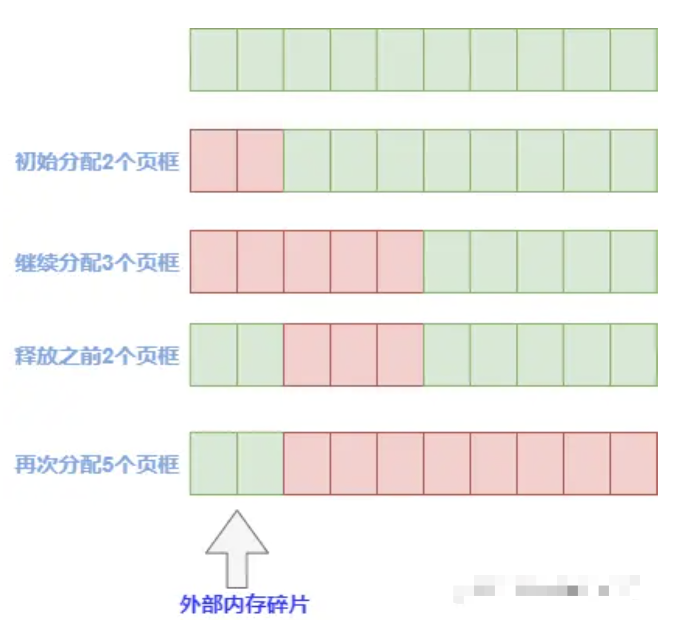
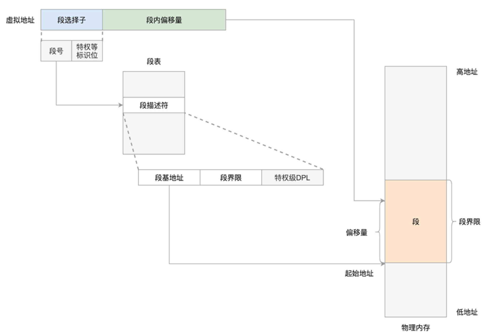
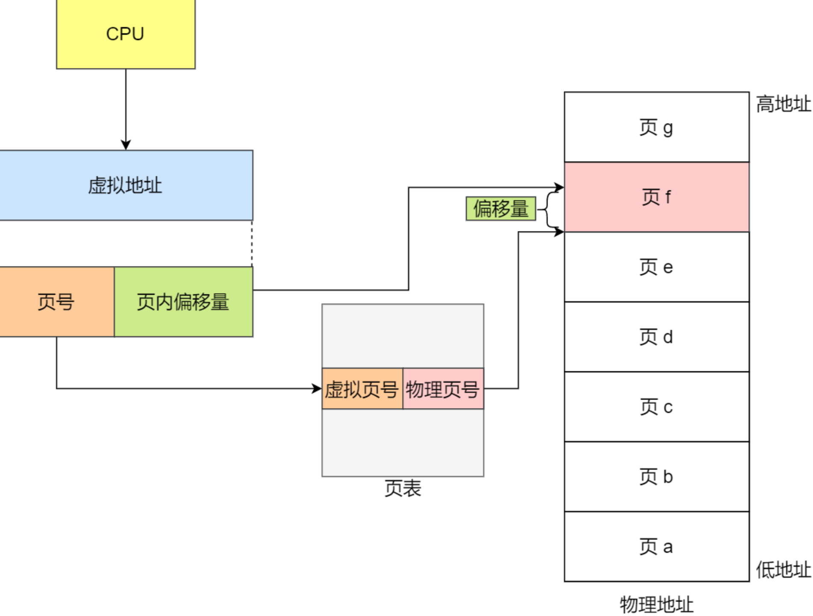
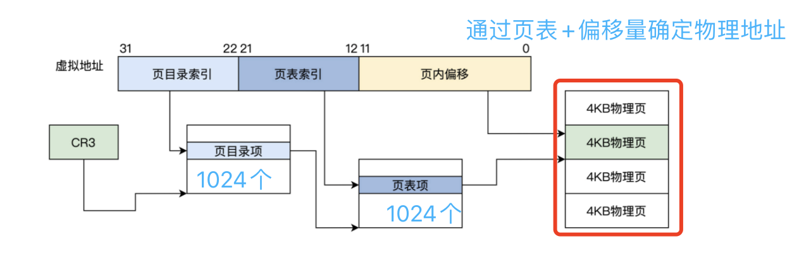
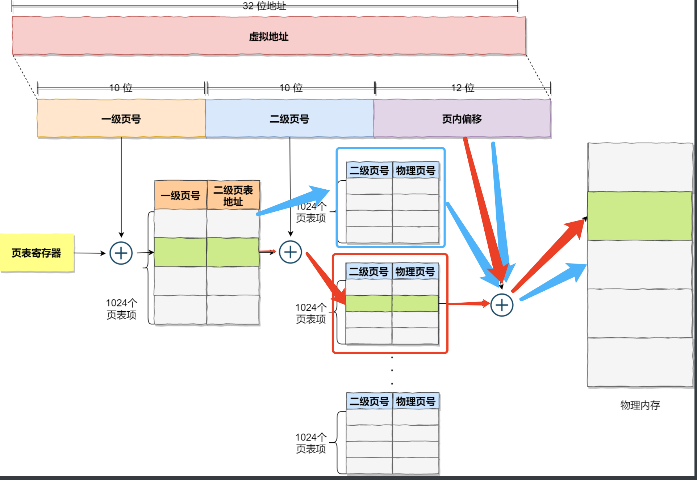

# 56.各层协议

## 56.1 OSI与TCP/IP各层的结构与功能,都有哪些协议?

7. `应用层`
为应用程序提供服务并且规定通信的规范和细节
   常见的协议:
   * HTTP(超文本传输协议)
   * FTP(文件传输协议)
   * TELNET(远程登录协议)
   * SMTP(简单邮件传输协议)
   * DNS(域名解析协议)
6. `表示层`
主要负责数据格式的转换
5. `会话层`
负责建立和断开通信连接
   * 结构化查询语言（ SQL, Structured Query Language ）
   * 网络文件系统（ NFS ， Network File System ）
   * 远程过程调用（ RPC ， Remote Procedure Call ）
4. `传输层`
   是唯一负责总体的数据传输和数据控制的一层。
   * TCP: ~~面向连接 ,可靠性强, 传输效率低~~
   * UDP: ~~无连接,可靠性弱,传输效率快~~
3. `网络层`
   将数据传输到目标地址；主要负责寻找地址和路由选择，网络层还可以实现拥塞控制、网际互连等功能
   * IP
   * IPX
   * RIP
   * OSPF等
2. `数据链路层`
   物理地址寻址、数据的成帧、流量控制、数据的检错、重发等。
   * ARP<font color=pink size='6'>（比较有争议，因为有的书籍放置了在网络层，有的书籍放置在了数据链路层，主要看）</font>
        注：最好的回答是，ARP 是询问具有某个 IP 地址的设备的 MAC 地址的，
            介于数据链路层和网络层之间。有的划分为数据链路层，这是根据封装方式来划分的，
            ARP 数据包封装成帧。有的划分为网络层，这是根据协议内容划分的，
            ARP 报文中有 IP 信息。我觉得应该划分为链路层。
     <font color='#2345'>华为曾经面试问过我</font>
   * RARP
   * SDLC
   * HDLC
   * PPP
   * STP
   * 帧中继等
1. `物理层`
   负责0、1比特流(0/1序列)与电压的高低、光的闪灭之间的转换

## 56.2 ⽹络层与数据链路层有什么关系呢？

1. IP 的作⽤是主机之间通信⽤的，负责在「没有直连」的两个⽹络之间进⾏通信传输
2. MAC 的作⽤则是实现「直连」的两个设备之间通信。
理解一下：
就比如说，你想从xx村到海南市，你不得做公交车、汽车、火车、轮船到海南
那么你这整个的一个路线图，就是一个网络层，行程开端就是xx村---->>>源IP，目的IP---->行程结束就是海南
那么我从xx村到xx镇相当于是在这个区间内移动路线，也就是数据链路层，
其中，xx村好⽐源 MAC 地址，xx镇好⽐⽬的 MAC 地址。
（只要是在线路（网络层包含的都是））
这个xx村、海南不会发生变化，但是中间的位置会一直在变，也就是说
IP源、目的不会变， Mac源、目的会变化

## 56.3 网络层的路由算法

1. 全局式路由选择算法：所有路由器掌握完整的网络拓扑和链路费用信息，例如链路状态(LS)路由算法
2. 分散式路由选择算法；路由器只掌握物理相连的邻居以及链路费用，例如距离向量(DV)路由算法

链路状态路由选择算法可以用Dijksua算法实现。

## 56.4 各种协议的端口号

（1）HTTP：80号端口以提供服务。
（2）DNS：DNS用的是53号端口。　　
（3）SNMP：简单网络管理协议，使用161号端口

## 56.5 四组元/五元组/七元组

四元组：源IP地址、目的IP地址、源端口、目的端口
五元组：源IP地址、目的IP地址、协议号、源端口、目的端口
七元组：源IP地址、目的IP地址、协议号、源端口、目的端口，服务类型以及接口索引

# 57.Get与Post

## 57.1 get与post的区别

1. GET产生一个TCP数据包；POST产生两个TCP数据包。
   因为对于一个get请求，浏览器会把http 头和数据一并发送出去，服务器响应200；
   post请求，浏览器先发送header，服务器响应之后，浏览器在发送数据，服务器响应200
2. Get ⽅法的含义是请求从服务器获取资源，这个资源可以是静态的⽂本、⻚⾯、图⽚视频等等
   ⽐如，你打开我的⽂章，浏览器就会发送 GET 请求给服务器，服务器就会返回⽂章的所有⽂字及资源
   ⽽ POST ⽅法则是相反操作，它向 URI 指定的资源提交数据，数据就放在报⽂的 body ⾥。
   ⽐如，你在我⽂章底部，敲⼊了留⾔后点击「提交」，浏览器就会执⾏⼀次 POST 请求，把你的留⾔⽂字放进了报⽂ body ⾥，
   然后拼接好 POST 请求头，通过 TCP 协议发送给服务器。
3. 就对于服务器资源是否发生破坏来说，
   GET ⽅法就是安全且幂等的，因为它是「只读」操作，⽆论操作多少次，服务器上的数据都是安全的，且每次的结果都是相同的。
   POST 因为是「新增或提交数据」的操作，会修改服务器上的资源，所以是不安全的，且多次提交数据就会创建多个资源，所以不是幂等的。
4. get传送的数据量较小，不能大于2KB。post传送的数据量较大，
   一般被默认为不受限制。但理论上，IIS4中最大量为80KB，IIS5中为100KB。
5. GET请求能够被保存在浏览器的浏览历史里面（密码等重要数据GET提交，别人查看历史记录，就可以直接看到这些私密数据）
   POST不进行缓存。

## 57.2 幕等

### 57.2.1 概念

多个请求返回相同的结果

## 57.3 为什么都用get而不用post？

1. 主要还是减低服务器流量压力
   比如，新闻站点的头版不断更新。虽然第二次请求会返回不同的一批新闻，该操作仍然被认为是安全的和幂等的，因为它总是返回当前的新闻。
   POST 请求就不那么轻松了。POST 表示可能改变服务器上的资源的请求。仍然以新闻站点为例，读者对文章的注解应该通过 POST 请求实现，
   比如说对数据请求频繁，数据不敏感且数据量在普通浏览器最小限定的2k范围内，这样的情况使用GET。其他地方使用POST。
2. 多数浏览器对于POST采用两阶段发送数据的，get只需要一阶段就可以了
   如果通信时间增加，这段时间客户端与服务器端一直保持连接状态，在服务器侧负载可能会增加，可靠性会下降。

## 57.4 get与post的应用场景

get主要是用来查询数据，比如说搜索某些内容
pist论坛上回贴、在博客上评论用的就比较多了

## 57.2 后台获取前端数据方法

1. Servlet

```java
@RequestMapping("allCity3")
    public String queryAllCity3(HttpServletRequest request, HttpServletResponse response) {
        List<City> cities = cityService.queryAllCity();
        for (City city : cities) {
            city.setAreas(null);
        }
        // 保存到session中
        /*HttpSession session = request.getSession();
        session.setAttribute("cities", cities);*/
        // 保存到request中
        request.setAttribute("cities", cities);
        // 返回的页面（这里配合相应的springMvc视图解析器）
        return "main";
    }
```

2. ModelAndView
把数据保存到ModelAndView中，直接传送到前端页面

```java
// 把要保存的数据保存进ModelAndView中
modelAndView.addObject("areaStatisticsList", areaStatisticsList);
// 设置跳转页面
modelAndView.setViewName("areaStatistics");
// 返回值
return modelAndView;
```

3. 通过@RequestParam获取
   形式如：@RequestParam(value="username") String userName

4. 通过@RequestBody注解获取
   主要用来接收前端传递给后端的json数据(后台函数形参可以String，也可以是类)；
   GET方式无请求体，所以使用@RequestBody接收数据时，
   前端不能使用GET方式提交数据，而是用POST方式进行提交。
   @RequestBody一般用来处理非Content-Type: application/x-www-form-urlencoded编码格式的数据。

## 57.3 get请求能传图片呢

如果是base64的话，可以实现
但是get的url长度有限制，不同浏览器限制长度不一样，所以base64只能传一些小图，

还有一种是file的，这个file对象一般是在post请求的body体中，
get我记得也有body，所以应该是可以的

# 58.状态码

## 58.1 状态码种类

2xx （3种）

   1. 200 ：表示从客户端发送给服务器的请求被正常处理并返回；
   2. 204 ：表示客户端发送给客户端的请求得到了成功处理，
   3. 206 ：表示客户端进行了范围请求。
3xx （5种）
   1. 301 Moved Permanently：永久性重定向，表示请求的资源被分配了新的URL，之后应使用更改的URL；
   2. 302 Found：临时性重定向，表示请求的资源被分配了新的URL，希望本次访问使用新的URL；
         301与302的区别：前者是永久移动，后者是临时移动（之后可能还会更改URL）
   3. 303 See Other：表示请求的资源被分配了新的URL，应使用GET方法定向获取请求的资源；
         302与303的区别：后者明确表示客户端应当采用GET方式获取资源
   4. 304 Not Modified：表示客户端发送附带条件
                       （是指采用GET方法的请求报文中包含if-Match、If-Modified-Since、
                         If-None-Match、If-Range、If-Unmodified-Since中任一首部）
                         的请求时，服务器端允许访问资源，但是请求为满足条件的情况下返回改状态码；
   5. 307 Temporary Redirect：临时重定向，与303有着相同的含义，
      307会遵照浏览器标准不会从POST变成GET；（不同浏览器可能会出现不同的情况）；
4xx （4种）
   1. 400 Bad Request：表示请求报文中存在语法错误；
   2. 401 Unauthorized：未经许可，需要通过HTTP认证；
   3. 403 Forbidden：服务器拒绝该次访问（访问权限出现问题）
   4. 404 Not Found：表示服务器上无法找到请求的资源，除此之外，
                     也可以在服务器拒绝请求但不想给拒绝原因时使用；
5xx （2种）
   1. 500 Inter Server Error：表示服务器在执行请求时发生了错误，
                              也有可能是web应用存在的bug或某些临时的错误时；
   2. 503 Server Unavailable：表示服务器暂时处于超负载或正在进行停机维护，
                              无法处理请求；

# 59.报文结构

## 59.1 报文组成

一个HTTP请求报文由四个部分组成：请求行、请求头、空行、请求数据。

1. 请求行
   请求行由请求方法字段、URL字段和HTTP协议版本字段3个字段组成，
   它们用空格分隔。比如 GET /data/info.html HTTP/1.1
2. 请求头部
   HTTP客户程序(例如浏览器)，向服务器发送请求的时候必须指明请求类型(一般是GET或者 POST)。
   如有必要，客户程序还可以选择发送其他的请求头。大多数请求头并不是必需的，。
   常见的请求头字段以及他的含义：
      1. Accept：浏览器可接受的MIME类型。
      2. Accept-Charset：浏览器可接受的字符集。
      3. Accept-Encoding：浏览器能够进行解码的数据编码方式，
                          比如gzip。Servlet能够向支持gzip的浏览器
                          返回经gzip编码的HTML页面。许多情形下这可以减少5到10倍的下载时间。
      4. Accept-Language：浏览器语言种类，
      5. Authorization：授权信息，通常出现在对服务器发送的WWW-Authenticate头应答
      6. Content-Length：表示请求消息正文的长度。
      7. Host： 客户机告诉服务器，想访问的主机名。
      8. If-Modified-Since：客户机告诉服务器，资源的缓存时间。
      9. Referer：客户机告诉服务器，它是从哪个资源来访问服务器的(防盗链)。
      10. User-Agent：User-Agent头域的内容包含发出请求的用户信息。
      11. Cookie：客户机通过这个头可以向服务器带数据，这是最重要的请求头信息之一。
3. 空行
   它的作用是通过一个空行，告诉服务器请求头部到此为止。
4. 请求数据
   若方法字段是POST,则通常来说此处放置的就是要提交的数据

# 60.HTTP

## 60.1 HTTP常用字段

1. Host字段
2. Content-Length字段
3. Connection字段
4. Content-Type字段
5. Content-Encoding字段

### 60.1.1 Host字段

客户端发送请求的时候，用来制定服务器的域名，这样我就可以往同一台服务器不同网站进行访问了

### 60.1.2 Content-Length字段

服务器返回数据的时候，就会有Content-Length字段，然后浏览器就会收到多少个字节

### 60.1.3 Connection字段

用于客户端要求服务端使用TCP进行持久连接
但是http 1.1 可以是持久连接

### 60.1.4 Content-Type字段

主要是服务器告诉客户端我是什么样的数据格式

### 60.1.15 Content-Encoding字段

说明数据的压缩方法或者格式

## 60.2 HTTP的工作流程

域名解析 -> 三次握手 -> 发起HTTP请求 -> 响应HTTP请求并得到HTML代码
-> 浏览器解析HTML代码  -> 浏览器对页面进行渲染呈现给用户

### 60.2.1 一个 TCP 连接后是否会在一个HTTP请求完成后断开？什么情况下会断开？

在 HTTP/1.0 中，一个服务器在发送完一个 HTTP 响应后，会断开 TCP 链接。
但是这样每次请求都会重新建立和断开 TCP 连接，代价过大。所以虽然标准中没有设定，
某些服务器对 Connection: keep-alive 的 Header 进行了支持。
意思是说，完成这个 HTTP 请求之后，不要断开 HTTP 请求使用的 TCP 连接。
这样的好处是连接可以被重新使用，之后发送 HTTP 请求的时候不需要重新建立 TCP 连接，
以及如果维持连接，那么 SSL 的开销也可以避免

### 60.2.2 HTTP慢的原因和解决方式

#### 60.2.2.1 HTTP慢的原因

1. 可能是带宽，网络基础建设完善后，带宽基本不是太大的问题

2. 延迟。HTTP/1.0主要的问题在于连接无法复用和head of line blocking.
   1）连接无法复用，导致每次请求经历3次握手和慢启动。
      3次握手在高延迟的场景下影响较为明显，慢启动则对文件类大请求影响较大

   2）head of line blocking，导致带宽无法被充分利用，以及后续的健康请求被阻塞。
      例如，有5个请求需要同时发出。HTTP/1.0时，
      只有在第一个请求的response回来之后后续的请求才会逐个发出。
      如果请求1的request没有及时抵达服务器或response没有及时返回，
      后续的请求就被耽搁了。

#### 60.2.2.2 如何解决HTTP慢

1. 解决连接无法复用
   http/1.0协议头里可以设置Connection:Keep-Alive或者Connection:Close，
   选择是否允许在一定时间内复用连接（时间可由服务器控制）。
   但是这对App端的请求成效不大，因为App端的请求比较分散且时间跨度相对较大。

      方案1.基于tcp的长连接
      移动端建立一条自己的长链接通道，通道的实现是基于tcp协议。
      基于tcp的socket编程技术难度相对复杂很多，而且需要自己定制协议。
      但信息的上报和推送变得更及时，
      请求量爆发的时间点还能减轻服务器压力（避免频繁创建和销毁连接）

      方案2.http long-polling
      客户端在初始状态发送一个polling请求到服务器，服务器并不会马上返回业务数据，
      而是等待有新的业务数据产生的时候再返回，所以链接会一直被保持。
      一但结束当前连接，马上又会发送一个新的polling请求，如此反复，保证一个连接被保持。
      存在问题：
      1）增加了服务器的压力
      2）网络环境复杂场景下，需要考虑怎么重建健康的连接通道
      3）polling的方式稳定性不好
      4）polling的response可能被中间代理cache住
      ……

      方案3.http streaming
      和long-polling不同的是，streaming方式通过再server response
      的头部增加“Transfer Encoding:chuncked”来告诉客户端后续还有新的数据到来
      存在问题：
      1）有些代理服务器会等待服务器的response结束之后才将结果推送给请求客户端。streaming不会结束response
      2）业务数据无法按照请求分割
      ……

      方案4.web socket
      和传统的tcp socket相似，基于tcp协议，提供双向的数据通道。
      它的优势是提供了message的概念，比基于字节流的tcp socket使用更简单。
      技术较新，不是所有浏览器都提供了支持。

2. 解决head of line blocking

它的原因是队列的第一个数据包（队头）受阻而导致整列数据包受阻

方案1.http pipelining
几乎在同一时间把request发向了服务器

## 60.3 HTTP存在的风险/问题

1. 通信使⽤明⽂（不加密），内容可能会被窃听。⽐如， 账号信息容易泄漏，那你号没了。
2. 不验证通信⽅的身份，因此有可能遭遇伪装。⽐如， 访问假的淘宝、拼多多，那你钱没了。
3. ⽆法证明报⽂的完整性，所以有可能已遭篡改。⽐如， ⽹⻚上植⼊垃圾⼴告，视觉污染，眼没了。

## 60.4 分类

1. HTTP 1.0
2. HTTP 1.1
3. HTTP 2
4. HTTP 3

## 60.4 持久连接与非持久连接（长连接与短连接）

### 60.4.1 HTTP哪些是持久连接？

HTTP/1.0 使用非持久连接。
HTTP/1.1 默认使用持久连接。

### 60.4.2 非持久链接

#### 60.4.2.1 如何使用

比如说，客户端请求一个页面。假设该页面包含1个HTML文件和10个JPEG图像

1. 首先，HTTP客户端与服务器主机某个网址中的HTTP服务器建立一个TCP连接。
2. 然后，HTTP客户端发送HTTP请求消息。 包含了比如说html文件。
3. 然后，HTTP服务器接收请求消息，从服务器主机内存或硬盘拿去除对象/sompath/index.html，发出该对象的响应消息。
4. 然后，HTTP服务器告知TCP关闭这个TCP连接(TCP要等客户收到这个响应消息后，才会真正终止这个连接)。
5. 之后，HTTP客户接收响应消息。TCP连接终止。 该消息标明所拆装的对象是一个HTML文件。客户取出文件，分析后发现10个JPEG对象的引用。
6. 给每一个引用到的JPEG对象重复步骤操作。

#### 60.4.2.2 如何改善时间延时问题

通过并行的TCP连接同时取到其中的某些对象。使用并行TCP连接，可以缩短响应时间。、

#### 60.4.2.3 缺点

1. 每个连接，TCP得在客户端和服务端分配TCP缓冲区，并维持TCP变量。
   对于同时为来自数百个不同客户的请求提供服务的web服务器来说，这会严重增加其负担。
2. 每个对象都有2个RTT的延迟。
3. 每个对象都遭受TCP缓启动，因为每个TCP连接都起始于缓启动阶段。

### 60.4.3 持久连接

### 60.4.4 参数

通过HTTP的Keep-alive是要让一个TCP连接活久点

#### 60.4.4.1 TCP的keep alive和HTTP的Keep-alive区别

TCP的keep alive是检查当前TCP连接是否活着
HTTP的Keep-alive是要让一个TCP连接活久点

## 60.2 HTTP 1.0

### 60.2.1 HTTP 1.0优缺点

`I.优点`

1. HTTP基本的报⽂格式就是header + body，头部信息也是key-value简单⽂本的形式。
2. HTTP协议⾥的各类请求⽅法、URI/URL、状态码、头字段等每个组成要求都没有被固定死，
   都允许开发⼈员⾃定义和扩充。
3. HTTP由于是⼯作在应⽤层，则它下层可以随意变化。
4. 应⽤⼴泛和跨平台

`II.缺点`

1. ⽆状态
   由于⽆状态，它在完成有关联性的操作时会⾮常麻烦。
   例如登录->添加购物⻋->下单->结算->⽀付，这系列操作都要知道⽤户的身份才⾏。
   但服务器不知道这些请求是有关联的，每次都要问⼀遍身份信息。
2. 明⽂传输
   明⽂意味着在传输过程中的信息，是可⽅便阅读的，
   通过浏览器的控制台或抓包软件都可以直接⾁眼查看，
   信息的内容都毫⽆隐私可⾔，很容易就能被窃取。
3. 不安全

#### 60.2.1.1 HTTP为什么是无连接和无状态的

1. 对于无连接来说
   限制每次连接只处理一个请求。服务器处理完客户的请求，并收到客户的应答后，即断开连接。采用这种方式可以节省传输时间。

2. 对于无状态来说
   大大减轻了服务器记忆负担，从而保持较快的响应速度。

### 60.2.2 无状态的解决方案

1. Cookie 技术
   因为Cookie通过在请求和响应报⽂中写⼊Cookie信息来控制客户端的状态。
   相当于，在客户端第⼀次请求后，服务器会下发⼀个装有客户信息的「⼩贴纸」，后续客户端请求服务器的时候，
   带上「⼩贴纸」，服务器就能认得了了，

## 60.3 HTTP 1.1

### 60.3.1 HTTP 1.1相对于HTTP 1.0改善

1. 因为早期HTTP/1.0，那就是每发起⼀个请求需要三次握手四次挥手等等操作，
   增加了通信开销。为了解决这些问题，HTTP/1.1提出了⻓连接的通信⽅式只要任意⼀端没有明确提出断开连接，
   则保持 TCP 连接状态。
2. HTTP/1.1 采⽤了⻓连接的⽅式，可在同⼀个 TCP 连接⾥⾯，客户端可以发起多个请求，
   只要第⼀个请求发出去了，不必等其回来，就可以发第⼆个请求出去，可以减少整体的响应时间。
3. 错误状态响应码，HTTP1.1新增了很多错误装填响应码，让开发者更加了解错误根源
4. 在HTTP1.0中主要使⽤header⾥的
   If-Modified-Since,Expires来做为缓存判断的标准，在HTTP1.1中引⼊了更多的缓存控制策略
5. HTTP1.0中，存在⼀些浪费带宽的现象，例如客户端只是需要某个对象的⼀部分，⽽服务器却将整个对象送过来了，
   并且不⽀持断点续传功能，HTTP1.1则在请求头引⼊了range头域，它允许只请求资源的某个部分

#### 60.3.1.1 HTTP的短连接

由于 HTTP 是基于 TCP 传输协议实现的，客户端与服务端要进行 HTTP 通信前，需要先建立 TCP 连接，
然后客户端发送 HTTP  请求，服务端收到后就返回响应，至此「请求-应答」的模式就完成了，
随后就会释放 TCP 连接。
建立 TCP -> 请求资源 -> 响应资源 -> 释放连接，那么此方式就是 HTTP 短连接

#### 60.3.1.2 HTTP的keepalive（长链接）

可以使用同一个 TCP 连接来发送和接收多个 HTTP 请求/应答，
避免了连接建立和释放的开销，这个方法称为 HTTP 长连接。
只要任意一端没有明确提出断开连接，则保持 TCP 连接状态。
HTTP 长连接不仅仅减少了 TCP 连接资源的开销，而且这给 HTTP 流水线技术提供了可实现的基础。

#### 60.3.1.2.3 长链接的资源浪费问题

如果客户端完成一个 HTTP 请求后，就不再发起新的请求，所以为了避免资源浪费的情况，
提供 keepalive_timeout 参数，用来指定 HTTP 长连接的超时时间。

#### 60.3.1.3 HTTP的流水线技术

客户端可以先一次性发送多个请求，而在发送过程中不需先等待服务器的回应，可以减少整体的响应时间。
举例来说，客户端需要请求两个资源。以前的做法是，在同一个 TCP 连接里面，先发送 A 请求，
然后等待服务器做出回应，收到后再发出 B 请求。HTTP 流水线机制则允许客户端同时发出 A 请求和 B 请求。
但是服务器还是按照顺序响应，先回应 A 请求，完成后再回应 B 请求。
而且要等服务器响应完客户端第一批发送的请求后，客户端才能发出下一批的请求，
也就说如果服务器响应的过程发生了阻塞，那么客户端就无法发出下一批的请求，此时就造成了「队头阻塞」的问题。

### 60.3.2 HTTP 1.1缺点

1. 延迟难以下降 ，虽然现在⽹络的「带宽」相⽐以前变多了，但是延迟降到⼀定幅度后，就很难再下降了，
2. 并发连接有限 ，⾕歌浏览器最⼤并发连接数是 6 个，
   ⽽且每⼀个连接都要经过 TCP 和 TLS 握⼿耗时，以及TCP 慢启动过程给流量带来的影响；
3. 队头阻塞问题 ，同⼀连接只能在完成⼀个 HTTP 事务（请求和响应）后，才能处理下⼀个事务；
4. HTTP  头部巨⼤且重复 ，由于 HTTP 协议是⽆状态的，每⼀个请求都得携带 HTTP 头部，
   特别是对于有携带cookie 的头部，⽽ cookie 的⼤⼩通常很⼤；
5. 不⽀持服务器推送消息 ，因此当客户端需要获取通知时，
   只能通过定时器不断地拉取消息，这⽆疑浪费⼤量了带宽和服务器资源。
6. 报⽂中 Header 部分存在的问题：含很多固定的字段，
   ⽐如Cookie、User Agent、Accept 等，这些字段加起来也⾼达⼏百字节甚⾄上千字节，同时字段重复

### 60.3.3 HTTP 1.1优化方案

1. 方案一：尽量避免发送HTTP请求；
2. 方案二：在需要发送HTTP请求时，考虑如何减少请求次数；
3. 方案三：减少服务器的HTTP响应的数据⼤⼩；

方案一：
如何避免发送HTTP请求呢？
对于⼀些具有重复性的 HTTP 请求，⽐如每次请求得到的数据都⼀样的，我们可以把这对「请求-响应」的数据都缓存在本地，
那么下次就直接读取本地的数据，不必在通过⽹络获取服务器的响应了，这样的话 HTTP/1.1的性能肯定⾁眼可⻅的提升。
所以，通过缓存技术，而HTTP协议的头部有不少是针对缓存的字段。

1. 首先，客户端会把第⼀次请求以及响应的数据保存在本地磁盘上，其中将请求的 URL 作为 key，⽽响应作为 value，两者形成映射关系。
2. 这样当后续发起相同的请求时，就可以先在本地磁盘上通过 key 查到对应的 value，也就是响应，如果找到了，就直接从本地读取该响应。
   读取本次磁盘的速度肯定⽐⽹络请求快得多，
3. 同时对于缓存的响应如果不是最新的，玩意拿错了，HTTP头部有一个过期时间参数，我记得是Expires
   就是说服务器在发送 HTTP 响应时，会估算⼀个过期的时间，并把这个信息放到响应头部中，这样客户端在查看响应头部的信息时，
   ⼀旦发现缓存的响应是过期的，则就会重新发送⽹络请求。
4. 但是如果客户端从第⼀次请求得到的响应头部中发现该响应过期了，客户端重新发送请求，假设服务器上的资源并没有变更，还是⽼样⼦，
   HTTP做了一个设定，在请求的etag头部带上第⼀次请求的响应头部中的摘要，这个摘要是唯⼀标识响应的资源，当服务器收到请求后，
   会将本地资源的摘要与请求中的摘要做个⽐较。如果不同，那么说明客户端的缓存已经没有价值，服务器在响应中带上最新的资源。
   如果相同，说明客户端的缓存还是可以继续使⽤的，那么服务器仅返回不含有包体的 304 Not Modified 响应，
   告诉客户端仍然有效，这样就可以减少响应资源在⽹络中传输的延时

方案二：
减少请求次数，这样的话，可以通过：1）减少重定向请求次数；2）合并请求；3）延迟发送请求

1. 如果重定向请求越多，那么客户端就要多次发起HTTP请求，每⼀次的HTTP请求都得经过⽹络，这⽆疑会越降低⽹络性能。
   另外，服务端这⼀⽅往往不只有⼀台服务器，⽐如源服务器上⼀级是代理服务器，然后代理服务器才与客户端通信，
   这时客户端重定向就会导致客户端与代理服务器之间需要2次消息传递，
   如果重定向的⼯作交由代理服务器完成，就能减少 HTTP 请求次数了
2. 如果把多个访问⼩⽂件的请求合并成⼀个⼤的请求，虽然传输的总资源还是⼀样，但是减少请求，也就意味着减少了重复发送的 HTTP 头部。
   有的⽹⻚会含有很多⼩图⽚、⼩图标，有多少个⼩图⽚，客户端就要发起多少次请求。那么对于这些⼩图⽚，我们可以考虑使⽤
   CSS Image Sprites 技术、或者webpack打包工具，或者将图⽚的⼆进制数据⽤ base64 编码后，以URL的形式潜⼊到HTML⽂件，跟随 HTML ⽂件⼀并发送.把它们合成⼀个⼤图⽚，这样浏览器就可以⽤⼀次请求获得⼀个⼤图⽚，
   然后再根据 CSS 数据把⼤图⽚切割成多张⼩图⽚。
   通过将多个⼩图⽚合并成⼀个⼤图⽚来减少 HTTP 请求的次数，以减少 HTTP 请求的次数，从⽽减少⽹络的开销。

3. ⼀般 HTML ⾥会含有很多 HTTP 的 URL，当前不需要的资源，我们没必要也获取过来，于是可以通过「按需获取」的⽅式，
   来减少第⼀时间的 HTTP 请求次数。请求⽹⻚的时候，没必要把全部资源都获取到，⽽是只获取当前⽤户所看到的⻚⾯资源
   当⽤户向下滑动⻚⾯的时候，再向服务器获取接下来的资源，这样就达到了延迟发送请求的效果。

方案三：
减少http相应的数据大小，可以考虑对相应的资源进行压缩，从而提升网络传输效率。一般的压缩方式有两种：无损和有损

1. 无损压缩：⾸先，我们针对代码的语法规则进⾏压缩，因为通常代码⽂件都有很多换⾏符或者空格，把这些多余的符号给去除掉。
           接下来，就是⽆损压缩了，需要对原始资源建⽴统计模型，利⽤这个统计模型，将常出现的数据⽤较短的⼆进制⽐
           特序列表示，将不常出现的数据⽤较⻓的⼆进制⽐特序列表示，⽣成⼆进制⽐特序列⼀般是「霍夫曼编码」算法。
           gzip 就是⽐较常⻅的⽆损压缩。客户端⽀持的压缩算法，
           会在 HTTP 请求中通过头部中的 Accept-Encoding 字段告诉服务器：
           服务器收到后，会从中选择⼀个服务器⽀持的或者合适的压缩算法，然后使⽤此压缩算法对响应资源进⾏压缩，
           最后通过响应头部中的 content-encoding 字段告诉客户端该资源使⽤的压缩算法。
           gzip 的压缩效率相⽐Google推出的Br算法低，所以如果可以，服务器应该选择压缩效率更⾼的 br 压缩算法。

2. 有损压缩：解压的数据会与原始数据不同但是⾮常接近。有损压缩主要将次要的数据舍弃，牺牲⼀些质量来减少数据量、提⾼压缩⽐，
           这种⽅法经常⽤于压缩多媒体数据，⽐如⾳频、视频、图⽚。可以通过 HTTP 请求头部中的 Accept 字段⾥
           的「 q 质量因⼦」，告诉服务器期望的资源质量。
           ⽐如说，⼀个在看书的视频，画⾯通常只有⼈物的⼿和书桌上的书是会有变化的，⽽其他地⽅通常都是静态的，
           于是只需要在⼀个静态的关键帧，使⽤增量数据来表达后续的帧，这样便减少了很多数据，提⾼了⽹络传输的性能。

## 60.4 HTTP 2

### 60.4.1 HTTP 2如何兼容HTTP 1.1

1. HTTP/2 没有在 URI ⾥引⼊新的协议名，仍然⽤「<http://」表示明⽂协议，⽤「https://>」表示加密协议，

2. 只在应⽤层做了改变，还是基于 TCP 协议传输，应⽤层⽅⾯为了保持功能上的兼容，
   HTTP/2 把 HTTP 分解成了「语义」和「语法」两个部分，「语义」层不做改动，与 HTTP/1.1 完全⼀致，
   ⽐如请求⽅法、状态码、头字段等规则保留不变。

### 60.4.2 HTTP 2优势

1. HTTP 2会压缩头如果你同时发出多个请求，
   他们的头是⼀样的或是相似的，那么，协议会帮你消除重复的部分。
   使用HPACK 算法：在客户端和服务器同时维护⼀张头信息表，所有字段都会存⼊这个表，
   ⽣成⼀个索引号，以后就不发送同样字段了，只发送索引号，这样就提⾼速度了。
2. HTTP 2全⾯采⽤了⼆进制格式，头信息和数据体都是⼆进制，
         计算机收到报⽂后，直接解析⼆进制报⽂，这增加了数据传输的效率。
3. HTTP 2的数据包不是按顺序发送的
4. HTTP 2是可以在⼀个连接中并发多个请求或回应。
5. HTTP 2还在⼀定程度上改善了传统的「请求 - 应答」⼯作模式，
          服务不再是被动地响应，也可以主动向客户端发送消息。

#### 60.4.2.1 头部压缩

##### 60.4.2.1.1 头部压缩方案

使用了HPACK算法HPACK 算法主要包含三个组成部分：

1. 静态字典；
2. 动态字典；
3. Huffman 编码（压缩算法）；

客户端和服务器两端都会建⽴和维护「字典」，⽤⻓度较⼩的索引号表示重复的字符串，再⽤Huffman编码压缩数据，可达到较高的⾼压缩率

##### 60.4.2.1.2 静态表编码

HTTP/2 为⾼频出现在头部的字符串和字段建⽴了⼀张静态表，它是写⼊到 HTTP/2 框架⾥的，不会变化的，静态表⾥共有61组
表中的 Index 表示索引（Key），Header Value 表示索引对应的 Value，Header Name 表示字段的名字，
⽐如Index为2代表GET，Index为8代表状态码200。

HTTP/2 头部由于基于⼆进制编码，就不需要冒号空格和末尾的\r\n作为分隔符，于是改⽤表示字符串⻓度（Value
Length）来分割 Index 和 Value。

比如说server头部字段，在 HTTP/1.1 的形式：
nghttpx\r\n算上冒号空格和末尾的\r\n，共占⽤了 17 字节，
⽽使⽤了静态表和 Huffman 编码，可以将它压缩成 8 字节，压缩率达到了一半。

##### 60.4.2.1.3 动态表编码

#### 60.4.2.2 二进制帧

##### 60.4.2.2.1 概念

HTTP/2 把响应报⽂划分成了两个帧，HEADERS（⾸部）和 DATA（消息负载）是帧的类型，
也就是说⼀条HTTP响应，划分成了两个帧来传输，并且采⽤⼆进制来编码。

##### 60.4.2.2.2

#### 60.4.2.3 并发传输

##### 60.4.2.3.1 并发传输如何实现的

并发传输主要是通过Stream设计的，1个TCP连接包含⼀个或者多个Stream，Stream是HTTP/2 并发的关键技术；
Stream⾥可以包含1个或多个Message， Message对应HTTP/1中的请求或响应，由HTTP头部和包体构成；
Message ⾥包含⼀条或者多个Frame， Frame是HTTP/2最⼩单位，以⼆进制压缩格式存放 HTTP/1 中的内容（头部和包体）；
不同 Stream 的帧是可以乱序发送的（因此可以并发不同的 Stream ） ，因为每个帧的头部会携带 Stream ID 信息，
所以接收端可以通过 Stream ID 有序组装成 HTTP 消息，⽽同⼀ Stream 内部的帧必须是严格有序的。

客户端和服务器双⽅都可以建⽴Stream， Stream ID也是有区别的，客户端建⽴的Stream必须是奇数号，
⽽服务器建⽴的 Stream 必须是偶数号。
同⼀个连接中的 Stream ID 是不能复⽤的，只能顺序递增，所以当 Stream ID 耗尽时，需要发⼀个控制帧⽤来关闭TCP连接。
HTTP/2通过Stream实现的并发，⽐HTTP/1.1通过TCP连接实现并发要快的多，因为当 HTTP/2 实现100个并发Stream时，
只需要建⽴⼀次 TCP 连接，⽽ HTTP/1.1 需要建⽴ 100 个 TCP 连接，每个 TCP 连接都要经过TCP 握⼿、慢启动
以及 TLS 握⼿过程，这些都是很耗时的。
HTTP/2 还可以对每个 Stream 设置不同优先级，帧头中的「标志位」可以设置优先级，
⽐如客户端访问HTML/CSS 和图⽚资源时，希望服务器先传递 HTML/CSS，再传图⽚，
那么就可以通过设置 Stream 的优先级来实现，以此提⾼⽤户体验。

#### 60.4.2.4 服务器主动推送资源

##### 60.4.2.4.1 http 2.0 主动推送如何实现的

客户端发起的请求，必须使⽤的是奇数号 Stream，服务器主动的推送，使⽤的是偶数号 Stream。
服务器在推送资源时，会通过 PUSH_PROMISE 帧传输 HTTP 头部，并通过帧中的 Promised Stream ID 字段告知客户端，
接下来会在哪个偶数号 Stream 中发送包体。
比如说在Stream1中通知客户端CSS资源即将到来，然后在Stream2中发送CSS资源，Stream1和Stream2可以并发的。

### 60.4.3 HTTP 2有哪些缺陷

1. 队头阻塞，HTTP/2 多个请求是跑在⼀个TCP连接中的，那么当TCP丢包时，整个TCP都要等待重传，那么就会阻塞该
   TCP 连接中的所有请求。因为TCP是字节流协议，TCP层必须保证收到的字节数据是完整且有序的，
   如果序列号较低的TCP段在⽹络传输中丢失了，即使序列号较⾼的TCP段已经被接收了，
   应⽤层也⽆法从内核中读取到这部分数据，从 HTTP 视⻆看，就是请求被阻塞了。
   比如说发送⽅发送了很多个packet，每个packet都有⾃⼰的序号，也可以认为是TCP的序列号，
   假设packet3在⽹络中丢失了，即使packet4-6被接收⽅收到后，由于内核中的TCP数据不是连续的，
   于是接收⽅的应⽤层就⽆法从内核中读取到，只有等到packet3重传后，接收⽅的应⽤层才可以从内核中读取到数据，
   这就是 HTTP/2 的队头阻塞问题，是在 TCP 层⾯发⽣的。
2. TCP 与 TLS 的握⼿时延迟；
   发起 HTTP 请求时，需要经过 TCP 三次握⼿和 TLS 四次握⼿（TLS 1.2）的过程，
   因此共需要 3 个 RTT 的时延才能发出请求数据。
   还有就是TCP 由于具有「拥塞控制」的特性，所以刚建⽴连接的 TCP 会有个「慢启动」的过程，它会对 TCP 连接
   产⽣"减速"效果。
2. ⽹络迁移需要重新连接；
   ⼀个 TCP 连接是由四元组（源 IP 地址，源端⼝，⽬标 IP 地址，⽬标端⼝）确定的，这意味着如果 IP 地址或者端
   ⼝变动了，就会导致需要 TCP 与 TLS 重新握⼿，这不利于移动设备切换⽹络的场景，⽐如 4G ⽹络环境切换成WIFI。

### 60.4.4 HTTP 2做了什么优化

放弃 TCP 协议，转⽽使⽤ UDP 协议作为传输层议，HTTP/3 协议就是这样做的

## 60.5 HTTP-3

### 60.5.1 QUIC协议

#### 60.5.1.1 特点

1. ⽆队头阻塞；
   QUIC 连接上的多个Stream之间并没有依赖，都是独⽴的，某个流发⽣丢包了，只会影响该流，其他流不受影响
   QUIC协议是可以在同⼀条连接上并发传输多个Stream，Stream可以认为就是⼀条HTTP请求。
   由于 QUIC 使⽤的传输协议是 UDP， UDP 不关⼼数据包的顺序，如果数据包丢失， UDP 也不关⼼。
   不过 QUIC 协议会保证数据包的可靠性，每个数据包都有⼀个序号唯⼀标识。当某个流中的⼀个数据包丢失了，
   即使该流的其他数据包到达了，数据也⽆法被 HTTP/3 读取，直到 QUIC 重传丢失的报⽂，数据才会交给 HTTP/3。
   ⽽其他流的数据报⽂只要被完整接收， HTTP/3 就可以读取到数据。

2. 更快的连接建⽴；
   QUIC 内部包含了 TLS，它在⾃⼰的帧会携带 TLS ⾥的“记录”，再加上 QUIC 使⽤的是 TLS1.3，
   因此仅需 1 个 RTT 就可以「同时」完成建⽴连接与密钥协商，甚⾄在第⼆次连接的时候，
   应⽤数据包可以和 QUIC 握⼿信息（连接信息 + TLS 信息）⼀起发送，达到 0-RTT 的效果。

3. 连接迁移；
   QUIC 协议没有⽤四元组的⽅式来“绑定”连接，⽽是通过连接 ID来标记通信的两个端点，
   客户端和服务器可以各⾃选择⼀组 ID 来标记⾃⼰，因此即使移动设备的⽹络变化后，导致 IP 地址变化了，
   只要仍保有上下⽂信息（⽐如连接 ID、 TLS 密钥等），就可以“⽆缝”地复⽤原连接，消除重连的成本，
   没有丝毫卡顿感，达到了连接迁移的功能。

### 60.5.1 HTTP 3做了哪些优化

1. 不需要在二进制帧定义Stream，直接使用QUIC的Stream
2. 使用了QPACK算法，静态表扩大到了91项
                  动态表解码方式发生了变化，在⾸次请求-响应后，双⽅会将未包含在静态表中的Header项
                  更新各⾃的动态表，接着后续传输时仅⽤1个数字表示，然后对⽅可以根据这1个数字
                  从动态表查到对应的数据，就不必每次都传输⻓⻓的数据，⼤⼤提升了编码效率。

#### 60.5.1.1 如果HPACK头部首次传递丢包，如何解决

QUIC 会有两个特殊的单向流，所谓的单项流只有⼀端可以发送消息，双向则指两端都可以发送消息，
传输 HTTP消息时⽤的是双向流，这两个单向流的⽤法：

1. ⼀个叫 QPACK Encoder Stream， ⽤于将⼀个字典（key-value）传递给对⽅，
   ⽐如⾯对不属于静态表的HTTP 请求头部，客户端可以通过这个 Stream 发送字典；
2. ⼀个叫 QPACK Decoder Stream，⽤于响应对⽅，告诉它刚发的字典已经更新到⾃⼰的本地动态表了，
   后续就可以使⽤这个字典来编码了。
这两个特殊的单向流是⽤来同步双⽅的动态表，编码⽅收到解码⽅更新确认的通知后，才使⽤动态表编码 HTTP 头部。

# 61.HTTPS

## 61.1 什么是HTTPS

HTTPS是在HTTP上建立SSL加密层，并对传输数据进行加密，是HTTP协议的安全版

## 61.2 HTTP与HTTPS区别

1. HTTP 是超⽂本传输协议，信息是明⽂传输，存在安全⻛险的问题。
   HTTPS 则解决 HTTP 不安全的缺陷，在TCP 和 HTTP ⽹络层之间加⼊了 SSL/TLS 安全协议，使得报⽂能够加密传输。
2. HTTP 连接建⽴相对简单， TCP 三次握⼿之后便可进⾏ HTTP 的报⽂传输。
   HTTPS 在 TCP 三次握⼿之后，还需进⾏ SSL/TLS 的握⼿过程，才可进⼊加密报⽂传输。
3. HTTP 的端⼝号是 80， HTTPS 的端⼝号是 443。
4. HTTPS 协议需要向 CA（证书权威机构）申请数字证书，来保证服务器的身份是可信的。

### 61.2.1 为何不所有的网站都使用HTTPS

1. 首先，需要权威CA颁发的SSL证书。
   从证书的选择、购买到部署，传统的模式下都会比较耗时耗力。
2. 其次，HTTPS普遍认为性能消耗要大于HTTP，
   因为与纯文本通信相比，加密通信会消耗更多的CPU及内存资源。
   如果每次通信都加密，会消耗相当多的资源，
   平摊到一台计算机上时，
   能够处理的请求数量必定也会随之减少。
   但事实并非如此，
   用户可以通过性能优化、把证书部署在SLB或CDN，
   来解决此问题。
3. 除此之外，想要节约购买证书的开销也是原因之一。
   要进行HTTPS通信，证书是必不可少的。
   而使用的证书必须向认证机构（CA）购买。

## 61.3 HTTPS 解决了 HTTP 的哪些问题？（为什么要HTTPS）

HTTP 由于是明⽂传输，所以安全上存在以下三个⻛险：

1. 通信使⽤明⽂（不加密），内容可能会被窃听。⽐如， 账号信息容易泄漏，那你号没了。
2. 不验证通信⽅的身份，因此有可能遭遇伪装。⽐如， 访问假的淘宝、拼多多，那你钱没了。
3. ⽆法证明报⽂的完整性，所以有可能已遭篡改。⽐如， ⽹⻚上植⼊垃圾⼴告，视觉污染，眼没了。

所以

HTTPS 在 HTTP 与 TCP 层之间加⼊了 SSL/TLS 协议，可以很好的解决了上述的⻛险：

1. 混合加密的⽅式实现信息的机密性，解决了窃听的⻛险。
   HTTPS 采用的是对称加密和非对称加密结合的「混合加密」方式：
   在通信建立 前 采用非对称加密的方式交换「会话秘钥」，后续就不再使用非对称加密；
   在通信过程中 全部使用对称加密的「会话秘钥」的方式加密明文数据。
   采用「混合加密」的方式的原因：
      对称加密只使用一个密钥，运算速度快，密钥必须保密，无法做到安全的密钥交换。
      非对称加密使用两个密钥：公钥和私钥，公钥可以任意分发而私钥保密，解决了密钥交换问题但速度慢。
2. 摘要算法的⽅式来实现完整性，它能够为数据⽣成独⼀⽆⼆的「指纹」，
   指纹⽤于校验数据的完整性，解决了篡改的⻛险。
   客户端在发送明文之前会通过摘要算法算出明文的「指纹」，
   发送的时候把「指纹 + 明文」一同加密成密文后，发送给服务器，
   服务器解密后，用相同的摘要算法算出发送过来的明文，
   通过比较客户端携带的「指纹」和当前算出的「指纹」做比较，
   若「指纹」相同，说明数据是完整的。
3. 将服务器公钥放⼊到数字证书中，解决了冒充的⻛险。
   客户端先向服务器端索要公钥，然后⽤公钥加密信息，服务器收到密⽂后，⽤⾃⼰的私钥解密。

## 61.4 加密算法

### 61.4.1 分类

}

1. 对称加密：密钥只有⼀个，加密解密为同⼀个密码，且加解密速度快，典型的对称加密，算法有DES、 AES等；
   * 优点：算法公开、计算量小、加密速度快、加密效率高，适合加密比较大的数据。
   * 缺点：
          交易双方需要使用相同的密钥，也就无法避免密钥的传输，
          而密钥在传输过程中无法保证不被截获，因此对称加密的安全性得不到保证。
          每对用户每次使用对称加密算法时，都需要使用其他人不知道的惟一密钥，
          这会使得发收信双方所拥有的钥匙数量急剧增长，密钥管理成为双方的负担。
          对称加密算法在分布式网络系统上使用较为困难，
          主要是因为密钥管理困难，使用成本较高。

2. ⾮对称加密：密钥成对出现（且根据公钥⽆法推知私钥，根据私钥也⽆法推知公钥），
               加密解密使⽤不同密钥（公钥加密需要私钥解密，私钥加密需要公钥解密），
               相对对称加密速度较慢，典型的⾮对称加密算法有RSA、 DSA等。

   * 优点：算法公开，加密和解密使用不同的钥匙，私钥不需要通过网络进行传输，安全性很高。
   * 缺点：计算量比较大，加密和解密速度相比对称加密慢很多。

对称加密 算法主要有 DES、3DES、AES 等，常见的 非对称算法 主要有 RSA、DSA 等

DES 加密算法是一种 分组密码，以 64 位为 分组对数据 加密，它的 密钥长度 是 56 位，加密解密 用 同一算法。
DES 加密算法是对 密钥 进行保密，而 公开算法，包括加密和解密算法。这样，只有掌握了和发送方 相同密钥
的人才能解读由 DES加密算法加密的密文数据。因此，破译 DES 加密算法实际上就是 搜索密钥的编码。
对于 56 位长度的 密钥 来说，如果用 穷举法 来进行搜索的话，其运算次数为 2 ^ 56 次。

RSA 加密算法 基于一个十分简单的数论事实：将两个大 素数 相乘十分容易，
但想要对其乘积进行 因式分解 却极其困难，因此可以将 乘积 公开作为 加密密钥。

### 61.4.2 Https对称加解密的过程

发送端和接收端首先要共享相同的密钥k
即通信前双方都需要知道对应的密钥才能进行通信。
发送端用共享密钥k对明文p进行加密，得到密文c，
并将得到的密文发送给接收端，接收端收到密文后，
并用其相同的共享密钥k对密文进行解密，得出明文p。

### 61.4.3 Https非对称加密过程

加密一方找到接收方的公钥e，
大部分的公钥查找工作实际上都是通过数字证书来实现的，
然后用公钥e对明文p进行加密后得到密文c，
并将得到的密文发送给接收方，接收方收到密文后，
用自己保留的私钥d进行解密，得到明文p，
用公钥加密的密文，只有拥有私钥的一方才能解密，
这样就可以解决加密的各方可以统一使用一个公钥即可。

## 61.5 摘要算法

比如一些提供下载的网站，在页面上除了压缩包的下载地址还提供了对应的MD5值。
我们下载该压缩包后可以查看压缩包的MD5值。
对比下载的压缩包MD5值和网站提供的MD5值，如果两个MD5值不一致，
那么说明该压缩包不是官方提供的那个压缩包，可能被替换成其他文件或被修改过。

### MD5算法

验证文件完整性
存储用户口令（比如密码）

## 61.6 摘要与加密的区别

1. 摘要是哈希值，我们通过散列算法比如MD5算法就可以得到这个哈希值。
   摘要只是用于验证数据完整性和唯一性的哈希值，不管原始数据是什么样的，得到的哈希值都是固定长度的。
   只是一个验证身份的令牌。所以我们无法通过摘要解密得到原始数据。
2. 加密是通过 “加密算法” 将 "明文" 加密成 “密文”。
   我们可以通过 “密钥” 和 “解密算法” 将 “密文” 还原成 “明文”。

## 61.6 数字证书

### 61.6.1 数字证书包含什么

1. 公钥；
2. 持有者信息；
3. 证书认证机构（CA）的信息；
4. CA 对这份⽂件的数字签名及使⽤的算法；
5. 证书有效期；
6. 还有⼀些其他额外信息；

### 61.6.2 作用

是⽤来认证公钥持有者的身份，以防⽌第三⽅进⾏冒充。
也就是证书就是⽤来告诉客户端，该服务端是否是合法的，因为只有证书合法，才代表服务端身份是可信的。

### 61.6.3 证书怎么来的

为了让服务端的公钥被⼤家信任，服务端的证书都是由CA（证书认证机构）签名的， CA就是⽹络世界⾥的公安局、公证中⼼，具有极⾼的可信度，
所以由它来给各个公钥签名，信任的⼀⽅签发的证书，那必然证书也是被信任的。
之所以要签名，是因为签名的作⽤可以避免中间⼈在获取证书时对证书内容的篡改。

### 61.6.4 数字证书的流程

分为了证书签名和客户端校验过程

CA 签发证书的过程的话：

   1. ⾸先 CA 会把持有者的公钥、⽤途、颁发者、有效时间等信息打成⼀个包，
      然后对这些信息进⾏ Hash 计算，得到⼀个 Hash 值；
   2. 然后 CA 会使⽤⾃⼰的私钥将该 Hash 值加密，⽣成 Certificate Signature，也就是 CA 对证书做了签名；
      最后将 Certificate Signature 添加在⽂件证书上，形成数字证书；

客户端校验服务端的数字证书的过程，

   1. ⾸先客户端会使⽤同样的 Hash 算法获取该证书的 Hash 值 H1；
   2. 通常浏览器和操作系统中集成了 CA 的公钥信息，浏览器收到证书后可以使⽤ CA 的公钥解密 Certificate
      Signature 内容，得到⼀个 Hash 值 H2 ；
   3. 最后⽐较 H1 和 H2，如果值相同，则为可信赖的证书，否则则认为证书不可信。

### 61.6.5 证书链

证书的验证过程中还存在⼀个证书信任链的问题，因为我们向 CA 申请的证书⼀般不是根证书签发的，⽽是由中间证书签发的，⽐如百度的证书，
会有一个三级层级关系，跟证书、中间证书、百度的证书
比如说百度证书

1. 客户端收到 baidu.com 的证书后，发现这个证书的签发者不是根证书，就⽆法根据本地已有的根证书中的公钥去验证baidu.com证书是否可信。
   于是，客户端根据 baidu.com 证书中的签发者，找到该证书的颁发机构是，比如说是google吧，然后向 CA 请求该中间证书。
2. 请求到证书后发现 google 证书是由 xxx签发的，由于 xxx 没有再上级签发机构，说明它是根证书，也就是⾃签证书。
   应⽤软件会检查此证书有否已预载于根证书清单上，如果有，则可以利⽤根证书中的公钥去验证 google 证书，如果发现验证通过，
   就认为该中间证书是可信的。google证书被信任后，可以使⽤ google 证书中的公钥去验证 baidu.com 证书的可信性，
   如果验证通过，就可以信任baidu.com 证书。

#### 61.6.5.1 为什么要有证书链

为了确保根证书的绝对安全性，将根证书隔离地越严格越好，不然根证书如果失守了，那么整个信任链都会有问题。

## 61.7 SSL/TLS协议

### 61.7.1 工作流程

1. 客户端向服务器索要并验证服务器的公钥。
2. 双⽅协商⽣产「会话秘钥」。
3. 双⽅采⽤「会话秘钥」进⾏加密通信。

### 61.7.2 四次握手分类

由于不同的密钥交换算法，TLS 的握⼿过程可能会有⼀些区别

1. RSA算法
2. ECDHE 算法

### 61.7.3 RSA的四次握手

#### 61.7.3.1 四次握手流程

第一次：客户端⾸先会发⼀个「Client Hello」消息
      消息⾥⾯有客户端使⽤的 TLS 版本号、⽀持的密码套件列表，以及⽣成的随机数（Client Random），这个随机
      数会被服务端保留，它是⽣成对称加密密钥的材料之⼀。

第二次：当服务端收到客户端的「Client Hello」消息后，会确认 TLS 版本号是否⽀持，和从密码套件列表中选择⼀个密码套件，
       以及⽣成随机数（Server Random）。
       接着，返回「Server Hello」消息，消息⾥⾯有服务器确认的 TLS 版本号，也给出了随机数（Server Random），
       然后从客户端的密码套件列表选择了⼀个合适的密码套件。基本的形式是「密钥交换算法 +签名算法 + 对称加密算法 + 摘要算法」
       然后，服务端为了证明⾃⼰的身份，会发送「Server Certificate」给客户端，这个消息⾥含有数字证书。
       随后，服务端发了「Server Hello Done」消息，⽬的是告诉客户端，我已经把该给你的东⻄都给你了，本次打招呼完毕。

客户端拿到了服务端的数字证书后，要校验该数字证书是真实有效

第三次握手，客户端验证完证书后，认为可信则继续往下⾛。接着，客户端就会⽣成⼀个新的随机数，⽤服务器的RSA公钥加密该随机数，
          通过「Change Cipher Key Exchange」消息传给服务端。服务端收到后，⽤RSA私钥解密，
          得到客户端发来的随机数。客户端和服务端双⽅都共享了三个随机数，分别是Client Random、Server Random、pre-master。
          于是，双⽅根据已经得到的三个随机数，⽣成会话密钥（Master Secret），它是对称密钥，⽤于对后续的HTTP请求/响应的数据加解密。
          ⽣成完会话密钥后，然后客户端发⼀个「Change Cipher Spec」，告诉服务端开始使⽤加密⽅式发送消息。

第四次握手，TLS 第四次握⼿服务器也是同样的操作，发「Change Cipher Spec」和「Encrypted Handshake Message」消息，
          如果双⽅都验证加密和解密没问题，那么握⼿正式完成。最后，就⽤「会话密钥」加解密 HTTP 请求和响应了。

#### 61.7.3.2 缺点

使⽤ RSA 密钥协商算法的最⼤问题是不⽀持前向保密。因为客户端传递随机数（⽤于⽣成对称加密密钥的条件之
⼀）给服务端时使⽤的是公钥加密的，服务端收到到后，会⽤私钥解密得到随机数。所以⼀旦服务端的私钥泄漏
了，过去被第三⽅截获的所有 TLS 通讯密⽂都会被破解。

为了解决这⼀问题，于是就有了 DH 密钥协商算法

客户端和服务端各⾃会⽣成随机数，并以此作为私钥，然后根据公开的 DH 计算公示算出各⾃的公钥，通过 TLS
握⼿双⽅交换各⾃的公钥，这样双⽅都有⾃⼰的私钥和对⽅的公钥，然后双⽅根据各⾃持有的材料算出⼀个随机
数，这个随机数的值双⽅都是⼀样的，这就可以作为后续对称加密时使⽤的密钥。
DH 密钥交换过程中，即使第三⽅截获了 TLS 握⼿阶段传递的公钥，在不知道的私钥的情况下，也是⽆法计算出
密钥的，⽽且每⼀次对称加密密钥都是实时⽣成的，实现前向保密。
但因为 DH 算法的计算效率问题，会有其他算法升级

### 61.7.4 ECDHE的四次握手

#### 61.7.4.1 四次握手流程

使⽤了ECDHE，在 TLS 第四次握⼿前，客户端就已经发送了加密的 HTTP 数据，所以， ECDHE 相⽐ RSA 握⼿过程省去了⼀个消息往返的时间

第一次握手，客户端⾸先会发⼀个Client Hello消息，消息⾥⾯有客户端使⽤的TLS版本号、⽀持的密码套件列表，以及⽣成的随机数
第二次握手，服务端收到客户端的「打招呼」，同样也要回礼，会返回「Server Hello」消息，消息⾯有服务器确认的 TLS 版本号，
          也给出了⼀个随机数 ，然后从客户端的密码套件列表选择了⼀个合适的密码套件。不过这次套件内容发生了变化：
          1. 密钥协商算法使⽤ ECDHE；
          2. 签名算法使⽤ RSA；
          3. 握⼿后的通信使⽤ AES 对称算法，密钥⻓度 256 位，分组模式是 GCM；
          4. 摘要算法使⽤ SHA384；

接着，服务端为了证明⾃⼰的身份，发送「Certificate」消息，会把证书也发给客户端。因为服务端选择了 ECDHE 密钥协商算法，
所以会在发送完证书后，发送「Server Key Exchange」消息。然后选择了名为 named_curve 的椭圆曲线，
选好了椭圆曲线相当于椭圆曲线基点 G 也定好了，这些都会公开给客户端；⽣成随机数作为服务端椭圆曲线的私钥，保留到本地；
根据基点 G 和私钥计算出服务端的椭圆曲线公钥，这个会公开给客户端。为了保证这个椭圆曲线的公钥不被第三⽅篡改，
服务端会⽤ RSA 签名算法给服务端的椭圆曲线公钥做个签名。随后，就是「Server Hello Done」消息，
服务端跟客户端表明： “这些就是我提供的信息，打招呼完毕”。
TLS 两次握⼿就已经完成了，⽬前客户端和服务端通过明⽂共享了这⼏个信息： Client Random、 Server Random 、使⽤的椭圆曲线、
椭圆曲线基点 G、服务端椭圆曲线的公钥，这⼏个信息很重要，是后续⽣成会话密钥的材料。

第三次握手，客户端收到了服务端的证书后，⾃然要校验证书是否合法，如果证书合法，那么服务端到身份就是没问题的。校验证书到过程，
          会⾛证书链逐级验证，确认证书的真实性，再⽤证书的公钥验证签名，这样就能确认服务端的身份了，确认⽆误后，就可以继续往下⾛。
          客户端会⽣成⼀个随机数作为客户端椭圆曲线的私钥，然后再根据服务端前⾯给的信息，⽣成客户端的椭圆曲线公钥，
          然后⽤「Client Key Exchange」消息发给服务端。⾄此，双⽅都有对⽅的椭圆曲线公钥、⾃⼰的椭圆曲线私钥、椭圆曲线基点 G。
          于是，双⽅都就计算出点（x，y），其中 x 坐标值双⽅都是⼀样的，x 是会话密钥，
          最终的会话密钥，就是⽤「客户端随机数 + 服务端随机数 + x（ECDHE 算法算出的共享密钥） 」三个材料⽣成的。
          `之所以这么麻烦，是因为 TLS 设计者不信任客户端或服务器「伪随机数」的可靠性，为了保证真正的完全随机，`
          `把三个不可靠的随机数混合起来，那么「随机」的程度就⾮常⾼了，⾜够让⿊客计算出最终的会话密钥，安全性更⾼。`
          算好会话密钥后，客户端会发⼀个「Change Cipher Spec」消息，告诉服务端后续改⽤对称算法加密通信。
          接着，客户端会发「Encrypted Handshake Message」消息，把之前发送的数据做⼀个摘要，再⽤对称密钥加密⼀下，
          让服务端做个验证，验证下本次⽣成的对称密钥是否可以正常使⽤。

第四次握手，最后，服务端也会有⼀个同样的操作，发「Change Cipher Spec」和「Encrypted Handshake Message」消息，
          如果双⽅都验证加密和解密没问题，那么握⼿正式完成。于是，就可以正常收发加密的 HTTP 请求和响应了。

#### 61.7.5.2 ECDHE 算法

ECDHE 算法是在 DHE 算法的基础上利⽤了 ECC 椭圆曲线特性，可以⽤更少的计算量计算出公钥，以及最终的会话密钥。

ECDHE 密钥交换算法的过程

1. 双⽅事先确定好使⽤哪种椭圆曲线，和曲线上的基点G，这两个参数都是公开的
2. 双⽅各⾃随机⽣成⼀个随机数作为私钥d，并与基点 G相乘得到公钥Q（Q = dG），此时a的公私钥为 Q1和 d1，b的公私钥为 Q2 和 d2；
3. 双⽅交换各⾃的公钥，最后⼩红计算点（x1， y1） = d1Q2，⼩明计算点（x2， y2） = d2Q1，
   由于椭圆曲线上是可以满⾜乘法交换和结合律，所以 d1Q2 = d1d2G = d2d1G = d2Q1 ，因此双⽅的 x 坐标是⼀样的，
   所以它是共享密钥，也就是会话密钥。

这个过程中，双⽅的私钥都是随机、临时⽣成的，都是不公开的，即使根据公开的信息（椭圆曲线、公钥、基点G）
也是很难计算出椭圆曲线上的离散对数（私钥）

### 61.7.5 RSA和ECDHE握⼿过程的区别

1. RSA 密钥协商算法「不⽀持」前向保密， ECDHE 密钥协商算法「⽀持」前向保密；
2. 使⽤了 RSA 密钥协商算法， TLS 完成四次握⼿后，才能进⾏应⽤数据传输，⽽对于 ECDHE 算法，
   客户端可以不⽤等服务端的最后⼀次TLS 握⼿，就可以提前发出加密的 HTTP 数据，节省了⼀个消息的往返时间；
3. 使⽤ ECDHE， 在 TLS 第 2 次握⼿中，会出现服务器端发出的「Server Key Exchange」消息，⽽ RSA 握⼿过程没有该消息；

## 61.8 https性能消耗

### 61.8.1 https在哪里有性能损耗

1. TLS 协议握⼿过程
2. 握⼿后的对称加密报⽂传输

因为TLS 协议握⼿过程；TLS 协议握⼿过程不仅增加了⽹络延时（最⻓可以花费掉 2 RTT），
⽽且握⼿过程中的⼀些步骤也会产⽣性能损耗，⽐如：
   对于 ECDHE 密钥协商算法，握⼿过程中会客户端和服务端都需要临时⽣成椭圆曲线公私钥；
   客户端验证证书时，会访问 CA 获取 CRL 或者 OCSP，⽬的是验证服务器的证书是否有被吊销；
   双⽅计算 Pre-Master，也就是对称加密密钥；

## 61.9 HTTPS优化

1. 对于硬件优化的⽅向，因为 HTTPS 是属于计算密集型，应该选择计算⼒更强的 CPU，⽽且最好选择⽀持 AES-NI特性的 CPU，
   这个特性可以在硬件级别优化 AES 对称加密算法，加快应⽤数据的加解密。

2. 对于软件优化的⽅向，如果可以，把软件升级成较新的版本，⽐如将 Linux 内核 2.X 升级成 4.X，将 openssl 1.0.1升级到 1.1.1，
   因为新版本的软件不仅会提供新的特性，⽽且还会修复⽼版本的问题。

3. 对于协议优化的⽅向：
   密钥交换算法应该选择 ECDHE 算法，⽽不⽤ RSA 算法，因为 ECDHE 算法具备前向安全性，⽽且客户端可以在第三次握⼿之后
   就发送加密应⽤数据，节省了 1 RTT。
   将 TSL1.2 升级 TSL1.3，因为 TSL1.3 的握⼿过程只需要 1 RTT，⽽且安全性更强。

4. 对于证书优化的⽅向：
   服务器应该选⽤ ECDSA 证书，⽽⾮ RSA 证书，因为在相同安全级别下， ECC 的密钥⻓度⽐ RSA 短很多，这样可以提⾼证书传输的效率；
   服务器应该开启 OCSP Stapling 功能，由服务器预先获得 OCSP 的响应，并把响应结果缓存起来，
   这样TLS 握⼿的时候就不⽤再访问 CA 服务器，减少了⽹络通信的开销，提⾼了证书验证的效率；
   对于重连 HTTPS 时，我们可以使⽤⼀些技术让客户端和服务端使⽤上⼀次 HTTPS 连接使⽤的会话密钥，直接恢复会话，
   ⽽不⽤再重新⾛完整的 TLS 握⼿过程。

5. 常⻅的会话重⽤技术有 Session ID 和 Session Ticket，⽤了会话重⽤技术，当再次重连 HTTPS 时，只需要 1 RTT就可以恢复会话。
   对于 TLS1.3 使⽤ Pre-shared Key 会话重⽤技术，只需要 0 RTT 就可以恢复会话。
   这些会话重⽤技术虽然好⽤，但是存在⼀定的安全⻛险，它们不仅不具备前向安全，⽽且有重放攻击的⻛险，所以
   应当对会话密钥设定⼀个合理的过期时间。

## 61.10 https比http慢

因为
HTTP耗时 = TCP握手
HTTPs耗时 = TCP握手 + SSL握手
所以就需要看ssl握手

# 62.拆包粘包

## 62.1 粘包

### 62.1.1 概念

TCP粘包就是指发送方发送的若干包数据到达接收方时粘成了一包，
从接收缓冲区来看，后一包数据的头紧接着前一包数据的尾，
例如基于tcp的套接字客户端往服务端上传文件，发送时文件内容是按照一段一段的字节流发送的，
在接收方看了，根本不知道该文件的字节流从何处开始，在何处结束
所谓粘包问题主要还是因为接收方不知道消息之间的界限，不知道一次性提取多少字节的数据所造成的。

### 62.1.2 粘包的原因

1. 发送方原因
   TCP默认使用Nagle算法（主要作用：会将数据量小的，且时间间隔较短的数据一次性发给对方），
   而Nagle算法主要做两件事：
   只有上一个分组得到确认，才会发送下一个分组
   收集多个小分组，在一个确认到来时一起发送
   Nagle算法造成了发送方可能会出现粘包问题
2. 接收方原因
   TCP接收到数据包时，并不会马上交到应用层进行处理，
   或者说应用层并不会立即处理。实际上，TCP将接收到的数据包保存在接收缓存里，
   然后应用程序主动从缓存读取收到的分组。
   这样一来，如果TCP接收数据包到缓存的速度大于应用程序从缓存中读取数据包的速度，
   多个包就会被缓存，应用程序就有可能读取到多个首尾相接粘到一起的包。

### 62.1.3 粘包解决方案

（1）发送方
   对于发送方造成的粘包问题，可以通过关闭Nagle算法来解决，
   使用TCP_NODELAY选项来关闭算法。
（2）接收方
   接收方没有办法来处理粘包现象，只能将问题交给应用层来处理。
（2）应用层
   解决办法：循环处理，应用程序从接收缓存中读取分组时，
   读完一条数据，就应该循环读取下一条数据，
   直到所有数据都被处理完成，之后开始处理每条数据的长度
   因为每条数据有固定的格式（开始符，结束符），
   但是选择开始符和结束符时一定要确保每条数据的内部不包含开始符和结束符。
   发送每条数据时，将数据的长度一并发送，
   例如规定数据的前4位是数据的长度，
   应用层在处理时可以根据长度来判断每个分组的开始和结束位置。

### 621.1.4 UDP会不会产生粘包问题呢

UDP不会发生粘包拆包现象
UDP则是面向消息传输的，是有保护消息边界的，
接收方一次只接受一条独立的信息，所以不存在粘包问题。
保护消息边界：指传输协议把数据当做一条独立的消息在网上传输，
接收端一次只能接受一条独立的消息
比如说，有三个数据包，大小分别为2k、4k、6k，如果采用UDP发送的话，
不管接受方的接收缓存有多大，我们必须要进行至少三次以上的发送才能把数据包发送完，
但是使用TCP协议发送的话，我们只需要接受方的接收缓存有12k的大小，
就可以一次把这3个数据包全部发送完毕。

## 62.2 拆包

## 62.3 HTTP拆包粘包

一个有报文的请求到服务器时，请求头里都会有content_length，这个指定了报文的大小，
报文如果很大的时候，会通过一部分一部分的发送请求，直到结束，
当这个过程中，出现多个请求，第一个请求会带有请求头信息，前面一个请求的如果发送的报文如果没有满时，
会把后面一个请求的内容填上，这个操作就叫粘包。
这样粘包后，它会通过content_length字段的大小，来做拆包。

# 63.Cookie与Session和token

## 63.1 Cookie

### 63.1.1 概念

### 63.1.2 作用

cookie是服务路发送到用户浏览器并保存在本地的小快数据，
它会在浏览器之后向同一服务器再次发起请求时被携带上，
用于告知服务端两个请求是否来自同一浏览器

### 63.1.3 Cookie被禁⽤怎么办

最常⽤的就是利⽤ URL 重写把 Session ID 直接附加在URL路径的后⾯。

### 63.1.4 cookie被禁用了，session还能用么

能用，但没有使用cookie那么安全。cookie没有被禁用的时候，浏览器向服务器发送请求时，
会自动带上cookie。SESSIONID放在cookie里面，所以服务器可以根据SESSIONID找到相应的session文件。
cookie被禁用时，还可以通过get、post参数来向服务器提供SESSIONID。php支持通过URL 参数 来向服务器提供SESSIONID。
但是要设置php.ini文件

### 63.1.15 cookie如何放置攻击

需要在HTTP头部配上，set-cookie：httponly-。这个属性可以防止XSS,
它会禁止javascript脚本来访问cookie。

## 63.2 Session

### 63.2.1 概念

### 63.2.2 作用

### 63.2.3 HTTP是不保存状态的协议,如何保存⽤户状态

通过Session机制解决，Session的主要作⽤就是通过服务端记录⽤户的状态。

如应用场景购物⻋，当你要添加商品到购物⻋的时候，系统不知道是哪个⽤户操作的，
因为HTTP协议是⽆状态的。服务端给特定的⽤户创建特定Session之后就可以标
识这个⽤户并且跟踪这个⽤户了（⼀般情况下，服务器会在⼀定时间内保存这个Session，
过了时间限制，就会销毁这个Session）

### 62.2.4 Session用户登录状态过程

1. 用户进行登录时，用户提交包含用户名和密码的表单，放入HTTP请求报文中，
2. 服务器验证该用户名和密码，
         如果正确则把用户信息存储到Redis中，
         它在Redis中Key称为Session ID:
3. 服务器返回的响应报文的Se-Coeo首部字段包含了这个Session ID.
         客户端收到响应报文之后将该Cookie值存入浏览器中:
4. 客户编之后对间一 个服务器进行请求时会包含该Cookie值，
       服务器收到之后提取出Session ID.从Redis中取出用户信息，
       维续之前的业务操作。

### 62.2.5 如何保存session

在服务端保存Session的⽅法很多，
最常⽤的就是内存和数据库(⽐如是使⽤内存数据库redis保存)。

### 62.2.6 如何实现 Session 跟踪呢？

⼤部分情况下，我们都是通过在Cookie 中附加⼀个 Session ID 来⽅式来跟踪。

### 62.2.7 Session机制（多个session如何识别）

session机制是一种服务器端的机制，服务器使用一种类似于散列表的结构
（也可能就是使用散列表）来保存信息。
当程序需要为某个客户端的请求创建一个session的时候，
服务器首先检查这个客户端的请求里是否已包含了一个session标识
称为session id，
如果已包含一个session id则说明以前已经为此客户端创建过session，
服务器就按照session id把这个session检索出来使用
（如果检索不到，可能会新建一个），
如果客户端请求不包含session id，则为此客户端创建一个session
并且生成一个与此session相关联的session id，
session id的值应该是一个既不会重复，又不容易被找到规律以仿造的字符串，
这个session id将被在本次响应中返回给客户端保存。

## 63.3 token

### 63.3.1 概念

### 63.3.2 作用

### 63.3.3 机制/流程

1. 客户端使用用户名跟密码请求登录
2. 服务端收到请求，去验证用户名与密码
3. 验证成功后，服务端会签发一个 token 并把这个 token 发送给客户端
4. 客户端收到 token 以后，会把它存储起来，比如放在 cookie 里或者 localStorage 里
5. 客户端每次向服务端请求资源的时候需要带着服务端签发的 token
6. 服务端收到请求，然后去验证客户端请求里面带着的 token ，如果验证成功，就向客户端返回请求的数据

## 63.4 区别

### 63.4.1 Cookie 和 Session 的区别

1. 安全性： Session 比 Cookie 安全，Session 是存储在服务器端的，Cookie 是存储在客户端的。
2. 存取值的类型不同：Cookie 只支持存字符串数据，想要设置其他类型的数据，
                     需要将其转换成字符串，Session 可以存任意数据类型。
3. 有效期不同： Cookie 可设置为长时间保持，比如我们经常使用的默认登录功能，
                Session 一般失效时间较短，客户端关闭（默认情况下）或者 Session 超时都会失效。
4. 存储大小不同： 单个 Cookie 保存的数据不能超过 4K，Session 可存储数据远高于 Cookie，
                 但是当访问量过多，会占用过多的服务器资源。

### 64.4.2 token和cookie实现的区别

1. Session 是一种记录服务器和客户端会话状态的机制，使服务端有状态化，可以记录会话信息。而Token 是令牌
   访问资源接口（API）时所需要的资源凭证。Token 使服务端无状态化，不会存储会话信息。
2. Token每一个请求都有签名还能防止监听以及重放攻击，而Session就必须依赖链路层来保障通讯安全了。
3. 如果你的用户数据可能需要和第三方共享，或者允许第三方调用 API 接口，用Token 。
   如果永远只是自己的网站，自己的 App，用什么就无所谓了。

# 64.输入网址

## 64.1 输入网址牵扯到的技术

1. HTTP
2. DNS
3. 协议栈
4. TCP
5. IP
6. MAC
7. 网卡
8. 交换机
9. 路由器

## 64.1 输入网址过程

1. 输入地址,对URL进⾏解析，从⽽⽣成发送给Web服务器的请求信息。
2. 浏览器查找域名的IP地址,因为委托操作系统发送消息时，必须提供通信对象的 IP 地址。
   1) 浏览器会首先查看本地硬盘的hosts文件，看看其中有没有和这个域名对应的规则，
      如果有的话就直接使用hosts文件里面的ip地址。
   2) 如果在本地的hosts文件没有能够找到对应的ip地址，浏览器会发出一个DNS请求到本地DNS服务器
   3) 查询你输入的网址的DNS请求到达本地DNS服务器之后，本地DNS服务器会首先查询它的缓存记录，如果缓存中有此条记录，
      就可以直接返回结果，此过程是递归的方式进行查询。如果没有，本地DNS服务器还要向DNS根服务器进行查询。
   4) 根DNS服务器没有记录具体的域名和IP地址的对应关系，而是告诉本地DNS服务器，你可以到域服务器上去继续查询，
      并给出域服务器的地址。这种过程是迭代的过程。
   5) 本地DNS服务器继续向域服务器发出请求，比如说请求的对象是.com域服务器。
      .com域服务器收到请求之后，也不会直接返回域名和IP地址的对应关系，而是告诉本地DNS服务器，你的域名的解析服务器的地址
   6) 最后，本地DNS服务器向域名的解析服务器发出请求，这时就能收到一个域名和IP地址对应关系，
      本地DNS服务器不仅要把IP地址返回给用户电脑，还要把这个对应关系保存在缓存中，
      以备下次别的用户查询时，可以直接返回结果，加快网络访问。
3. 浏览器向web服务器发送一个HTTP请求
      通过DNS获取到IP后，就可以把HTTP的传输⼯作交给操作系统中的协议栈。协议栈的内部分为⼏个部分，分别承担不同的⼯作。
      上下关系是有⼀定的规则的，上⾯的部分会向下⾯的部分委托⼯作，下⾯的部分收到委托的⼯作并执⾏。
      应⽤程序也就是浏览器通过调⽤ Socket 库，来委托协议栈⼯作。协议栈的上半部分有两块，分别是负责收发数据的 TCP 和 UDP 协议，
      它们两会接受应⽤层的委托执⾏收发数据的操作。协议栈的下⼀半是⽤IP协议控制⽹络包收发操作，
      在互联⽹上传数据时，数据会被切分成⼀块块的⽹络包，⽽将⽹络包发送给对⽅的操作就是由 IP 负责的。
      IP 下⾯的⽹卡驱动程序负责控制⽹卡硬件，
      ⽽最下⾯的⽹卡则负责完成实际的收发操作，
      也就是对⽹线中的信号执⾏发送和接收操作。
      拿到域名对应的IP地址之后，
      浏览器会以一个随机端口向服务器的WEB程序80端口发起TCP的连接请求。
      这个连接请求到达服务器端后，进入到网卡，然后是进入到内核的TCP/IP协议栈，
      还有可能要经过防火墙的过滤，最终到达WEB程序，最终建立了TCP/IP的连接。
4. 服务器的永久重定向响应
      服务器给浏览器响应一个301永久重定向响应，这样浏览器就会访问3w了。
5. 浏览器跟踪重定向地址，
      因为现在浏览器知道了 "http://www.google.com/"才是要访问的正确地址，
      所以它会发送另一个http请求
6. 服务器处理请求
      http请求发送到了服务器，后端从在固定的端口接收到TCP报文开始，
      它会对TCP连接进行处理，对HTTP协议进行解析，
      并按照报文格式进一步封装成HTTP Request对象，供上层使用。
7. 服务器返回一个HTTP响应
      服务器收到了我们的请求，也处理我们的请求，
      到这一步，它会把它的处理结果返回，也就是返回一个HTPP响应。
8. 浏览器显示 HTML,并请求获取嵌入在HTML的资源

## 64.2 DNS

### 64.2.1 概念

### 64.2.2 作用

### 64.2.3 机制

### 64.2.4 DNS解析超时优化

1. DNS层优化主要是服务器DNS解析增加本地缓存，牺牲DNS解析的时效性。
2. 代码层面优化主要获取本地ip地址后缓存只需要进行一次host解析即可。

## 64.3 URI和URL的区别是什么?

URI的作⽤像身份证号⼀样， URL的作⽤更像家庭住址⼀样。

## 64.4 为什么域名要分级设计

DNS 中的域名都是⽤句点来分隔的，代表了不同层次之间的界限。

域名的层级关系类似⼀个树状结构：
根 DNS 服务器
顶级域 DNS 服务器（com）
权威 DNS 服务器（server.com）

因此，客户端只要能够找到任意⼀台 DNS 服务器，
就可以通过它找到根域 DNS 服务器，然后再⼀路顺
藤摸⽠找到位于下层的某台⽬标 DNS 服务器。

## 64.5 页面跳转方式

### 64.5.1 分类

1. 重定向
2. 转发

### 64.5.2 重定向

#### 64.5.2.1 概念

#### 64.5.2.2 作用

#### 64.5.2.3 重定向原因

1. 网站调整（如改变网页目录结构）；
2. 网页被移到一个新地址；
3. 网页扩展名改变(如应用需要把.php改成.Html或.shtml)。

这种情况下，如果不做重定向，则用户收藏夹或搜索引擎数据库中
旧地址只能让访问客户得到一个404页面错误信息，访问流量白白丧失；
还有就是某些注册了多个域名的网站，
也需要通过重定向让访问这些域名的用户自动跳转到主站点等。

### 64.5.2 转发

#### 64.5.2.1 概念

#### 64.5.2.2 作用

#### 64.5.2.3 转发原因

### 64.5.3 转发与重定向的区别

拿一个例子来说，比如说，我要去盖章，重定向就是
去A部门盖章，A部门并不能解决这件事情，A部门告诉我：“我们并不能解决这件事情，但B部门可以，你去找它吧，B部门在XXXXXXXXXX。”然后我就去找B部门，B部门也解决了小宇的事情。 在这个过程中，小宇问了（请求）两次，得到了两次的答复（响应）。

转发就是我去A部门盖章，A部门并不能解决这件事情，但是B部门可以，于是A部门就帮我把文件拿到B部门那里盖好章，
在拿回来给我。在这个过程中，我一次请求得到了一次响应。

# 65. 各种协议（TCP/UDP/IP/ARP）

## 65.1 TCP

### 65.1.1 概念

IP 层是「不可靠」的，它不保证网络包的交付、不保证网络包的按序交付、也不保证网络包中的数据的完整性。
如果需要保障网络数据包的可靠性，那么就需要由上层（传输层）的 TCP 协议来负责。
因为 TCP 是一个工作在传输层的可靠数据传输的服务，它能确保接收端接收的网络包是无损坏、无间隔、非冗余和按序的。
一种面向连接(连接导向)的、可靠的、 基于IP的传输层协议

#### 65.1.1.1 为什么TCP面向流

TCP是基于字节流的，虽然应用层和TCP传输层之间的数据交互是大小不等的数据块，
但是TCP把这些数据块仅仅看成一连串无结构的字节流，没有边界；
另外从TCP的帧结构也可以看出，在TCP的首部没有表示数据长度的字段

### 65.1.2 TCP三次握手

#### 65.1.2.1 TCP三次握手流程

客户端–发送带有SYN标志的数据包–一次握手–服务端
服务端–发送带有SYN/ACK标志的数据包–二次握手–客户端
客户端–发送带有带有ACK标志的数据包–三次握手–服务端

##### 65.1.2.1.1 TCP为什么有SYN

接收端传回发送端所发送的 SYN 是为了告诉发送端，我接收到的信息确实就是你所发送的信号了。

##### 65.1.2.1.2 什么是 SYN 攻击？如何避免 SYN 攻击？

TCP 连接建立是需要三次握手，假设攻击者短时间伪造不同 IP 地址的 SYN 报文，
服务端每接收到一个 SYN 报文，就进入SYN_RCVD 状态，
但服务端发送出去的 ACK + SYN 报文，无法得到未知 IP 主机的 ACK 应答，
久而久之就会占满服务端的 SYN 接收队列（未连接队列），使得服务器不能为正常用户服务。

如何避免SYN攻击方式：

1. 避免 SYN 攻击方式一
   通过修改 Linux 内核参数，控制队列大小和当队列满时应做什么处理。
   当网卡接收数据包的速度大于内核处理的速度时，会有一个队列保存这些数据包。控制该队列的最大值

2. 避免 SYN 攻击方式二
   正常流程下,当服务端接收到客户端的 SYN 报文时，会将其加入到内核的「 SYN 队列」；
   接着发送 SYN + ACK 给客户端，等待客户端回应 ACK 报文；
   服务端接收到 ACK 报文后，从「 SYN 队列」移除放入到「 Accept 队列」；
   应用通过调用 accpet() socket 接口，从「 Accept 队列」取出的连接。
   但是，如果应用程序过慢时，就会导致「 Accept 队列」被占满。
        如果不断受到 SYN 攻击，就会导致「 SYN 队列」被占满。
   当 「 SYN 队列」满之后，后续服务器收到 SYN 包，不进入「 SYN 队列」；
   计算出一个 cookie 值，再以 SYN + ACK 中的「序列号」返回客户端，
   服务端接收到客户端的应答报文时，服务器会检查这个 ACK 包的合法性。如果合法，直接放入到「 Accept 队列」。
   最后应用通过调用 accpet() socket 接口，从「 Accept 队列」取出的连接。

##### 65.1.2.1.3 TCP除了SYN，为什么还要 ACK

双⽅通信⽆误必须是两者互相发送信息都⽆误。传了 SYN，证明发送⽅到接收⽅的通道没有问题，但是
接收⽅到发送⽅的通道还需要 ACK 信号来进⾏验证。

##### 65.1.2.1.4 为什么客户端和服务端的初始序列号ISN是不相同的？

如果⼀个已经失效的连接被重⽤了，但是该旧连接的历史报⽂还残留在⽹络中，如果序列号相同，
那么就⽆法分辨出该报⽂是不是历史报⽂，如果历史报⽂被新的连接接收了，则会产⽣数据错乱。
所以，每次建⽴连接前重新初始化⼀个序列号主要是为了通信双⽅能够根据序号将不属于本连接的报⽂段丢弃。
另⼀⽅⾯是为了安全性，防⽌⿊客伪造的相同序列号的 TCP 报⽂被对⽅接收。

#### 65.1.2.2 TCP连接后，客户端中途宕机恢复

因为TCP主要是靠四元组进行确认的，如果客户端的IP、服务端IP、目的端口并没有变化，
所以这个问题关键要看客户端发送的 SYN 报文中的源
端口是否和`上一次连接`的源端口相同。

1. 如果说客户端的 SYN 报文里的端口号与历史连接不相同
   那么服务端会认为是新的连接要建立，于是就会通过三次握手来建立新的连接。
   那旧连接里处于 establish 状态的服务端出的状态主要看有没有给客户端发送数据包
   * 如果服务端发送了数据包给客户端，由于客户端的连接已经被关闭了，此时客户的内核就会回 RST 报文，
     服务端收到后就会释放连接。
   * 如果服务端一直没有发送数据包给客户端，在超过一段时间后， TCP 保活机制就会启动，
      检测到客户端没有存活后，接着服务端就会释放掉该连接。
2. 客户端的 SYN 报文里的端口号与历史连接相同
   如果客户端恢复后，发送的 SYN 报文中的源端口号跟上一次连接的源端口号一样，也就是处于 establish 状态的服务端收到了这个 SYN 报文。
   那么此时服务端，也就是处于establish的服务端，如果说收到了客户端SYN的报文，因为这个时候SYN报文其实是乱序的，
   因为SYN报文的初始化序列号其实是一个随机数，这样，如果收到客户端的syn报文，会回复一个携带了正确序列号和确认号的ACK报文，
   然后，客户端收到一个ack之后，发现序列号并不是自己期望收到的，所以会回RST报文，服务端收到后，就会释放掉这个链接

#### 65.1.2.3 TCP连接后，客户端中途宕机不能恢复

服务端超时重传报文的次数达到一定阈值后，内核就会判定出该 TCP 有问题，
然后通过 Socket 接口告诉应用程序该 TCP 连接出问题了
在重传报文且一直没有收到对方响应的情况时，先达到「最大重传次数」
或者「最大超时时间」这两个的其中一个条件后，就会停止重传。

#### 65.1.2.3 数据包丢失

1. 第一次握手（syn包）丢失
   当客户端发起的 TCP 第一次握手 SYN 包，在超时时间内没收到服务端的 ACK，就会在超时重传 SYN 数据包，
   每次超时重传的 RTO（重传超时时间） 是翻倍上涨的，
   直到 SYN 包的重传次数到达 tcp_syn_retries 值后，客户端不再发送 SYN 包。
2. 第二次握手（ack+syn包）丢失
   当 TCP 第二次握手 SYN、ACK 包丢了后，客户端 第一次握手的SYN 包会发生超时重传，
   服务端 第二次握手的SYN、ACK 也会发生超时重传。
   客户端 SYN 包超时重传的最大次数，是由 tcp_syn_retries 决定的，默认值是 5 次；
   服务端 SYN、ACK 包时重传的最大次数，是由 tcp_synack_retries 决定的，默认值是 5 次。
3. 第三次握手（ack包）丢失
   对于服务器：
      在建立 TCP 连接时，如果第三次握手的 ACK，服务端无法收到，则服务端就会短暂处于 SYN_RECV 状态，
      而客户端会处于 ESTABLISHED 状态。
      由于服务端一直收不到 TCP 第三次握手的 ACK，则第二次握手会一直重传 SYN、ACK 包，
      直到重传次数超过 tcp_synack_retries 值（默认值 5 次）后，服务端就会断开 TCP 连接。
    （这里的断开是服务器单方面主动断开，客户端的状态还是established的）
   客户端则会有两种情况：
   如果客户端没发送数据包，一直处于 ESTABLISHED 状态，
    当达到我们保活机制的时间限制时会触发保活机制来看看这个tcp连接是否还存活，
    如果不存活，则为死亡连接，客户端断开连接。 （触发保活机制）
    如果客户端发送了数据包，一直没有收到服务端对该数据包的确认报文，则会一直重传该数据包，
    直到重传次数超过 tcp_retries2 值（默认值 15 次）后，客户端就会断开 TCP 连接。

#### 65.1.2.4 TCP为什么要三次握⼿

1. 三次握⼿才⾸要原因是为了防⽌旧的重复连接初始化造成混乱
   比如说，⽹络环境是错综复杂的，往往并不是如我们期望的⼀样，先发送的数据包，就先到达⽬标主机，反⽽可能很混乱，
   可能会由于⽹络拥堵等乱七⼋糟的原因，会使得旧的数据包，先到达⽬标主机，
   比如说客户端连续发送多次 SYN 建⽴连接的报⽂，在⽹络拥堵情况下：
        ⼀个「旧 SYN 报⽂」⽐「最新的 SYN 」 报⽂早到达了服务端；
        那么此时服务端就会回⼀个 SYN + ACK 报⽂给客户端；
        客户端收到后可以根据⾃身的上下⽂，判断这是⼀个历史连接（序列号过期或超时），那么客户端就会发送RST报⽂
        给服务端，表示中⽌这⼀次连接。
   这样，如果是历史连接（序列号过期或超时），则第三次握⼿发送的报⽂是 RST 报⽂，以此中⽌历史连接；
        如果不是历史连接，则第三次发送的报⽂是 ACK 报⽂，通信双⽅就会成功建⽴连接；

2. 三次握⼿才可以 同步 双⽅的 初始 序列号
   序列号是作为TCP可靠传输的⼀个关键因素，它的作⽤其实是：

   * 接收⽅可以去除重复的数据；
   * 接收⽅可以根据数据包的序列号按序接收；
   * 可以标识发送出去的数据包中，哪些是已经被对⽅收到的；

   序列号在 TCP 连接中占据着⾮常重要的作⽤，所以当客户端发送携带「初始序列号」的 SYN 报⽂的时候，
   需要服务端回⼀个 ACK 应答报⽂，表示客户端的 SYN 报⽂已被服务端成功接收，那当服务端发送「初始序列号」
   给客户端的时候，依然也要得到客户端的应答回应， 这样⼀来⼀回，才能确保双⽅的初始序列号能被可靠的同步。

   * 四次握⼿其实也能够同步双⽅的初始化序号，但由于客户端传输ACK和SYN可以优化成⼀步，所以就成了「三次握⼿」
   * 两次握⼿只保证了⼀⽅的初始序列号能被对⽅成功接收，没办法保证双⽅的初始序列号都能被确认接收。

3. 三次握⼿才可以避免资源浪费
  
  如果只有「两次握⼿」，当客户端的 SYN 请求连接在⽹络中阻塞，
  客户端没有接收到 ACK 报⽂，重复发送多次 SYN 报⽂，
  那么服务器在收到请求后就会建⽴多个冗余的⽆效链接，造成不必要的资源浪费。
  
#### 65.1.2.5 如何对三次握手进行性能优化

1. 三次握⼿建⽴连接的⾸要⽬的是「同步序列号」。只有同步了序列号才有可靠传输，所以当客户端发起 SYN 包时，
   可以通过tcp_syn_retries 控制其重传的次数，⽐如内⽹通讯不畅时，就可以适当调低重试次数，尽快把错误暴露给应⽤程序
2. 当服务端SYN半连接队列溢出后，会导致后续连接被丢弃，可以通过backlog等参数来调整 SYN 半连接队列的⼤⼩。
3. TCP Fast Open 功能可以绕过三次握⼿，使得 HTTP 请求减少了 1 个 RTT 的时间，所以也是一种性能优化方案

#### 65.1.2.6 如何绕过三次握手发送数据

TCP Fast Open 功能可以绕过三次握⼿，使得 HTTP 请求减少了1个RTT的时间，
第⼀次发起 HTTP GET请求的时候，还是需要正常的三次握⼿流程。
之后发起 HTTP GET请求的时候，可以绕过三次握⼿，这就减少了握⼿带来的 1 个 RTT 的时间消耗。

#### 65.1.2.7 TCP Fast Open的过程

I、客户端⾸次建⽴连接时的过程：

   1. 客户端发送SYN报⽂，该报⽂包含Fast Open选项，且该选项的Cookie为空；
   2. ⽀持 TCP Fast Open 的服务器⽣成 Cookie，并将其置于 SYN-ACK 数据包中的Fast Open选项以发回客户端；
   3. 客户端收到 SYN-ACK 后，本地缓存 Fast Open 选项中的 Cookie。

II、如果客户端再次向服务器建⽴连接时的过程：

   1. 客户端发送 SYN 报⽂，该报⽂包含「数据」以及此前记录的 Cookie；
   2. ⽀持 TCP Fast Open 的服务器会对收到 Cookie 进⾏校验：如果 Cookie 有效，服务器将在 SYNACK 报⽂中对 SYN 和
      「数据」进⾏确认，服务器随后将「数据」递送⾄相应的应⽤程序；如果Cookie ⽆效，服务器将丢弃 SYN 报⽂中包含的
      「数据」，且其随后发出的 SYN-ACK 报⽂将只确认 SYN 的对应序列号；
   3. 如果服务器接受了 SYN 报⽂中的「数据」，服务器可在握⼿完成之前发送「数据」， 这就减少了握⼿带来的 1 个 RTT 的
      时间消耗；
   4. 客户端将发送 ACK 确认服务器发回的 SYN 以及「数据」，但如果客户端在初始的 SYN 报⽂中发送的「数据」没有被确
      认，则客户端将重新发送「数据」；

### 65.1.3 TCP的四次挥手

#### 65.1.3.1 TCP四次挥手流程

1. 客户端打算关闭连接，此时会发送⼀个TCP⾸部FIN标志位被置为1的报⽂，之后客户端进⼊FIN_WAIT_1状态。
2. 服务端收到该报⽂后，就向客户端发送 ACK 应答报⽂，接着服务端进⼊CLOSED_WAIT状态。
3. 客户端收到服务端的ACK应答报⽂后，之后进⼊ FIN_WAIT_2 状态。
4. 等待服务端处理完数据后，也向客户端发送 FIN 报⽂，之后服务端进⼊ LAST_ACK 状态。
5. 客户端收到服务端的 FIN 报⽂后，回⼀个 ACK 应答报⽂，之后进⼊ TIME_WAIT 状态
6. 服务器收到了 ACK 应答报⽂后，就进⼊了 CLOSED 状态，⾄此服务端已经完成连接的关闭。
7. 客户端在经过 2MSL ⼀段时间后，⾃动进⼊ CLOSED 状态，⾄此客户端也完成连接的关闭

##### 65.1.3.1.1 客户端主动调⽤了close ，会发⽣什么？

1. 客户端调⽤ close ，表明客户端没有数据需要发送了，则此时会向服务端发送 FIN 报⽂，进⼊ FIN_WAIT_1状态；
2. 服务端接收到了 FIN 报⽂， TCP 协议栈会为 FIN 包插⼊⼀个⽂件结束符 EOF 到接收缓冲区中，应⽤程序
   可以通过 read 调⽤来感知这个 FIN 包。这个 EOF 会被放在已排队等候的其他已接收的数据之后，这就
   意味着服务端需要处理这种异常情况，因为 EOF 表示在该连接上再⽆额外数据到达。此时，服务端进⼊CLOSE_WAIT 状态；
3. 接着，当处理完数据后，⾃然就会读到 EOF ，于是也调⽤ close 关闭它的套接字，这会使得客户端会发出⼀个 FIN 包，
   之后处于 LAST_ACK 状态；
4. 客户端接收到服务端的 FIN 包，并发送 ACK 确认包给服务端，此时客户端将进⼊ TIME_WAIT 状态；
5. 服务端收到 ACK 确认包后，就进⼊了最后的 CLOSE 状态；
6. 客户端经过 2MSL 时间之后，也进⼊ CLOSE 状态；

#### 65.1.3.2 TCP为什么要四次挥手

四次挥手主要是从FIN过程进行分析：

1. 关闭连接时，客户端向服务端发送 FIN 时，仅仅表示客户端不再发送数据了但是还能接收数据。
2. 服务器收到客户端的 FIN 报⽂时，先回⼀个 ACK 应答报⽂，⽽服务端可能还有数据需要处理和发送，
   等服务端不再发送数据时，才发送 FIN 报⽂给客户端来表示同意现在关闭连接。

服务端通常需要等待完成数据的发送和处理，所以服务端的ACK和FIN⼀般都会分开发送，从⽽⽐三次握⼿导致多了⼀次

#### 65.1.3.3 如何对四次挥手进行优化

1. 主动发起FIN报⽂断开连接的⼀⽅，如果迟迟没收到对⽅的 ACK 回复，则会重传 FIN 报⽂，重传的次数由
   tcp_orphan_retries 参数决定。

当主动⽅收到 ACK 报⽂后，连接就进⼊ FIN_WAIT2 状态，根据关闭的⽅式不同，优化的⽅式也不同：

* 如果是 close 函数关闭的连接，那么它就是孤⼉连接。如果在系统设置的时间内 （tcp_fin_timeout） 没有收到对⽅的
  FIN 报⽂，连接就直接关闭。同时，为了应对孤⼉连接占⽤太多的资源， tcp_max_orphans定义了最⼤孤⼉连接的数量，超
  过时连接就会直接释放。

* 反之是 shutdown 函数关闭的连接，则不受此参数限制；
  
2. 当主动⽅接收到 FIN 报⽂，并返回 ACK 后，主动⽅的连接进⼊ TIME_WAIT 状态。为了防⽌ TIME_WAIT 状态占⽤太多的
   资源， tcp_max_tw_buckets 定义了最⼤数量，超过时连接也会直接释放。

3. 被动方关闭的连接，它在回复 ACK 后就进⼊了 CLOSE_WAIT 状态，等待进程调⽤ close函数关闭连接。因此，出现⼤量
   CLOSE_WAIT 状态的连接时，应当从应⽤程序中找问题。

4. 当被动⽅发送 FIN 报⽂后，连接就进⼊ LAST_ACK 状态，在未等到 ACK 时，会在tcp_orphan_retries 参数的控制下重
   发 FIN 报⽂。

#### 65.1.3.4 第四次挥手后为什么不立即断开？

主要就是
1.为了确保第四次挥手的ACK能被服务器接收到
2.确保所有的老链接都在网络中消失。

要等待2MSL后才断开链接

假如第四次挥手失败了，因为丢失而未到达服务器，这样，服务器会一直收不到客户端的回应，
也就无法得知客户端是否收到了即将要断开连接的请求。
客户端此刻还蒙在鼓里，还在等待服务器继续发送消息。服务器不能判断客户端是否收到，
本身就是一个BUG，于是才有的等待2MSL的情况。为了保证客户端最后一次挥手的报文能够到达服务器，
若第4次挥手的报文段丢失了，服务器就会超时重传第3次挥手的报文段，
所以客户端此时不是直接进入CLOSED，而是保持TIME_WAIT（等待2MSL就是TIME_WAIT）。
当客户端再次受到服务器因为超时重传而发送的第3次挥手的请求时，
客户端就会重新给服务器发送第4次挥手的报文（保证服务器能够受到客户端的回应报文）。
最后，客户端、服务器才真正断开连接。等待2MSL就是为了确保服务器能够受到客户端最后的回应。
2.如果客户端直接CLOSED，然后又再次向服务器发起一个新连接，
谁也不能保证新发起的连接和刚关闭的连接的端口号是不同的，
有可能新、老连接的端口号就是一样的。
假设新、老连接端口号一致，若老连接的一些数据仍滞留在网络中，
这些滞留数据在新连接建立后才到达服务器，鉴于前后端口号一致，
TCP协议就默认这些数据属于新连接，于是数据就这样乱成一锅粥了。
所以TCP连接还要在TIME_WAIT状态下等待2MSL，确保所有老连接的数据都在网络中消失！

#### 65.1.3.5 数据包丢失

`第一次挥手丢失了`
   当客户端（主动关闭方）调用 close 函数后，就会向服务端发送 FIN 报文，
   试图与服务端断开连接，此时客户端的连接进入到 FIN_WAIT_1 状态。
   正常情况下，如果能及时收到服务端（被动关闭方）的 ACK，则会很快变为 FIN_WAIT2 状态。
   如果第一次挥手丢失了，那么客户端迟迟收不到被动方的ACK的话，也就会触发超时重传机制，重传FIN报文，
   重发次数由 tcp_orphan_retries 参数控制。
   当客户端重传 FIN 报文的次数超过 tcp_orphan_retries 后，就不再发送 FIN 报文，直接进入到 close 状态。

`第二次挥手丢失了`
   当服务端收到客户端的第一次挥手后，就会先回一个 ACK 确认报文，此时服务端的连接进入到 CLOSE_WAIT 状态。
   因为ACK报文是不会重传的，所以如果服务端的第二次挥手丢失了，客户端就会触发超时重传机制，
   重传 FIN 报文，直到收到服务端的第二次挥手，或者达到最大的重传次数。
   当客户端收到第二次挥手，也就是收到服务端发送的 ACK 报文后，
   客户端就会处于 FIN_WAIT2 状态，在这个状态需要等服务端发送第三次挥手，也就是服务端的 FIN 报文。
   对于 close 函数关闭的连接，由于无法再发送和接收数据，所以FIN_WAIT2 状态不可以持续太久，
   而 tcp_fin_timeout 控制了这个状态下连接的持续时长，默认值是 60 秒。
   这意味着对于调用 close 关闭的连接，如果在 60 秒后还没有收到 FIN 报文，客户端（主动关闭方）的连接就会直接关闭。

`第三次挥手丢失了`
   当服务端（被动关闭方）收到客户端（主动关闭方）的 FIN 报文后，内核会自动回复 ACK，
   同时连接处于 CLOSE_WAIT 状态，顾名思义，它表示等待应用进程调用 close 函数关闭连接。
   此时，内核是没有权利替代进程关闭连接，必须由进程主动调用 close 函数来触发服务端发送 FIN 报文。
   服务端处于 CLOSE_WAIT 状态时，调用了 close 函数，内核就会发出 FIN 报文，同时连接进入 LAST_ACK 状态，
   等待客户端返回 ACK 来确认连接关闭。
   如果迟迟收不到这个 ACK，服务端就会重发 FIN 报文，重发次数仍然由 tcp_orphan_retries 参数控制，

`第四次挥手丢失了`
   当客户端收到服务端的第三次挥手的FIN报文后，就会回ACK报文，也就是第四次挥手，此时客户端连接进入TIME_WAIT状态。
   在 Linux 系统，TIME_WAIT 状态会持续 60 秒后才会进入关闭状态。
   然后，服务端（被动关闭方）没有收到 ACK 报文前，还是处于 LAST_ACK 状态。
   如果第四次挥手的 ACK 报文没有到达服务端，服务端就会重发 FIN 报文，重发次数由tcp_orphan_retries参数控制。

#### 65.1.3.5  FIN_WAIT_2

##### 65.1.3.5.1 概念

SERVER由于某种原因关闭连接，如KEEPALIVE的超时，这样，作为主动关闭的SERVER一方就会进入 FIN_WAIT2状态

##### 65.1.3.5.1 FIN_WAIT_2如何处理收到的乱序到FIN报文

在 FIN_WAIT_2 状态时，如果收到乱序的 FIN 报文，那么就被会加入到「乱序队列」，
并不会进入到 TIME_WAIT 状态。等再次收到前面被网络延迟的数据包时，会判断乱序队列有没有数据，
然后会检测乱序队列中是否有可用的数据，如果能在乱序队列中找到与当前报文的序列号保持的顺序的报文，
就会看该报文是否有 FIN 标志，如果发现有 FIN 标志，这时才会进入 TIME_WAIT 状态。

#### 65.1.3.6 TIME_WAIT

##### 65.1.3.5.1 为什么TIME_WAIT等待的时间是2MSL？

1. 防止第四个ack丢失，server再次发送fin能得到正确的响应
2. 尽量让此次连接的所有报文都得到处理，防止两端在2ms内重新建立连接有脏数据

##### 65.1.3.5.2 为什么需要TIME_WAIT状态？

1. 防⽌具有相同端口的的「旧」数据包被收到；

   比如说服务端在关闭连接之前发送一个报⽂，但是被⽹络延迟了。这时有相同端⼝的TCP连接被复⽤后，被延迟的报文抵达
   了客户端，那么客户端是有可能正常接收这个过期的报⽂，这就会产⽣数据错乱等严重的问题。而使用TIME_WAIT这个时
   间，⾜以让两个⽅向上的数据包都被丢弃

2. 保证连接正确关闭

  比如客户端四次挥⼿的最后⼀个ACK报⽂如果在⽹络中被丢失了，此时如果客户端TIME-WAIT 过短或没有，则就直接进⼊
  了 CLOSED 状态了，那么服务端则会⼀直处在 LASE_ACK状态。当客户端发起建⽴连接的 SYN 请求报⽂后，服务端会发送
  RST 报⽂给客户端，连接建⽴的过程就会被终⽌。如果有这个时间，就会正常关闭，即使没有收到ACK报文，我也有时间重发
  并关闭

##### 65.1.3.5.3 TIME_WAIT过多有什么危害？

1. 内存资源占⽤；
2. 对端⼝资源的占⽤，⼀个 TCP 连接⾄少消耗⼀个本地端⼝；被占满就会导致⽆法创建新的连接。

比如说，取一个web页面，1秒钟的http短连接处理完业务，在关闭连接之后，这个业务用过的端口会停留在TIMEWAIT状态几分钟，
而这几分钟，其他HTTP请求来临的时候是无法占用此端口的。单用这个业务计算服务器的利用率会发现，
服务器干正经事的时间和端口（资源）被挂着无法被使用的时间的比例是 1：几百，服务器资源严重浪费。

##### 65.1.3.5.4 如何优化 TIME_WAIT？

优化服务器参数得到解决，因为发生TIME_WAIT的情况是服务器自己可控的，
要么就是对方连接的异常，要么就是自己没有迅速回收资源，总之不是由于自己程序错误导致的。

#### 65.1.3.6 CLOSE-WAIT

##### 65.1.3.6.1 一直处于CLOSE-WAIT是什么原因导致的

在对方关闭连接之后服务器程序自己没有进一步发出ack信号。
换句话说，就是在对方连接关闭之后，程序里没有检测到，或者程序压根就忘记了这个时候需要关闭连接，
于是这个资源就一直被程序占着。
个人觉得这种情况，通过服务器内核参数也没办法解决，
服务器对于程序抢占的资源没有主动回收的权利，除非终止程序运行。

##### 65.1.3.5.2 CLOSE_WAIT和TIME_WAIT的区别

比如说服务器A是一台爬虫服务器，
它使用简单的HttpClient去请求资源服务器B上面的apache获取文件资源，
正常情况下，如果请求成功，那么在抓取完资源后，
服务器A会主动发出关闭连接的请求，这个时候就是主动关闭连接，
服务器A的连接状态我们可以看到是TIME_WAIT。
如果一旦发生异常呢？假设请求的资源服务器B上并不存在，
那么这个时候就会由服务器B发出关闭连接的请求，
服务器A就是被动的关闭了连接，
如果服务器A被动关闭连接之后程序员忘了让HttpClient释放连接，
那就会造成CLOSE_WAIT的状态了。

### 65.1.4 TCP传输数据不一致

#### 65.1.4.1 现象

又可能是数据包到达时间的问题，比如你接收到数据包A，然后给服务器发送一个确认包，表面上看很合理，
但是你接收到的A不见得是服务器发给你的第一个包，你对A的确认信息也不见得服务器可以第一时间接收到，
这样就会造成一个时间差，这时就会出现接收N个A的情况，如果你不对这些数据包的顺序做出处理的话就会出现你这个情况

#### 65.1.4.2 传输数据优化

TCP 会保证每⼀个报⽂都能够抵达对⽅，报⽂发出去后，必须接收到对⽅返回的确认报⽂ ACK，
如果迟迟未收到，就会超时重发该报⽂，直到收到对⽅的 ACK 为⽌。
所以， TCP 报⽂发出去后，并不会⽴⻢从内存中删除，
因为重传时还需要⽤到它。这种⽅式的缺点是效率⽐较低的
可以采用并⾏批量发送报⽂，再批量确认报⽂即可，
但是当接收⽅硬件不如发送⽅，或者系统繁忙、资源紧张时，
是⽆法瞬间处理这么多报⽂的。于是，这些报⽂只能被丢掉，
使得⽹络效率⾮常低。
为了解决这种现象发⽣，
TCP 提供⼀种机制可以让「发送⽅」根据「接收⽅」的实际接收能⼒控制发送的数据量
因为⽹络的传输能⼒是有限的，当发送⽅依据发送窗⼝，
发送超过⽹络处理能⼒的报⽂时，路由器会直接丢弃这些报⽂。
影响了传输速度，发送缓冲区的⼤⼩最好是往带宽时延积靠近

### 65.1.5 TCP保活机制

keepalive也是tcp的保活机制
如果已经建⽴了连接，但是客户端突然出现故障了
TCP 有⼀个机制是保活机制。
定义在一个时间段内，如果没有任何连接相关的活动， TCP 保活机制会开始作⽤，每隔⼀个时间间隔，发送⼀个探测报⽂，该
探测报⽂包含的数据⾮常少，如果连续⼏个探测报⽂都没有得到响应，则认为当前的 TCP 连接已经死亡，系统内核将错误信息
通知给上层应⽤程序。

#### 65.1.5.1 TCP保活机制作用

可以在双方没有数据交互的情况，通过探测报文，来确定对方的 TCP 连接是否存活。

1. 如果对端程序是正常工作的。当 TCP 保活的探测报文发送给对端, 对端会正常响应，
   这样 TCP 保活时间会被重置，等待下一个 TCP 保活时间的到来。
2. 如果对端主机崩溃，或对端由于其他原因导致报文不可达。当 TCP 保活的探测报文发送给对端后，
   石沉大海，没有响应，连续几次，达到保活探测次数后，TCP 会报告该 TCP 连接已经死亡。

#### 65.1.5.1 TCP的keepalive与HTTP的keepalive

HTTP 的 Keep-Alive，是由应用层（用户态） 实现的，称为 HTTP 长连接；
TCP 的 Keepalive，是由 TCP 层（内核态） 实现的，称为 TCP 保活机制；

### 65.1.6 什么是TCP连接？

⽤于保证可靠性和流量控制维护的某些状态信息，
包括Socket、序列号和窗⼝⼤⼩称为连接。

#### 65.1.6.1 如何唯一确定一个 TCP 连接呢？

TCP 四元组可以唯一的确定一个连接，四元组包括：

* 源地址
* 源端口
* 目的地址
* 目的端口
源地址和目的地址的字段是在 IP 头部中，作用是通过 IP 协议发送报文给对方主机。
源端口和目的端口的字段（16位）是在 TCP 头部中，作用是告诉 TCP 协议应该把报文发给哪个进程。

四元组、五元组、七元组

#### 65.1.6.2 如何关闭一个TCP连接

因为确定连接，是通过一个四元组来实现的
我们可以伪造一个四元组相同的 SYN 报文，来拿到“合法”的序列号！正如我们最开始学到的，
如果处于 establish 状态的服务端，收到四元组相同的 SYN 报文后，会回复一个 Challenge ACK，
这个 ACK 报文里的「确认号」，正好是服务端下一次想要接收的序列号，
说白了，就是可以通过这一步拿到服务端下一次预期接收的序列号。
然后用这个确认号作为 RST 报文的序列号，发送给服务端，此时服务端会认为这个 RST 报文里的序列号是合法的，于是就会释放连接！

#### 65.1.6.2 TCP的最大连接数是多少？

服务器通常固定在某个本地端口上监听，等待客户端的连接请求。
因此，客户端 IP 和 端口是可变的，其理论值计算公式应该是:
客户端的IP数 x 客户端的端口数

#### 65.1.6.3 TCP连接数为什么远不能达到理论上限

首先主要是文件描述符限制，Socket 都是文件，所以首先要通过 ulimit 配置文件描述符的数目；
另一个是内存限制，每个 TCP 连接都要占用一定内存，操作系统是有限的。

### 65.1.7 初始序列号

#### 65.1.7.1 为什么客户端和服务端的初始序列号 ISN 是不相同的？

因为网络中的报文会延迟、会复制重发、也有可能丢失，
这样会造成的不同连接之间产生互相影响，所以为了避免互相影响，客户端和服务端的初始序列号是随机且不同的。

### 65.1.8 Mss

#### 65.1.8.1 概念

除去 IP 和 TCP 头部之后，一个网络包所能容纳的 TCP 数据的最大长度；
MTU：一个网络包的最大长度，以太网中一般为 1500 字节；

#### 65.1.8.2 IP层会分片，为什么TCP层还需要MSS呢？

当 IP 层有一个超过 MTU 大小的数据（TCP 头部 + TCP 数据）要发送，那么 IP 层就要进行分片，
把数据分片成若干片，保证每一个分片都小于 MTU。
把一份 IP 数据报进行分片以后，由目标主机的 IP 层来进行重新组装后，在交给上一层 TCP 传输层。
但这存在隐患的，那么当如果一个 IP 分片丢失，整个 IP 报文的所有分片都得重传。
因为 IP 层本身没有超时重传机制，它由传输层的 TCP 来负责超时和重传。
当接收方发现 TCP 报文（头部 + 数据）的某一片丢失后，则不会响应 ACK 给对方，那么发送方的 TCP 在超时后，
就会重发「整个 TCP 报文（头部 + 数据）」。
所以 IP 层进行分片传输，是非常没有效率的。
所以，为了达到最佳的传输效率， TCP 协议在建立连接的时候通常要协商双方的 MSS 值，
当 TCP 层发现数据超过 MSS 时，则就先会进行分片，当然由它形成的 IP 包的长度也就不会大于 MTU ，自然也就不用 IP 分片了。

### 65.1.9 TCP首部字段

1） 源端口和目的端口，各占2个字节，分别写入源端口和目的端口。

2） 序号，占4字节。序号范围是【0，2^32 - 1】，共2^32个序号。
    序号增加到2^32-1后，下一个序号就又回到0。
    TCP是面向字节流的。在一个TCP连接中传送的字节流中的每一个字节都按顺序编号。
    整个要传送的字节流的起始序号必须在连接建立时设置。
    首部中的序号字段值则是指的是本报文段所发送的数据的第一个字节的序号。
    例如，一报文段的序号是301，而接待的数据共有100字节。
    这就表明：本报文段的数据的第一个字节的序号是301，
    最后一个字节的序号是400。显然，下一个报文段（如果还有的话）的数据序号应当从401开始，
    即下一个报文段的序号字段值应为401。这个字段的序号也叫“报文段序号”。

3） 确认号，占4字节，是期望收到对方下一个报文段的第一个数据字节的序号。
    例如，B正确收到了A发送过来的一个报文段，其序号字段值是501，
    而数据长度是200字节（序号501~700），这表明B正确收到了A发送的到序号700为止的数据。
    因此，B期望收到A的下一个数据序号是701，
    于是B在发送给A的确认报文段中把确认号置为701。

4） 数据偏移，占4位，它指出TCP报文段的数据起始处距离TCP报文段的起始处有多远。
   这个字段实际上是指出TCP报文段的首部长度。由于首部中还有长度不确定的选项字段，
   因此数据偏移字段是必要的，

5） 保留，占6位，保留为今后使用，但目前应置为0 。

还有几个控制位，用来说明报文段的性质。
6） 紧急URG，当URG=1时，表明紧急指针字段有效。
    它告诉系统此报文段中有紧急数据，应尽快发送（相当于高优先级的数据），
    而不要按原来的排队顺序来传送。
    例如，已经发送了很长的一个程序要在远地的主机上运行。
    但后来发现了一些问题，需要取消该程序的运行，因此用户从键盘发出中断命令。
    如果不使用紧急数据，那么这两个字符将存储在接收TCP的缓存末尾。
    只有在所有的数据被处理完毕后这两个字符才被交付接收方的应用进程。
    这样做就浪费了很多时间。

7） 确认ACK，仅当ACK = 1时确认号字段才有效，
    当ACK = 0时确认号无效。TCP规定，在连接建立后所有的传送的报文段都必须把ACK置为1。

8） 推送 PSH，当两个应用进程进行交互式的通信时，
    有时在一端的应用进程希望在键入一个命令后立即就能收到对方的响应。
    在这种情况下，TCP就可以使用推送（push）操作。
    这时，发送方TCP把PSH置为1，并立即创建一个报文段发送出去。
    接收方TCP收到PSH=1的报文段，就尽快地（即“推送”向前）交付接收应用进程。
    而不用再等到整个缓存都填满了后再向上交付。

9） 复位RST，当RST=1时，表名TCP连接中出现了严重错误（如由于主机崩溃或其他原因），
    必须释放连接，然后再重新建立传输连接。
    RST置为1还用来拒绝一个非法的报文段或拒绝打开一个连接。

10） 同步SYN，在连接建立时用来同步序号。当SYN=1而ACK=0时，
     表明这是一个连接请求报文段。对方若同意建立连接，
     则应在响应的报文段中使SYN=1和ACK=1，
     因此SYN置为1就表示这是一个连接请求或连接接受报文。

11） 终止FIN，用来释放一个连接。当FIN=1时，
     表明此报文段的发送发的数据已发送完毕，并要求释放运输连接。

12） 窗口，占2字节。窗口值是【0，2^16-1】之间的整数。
     窗口指的是发送本报文段的一方的接受窗口（而不是自己的发送窗口）。
     窗口值告诉对方：从本报文段首部中的确认号算起，
     接收方目前允许对方发送的数据量（以字节为单位）。
     之所以要有这个限制，是因为接收方的数据缓存空间是有限的。
     总之，窗口值作为接收方让发送方设置其发送窗口的依据。
     例如，发送了一个报文段，其确认号是701，窗口字段是1000.
     这就是告诉对方：“从701算起，我（即发送方报文段的一方）
     的接收缓存空间还可接受1000个字节数据（字节序号是701~1700），

13） 检验和，占2字节。检验和字段检验的范围包括首部和数据这两部分。
     和UDP用户数据报一样，在计算检验和时，
     要在TCP报文段的前面加上12字节的伪首部。
     伪首部的格式和UDP用户数据报的伪首部一样。
     但应把伪首部第4个字段中的17改为6（TCP的协议号是6）；
     把第5字段中的UDP中的长度改为TCP长度。接收方收到此报文段后，
     仍要加上这个伪首部来计算检验和。若使用TPv6,则相应的伪首部也要改变。

14） 紧急指针，占2字节。紧急指针仅在URG=1时才有意义，
     它指出本报文段中的紧急数据的字节数（紧急数据结束后就是普通数据）。
     因此，在紧急指针指出了紧急数据的末尾在报文段中的位置。
     当所有紧急数据都处理完时，TCP就告诉应用程序恢复到正常操作。
     值得注意的是，即使窗口为0时也可以发送紧急数据。

15） 选项，长度可变，最长可达4字节。当没有使用“选项”时，TCP的首部长度是20字节。

### 65.1.10 TCP作用

保证数据通信的完整性和可靠性，防止丢包,因为IP 协议只是一个地址协议，并不保证数据包的完整。
如果路由器丢包（比如缓存满了，新进来的数据包就会丢失），
就需要发现丢了哪一个包，以及如何重新发送这个包。这就要依靠 TCP 协议。

### 65.1.11 TCP数据包的大小

TCP 负载实际为1400字节左右。
以太网数据包（packet）的大小是固定的，1522字节。其中，
1500 字节是负载（payload），22字节是头信息（head）。
IP 数据包在以太网数据包的负载里面，它也有自己的头信息，
最少需要20字节，所以 IP 数据包的负载最多为1480字节。
TCP 数据包在 IP 数据包的负载里面。
它的头信息最少也需要20字节，
因此 TCP 数据包的最大负载是 1480 - 20 = 1460 字节。
由于 IP 和 TCP 协议往往有额外的头信息，
所以 TCP 负载实际为1400字节左右。

* 注：可不可以压缩加快速度---》HTTP/2进行了优化

### 65.1.12 TCP 数据包的编号（SEQ）

一个包1400字节，那么一次性发送大量数据，
就必须分成多个包
发送的时候，TCP 协议为每个包编号，
以便接收的一方按照顺序还原。万一发生丢包，
也可以知道丢失的是哪一个包。
第一个包的编号是一个随机数。
假设为1号包。假定这个包的负载长度是100字节，
那么可以推算出下一个包的编号应该是101。
每个数据包都可以得到两个编号：
自身的编号，以及下一个包的编号。
接收方由此知道，应该按照什么顺序将它们还原成原始文件。

### 65.1.13 TCP 数据包的组装

收到TCP数据包以后，组装还原是操作系统完成的。应用程序不会直接处理 TCP 数据包。
对于应用程序来说，不用关心数据通信的细节。除非线路异常，收到的总是完整的数据。
应用程序需要的数据放在TCP数据包里面，有自己的格式（比如HTTP协议）。
TCP 并没有提供任何机制，表示原始文件的大小，这由应用层的协议来规定。
比如，HTTP 协议就有一个头信息Content-Length，表示信息体的大小。对于操作系统来说，
就是持续地接收 TCP 数据包，将它们按照顺序组装好，一个包都不少。
操作系统不会去处理 TCP 数据包里面的数据。一旦组装好 TCP 数据包，就把它们转交给应用程序。
TCP 数据包里面有一个端口（port）参数，就是用来指定转交给监听该端口的应用程序。

### 65.1.14 可靠性传输

[详见](#67可靠性传输)

### 65.1.15 TCP协议时延

#### 原因

TCP 连接建立握手；
TCP 慢启动拥塞控制；
数据聚集的 Nagle 算法；
用于捎带确认的 TCP 延迟确认算法；
TIME_WAIT 时延和端口耗尽。

1. TCP连接建立
    TCP连接的建立，需要经历3个报文的交互过程
2. 如果在发送方和接收方之间存在多个路由器和速率较慢的链路，此时多个发送方一开始便向网络发送多个报文段，
   由于受网络传输和服务端处理能力的影响，一些中间路由器必须缓存分组，并有可能最终耗尽存储器的空间，
   因而更多的报文发送将使网络出现拥塞。
   TCP慢启动，就是用于防止因特网的突然过载和拥塞的一种流量控制机制。
3. 通常TCP在接收到数据时并不立即发送ACK；相反，它推迟发送，以便将ACK与需要沿该方向发送的数据一起发送。
4. 当某个 TCP 端点关闭 TCP 连接时， 会在内存中维护一个小的控制块，用来记录最近所关闭连接的 IP 地址和端口号。
   主要是吧，可以防止在两分钟内创建、关闭并重新创建两个具有相同IP地址和端口号的连接。

#### 优化方案

1. 对于TCP连接来说，可以建立长连接，多次数据的发送复用同一条连接。
2. 对于慢启动来说，也可以采用长连接，避免每次建立连接后的慢启动。
1. 对于延时确认来说，可以调整或禁止延迟确认算法。
1. time_wait来说，打开tcp_tw_recycle，让处于TIME_WAIT状态的套接字更快的回收。

### 65.1.15 TCP半/全连接队列

#### 65.1.15.1 什么是TCP半/全连接队列

在 TCP 三次握⼿的时候， Linux 内核会维护两个队列，分别是：
半连接队列，也称 SYN 队列；
全连接队列，也称 accepet 队列；

服务端收到客户端发起的 SYN 请求后， 内核会把该连接存储到半连接队列，并向客户端响应 SYN+ACK，
接着客户端会返回 ACK，服务端收到第三次握⼿的 ACK 后， 内核会把连接从半连接队列移除，然后创建新的完全的连接，
并将其添加到 accept 队列，等待进程调⽤ accept 函数时把连接取出来。

## 65.2 UDP

### 65.2.1 概念

#### 65.2.1.1 为什么UDP头部没有⾸部⻓度字段

TCP 有可变⻓的「选项」字段，⽽ UDP 头部⻓度则是不会变化的，⽆需多⼀个字段去记录 UDP 的⾸部⻓度。

## 65.3 IP

### 65.3.1 分类

分为了A 类、 B 类、 C 类、 D 类、 E 类。

## 65.4 DNS

### 65.4.1 概念

我们在上⽹的时候，通常使⽤的⽅式是域名，⽽不是 IP 地址，因为域名⽅便⼈类记忆。
那么实现这⼀技术的就是 DNS 域名解析， DNS 可以将域名⽹址⾃动转换为具体的 IP 地址。

### 65.4.2 域名解析工作原理

浏览器⾸先看⼀下⾃⼰的缓存⾥有没有，如果没有就向操作系统的缓存要，还没有就检查本机域名解析⽂件hosts ，
如果还是没有，就会 DNS 服务器进⾏查询，

1. 客户端⾸先会发出⼀个 DNS 请求，问 www.server.com 的 IP 是啥，并发给本地 DNS 服务器（也就是客户端
   的 TCP/IP 设置中填写的 DNS 服务器地址）。
2. 本地域名服务器收到客户端的请求后，如果缓存⾥的表格能找到 www.server.com，则它直接返回 IP 地址。
   如果没有，本地 DNS 会去问它的根域名服务器：能告诉我 www.server.com 的 IP 地址吗？” 根域名
   服务器是最⾼层次的，它不直接⽤于域名解析，但能指明⼀条道路。
3. 根 DNS 收到来⾃本地 DNS 的请求后，发现后置是 .com，说： “www.server.com 这个域名归 .com 区域管
   理”，我给你 .com 顶级域名服务器地址给你，你去问问它吧。 ”
4. 本地 DNS 收到顶级域名服务器的地址后，发起请求问，能告诉我 www.server.com 的 IP 地址吗？ ”
5. 顶级域名服务器说： “我给你负责 www.server.com 区域的权威 DNS 服务器的地址，你去问它应该能问到”。
6. 本地 DNS 于是转向问权威 DNS 服务器： “⽼三， www.server.com对应的IP是啥呀？ ” server.com 的权威
   DNS 服务器，它是域名解析结果的原出处。为啥叫权威呢？就是我的域名我做主。
7. 权威 DNS 服务器查询后将对应的 IP 地址 X.X.X.X 告诉本地 DNS。
8. 本地 DNS 再将 IP 地址返回客户端，客户端和⽬标建⽴连接。

## 65.5 ARP

### 65.1 概念

是一个地址解析协议
是通过解析网络层地址来寻找数据链路层地址的一个在网络协议包中非常重要的网络传输协议

### 66.2 工作流程

1. 首先，每个主机都会在自己的ARP缓冲区中建立一个ARP列表，
   以表示IP地址和MAC地址之间的对应关系。

2. 当源主机要发送数据时，首先检查ARP列表中是否有对应IP地址的目的主机的MAC地址，
   如果有，则直接发送数据，如果没有，就向本网段的所有主机发送ARP数据包，
   该数据包包括的内容有：源主机 IP地址，源主机MAC地址，目的主机的IP 地址。

3. 当本网络的所有主机收到该ARP数据包时，首先检查数据包中的IP地址是否是自己的IP地址，
   如果不是，则忽略该数据包，如果是，则首先从数据包中取出源主机的IP和MAC地址写入到ARP列表中，
   如果已经存在，则覆盖，然后将自己的MAC地址写入ARP响应包中，告诉源主机自己是它想要找的MAC地址。

4. 源主机收到ARP响应包后。将目的主机的IP和MAC地址写入ARP列表，并利用此信息发送数据。
   如果源主机一直没有收到ARP响应数据包，表示ARP查询失败。广播发送ARP请求，单播发送ARP响应。

## 65.6 DHCP

### 65.6.1 概念

比如说笔记本通常都是通过 DHCP 动态获取 IP 地址，⼤⼤省去了配 IP 信息繁琐的过程。

### 65.6.2 流程

1. 客户端⾸先发起 DHCP 发现报⽂（DHCP DISCOVER） 的 IP 数据报，由于客户端没有 IP 地址，也不知道
   DHCP 服务器的地址，所以使⽤的是 UDP ⼴播通信，其使⽤的⼴播⽬的地址是 255.255.255.255（端⼝67）
   并且使⽤ 0.0.0.0（端⼝ 68） 作为源 IP 地址。 DHCP 客户端将该 IP 数据报传递给链路层，链路层然后
   将帧⼴播到所有的⽹络中设备。
2. DHCP 服务器收到 DHCP 发现报⽂时，⽤ DHCP 提供报⽂（DHCP OFFER） 向客户端做出响应。该报⽂仍
   然使⽤ IP ⼴播地址 255.255.255.255，该报⽂信息携带服务器提供可租约的 IP 地址、⼦⽹掩码、默认⽹关、
   DNS 服务器以及 IP 地址租⽤期。
3. 客户端收到⼀个或多个服务器的 DHCP 提供报⽂后，从中选择⼀个服务器，并向选中的服务器发送 DHCP 请求报⽂
   DHCP REQUEST进⾏响应，回显配置的参数。
4. 最后，服务端⽤ DHCP ACK 报⽂对 DHCP 请求报⽂进⾏响应，应答所要求的参数。

## 65.3 区别

### 65.3.1 TCP与UDP区别


1. `连接方面来看`
   TCP 是面向连接的传输层协议，传输数据前先要建立连接。
   UDP 是不需要连接，即刻传输数据。
2. `服务对象`
   TCP 是一对一的两点服务，即一条连接只有两个端点。
   UDP 支持一对一、一对多、多对多的交互通信
3. `可靠性`
   TCP 是可靠交付数据的，数据可以无差错、不丢失、不重复、按需到达。
   UDP 是尽最大努力交付，不保证可靠交付数据。
4. `拥塞控制、流量控制`
   TCP 有拥塞控制和流量控制机制，保证数据传输的安全性。
   UDP 则没有，即使网络非常拥堵了，也不会影响 UDP 的发送速率。
5. `首部开销`
   TCP 首部长度较长，会有一定的开销，
      首部在没有使用「选项」字段时是 20 个字节，
      如果使用了「选项」字段则会变长的。
   UDP 首部只有 8 个字节，并且是固定不变的，开销较小。
6. `传输⽅式`
   TCP 是流式传输，没有边界，但保证顺序和可靠。
   UDP 是⼀个包⼀个包的发送，是有边界的，但可能会丢包和乱序。
7. `分⽚不同`
   TCP 的数据⼤⼩如果⼤于 MSS ⼤⼩，则会在传输层进⾏分⽚，⽬标主机收到后，也同样在传输层组装 TCP数据包，
   如果中途丢失了⼀个分⽚，只需要传输丢失的这个分⽚。
   UDP 的数据⼤⼩如果⼤于 MTU ⼤⼩，则会在 IP 层进⾏分⽚，⽬标主机收到后，在 IP 层组装完数据，
   接着再传给传输层，但是如果中途丢了⼀个分⽚，在实现可靠传输的 UDP 时则就需要重传所有的数据包，
   这样传输效率⾮常差，所以通常 UDP 的报⽂应该⼩于 MTU

### 65.3.2 TCP与IP的区别

IP层接收由更低层（网络接口层例如以太网设备驱动程序）发来的数据包，并把该数据包发送到更高层—TCP层；
IP层也把从TCP接收来的数据包传送到更低层。
我认为TCP和IP的关系是：IP提供基本的数据传送，而高层的TCP对这些数据包做进一步加工，如提供端口号等等。

## 65.4 应用场景

### 65.4.1 TCP应用场景

由于TCP是面向连接，能保证数据的可靠性交付，因此经常用于：

* FTP 文件传输
* HTTP / HTTPS
接受邮件、远程登录

### 65.4.2 UDP应用场景

由于 UDP 面向无连接，它可以随时发送数据，再加上UDP本身的处理既简单又高效，因此经常用于：

* 包总量较少的通信，如 DNS 、SNMP 等
* 视频、音频等多媒体通信
* 广播通信
QQ聊天、在线视频、网络语音电话

### 65.4.3 IP应用场景

### 65.4.4 ARP应用场景

# 67.可靠性传输

## 67.1 TCP可靠性传输方案

1. 确认应答+序列号：TCP给发送的每⼀个包进⾏编号，
                  接收⽅对数据包进⾏排序，把有序数据传送给应⽤层。
2. 校验和：TCP 将保持它⾸部和数据的检验和。
          ⽬的是检测数据在传输过程中的任何变化。如果收到段的检验和有差错，TCP将丢弃这个报⽂段和不确认收到此报⽂段。
3. 流量控制：TCP 连接的每⼀⽅都有固定⼤⼩的缓冲空间，
           TCP的接收端只允许发送端发送接收端缓冲区能接纳的数据。当接收⽅来不及处理发送⽅的数据，能提示发送⽅降低发送的速率，
           防⽌包丢失。 TCP 使⽤的流量控制协议是可变⼤⼩的滑动窗⼝协议。（TCP 利⽤滑动窗⼝实现流量控制）
4. 拥塞控制：当⽹络拥塞时，减少数据的发送。
5. ARQ协议： 也是为了实现可靠传输的，它的基本原理就是每发完⼀个分组就停⽌发送，等待对⽅确认。在收到确认后再发下⼀个分组。
6. 超时重传： 当 TCP 发出⼀个段后，它启动⼀个定时器，
            等待⽬的端确认收到这个报⽂段。如果不能及时收到⼀个确认，将重发这个报⽂段。

## 67.2 重传机制

### 67.2.1 常见的重传机制

1. 超时重传
2. 快速重传
3. SACK
4. D-SACK

### 67.2.2 超时重传

#### 67.2.2.1 概念

在发送数据时，设定一个定时器，当超过指定的时间后，没有收到对方的 ACK 确认应答报文，就会重发该数据。

#### 67.2.2.2 什么时候会发生超时重传

1. 数据包丢失
2. 确认应答丢失

#### 67.2.2.3 超时重传存在的问题

如果超时重发的数据，再次超时的时候，又需要重传的时候，
TCP 的策略是超时间隔加倍。这样超时周期可能相对较长

### 67.2.3 快速重传

#### 67.2.3.1 概念

它不以时间为驱动，而是以数据驱动重传

比如说，发送方发出了 1，2，3，4，5 份数据：

第一份 Seq1 先送到了，于是就 Ack 回 2；
结果 Seq2 因为某些原因没收到，Seq3 到达了，于是还是 Ack 回 2；
后面的 Seq4 和 Seq5 都到了，但还是 Ack 回 2，因为 Seq2 还是没有收到；
发送端收到了三个 Ack = 2 的确认，知道了 Seq2 还没有收到，就会在定时器过期之前，重传丢失的 Seq2。
最后，收到了 Seq2，此时因为 Seq3，Seq4，Seq5 都收到了，于是 Ack 回 6 。

所以说，快速重传的工作方式是当收到三个相同的 ACK 报文时，会在定时器过期之前，重传丢失的报文段

#### 67.2.3.2 快速重传问题

快速重传机制只解决了一个问题，就是超时时间的问题，
但是它依然面临着另外一个问题。就是重传的时候，
是重传之前的一个，还是重传所有的问题。

### 67.2.4 SACK方法

#### 67.2.4.1 概念

这种方式需要在 TCP 头部「选项」字段里加一个 SACK 的东西，
它可以将缓存的地图发送给发送方，这样发送方就可以知道哪些数据收到了，
哪些数据没收到，知道了这些信息，就可以只重传丢失的数据。
比如说发送方收到了三次同样的 ACK 确认报文，
于是就会触发快速重发机制，
通过 SACK 信息发现只有某段数据丢失，
则重发时，就只选择了这个 TCP 段进行重复。

### 67.2.5 D-SACK

#### 67.2.5.1 概念

主要是使用了 SACK 来告诉「发送方」有哪些数据被重复接收了

比如说ack丢包了
「接收⽅」发给「发送⽅」的两个 ACK 确认应答都丢失了，所以发送⽅超时后，重传第⼀个数据包（3000 ~3499）
于是「接收⽅」发现数据是重复收到的，于是回了⼀个 SACK = 3000~3500，告诉「发送⽅」 3000~3500
的数据早已被接收了，因为 ACK 都到了 4000 了，已经意味着 4000 之前的所有数据都已收到，所以这个
SACK 就代表着 D-SACK 。这样「发送⽅」就知道了，数据没有丢，是「接收⽅」的 ACK 确认报⽂丢了。

#### 67.2.5.2 D-SACK好处

1. 可以让「发送方」知道，是发出去的包丢了，还是接收方回应的 ACK 包丢了;
2. 可以知道是不是「发送方」的数据包被网络延迟了;
3. 可以知道网络中是不是把「发送方」的数据包给复制了;

## 67.4 流量控制

### 67.4.1 概念

TCP三次握手，发送端和接收端进入到ESTABLISHED状态，它们即可以愉快地传输数据啦。
但是发送端不能疯狂地向接收端发送数据，因为接收端接收不过来的话，接收方只能把处理不过来的数据存在缓存区里。
如果缓存区都满了，发送方还在疯狂发送数据的话，接收方只能把收到的数据包丢掉，这就浪费了网络资源啦。
TCP通过滑动窗口来控制流量

1. 假如当前发送方给接收方发送了200个字节，那么，发送方的SND.NXT会右移200个字节，也就是说当前的可用窗口减少了200 个字节。
2. 接受方收到后，放到缓冲队列里面，REV.WND =400-200=200字节，所以win=200字节返回给发送方。
    接收方会在 ACK 的报文首部带上缩小后的滑动窗口200字节
3. 发送方又发送200字节过来，200字节到达，继续放到缓冲队列。不过这时候，由于大量负载的原因，
    接受方处理不了这么多字节，只能处理100字节，剩余的100字节继续放到缓冲队列。
    这时候，REV.WND = 400-200-100=100字节，即win=100返回发送方。
4. 发送方继续干活，发送100字节过来，这时候，接受窗口win变为0。
5. 发送方停止发送，开启一个定时任务，每隔一段时间，就去询问接受方，直到win大于0，才继续开始发送。

### 67.4.2 实现

由滑动窗口协议（连续ARQ协议）实现。滑动窗口协议既保证了分组无差错、有序接收，也实现了流量控制。
主要的方式就是接收方返回的 ACK 中会包含自己的接收窗口的大小，并且利用大小来控制发送方的数据发送。

### 67.4.3 流量控制引发的死锁

#### 67.4.3.1 现象

当发送者收到了一个窗口为0的应答，发送者便停止发送，等待接收者的下一个应答。
但是如果这个窗口不为0的应答在传输过程丢失，发送者一直等待下去，
而接收者以为发送者已经收到该应答，等待接收新数据，这样双方就相互等待，从而产生死锁。

#### 67.4.3.2 解决方案

TCP使用了`持续计时器`。每当发送者收到一个零窗口的应答后就启动该计时器。
时间一到便主动发送报文询问接收者的窗口大小。若接收者仍然返回零窗口，则重置该计时器继续等待；
若窗口不为0，则表示应答报文丢失了，此时重置发送窗口后开始发送，这样就避免了死锁的产生。

## 67.(4-1) 滑动窗口协议

### 67.(4-1).1 概念

TCP 发送一个数据，需要收到确认应答，才会发送下一个数据。这样有个缺点，就是效率会比较低。
为了解决这个问题，TCP引入了窗口，它是操作系统开辟的一个缓存空间。窗口大小值表示无需等待确认应答，
而可以继续发送数据的最大值。
就是接受方每次收到数据包，在发送确认报文的时候，同时告诉发送方，自己的缓存区还有多少空余空间，缓冲区的空余空间，

### 67.(4-1).2 工作流程

当A向B发送数据。在连接建立时，B告诉A，我的接收窗口rwnd = 400”（这里rwnd表示receiver window）。
如果发送方A的发送窗口超过了接收方B给出的接收窗口的数值，就不能接收了，

## 67.(4-2) ARQ协议

### 67.(4-2).1 什么是ARQ协议

ARQ协议是⾃动重传请求，
他是OSI模型中数据链路层和传输层的错误纠正协议之⼀。
它通过使⽤确认和超时这两个机制，在不可靠服务的基础上实现可靠的信息传输。
如果发送⽅在发送后⼀段时间之内没有收到确认帧，它通常会重新发送。
ARQ包括停⽌等待ARQ协议和连续ARQ协议。

### 67.(4-2).2 什么是停⽌等待ARQ协议

停⽌等待协议是为了实现可靠传输的，它的基本原理就是每发完⼀个分组就停⽌发送，
等待对⽅确认（回复ACK）。如果过了⼀段时间（超时时间后），
还是没有收到 ACK 确认，说明没有发送成功，需要重新发送，
直到收到确认后再发下⼀个分组；在停⽌等待协议中，
若接收⽅收到重复分组，就丢弃该分组，但同时还要发送确认；

1. 优点： 简单
2. 缺点： 信道利⽤率低，等待时间⻓

### 67.(4-2).3 什么是连续ARQ协议

连续 ARQ 协议可提⾼信道利⽤率。发送⽅维持⼀个发送窗⼝，
凡位于发送窗⼝内的分组可以连续发送出去，
⽽不需要等待对⽅确认。
接收⽅⼀般采⽤累计确认，对按序到达的最后⼀个分组发送确认，
表明到这个分组为⽌的所有分组都已经正确收到了。

1. 优点： 信道利⽤率⾼，容易实现，即使确认丢失，也不必重传。
2. 缺点： 不能向发送⽅反映出接收⽅已经正确收到的所有分组的信息。
   * ⽐如：发送⽅发送了5条消息，中间第三条丢失（3号），这时接收⽅只能对前两个发送确认。
           发送⽅⽆法知道后三个分组的下落，⽽只好把后三个全部重传⼀次。
           这也叫 Go-Back-N（回退 N），
           表示需要退回来重传已经发送过的N 个消息。

## 67.5 拥塞控制

### 67.5.1 为什么要有拥塞控制呀，不是有流量控制了吗？

流量控制是避免「发送方」的数据填满「接收方」的缓存，
但是并不知道网络的中发生了什么
在网络出现拥堵时，如果继续发送大量数据包，
可能会导致数据包时延、丢失等，这时 TCP 就会重传数据，
但是一重传就会导致网络的负担更重，
于是会导致更大的延迟以及更多的丢包，
这个情况就会进入恶性循环被不断地放大
为了避免「发送方」的数据填满整个网络，有了拥塞控制

### 67.5.2 什么是拥塞控制

在某段时间，若对⽹络中某⼀资源的需求超过了该资源所能提供的可⽤部分，
⽹络的性能就要变坏。这种情况就叫拥塞。
拥塞控制就是为了防⽌过多的数据注⼊到⽹络中，
这样就可以使⽹络中的路由器或链路不致过载。
拥塞控制所要做的都有⼀个前提，就是⽹络能够承受现有的⽹络负荷。

### 67.5.3 什么是拥塞窗口？和发送窗口有什么关系呢？

拥塞窗口是发送方维护的一个的状态变量，
它会根据网络的拥塞程度动态变化的。
发送窗口和接收窗口是约等于的关系，
那么由于加入了拥塞窗口的概念后，
此时发送窗口的值是是拥塞窗口和接收窗口中的最小值。
拥塞窗口 cwnd 变化的规则：
只要网络中没有出现拥塞， cwnd 就会增大；
但网络中出现了拥塞， cwnd 就减少；

### 67.5.4 那么怎么知道当前网络是否出现了拥塞呢？

只要「发送方」没有在规定时间内接收到 ACK 应答报文，也就是发生了超时重传，就会认为网络出现了用拥塞。

### 67.5.5 拥塞控制算法

TCP的拥塞控制采⽤了四种算法：

* 慢启动
* 拥塞避免
* 拥塞发生
* 快速恢复

#### 67.5.5.1 慢启动

##### 67.5.5.1.1 规则

当发送方每收到一个 ACK，拥塞窗口 cwnd 的大小就会加 1

比如说，假定拥塞窗⼝ cwnd 和发送窗⼝ swnd 相等，

1. 连接建⽴完成后，⼀开始初始化 cwnd = 1 ，表示可以传⼀个 MSS ⼤⼩的数据。
2. 当收到⼀个 ACK 确认应答后， cwnd 增加 1，于是⼀次能够发送 2 个
3. 当收到 2 个的 ACK 确认应答后， cwnd 增加 2，于是就可以⽐之前多发2 个，所以这⼀次能够发送 4 个
4. 当这4个的ACK确认到来的时候，每个确认cwnd增加1，4个确认cwnd增加4，于是就可以⽐之前多发4个，所以这⼀次能够发送8个。

###### 67.5.5.1.1.1 慢启动涨到什么时候是个头呢？

有⼀个叫慢启动⻔限 ssthresh （slow start threshold）状态变量。
   当 cwnd < ssthresh 时，使⽤慢启动算法。
   当 cwnd >= ssthresh 时，就会使⽤「拥塞避免算法」。

#### 67.5.5.2 拥塞避免算法

##### 67.5.5.2.1 规则

每当收到⼀个 ACK 时， cwnd 增加 1/cwnd。

###### 67.5.5.2.1.1 重传机制何时结束

当触发了重传机制，也就进入了「拥塞发生算法」。

#### 67.5.5.3 拥塞发生

##### 67.5.5.3.1 分类

由于重传机制不同，所以分为了超时重传和快速重传

##### 67.5.5.3.2 超时重传的拥塞发⽣算法

ssthresh 设为 cwnd/2 ，
cwnd 重置为 1

##### 67.5.5.3.3 快速重传的拥塞发⽣算法

cwnd = cwnd/2 ，也就是设置为原来的⼀半;
ssthresh = cwnd ;
进⼊快速恢复算法

##### 67.5.5.3.3 快速恢复算法

你还能收到 3 个重复 ACK 说明⽹络也不那么糟糕，所以没有必要像 RTO 超时那么强烈。
正如前⾯所说，进⼊快速恢复之前， cwnd 和 ssthresh 已被更新了：
cwnd = cwnd/2 ，也就是设置为原来的⼀半;
ssthresh = cwnd ;

###### 67.5.5.3.3.2 规则

1. 拥塞窗⼝ cwnd = ssthresh + 3 （ 3 的意思是确认有 3 个数据包被收到了）；
2. 重传丢失的数据包；
3. 如果再收到重复的 ACK，那么 cwnd 增加 1；
4. 如果收到新数据的 ACK 后，把 cwnd 设置为第⼀步中的 ssthresh 的值，原因是该 ACK 确认了新的数据，
   说明从 duplicated ACK 时的数据都已收到，该恢复过程已经结束，可以回到恢复之前的状态了，也即再次进⼊拥塞避免状态；

## 67.6 区别

### 67.6.1 拥塞控制和流量控制的区别

1. 拥塞控制：拥塞控制是作用于网络的，它是防止过多的数据注入到网络中，
            避免出现网络负载过大的情况；
            常用的方法就是：1）慢开始、拥塞避免；2）快重传、快恢复。
2. 流量控制：流量控制是作用于接收者的，它是控制发送者的发送速度从而使接收者来得及接收，防止分组丢失的。

## 67.7 UDP如何做可靠传输

由于UDP在传输层无法保证数据的可靠传输，只能通过应用层来实现了。
实现的方式可以参照tcp可靠性传输的方式，只是实现不在传输层，实现转移到了应用层。
实现确认机制、重传机制、窗口确认机制。

# 68.Scoket

## 68.1 概念

SOCKET 应该算不上是个协议，应该是应用层与传输层间的一个抽象层，是个编程接口。

## 68.2 Socket编程

服务端和客户端初始化 socket，得到文件描述符；
服务端调用 bind，将绑定在 IP 地址和端口;
服务端调用 listen，进行监听；
服务端调用 accept，等待客户端连接；
客户端调用 connect，向服务器端的地址和端口发起连接请求；
服务端 accept 返回用于传输的 socket 的文件描述符；
客户端调用 write 写入数据；服务端调用 read 读取数据；
客户端断开连接时，会调用 close，那么服务端 read 读取数据的时候，
就会读取到了 EOF，待处理完数据后，服务端调用 close，表示连接关闭。

## socket例子


# ------操作系统--------------------------------------------

# 1.调度算法

## 1.0 调度时机

当操作系统需要考虑是否要让新的进程给 CPU 运⾏，或者是否让当前进程从 CPU 上退出来⽽换另⼀个进程运⾏。
比如说，
从就绪态 -> 运⾏态：当进程被创建时，会进⼊到就绪队列，操作系统会从就绪队列选择
⼀个进程运⾏；
从运⾏态 -> 阻塞态：当进程发⽣ I/O 事件⽽阻塞时，操作系统必须另外⼀个进程运⾏；
从运⾏态 -> 结束态：当进程退出结束后，操作系统得从就绪队列选择另外⼀个进程运
⾏；

## 调度原则

原则⼀：如果运⾏的程序，发⽣了 I/O 事件的请求，那 CPU 使⽤率必然会很低，因为此时进
程在阻塞等待硬盘的数据返回。这样的过程，势必会造成 CPU 突然的空闲。所以，为了提⾼
CPU 利⽤率，在这种发送 I/O 事件致使 CPU 空闲的情况下，调度程序需要从就绪队列中选
择⼀个进程来运⾏。
原则⼆：有的程序执⾏某个任务花费的时间会⽐较⻓，如果这个程序⼀直占⽤着 CPU，会造
成系统吞吐量（CPU 在单位时间内完成的进程数量）的降低。所以，要提⾼系统的吞吐率，
调度程序要权衡⻓任务和短任务进程的运⾏完成数量。
原则三：从进程开始到结束的过程中，实际上是包含两个时间，分别是进程运⾏时间和进程
等待时间，这两个时间总和就称为周转时间。进程的周转时间越⼩越好，如果进程的等待时
间很⻓⽽运⾏时间很短，那周转时间就很⻓，这不是我们所期望的，调度程序应该避免这种
情况发⽣。
原则四：处于就绪队列的进程，也不能等太久，当然希望这个等待的时间越短越好，这样可
以使得进程更快的在 CPU 中执⾏。所以，就绪队列中进程的等待时间也是调度程序所需要考
虑的原则。
原则五：对于⿏标、键盘这种交互式⽐较强的应⽤，我们当然希望它的响应时间越快越好，
否则就会影响⽤户体验了。所以，对于交互式⽐较强的应⽤，响应时间也是调度程序需要考
虑的原则。

## 1.1 分类

1. 进程调度算法
2. 页面置换算法
3. 磁盘调度算法

## 1.(1-1) 进程调度算法

### 1.(1-1).1 cpu调度时刻

1. 当进程从运⾏状态转到等待状态；
2. 当进程从运⾏状态转到就绪状态；
3. 当进程从等待状态转到就绪状态；
4. 当进程从运⾏状态转到终⽌状态

#### 1.(1-1).1.1 为什么等待状态转到就绪状态进行调度

假设有⼀个进程是处于等待状态的，
但是它的优先级⽐较⾼，如果该进程等待的事件发⽣了，它就会转到就绪状态，⼀旦它转到
就绪状态，如果我们的调度算法是以优先级来进⾏调度的，那么它就会⽴⻢抢占正在运⾏的
进程，所以这个时候就会发⽣ CPU 调度。

### 1.(1-1).[1-1] 抢占式/非抢占式

#### 1.(1-1).[1-1].1 概念

⾮抢占式的意思就是，当进程正在运⾏时，它就会⼀直运⾏，直到该进程完成或发⽣某个事件⽽被阻塞时，才会把 CPU 让给其他进程。
抢占式调度，顾名思义就是进程正在运⾏的时，可以被打断，使其把 CPU 让给其他进程。

#### 1.(1-1).[1-1].2 抢占原则

主要是遵循时间⽚原则、优先权原则、短作业优先原则

### 1.(1-1).2 分类

先来先服务调度算法
最短作业优先调度算法
⾼响应⽐优先调度算法
时间⽚轮转调度算法
最⾼优先级调度算法
多级反馈队列调度算法

### 1.(1-1).[2-1] 先来先服务调度算法

每次从就绪队列选择最先进⼊队列的进程，然后⼀直运⾏，直到进程退出或被阻塞，才会继续从队列中选择第⼀个进程接着运⾏。

但是当⼀个⻓作业先运⾏了，那么后⾯的短作业等待的时间就会很⻓，不利于短作业。

### 1.(1-1).[2-2] 最短作业优先调度算法

它会优先选择运⾏时间最短的进程来运⾏，这有助于提⾼系统的吞吐量。

这显然对⻓作业不利，很容易造成⼀种极端现象。
⽐如，⼀个⻓作业在就绪队列等待运⾏，⽽这个就绪队列有⾮常多的短作业，
     那么就会使得⻓作业不断的往后推，周转时间变⻓，致使⻓作业⻓期不会被运⾏。

### 1.(1-1).[2-3] ⾼响应⽐优先调度算法

主要是权衡了短作业和⻓作业，每次进⾏进程调度时，先计算「响应⽐优先级」，然后把「响应⽐优先级」最⾼的进程投⼊运⾏，

优先权就是（等待时间+要求服务时间）除以要求服务时间

比如说如果两个进程「要求的服务时间」相同时，「等待时间」越⻓，「响应⽐」就越⾼，这就兼顾到了⻓作业进程，
因为进程的响应⽐可以随时间等待的增加⽽提⾼，当其等待时间⾜够⻓时，其响应⽐便可以升到很⾼，从⽽获得运⾏的机会；

### 1.(1-1).[2-4] 时间⽚轮转调度算法

每个进程被分配⼀个时间段，允许该进程在该时间段中运⾏。

### 1.(1-1).[2-5] 最⾼优先级调度算法

希望调度程序能从就绪队列中选择最⾼优先级的进程进⾏运⾏

但是会导致低优先级的进程永远不会运⾏。

### 1.(1-1).[2-6] 多级反馈队列调度算法

设置了多个队列，赋予每个队列不同的优先级，每个队列优先级从⾼到低，同时优先级越⾼时间⽚越短；
新的进程会被放⼊到第⼀级队列的末尾，按先来先服务的原则排队等待被调度，如果在第⼀级队列规定的时间⽚没运⾏完成，
则将其转⼊到第⼆级队列的末尾，以此类推，直⾄完成
当较⾼优先级的队列为空，才调度较低优先级的队列中的进程运⾏。如果进程运⾏时，有新进程进⼊较⾼优先级的队列，
则停⽌当前运⾏的进程并将其移⼊到原队列末尾，接着让较⾼优先级的进程运⾏；

## 1.(1-2) 页面置换算法

### 1.(1-2).1 缺页问题

#### 1.(1-2).1.1 概念

当 CPU 访问的⻚⾯不在物理内存时，便会产⽣⼀个缺⻚中断，请求操作系统将所缺⻚调⼊到物理内存。

##### 1.(1-2).1.1.1 缺页、一般中断区别

缺⻚中断在指令执⾏「期间」产⽣和处理中断信号，⽽⼀般中断在⼀条指令执⾏「完成」后检查和处理中断信号。
缺⻚中断返回到该指令的开始重新执⾏「该指令」，⽽⼀般中断返回回到该指令的「下⼀个指令」执⾏。

#### 1.(1-2).1.2 缺页流程

1. 在 CPU ⾥访问⼀条 Load M 指令，然后 CPU 会去找 M 所对应的⻚表项。
2. 如果该⻚表项的状态位是「有效的」，那 CPU 就可以直接去访问物理内存了，
   如果状态位是「⽆效的」，则 CPU 则会发送缺⻚中断请求。
3. 操作系统收到了缺⻚中断，则会执⾏缺⻚中断处理函数，先会查找该⻚⾯在磁盘中的⻚⾯的位置。
4. 找到磁盘中对应的⻚⾯后，需要把该⻚⾯换⼊到物理内存中，但是在换⼊前，需要在物理内存中找`空闲⻚`，
   * 如果找到空闲⻚，就把⻚⾯换⼊到物理内存中。
   * 如果找不到，那么就说明内存满了，就需要`页面置换算法`选择一个物理页
     * 如果该物理⻚有被修改过（脏⻚），则把它换出到磁盘，然后把该被置换出去的⻚表项的状态改成「⽆效的」，
       最后把正在访问的⻚⾯装⼊到这个物理⻚中。
5. ⻚⾯从磁盘换⼊到物理内存完成后，则把⻚表项中的状态位修改为「有效的」。
6. 最后， CPU 重新执⾏导致缺⻚异常的指令。

### 1.(1-2).2 页面置换算法的功能

当出现缺⻚异常，需调⼊新⻚⾯⽽内存已满时，选择被置换的物理⻚⾯，也就是说选择⼀个物理⻚⾯换出到磁盘，
然后把需要访问的⻚⾯换⼊到物理⻚。⽬标就是尽可能减少⻚⾯的换⼊换出的次数

### 1.(1-2).3 页面置换算法分类

最佳⻚⾯置换算法（OPT）
先进先出置换算法（FIFO）
最近最久未使⽤的置换算法（LRU）
时钟⻚⾯置换算法（Lock）
最不常⽤置换算法（LFU）

### 1.(1-2).[3-1] 最佳⻚⾯置换算法

置换在「未来」最⻓时间不访问的⻚⾯

### 1.(1-2).[3-2] 先进先出置换算法

选择在内存驻留时间很⻓的⻚⾯进⾏中置换，

### 1.(1-2).[3-3] 最近最久未使⽤的置换算法

发⽣缺⻚时， 选择最⻓时间没有被访问的⻚⾯进⾏置换，也就是说，
该算法假设已经很久没有使⽤的⻚⾯很有可能在未来较⻓的⼀段时间内仍然不会被使⽤。

### 1.(1-2).[3-4] 最不常⽤置换算法

当发⽣缺⻚中断时，选择「访问次数」最少的那个⻚⾯，并将其淘汰。
对每个⻚⾯设置⼀个「访问计数器」，每当⼀个⻚⾯被访问时，该⻚⾯的访问计数器就累加 1。
在发⽣缺⻚中断时，淘汰计数器值最⼩的那个⻚⾯

### 1.(1-2).[3-5] 时钟⻚⾯置换算法

把所有的⻚⾯都保存在⼀个类似钟⾯的「环形链表」中，⼀个表针指向最⽼的⻚⾯。
当发⽣缺⻚中断时，算法⾸先检查表针指向的⻚⾯：

* 如果它的访问位位是 0 就淘汰该⻚⾯，并把新的⻚⾯插⼊这个位置，然后把表针前移⼀个位置；
* 如果访问位是 1 就清除访问位，并把表针前移⼀个位置，重复这个过程直到找到了⼀个访问位为 0 的⻚⾯为⽌；

## 1.(1-3) 磁盘调度算法

### 1.(1-3).1 分类

1. 先来先服务算法
2. 最短寻道时间优先算法
3. 扫描算法算法
4. 循环扫描算法
5. LOOK 与 C-LOOK 算法

### 1.(1-3).2 先来先服务算法

### 1.(1-3).3 最短寻道时间优先算法

# 2.内存管理

## 2.1 分类

物理内存管理
虚拟内存管理
内存映射

## 2.(1-1) 物理内存管理

### 2.(1-1).1 概念

通过分段和分页机制，把物理内存划分 4K 大小的内存页框，
物理内存的分配和回收都是基于内存页框进行

### 2.(1-1).2 好处（作用）

1. 假如系统请求小块内存，可以预先分配一页给它，避免了反复的申请和释放小块内存带来频繁的系统开销。
2. 假如系统需要大块内存，则可以用多页内存拼凑，而不必要求大块连续内存。你看不管内存大小都能收放自如

### 2.(1-1).2 存在的问题以及解决方案

#### 2.(1-1).2.1 问题

物理内存页分配会出现外部碎片和内部碎片问题

1. 外部碎片
   当需要分配大块内存的时候，要用好几页组合起来才够，而系统分配物理内存页的时候会尽量分配连续的内存页面，
   频繁的分配与回收物理页导致大量的小块内存夹杂在已分配页面中间，形成外部碎片，
   比如说，我一开始分配了两个页框，后来继续分配，分配了三个页框，，然后呢，我释放之后的两个页框，然后再次分配5个页框
   这样，最开始两个页框，就成了外部碎片

   

2. 内部碎片
   物理内存是按页来分配的，这样当实际只需要很小内存的时候，也会分配至少是 4K 大小的页面，
   而内核中有很多需要以字节为单位分配内存的场景，
   这样本来只想要几个字节而已却不得不分配一页内存，除去用掉的字节剩下的就形成了内部碎片。

#### 2.(1-1).2.2 解决方案

通过页面管理算法来进行解决

1. 伙伴系统算法
   把相同大小的页框块用链表串起来，页框块就像手拉手的好伙伴
   因为任何正整数都可以由 2^n 的和组成，所以所有的空闲页框分组为11个块链表，
   每个块链表分别包含大小为1，2，4，8，16，32，64，128，256，512和1024个连续页框的页框块。
   最大可以申请1024个连续页框，对应4MB大小的连续内存。
   所以总能找到合适大小的内存块分配出去，减少了外部碎片产生 。
   比如说，我需要申请4个页框，但是长度为4个连续页框块链表没有空闲的页框块，
   伙伴系统会从连续8个页框块的链表获取一个，并将其拆分为两个连续4个页框块，取其中一个，
   另外一个放入连续4个页框块的空闲链表中。释放的时候会检查，释放的这几个页框前后的页框是否空闲，能否组成下一级长度的块。

2. slab分配器
   对于每个内核中的相同类型的对象，都会有个slab缓存池，缓存住大量常用的「已经初始化」的对象，
   每当要申请这种类型的对象时，就从缓存池的slab 列表中分配一个出去；
   而当要释放时，将其重新保存在该列表中，而不是直接返回给伙伴系统，从而避免内部碎片，同时也大大提高了内存分配性能。

### 2.(1-1).2 划分

我可能了解linux，一般linux会把物理内存分为了3个管理区

1. DMA
2. NORMAL
3. HIGHMEM

### 2.(1-1).[2-1] DMA

DMA内存区域，可以通过DMA直接映射到内核的地址空间

### 2.(1-1).[2-2] NORMAL

常规页框，直接映射到内核的地址空间。

### 2.(1-1).[2-3] NORMAL

不直接映射，可以通过永久映射和临时映射进行这部分内存页框的访问

## 2.(1-2) 虚拟内存管理

### 2.(1-2).1 概念

目前虚拟内存管理主要是采用了`分页`进行管理的，
比如说，一个进程必须连续完整的的加载到内存中，但是呢，如果某一时刻，进程随着数据增多而膨胀，甚至超过了内存的大小
这样就尴尬了，或者说，我在使用swap的时候，也就是交换技术的时候，把整个进程从内存复制到磁盘中，可能花费很多时间
那么现在我就把进程切碎，换成一个个小单元，比如说4kb，这样这一个4kb，也就是页面就会存储在内存中，
但是并不是所有的页面都会在内存中，只有一小部分在内存里，当cpu需要访问的地址不在内存中的存储的页面时，
可以从磁盘中加载对应的部分，一旦内存不够，我就可以把在内存中长期不访问的页面保存到磁盘中，染出内存中的部分
我认为这个就是虚拟内存

#### 2.(1-2).1.1 为什么需要虚拟地址

为了防止内存地址的冲突，而且不会互相读写各自的内存空间，同时伴随着程序代码占用的空间越来越大，
所以就是用了虚拟地址

#### 2.(1-2).1.2 用2的N次方寻址原因

1、内存对齐，提升CPU寻址速度
2、内存分配时，根据需求大小快速定位至少从哪一部分开始
3、内存分配时，并发加锁，分组可以提升效率
4、内存分配回收时，很多计算也更简单

### 2.(1-2).2 虚拟内存的主要作用

1. 安全：避免用户直接访问物理内存地址，防止一些破坏性操作，保护操作系统
2. 每个进程都被分配了规定的虚拟内存，用户程序可以使用比实际物理内存更大的地址空间
3. 缓存：就是我可以把一部分放在磁盘中，有需要的时候，可以放在内存中
        我们编写程序的时候就不用考虑大块地址的分配了
4. 共享：比如说有一些代码是公用的，没有必要还在n份，把这个页框给到进程，
5. swap：就是说最后趋于稳定运行的程序，总是那一点点代码，我只需要把一直需要运行的程序放到内存中运行
        然后那些暂时不运行的，把它放在磁盘当中就好了

### 2.(1-2).3 cpu虚拟寻址

现代处理器使用的是通过虚拟寻址的寻址方式，然后通过使用虚拟寻址，cpu需要把虚拟地址转换成物理地址，
就可以访问到真是的物理内存了。
比如说，cpu解析指令之后，先发送给地址转换器，也就`是内存管理单元`，也就是`MMU`，
然后呢，MMU负责把虚拟地址转换为物理地址，
之后，通过总线访问内存，内存从总线获得物理地址，由于他对虚拟地址怎么说呢，就是说一点也不知道吧
MMU为了实现地址转换，他通过一个用来记录虚拟地址到物理地址页框的映射关系，也就是`页表`
因为这个进程的虚拟地址空间有64kb，但是实际上内存只有32kb，顶多只有一半的页面在内存中，
我们把内存中对应的页框用于加载一个页面，

### 2.(1-2).4 虚拟内存的原理

比如说，处理器拿到一个虚拟地址，比如说拿到一个a，对a进行写，因为a是一个虚拟地址，因为他是在我们进程里面的
在虚拟地址里面有一个页码和偏移量，然后就去页表里面找，就比如说，页码去页表里面找，比如说页码找到了虚拟地址是1，
所对应的物理地址是1，这样的话， 物理地址也去虚拟地址相对应的偏移量去找，也就说拿到页表我就可以找到页框了
拿到了页框，然后就可以在物理内存中找到页框码的位置

### 2.(1-2).5 虚拟内存划分

1. 用户态地址空间
2. 内核态地址空间

#### 2.(1-2).5.1 为什么要有用户态和内核态？

对于任何操作系统来说，创建一个新的进程都是属于核心功能，因为它要做很多底层细致地工作，消耗系统的物理资源，
比如分配物理内存，从父进程拷贝相关信息，拷贝设置页目录页表等等。
这些显然不能随便让哪个程序就能去做，于是自然引出特权级别的概念，最关键的权利必须由高特权级的程序来执行，这样做的好处：

1. 既可以保证资源的集中管理，减少资源的使用冲突；
2. 也可以降低其他程序的开发门槛，降低出错的概率，减少程序的开发运维成本。

#### 2.(1-2).5.2 内存设置

1. 32位来说
   内核态占用：1G
   用户态占用：3G
2. 64位来说
   内核态占用：128T
   空洞     ：`主要是做隔离`
   用户态占用：128T

### 2.(1-2).[5-1] 用户态

#### 2.(1-2).[5-1].1 概念

用户态虚拟空间主要是有全局变量、堆、栈、内存映射区等等

#### 2.(1-2).[5-1].2 用户空间区域划分

有代码段、数据段、BSS段、堆、栈，同时可以对不同区域进行指定访问的属性，比如说可读、可写、可执行

1. 代码段
   在这个区域是不能进行写操作的，只能进行读操作
   因为代码段主要是用来`存放`可执行文件的`操作指令`,为了方式运行的时候被非法篡改，所以就只能读
2. 数据段
   存放全局变量、还有一些程序静态分配的变量，比如说static定义的
3. BSS段
   包含了程序中未初始化的全局变量，在内存中 bss 段全部置零。
4. 堆
   存放进程运行中被动态分配的内存段，它的大小并不固定，可动态扩张或缩减。
   当进程调用malloc等函数分配内存时，新分配的内存就被动态添加到堆上（堆被扩张）；
   当利用free等函数释放内存时，被释放的内存从堆中被剔除（堆被缩减）
5. 栈
   用户存放程序临时创建的局部变量，也就是函数中定义的变量
   但不包括 static 声明的变量，static意味着在数据段中存放变量。
   在函数被调用时，参数也会被压入发起调用的进程栈中，并且待到调用结束后，函数的返回值也会被存放回栈中。
   由于栈的先进先出特点，所以栈特别方便用来保存/恢复调用现场。
   我们可以把堆栈看成一个寄存、交换临时数据的内存区。

#### 2.(1-2).[5-1].3 数据结构

主要是抽象为vm_area_struct的内存管理对象，然后通过`链表+红黑树`抽象

1. 链表用于需要遍历全部节点的时候用，
2. 红黑树适用于在地址空间中定位特定内存区域

### 2.(1-2).[5-2] 内核态

#### 2.(1-2).[5-2].1 概念

内核态的虚拟空间和某一个进程是没有关系的，所有进程通过系统调用进入到内核当中，

#### 2.(1-2).[5-2].2 内核空间区域划分

主要是分为了`直接映射区`和`高端内存线性地址空间`

直接映射区是直接与物理地址的前896M进行映射的，可以使用virt_to_phys()函数将内核虚拟空间中的线性地址转化为物理地址。

高端内存线性地址空间
因为在直接映射区来说，从内核空间起始地址开始的 896MB 的线性地址可以直接映射到物理地址大小为 896MB 的地址区间。
现在内存都达到了8G\16G了，对于32位系统来说，就太尴尬了。
所以，我们拿出最后的地址区间来达到对整个物理地址范围的寻址
所以主要分为了动态内存映射区、永久内存映射区、固定映射区

`动态内存映射区`，他所对应的物理地址不一定连续，可能对应的物理页处于底端内存也可能处于高端内存，主要由vmalloc函数分配

`永久内存映射区`，可访问高端内存

`固定映射区`，用于特定的用途，同时

#### 2.(1-2).[5-2].3 数据结构

动态分配内存数据结构主要是通过vm_struct结构体，不同的内核空间虚拟地址之间有4k大小的防越界空闲区间隔区。

### 2.(1-2).[5-3] 区别

1. 用户态的代码必须由 用户线程 去执行、内核态的代码必须由 内核线程 去执行
2. 用户态、内核态 或者说 用户线程、内核线程 可以使用的资源是不同的，尤体现在内存资源上。
   Linux 内核对每一个进程都会分配 4G 虚拟内存空间地址
   * 用户态： --> 只能操作 0-3G 的内存地址
   * 内核态： --> 0-4G 的内存地址都可以操作，尤其是对 3-4G 的高位地址必须由内核态去操作，
                 因为所有进程的 3-4G 的高位地址使用的都是同一块、专门留给 系统内核 使用的 1G 物理内存
3. 所有对 硬件资源、系统内核数据 的访问都必须由内核态去执行

### 2.(1-2).[5-4] 切换

#### 2.(1-2).[5-4].1切换时机

##### 2.(1-2).[5-4].1.1 用户态切换到内核态

1. 系统调用：用户态进程主动切换到内核态的方式，用户态进程通过系统调用向操作系统申请资源完成工作，
            例如 fork（）就是一个创建新进程的系统调用，系统调用的机制核心使用了操作系统为用户特别开放的一个中断来实现，
            如Linux 的 int 80h 中断，也可以称为软中断
2. 异常：当CPU在执行用户态的进程时，发生了一些没有预知的异常，这时当前运行进程会切换到处理此异常的内核相关进程中，
        也就是切换到了内核态，如缺页异常
3. 中断：当CPU在执行用户态的进程时，外围设备完成用户请求的操作后，会向cpu发出相应的中断信号，
         这时cpu会暂停执行下一条即将要执行的指令，转到与中断信号对应的处理程序去执行，也就是切换到了内核态。
         如硬盘读写操作完成，系统会切换到硬盘读写的中断处理程序中执行后边的操作等。

##### 2.(1-2).[5-4].1.2 内核态切换到用户态

当内核态的相关操作执行完成之后，就可以切换回用户态了

#### 2.(1-2).[5-4].2 切换次数

会发生四次用户态与内核态的上下文切换，因为有两次系统调用，还有一次read，还有一次write，
每次系统调用都得先从用户态到内核态，然后内核完成任务，再从内核态切换回用户态。

##### 2.(1-2).[5-4].2.1 如何减少切换次数？

主要是减少上下文切换的次数，也就是减少系统调用的次数

因为，读取磁盘数据的时候，之所以要发⽣上下⽂切换，这是因为⽤户空间没有权限操作磁盘或⽹卡，
内核的权限最⾼，这些操作设备的过程都需要交由操作系统内核来完成，所以⼀般要通过内核去完成某些任务的时候
就需要使⽤操作系统提供的系统调⽤函数。⽽⼀次系统调⽤必然会发⽣2次上下⽂切换：
⾸先从⽤户态切换到内核态，当内核执⾏完任务后，再切换回⽤户态交由进程代码执⾏。


## 2.(1-3) 内存映射

### 2.(1-3).1 分类

1. 内存分段
2. 内存分页

### 2.(1-3).[1-1] 内存分段

#### 2.(1-3).[1-1].1 概念

规划虚拟空间的时候，也是将空间分成了多个段进行保存

分段机制下的虚拟地址主要是两部分组成：

1. 段选择子
2. 段内偏移量

段选择子主要是保存一些段寄存器，段选择子有一个段号和特权标识符，段号就是可以作为段表的索引
段表保存了这个段的基地址、段界限、特权登记。

段内偏移量应该是位于0和段界限之间，如果段内偏移量是合法的，那么就把段基地址+段内偏移量就能够得到物理内存地址了



#### 2.(1-3).[1-1].2 内存分段优缺点

可以产生连续的内存空间

主要是有两个问题：

1. 内存碎片问题
2. 内存交换的效率低

#### 2.(1-3).[1-1].3 内存碎片问题

##### 2.(1-3).[1-1].3.1 产生原因

因为内存空间都是预先划分好的，也就不会像分段会产⽣间隙⾮常⼩的内存，这正是分段会产⽣内存碎⽚的原因。

比如说有 1G 的物理内存，用户执行了多个程序，其中：
         QQ占用了512MB内存，浏览器占用了128MB内存，音乐占用了256 MB内存。
这个时候，如果我们关闭了浏览器，则空闲内存还有256MB。
如果这个256MB不是连续的，被分成了两段128MB内存，这就会导致没有空间再打开一个200MB的程序。
这样就会在两处产生内存碎片问题：
    1）外部内存碎片，也就是产生了多个不连续的小物理内存，导致新的程序无法被装载；
    2）内部内存碎片，程序所有的内存都被装载到了物理内存，但是这个程序有部分的内存可能并不是很常使用
                  这也会导致内存的浪费；

##### 2.(1-3).[1-1].3.2 解决方案

可以采用内存交换来进行解决

可以把⾳乐程序占⽤的那256MB内存写到硬盘上，然后再从硬盘上读回来到内存⾥。不过再读回的时候，
我们不能装载回原来的位置，⽽是紧紧跟着那已经被占⽤了的 512MB 内存后⾯。
这样就能空缺出连续的 256MB 空间，于是新的 200MB 程序就可以装载进来。
这个内存交换空间，在 Linux 系统⾥，也就是我们常看到的 Swap 空间，
这块空间是从硬盘划分出来的，⽤于内存与硬盘的空间交换。

第二个方案就是用内存分页

采⽤了分⻚，那么释放的内存都是以⻚为单位释放的，也就不会产⽣⽆法给进程使⽤的⼩内存。
如果内存空间不够，操作系统会把其他正在运⾏的进程中的「最近没被使⽤」的内存⻚⾯给释放掉，也就是暂时写在硬盘上
⼀旦需要的时候，再加载进来，
所以，⼀次性写⼊磁盘的也只有少数的⼀个⻚或者⼏个⻚，不会花太多时间， 内存交换的效率就相对⽐较⾼。

#### 2.(1-3).[1-1].4 内存交换的效率低

##### 2.(1-3).[1-1].4.1 产生原因

因为重新swap内存区域，因为硬盘的访问速度要⽐内存慢太多了，每⼀次内存交换，我们都需要把⼀⼤段连续的内存
数据写到硬盘上。所以， 如果内存交换的时候，交换的是⼀个占内存空间很⼤的程序，这样整个机器都会显得卡顿。

##### 2.(1-3).[1-1].4.2 解决方案

内存分页

采⽤了分⻚，那么释放的内存都是以⻚为单位释放的，也就不会产⽣⽆法给进程使⽤的⼩内存。
如果内存空间不够，操作系统会把其他正在运⾏的进程中的「最近没被使⽤」的内存⻚⾯给释放掉，也就是暂时写在硬盘上
⼀旦需要的时候，再加载进来，
所以，⼀次性写⼊磁盘的也只有少数的⼀个⻚或者⼏个⻚，不会花太多时间， 内存交换的效率就相对⽐较⾼。

### 2.(1-3).[1-2] 内存分页

#### 2.(1-3).[1-2].1 概念

对于物理内存，操作系统把它分成了一块一块的相同页，如果有的内存页面长时间不使用了，我就可以暂时写到硬盘上，这样就是换出
一但需要的时候，我在加载进来，这个就是换入，通过这种换入换出机制，可以扩大可用的物理内存的大小，提高物理内存的利用率。

在分⻚机制下，虚拟地址分为两部分：

1. ⻚号
2. ⻚内偏移

⻚号作为⻚表的索引，⻚表包含物理⻚每⻚所在物理内存的基地址，这个基地址与⻚内偏移的组合就形成了物理内存地址，

也就是说，把虚拟内存地址，切分成⻚号和偏移量；根据⻚号，从⻚表⾥⾯，查询对应的物理⻚号；
直接拿物理⻚号，加上前⾯的偏移量，就得到了物理内存地址。



#### 2.(1-3).[1-2].2 类型

1. 4KB分页
2. 4MB分页

分页大小的不同，会导致虚拟地址位段的分隔和页目录的层级不同，但虚拟页和物理页的大小始终是等同的。

##### 2.(1-3).[1-2].2.1 4KB分页

以32位系统来说吧，虚拟地址就会被分为了三个位段：

1. 页目录索引
2. 页表索引
3. 页内偏移

只有一级页目录，其中包含 1024 个条目 ，每个条目指向一个页表，每个页表中有 1024 个条目。
其中一个条目就指向一个物理页，每个物理页 4KB。这正好是 4GB 地址空间。



##### 2.(1-3).[1-2].2.2 4MB分页

32 位虚拟地址被分为两个位段：页表索引、页内偏移，只有一级页目录，其中包含 1024 个条目。
其中一个条目指向一个物理页，每个物理页 4MB，正好为 4GB 地址空间，

#### 2.(1-3).[1-2].2 分页如何解决分段的问题

采⽤了分⻚，那么释放的内存都是以⻚为单位释放的，也就不会产⽣⽆法给进程使⽤的⼩内存。
如果内存空间不够，操作系统会把其他正在运⾏的进程中的「最近没被使⽤」的内存⻚⾯给释放掉，也就是暂时写在硬盘上
⼀旦需要的时候，再加载进来，
所以，⼀次性写⼊磁盘的也只有少数的⼀个⻚或者⼏个⻚，不会花太多时间， 内存交换的效率就相对⽐较⾼。

分⻚的⽅式使得我们在加载程序的时候，不再需要⼀次性都把程序加载到物理内存中。
我们完全可以在进⾏虚拟内存和物理内存的⻚之间的映射之后，并不真的把⻚加载到物理内存⾥，
⽽是只有在程序运⾏中，需要⽤到对应虚拟内存⻚⾥⾯的指令和数据时，再加载到物理内存⾥⾯去。

#### 2.(1-3).[1-2].3 分页缺陷

有空间上的缺陷。
因为操作系统是可以同时运⾏⾮常多的进程的，那这不就意味着⻚表会⾮常的庞⼤。

比如说32位系统中，虚拟地址空间共有 4GB，假设⼀个⻚的⼤⼩是 4KB（2^12），那么就需要⼤约 100 万 （2^20） 个⻚，
每个「⻚表项」需要 4 个字节⼤⼩来存储，那么整个 4GB 空间的映射就需要有 4MB 的内存来存储⻚表。
100 个进程的话，就需要 400MB 的内存来存储⻚表，就已经很大了

我们通过多级页表来进行解决

#### 2.(1-3).[1-2].4 解决方案---多级页表

ps：结合一下分页缺陷

因为存在这些问题，我就可以把页表项的单级页表再分页，
将⻚表（也可以说是⼀级⻚表）分为 1024 个⻚表，这1024个页表也就是⼆级⻚表，
每个⼆级⻚表中包含 1024 个「⻚表项」，形成⼆级分⻚



### 2.(1-3).[1-3] 段⻚式内存管理

#### 2.(1-3).[1-3].1 概念

内存分段和内存分⻚并不是对⽴的，它们是可以组合起来在同⼀个系统中使⽤的，
那么组合起来后，通常称为段⻚式内存管理。

#### 2.(1-3).[1-3].2 实现方式

1. 先将程序划分为多个有逻辑意义的段
2. 接着再把每个段划分为多个⻚，也就是对分段划分出来的连续空间，再划分固定⼤⼩的⻚
地址结构就由段号、段内⻚号和⻚内位移三部分组成

#### 2.(1-3).[1-3].3 虚拟地址与物理地址之间映射

段⻚式地址变换中要得到物理地址须经过三次内存访问：
第⼀次访问段表，得到⻚表起始地址；
第⼆次访问⻚表，得到物理⻚号；
第三次将物理⻚号与⻚内位移组合，得到物理地址。

### 2.(1-3).[1-4]分页与分段的区别

1. 首先是段的长度大小不一，用什么数据结构表示一个段，如何确定一个段已经分配还是空闲呢？
   而页的大小固定，我们只需用位图就能表示页的分配与释放。
   比方说，位图中第 1 位为 1，表示第一个页已经分配；位图中第 2 位为 0，表示第二个页是空闲，每个页的开始地址和大小都是固定的。
2. 第二点，从内存碎片的利用看，由于段的长度大小不一，更容易产生内存碎片，
   例如内存中有 A 段（内存地址：0～5000）、 B 段（内存地址：5001～8000）、C 段（内存地址：8001～9000），
   这时释放了 B 段，然后需要给 D 段分配内存空间，且 D 段长度为 5000。你立马就会发现 A 段和 C 段之间的空间（B 段）不能满足，
   只能从 C 段之后的内存空间开始分配，随着程序运行，这些情况会越来越多。段与段之间存在着不大不小的空闲空间，内存总的空闲空间很多，
   但是放不下一个新段。而页的大小固定，分配最小单位是页，
   页也会产生碎片，比如我需要请求分配 4 个页，但在内存中从第 1～3 个页是空闲的，第 4 个页是分配出去了，第 5 个页是空闲的。
   这种情况下，我们通过修改页表的方式，就能让连续的虚拟页面映射到非连续的物理页面。
3. 第三点，从内存和硬盘的数据交换效率考虑，当内存不足时，操作系统希望把内存中的一部分数据写回硬盘，来释放内存。
   这就涉及到内存和硬盘交换数据，交换单位是段还是页？如果是段的话，其大小不一，
   A 段有 50MB，B 段有 1KB，A、B 段写回硬盘的时间也不同，有的段需要时间长，有的段需要时间短，
   硬盘的空间分配也会有问题，这样会导致系统性能抖动。如果每次交换一个页，则没有这些问题。

## 2.2 页表

### 2.2.1 概念

用来记录逻辑地址和实际存储地址之间的映射关系
也就是说是通过页表，把虚拟内存和物理内存之间建立联系
但是呢，页表是放在物理内存中的，同时为了节约空间，
`页表其实不会存放虚拟地址和物理地址的对应关系`
`只是存放物理页面地址`
页表以虚拟地址为索引去查表然后返回物理地址的页面。

### 2.2.2 组成

1. 顶级页目录
2. 多个中级页目录
3. 页表

### 2.2.3 工作原理

第一个位段索引顶级页目录中一个项，该项指向一个中级页目录，
然后用第二个位段去索引中级页目录中的一个项，该项指向一个页目录，
再用第三个位段去索引页目录中的项，该项指向一个物理页地址，
最后用第四个位段作该物理页内的偏移去访问物理内存。

比如说，处理器拿到一个虚拟地址，比如说拿到一个a，对a进行写，因为a是一个虚拟地址，因为他是在我们进程里面的
在虚拟地址里面有一个页码和偏移量，然后就去页表里面找，就比如说，页码去页表里面找，比如说页码找到了虚拟地址是1，
所对应的物理地址是1，这样的话， 物理地址也去虚拟地址相对应的偏移量去找，也就说拿到页表我就可以找到页框了
拿到了页框，然后就可以在物理内存中找到页框码的位置

就比如说一个虚拟地址是20500，因为每个页面的大小是4KB，所以地址20500距离页面5的起始地址20字节处
然后根据映射关系，假定说是页框3号，他的起始地址12KB，也就是12288字节，再加上页内的偏移地址，也就是物理地址12308

### 2.2.4 页表共享

比如说一个程序启动了多个进程，有一些代码是共用的，我没有把每一个代码加载n份，加载到我的内存，
就比如说程序1的通过页表，映射到物理内存，对应的是页框3，程序2也是对应的页框3，程序3同样也是

### 2.2.5 多级页表

#### 2.2.5.1 概念

比如说32位系统中，虚拟地址空间共有 4GB，假设⼀个⻚的⼤⼩是 4KB（2^12），那么就需要⼤约 100 万 （2^20） 个⻚，
每个「⻚表项」需要 4 个字节⼤⼩来存储，那么整个 4GB 空间的映射就需要有 4MB 的内存来存储⻚表。
100 个进程的话，就需要 400MB 的内存来存储⻚表，就已经很大了
所以，
因为存在这些问题，我就可以把页表项的单级页表再分页，
将⻚表（也可以说是⼀级⻚表）分为 1024 个⻚表，这1024个页表也就是⼆级⻚表，
每个⼆级⻚表中包含 1024 个「⻚表项」，形成⼆级分⻚


#### 2.2.5.2 优势

可以节约内存

如果使⽤了⼆级分⻚，⼀级⻚表就可以覆盖整个 4GB 虚拟地址空间，但如果某个⼀级⻚表的⻚表项没有被⽤到，
也就不需要创建这个⻚表项对应的⼆级⻚表了，可以在需要时才创建⼆级⻚表。

假定这么说吧，假设只有 20% 的⼀级⻚表项被⽤到了，那么⻚表占⽤的内存空
间就只有 4KB（⼀级⻚表） + 20% * 4MB（⼆级⻚表） = 0.804MB ，这对⽐单级⻚表的4MB是⼀个巨⼤的节约

#### 2.2.5.3 分了二级表，内存不是变大了呢

每个进程都有 4GB 的虚拟地址空间，而显然对于大多数程序来说，其使用到的空间远未达到 4GB，

因为会存在部分对应的页表项都是空的，根本没有分配，对于已分配的页表项，如果存在最近一定时间未访问的页表，
在物理内存紧张的情况下，操作系统会将页面换出到硬盘，也就是说不会占用物理内存。
如果使用了二级分页，一级页表就可以覆盖整个 4GB 虚拟地址空间，但如果某个一级页表的页表项没有被用到，
也就不需要创建这个页表项对应的二级页表了，也就是可以在需要时才创建二级页表。

#### 2.2.5.4 为什么不分级的页表就做不到这样节约内存呢？

因为保存在内存中的页表承担的职责是将虚拟地址翻译成物理地址。
假如虚拟地址在页表中找不到对应的页表项，计算机系统就不能工作了。
所以页表一定要覆盖全部虚拟地址空间，而不分级的页表就需要有 100 多万个页表项来映射，
而二级分页则只需要1024个页表项（此时一级页表覆盖到了全部虚拟地址空间，二级页表在需要时创建）。
我们可以把二级分页再推广到多级页表，就会发现页表占用的内存空间更少了，
这样其实对于64位的系统来说，两级分页肯定不够了，就变成了四级目录，

1. 全局页目录项 PGD（Page Global Directory）；
2. 上层页目录项 PUD（Page Upper Directory）；
3. 中间页目录项 PMD（Page Middle Directory）；
4. 页表项 PTE（Page Table Entry）；

#### 2.2.5.3 多级页表的缺陷以及解决方案

主要还是时间上的开销比较大，因为虚拟地址到物理地址的转换就多了几道转换的工序，

解决方案：

因为程序最后趋于稳定，总是那一点点代码是一直在执行的，
所以在cpu中加入了一个专门存放程序最常访问的⻚表项的 Cache，这个名字是叫TLB。也就是页表缓存
有了 TLB 后，那么 CPU 在寻址时，会先查 TLB，如果没找到，才会继续查常规的⻚表

## 2.3 缺页

### 2.3.1 概念

当 CPU 访问的⻚⾯不在物理内存时，便会产⽣⼀个缺⻚中断，请求操作系统将所缺⻚调⼊到物理内存。

缺⻚中断在指令执⾏「期间」产⽣和处理中断信号，⽽⼀般中断在⼀条指令执⾏「完成」后检查和处理中断信号。
缺⻚中断返回到该指令的开始重新执⾏「该指令」，⽽⼀般中断返回回到该指令的「下⼀个指令」执⾏。

### 2.3.2 作用

1. 通过缺页异常，调入到物理内存

### 2.3.2 缺页流程

1. 在 CPU ⾥访问⼀条 Load M 指令，然后 CPU 会去找 M 所对应的⻚表项。
2. 如果该⻚表项的状态位是「有效的」，那 CPU 就可以直接去访问物理内存了，
   如果状态位是「⽆效的」，则 CPU 则会发送缺⻚中断请求。
3. 操作系统收到了缺⻚中断，则会执⾏缺⻚中断处理函数，先会查找该⻚⾯在磁盘中的⻚⾯的位置。
4. 找到磁盘中对应的⻚⾯后，需要把该⻚⾯换⼊到物理内存中，但是在换⼊前，需要在物理内存中找`空闲⻚`，
   * 如果找到空闲⻚，就把⻚⾯换⼊到物理内存中。
   * 如果找不到，那么就说明内存满了，就需要`页面置换算法`选择一个物理页
     * 如果该物理⻚有被修改过（脏⻚），则把它换出到磁盘，然后把该被置换出去的⻚表项的状态改成「⽆效的」，
       最后把正在访问的⻚⾯装⼊到这个物理⻚中。
5. ⻚⾯从磁盘换⼊到物理内存完成后，则把⻚表项中的状态位修改为「有效的」。
6. 最后， CPU 重新执⾏导致缺⻚异常的指令。

## 2.4 slab

### 2.4.1 优势

1. slab 内存管理基于内核小对象，不用每次都分配一页内存，充分利用内存空间，避免内部碎片。
2. slab 对内核中频繁创建和释放的小对象做缓存，重复利用一些相同的对象，减少内存分配次数。

### 2.4.2 数据结构

是一个链表的数据结构

[参考文献](https://juejin.cn/post/6844904144059236359)

### 2.4.3 slab高速缓存分类

1. 通用

# 3.硬件结构

# 3.1 CPU如何执行程序

# 3. 程序执行基本过程

## 3.1 基本流程

第⼀步， CPU 读取「程序计数器」的值，这个值是指令的内存地址，然后 CPU 的「控制单元」操作「地址总线」指定
        需要访问的内存地址，接着通知内存设备准备数据，数据准备好后通过「数据总线」将指令数据传给 CPU，
        CPU 收到内存传来的数据后，将这个指令数据存⼊到「指令寄存器」。
第⼆步， CPU 分析「指令寄存器」中的指令，确定指令的类型和参数，如果是计算类型的指令，
       就把指令交给「逻辑运算单元」运算；如果是存储类型的指令，则交由「控制单元」执⾏；
第三步， CPU 执⾏完指令后，「程序计数器」的值⾃增，表示指向下⼀条指令。这个⾃增的⼤⼩，
       由 CPU 的位宽决定，⽐如 32 位的 CPU，指令是 4 个字节，需要 4 个内存地址存放，
       因此「程序计数器」的值会⾃增 4；

## 3.2 a=1+2的执行过程

程序编译过程中，编译器通过分析代码，发现 1 和 2 是数据，于是程序运⾏时，
内存会有个专⻔的区域来存放这些数据，这个区域就是「数据段」。
假设，
   数据 1 被存放到 0x100 位置；
   数据 2 被存放到 0x104 位置；
编译器会把 a = 1 + 2 翻译成 4 条指令，存放到正⽂段中。如图，这 4 条指令被存放到了`0x200 ~ 0x20c`的区域中
   0x200 的内容是 load 指令将 0x100 地址中的数据 1 装⼊到寄存器 R0 ；
   0x204 的内容是 load 指令将 0x104 地址中的数据 2 装⼊到寄存器 R1 ；
   0x208 的内容是 add 指令将寄存器 R0 和 R1 的数据相加，并把结果存放到寄存器R2 ；
   0x20c 的内容是 store 指令将寄存器 R2 中的数据存回数据段中的 0x108 地址中，这个地址也就是变量 a 内存中的地址；
编译完成后，具体执⾏程序的时候，程序计数器会被设置为 0x200 地址，然后依次执⾏这 4条指令。

# 4.网络系统

## 4.1 liunx如何首发网络包

## DMA（直接内存访问）技术

### 概念

因为没有DMA之前，是需要cpu亲自参与搬运数据的，这个过程，cpu是不能去做其他事情的，
在进⾏ I/O 设备和内存的数据传输的时候，数据搬运的⼯作全部交给 DMA 控制器，
⽽ CPU 不再参与任何与数据搬运相关的事情，这样 CPU 就可以去处理别的事务。

### 流程

1. ⽤户进程调⽤ read ⽅法，向操作系统发出 I/O 请求，请求读取数据到⾃⼰的内存缓冲区中，进程进⼊阻塞状态；
2. 操作系统收到请求后，进⼀步将 I/O 请求发送 DMA，然后让 CPU 执⾏其他任务；
3. DMA 进⼀步将 I/O 请求发送给磁盘；
4. 磁盘收到 DMA 的 I/O 请求，把数据从磁盘读取到磁盘控制器的缓冲区中，
   当磁盘控制器的缓冲区被读满后，向 DMA 发起中断信号，告知⾃⼰缓冲区已满；
5. DMA 收到磁盘的信号，将磁盘控制器缓冲区中的数据拷⻉到内核缓冲区中，此时不占⽤CPU，CPU可以执⾏其他任务；
6. 当 DMA 读取了⾜够多的数据，就会发送中断信号给 CPU；
7. CPU 收到 DMA 的信号，知道数据已经准备好，于是将数据从内核拷⻉到⽤户空间，系统调⽤返回；

## 4.2 零拷贝

### 作用

因为传统的文件传输方式会历经4次数据拷⻉，从内核的读 缓冲区拷⻉到用户的缓冲区里，
再从用户的缓冲区里拷⻉到 socket 的缓冲区里，这个过程 是没有必要的。
因为文件传输的应用场景中，在用户空间我们并不会对数据「再加工」，
所以数据实际上可 以不用搬运到用户空间，因此用户的缓冲区是没有必要存在的。

### 4.2.1 概念

拷贝 一份相同的数据从一个地方移动到另外一个地方的过程，叫拷贝。
零 希望在IO读写过程中，CPU控制的数据拷贝到次数为0。

### 4.2.2 优势

相⽐传统⽂件传输的⽅式，减少了 2 次上下⽂切换和数据拷⻉次数，
只需要 2 次上下⽂切换和数据拷⻉次数，就可以完成⽂件的传输，⽽且 2 次的数据拷⻉过程，
都不需要通过 CPU， 2 次都是由 DMA 来搬运

### 4.2.1 解决方案

1. mmap+write
2. sendfile

### 4.2.2 mmap+write

通过使用mmap（）来代替read（），可以减少一次数据拷贝的过程
   因为read() 系统调⽤的过程中会把内核缓冲区的数据拷⻉到⽤户的缓冲区⾥，于是为了减少这⼀步开销，
   我们可以⽤ mmap() 替换 read() 系统调⽤函数。mmap() 系统调⽤函数会直接把内核缓冲区⾥的数据「映射」到⽤户空间，
   这样，操作系统内核与⽤户空间就不需要再进⾏任何的数据拷⻉操作。主要是

* 应⽤进程调⽤了 mmap() 后， DMA 会把磁盘的数据拷⻉到内核的缓冲区⾥。
* 接着，应⽤进程跟操作系统内核「共享」这个缓冲区；
* 应⽤进程再调⽤write()，操作系统直接将内核缓冲区的数据拷⻉到socket缓冲区中，都发⽣在内核态，由CPU来搬运数据；
* 最后，把内核的 socket 缓冲区⾥的数据，拷⻉到⽹卡的缓冲区⾥，这个过程是由 DMA搬运的。

虽然mmap（）可以减少一次数据拷贝过程，但是仍然需要通过 CPU 把内核缓冲区的数据拷⻉到 socket 缓冲区⾥，
⽽且仍然需要 4 次上下⽂切换，因为系统调⽤还是 2 次

### 4.2.3 sendfile

sendfile是一个专门发送文件的系统调用函数
⾸先，它可以替代前⾯的read()和write()这两个系统调⽤，这样就可以减少⼀次系统调⽤，也就减少了2次上下⽂切换的开销。
其次，该系统调⽤，可以直接把内核缓冲区⾥的数据拷⻉到 socket 缓冲区⾥，不再拷⻉到⽤户态，
     这样就只有2次上下⽂切换，和3次数据拷⻉

## PageCache

### 概念

先需要先把磁盘文件数据拷⻉「内核缓冲区」里，这个「内核缓冲区」实际上是磁盘高速缓存(PageCache)。

### 作用

程序运行的时候，具有「局部性」，所以通常，刚被访问的数据在短时间内再次 被访问的概率很高，
于是我们可以用 PageCache 来缓存最近被访问的数据，当空间不足时 淘汰最久未被访问的缓存。

所以，读磁盘数据的时候，优先在 PageCache 找，如果数据存在则可以直接返回;
如果没有，则从磁盘中读取，然后缓存 PageCache 中。

还有一点，读取磁盘数据的时候，需要找到数据所在的位置，但是对于机械磁盘来说，
就是 通过磁头旋转到数据所在的扇区，再开始「顺序」读取数据，但是旋转磁头这个物理动作是 非常耗时的，
为了降低它的影响，PageCache 使用了「预读功能」。
比如，假设 read 方法每次只会读 32 KB 的字节，虽然 read 刚开始只会读 0 ~ 32 KB 的字节，
但内核会把其后面的 32~64 KB 也读取到 PageCache，这样后面读取 32~64 KB 的成本就很低，
如果在 32~64 KB 淘汰出 PageCache 前，进程读取到它了，收益就非常大。

### 缺点

不适合大文件比如说

1. PageCache 由于⻓时间被大文件占据，其他「热点」的小文件可能就无法充分使用到 PageCache，于是这样磁盘读写的性能就会下降了;
2. PageCache 中的大文件数据，由于没有享受到缓存带来的好处，但却耗费 DMA 多拷⻉ 到 PageCache 一次;

## 大文件传输

在⾼并发的场景下，针对⼤⽂件的传输的⽅式，应该使⽤「异步 I/O + 直接 I/O」来替代零拷⻉技术。


# 5.文件系统

# 6.设备管理

# 7.文件系统组成

## 7-1：什么是文件系统

文件系统是操作系统中负责管理持久数据的子系统，
就是负责把用户的文件存到磁盘硬件中，
因为即使计算机断电了，磁盘里的数据并不会丢失，
所以可以持久化的保存文件。

## 7-2：文件系统的组成

每个⽂件分配两个数据结构：索引节点（index node）和⽬录项（directory
entry），它们主要⽤来记录⽂件的元信息和⽬录层次结构。

1. 索引节点，也就是 inode，⽤来记录⽂件的元信息，⽐如 inode 编号、⽂件⼤⼩、访问权限、创建时
            间、修改时间、数据在磁盘的位置等等。索引节点是⽂件的唯⼀标识，它们之间⼀⼀对应，也同样都
            会被存储在硬盘中，所以索引节点同样占⽤磁盘空间。
2. ⽬录项，也就是 dentry，⽤来记录⽂件的名字、索引节点指针以及与其他⽬录项的层级关联关系。多
          个⽬录项关联起来，就会形成⽬录结构，但它与索引节点不同的是，⽬录项是由内核维护的⼀个数据
          结构，不存放于磁盘，⽽是缓存在内存。

### 7-2-1：⽬录项和⽬录是⼀个东⻄呢

不是⼀个东⻄，⽬录是个⽂件，持久化存储在磁盘，
⽬录项是内核⼀个数据结构，缓存在内存。

如果查询⽬录频繁从磁盘读，效率会很低，所以内核会把已经读过的⽬录⽤⽬录项这个数据结构缓存在内
存，下次再次读到相同的⽬录时，只需从内存读就可以，⼤⼤提⾼了⽂件系统的效率。

⽬录项这个数据结构不只是表示⽬录，也是可以表示⽂件的。

### 7-2-2：⽂件数据是如何存储在磁盘

# 8-1：键盘敲⼊字⺟时，期间发⽣了什么？

当⽤户输⼊了键盘字符，键盘控制器就会产⽣扫描码数据，并将其缓冲在键盘控制器的寄存器中，紧接
着键盘控制器通过总线给 CPU 发送中断请求。
CPU 收到中断请求后，操作系统会保存被中断进程的 CPU 上下⽂，然后调⽤键盘的中断处理程序。
键盘的中断处理程序是在键盘驱动程序初始化时注册的，那键盘中断处理函数的功能就是从键盘控制器的
寄存器的缓冲区读取扫描码，再根据扫描码找到⽤户在键盘输⼊的字符，如果输⼊的字符是显示字符，那
就会把扫描码翻译成对应显示字符的 ASCII 码，⽐如⽤户在键盘输⼊的是字⺟ A，是显示字符，于是就会
把扫描码翻译成 A 字符的 ASCII 码。
得到了显示字符的 ASCII 码后，就会把 ASCII 码放到「读缓冲区队列」，接下来就是要把显示字符显示屏
幕了，显示设备的驱动程序会定时从「读缓冲区队列」读取数据放到「写缓冲区队列」，最后把「写缓冲
区队列」的数据⼀个⼀个写⼊到显示设备的控制器的寄存器中的数据缓冲区，最后将这些数据显示在屏幕
⾥。
显示出结果后，恢复被中断进程的上下⽂。
