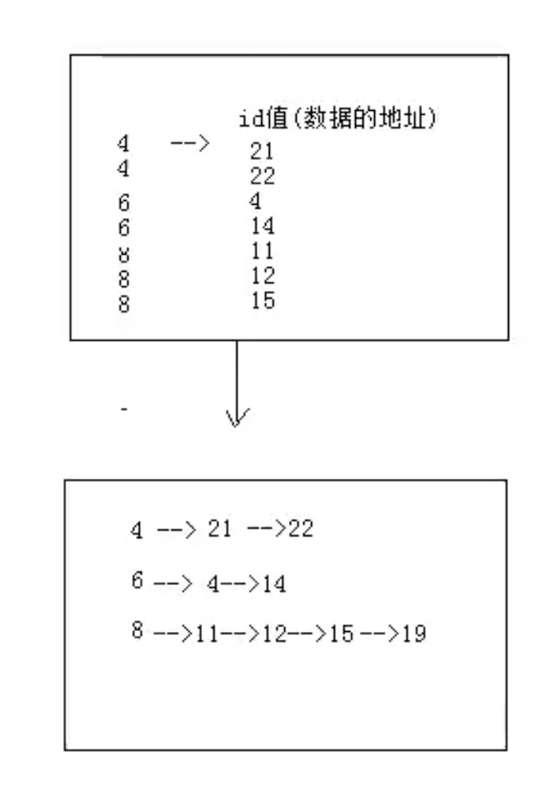
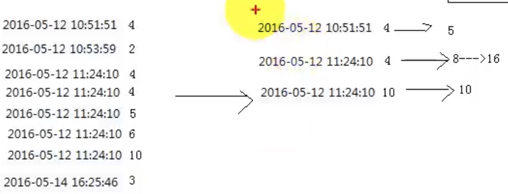
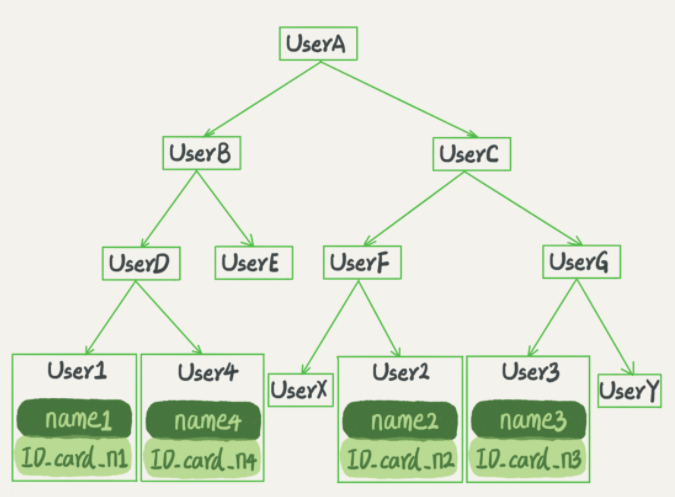
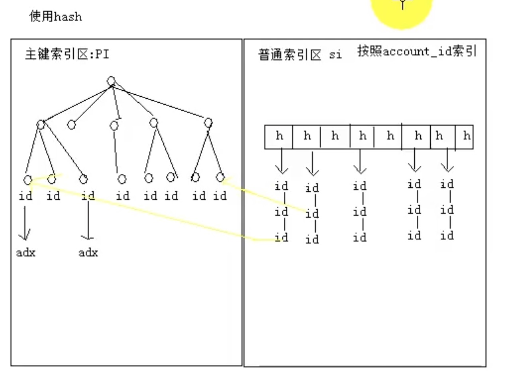
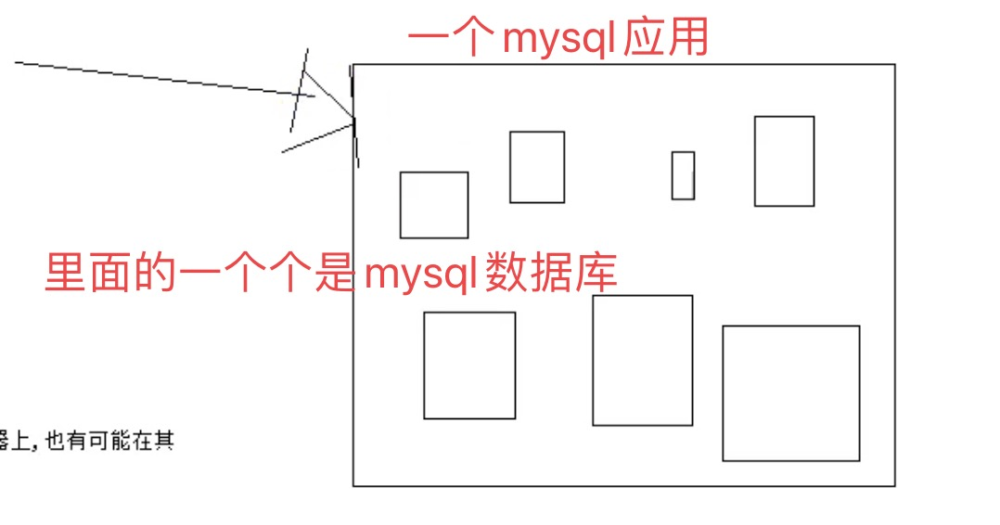
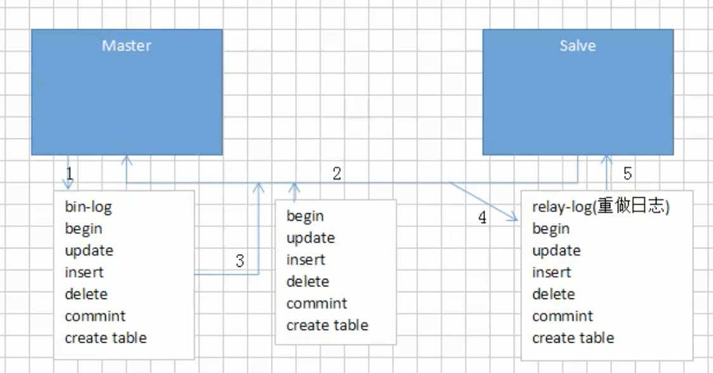

# 69.MySQL架构

## 69.1 MySQL处理流程

1. 客户端和服务端通过TCP/IP协议进行连接，发送sql语句给服务端，
2. 首先进入**查询缓存**，sql会经过hash算法得到hash值，然后转换为key，
   当前sql的key与缓存中的key进行比较，如果存在，直接返回给客户端
3. 对于不存在的key的sql进入**解析器**，用来分析是否存在关键字拼写错误/执行顺序错误，
   如果存在直接返回，否则进入通过`解析树`这种数据结构，对sql进行拆分,之后进入**预处理器**
   检查数据库中的表列是否存在（比如说from test123，但是test123不存在，只存在test）
   检查语句是否存在歧义（比如说sql注入问题），之后会产生一个新的解析树
4. 自己写的sql，mysql会使用自带的查询优化器进行优化
5. 优化完成之后生成一个执行计划，执行计划就会查看这次sql语句所在表使用了什么引擎
6. 之后把结果返回给客户端，然后将结果缓存到**查询缓存**中

## 69.2 MySQL数据库分层设计

一、连接层

主要是提供与客户端的连接服务
包含本地的sock通讯还有TCP/IP的通讯，在连接层主要有：
连接处理、授权认证、以及相关的安全方案。
每个客户端在连接服务端的时候，服务端都会创建一个独有的线程，每次连接的查询就会在这个线程中进行
服务端会负责缓存线程，就不需要每次连接都要创建线程和销毁线程了。
使用了安全套接字ssl的方式连接，一旦连接成功后，服务器也会继续验证客户端是否具有执行某个特定查询的权限

二、服务层

提供各种用户使用的接口，如查询语句等

三、存储引擎层

存储引擎主要是负责mysql数据的存储和提取。

### 69.2.1 为什么分层设计

这么做的好处就是规定了各层的功能那个，出现什么问题就去找各层的问题。大大减少了工作量。

## 69.3 SQL层的执行流程

sql语句--》缓存查询（`sql8.0之后省了这一步`）--》解析器--》优化器--》执行器

### 69.3.1 一条sql语句的执行过程

1. `连接Mysql`
   客户端连接MySql服务时是半双工通信，
   客户端和服务端交互发送数据时必须一次发送完毕，
   在传输特别大的数据包时系统性能开销非常大，
   所以当客户端使用insert等语句发送大量的数据包时服务端就会拒绝连接，
   原因是服务端默认限制客户端发送的数据包大小不能超过4MB，
   这点可以通过修改MySql参数来更改大小限制，
   或者将需要发送的数据包在客户端进行分批发送处理。
   同理，在服务端返回给客户端数据时也要避免大量的数据包传输，
   所以要避免使用不带Limit的查询语句进行批量查询，
   或者可以先使用count做数据量预估，根据数据量进行分批查询。
2. `缓存与解析器`
   当缓存是打开的情况下，MySql服务端拿到Sql语句后，
   首先会到缓存判断是否有完全一致
   的Sql语句查询记录（判断时Sql语句连空格都不能有误差），
   有就将相应的结果集返回给客户端，
   当缓存中不存在时，会将Sql语句交给解析器来处理，
   解析器通过关键字将SQL语句进行解析，并生成一棵对应的“解析树”，
   接着会验证Sql语句是否有词法、语法等错误，
   例如，它将验证是否使用错误的关键字，
   或者使用关键字的顺序是否正确等，
   再或者它还会验证引号是否能前后正确匹配。
3. `预处理器（Preprocessor）`
   预处理器会对解析树行进一步检查解析树是否合法，
   例如，这里将检查数据表和数据列是否存在，
   还会解析名字和别名，
   看看它们是否有歧义。
   接着预处理器会验证权限。
   这通常很快，除非服务器上有非常多的权限配置。
4. `优化器（查询优化器 Query Optimizer）`
   一条Sql语句并不是只有一种执行路径。
   当优化器拿到预处理器发来的解析树后，
   会根据解析树生成不同的执行路径，
   这些执行路径就是常说的执行计划（Execution Plan），
   优化器会对这些执行计划计算对应的开销（cost），
   当得到不同的执行计划与相应的开销后，
   优化器将它认为最佳的执行计划去交给下一个部件去执行
5. `查询执行引擎`
   当优化器将执行计划交到查询执行引擎手里时，
   剩下的任务就简单多了，
   查询执行引擎调用相应的API接口来操作存储引擎，
   将存储引擎返回的查询结果返回给客户端，
   如果缓存开启的情况也会在缓存中进行缓存。
6. `存储引擎`
   存储引擎就有很多了，像Mysql5.5版本前默认使用的MyIsan存储引擎，
   5.5版本后默认使用的InnoDB存储引擎，

### 69.3.2 一条sql更新/删除/增加语句时怎么执行的

1.执行器先取到ID=2这行。因为ID是主键，引擎直接用树搜索找到这一行。
  如果ID=2这一行所在的数据页本来就在内存中，
  就直接返回给执行器。
  否则需要先从磁盘读入内存，然后再返回。
2.执行器拿到引擎给的行数据，把这个值加1，
  比如原来N，现在是N+1，得到新的一行数据，
  再调用引擎接口写入这行数据。
3.引擎将这行新数据更新到内存中，
  同时将这个`更新/删除/增加`操作记录在redo log里面，
  此时redo log处于prepare状态。
  然后告知执行器执行完成了，随时可以提交事务。
4.执行器生成这个操作的binlog，并把binlog写入磁盘中。
5.执行器调用引擎的提交事务接口，
  引擎把刚刚写入的redo log改成提交（commit）状态，
  更新完成。

## 69.4 存储引擎

### 69.4.1 概念

不同的数据文件在物理磁盘上的不同的组织形式

mysql默认的存储引擎是innodb

### 69.4.2 分类

1. MyISAM
2. InnoDB
3. Memory

#### 69.4.2.1 InnoDB（补充与修改）

innodb分为了聚簇索引，以主键作为索引key进行查找
            辅助索引，以非主键作为索引key进行查找
实现了四个标准的隔离级别，
默认级别是可重复读（REPEATABLE READ）。在可重复读隔离级别下，
通过多版本并发控制（MVCC）+ Next-Key Locking 防止幻影读。

主索引是聚集索引，在索引中保存了数据，从而避免直接读取磁盘，
因此对查询性能有很大的提升。其次是聚集索引每个叶子节点按照主键id从小到大顺序存储了大量数据行，
而每个叶子节点在实现上是一个内存页，磁盘IO读取时是读取一个内存页，
会进行一定的预读，所以在进行范围查找时，InnoDB引擎效率更高，
而MyISAM则需要对查找范围内所有数据行进行随机读取。(每条数据都是存储在不同地址上)

内部做了很多优化，包括从磁盘读取数据时采用的可预测性读、
能够加快读操作并且自动创建的自适应哈希索引、
能够加速插入操作的插入缓冲区等。

支持真正的在线热备份。其它存储引擎不支持在线热备份，
要获取一致性视图需要停止对所有表的写入，而在读写混合场景中，
停止写入可能也意味着停止读取。

#### 69.4.2.2 MyISAM（补充修改）

myisam主要是通过格式文件（表结构定义），数据文件（存储的内容），索引文件（存储上的索引），
这三个文件来表示每个表
myisam的优势就在于可被转换为压缩、只读表来节省空间

MyISA索引的实现主要依赖B+树

MyISAM 中索引检索的算法为首先按照 B+Tree 搜索算法搜索索引，
如果指定的 Key 存在，则取出其 data 域的值，
然后以 data 域的值为地址，读取相应数据记录。

1）主键索引：
   MyISAM引擎使用B+Tree作为索引结构，叶节点的data域存放的是数据记录的地址
2）辅助索引：
    在 MyISAM中，主索引和辅助索引在结构上没有任何区别，只是主索引要求key是唯一的，
    而辅助索引的key可以重复。

#### 69.4.2.3 MySQL存储引擎MyISAM与InnoDB区别

1. 事务方面，innodb是支持事务的，myisam不支持事务
2. 外键方面，innodb支持外键，myisam不支持外键
3. 索引方面，innodb是聚簇索引，mysiam是非聚簇索引，这样的话，在查询的时候，myisam需要查询两次
4. 锁粒度方面，innodb最小锁粒度是亨索，myisam最小锁粒度是表锁，myisam一个语句就锁定整张表，因此并发访问受限

### 69.4.3 引擎与锁的关联

MyISAM采用表级锁(table-level locking)。
InnoDB支持行级锁(row-level locking)和表级锁,默认为行级锁

# 70.数据存储过程

## 70.1 存储过程

创建数据库---》确定字段---》创建数据表---》插入数据

### 70.1.1 为什么不直接创建数据表，还需要创建数据库呢？

1. 首先从架构层次来说，数据库分为了
   数据库服务器、数据库、数据表、数据表的行和列
   由于安装的时候直接安装了数据库服务器，所以，就直接从数据库开始就可以了

2. 数据库是mysql里面的最大存储单元，没有数据库作为载体，数据表也就不复存在了。

# 71.数据库的创建

```sql
create database xxx；
```

## 71.1 数据库内置种类

1. xxx：这个是我们通过自己的sql语句创建的
2. infromation_schema:自带数据库，
3. 其余的

## 71.2 数据库的存储结构

### 71.2.1 存储结构

数据库是以`页`进行存储的

### 行、页、区、段、表的关系

表中包含了一个或者多个段，

一个段包含了一个或者多个区

一个区包含了多个页

一个页包含了多个行

### 页

# 72.字段数据类型

## 72.1 字段的数据类型

整数类型：TINYINT、SMALLINT、MEDIUMINT、INT、BIGINT
浮点数类型：FLOAT、DOUBLE
定点数类型：DECIMAL
字符串类型：VARCHAR、CHAR、TEXT、ENUM、SET
日期类型：Date、DateTime、TimeStamp、Time、Year

### 72.1.1 整数类型的选取标准

1. 数据不会超过范围的的可靠性
2. 考虑存储空间
   
比如说某个数据我采用了smallint，但是数据量在不断变大，
一旦超过范围，就会出现出现系统崩溃问题，那么就得不偿失了

### 72.1.2 无符号浮点数类型为什么范围比有符号浮点数类型小？

MySQL是按照符号、尾数、阶码进行存储浮点数的

### 72.1.3 浮点类型为什么不精准？

浮点类型主要是采用二进制的方式进行存储，比如说9.625，是1001.101
但是如果尾数不是0或者5，无法用一个二进制精确表达，只能在取值的
允许范围内近似得到

定点型主要是因为他把十进制的整数部分和小数部分进行了分割，
分别转换为十六进制进行存储

### 72.1.4 char类型与varchar类型的区别？

1. char类型是定长的，在内部存储时实际使用长度较短时会在右边用空格填充，
   所以插入的数据如果右边有空格会自动截断，因为没有办法知道是自带的还是填充的。
   对英文字符（ASCII）占用1个字节，对一个汉字占用两个字节。
   适合每行数据的长度比较平均的情况，否则会造成存储空间的浪费。

2. varchar类型是不定长的，有一个字节用来存储长度(当长度大于255时，使用两个字节来存储长度)，
   内部存储时，使用多少长度，内存中就占用多少长度，不会有空余，所以比较节省空间。
   varchar的存储方式是，对每个英文字符占用2个字节，汉字也占用2个字节。
   效率上其实varchar会好一点

###  72.1.5 int(5)这个5代表什么？

表示如果数值宽度小于5位，mysql会自动补0填满宽度，保证总宽度为5位。

### 72.1.6 varchar(50)中50的涵义

varchar(50)中50的涵义最多存放50个字符


# 73.数据表

## 73.1 数据表结构

```sql
desc xxx;
```

## 73.2 数据表常用字段

1. type：字段类型
2. null：这个字段可不可以为空值----mysql空值和空字符串是不一样的
3. key：键---很多类型的键
4. default：默认值
5. extra：额外信息

## 73.3 约束

### 73.3.1 约束种类

1. 主键约束----primary key
2. 唯一性约束--unique
3. 外键约束---foreign key
4. 非空约束---not null
5. 自增约束---Auto_increment

#### 73.3.1.1 union和unionall的区别是什么？

1. union就是将两个SELECT语句查询的结果集合并(两个SELECT可以是同一个表，也可以是不同表)，
   如果需要排序，在第二个SELECT语句后加ORDER BY语句，会对所有结果进行排序。

2. union默认是会去除重复的数据的，会对结果集做去重处理，union all不会做去重处理。
   所以union效率慢一些，如果能确定结果不会重复或者需要不去重的结果，
   那么应该使用union all，效率会高一些。

#### 73.3.1.2 字段为什么要求定义为not null?

null值会占用更多的字节,且会在程序中造成很多与预期不符的情况

## 73.4 运行关键字

### 73.4.1 执行顺序

1. from:需要从哪个数据表检索数据
2. join：联合多表查询返回记录时，并生成一张临时表
3. on：在生成临时表时使用的条件
4. where:过滤表中数据的条件
5. group by:如何将上面过滤出的数据分组
6. having:对上面已经分组的数据进行过滤的条件
7. select:查看结果集中的哪个列，或列的计算结果
8. order by:按照什么样的顺序来查看返回的数据
9. limit:限制查询结果返回的数量

#### 73.4.1.1 group by注意事项

1、group by函数通常联合分组函数(sum,avg,max,min,count)进行使用，
   而且分组函数是在group by执行结束后才执行的。
2、在进行分组的时候select后面跟的字段最好是分组函数或者group by后面跟的那个字段。
3、group by有一个原则，就是select后面所有的列中，没有使用聚合函数的列，必须出现在group by子句中。


### 73.4.2 区别

#### 73.4.2.1 change与modify区别

1. change是修改字段
2. modify是修改字段类型的

#### 73.4.2.2 where和having区别

1. where的效率要高于having
   主要是因为where可以先进行筛选，筛选完成后用一个筛选后较小的数据集和关联表进行连接，
   这样占用的资源比较小
   having是先把数据集准备好，然后进行筛选

2. where不能使用分组中的计算函数作为筛选条件，
   主要是因为where是在group by的前面
   比如说哪个收银员在哪天卖了2单商品，如果用group by的话，我就直接可以使用分组函数了

#### 73.4.2.3 groupby和having的区别

1. 通过使用GROUP BY 子句，比如说可以让SUM和 COUNT 这些函数对属于一组的数据起作用。
   当你指定 GROUP BY A 时，表中所有除A(地区)外的字段，只能通过 SUM, COUNT等聚合函数运算后返回一个值。

2. HAVING子句可以让我们筛选成组后的各组数据，WHERE子句在聚合前先筛选记录.
   也就是说作用在GROUP BY 子句和HAVING子句前.
   而 HAVING子句在聚合后对组记录进行筛选。

#### 73.4.2.4 on和where的区别

1. on的条件是在连接生成临时表时使用的条件,以左表为基准 ,不管on中的条件真否,都会返回左表中的记录
2. where条件是在临时表生成好后,再对临时表过滤。
   此时和left join有区别(返回左表全部记录),条件不为真就全部过滤掉,on后的条件来生成左右表关联的临时表,
   where后的条件是生成临时表后对临时表过滤

#### 73.4.2.5 exits 和in，join的区别

exists是拿外表作为驱动表，外表的数据做循环，每次循环去内表中查询数据，使用适内表比较大的情况
例如select * from t1 where t1.tid exists (select t2.tid from t2)

in的话正好相反，是那内表作为驱动表，内表的数据做循环，每次循环去外表查询数据，适合内表比较小的情况。

join的实现其实是先从一个表中找出所有行（或者根据where子句查出符号条件的行)，
然后去下一个表中循环寻找匹配的行，依次下去，直到找到所有匹配的行，
使用join不会去创建临时表，使用in的话会创建临时表，销毁临时表

三折的关键的点在关联表的顺序，如果是join连接查询，MySQL会自动调整表之间的关联顺序，
选择最好的一种关联方式。如果能够实现小表驱动大表是最好的选择。

## 73.5 键

### 73.5.1 种类

1. 主键：一个数据列只能有一个主键，且主键的取值不能缺失，
        即不能为空值（Null）
2. 超键：一个属性可以为作为一个超键，
        多个属性组合在一起也可以作为一个超键。超键包含候选键和主键。
3. 候选键：是最小超键，即没有冗余元素的超键。
4. 外键：比如说有两张表，通过一个共同的字段id进行关联，id在表b中就是一个外键了
        外键就是让从表引来主表数据的一个公共字段

#### 73.5.1.1 哪些不能做主键

1. 与业务字段相关的字段---比如说会员卡不用了，但是卡号给了两外一个人
2. 自增字段做主键----多机联合使用

### 73.5.2 主键

#### 73.5.2.1 不用mysql自增主键，有什么问题

1. 首先主键一定要保证唯一性和空间尽可能短
2. 因为索引的有序性的特性，如果生成了一些uuid的逐渐，它的性能就很差了，
   因为uuid，在插入的时候需要移动磁盘块，比如说块内的空间在当前时刻已经存满了，担心生成的uuid已经插入
   这样就只能移动块的数据。

#### 73.5.2.1 主键使用自增ID还是UUID?

推荐使用自增ID,不要使用UUID.

因为在InnoDB存储引擎中,主键索引是作为聚簇索引存在的,
也就是说,主键索引的B+树叶子节点上存储了
主键索引以及全部的数据(按照顺序),
如果主键索引是自增ID,
那么只需要不断向后排列即可,
如果是UUID,由于到来的ID与原来的大小不确定,
会造成非常多的数据插入,数据移动,
然后导致产生很多的内存碎片,
进而造成插入性能的下降.

##### 73.5.2.1.1 为什么用自增列作为主键

如果表使用自增主键，那么每次插入新的记录，
记录就会顺序添加到当前索引节点的后续位置，
当一页写满，就会自动开辟一个新的页
如果使用非自增主键，由于每次插入主键的值近似于随机，
因此每次新纪录都要被插到现有索引页得中间某个位置，
此时MySQL不得不为了将新记录插到合适位置而移动数据，
甚至目标页面可能已经被回写到磁盘上而从缓存中清掉，
此时又要从磁盘上读回来，这增加了很多开销，
同时频繁的移动、分页操作造成了大量的碎片，
得到了不够紧凑的索引结构，
后续不得不通过OPTIMIZE TABLE来重建表并优化填充页面。

##### 73.5.2.2.1 自增id的缺点

①别人一旦爬取你的数据库,就可以根据数据库的自增id获取到你的业务增长信息，
 很容易分析出你的经营情况
②对于高并发的负载，innodb在按主键进行插入的时候会造成明显的锁争用，
  主键的上界会成为争抢的热点，因为所有的插入都发生在这里，并发插入会导致间隙锁竞争
③Auto_Increment（自增）锁机制，会造成自增锁的抢夺,有一定的性能损失

##### 73.5.2.2.2 MySQL不推荐使用uuid或者雪花id作为主键？

自增的主键的值是顺序的,所以Innodb把每一条记录都存储在一条记录的后面。

当达到页面的最大填充因子时候：

①下一条记录就会写入新的页中，一旦数据按照这种顺序的方式加载，
主键页就会近乎于顺序的记录填满，提升了页面的最大填充率，不会有页的浪费

②新插入的行一定会在原有的最大数据行下一行,mysql定位和寻址很快，
不会为计算新行的位置而做出额外的消耗

③减少了页分裂和碎片的产生，因为uuid相对顺序的自增id来说是毫无规律可言的,
新行的值不一定要比之前的主键的值要大,所以innodb无法做到总是把新行插入到索引的最后,
而是需要为新行寻找新的合适的位置从而来分配新的空间。这个过程需要做很多额外的操作，
数据的毫无顺序会导致数据分布散乱，将会导致一些问题：
比如说
①写入的目标页很可能已经刷新到磁盘上并且从缓存上移除，或者还没有被加载到缓存中，
innodb在插入之前不得不先找到，并从磁盘读取目标页到内存中，将导致大量的随机IO

②因为写入是乱序的,innodb不得不频繁的做页分裂操作,以便为新的行分配空间,页分裂导致移动大量的数据，
一次插入最少需要修改三个页以上

③由于频繁的页分裂，页会变得稀疏并被不规则的填充，最终会导致数据会有碎片
在把随机值（uuid和雪花id）载入到聚簇索引(innodb默认的索引类型)以后,
有时候会需要做一次OPTIMEIZE TABLE来重建表并优化页的填充，这将又需要一定的时间消耗。

## 73.6 关联查询（join）

### 73.6.1 概念

如果不考虑多并发状态的话
首先要进行外键约束，然后进行关联才可以查询得到

#### 73.6.1.1 关联查询一定要在外键约束的基础上进行呢？

也不是必须的，但是如果有了外键约束，避免出现误删的情况，提高系统的可靠性

比如说之前遇到的问题，

我有两张表，一个是单头表数据，一个是单明细表数据，如果我先插入数据到单明细表，
会造成mysql找不到参照的主表信息，会提示错误

#### 73.6.1.2 为什么mysql里，没有外键约束也可以进行关联查询？

因为外键约束是有成本的，需要消耗资源，对于大型网站的中央数据库，
可能会因为外键约束的系统开销变得非常慢
一般在应用层面完成数据一致性的逻辑就可以了

#### 73.6.1.3 如果说我在表里真的找不到怎么办

那就自己创建呗

```sql
alert table xxx
add column number int primary key auto_increment;
```

### 73.6.2 分类

主要有两种连接

1. 内连接：只返回符合连接条件的记录

2. 外连接：查询结果值返回某一个表中的所有数据 + 另一个表中符合条件的数据
   1. 左连接：返回左表中所有记录 + 右表中符合条件的记录
   2. 右连接

### 73.6.3 join原理

比如说a join b
通过a表的结果集作为循环基础，一条条的通过结果集中的数据作为过滤条件到下一个表中的数据，然后合并结果

[join优化](#join优化)

## 73.7 SQL函数

### 73.7.1 时间函数

1. extract（type from time）从time时间里提取哪个时间
2. second/minute/hour/day/month/year
3. date_add(date,interval 表达式 type)/adddate
             从date时间点开始，向前或者向后一段时间间隔的时间
4. last_day(date) 获取date所在月份的最后一天

### 73.7.2 数学函数

1. 取整函数
   1. floor  向下取整
   2. ceil   向上取整
   3. round  四舍五入
2. 绝对值函数
   1. abs
3. 求余函数
   1. mod

### 73.7.3 字符串函数

1. 拼接
   - concat（s1，s2...）
2. 转换
   cast(表达式 as char)
3. 获取长度
   char_length(字符串)
   space(n)

### 73.7.4 条件判断函数

1. ifnull(v1,v2)
2. if(表达式，v1，v2)

### 73.7.5 区别

#### 73.7.5.1 truncate、 delete区别

1、TRUNCATE在各种表上无论是大的还是小的都非常快。
   如果有ROLLBACK命令DELETE将被撤销，而TRUNCATE则不会被撤销。
2、truncate不能进行回滚操作。
3、truncate不触发任何delete触发器。
4、当表被truncate后，这个表和索引所占用的空间会恢复到初始大小，
   而delete操作不会减少表或索引所占用的空间。
5、不能truncate一个带有外键的表，如果要删除首先要取消外键，然后再删除。
    DELETE语句执行删除的过程是每次从表中删除一行，
    并且同时将该行的的删除操作作为事务记录
    在日志中保存以便进行进行回滚操作。

## 73.8 聚合函数

### 73.8.1 种类

1. sum（）
2. avg（）
3. max（）
4. min（）
5. count（）---注意的是只计算非空的值
   - count（*）  统计一共有多少条记录
   - count（字段）统计有多少个不为空的字段

### 73.8.2 count(*)、count(1)、count(column)的区别

count(*)对行的数目进行计算,
包含NULL，
count(1)这个用法和count(*)的结果是一样的
count(column)对特定的列的值具有的行数进行计算,不包含NULL值。

## 73.9 事务

### 73.9.1 概念

事务是逻辑上的⼀组操作，要么都执⾏，要么都不执⾏。
目的就是为了保证数据的一致性

#### 73.9.1.1 事务只是确保要么执行，要么不执行

如果遇到错误，是失败还是回滚，程序员决定

### 73.9.2 创建事务

```java
set autocommit = 0；
start transaction
DML语句
commit/rollback  二选一
```

### 73.9.3 事务四大特征

1. 原⼦性
2. ⼀致性
3. 隔离性
4. 持久性

#### 73.9.3.1 原子性

原子性的话，就是说当前事务的操作要么同时成功，要么同时失败，原子性是根据undolog日志来保证的
          因为undolog记载着数据修改前的信息

innodb引擎就是利用undo log记录下的数据，来将数据恢复到事务开始之前
比如说insert一条数据了，那么undolog会记录一条对应的delete日志，我要update一条记录的时候，
undolog就记录之前旧值的update记录，如果执行事务过程中更出现了异常，那么就执行回滚，

#### 73.9.3.2 一致性

一致性我认为就是使用事物的目的，一般通过应用程序代码来保证的
比如说，如果事务在发生的过程中，出现了异常情况，此时你就得回滚事务，而不是提交事务

#### 73.9.3.3 隔离性

在事务并发执行的时候，他们内部操作是不能互相影响的。
如果多个事务在同一时刻操作同一份数据的话，那么就会产生了脏读、重复读、幻读这些问题
- 那么为了解决`并发问题`，innodb就定义了四种隔离级别：RU、RC、RR、seriable
  不同的隔离级别堆事务之间的隔离性是不一样的
- `隔离性的实现`是有mysql的各种锁来完成现的

#### 73.9.3.4 持久性

一旦我提交了事务，他对数据库的改变是永久性的
主要是通过redolog日志来完成，就是说我们要修改数据的时候，mysql是先把这条记录的所在页找到，然后把该页加载到内存中，
然后将对应的记录进行修改
为了防止内存修改完了，mysql挂掉，mysql引入了redolog，内存写完了，然后会写一份redo log，
这份redolog会记录着这次在哪一页做了什么修改。计时mysql挂了，我也可以根据redolog对数据进行恢复
redolog是按照顺序写入的，写入速度很快，并且他记录的是物理修改，就是说2页做了update修改等等，

### 73.9.4 隔离性问题---并发问题

#### 73.9.4.1 种类

1. 脏读---针对更新（本来有）
    事务b读取了事务a还没有提交的数据
2. 不可重复读
    比如说，a查询数据库得到了一个数据，b去修改数据库的数据，导致a多次查询数据库的结果不一样
3. 幻读---针对插入（根本没有）
    a读取一个表中的一个字段，b往表中插入了一些新数据，a再次读取，发现多出了几行数据
4. 第一类丢失更新
    A事务撤销时，把已经提交的B事务的更新数据覆盖了。
5. 第二类丢失更新
    A事务覆盖B事务已经提交的数据，造成B事务所做的操作丢失 。

#### 73.9.4.2 幻读有什么问题？

1. 语义上来说，
   假设sessionA加入行锁，比如说T1时刻select * from where index = 5 for update，
                                 恰巧这个语句能够关联到id=5
   但是呢，sessionB，在T2时刻把id=0，index=5的这一行的name改为了xiaobai
   由于在 T1 时刻，session A 还只是给 id=5 这一行加了行锁， 
   并没有给 id=0 这行加上锁。因此，session B 在 T2 时刻，是可以执行这update语句的。
   这样，就破坏了 session A 里语句要锁住所有 index=5 的行的加锁声明。

2. 锁的设计是为了保证数据的一致性
   比如说某一行不存在，即使把所有的记录都加上锁，还是阻止不了新插入的记录

#### 73.9.4.3 幻读解决方案

产生幻读的原因是，行锁只能锁住行，但是新插入记录这个动作，要更新的是记录之间的“间隙”。因此，
在可重复度隔离级别情况下，
为了解决幻读问题，InnoDB 只好引入新的锁，也就是间隙锁 (Gap Lock)。
比如说，文章开头的表，插入了0、5、10这三条记录
这样就会产生（-∞，0）（0，5）（5，10）（10，15）这四个间隙
比如说data字段是索引
这样我在执行select * from t where data=5 for update 的时候，这样子我就把（0，5）和（5，10）给锁住了
如果用非索引字段，比如说select * from t where c=5 for update ，那么整张表就锁住了
但是间隙锁的引入，可能会导致同样的语句锁住更大的范围，这其实是影响了并发度的。
innodb是默认实现next-key lock，也就是间隙锁和行锁的全称
还有一个方案就是提高隔离级别，要解决可能出现的数据和日志不一致问题，需要把 binlog 格式设置为 row

#### 73.9.4.3 区别

##### 73.9.4.2.1 不可重复读和幻读的区别

不可重复读是指读到了已经提交的事务的更改数据（修改或删除），
幻读是指读到了其他已经提交事务的新增数据。
对于这两种问题解决采用不同的办法，
防止读到更改数据，只需对操作的数据添加行级锁，
防止操作中的数据发生变化；
二防止读到新增数据，往往需要添加表级锁，
将整张表锁定，防止新增数据（oracle采用多版本数据的方式实现）。

### 73.9.5 隔离性解决方案---事务隔离级别

#### 73.9.5.1 为什么要有事务隔离级别

因为事物隔离级别越高，在并发下会产生的问题就越少，
但同时付出的性能消耗也将越大，
因此很多时候必须在并发性和性能之间做一个权衡。
所以设立了几种事物隔离级别，
以便让不同的项目可以根据自己项目的
并发情况选择合适的事物隔离级别，
对于在事物隔离级别之外会产生的并发问题，在代码中做补偿。

#### 73.9.5.2 事务隔离级别的原理

实现隔离机制的方法主要有两种：
   1. 读写锁
   2. 一致性快照读，即 MVCC

MySql使用不同的锁策略或者说MVCC来实现四种不同的隔离级别。
   1. RR（可重复读）、RC（读已提交）的实现原理跟MVCC有关
   2. RU（读未提交）和Serializable跟锁有关。

#### 73.9.5.3 级别等级

1. 读取未提交(RU)
2. 读取已提交(RC)
3. 可重复读(RR)
4. 可串⾏化(S)

#### 73.9.5.4 RU（读未提交）

1. （存在问题）会存在脏读、幻读或不可重复读
2. （读写过程）写操作加锁，这样保证了安全性；读操作不加锁，也就造成了`脏读`

#### 73.9.5.5 RC（读已提交）

1. （存在问题）会存在幻读或不可重复读
2. （解决脏读）就是说利用MVCC，在读取的时候生成一个版本号，等到其他食物commit了之后，
             才会读取最新已经commit的版本号数据
             比如说，事务A已经读去了记录，也就是生成版本号了，然后事物B修改了数据，这个时候加了写锁
             事务A在读取的时候，是依据最新的版本号来去的的，也就是事务B只行了commit之后，会生成一个新版本号
             如果事务B还没有提交，那么事物A读取的还是之前版本号数据
3. （幻读存在原因）比如说事务A在读取和写入符合的条件的记录时，其他事务又插入了一条符合条件的记录，
                此时事务A二次读取时会产生幻行，一般发生在INSERT操作。

#### 73.9.5.6 RR（可重复读）

1. （存在问题）可能存在幻读（但是也能解决）
2. （解决不可重复读）每次读取的都是当前事务的版本，即使当前数据被其他事务修改了，也只会读去当前事务版本的数据。
3. （如何解决幻读）利用了MVCC，在MVCC下，因为他是读历史版本的数据，在快照读，就解决了幻读问题
                比如说，如果说是当前读，我写了一个sql，select * from t from update
                需要配合间隙锁来解决幻读的问题

#### 73.9.5.7 Serializable（串行化）

1. 不允许事务的并发

#### 73.9.5.5 区别

##### 73.9.5.5.1 RC、RR区别

1. RC每次读取数据前都生成一个ReadView，而RR只在第一次读取数据时生成一个ReadView。


### 73.9.6 MVCC---解决加锁后读写性能问题

#### 为什么会有MVCC呢？

比如说，我进行了更新操作，innodb加入了写锁，但是呢，在读操作，如果不加锁，那么又造成了脏读，
但是呢，如果在读操作加了锁，那么更新操作的时候，就没有办法读取了，就会降低数据库的性能
所以呢，为了解决加锁后读写性问题，就引入了MVCC

#### MVCC如何实现的

主要是通过 `隐式字段`、`undolog`、`版本链``readview`、`快照读&当前读` 、来实现的，

1. 获取事务自己的版本号，即事务ID
2. 获取Read View
3. 查询得到的数据，然后Read View中的事务版本号进行比较。
4. 如果不符合Read View的可见性规则， 即就需要Undo log中历史快照;
5. 最后返回符合规则的数据

##### 隐式字段

每一行数据中额外保存两个隐藏的列：

1. 记录每一行最近一次修改它的事务id
2. 相当于一个指针吧，指向上一个版本数据在undolog里的位置指针

##### undolog

undolog他会记录修改数据之前的信息，如果事务回滚了，我就可以用undolog来还愿

##### 版本链

如果说多个事务并行操作某一行数据时，不同事务对该行数据的修改会产生多个版本，然后通过回滚指针连一条Undo日志链。

比如说，我有一个account表，表里有一行数据

```sql
id name age trx_id rool_pointer
1  xiao 11   100
```
那么，我开启一个事物A，对account表执行update core_user set name ="bai" where id=1,

1. 首先获得一个事务ID=100
2. 把account表修改前的数据,拷贝到undo log
3. 修改account表中，id=1的数据，名字改为bai
4. 把修改后的数据事务Id改为101，变成了当前事务版本号，并把roll_pointer指向undo log数据地址。

```sql
id name age trx_id rool_pointer
1  xiao 11   100        |
________________________|
|
id name age trx_id rool_pointer
1  xiao 11   101
```

比如说我有一个acoount表，然后只有一条数据，插入一条数据后，会有一个隐式字段，假设事务id= 100，
然后事务B对这条数据进行了修改，那么这个事务id= 200，然后我就用指针字段把这两个连接起来，就形成了日志链

##### 快照读&当前读

1. 快照读：读取的是记录数据的`可见版本（可能是旧的版本）`，不加锁,普通的select语句都是快照读,比如：
   select * from account where id>2;

2. 当前读：读取的是记录数据的`最新版本`，显示加锁的都是当前读
   select * from account where id>2 lock in share mode;
   select * from  account where id>2 for update;

##### Read View

readview实际上就是查询的时候，innodb会生成一个readview，
记录当前系统中还有哪些活跃的读写事务，把它们放到一个列表里。其中通过参数来根每一行的`隐式字段`进行比较

比如说，事务id < `readview列表`里最小的事务id，那么就说明已经提交了，可以被当前事务访问

## 73.10 隔离性实现---锁

### 73.10.1 概念

数据库锁出现的目的：处理并发问题
并发控制的主要采用的技术手段：乐观锁、悲观锁和时间戳。

### 73.10.2 锁的原理


### 73.10.3 锁的种类

从粒度来说的话

1. 行锁
2. 表锁

其中
**行锁**
   - 第一点：（概念）用于innodb引擎，并发最高，支持事物
   - 第二点：（转换）因为锁主要是加在索引上，对于非索引字段更新，行锁会升级为表锁
   - 第三点：（危害）动同一行数据/不存在的数据，在没有commit之前，另一个session会阻塞
   - 第四点：（表现形式）：共享锁和排他锁

**表锁**
   - 第一点：（概念）用于myisam引擎，并发最低
   - 第二点：（转换）
   - 第三点：（危害）
   - 第四点：（表现形式）：意向共享锁和意向排他锁


```sql
SELECT * FROM products WHERE id=-1 FOR UPDATE; //主键不存在---直接无锁
SELECT * FROM products WHERE id LIKE '3' FOR UPDATE;//主键不明确---直接表锁
SELECT * FROM products WHERE name='Mouse' FOR UPDATE;//主键明确---直接行锁
```

### 73.10.4 行锁、表锁的实现

1. 共享锁：就是说可以读，不可以写
          多事务时，只能加共享读锁，不能加排他写锁；单事务时，可以加任何锁。
2. 拍他锁：不能获取任何锁，
          其他事务不能获取该数据的任何锁，直到排它锁持有者释放。

### 73.10.5 锁算法（锁机制）

#### 73.10.5.1 行锁算法

##### 73.10.5.1.1 种类

1. 普通行锁（Record lock）
2. 间隙锁（gap lock）
   在键值范围内，但是不存在的空间，这个就是叫做间隙，然后在间隙里加锁，就是间隙锁
3. next-key lock，也就是普通行锁+间隙锁

innodb默认实现的事next-key lock锁

##### 73.10.5.1.2 间隙锁

比如说，一张表id是主键，number是一个索引

```java
id   number
1      2
3      4
6      5
8      5
10     5
13     11
```

1. 规定（id=A,number=B）代表一条`字段id=A,字段number=B`的记录，
   （C，D）代表一个区间
2. 如何判定是间隙锁的范围
   根据sql的检索条件，向左找最靠近的记录值C，记为（C,条件值）
                   向右找最靠近的记录值D，记为（条件值，D）这两个就是间隙
   例如某个sql：select * from t where number = 4
   也就是说以记录id=3，number=4作为检索条件
   `左找`记录值为number=2，`右找`记录值为number=5
   那么**范围**就是（2，5）
3. innodb默认使用间隙锁的条件（innodb默认使用next-key lock）
   1. 必须在RR条件下（可重复读）
   2. 检索条件一定要有索引（如果没有索引的话，mysql会全表扫描，变为了表锁）

[相关例子](https://www.cnblogs.com/crazylqy/p/7821481.html)

##### 73.10.5.1.3 next-key锁

是包含了记录锁和间隙锁的一种，就是说，不仅锁定了一个范围，并且锁定了记录本身，
比如说select * from t where number = 4，那么范围就是（2，4]，[4,5)

#### 73.10.5.2 表锁算法

1. 意向锁
   当一个事务带着表锁，去访问一个加入行锁的资源，行锁会升级为意向锁，将表锁住
```sql
事务A
select * from xxx where name = "kkkk" for update;//这是一个表锁（因为没有用索引，所以为表锁）
事务B
 select * from xxx where id = 1 for update;//这是一个行锁
事务A去访问事务B
那么事务B就会升级为表锁
```

2. 自增锁
   事物插入自增类型的列时，可以获取到自增锁

### 73.10.6 两阶段锁协议

在 InnoDB 事务中，行锁是在需要的时候才加上的，但并不是不需要了就立刻释放，而是要等到事务结束时才释放。
这个就是两阶段锁协议。

比如说，有两个事务，
事务A首先执行两条update语句，执行完成之后
事务B开始执行一个update语句，但是事务B会被阻塞掉，直到事务A执行commit之后，事务B才能继续进行。

### 73.10.7 锁升级的情况

1. 当一个事物带着表锁，去访问一个加入行锁的资源，行锁会升级为意向锁
2. 检索条件没有用索引查找的时候，会升级为表锁

### 73.10.8 乐观锁

#### 73.10.8.1 概念

每次去拿数据的时候都认为别人不会修改，所以，不会上锁。
但是在更新的时候会判断一下在此期间别人有没有更新这个数据，

#### 73.10.8.2 乐观锁的实现方式---修改

1. 版本号
2. 时间戳
3. 所有字段/待更新的字段

**版本号**

第一：操作方式----update tab set name = 'xxx' where id = 1 and version = xxx
第二：原理：表中增加一个version字段，每次更新把这个字段加1，
          读取数据的时候把version读出来，更新的时候比较version，

**时间戳**

**字段**

#### 73.10.8.3 乐观锁实现方式区别---修改

### 73.10.9 悲观锁

#### 73.10.9.1 概念

每次去拿数据的时候都认为别人会修改，
所以每次在拿数据的时候都会上锁，
这样别人拿这个数据就会block（阻塞），
直到它拿锁别人才可以不阻塞。

共享锁 & 排它锁都是悲观锁的具象实现，显示地控制行或表锁属于悲观锁

### 73.10.10 死锁

#### 73.10.10.1 概念

在并发系统中不同线程出现循环资源依赖，
涉及的线程都在等待别的线程释放资源时，就会导致这几个线程都进入无限等待的状态，称为死锁

比如说，

事务a
 update money set jinzhang = 45 where date =‘2021-9-8’
 update money set jinzhang = 25 where date =‘2021-9-7’

事务b
 update money set jinzhang = 25 where date =‘2021-9-8’
 update money set jinzhang = 45 where date =‘2021-9-7’

如果事务a和事务b同时执行第一条语句，那么也就锁定了该行数据，那么在执行第二条的时候，
执行不下去了，被锁住了，就只能被批等待

#### 73.10.10.2 死锁必备条件


#### 73.10.10.3 死锁解决方案

1. 第一种策略：直接进入等待，直到超时。这个超时时间可以通过参数 innodb_lock_wait_timeout 来设置。
2. 第二种策略：发起死锁检测，发现死锁后，主动回滚死锁链条中的某一个事务，让其他事务得以继续执行。将参数
             innodb_deadlock_detect 设置为 on，表示开启这个逻辑。

## 73.11 日志---事务原子性的产物

### 73.11.1 概念

### 73.11.2 日志的种类

1. 回滚日志（undo log）
2. 重做日志（redo log）
3. 二进制日志（binlog）
4. 错误日志（error log）
5. 慢查询日志（slow query log）
6. 一般查询日志（general log）
7. 中继日志（relay log）

### 73.11.3 undo log 回滚日志

#### 73.11.3.1 概念

undo log，在数据库事务开始之前， 会把要修改的记录放在undo日志中，
当事务回滚或者数据库崩溃了，可以利用undo log撤销没有提交的事务恢复之前的某个状态

**undolog产生与销毁**
undo log产生于事务之前，在事务提交之后，undo log不会立即消除，innodb会将该事务对应的
undo log放入到删除列表中，后面会通过后台线程purge thread进行回收处理

undo log其实是记录了一个变化过程，比如说，执行一个delete，undolog会记录一个insert
执行一个update，undolog会记录一个相反的update

**undo log存储**
采用段的方式进行管理和记录，innodb包含了一个rollback segement回滚段
内部包含了1024个undolog segment。

#### 73.11.3.2 作用

1. 实现事务的原子性
   一旦出现错误或者回滚了，可以用undolog的备份将数据恢复到事务之间的状态

2. 实现多版本控制（MVCC）
   事务未提交之前，undolog保存了未提交之前的版本数据，
   undolog的数据可以作为数据旧版本快照供其他并发事务进行快照读
   比如说，我有两个事务，事务a是执行的update更新操作，事务b是执行的查询操作
   当事务a执行的时候，先把旧数据备份到undo bufferr，之后持久化到undo log
   然后进行更新操作，但是事务a没有提交数据，这个时候，
   此时事务b开始执行查询操作，事务b是读取undo buffer或者说undo log的数据

#### 73.11.3.3 undo log缺陷

每个事务提交前将数据和Undo Log写入磁盘，这样会导致大量的磁盘IO，因此性能很低。
因此引入了另外一种机制来实现持久化，也就是Redo Log。
Redo Log记录的是新数据的备份。在事务提交前，只要将Redo Log持久化即可，
不需要将数据持久化。当系统崩溃时，虽然数据没有持久化，但是Redo Log已经
持久化。系统可以根据Redo Log的内容，将所有数据恢复到最新的状态。

### 73.11.4 redo log 重做日志

#### 73.11.4.1 概念

事务中修改任何的数据，都会将最新的数据备份存储的位置
比如说我某一个节点

**redo log的生成与释放**
随着事务操作的执行，就会生成redo log，事务提交的时候将产生的redolog写入logbuffer
等事务操作的脏页写入到磁盘后，redolog占用的空间就可以被覆盖重写了

#### 73.11.4.2 工作原理

比如说执行某个事务，事务执行了几个操作，我们就把事务的操作之后的新数据提交到redobuffer中
然后持久化到redolog，一旦数据发生丢失现象，就可以通过redolog进行恢复

#### 73.11.4.3 redoBuffer持久化到redolog的策略

0：每秒从buffer池中提交数据到logBuffer，后台通过master主线程每隔一秒钟输出一次，
   通过操作系统的缓存到磁盘的日志文件中中
   缺陷是一旦数据库断电，logbuffer停止运作，那么这一秒钟的事务就会丢失

1：每次提交执行时，buffer池的数据会写入logbuffer，同时log日志也会提交到操作系统的缓存
   然后马上启动异步刷新操作，把数据从操作系统的缓存写入到日志文件中
   缺陷就是性能太低

2：每次提交执行logbuffer写入到操作系统缓存，然后后台master线程每隔一秒钟
   执行os cache--》读取磁盘文件的操作
   缺点时服务器挂掉了，那么数据就丢失了

#### 73.11.4.4 redolog写入机制

redolog文件的内容是按照顺序循环的方式依次写入的，一旦写满我就回溯到第一个文件，
进行覆盖重写。redolog的写入机制是通过两个指针来实现的，
一个是write pos 记录当前的位置，一边写入数据一边往后移动，一旦写入数据到达文件的末尾就回到0号文件的开头
一个是checkpoint 记录当前要擦除的位置
一旦write pos追赶上了checkpoint，那么不再执行任何操作，等待擦除完成，write pos继续。

### 73.11.5 binlog 二进制日志

#### 73.11.5.1 概念

redolog是innodb引擎的特有日志，binlog是mysql server的日志，
它主要是用来记录所有的数据库表结构变更以及表数据修改的二进制日志，
主要是以事件形式记录

#### 73.11.5.2 binlog的使用场景

1. 主从复制：主库开启binlog，主库就可以把数据传递给从库，从库就可以实现数据恢复了
2. 数据恢复

#### 73.11.5.3 binlog文件记录模式

1. row
2. statement
3. mixed

**Row:不记录sql语句上下文相关信息，仅保存哪条记录被修改。**
`优点`：binlog中可以不记录执行的sql语句的上下文相关的信息，
       仅需要记录那一条记录被修改成什么了。
`缺点`：所有的执行的语句当记录到日志中的时候，都将以每行记录的修改来记录，
       这样可能会产生大量的日志内容。比如一条update语句，修改多条记录，
       则binlog中每一条修改都会有记录，这样造成binlog日志量会很大，
       特别是当执行alter table之类的语句的时候，由于表结构修改，每条记录都发生改变，
       那么该表每一条记录都会记录到日志中。
**Statement：每一条会修改数据的sql都会记录在binlog中。**
`优点`：不需要记录每一行的变化，减少了binlog日志量，节约了IO，提高性能。
        相比row能节约多少性能与日志量，这个取决于应用的SQL情况，
        正常同一条记录修改或者插入row格式所产生的
        日志量还小于Statement产生的日志量，但是考虑到如果带条件的update操作，
        以及整表删除，alter表等操作，ROW格式会产生大量日志，
        因此在考虑是否使用ROW格式日志时应该根据应用的实际情况，
        其所产生的日志量会增加多少，以及带来的IO性能问题。
`缺点`：由于记录的只是执行语句，为了这些语句能在slave上正确运行，
        因此还必须记录每条语句在执行的时候的一些相关信息，以保证所有语句能
        在slave得到和在master端执行时候相同的结果。
**Mixedlevel: 以上两种level的混合使用。**
一般的语句修改使用statment格式保存binlog，如一些函数，statement无法完成主从复制的操作，
则采用row格式保存binlog,MySQL会根据执行的每一条具体的sql语句来区分对待记录的日志形式，
也就是在Statement和Row之间选择一种。

#### 73.11.5.4 binlog文件结构

通过一种叫做log event的数据结构表示修改的操作，不同的修改操作对应着不同类型的log event
比如说 query event、row event等等
logevent的结构主要包含

1. 时间开始的时间  4字节
2. 指明事件的类型  1字节
3. server_id     1字节
4. 事件长度       4字节
5. next_log pos  4字节
6. flag          2字节
7. fixed part
8. variable part

#### 73.11.5.5 binlog写入机制

首先根据记录模式和操作所触发的event事件封装成log event
然后将事务执行过程中产生的log event写入到缓冲区，每个事务线程都有一个缓冲区
   其中在这个缓冲区里保存了一个binlog_cache_mngr的数据结构，
   log event就保存在这个数据结构中，在这个结构里有两个缓冲区，
   一个是用于存放不支持事务的信息缓冲区
   一个是存放支持事务信息的
最后事务提交的阶段会将产生log event写入到外部binlog文件中
   不同的事务以串行方式将log event写入到binlog中

https://www.bilibili.com/video/BV1tN411Z7iJ?p=4 没有看操作

### 73.11.6 慢查询日志

MySQL中响应时间超过阀值的语句会被记录到慢查询日志中。

### 73.11.7 事务日志（redo+undo）

#### 73.11.7.1 实现方式

事务日志是通过redo和innodb的存储引擎日志
缓冲来实现的，当开始一个事务的时候，
会记录该事务的lsn号;
当事务执行时，会往InnoDB存储引擎的日志
的日志缓存里面插入事务日志；
当事务提交时，必须将存储引擎的日志
缓冲写入磁盘，通过innodb_flush_log_at_trx_commit来控制，
也就是写数据前，需要先写日志。这种方式称为“预写日志方式”

### 73.11.7 区别

##### 73.11.7.1 binlog、redolog的区别

1. `层次不同`
   redolog属于innodb引擎功能，binlog属于mysql server自带功能
2. `存储内容来说`
   binlog是逻辑日志，记录的是更新过程，比如说update/delete/insert这样的SQL语句，
   redo log是物理日志，记录的是数据页的更新状态内容，比如说xxxx页修改了xxx。
3. `大小`
   redolog日志是循环写的，日志空间大小固定，写完了就得覆盖写，undolog是追加写，
4. `功能`
   redo log的作用是宕机之后数据自动恢复使用。写完内存，如果数据库挂了，
   那我们可以通过redo log来恢复内存还没来得及刷到磁盘的数据，
   将redo log加载到内存里边，那内存就能恢复到挂掉之前的数据了。
   binlog的作用是复制和恢复而生的。主从服务器需要保持数据的一致性，
   通过binlog来同步数据。如果整个数据库的数据都被删除了，
   binlog存储着所有的数据变更情况，那么可以通过binlog来对数据进行恢复。
5. `第三方面来说，写入内容来说`
   redo log事务开始的时候，就开始记录每次的变更信息，而binlog是在事务提交的时候才记录。

### 73.11.8 两阶段提交

#### 73.11.8.1 为什么需要两阶段提交

为确保innodb的redo与MySQL的binlog一致

“两阶段提交”是为了让两份日志之间的逻辑一致。由于redo log和binlog是两个独立的逻辑，如果不用两阶段提交会出现错误
比如说
`先写redo log后写binlog。`
假设在redo log写完，binlog还没有写完的时候，MySQL进程异常重启。redo log写完之后，系统即使崩溃，仍然能够把数据恢复回来，
所以恢复后这一行c的值是1。但是由于binlog没写完就crash了，这时候binlog里面就没有记录这个语句。
因此，之后备份日志的时候，存起来的binlog里面就没有这条语句。然后发现，如果需要用这个binlog来恢复临时库的话，
由于这个语句的binlog丢失，这个临时库就会少了这一次更新，恢复出来的这一行c的值就是0，与原库的值不同。
如果
`先写binlog后写redo log。`
如果在binlog写完之后crash，由于redo log还没写，崩溃恢复以后这个事务无效，所以这一行c的值是0。
但是binlog里面已经记录了“把c从0改成1”这个日志。所以，在之后用binlog来恢复的时候就多了一个事务出来，
恢复出来的这一行c的值就是1，与原库的值不同。

#### 73.11.8.2 流程

1. prepare阶段：
此阶段负责：每个涉及到事务的数据库预提交(precommit)此操作，并反映是否可以提交.
在Innodb层获取独占模式的prepare_commit_mutex（互斥量），
将事务的trx_id写入redo log，redo日志的写机制为WAL（预写日志），所以在事务修改前就会写redo buffer而不是commit时一次性写入。
2. commit阶段：负责要求每个数据库提交数据。
   1. 第一步，写binlog
      此阶段调用两个方法write()和fsync()，前者负责将binlog从binlog cache写入文件系统缓存，
      后者负责将文件系统缓存中的binlog写入disk，后者的调用机制是由sync_binlog参数控制的。
   2. 第二步，innodb进行commit
      在Innodb层写入commit flag，调用write和fsync将commit信息的redo写入磁盘，然后释放prepare_commit_mutex（互斥量）。
      引擎层将redo log buffer中的redo写入文件系统缓存（write），然后将文件系统缓存中的redo log写入disk(fsync)，
      写入机制取决于innodb_flush_log_at_trx_commit参数。

至此完成事务提交，清除会话undo信息，将事务设置为TRX_NOT_STARTED状态。

#### 73.11.8.3 参数

##### 73.11.8.3.1 sync_binlog参数

sync_binlog=0:表示fsync()的调用完全交给操作系统，即文件系统缓存中的binlog是否刷新到disk完全由操作系统控制。
sync_binlog=1:表示在发出事务提交请求时，binlog一定会被固化到disk，write()跳过文件系统缓存直接写入disk。
sync_binlog=N(N>1):数据库崩溃时，可能会丢失N-1个事务。

##### 73.11.8.3.2 innodb_flush_log_at_trx_commit参数

此值为0表示：redo log buffer的内容每秒会被写入文件系统缓存的redo log里，同时被flush（固化）到disk上的redo log file中。
此值为1表示：redo log buffer的内容会在事务commit时被写入文件系统缓存的redo log里，同时被flush（固化）到disk上的redo log file中。
此值为2表示：redo log buffer的内容会在事务commit时被写入文件系统缓存的redo log里，
            而文件系统缓存的redo log每秒一次被flush（固化）到disk上的redo log file中。

### 73.11.9 三阶段封锁协议

#### 73.11.9.1 概念

1. 一级封锁协议：事务T中如果对数据R有写操作，
              必须在这个事务中对R的第一次读操作前对它加X锁，
              直到事务结束才释放。事务结束包括正常结束（COMMIT）和非正常结束（ROLLBACK）。

2. 二级封锁协议：一级封锁协议加上事务T在读取数据R之前必须先对其加S锁，读完后方可释放S锁。

3. 三级封锁协议 ：一级封锁协议加上事务T在读取数据R之前必须先对其加S锁，直到事务结束才释放。

#### 73.11.9.2 三阶段封锁协议的缺陷

一级锁协议就要在第一次读加x锁，
直到事务结束。几乎就要在整个事务加写锁了，效率非常低。
三级封锁协议只是一个理论上的东西，实际数据库常用另一套方法来解决事务并发问题。

## 73.12 索引

### 73.12.1 概念

索引可以加快查询速度，其实就是将无序的数据变成有序（有序就能加快检索速度）
不使用索引，逐行查找，每次都要进行IO操作
因为索引的本质他就是拍好序的数据结构，因为希望查询数据的速度尽可能快一些，

#### 73.12.1.1 索引为什么不是越多越好

1. 每次查询，我只能按照一个索引进行查询（因为一个索引就是一颗树）
2. 索引与索引之间是独立的，每一个索引都需要单独维护

### 73.12.2 原理

#### 73.12.2.1 单列索引原理

索引的原理就是把无序的数据变成一个有序的查询，核心就是一个倒排表
比如说我一个sql语句：
select * from student where account_id = 1；我在account_id上创建索引

因为我们在没有索引的情况下
   1. 是需要遍历整张表的，比较account_id是否为1
   2. 如果为1，我就把数据或者记录放到内存中的结果集中
   3. 这样就需要做全表扫描，io次数多



如果创建了索引
   1. 首先把数据按照account_id进行排序，，比如说，account_id为1的，1，1，1，1都在一起，为2的，2，2，2都在一起
   2. 我再把排序好的结果变成一个倒排表，把account_id对应的数据倒序放入
   3. 在查询的时候，在索引中查询到account_id = 1的倒排表数据，我就可以得到有哪些数据account_id =1
      然后把数据放入到结果集中
   4. 在增加数据的时候，查询到account_id对应的倒排表，然后把数据放入倒排表的最后一个
   5. 如果说是删除数据，就找到account_id对应的倒排表，从表中删除
   6. 如果说是修改数据，一旦涉及到索引的值发生改变，先删除倒排表的数据，在添加数据

#### 73.12.2.2 复合索引原理



在排序和分组的时候，也就是创建倒排表的时候，按照多个列进行排序和合并
比如说有两个字段，一个时间字段，一个编号字段，我先按照时间排，排完之后按照编号排序，
这样下一步开始创建倒排表，

### 73.12.3 分类

#### 73.12.3.1 分类

`功能`分的话，主要是：

   1. 普通索引
      没有任何约束，主要是用来提高效率的

   2. 唯一索引
      在普通索引的基础上增加了数据唯一性的约束

   3. 主键索引
      在唯一索引的基础上增加了不为空的约束
      **注意的是，如果一个表里没有索引，数据库会给主键自动添加索引**
   4. 全文索引

`物理实现方式`，主要是：

   1. 聚簇索引
   2. 非聚簇索引

`字段个数`分类，主要是：

   1. 单一索引
   2. 联合（复合）索引

#### 73.12.3.2 主键索引

#### 73.12.3.3 普通索引

#### 73.12.3.4 唯一索引

列的数据不可能存在重复的

#### 73.12.3.5 联合索引

#### 73.12.3.6 聚簇索引

##### 73.12.3.6.1 概念

1. 将数据与索引放到了一起，叶子节点存放了行数据，直接找到数据
2. 表顺序按照索引的顺序进行，
   - 索引默认是主键；
   - 如果说表中没有定义主键，那么就会选择一个非空索引代替
   - 如果说没有这样的索引，innodb会在内部生成一个隐式聚簇索引

##### 73.12.3.6.2 聚簇索引优缺点

`一、优点`
1. 当你需要取出一定范围内的数据时，用聚簇索引也比用非聚簇索引好。
2. 当通过聚簇索引查找目标数据时理论上比非聚簇索引要快，
   因为非聚簇索引定位到对应主键时还要多一次目标记录寻址,即多一次I/O。
3. 使用覆盖索引扫描的查询可以直接使用页节点中的主键值。
`二、缺点`
1. 插入速度严重依赖于插入顺序，按照主键的顺序插入是最快的方式，否则将会出现页分裂，严重影响性能。
   因此，对于InnoDB表，我们一般都会定义一个自增的ID列为主键。
2. 更新主键的代价很高，因为将会导致被更新的行移动。因此，对于InnoDB表，我们一般定义主键为不可更新。
3. 二级索引访问需要两次索引查找，第一次找到主键值，第二次根据主键值找到行数据。
   二级索引的叶节点存储的是主键值，而不是行指针（非聚簇索引存储的是指针或者说是地址），
   这是为了减少当出现行移动或数据页分裂时二级索引的维护工作，但会让二级索引占用更多的空间。
4. 采用聚簇索引插入新值比采用非聚簇索引插入新值的速度要慢很多，因为插入要保证主键不能重复，判断主键不能重复，
   采用的方式在不同的索引下面会有很大的性能差距，聚簇索引遍历所有的叶子节点，非聚簇索引也判断所有的叶子节点，
   但是聚簇索引的叶子节点除了带有主键还有记录值，记录的大小往往比主键要大的多。
   这样就会导致聚簇索引在判定新记录携带的主键是否重复时进行昂贵的I/O代价

#### 73.12.3.7 二级索引

`针对于innodb来说`，二级索引
   叶子节点中存储主键值，每次查找数据时，根据索引找到叶子节点中的主键值，
   根据主键值再到聚簇索引中得到完整的一行记录。

   比如说，以name作为索引，那么我想找到name=xiaobai的这个数据我就得先去叶子节点找到xiaobai对应的id
   然后再去主键索引树进行查找，需要查找两次
   那么找的话，就得name---》id了

`针对于myisam来说`，二级索引，表数据和索引是分成两部分存储的

##### 73.12.3.7.1 二级索引为什么不存储主键索引的物理地址（内存地址）

1. 我们线上的数据库是肯定要备份，即便不需要备份，哪天数据库需要迁移了，也是需要导出/入库的。
   那么问题就来了，如果二级索引存储的是物理地址，那么当数据发生迁移的时候，
   原来的物理地址到新的环境中就基本gg了，所以该想法不可取。

2. 页会发生变化
   虽然绝大部分情况下，企业都不会对数据进行物理删除，但并不是100%的企业都这样做。
   无法避免一些情况要进行物理删除，而物理删除可能会触发页合并，页合并会导致物理地址产生变化。
   同时当插入一定数据以后，会产生页分裂，页分裂同样会导致物理地址产生变化。

3. 加锁来看
   无法给物理地址加行级锁，尤其是做插入和更新的时候。因为无论是插入或更新时：
   数据会经历redo日志、缓冲池(update是buffer pool，insert则是另一个缓冲区)等步骤才得以落盘，
   而在落盘前，都无法保证二级索引记录的物理地址是否会被其它东西占用。

#### 73.12.3.8 非聚簇索引

表数据和索引是分成两部分存储的

##### 73.12.3.7.2 非聚簇索引的优缺点

`一、优点`
   更新代价比聚集索引要小，非聚集索引的叶子节点是不存放数据的
`二、缺点`
   非聚集索引也依赖于有序的数据
   可能会二次查询(回表)
   当查到索引对应的指针或主键后，
   可能还需要根据指针或主键再到数据文件或表中查询。

##### 非聚簇索引一定会回表查询吗？

不一定，这涉及到查询语句所要求的字段是否全部命中了索引，如果全部命中了索引，那么就不必再进行回表查询。

举个简单的例子，假设我们在员工表的年龄上建立了索引，
那么当进行select age from employee where age < 20的查询时，
在索引的叶子节点上，已经包含了age信息，不会再次进行回表查询。


#### 73.12.12.5 区别

##### 73.12.12.5.1 主键、普通索引区别

比如说，

如果语句是 select * from T where ID=500，也就是主键查询方式，则只需要搜索 ID 这棵 B+ 树；
如果语句是 select * from T where k=5，即普通索引查询方式，则需要先搜索k索引树，得到 ID 的值为 500，
                                      再到 ID 索引树搜索一次。这个过程称为回表。

这样的话，基于非主键索引的查询需要多扫描一棵索引树。因此，我们在应用中应该尽量使用主键查询。

##### 73.12.12.5.2 普通、唯一索引区别

假设，执行查询的语句是 select id from T where k=5。
这个查询语句在索引树上查找的过程，先是通过B+树从树根开始，按层搜索到叶子节点，

对于普通索引来说，查找到满足条件的第一个记录 (5,500) 后，需要查找下一个记录，
               直到碰到第一个不满足 k=5 条件的记录。
对于唯一索引来说，由于索引定义了唯一性，查找到第一个满足条件的记录后，就会停止继续检索。

如果说对于查询语句来说，普通索引与唯一索引的性能差距不大，而对于更新操作来说，应该选择唯一性索引

##### 73.12.12.2.3 聚簇索引和非聚簇索引区别

最主要的区别是：叶节点是否存放一整行记录

1. 聚簇索引的叶子结点存储的就是我们的数据
   非聚簇索引的叶子节点存储的是数据位置

2. 一个表只能有一个聚簇索引，因为只能有一种排序存储方式
   但是可以有多个非聚簇索引

3. 聚簇索引数据查询效率高，但对数据进行插入删除修改操作，比非聚簇索引低。

##### 73.12.12.2.4 聚簇索引和非聚簇索引、辅助索引区别

1. innodb中，在聚簇索引之上创建的索引称之为辅助索引，辅助索引访问数据总是需要二次查找，
2. 非聚簇索引都是辅助索引，像复合索引、前缀索引、唯一索引，
3. 辅助索引叶子节点存储的不再是行的物理位置，而是主键值

### 73.12.4 数据结构---B/B+树/Hsah索引等

#### 73.12.4.1 分类

1. B-Tree 索引
2. B+tree 索引
3. Hash 索引

#### 73.12.4.2 B树

##### 73.12.4.2.1 B树结构

一个节点里面每个元素一共有三个关键信息：
   1. 键值(key值),也就是表中的主键
        （这个主键的意思是，对主键创建了索引，在叶子节点存储记录，
        如果没有主键，就选择唯一键，如果没有唯一键，
        就会生成一个row_id不可见的作为主键）
   2. 指针，存储子节点的地址信息（用来之乡子节点）
   3. 数据，记录除主键外的数据
（一个节点里有多少个元素，主要取决于16k/数据类型的字节长度）

##### 73.12.4.2.2 B树存放的元素数量

16*16*16

#### 73.12.4.3 B+树

##### 73.12.4.3.1 B+树结构

因为一个磁盘块是16kb，假设一个元素是10个字节，那么就会有1600个数据

1. 所有的数据我都存放在叶子节点中，非叶子节点之存放指针和键值（key值）
2. 支持两种查询方式，一种是通过根节点一层层进行查找
                  二种是底层有一个双向链表进行查找
3. innodb在叶子节点存放的就是实际的数据
   myisam存放的是一个地址，根据地址去表中找到数据



因为树可以有二叉，也可以有多叉。多叉树就是每个节点有多个儿子，儿子之间的大小保证从左到右递增。
二叉树是搜索效率最高的，但是实际上大多数的数据库存储却并不使用二叉树。
主要是索引不止存在内存中，还要写到磁盘上。

我以一个最简单的二叉搜索树来说，

比如说，我现在维护着一个身份证信息和姓名的表，需要根据身份证号查找对应的名字

就是说，每个节点的左儿子小于父节点，父节点又小于右儿子。
这样如果你要查 ID_card_n2 的话，按照图中的搜索顺序就是按照 
UserA -> UserC -> UserF -> User2 这个路径得到。这个时间复杂度是 O(log(N))。

当然为了维持 O(log(N)) 的查询复杂度，你就需要保持这棵树是平衡二叉树。为了做这个保证，
更新的时间复杂度也是 O(log(N))。

假设一棵 100 万节点的平衡二叉树，树高 20。一次查询可能需要访问 20 个数据块。
假设从磁盘随机读一个数据块需要 10 ms 左右的寻址时间。
也就是说，对于一个 100 万行的表，如果使用二叉树来存储，单独访问一个行可能需要 20 个 10 ms 的时间，这个查询确实慢

以InnoDB的一个整数字段索引为例，这个 N 差不多是 1200。如果这棵树高是4的时候，
就可以存1200的3次方个值，就超级多了。考虑到树根的数据块总是在内存中的，
一个几亿行的表上一个整数字段的索引，查找一个值最多只需要访问 3 次磁盘。
其实，树的第二层也有很大概率在内存中，那么访问磁盘的平均次数就更少了。
N 叉树由于在读写上的性能优点，以及适配磁盘的访问模式，所以也是使用最多的

##### 73.12.4.3.2 B+索引存放的元素数量计算

2. B+树存放的数据
   两层高度的b+树能存储的数量 = 根节点指针数*每个指针对应第二层的行记录数
   1. 根节点指针数
      B+树的非叶子节点仅保存索引字段和指针，假设主键为bigint类型，
      InnoDB 的bigint占用8个字节，指针占用6个字节，8+6=14，
      所以我们可以得出，一个page能存放的指针个数为16k/(8+6)约等于1170
   2. 每个指针对应第二层的行记录数
      常规的互联网项目单条行记录大小约为1k，那么一个page能存储的行记录数为16k/1k=16

#### 73.12.4.3 Hash索引

hash索引就是采用一定的哈希算法，把键值换算成新的哈希值，检索时不用像B+树那样
从根节点开始逐级查找，只需要一次哈希算法就可以找到了

##### 73.12.4.3.1 hash索引的存储结构



##### 73.12.4.3.2 为什么hash索引只能用于等值查询？

比如说我现在维护着一个身份证信息和姓名的表，需要根据身份证号查找对应的名字
假设，身份证a和身份证b通过哈希函数计算得到的n，n所对应的有User2和User4，
User2和User4肯定是通过链表进行连接的，

那么假设我要查询身份证b对应的名字是什么，首先我先计算hash值，然后通过顺序遍历找到user2

但是呢，身份证信息的hash值并不是递增的，这个主要是因为增加新user的速度会很快，直接往后添加就可以了。

如果你现在要找身份证号在 [ID_card_X, ID_card_Y] 这个区间的所有用户，就必须全部扫描一遍了。

#### 73.12.4.4 区别

##### 73.12.4.4.1 索引数据为什么最终选择了B+树

首先是hash结构，hash会存在碰撞冲突问题，
              会存在某一条链路会非常长，有的基本没有
              需要自己设计很好的hash算法，而且放入内存空间，需要左移2的31次方
              范围查询，hash不合适

其次二叉树、红黑树，树的深度过深造成io次数变多，影响数据读取的效率

##### 73.12.4.4.2 B+树比B树区别

1. B+数非叶子结点是不存储数据的，在相同的数据量下，B+树其实更加稳定，
   因为B+树的每次查询过程中，都需要遍历从根节点到叶子节点的某条路径。所有关键字的查询路径长度相同，
   每一次查询的效率相当。数据都存储在叶子结点上，非叶子节点能存储更多的索引
2. B+树叶子节点之间组成了一个链表，方便于遍历查询
   比如说mysql innodb引擎下，每创建一个索引，就相当于生成了一个B+树
   - 如果是聚簇索引，那么B+树叶子节点存储着主键和当前行的数据
   - 如果非聚簇索引，那么B+树叶子节点存储着主键和当前索引列的值
   怎么说呢，就比如说吧，我写了一个sql语句吧，
   select * from user where id >= 10，那么只要定位id = 10的记录，然后再叶子节点之间通过遍历链表，
   也就是叶子节点组成的链表，我就可以往后找到记录了。
   B树呢，因为它的非叶子节点也存储数据，在便利的时候，需要跨层检索，还是比较麻烦的。

##### 73.12.4.4.3 B树索引和hash索引的区别

1. 对于hash结构来说，innodb引擎是自适应哈希索引的，
   hash索引的创建是根据innodb存储引擎自动优化创建的，我们无法干预

2. 利用hash存储的话，所有的数据文件都是要加载到内存中的
   比较耗费内存资源

3. 如果是等值查询，那么哈希索引明显有绝对优势，
   因为只需要经过一次算法即可找到相应的键值；
   但是在实际应用中，还是范围查询比较普及，这时候哈希索引就毫无用武之地了，
   因为原先是有序的键值，经过哈希算法后，有可能变成不连续的了，
   就没办法再利用索引完成范围查询检索；
   
4. B+树索引的关键字检索效率比较平均，
   不像B树那样波动幅度大，在有大量重复键值情况下，
   哈希索引的效率也是极低的，因为存在所谓的哈希碰撞问题。

##### 73.12.4.4.4 B+树与红黑树比较

mysql的数据是存储在硬盘里的，在查询的时候一般是不能一次性把全部数据加载到内存中
   红黑树是一种二叉查找树，一个node节点可以存储一个key和一个value
   B+算是一种多路搜索树，相对于二叉搜索树（[看一下B+树](#731243-b树)）来说,
   一个node节点可以存放更多的信息，多路搜索树也比二叉搜索树高度更低

B+树的优势就是在于一个node及诶单存储了更多的信心，因为树的高度影响了检索的速度，所以树的高度更低，

##### 73.12.4.4.5 B+树与跳表

1. 主要区别，那就是一个是关系型，另一个是非关系型，redis是基于某个key进行排序构造的，
   如果像mysql哪样建立二级索引，那么每一个都是“聚簇索引”，
   得不偿失，维护也麻烦（就是说跳表无法解决索引问题）。

2. 还是数据关系型的问题，虽然说跳表这个结构也可以以Json格式来存储数据库的行数据，
   但是类似主外键关系、模糊查找等功能，无法提供或者提供起来较为繁琐。

3. 如果考虑到足够大的数据，大到需要使用硬盘的话，内存和磁盘进行io的内容是跳表的每一层数据，
   前几层可能还好，越往下，可能不是一次页交换可以容纳下的，
   那么跳表在查找上的优势尽失，对于mysql，每次交换出来的非叶子节点都是索引，
   可查找范围大，io次数少，性能高。

### 73.12.12 索引原则---最左匹配原则

比如说，我有一个索引（a,b,c,d），当我查询a =1 and b =2 and c>3 and d=4,
那么我就只能依次命中a、b、c,无法命中d，

因为先匹配最左边的，索引只能用于查找key是否存在，但是呢，如果遇到范围查询，比如说between、like就不能匹配了，
就变成了线形查找了。

就是说，这个索引对应的字段中从最左边的字段进行对应的匹配，比如说针对a，b，c创建了一个联合索引
   1. 假如我的筛选条件是a = 11 and b = 1 and c = 100，这样是可以使用
   2. 假如我的筛选条件是b = 1 and c = 100，由于最左匹配的时候，a找不到了，就出现中断了，不能使用索引

#### 73.12.12.1 如果我就想给函数创建索引

1. 给函数创建索引
2. 把函数转化为一个区间


### 73.12.6 索引下推

#### 73.12.6.1 概念

在不使用ICP的情况下，在使用非主键索引（又叫普通索引或者二级索引）进行查询时，
存储引擎通过索引检索到数据，然后返回给MySQL服务器，服务器然后判断数据是否符合条件 。

在使用ICP的情况下，如果存在某些被索引的列的判断条件时，MySQL服务器将这一部分判断条件传递给存储引擎，
然后由存储引擎通过判断索引是否符合MySQL服务器传递的条件，只有当索引符合条件时才会将数据检索出来返回给MySQL服务器 。

索引条件下推优化可以减少存储引擎查询基础表的`次数`，也可以减少MySQL服务器从存储引擎接收数据的次数。

#### 73.12.6.2 实际应用

比如说，一张用户表，主要几个字段有：id、name、age、address。建立联合索引（name，age）。

假设有一个需求，要求匹配姓名第一个为陈的所有用户，sql语句可以用
```java
SELECT * from user where  name like '陈%'来表示，
```
根据 "最佳左前缀" 的原则，这里使用了联合索引（name，age）进行了查询，性能要比全表扫描肯定要高。

但是如果有多匹配了一个条件的时候，
比如说是SELECT * from user where  name like '陈%' and age=20
在没有索引下推的时候，会忽略age这个字段，直接通过name进行查询，在(name,age)这课树上查找到了两个结果，
假定，id分别为2,1，然后拿着取到的id值一次次的回表查询，因此这个过程需要回表两次。

在索引下推的情况下，InnoDB并没有忽略age这个字段，而是在索引内部就判断了age是否等于20，
对于不等于20的记录直接跳过，因此在(name,age)这棵索引树中只匹配到了一个记录，
此时拿着这个id去主键索引树中回表查询全部数据，这个过程只需要回表一次。

### 73.12.7 回表

#### 73.12.7.1 什么情况下会回表/成本为什么高

就是说，我们使用非聚簇索引查询数据的时候，检索出来的数据可能包含其他列
但是呢，走的索引树叶子节点只能查到当前列值还有主键id，所以还得根据主键id在查一遍数据

比如说我要执行 select * from T where k = 3 
那么
1. 在k索引树上找到k=3的记录，假定说id是300；
2. 再到 ID 索引树查到 ID=300 对应的假定是对应的是第三行数据；

每次获取到主键id之后都要回聚簇索引重新定位完整记录的具体位置
在这个过程中，回到主键索引树搜索的过程，我们称为回表。

#### 73.12.7.2 如何防止回表

想要避免回表，可以使用覆盖索引

### 73.12.5 覆盖索引

#### 73.12.5.1 概念

就是说你想要查出的列正好在叶子结点上都存在，就可以是覆盖索引

如果我执行一个语句，select ID from T where k between 3 and 5，
这时只需要查 ID 的值，因为ID的值已经在k索引树上了，因此可以直接提供查询结果，不需要回表。
也就是说，在这个查询里面，索引 k 已经“覆盖了”我们的查询需求，我们称为覆盖索引。

### 73.12.8 索引失效

1. 对于联合查询，没有使用最左前缀法则，那么索引会失效
2. 范围查找的右侧条件会失效
3. 模糊查询like 以%开头，索引无效
4. or语句左右两侧如果同时没有索引，会失效
5. 复合索引，没有满足最左匹配原则，也会失效
6. where当中的索引参加了运算、使用了函数也会失效
7. 索引只是一个原始之，不支持函数索引，也就是计算后的值作为索引

#### 73.12.8.1 为什么会失效

1. 比如说联合索引是（a，b），那么在a相等的情况下，在对b进行顺序排序，一旦把a去掉，b就会是无序排列了，那么就只能进行全表扫描
2. 同样的比如说，联合索引是（a，b），假定a>1,

### 73.12.9 选错索引

#### 73.12.9.1 为什么数据库会选错了索引

因为选择索引是优化器的工作，优化器在选择索引的时候，主要考虑因素有：

1. 扫描的行数：扫描的行数越少，就证明访问磁盘数据的次数越少，消耗的 CPU 资源就越少。
2. 有没有涉及到临时表
3. 排序

首先来说，扫描的行数，因为在执行语句之前，无法判定满足条件的记录条数，只能根据`区分度`来估算记录数
        但是呢，由于是采样统计，所以基数的值不是准确的。
        比如说，嗯，举一个例子吧，有两个对话，sessionA和sessionB
        首先 Session A 中，开启了一致性视图，并没有提交。之后的 Session 清空了 Y 表后，
        又重新创建了相同的数据，这时每行数据都有两个版本，旧版本是 delete 前的数据，
        新版本是标记为删除的数据。所以索引 a 上的数据其实有两份。也就造成了行数的预估错误。
        mysql 是通过标记删除的方法来删除记录的，并不是在索引和数据文件中真正的删除。
        而且由于一致性读的保证，不能删除 delete 的空间，再加上 insert 的空间。导致统计信息有误。

其次来说，在扫描的过程中除了需要在某个索引扫描外，还需要回表，主键索引上的查询代价，优化器也需要算进去，
         所以可能选择了全表扫描

在者，因为B+ 树本身就是有序的，因为优化器看到了后面的 order by 语句，所以可能优化器去选择了排序的索引

#### 73.12.9.2 解决方案

1. 使用 EXPLAIN 了解，索引的执行是否与预期一致。如果说相差较大，
   - 通过analyze table来重新统计索引信息
   - 直接通过 force index 强制指定需要使用的索引，不让优化器进行判断
     - 但是这样也有风险，比如说迁移数据库的时候，语法不支持
     - 不容易变更还要重新部署
2. 优化 SQL 语句，引导优化器使用正确的索引
   比如说sql语句为，
   select * from Y where a between 1 and 1000 and b between5000 100000 order by b limit 1;
   这样的话，选择a或者b都可以，那么其实可能a更好一些，那么我就修改sql语句
   select * from (select * from t where (a between 1 and 1000) 
   and (b between 50000 and 100000) order by b limit 100)alias limit 1;
   这样的话，limit 100 让优化器认为，使用索引 b 的代价较高，进而选择索引 a. 
   其实就是通过 limit 100 诱导优化器做出选择。

### 73.12.10 优劣势

索引有什么好处？

1. 提高数据的检索速度，降低数据库IO成本：
   使用索引的意义就是通过缩小表中需要查询的记录的数目
   从而加快搜索的速度。

2. 降低数据排序的成本，降低CPU消耗：
   索引之所以查的快，是因为先将数据排好序，若该字段正好需要排序，
   则正好降低了排序的成本。

索引有什么坏处？

1. 占用存储空间：索引实际上也是一张表，记录了主键与索引字段，
   一般以索引文件的形式存储在磁盘上。
2. 降低更新表的速度：表的数据发生了变化，对应的索引也需要一起变更，
   从而减低的更新速度。否则索引指向的物理数据可能不对，
   这也是索引失效的原因之一。

#### 73.12.10.1 为什么能够提高速度

因为树的结构最大的优点就是查询性能高，因此所有需要提高查询性能的都可以考虑树。

比如：
1. HashMap 中的数据冲突时，链表转化成红黑树；
2. 数据库索引使用的 B+ 树；

索引能够提高查询速度我觉得主要源自

1. 数据存储在磁盘（SSD跟CPU性能也不在一个量级），而磁盘处理数据很慢；
   提高磁盘性能主要通过减少 I/O 次数，以及单次 I/O 有效数据量；
2. 索引通过多阶（一个节点保存多个数据，指向多个子节点）使树的结构更矮胖，从而减少 I/O 次数；
3. 索引通过 B+ 树，把业务数据与索引数据分离，来提高单次 I/O 有效数据量，从而减少 I/O 次数；
4. 索引通过树数据的有序和「二分查找」（多阶树可以假设为多分查找），大大缩小查询范围；
5. 索引针对的是单个字段或部分字段，数据量本身比一条记录的数据量要少的多，
   这样即使通过扫描的方式查询索引也比扫描数据库表本身快的多；

### 73.12.11 索引创建（使用）/删除

#### 73.12.11.1 创建语句

`1. 数据表创建索引`

```sql
create index 索引名 on table 表名（字段）
```
`2. 创建表的时候创建索引`
```sql
create table 表名(
   字段 类型
   。。。
   index 索引名（字段）
)
```
`3. 修改表的时候创建索引`
```sql
alter table 表名 add index 索引名（字段）
```
`4. 删除`
```sql
drop index 索引名 on 表名
```
`5. 如果是主键索引就必须通过修改表来进行删除`
```sql
alter table 表名 drop primary key
```

#### 73.12.11.2 索引创建时机

##### 73.12.11.2.1 什么时候创建索引

1. 主键、unquie字段会自动创建索引
2. 

##### 73.12.11.2.2 什么时候不创建索引

1. 唯一性太差的字段，不适合创建索引，比如说，性别还有状态不多的列
   比如说现在做的需求，用户选择的课程类型，一共只有14中类型，数据库里面一共有500w数据，这样，查找起来，效率并不是很高了
   如果说，真的只能这么查找了，就只能考虑提升方式了，[见](#-3索引优化)
2. 更新非常频繁的字段不适合，主要是索引有维护成本，[见](#索引成本索引维护)
   但是不会出现在where子句中的字段，我也不创建索引
   （很傲娇，太多也不行，太少也不行，不用还不行）


### 73.12.13 索引成本（索引维护）

1. 存储空间的开销
   索引需要单独占用存储空间

2. 操作系统的开销
   如果一旦数据表有变动，无论是插入一条新数据，还是删除一条旧数据
   只要设计索引字段，都需要对索引本身进行修改，以确保索引能够指向正确的记录。

### 73.12.14 性能分析---explain

包含信息主要有：
1. id---控制表的读取顺序
   如果id相同，执行顺序从上到下进行
   如果有子查询，id越大，优先级越高
2. select_type---什么类型的查询
   共有六种类型
3. table----这一行数据是哪个表的数据
4. type---表的访问级别
   一共8种类型，system--》const--》eq_ref--》ref--》range--》index--》all
5. possible_keys---可能用在这张表的索引
6. key---实际使用的索引
7. key_len---索引使用的字节数
8. ref---显示索引哪一列被使用了
9. rows---每张表有多少行数据被优化器查询到
10. extra---其他信息

热身case未看

#### 73.12.14.1 explain应用场景000修改

1. 表的读取顺序
2. 哪些索引可以使用
3. 数据读取操作的操作类型
4. 哪些索引被实际使用
5. 表之间的引用
6. 每张表有多少行被优化器查询


## 73.13 临时表

### 73.13.1 临时表分类

1. 内部临时表
   主要是用于性能优化，系统自动产生
2. 外部临时表
   通过sql语句进行创建

```sql
create temporary table 表名
(
   字段名 字段类型
)
```
### 73.13.2 临时表与普通表区别

1. 临时表的创建需要使用temporary关键字
2. 临时表创建之后，只有当前连接可见，当前连接结束后，自动删除

## 73.14 范式

### 73.14.1 概念

主要就是解决列行表的问题

第一范式，列不可再分，比如说员工的电话这一列就不能再分了
第二范式，数据库的每一行要被唯一的区分，而如何唯一区分就是加入了一个主键约束，更多的要依赖于主键约束
第三范式，表与表之间的关联要使用主键进行关联

比如说我们现在的业务，有一个用户信息，主要包含了，基本信息字段，这些基本信息就占据了很多字段，
在一个是课程信息字段，但是课程信息的内部还有很多字段，这样就不符合第一范式，就需要在创建一个表，
用来存放课程信息的字段。但是一旦第一个表，存在重复信息，比如说有两个章三，一个20，一个55很难去区分，
这样就需要依赖于主键去解决，但是我在实际业务场景中，我还是需要知道某个用户某个课程的具体信息，
这样我就需要第一张表和第二张表进行关联。

### 73.14.2 实际应用举例

## 73.15 change buffer

### 73.15.1 概念

就是说，如果我们需要更新一个数据页时，如果数据页在内存中就直接更新，而如果这个数据页还没有在内存中的话，
在不影响数据一致性的前提下，InooDB 会将这些更新操作缓存在 change buffer 中，
这样就不需要从磁盘中读入这个数据页了。在下次查询需要访问这个数据页的时候，将数据页读入内存，
然后执行 change buffer 中与这个页有关的操作。通过这种方式就能保证这个数据逻辑的正确性。


# 74. 数据连接池

## 74.1 概念

创建数据库连接是一个很耗时的操作，也容易对数据库造成安全隐患。所以，在程序初始化的时候，集中创建多个数据库连接，并把他们集中管理，供程序使用，可以保证较快的数据库读写速度，还更加安全可靠。

## 74.2 种类/分类

1、C3P0 C3P0是一个开放源代码的JDBC连接池，
            它在lib目录中与Hibernate[1]一起发布,
            包括了实现jdbc3和jdbc2扩展规范
            说明的Connection 和Statement 池的DataSources 对象。
2、Druid，但它不仅仅是一个数据库连接池，
         它还包含一个ProxyDriver，
         一系列内置的JDBC组件库，一个SQL Parser。

## 74.3 原理

1. 连接池的建立。
   一般在系统初始化时，连接池会根据系统配置建立，并在池中建立几个连接对象，以便使用时能从连接池中获取。java 中提供了很多容器类，
   可以方便的构建连接池，例如 Vector（线程安全类），linkedlist 等。
2. 连接池的管理。
   连接池管理策略是连接池机制的核心，连接池内连接的分配和释放对系统的性能有很大的影响。主要就是当客户请求数据库连接时，
   首先查看连接池中是否有空闲连接，如果存在空闲连接，则将连接分配给客户使用并作相应处理也就是标记该连接为正在使用，引用计数加 1；
   如果没有空闲连接，则查看当前所开的连接数是否已经达到最大连接数，如果没有达到最大连接数，就重新创建一个连接给请求的客户；
   如果达到，就按设定的最大等待时间进行等待，如果超出最大等待时间，则抛出异常给客户。当客户释放数据库连接时，
   先判断该连接的引用次数是否超过了规定值，如果超过了就从连接池中删除该连接，并判断当前连接池内总的连接数是否小于最小连接数，
   若小于就将连接池充满；如果没超过就将该连接标记为开放状态，可供再次复用。
3. 连接池的关闭。
   当应用程序退出时，关闭连接池中所有的链接，释放连接池相关资源，该过程正好与创建相反。

### 74.3.1 传统的连接机制与数据库连接池的运行机制区别

传统统链接: 一般来说，Java应用程序访问数据库的过程是：
　　① 装载数据库驱动程序；
　　② 通过JDBC建立数据库连接；
　　③ 访问数据库，执行SQL语句；
　　④ 断开数据库连接。
使用了数据库连接池的机制：
（1） 程序初始化时创建连接池
（2） 使用时向连接池申请可用连接
（3） 使用完毕，将连接返还给连接池
（4） 程序退出时，断开所有连接，并释放资源

# 75.视图

## 75.1 概念

视图是一种虚拟表，

## 75.2 视图的创建

```sql
create 
view 视图名称（字段列表）
as 查询语句
```

## 75.3 视图优缺点

# 76.存储过程

## 76.1 概念

预先用SQL语句写好并用一个指定的名称存储起来，只需调用execute,即可自动完成命令。

## 76.2 存储过程有哪些优缺点

1. 一般SQL语句每执行一次就编译一次,使用存储过程创建进行编译，可提高数据库执行速度。
2. 当对数据库进行复杂操作时
   (如对多个表进行Update,Insert,Query,Delete时），
   可将此复杂操作用存储过程封装起来。
3. 存储过程可以重复使用,可减少数据库开发人员的工作量
4. 安全性高,可设定只有某此用户才具有对指定存储过程的使用权

# 77.优化

## 77.1 mysql影响性能的因素

1. 不合理的sql语句，假定说现在业务要求实时更新，
   比如说select count（ID）与select count（*）性能就不一样
   但是呢，伴随着数据量的增加，select count（ID）性能也会降低，那么我们可以创建一张表
   在这个表中更新这个汇总数据，比如说百度贴吧这种的，假定某一个时刻有上百万的发帖量，
   原因update在执行更新操作的时候，会执行锁表（行）---更新---操作，那么万一因为锁的原因造成了
   请求失败，假定说30w请求失败，那么就会重新提交，那么在下次100w请求的时候，就会变成130w的请求
   万一有很多用户因为请求失败，不断地狂刷提交，那么这个请求就不仅仅是130w的问题了，可能会上千万
   一瞬间就会垮掉，那么最后可以创建一个统计表，每隔一段时间统计一次然后存入。
2. 比如说二进制数据（比如说声音、图像）、超大文本、流水队列数据放在数据库里面也会影响性能
   主要是通过增加了io次数从而会降低查询效率
3. 合理的cache（缓存）
   比如说系统配置信息、活跃用户的基本信息、某个时间段的统计信息，读写的数据等都可以放入缓存中
4. 数据库交互次数，减少次数可以进行优化
5. 表结构设计对系统性能影响，[见](#SQL如何优化)
6. 硬件属性上的指标，比如说cpu计算能力、网络能力、io能力等等

## 77.2 优化常用工具

1. explain
2. 慢查询日志

## 77.3 优化原则

1. 适当的冗余数据可以提高系统的整体查询性能
2. 大表拆成小表，大数据列拆成小表
3. 常用属性分离成小表

## 77.4 索引优化

### 77.4.1 索引太长了，使用前缀索引

由于索引有时候有很长的字符，这样就会造成，索引又大又慢

那么为了解决这个问题，就提出了改良方法---前缀索引，使用字符串的前几个字符作为索引


### 77.4.2 区分度不高的字段，如何提升

1. 单独创建一个表，比如说，我要计算某个类型的课程在某个时间段里购买课程的总金额，每次多购买一次课程，我就在这个单独创建的表中增加一个值，一旦我要查询这个用户的总值，我就去这个表中查询就行了。（但是会出现充值过快，出现表的锁定问题）
2. 使用增量查询 + 每日结算的方式进行解决，比如说我创建一个日表（只记录当天之前的数据），一个月表（只记录当月之前的数据），并在日表、月表中设置定时器进行定时结算，如果说，我要查询总金额，那么我就可以当月数据+当天数据+流水表中当天的流水，就可以了。

## 77.5 join优化

1. 尽可能减少join语句中的循环总次数，用小结果集驱动大结果集
   比如说大表结果集 join 小表结果集，那么需要大表进行循环，次数过多
   **为什么要用结果集，有可能a表可能先筛选，后连接，可能a表变成了小表**
2. 优先内层循环，并对内层循环sql语句进行优化
   比如说，我已经小表 join 大表了，那么两表的连接sql语句优化将成为重点内容，比如说a表 account_id ，b表id，那么我可以给account_id做索引进行优化
3. 扩大join buffer的大小
   因为a join b，这个中间表是放在join buffer这个join的缓存中的，

## 77.6 数据库优化

1. `限定数据的范围`
务必禁止不带任何限制数据范围条件的查询语句。
比如：我们当用户在查询订单历史的时候，我们可以控制在一个月的范围内；
2. `读/写分离`
经典的数据库拆分方案，主库负责写，从库负责读；
3. `垂直分区`
根据数据库里面数据表的相关性进行拆分。
4. `水平分区`
保持数据表结构不变，通过某种策略存储数据分片。
这样每一片数据分散到不同的表或者库中，
达到了分布式的目的。
水平拆分可以支撑非常大的数据量。

## 77.7 查询优化

1、使用 Explain进行分析
   Explain用来分析SELECT 查询语句，
 
2、优化数据访问
   （1）减少请求的数据量
         只返回必要的列:最好不要使用SELECT*语句。
         只返回必要的行:使用 LIMIT 语句来限制返回的数据。
         缓存重复查询的数据:使用缓存可以避免在数据库中进行查询，特别在要查询的数据经常被
         重复查询时，缓存带来的查询性能提升将会是非常明显的。
   （2）减少服务器端扫描的行数
         最有效的方式是使用索引来覆盖查询。
3、重构查询方式
（1）切分大查询
一个大查询如果一次性执行的话，可能一次锁住很多数据、耗尽系统资源、阻塞很多小的但重要的查询。
   DELETE FROM messages WHERE create <DATE sLIB(NOWoINTERVAL 3 MONTH);
   rows_affected= O
   do {
   rows_affected= do_query(
   "DELETEFROM messages WHEREcreate<DATE SUB(NOWO.INTERVAL 3 MONTH)
   LIMIT10000")
   }while rows_affected>0
(2）分解大连接查询
   将一个大连接查询分解成对每一个表进行一次单表查询，然后在应用程序中进行关联，这样
   做的好处有:
   让缓存更高效。对于连接查询，如果其中一个表发生变化，那么整个查询缓存就无法使用。
   而分解后的多个查询，即使其中一个表发生变化，对其它表的查询缓存依然可以使用。
   分解成多个单表查询，这些单表查询的缓存结果更可能被其它查询使用到，从而减少冗余记
   录的查询。

## 77.8 慢查询优化


## 77.9 创建时优化

1. 数据类型优化
   1. 尽量使用对应的数据类型。比如，不要用字符串类型保存时间，用整型保存IP。
   2. 选择更小的数据类型。能用TinyInt不用Int。
   3. 标识列（identifier column），建议使用整型，不推荐字符串类型，
      占用更多空间，而且计算速度比整型慢。
   4. 不推荐ORM系统自动生成的Schema，通常具有不注重数据类型，
      使用很大的VarChar类型，索引利用不合理等问题。
   5. 真实场景混用范式和反范式。冗余高查询效率高，插入更新效率低；
      冗余低插入更新效率高，查询效率低。
   6. 创建完全的独立的汇总表\缓存表，定时生成数据，用于用户耗时时间长的操作。
      对于精确度要求高的汇总操作，
      可以采用 历史结果+最新记录的结果 来达到快速查询的目的。
   7. 数据迁移，表升级的过程中可以使用影子表的方式，通过修改原表的表名，达到保存历史数据，
      同时不影响新表使用的目的。
2. 索引优化
   注意每种索引的适用范围和适用限制。索引的列如果是表达式的一部分或者是函数的参数，则失效。
   针对特别长的字符串，可以使用前缀索引，根据索引的选择性选择合适的前缀长度。
   使用多列索引的时候，可以通过 AND 和 OR 语法连接。重复索引没必要，如（A，B）和（A）重复。
   索引在where条件查询和group by语法查询的时候特别有效。将范围查询放在条件查询的最后，
   防止范围查询导致的右边索引失效的问题。索引最好不要选择过长的字符串，而且索引列也不宜为null。

## 77.10 分页查询优化

因为分页查询方式会从数据库第一条记录开始扫描，
所以越往后，查询速度越慢，而且查询的数据越多，也会拖慢总查询速度。

1. 使用子查询优化，这种方式先定位偏移位置的 id，然后往后查询，这种方式适用于 id 递增的情况。
2. 使用 id 限定优化，这种方式假设数据表的id是连续递增的，
   则我们根据查询的页数和查询的记录数可以算出查询的id的范围，可以使用 id between and 来查询：
3. 使用临时表优化，这种应该不属于查询优化，对于使用 id 限定优化中的问题，
   需要 id 是连续递增的，但是在一些场景下，
   比如使用历史表的时候，或者出现过数据缺失问题时，
   可以考虑使用临时存储的表来记录分页的id，
   使用分页的id来进行 in 查询。
   这样能够极大的提高传统的分页查询速度，尤其是数据量上千万的时候。

## 77.11 优化器追踪--针对很复杂的sql语句

1. 查看优化器状态
   show variables like 'optimizer_trace';
2. 会话级别临时开启
   set session optimizer_trace="enabled=on",end_markers_in_json=on;
3. 设置优化器追踪的内存大小
   set OPTIMIZER_TRACE_MAX_MEM_SIZE=1000000;
4. 执行自己的SQL，比如说
   select host,user,plugin from user;
5. 优化器追踪的内容进行查看
   SELECT trace FROM information_schema.OPTIMIZER_TRACE;
6. 导入到一个命名为xx.trace的文件，然后用JSON阅读器来查看
   （如果没有控制台权限，或直接交由运维，让他把该 trace 文件，输出给你就行了。 ）。
    SELECT TRACE INTO DUMPFILE "E:\\test.trace" FROM INFORMATION_SCHEMA.OPTIMIZER_TRACE;
注意：不设置优化器最大容量的话，可能会导致优化器返回的结果不全。

# 78.主从复制

## 78.1 概念

**主从在一定程度上可以认定为是一个集群**

因为在做系统优化的时候，如果请求激增，还有大量的查询到mysql，
还有比如说我要执行排他锁的sql语句，这样，导致主表就不能进行读操作了，会影响业务
等等这些情况

我们就把mysql拆开，
一般是在服务器里，设置了另外一个mysql应用，而不是在一个应用里面的一个额外数据库
也有能是在不同服务器里，设置了另外一个应用，



同时要分清出主从mysql，
从mysql应用的数据主要是主mysql应用**同步**到从mysql应用
所有的写操作必须在主mysql上进行的，从mysql可以进行读操作
但是一旦涉及到同步问题，就会有延时问题，也就是在读的时候产生脏数据，所以在使用主从的时候一定要对
脏数据有一定的容忍性，比如说登陆日志、后台报表等等

## 78.2 应用场景---修改

1. 比如说主服务器出现问题提，我们可以人工或者自动切换到从服务器上进行服务
2. 主从服务器分担压力，比如说某个首页，查询请求太多，这个时候从服务器的读写分离负载均衡就可以有效解决

## 78.3 优势

1、做数据的热备，作为后备数据库，主数据库服务器故障后，可切换到从数据库继续工作，避免数据丢失。
2、架构的扩展。业务量越来越大，I/O访问频率过高，单机无法满足，此时做多库的存储，降低磁盘I/O访问的频率，
  提高单个机器的I/O性能。
3、读写分离，使数据库能支撑更大的并发。在报表中尤其重要。由于部分报表sql语句非常的慢，
   导致锁表，影响前台服务。如果前台使用master，报表使用slave，那么报表sql将不会造成前台锁，保证了前台速度。

## 78.4 原理



1. 在主库上将binlog打开，binlog文件就可以记录在mysql上所有执行的dml、dcl、tcl的命令
   mysql使用被动注册的方式，让从库请求同步主库的binlog
   使用被动注册的好处就是在于我的主库不需要知道有哪些从库或者我删除了哪些从库，增加了哪些从库对于主库来说没有任何影响
2. 从库后台一个线程发送一个请求到主库，用来亲故更新数据，那么这次我更新的数据主要是请求binlog数据某一行之后的数据，
   比如说binlog有10w数据，我现在请求第5w之后的数据
3. 主库后台一个线程接收到从库发送的请求，然后读取binlog文件中指定的内容，并放在mysql请求响应中
4. 从库的请求带回同步数据，然后写在从库的redolog当中，redolog就是记录了有哪些sql数据
5. 从库后台一个线程专门用于从redolog中读取同步回来的数据，并写入到mysql中，完成同步

## 78.5 主从同步延时怎么解决？


# 80.数据库扩容

## 80.1 概念

分库之后的数据库会遇到数据扩容或者数据迁移的情况。

## 80.2 主从数据库扩容

假设有两个数据库集群，每个集群分别有 M1 S1 和 M2 S2 互为主备。
由于 M1 和 S1 互为主备所以数据是一样的，
M2 和 S2 同样。把原有的 ID %2 模式切换成 ID %4 模式，
也就是把两个数据集群扩充到 4 个数据库集群。
负载均衡器直接把数据路由到原来两个 S1 和 S2 上面，
同时 S1 和 S2 会停止与 M1 和 M2 的数据同步，
单独作为主库（写操作）存在。
这些修改不需要重启数据库服务，
只需要修改代理配置就可以完成。
由于 M1 M2 S1 S2 中会存在一些冗余的数据，
可以后台起服务将这些冗余数据删除，不会影响数据使用。
此时，再考虑数据库可用性，将扩展后的 4 个主库进行主备操作，
针对每个主库都建立对应的从库，
前者负责写操作，后者负责读操作。
下次如果需要扩容也可以按照类似的操作进行。

## 80.3 双写数据库扩容

在没有数据库主从配置的情况下的扩容，假设有数据库M1 M2
需要对目前的两个数据库做扩容，
扩容之后是4个库
新增的库是 M3，M4 路由的方式分别是 ID%2=0 和 ID%2=1。
这个时候新的数据会同时进入 M1 M2 M3 M4 四个库中，
而老数据的使用依旧从 M1 M2 中获取。
与此同时，后台服务对 M1 M3，M2 M4 做数据同步，
可以先做全量同步再做数据校验。
当完成数据同步之后，四个库的数据保持一致了，
修改负载均衡代理的配置为 ID%4 的模式。
此时扩容就完成了，从原来的 2 个数据库扩展成 4 个数据库。
当然会存在部分的数据冗余，
需要像上面一个方案一样通过后台服务删除这些冗余数据，
删除的过程不会影响业务。


# 81.实际应用

## -1:查询的数据量过大，如何解决卡顿问题？

可以采用分页策略，根据用户电脑的屏幕大小，计算一屏可以显示的记录数，
每次值返回用户电脑屏幕可以显示的数据集

## 如何锁定一行

直接select * from xxx where id =1 for update

# 79.分库分表

## 79.1 概念

这个可能是一个主从同步问题而引起来的，
就是说，随后越来越多的请求，我们对于数据库的写操作和读操作进行分离， 
主要就是使用多个从库副本负责读，使用主库负责写， 从库从主库同步更新数据，保持数据一致。
从库可以水平扩展，这样对于读请求来说，已经得到了基本的满足。
但是当用户量级上来后，写请求越来越多，加一个Master是不能解决问题的，
因为数据要保存一致性，写操作需要2个master之间同步，相当于是重复了，而且更加复杂。
这时就需要用到分库分表，对写操作进行切分。

## 79.2 为什么要用分库分表

比如说，用户请求量太大
       因为单服务器内存，IO都是有限的。 那么最直接的方法就是，分散请求到多个服务器上；
       其实用户请求和执行一个sql查询是本质是一样的，都是请求一个资源，
       只是用户请求还会经过网关，路由，http服务器等。
还有是，单库太大
       单个数据库处理能力有限；单库所在服务器上磁盘空间不足；单库上操作的IO瓶颈
       看看能不能切分成更多更小的库
如果说，单表太大
       CRUD都成问题；索引膨胀，查询超时
       看看能不能切分成多个数据集更小的表。

### 79.2.1 如果不使用分库分表还有什么方案

比如说修改原有的表名，比如说在原来的表名后面加上了一个_2021吧
然后再创建一个和原来表名称相同的表。

## 79.3 分库分表的方式

### 79.3.1 分类

1. 垂直拆分
2. 水平拆分

### 79.3.2 垂直分表

也就是“大表拆小表”，主要还是根据`列字段`进行的。
一般是表中的字段较多，又不是经常使用的，还数据大的，长度较长（比如text类型字段）的拆分到“扩展表“。 
一般是针对那种几百列的大表，也避免查询时，数据量太大造成的“跨页”问题。

### 79.3.3 垂直分库

垂直分库其实更多的是根据不同的业务来进行拆分的，
比如用户User一个库，商品Product一个库，订单Order一个库。 切分后，要放在多个服务器上，而不是一个服务器上。
这样的话，就可以让数据库更加从容处理，比如说一个购物网站对外提供服务，
会有用户，商品，订单等的CRUD。没拆分之前， 全部都是落到单一的库上的，这会让数据库的单库处理能力成为瓶颈。
按垂直分库后，如果还是放在一个数据库服务器上， 随着用户量增大，这会让单个数据库的处理能力成为瓶颈，
还有单个服务器的磁盘空间，内存，tps等非常吃紧。

### 79.3.4 水平分表

比如说，我有一张表，有超级大的数据量，按照规定好的规则，比如说用hash取模、时间或者地理区域来进行划分，
这样的话，切分到多张表里面去。但是这些表还是在同一个库中，所以库级别的数据库操作还是有IO瓶颈。

### 79.3.5 水平分库分表

把一张表的数据切分到多个服务器上去，然后呢，他的每个服务器都会有相应的库与表，只是表中数据集合不同。 
水平分库分表能够有效的缓解单机和单库的性能瓶颈和压力，突破IO、连接数、硬件资源等的瓶颈。

### 79.3.6 水平分库分表切分规则

1. RANGE
   比如说我对于主键id是从0到10000的做一个表，10001到20000一个表；

2. HASH取模
   比如说，一个商场系统，可以把关键信息作为主表，像用户，订单这些关键信息，作为主表，
   然后将和它们相关的作为附表，这样不会造成跨库事务之类的问题。 
   取用户id，然后hash取模，分配到不同的数据库上。

3. 地理区域
   比如按照华东，华南，华北这样来区分业务，像很多阿里云服务器应该是这种

4. 时间
   按照时间切分，就是将6个月前，甚至一年前的数据切出去放到另外的一张表，因为随着时间流逝，
   这些表的数据 被查询的概率变小，所以没必要和“热数据”放在一起，这个也是“冷热数据分离”。

## 79.4 优缺点

### 79.4.1 垂直分表优缺点

`优点：`

1. 拆分后业务清晰，拆分规则明确，
   比如说我的用户表，分成了基本信息、通信信心、图片信息等等，这样我就方便数据的维护和扩展
2. 行数据变小，一个数据块可以存放更多的数据，这样在查询的时候可以减少io次数（主要是针对B+树来说的）
3. 把不常用的放在一起，常用的放在一起，我就可以把经常使用的放在缓存里，不经常使用的放在db里，这样就做到了比较好的分离设计

`缺点：`

1. 主键出现冗余字段，还得管理冗余列
2. 会引起表连接join操作，增加cpu开销
3. 事务处理复杂，有多个从表，有主表
4. 虽然拆分了，但是吧某个字段的数据量还是超级大，也会影响效率，就得介入水平拆分

### 79.4.2 水平分表优缺点

`优点：`
1. 不存在单库数据很大的情况
2. 切分表结构是相通的，这样改造就会变少

`缺点：`
1. 跨库join性能差

## 79.4 分库分表存在的问题

1. 分布式事务
2. 分布式主键
3. 跨库join

# 80.分布式事务

## 79.4.1.1 分布式事务应用场景

比如说一笔支付，是对买家账户进行扣款，同时对卖家账户进行加钱，这些操作必须在一个事务里执行，要么全部成功，要么全部失
败。
而对于买家账户来说的话，是属于买家中心，对应的是买家数据库，而卖家账户属于卖家中心，对应的是卖家数据库，
对不同数据库的操作必然需要引入分布式事务。

还有就是买家在电商平台下单，往往会涉及到两个动作，一个是扣库存，第二个是更新订单状态，
库存和订单一般属于不同的数据库，需要使用分布式事务保证数据一致性。

#### 79.4.1.2 解决方案

1. 通过两阶段提交来实现
   但是两阶段提交需要有一个协调者，来协调来两个操作之间操作流程，如果参与方太多，逻辑会更加复杂，
   参与者就需要在Pre commit阶段需要锁住相关资源，commit或rollback时分别进行实际提交或释放资源。
   比如说，某个事物在提交阶段，调用A的commit接口超时了，协调者只能选择继续重试。同时还得要求下游接口必须实现幂等
   一般，下游出现故障，不是短时重试能解决的。所以，我们一般也需要有定时去处理中间状态的逻辑。这个地方，
   其实如果有个支持重试的MQ，可以扔到MQ。

2. 通过在主库中创建一个流水表，把操作数据库的逻辑映射为一条流水记录。当整个大事务执行完毕后（流水被插入到流水表）,
   然后通过其他方式来执行这段流水，保证最终一致性。

#### 79.4.1.1 流水

流水，可以理解为一条事务消息，因此一定要考虑到：

1. 流水延迟处理性。流水不是实时处理的，而是用过流水执行器来异步执行的。
                因此，如果在原有逻辑中，需要特别注意后续流程对该流水是不是有实时依赖性
                例如后续业务逻辑中会使用流水结果来做一些计算等。
2. 流水处理无序性。保证即使后生成的流水先执行，也不能出现问题。
3. 流水最终成功性。对每条插入的流水，该条流水一定要保证能执行成功

#### 79.4.1.2 流水处理器

流水处理器即要保证流水处理尽可能处理快，又能保证流水最终能执行成功。

比如说当出现某一条流水处理失败，如果流失执行器要等当前流水执行成功才继续往后执行，那么会影响后续流水的执行，
更严重的是一直卡在当条记录，导致整个系统出现问题

因此，流水执行器中设置2个任务：

第一个任务,流水处理任务，已最快的速度执行流水，如果流水处理失败了，也不影响后面流水处理
第二个任务,流水校验任务，这个任务就是顺序检查流水记录，保证所有流水都执行成功，如果失败，进行重试，
         多次重试失败以后发出告警以让人工介入处理。

### 79.4.1 分布式主键

1. UUID
2. 数据库ID表
3. Redis生成ID
4. SNOWFLAKE（雪花算法）

#### 79.4.1.1 数据库自增id

就是说你的系统里每次得到一个 id，都是往一个库的一个表里插入一条没什么业务含义的数据，
然后获取一个数据库自增的一个 id。拿到这个 id 之后再往对应的分库分表里去写入。
这种只能适合于并发不高，但是数据量太大导致的分库分表扩容，那么就走单独的一个库和表生成自增主键即可

#### 79.4.1.2 设置数据库 sequence 或者表自增字段步长

比如说，现在有 8 个服务节点，每个服务节点使用一个 sequence 功能来产生 ID，
每个 sequence 的起始 ID 不同，并且依次递增，步长都是 8。
比较适合于在用户防止产生的 ID 重复时使用，但是服务节点固定，步长也固定，将来如果还要增加服务节点，就不好搞了。

#### 79.4.1.3 UUID

好处就是本地生成，不要基于数据库来了；不好之处就是，UUID 太长了、占用空间大，作为主键性能太差了；
更重要的是，UUID 不具有有序性，会导致 B+ 树索引在写的时候有过多的随机写操作（连续的 ID 可以产生部分顺序写），
还有，由于在写的时候不能产生有顺序的 append 操作，而需要进行 insert 操作，
将会读取整个 B+ 树节点到内存，在插入这条记录后会将整个节点写回磁盘，
这种操作在记录占用空间比较大的情况下，性能下降明显。
适合的场景：如果你是要随机生成个什么文件名、编号之类的，你可以用 UUID，但是作为主键是不能用 UUID 的。

#### 79.4.1.4 获取系统当前时间

但是问题是，并发很高的时候，比如一秒并发几千，会有重复的情况，这个是肯定不合适的。基本就不用考虑了。

#### 79.4.1.5 雪花算法

41 bit 是当前毫秒单位的一个时间戳，然后 5 bit 是你传递进来的一个机房 id（但是最大只能是 32 以内），
另外 5 bit 是你传递进来的机器 id（但是最大只能是 32 以内），剩下的那个 12 bit序列号，
就是如果跟你上次生成 id 的时间还在一个毫秒内，那么会把顺序给你累加，最多在 4096 个序号以内。

所以你自己利用一个工具类，自己搞一个服务，然后对每个机房的每个机器都初始化这么一个东西，
刚开始这个机房的这个机器的序号就是 0。然后每次接收到一个请求，说这个机房的这个机器要生成一个 id，
你就找到对应的 Worker 生成。

# 82. 分布式理论

## 82.1 产生原因

当我们的单个数据库的性能产生瓶颈的时候，我们可能会对数据库进行分区，也就是那些物理分区，
分区之后可能不同的库就处于不同的服务器上了，这个时候单个数据库的ACID已经不能适应这种情况了，
而在这种ACID的集群环境下，再想保证集群的ACID几乎是很难达到，或者即使能达到那么效率和性能会大幅下降，
最为关键的是再很难扩展新的分区了，这个时候如果再追求集群的ACID会导致我们的系统变得很差，
这时我们就需要引入一个新的理论原则来适应这种集群的情况，就是 CAP 原则或者叫CAP定理

## 82.2 CAP

### 82.2.1 概念

就是说一个数据分布式系统不可能同时满足C和A和P这3个条件。
所以系统架构师在设计系统时，不要将精力浪费在如何设计能满足三者的完美分布式系统，而是应该进行取舍。
由于网络的不可靠性质，大多数开源的分布式系统都会实现P，也就是分区容忍性，之后在C和A中做抉择。

### 82.2.2 CAP理解

C也就是一致性，
对于分布式的存储系统，一个数据往往会存在多份。
也就是一致性会让客户对数据的修改操作比如说增/删/改这些操作，要么在所有的数据副本（replica）全部成功，要么全部失败。
即，修改操作对于一份数据的所有副本（整个系统）而言，是原子（atomic）的操作。
如果一个存储系统可以保证一致性，那么则客户读写的数据完全可以保证是最新的。
不会发生两个不同的客户端在不同的存储节点中读取到不同副本的情况。

A也就是可用性，就是指在客户端想要访问数据的时候，可以得到响应，
所有的节点都保持高可用性，同时还包括不能出现延迟，比如如果节点B由于等待数据同步而阻塞请求，那么节点B就不满足高可用性。

P：也就是分区容忍性，如果你的存储系统只运行在一个节点上，要么系统整个崩溃，要么全部运行良好。
比如，两个存储节点之间联通的网络断开（无论长时间或者短暂的），就形成了分区。
一般来讲，为了提高服务质量，同一份数据放置在不同城市非常正常的。因此节点之间形成分区也很正常。

## 82.3 两阶段提交

## 82.4 BASE理论

### 82.4.1 概念

在分布式系统中，我们往往追求的是可用性，它的重要性比一致性要高，所以就有了base理论

### 83.4.2 特性

1. Basically Available（基本可用）
2. Soft state（软状态）
3. Eventually consistent（最终一致性）

# 零碎

## 4.MySQL---预编译

指的是数据库驱动在发送 sql 语句和参数
给 DBMS 之前对 sql 语句进行编译，
这样 DBMS 执行 sql 时，就不需要重新编译。

## 4-1：预编译出现的原因

1、很多情况下，一条SQL语句可能会反复执行，或者每次执行的时候只有个别的值不同
2、比如query的where条件的值不同，
   update的set的值不同,insert的values值不同，都会造成SQL语句的不同。
3、每次因为这些值的不同就进行词法语义解析、优化、制定执行计划，就会很影响效率。

## 4-2：预编译的好处

1、预编译之后的 SQL 多数情况下可以直接执行，DBMS 不需要再次编译。
2、越复杂的SQL，编译的复杂度将越大，预编译阶段可以合并多次操作为一个操作。
3、相同的预编译 SQL 可以重复利用。
   把一个 SQL 预编译后产生的 PreparedStatement 对象缓存下来，
　 下次对于同一个 SQL，
   可以直接使用这个缓存的 PreparedState 对象。
4、可以将这类SQL语句中的值用占位符替代，不需要每次编译，可以直接执行，
　　只需执行的时候，直接将每次请求的不同的值设置到占位符的位置。
5、预编译可以视为将sql语句模板化或者说参数化。

## 6.MySQL---大小写

如何解决需要区分英文大小写的场景

解决方案一

MySQL默认的字符检索策略：utf8_general_ci，表示不区分大小写。
可以使用utf8_general_cs，表示区分大小写，
也可以使用utf8_bin，表示二进制比较，同样也区分大小写 。
创建表时，直接设置表的collate属性为utf8_general_cs
或者utf8_bin；
如果已经创建表，则直接修改字段的Collation
属性为utf8_general_cs或者utf8_bin。

```sql
CREATE TABLE testt(
id INT PRIMARY KEY,
name VARCHAR(32) NOT NULL
) ENGINE = INNODB COLLATE =utf8_bin;

-- 修改表结构的Collation属性
ALTER TABLE TABLENAME 
MODIFY COLUMN COLUMNNAME VARCHAR(50) BINARY CHARACTER 
SET utf8 COLLATE utf8_bin DEFAULT NULL;
```

解决方案二

直接修改sql语句，在要查询的字段前面加上binary关键字

```sql
-- 在每一个条件前加上binary关键字
select * from user where 
binary username = 'admin' 
and binary password = 'admin';

-- 将参数以binary('')包围
select * from user 
where username 
like binary('admin') 
and password like binary('admin');
```
## 7.SQL---注入

## 7-1：SQL注入简介

通过把SQL命令插入到Web表单提交或输入域名或页面请求的查询字符串，
最终达到欺骗服务器执行恶意的SQL命令。
它不是利用操作系统的BUG来实现攻击，
而是针对程序员编程时的疏忽，
通过SQL语句，实现无帐号登录，甚至篡改数据库。

## 7-2：SQL注入攻击实例

  比如在一个登录界面，要求输入用户名和密码：
  可以这样输入实现免帐号登录：
  用户名： ‘or 1 = 1 –
  密 码：空白
  点登陆,如若没有做特殊处理,那么这个非法用户就很得意的登陆进去了.
  从理论上说，后台认证程序中的SQL语句还是很正常的
  ```sql
  String sql = "select * from user_table where username=
  ' "+userName+" ' and password=' "+password+" '";
  ```
  但是当输入了上面的用户名和密码，上面的SQL语句变化了：
  ```SQL
  SELECT * FROM user_table WHERE username=
  '’or 1 = 1 -- and password='’
  ```
  条件后面username=”or 1=1 用户名等于 ” 或1=1 
  那么这个条件一定会成功；
  然后后面加两个-，这意味着注释，
  它将后面的语句注释，
  让他们不起作用，
  这样语句永远都能正确执行，
  用户轻易骗过系统，获取合法身份。

## 7-3：SQL注入解决方案

1. `PreparedStatement最直接方法`

  采用预编译语句集，它内置了处理SQL注入的能力，
  只要使用它的setXXX方法传值即可。
使用好处：
  (1).代码的可读性和可维护性.
  (2).PreparedStatement尽最大可能提高性能.
  (3).最重要的一点是极大地提高了安全性.
原理：
  sql注入只对sql语句的准备(编译)过程有破坏作用
  而PreparedStatement已经准备好了,执行阶段只是把输入串作为数据处理,
  而不再对sql语句进行解析,准备,因此也就避免了sql注入问题.

2. `使用正则表达式过滤传入的参数`
3. `字符串过滤`
  比较通用的一个方法：
 （||之间的参数可以根据自己程序的需要添加）
4. jsp中调用该函数检查是否包函非法字符
5. JSP页面判断代码：
  使用JavaScript在客户端进行不安全字符屏蔽
  检查是否含有”‘”,”\\”,”/”


## -1:一条SQL语句执行得很慢的原因有哪些

要分两种情形：

1. 大多数情况是正常的，只是偶尔会出现很慢的情况。
   
   * 数据库在刷新脏页，例如 redo log 写满了需要同步到磁盘。
      
      当我们要往数据库插入一条数据、或者要更新一条数据的时候，
      我们知道数据库会在内存中把对应字段的数据更新了，但是更新之后，
      这些更新的字段并不会马上同步持久化到磁盘中去，
      而是把这些更新的记录写入到 redo log 日记中去，等到空闲的时候，
      在通过 redo log 里的日记把最新的数据同步到磁盘中去。

      当内存数据页跟磁盘数据页内容不一致的时候，我们称这个内存页为“脏页”。
      比如说：
       1. redolog写满了：redo log 里的容量是有限的，
          如果数据库一直很忙，更新又很频繁，这个时候 redo log 很快就会被写满了，
          这个时候就没办法等到空闲的时候再把数据同步到磁盘的，只能暂停其他操作，
          全身心来把数据同步到磁盘中去的，而这个时候，
          就会导致我们平时正常的SQL语句突然执行的很慢，
          所以说，数据库在在同步数据到磁盘的时候，就有可能导致我们的SQL语句执行的很慢了。

       2. 内存不够用了：如果一次查询较多的数据，恰好碰到所查数据页不在内存中时，
          需要申请内存，而此时恰好内存不足的时候就需要淘汰一部分内存数据页，
          如果是干净页，就直接释放，如果恰好是脏页就需要刷脏页。

       3. MySQL 认为系统“空闲”的时候：这时系统没什么压力。

       4. MySQL 正常关闭的时候：这时候，MySQL 会把内存的脏页都 flush 到磁盘上，
         这样下次 MySQL 启动的时候，就可以直接从磁盘上读数据，启动速度会很快。

   * 执行的时候，遇到锁，如表锁、行锁。

2. 在数据量不变的情况下，这条SQL语句一直以来都执行的很慢。
   
   * 没有用上索引
   * 数据库选错了索引

。

## 13-10:MySQL 数据库 CPU 飙升到 500% 的话，怎么处理？

1. 先看看是不是IO压力较大，可以使用iostat命令，查看哪个进程占用了磁盘IO

## 8-11-2：MySQL 如何高效率随机获取N条数据？

ID连续的情况下（注意不能带where，否则结果不好）：

```sql
SELECT *
FROM `mm_account` AS t1 
JOIN (SELECT ROUND(RAND() * (SELECT MAX(id) FROM `mm_account`)) 
AS id) AS t2
WHERE t1.id >= t2.id
ORDER BY t1.id ASC LIMIT 4;
```

ID不连续的情况下：

```sql
SELECT * FROM `mm_account` 
WHERE id >= 
(SELECT floor(RAND() * (SELECT MAX(id) FROM `mm_account`)))  
and city="city_91" and showSex=1
ORDER BY id LIMIT 4;
```

如果有一个字段叫id，最快的方法如下（随机获取5条）：

```sql
SELECT * FROM mm_account 
WHERE id >= 
((SELECT MAX(id) FROM mm_account)-
(SELECT MIN(id) FROM mm_account)) * RAND() 
+ (SELECT MIN(id) FROM mm_account)
limit 5;
```
如果带where语句，上面就不适合了，带where语句请看下面：
```sql
SELECT *
FROM `mm_account` AS t1 
JOIN (SELECT ROUND(RAND() * (
(SELECT MAX(id) 
FROM `mm_account` where id<1000 )
-(SELECT MIN(id) FROM `mm_account` 
where id<1000 ))+(SELECT MIN(id) 
FROM `mm_account` where id<1000 )) 
AS id) AS t2
WHERE t1.id >= t2.id
ORDER BY t1.id LIMIT 5;
```

## 16.阻塞---概念

当多个事务都需要对某一资源进行锁定时，
默认情况下会发生阻塞。
被阻塞的请求会一直等待，
直到原来的事务释放相关的锁。
锁定超时期限可以限制，这样就可以限制被
阻塞的请求在超时之前要等待的时间。
比如说
有两个事务
事务A请求资源S1，
事务不对资源S1进行操作
事务A用锁A锁定资源S1，
事务B请求对资源S1进行不兼容的锁定（锁B）,
锁B的请求被阻塞，事务B将进入等待状态
事务A正在释放锁A，事务B等待锁A释放，
事务A的锁A已释放，事务B用锁B锁定资源S1

## 73.10.3.2 MDL---表锁实现方式

##### 73.10.3.2.1 概念

表级锁的一种方式，
假设一种场景，如果一个查询正在遍历一个表中的数据，而执行期间另一个线程对这个表结构做变更，删了一列，
            那么查询线程拿到的结果跟表结构对不上，肯定是不行的。
那么就引入了MDL

##### 73.10.3.2.2 应用


比如说，session A 先启动，这时候会对表 t 加一个 MDL 读锁。由于 session B 需要的也是 MDL 读锁，因此可以正常执行。
之后 session C 会被 blocked，是因为 session A 的 MDL 读锁还没有释放，而 session C 需要 MDL 写锁，因此只能被阻塞。
如果只有 session C 自己被阻塞还没什么关系，但是之后所有要在表 t 上新申请 MDL 读锁的请求也会被 session C 阻塞。
所有对表的增删改查操作都需要先申请 MDL 读锁，就都被锁住，等于这个表现在完全不可读写了。
如果某个表上的查询语句频繁，而且客户端有重试机制，也就是说超时后会再起一个新 session 再请求的话，
这个库的线程很快就会爆满。

事务中的 MDL 锁，在语句执行开始时申请，但是语句结束后并不会马上释放，而会等到整个事务提交后再释放。


# ---------Redis------------------------------------------------------------------------------------------------

# 83.缓存

## 83.1 概念

缓存，就是数据交换的缓冲区目的是，把读写速度【慢】的介质的数据保存在读写速度【快】的介质中，
从而提高读写速度，减少时间消耗

比如说磁盘缓存：磁盘缓存其实就把常用的磁盘数据保存在内存中，内存读写速度也是远高于磁盘的。
读数据，时从内存读取。写数据时，可先写到内存，定时或定量回写到磁盘，或者是同步回写。

## 83.2 为什么要有分布式缓存?/为什么不直接用本地缓存?

其实分布式缓存类似于一种内存数据库的服务，它的最终作用就是提供缓存数据的服务。本地的缓存的优势是低依赖，
比较轻量并且通常相比于使用分布式缓存要更加简单。本地缓存对分布式架构支持不友好，比如同一个相同的服务部署在多台机器上的时候，
各个服务之间的缓存是无法共享的，因为本地缓存只在当前机器上有。本地缓存容量受服务部署所在的机器限制明显。
如果当前系统服务所耗费的内存多，那么本地缓存可用的容量就很少。使用分布式缓存之后，缓存部署在一台单独的服务器上，
即使同一个相同的服务部署在再多机器上，也是使用的同一份缓存。并且，单独的分布式缓存服务的性能、容量和提供的功能都要更强。
使用分布式缓存的缺点呢，也很显而易见，那就是你需要为分布式缓存引入额外的服务比如Redis或Memcached，
你需要单独保证 Redis 或 Memcached 服务的高可用。

### 83.2.1 本地缓存实时性如何保证？

方案一，可以引入消息队列。在数据更新时，发布数据更新的消息；而进程中有相应的消费者消费该消息，从而更新本地缓存。
方案二，设置较短的过期时间，请求时从 DB 重新拉取。

## 83.3 缓存原因

1. 提升读写性能
2. 减小 MySQL 的读取压力

## 83.4 缓存算法

1. LRU（least recently used ，最近最少使用)
2. LFU（Least Frequently used ，最不经常使用)
3. FIFO（first in first out ，先进先出)

### 83.4.1 手写LRU算法

![https://leetcode-cn.com/problems/lru-cache/solution/lruhuan-cun-ji-zhi-by-leetcode-solution/]

1. 用一个数组来存储数据，给每一个数据项标记一个访问时间戳，每次插入新数据项的时候，先把数组中存在的数据项的时间戳自增，
   并将新数据项的时间戳置为0并插入到数组中。每次访问数组中的数据项的时候，将被访问的数据项的时间戳置为0。当数组空间已满时，
   将时间戳最大的数据项淘汰。
2. 利用一个链表来实现，每次新插入数据的时候将新数据插到链表的头部；每次缓存命中（即数据被访问），则将数据移到链表头部；
   那么当链表满的时候，就将链表尾部的数据丢弃。
3. 利用链表和hashmap。当需要插入新的数据项的时候，如果新数据项在链表中存在（一般称为命中），则把该节点移到链表头部，
   如果不存在，则新建一个节点，放到链表头部，若缓存满了，则把链表最后一个节点删除即可。在访问数据的时候，如果数据项在链表中存在，
   则把该节点移到链表头部，否则返回-1。这样一来在链表尾部的节点就是最近最久未访问的数据项。

```java
public class LRULinkedHashMap<K, V> extends LinkedHashMap<K, V> {  
    private final int maxCapacity;  
    private static final float DEFAULT_LOAD_FACTOR = 0.75f;  
    private final Lock lock = new ReentrantLock();  
    public LRULinkedHashMap(int maxCapacity) {  
        super(maxCapacity, DEFAULT_LOAD_FACTOR, true);  
        this.maxCapacity = maxCapacity;  }  
    @Override 
    protected boolean removeEldestEntry(java.util.Map.Entry<K, V> eldest) {  
        return size() > maxCapacity;  
    }  
    @Override 
    public boolean containsKey(Object key) {  
        try {  
            lock.lock();  
            return super.containsKey(key);  
        } finally {  
            lock.unlock();  }  }  
    @Override 
    public V get(Object key) {  
        try {  
            lock.lock();  
            return super.get(key);  
        } finally {  
            lock.unlock();  }  }  
    @Override 
    public V put(K key, V value) {  
        try {  
            lock.lock();  
            return super.put(key, value);  
        } finally {  
            lock.unlock();  }  }  
    public int size() {  
        try {  
            lock.lock();  
            return super.size();  
        } finally {  
            lock.unlock();  }  }  
    public void clear() {  
        try {  
            lock.lock();  
            super.clear();  
        } finally {  
            lock.unlock();  }  }  
    public Collection<Map.Entry<K, V>> getAll() {  
        try {  
            lock.lock();  
            return new ArrayList<Map.Entry<K, V>>(super.entrySet());  
        } finally {  
            lock.unlock();  }  }  }  
```


## 83.5 缓存穿透

### 83.5.1 概念

解释 1：缓存查询一个没有的 key，同时数据库也没有，如果黑客大量的使用这种方式，那么就会导致 DB 宕机。

解决方案：我们可以使用一个默认值来防止，
         例如，当访问一个不存在的 key，然后再去访问数据库，还是没有，那么就在缓存里放一个占位符，下次来的时候，
         检查这个占位符，如果发生时占位符，就不去数据库查询了，防止 DB 宕机。

解释 2：大量请求查询一个刚刚失效的 key，导致 DB 压力倍增，可能导致宕机，但实际上，查询的都是相同的数据。

解决方案：可以在这些请求代码加上双重检查锁。
         但是那个阶段的请求会变慢。不过总比 DB 宕机好。

### 83.5.2 缓存穿透的解决方案

1. 缓存空对象。
   当从 DB 查询数据为空，我们仍然将这个空结果进行缓存，
   具体的值需要使用特殊的标识，能和真正缓存的数据区分开。
   还有是需要设置较短的过期时间，不然会浪费内存

2. 布隆过滤器。
   在缓存服务的基础上，构建 BloomFilter 数据结构，
   在 BloomFilter 中存储对应的 KEY 是否存在，
   如果存在，说明该 KEY 对应的值不为空。
      1、根据 KEY 查询【BloomFilter 缓存】。
         如果不存在对应的值，直接返回；
         如果存在，继续向下执行。
      2、根据 KEY 查询在【数据缓存】的值。如果存在值，直接返回；如果不存在值，继续向下执行。
      3、查询 DB 对应的值，如果存在，则更新到缓存，并返回该值。

#### 83.5.2.1 为什么 BloomFilter 不存储 KEY 是不存在的情况

1. BloomFilter 存在误判，可能会导致一个存在的key被误判成为不存在
2. BloomFilter 不允许删除。例如说，一个 KEY 一开始是不存在的，后来数据新增了，
   但是 BloomFilter 不允许删除的特点，就会导致一直会被判断成不存在。

### 83.5.3 两种方案的优缺点

	          缓存空对象	                 BloomFilter 布隆过滤器
适用场景	   1、数据命中不高                    1、数据命中不高
            2、保证一致性	              2、数据相对固定、实时性低

维护成本	    1、代码维护简单                    1、代码维护复杂
          2、需要过多的缓存空间                2、缓存空间占用小
              3、数据不一致	

## 83.6 缓存雪崩

### 83.6.1 什么是缓存雪崩

指缓存由于某些原因无法提供服务( 例如，缓存挂掉了 )，所有请求全部达到 DB 中，导致 DB 负荷大增，最终挂掉的情况。
或者说秒杀活动，开始 12 个小时之前，我们统一存放了一批商品到 Redis 中，设置的缓存过期时间也是 12 个小时，
那么秒杀开始的时候，这些秒杀的商品的访问直接就失效了。导致的情况就是，相应的请求直接就落到了数据库上，就像雪崩一样可怕。

### 83.6.2 有哪些解决办法？

1）缓存高可用
  通过搭建缓存的高可用，避免缓存挂掉导致无法提供服务的情况，从而降低出现缓存雪崩的情况。
  假设我们使用 Redis 作为缓存，则可以使用 Redis Sentinel 或 Redis Cluster 实现高可用。
2）本地缓存
   如果使用本地缓存时，即使分布式缓存挂了，也可以将 DB 查询到的结果缓存到本地，避免后续请求全部到达 DB 中。
3）请求 DB 限流
   通过限制 DB 的每秒请求数，避免把 DB 也打挂了。这样
       可能有一部分用户，还可以使用，系统还没死透。
        未来缓存服务恢复后，系统立即就已经恢复，无需再处理 DB 也挂掉的情况。


## 83.7 缓存击穿

### 83.7.1 概念

对于一些设置了过期时间的key，如果这些key可能会在某些时间点被超高并发地访问，是一种非常“热点”的数据。
缓存在某个时间点过期的时候，恰好在这个时间点对这个Key有大量的并发请求过来，这些请求发现缓存过期一般都会从后端DB加载数据并回射到缓存，
这个时候大并发的请求可能会瞬间把后端DB压垮。

### 83.7.2 缓存击穿的解决方案

1. 使用互斥锁(mutex key)
   请求发现缓存不存在后，去查询 DB 前，使用分布式锁，
   保证有且只有一个线程去查询 DB ，并更新到缓存。
   首先
   1、获取分布式锁，直到成功或超时。如果超时，则抛出异常，返回。
      如果成功，继续向下执行。
   2、获取缓存。如果存在值，则直接返回；如果不存在，则继续往下执行。
      因为，获得到锁，可能已经被“那个”线程去查询过 DB ，并更新到缓存中了。
   3、查询 DB ，并更新到缓存中，返回值。
```java
public String get(key) {
      String value = redis.get(key);
      if (value == null) { //代表缓存值过期
          //设置3min的超时，防止del操作失败的时候，下次缓存过期一直不能load db
          if (redis.setnx(key_mutex, 1, 3 * 60) == 1) {  //代表设置成功
               value = db.get(key);
                      redis.set(key, value, expire_secs);
                      redis.del(key_mutex);
              } else {  //这个时候代表同时候的其他线程已经load db并回设到缓存了，这时候重试获取缓存值即可
                      sleep(50);
                      get(key);  //重试
              }
          } else {
              return value;}}
```
2. 手动过期。
   缓存上从不设置过期时间，功能上将过期时间存在 KEY 对应的 VALUE 里。流程如下：
   1、获取缓存。通过 VALUE 的过期时间，判断是否过期。
      如果未过期，则直接返回；如果已过期，继续往下执行。
   2、通过一个后台的异步线程进行缓存的构建，也就是“手动”过期。
      通过后台的异步线程，保证有且只有一个线程去查询 DB。
   3、同时，虽然 VALUE 已经过期，还是直接返回。通过这样的方式，
      保证服务的可用性，虽然损失了一定的时效性。

### 83.7.3 几种方案优缺点

             使用互斥锁	               手动过期
优点	       1、思路简单        1、性价最佳，用户无需等待
            2、保证一致性	

缺点	     1、代码复杂度增大      1、无法保证缓存一致性
           2、存在死锁的风险	

## 83.8 缓存并发竞争

### 83.8.1 概念

解释：多个客户端写一个 key，如果顺序错了，
      数据就不对了。但是顺序我们无法控制。

### 83.8.2 解决方案

解决方案：使用分布式锁，例如 zk，
         同时加入数据的时间戳。同一时刻，
         只有抢到锁的客户端才能写入，同时，写入时，
         比较当前数据的时间戳和缓存中数据的时间戳。

## 83.9 缓存与DB一致性

### 83.9.1 产生原因

1. 并发的场景下，导致读取老的 DB 数据，更新到缓存中。主要是更新 DB 数据之前，先删除 Cache 的数据。
   在低并发量下没什么问题，但是在高并发下，就会存在问题。在(删除 Cache 的数据, 和更新 DB 数据)时间之间，恰好有一个请求，
   我们如果使用被动读，因为此时 DB 数据还是老的，又会将老的数据写入到 Cache 中。

2. 缓存和 DB 的操作，不在一个事务中，可能只有一个 DB 操作成功，
   而另一个 Cache 操作失败，导致不一致。

### 83.9.2 解决方案

通常，更新缓存和数据库有几种顺序：
1. 先更新数据库，再更新缓存。
2. 先删缓存，再更新数据库。
3. 先更新数据库，再删除缓存。
那么
`先更新数据库，再更新缓存。`
这么做的问题是：当有 2 个请求同时更新数据，
那么如果不使用分布式锁，
将无法控制最后缓存的值到底是多少。
也就是并发写的时候有问题。
`先删缓存，再更新数据库。`
这么做的问题：如果在删除缓存后，
有客户端读数据，将可能读到旧数据，
并有可能设置到缓存中，导致缓存中的数据一直是老数据。
\\有 2 种解决方案：\\
   1. 使用“双删”，即删更删，最后一步的删除作为异步操作，
      就是防止有客户端读取的时候设置了旧值。
   2. 使用队列，当这个 key 不存在时，
      将其放入队列，串行执行，
      必须等到更新数据库完毕才能读取数据。
`先更新数据库，再删除缓存`
如果先更新数据库，再删除缓存，
那么就会出现更新数据库之前有瞬间数据不是很及时。
同时，如果在更新之前，缓存刚好失效了，
读客户端有可能读到旧值，
然后在写客户端删除结束后再次设置了旧值，非常巧合的情况。
有 2 个前提条件：缓存在写之前的时候失效，
同时，在写客户度删除操作结束后，
放置旧数据 —— 也就是读比写慢。设置有的写操作还会锁表。
如果出现了就可以使用双删
记录更新期间有没有客户端读数据库，
如果有，在更新完数据库之后，执行延迟删除。
还有一种可能，如果执行更新数据库，准备执行删除缓存时，
服务挂了，执行删除失败
可以通过订阅数据库的 binlog 来删除。

## 83.10 缓存预热

### 83.10.1 概念

在刚启动的缓存系统中，如果缓存中没有任何数据，
如果依靠用户请求的方式重建缓存数据，那么对数据库的压力非常大，
而且系统的性能开销也是巨大的。

此时，最好的策略是启动时就把热点数据加载好。
这样，用户请求时，直接读取的就是缓存的数据，
而无需去读取 DB 重建缓存数据。

举个例子，热门的或者推荐的商品，需要提前预热到缓存中。

### 83.10.2 如何实现

1. 数据量不大时，项目启动时，自动进行初始化。
2. 写个修复数据脚本，手动执行该脚本。
3. 写个管理界面，可以手动点击，预热对应的数据到缓存中。

## 83.11 缓存淘汰策略

1. 定时去清理过期的缓存。
2. 当有用户请求过来时，再判断这个请求所用到的缓存是否过期，过期的话就去底层系统得到新数据并更新缓存。


# 84.Redis

## 84.1 概念

是一个基于内存的高性能 Key-Value 数据库。

## 84.2 为什么要⽤ redis/为什么要⽤缓存

1. 高性能方面，假如⽤户第⼀次访问数据库中的某些数据。这个过程会⽐较慢，因为是从硬盘上读取的。将该⽤户访问的数据存在缓存中，
   这样下⼀次再访问这些数据的时候就可以直接从缓存中获取了。操作缓存就是直接操作内存，所以速度相当快。如果数据库中的对应数据改变的之后，
   同步改变缓存中相应的数据即可！
2. ⾼并发：直接操作缓存能够承受的请求是远远⼤于直接访问数据库的，所以我们可以考虑把数据库中的部分数据转移到缓存中去，
   这样⽤户的⼀部分请求会直接到缓存这⾥⽽不⽤经过数据库。

## 84.3 为什么要⽤ redis ⽽不⽤ map/guava 做缓存

缓存分为本地缓存和分布式缓存。
以 Java 为例，使⽤⾃带的 map 或者 guava 实现的是本地缓存，
最主要的特点是轻量以及快速，⽣命周期随着 jvm 的销毁⽽结束，
并且在多实例的情况下，每个实例都需要各⾃保存⼀份缓存，缓存不具有⼀致性。

使⽤ redis 或 memcached 之类的称为分布式缓存，在多实例的情况下，各实例共⽤⼀份缓存数据，
缓存具有⼀致性。缺点是需要保持 redis 或 memcached服务的⾼可⽤，整个程序架构上较为复杂。

## 84.4 区别

### 84.4.1 Redis 和 Memcached 的区别和共同点

共同点 ：

都是基于内存的数据库，一般都用来当做缓存使用。
都有过期策略。
两者的性能都非常高。

区别 ：

1. Redis支持更丰富的数据类型（支持更复杂的应用场景）。
   Redis 不仅仅支持简单的 k/v 类型的数据，
   同时还提供 list，set，zset，hash 等数据结构的存储。
   Memcached 只支持最简单的 k/v 数据类型。
2. Redis支持数据的持久化，
   可以将内存中的数据保持在磁盘中，
   重启的时候可以再次加载进行使用,
   而 Memecache 把数据全部存在内存之中。
3. Redis 有灾难恢复机制。
   因为可以把缓存中的数据持久化到磁盘上。
4. Redis 在服务器内存使用完之后，
   可以将不用的数据放到磁盘上。
   但是，Memcached 在服务器内存使用完之后，
   就会直接报异常。
5. Memcached 没有原生的集群模式，
   需要依靠客户端来实现往集群中分片写入数据；
   但是 Redis 目前是原生支持 cluster 模式的.
6. Memcached 是多线程，
   非阻塞 IO 复用的网络模型；
   Redis 使用单线程的多路 IO 复用模型。
7. Redis 支持发布订阅模型、Lua 脚本、事务等功能，
   而 Memcached 不支持。
   并且，Redis 支持更多的编程语言。
8. Memcached过期数据的删除策略
   只用了惰性删除，
   而 Redis 同时使用了惰性删除与定期删除。

### 84.4.2 Redis与mysql区别

（1）类型上

从类型上来说，mysql是关系型数据库，redis是缓存数据库

（2）作用上

mysql用于持久化的存储数据到硬盘，功能强大，但是速度较慢

redis用于存储使用较为频繁的数据到缓存中，读取速度快

（3）需求上

mysql和redis因为需求的不同，一般都是配合使用。

## 84.5 为什么说Redis快

1. 完全基于内存，数据存在内存中，类似于hashmap，hashmap的优势就是查找和操作的时间复杂度是o（1）
2. 数据结构进行了特别的设计，
3. 比如说SDS结构中字符串长度len，压缩链表
4. 采用单线程，避免了不必要的上下文切换和竞争条件，也不存在多线程或者多线程导致切换而消耗CPU，
   不用去考虑各种所得问题，不存在枷锁释放操作，没有因为可能出现死锁二导致的性能消耗
5. 使用多路I/O复用模型，非阻塞IO，多路IO复用模型利用select、poll、epoll可以
   同时监察多个流的IO事件时，就从阻塞态中唤醒，也是程序就会轮询一遍所有的流，并且只依次顺序的处理就绪流，这样就可以避免了大量的无用操作
6. RESP协议也就是Redis的序列化协议，文本协议，解析迅速
7. 持久化采用子线程进行磁盘操作

## 84.6 为什么Redis 变慢了

1. 使用复杂度高的命令，通过查看慢日志记录，
   我们就可以知道在什么时间执行哪些命令比较耗时，如果你的业务经常使用O(n)以上复杂度的命令，
   例如sort、sunion、zunionstore，或者在执行O(n)命令时操作的数据量比较大，这些情况下Redis处理数据时就会很耗时。
   最好不使用这些复杂度较高的命令，并且一次不要获取太多的数据，每次尽量操作少量的数据，让Redis可以及时处理返回。
2. 存储大key
   针对大key的问题，Redis官方在4.0版本推出了lazy-free的机制，用于异步释放大key的内存
   降低对Redis性能的影响。即使这样，我们也不建议使用大key，大key在集群的迁移过程中，也会影响到迁移的性能，
3. 集中过期
   平时在使用Redis时没有延时比较大的情况，但在某个时间点突然出现一波延时，而且报慢的时间点很有规律，
   例如某个整点，或者间隔多久就会发生一次。如果出现这种情况，就需要考虑是否存在大量key集中过期的情况。
   在集中过期时增加一个随机时间，把这些需要过期的key的时间打散即可。
4. 实例内存达到上限
   有时我们把Redis当做纯缓存使用，就会给实例设置一个内存上限maxmemory，然后开启LRU淘汰策略。
   当实例的内存达到了maxmemory后，你会发现之后的每次写入新的数据，有可能变慢了。
   导致变慢的原因是，当Redis内存达到maxmemory后，每次写入新的数据之前，必须先踢出一部分数据，
   让内存维持在maxmemory之下。这个踢出旧数据的逻辑也是需要消耗时间的，而具体耗时的长短，要取决于配置的淘汰策略
5. fork耗时严重
   如果你的Redis开启了自动生成RDB和AOF重写功能，那么有可能在后台生成RDB和AOF重写时导致Redis的访问延迟增大，
   而等这些任务执行完毕后，延迟情况消失。生成RDB和AOF都需要父进程fork出一个子进程进行数据的持久化，
   在fork执行过程中，父进程需要拷贝内存页表给子进程，如果整个实例内存占用很大，那么需要拷贝的内存页表会比较耗时，
   此过程会消耗大量的CPU资源，在完成fork之前，整个实例会被阻塞住，无法处理任何请求，
   如果此时CPU资源紧张，那么fork的时间会更长，甚至达到秒级。这会严重影响Redis的性能。
   所以使用Redis时建议部署在物理机上，降低fork的影响。
6. 绑定CPU
   绑定CPU的Redis，在进行数据持久化时，fork出的子进程，子进程会继承父进程的CPU使用偏好，
   而此时子进程会消耗大量的CPU资源进行数据持久化，子进程会与主进程发生CPU争抢，
   这也会导致主进程的CPU资源不足访问延迟增大。所以在部署Redis进程时，如果需要开启RDB和AOF重写机制，一定不能进行CPU绑定操作！
7. 开启AOF
   当执行AOF文件重写时会因为fork执行耗时导致Redis延迟增大，除了这个之外，如果开启AOF机制，设置的策略不合理，也会导致性能问题。
8. 使用Swap
   如果你发现Redis突然变得非常慢，每次访问的耗时都达到了几百毫秒甚至秒级，
   那此时就检查Redis是否使用到了Swap，这种情况下Redis基本上已经无法提供高性能的服务。
   我们知道，操作系统提供了Swap机制，目的是为了当内存不足时，可以把一部分内存中的数据换到磁盘上，以达到对内存使用的缓冲。
   但当内存中的数据被换到磁盘上后，访问这些数据就需要从磁盘中读取，这个速度要比内存慢太多！
9. 网卡负载过高
   Redis也稳定运行了很长时间，但在某个时间点之后开始，访问Redis开始变慢了，而且一直持续到现在，检查一下机器的网卡流量，
   是否存在网卡流量被跑满的情况。网卡负载过高，在网络层和TCP层就会出现数据发送延迟、数据丢包等情况。Redis的高性能除了内存之外，
   就在于网络IO，请求量突增会导致网卡负载变高。

## 84.7 Redis应用场景

1. `热点数据的缓存`
   由于redis访问速度块、支持的数据类型比较丰富，所以redis很适合用来存储热点数据，另外结合expire，
   我们可以设置过期时间然后再进行缓存更新操作
2. `限时业务的运用`
   redis中可以使用expire命令设置一个键的生存时间，到时间后redis会删除它。利用这一特性可以运用
   在限时的优惠活动信息、手机验证码等业务场景。
3. `计数器相关问题`
   redis由于incrby命令可以实现原子性的递增，所以可以运用于高并发的秒杀活动、分布式序列号的生成、
   比如限制一个手机号发多少条短信、一个接口一分钟限制多少请求、一个接口一天限制调用多少次等等。
4. `排行榜相关问题`
   关系型数据库在排行榜方面查询速度普遍偏慢，所以可以借助redis的SortedSet进行热点数据的排序。
5. `分布式锁`
6. `延时操作`
   没有做过具体操作，比如在订单生产后我们占用了库存，10分钟后去检验用户是够真正购买，如果没有购买将该单据设置无效，同时还原库存。 
7. `分页、模糊搜索`
   可以利用zrangebylex方法可以进行模糊查询功能，这个也是目前我在redis中发现的唯一一个支持对存储内容进行模糊查询的特性。
   对公司进行项目的数据进行了模拟测试，公司存储数据6000万左右，响应时间在700ms左右，比mysql的like查询稍微快一点，
   但是由于它可以避免大量的数据io操作，所以总体还是比直接mysql查询更利于系统的性能保障。
8. `点赞、好友等相互关系的存储`
   Redis set可以实现set是可以自动排重的，比如说在微博应用中，每个用户关注的人存在一个集合中，就很容易实现求两个人的共同好友功能。
9. `队列`
   由于redis有list push和list pop这样的命令，所以能够很方便的执行队列操作。

# 85.数据类型

## 85.1 种类

1. String
2. list
3. hash
4. set
5. zset

## 85.2 常用命令

6. string，常用命令set,get,strlen,exists,dect,incr,setex
   
```java
常用
   127.0.0.1:6379> set key value #设置 key-value 类型的值
   OK
   127.0.0.1:6379> get key # 根据 key 获得对应的 value
   "value"
   127.0.0.1:6379> exists key  # 判断某个 key 是否存在
   (integer) 1
   127.0.0.1:6379> strlen key # 返回 key 所储存的字符串值的长度。
   (integer) 5
   127.0.0.1:6379> del key # 删除某个 key 对应的值
   (integer) 1
   127.0.0.1:6379> get key
   (nil)

批量设置
   127.0.0.1:6379> mset key1 value1 key2 value2 # 批量设置 key-value 类型的值
   OK
   127.0.0.1:6379> mget key1 key2 # 批量获取多个 key 对应的 value

计数器（字符串的内容为整数的时候可以使用）：

   127.0.0.1:6379> set number 1
   OK
   127.0.0.1:6379> incr number # 将 key 中储存的数字值增一
   (integer) 2
   127.0.0.1:6379> get number
   "2"
   127.0.0.1:6379> decr number # 将 key 中储存的数字值减一
   (integer) 1
   127.0.0.1:6379> get number
   "1"

过期：

   127.0.0.1:6379> expire key  60 # 数据在 60s 后过期
   (integer) 1
   127.0.0.1:6379> setex key 60 value # 数据在 60s 后过期 (setex:[set] + [ex]pire)
   OK
   127.0.0.1:6379> ttl key # 查看数据还有多久过期
   (integer) 56
```

2. list，常用命令rpush,lpop,lpush,rpop,lrange、llen
   
```java
通过 rpush/lpop 实现队列：

   127.0.0.1:6379> rpush myList value1 # 向 list 的头部（右边）添加元素
   (integer) 1
   127.0.0.1:6379> rpush myList value2 value3 # 向list的头部（最右边）添加多个元素
   (integer) 3
   127.0.0.1:6379> lpop myList # 将 list的尾部(最左边)元素取出
   "value1"
   127.0.0.1:6379> lrange myList 0 1 # 查看对应下标的list列表， 0 为 start,1为 end
   1) "value2"
   2) "value3"
   127.0.0.1:6379> lrange myList 0 -1 # 查看列表中的所有元素，-1表示倒数第一
   1) "value2"
   2) "value3"

通过 rpush/rpop 实现栈：

   127.0.0.1:6379> rpush myList2 value1 value2 value3
   (integer) 3
   127.0.0.1:6379> rpop myList2 # 将 list的头部(最右边)元素取出
   "value3"

通过 lrange 查看对应下标范围的列表元素：

   127.0.0.1:6379> rpush myList value1 value2 value3
   (integer) 3
   127.0.0.1:6379> lrange myList 0 1 # 查看对应下标的list列表， 0 为 start,1为 end
   1) "value1"
   2) "value2"
   127.0.0.1:6379> lrange myList 0 -1 # 查看列表中的所有元素，-1表示倒数第一
   1) "value1"
   2) "value2"
   3) "value3"

通过 llen 查看链表长度：

   127.0.0.1:6379> llen myList
   (integer) 3
```

3. hash,常见命令hset,hmset,hexists,hget,hgetall,hkeys,hvals

```java
   127.0.0.1:6379> hset userInfoKey name "guide" description "dev" age "24"
   OK
   127.0.0.1:6379> hexists userInfoKey name # 查看 key 对应的 value中指定的字段是否存在。
   (integer) 1
   127.0.0.1:6379> hget userInfoKey name # 获取存储在哈希表中指定字段的值。
   "guide"
   127.0.0.1:6379> hget userInfoKey age
   "24"
   127.0.0.1:6379> hgetall userInfoKey # 获取在哈希表中指定 key 的所有字段和值
   1) "name"
   2) "guide"
   3) "description"
   4) "dev"
   5) "age"
   6) "24"
   127.0.0.1:6379> hkeys userInfoKey # 获取 key 列表
   1) "name"
   2) "description"
   3) "age"
   127.0.0.1:6379> hvals userInfoKey # 获取 value 列表
   1) "guide"
   2) "dev"
   3) "24"
   127.0.0.1:6379> hset userInfoKey name "GuideGeGe" # 修改某个字段对应的值
   127.0.0.1:6379> hget userInfoKey name
   "GuideGeGe"
```

4. set

```java

   127.0.0.1:6379> sadd mySet value1 value2 # 添加元素进去
   (integer) 2
   127.0.0.1:6379> sadd mySet value1 # 不允许有重复元素
   (integer) 0
   127.0.0.1:6379> smembers mySet # 查看 set 中所有的元素
   1) "value1"
   2) "value2"
   127.0.0.1:6379> scard mySet # 查看 set 的长度
   (integer) 2
   127.0.0.1:6379> sismember mySet value1 # 检查某个元素是否存在set 中，只能接收单个元素
   (integer) 1
   127.0.0.1:6379> sadd mySet2 value2 value3
   (integer) 2
   127.0.0.1:6379> sinterstore mySet3 mySet mySet2 # 获取 mySet 和 mySet2 的交集并存放在 mySet3 中
   (integer) 1
   127.0.0.1:6379> smembers mySet3
   1) "value2"
```

5. zset,常用命令zadd,zcard,zscore,zrange,zrevrange,zrem

```java
   127.0.0.1:6379> zadd myZset 3.0 value1 # 添加元素到 sorted set 中 3.0 为权重
   (integer) 1
   127.0.0.1:6379> zadd myZset 2.0 value2 1.0 value3 # 一次添加多个元素
   (integer) 2
   127.0.0.1:6379> zcard myZset # 查看 sorted set 中的元素数量
   (integer) 3
   127.0.0.1:6379> zscore myZset value1 # 查看某个 value 的权重
   "3"
   127.0.0.1:6379> zrange  myZset 0 -1 # 顺序输出某个范围区间的元素，0 -1 表示输出所有元素
   1) "value3"
   2) "value2"
   3) "value1"
   127.0.0.1:6379> zrange  myZset 0 1 # 顺序输出某个范围区间的元素，0 为 start  1 为 stop
   1) "value3"
   2) "value2"
   127.0.0.1:6379> zrevrange  myZset 0 1 # 逆序输出某个范围区间的元素，0 为 start  1 为 stop
   1) "value1"
   2) "value2"
```

## 85.3 String类型

### 85.3.1 数据结构

redis在内部存储string都是主要还是以`sds的数据结构`实现的，
但是，在整个redis的数据存储过程中为了提高性能，内部做了很多优化。整体选择顺序应该是：
   1. 只对长度小于或等于 21 字节，并且可以被解释为整数的字符串进行编码，使用整数存储
   2. 尝试将 RAW 编码的字符串编码为 EMBSTR 编码，使用EMBSTR 编码
   3. 这个对象没办法进行编码，尝试从 SDS 中移除所有空余空间，使用SDS编码

### 85.3.2 sds

#### 85.3.2.1 概念

最后一个字符为空字符。然而这个空字符不会被计算在len里头，比如说刚开始s1 只有5个空闲位子，后面需要追加'hello' 5个字符，
很明显是不够的。Redis会做以下三个操作：计算出大小是否足够；开辟空间至满足所需大小；开辟与已使用大小len相同长度的空闲free空间
（如果len < 1M）开辟1M长度的空闲free空间（如果len >= 1M）

#### 85.3.2.2 sds对象创建

sds对象创建sdsnewlen分配了一次内存。obj对象的创建又分配了一次内存。
整个sds对象的创建其实就是分配内存并初始化len和free字段。

#### 85.3.2.3 sds内存扩容

当字符串长度小于SDS_MAX_PREALLOC (1024*1024)，
那么就以2倍的速度扩容，
当字符串长度大于SDS_MAX_PREALLOC，
那么就以+SDS_MAX_PREALLOC的速度扩容。

#### 85.3.2.4 sds缩容

释放内存的过程中修改len和free字段，并不释放实际占用内存。

#### 85.3.2.5 embstr和sds的区别（编码方式）

   主要就是在于内存的申请和回收
1. embstr的创建只需分配一次内存，而raw为两次（一次为sds分配对象，另一次为redisObject分配对象，embstr省去了第一次）。
   相对地，释放内存的次数也由两次变为一次。
2. embstr的redisObject和sds放在一起，更好地利用缓存带来的优势
3. redis并未提供任何修改embstr的方式，即embstr是只读的形式。对embstr的修改实际上是先转换为raw再进行修改。

### 85.3.3 Redis字符串的性能优势

1. 快速获取字符串长度
2. 避免缓冲区溢出
3. 降低空间分配次数提升内存使用效率

### 85.3.4 动态字符串与C语言自带字符串的区别

1. 常数复杂度获取字符串长度
   由于len属性的存在，获取SDS字符串的长度只需要读取len属性，时间复杂度为O(1)。
   而对于C语言，获取字符串的长度通常是经过遍历计数来实现的，时间复杂度为O(n)
2. 避免缓冲区溢出
   对于SDS数据类型，在进行字符修改的时候，会首先根据记录的len属性检查内存空间是否满足需求，
   如果不满足，会进行相应的空间扩展，然后在进行修改操作，所以不会出现缓冲区溢出。
3. 减少修改字符串的内存重新分配次数
   C语言由于不记录字符串的长度，所以如果要修改字符串，必须要重新分配内存（先释放再申请），因为如果没有重新分配，
   字符串长度增大时会造成内存缓冲区溢出，字符串长度减小时会造成内存泄露。
   而对于SDS，由于len属性和free属性的存在，对于修改字符串SDS实现了空间预分配和惰性空间释放两种策略:
   * 1、`空间预分配:`对字符串进行空间扩展的时候，
                    扩展的内存比实际需要的多，
                    这样可以减少连续执行字符串增长
                    操作所需的内存重分配次数。
   * 2、`惰性空间释放`:对字符串进行缩短操作时，
                      程序不立即使用内存重新分配
                      来回收缩短后多余的字节，
                      而是使用 free属性将这些字节的数量记录下来，
                      等待后续使用。
4. 二进制安全
   因为C语言的字符串以空字符作为字符串结束的标识，而对于一些二进制文件（如图片等)，内容可能包括空字符串，因此C字符串无法正确存取;
   而所有SDS的 API 都是以处理二进制的方式来处理buf里面的元素，并且SDS不是以空字符串来判断是否结束，
   而是以len属性表示的长度来判断字符串是否结束。
5. 兼容部分C字符串函数
   虽然 SDS 是二进制安全的，但是一样遵从每个字符串都是以空字符串结尾的惯例，这样可以重用C语言库<string.h>中的一部分函数。

## 85.4 list类型

### 85.4.1 数据结构

redis list数据结构底层`采用压缩列表ziplist或双向链表linkedlist两种数据结构进行存储，`
首先以ziplist进行存储，在不满足ziplist的存储要求后转换为linkedlist列表。也就是说列表对象保存的所有字符串元素的长度小于64字节，
用ziplist。列表对象保存的元素数量小于512个。

### 85.4.2 ziplist

#### 85.4.2.1 概念

ziplist的数据结构主要包括两层，`ziplist和zipEntry。`ziplist包括zip header、zip entry、zip end三个模块。
zipentry由prevlen、encoding&length、value三部分组成。prevlen主要是指前面zipEntry的长度，coding&length是指编码字段长度和实际
存储value的长度，value是指真正的内容。每个key/value存储结果中key用一个zipEntry存储，value用一个zipEntry存储。

### 85.4.3 list元素添加过程

1. 创建list对象并添加到db的数据结构当中
2. 针对每个待插入的元素添加到list当中，
   list的每个元素的插入过程中，我们会对是否需要进行转码作两个判断：
    - 对每个插入元素的长度进行判断是否进行ziplist->linkedlist的转码。
    - 对list总长度是否超过ziplist最大长度的判断。

## 85.5 hash类型

### 85.5.1 数据类型

redis的哈希对象的底层存储可以`使用ziplist（压缩列表）和hashtable。`当hash对象可以同时满足
哈希对象保存的所有键值对的键和值的字符串长度都小于64字节
哈希对象保存的键值对数量小于512个
哈希对象就可以使用ziplist编码。

### 85.5.2 hash存储过程

我只是大体看过hset命令，这个过程应该是：
1. 首先查看hset中key对应的value是否存在
2. 判断key和value的长度确定是否需要从zipList到hashtab转换，
3. 对key/value进行string层面的编码，解决内存效率问题。
4. 更新hash节点中key/value问题。

### 85.5.3 Redis字典底层如何解决冲突

拉链法等方法

### 85.5.4 hash如何扩容

正常情况下，当hash表中元素的个数等于第一维数组的长度时，就会开始扩容，扩容的新数组是原数组大小的2倍。
不过如果Redis正在做bgsave(持久化命令)，为了减少内存也得过多分离，Redis 尽量不去扩容，但是如果hash表非常满了，
达到了第一维数组长度的 5 倍了，这个时候就会强制扩容。当hash表因为元素逐渐被删除变得越来越稀疏时，Redis会对hash表进行缩容
来减少hash表的第一维数组空间占用。所用的条件是元素个数低于数组长度的10%，缩容不会考虑Redis是否在做bgsave。

### 85.5.5 什么是渐进式--rehash

扩容和收缩操作不是一次性、集中式完成的，而是分多次、渐进式完成的。如果保存在Redis中的键值对只有几个几十个，
那么rehash操作可以瞬间完成，但是如果键值对有几百万，几千万甚至几亿，那么要一次性的进行 rehash，
势必会造成Redis一段时间内不能进行别的操作。所以 Redis采用渐进式rehash这样在进行渐进式rehash期间，
字典的删除查找更新等操作可能会在两个哈希表上进行，第一个哈希表没有找到，就会去第二个哈希表上进行查找。但是进行增加操作，
一定是在新的哈希表上进行的。

## 85.6 set类型

### 85.6.1 数据类型

redis的集合对象set的底层存储结构底层`使用了intset和hashtable两种数据结构存储的，`
intset我认为应该是一种数组类型的，hashtable就是普通的哈希表（key为set的值，value为null）。
set的底层存储intset和hashtable是存在编码转换的，使用intset存储必须满足
集合对象保存的所有元素都是整数值
集合对象保存的元素数量不超过512个
否则使用hashtable，

### 85.6.2 intset的数据结构

intset内部其实是一个数组（int8_t coentents[]数组），
而且存储数据的时候是有序的，因为在查找数据的时候是通过二分查找来实现的。

### 85.6.3 set存储过程
 
set的sadd命令为例子，整个添加过程如下：
1. 检查set是否存在不存在则创建一个set结合。
2. 根据传入的set集合一个个进行添加，
   添加的时候需要进行内存压缩。
3. setTypeAdd执行set添加过程中
   会判断是否进行编码转换。

## 85.7 zset类型

### 85.7.1 数据结构

zset底层的存储结构`包括ziplist（压缩列表）或skiplist（跳表），`
在同时满足
有序集合保存的元素数量小于128个
有序集合保存的所有元素的长度小于64字节的时候，可以使用ziplist，其他时候使用skiplist，

当ziplist作为zset的底层存储结构时候，每个集合元素使用两个紧挨在一起的压缩列表节点来保存，第一个节点保存元素的成员，
第二个元素保存元素的分值。当skiplist作为zset的底层存储结构的时候，使用skiplist按序保存元素及分值，
使用dict来保存元素和分值的映射关系。

### 85.7.2 skiplist数据结构
 
skiplist作为zset的存储结构，主要是包括一个dict对象和一个skiplist对象。dict保存key/value，key为元素，value为分值；
skiplist保存的有序的元素列表，每个元素包括元素和分值。两种数据结构下的元素指向相同的位置。

### 85.7.3 zset存储过程

以zadd的操作作为例子进行分析，
1. 解析参数得到每个元素及其对应的分值
2. 查找key对应的zset是否存在不存在则创建
3. 如果存储格式是ziplist，那么在执行添加的过程中我们需要区分元素存在和不存在两种情况，存在情况下先删除后添加；
   不存在情况下则添加并且需要考虑元素的长度是否超出限制或实际已有的元素个数是否超过最大限制进而决定是否转为skiplist对象。
4. 如果存储格式是skiplist，那么在执行添加的过程中我们需要区分元素存在和不存在两种情况，存在的情况下先删除后添加，
   不存在情况下那么就直接添加，在skiplist当中添加完以后我们同时需要更新dict的对象。

### 85.7.4 skiplist与平衡树、哈希表的比较

1. skiplist和各种平衡树（如AVL、红黑树等）的元素是有序排列，而哈希表不是有序的的。因此，在哈希表上只能做单个key的查找，
   不适合做范围查找。所谓范围查找，指的是查找那些大小在指定的两个值之间的所有节点。
2. 在做范围查找的时候，平衡树比skiplist操作要复杂。在平衡树上，我们找到指定范围的小值之后，
   还需要以中序遍历的顺序继续寻找其它不超过大值的节点。而在skiplist上进行范围查找就非常简单，只需要在找到小值之后，
   对第1层链表进行若干步的遍历就可以实现。
3. 平衡树的插入和删除操作可能引发子树的调整，逻辑复杂，而skiplist的插入和删除只需要修改相邻节点的指针，操作简单又快速。
4. 从内存占用上来说，skiplist比平衡树更灵活一些。一般来说，平衡树每个节点包含2个指针(分别指向左右子树)，
   而skiplist每个节点包含的指针数目平均为1/(1-p)，具体取决于参数p的大小。如果像Redis里的实现一样，取p=1/4，
   那么平均每个节点包含1.33个指针，比平衡树更有优势。
5. 查找单个key，skiplist和平衡树的时间复杂度都为O(logn)，大体相当;而哈希表在保持较低的哈希值冲突概率的前提下，
   查找时间复杂度接近O(1)，性能更高一些。
6. 从算法实现难度上来比较，skiplist比平衡树要简单得多

# 86.线程模式

## 86.1 Redis线程模式

Redis 是非阻塞 IO ，多路复用

## 86.2 Redis单线程

### 86.2.1 为什么Redis是单线程

1. 可维护性对于一个项目来说非常重要，如果代码难以调试和测试，问题也经常难以复现，这对于任何一个项目来说都会严重地影响项目的可维护性。
   多线程模型虽然在某些方面表现优异，但是它却引入了程序执行顺序的不确定性，代码的执行过程不再是串行的，
   多个线程同时访问的变量如果没有谨慎处理就会带来诡异的问题。引入了多线程，我们就必须要同时引入并发控制
   来保证在多个线程同时访问数据时程序行为的正确性，这就需要工程师额外维护并发控制的相关代码，
   例如，我们会需要在可能被并发读写的变量上增加互斥锁：在访问这些变量或者内存之前也需要先对获取互斥锁，
   一旦忘记获取锁或者忘记释放锁就可能会导致各种诡异的问题，管理相关的并发控制机制也需要付出额外的研发成本和负担。
2. 使用单线程模型也并不意味着程序不能并发的处理任务，Redis 虽然使用单线程模型处理用户的请求，
   但是它却使用I/O多路复用机制并发处理来自客户端的多个连接，同时等待多个连接发送的请求。
   在 I/O 多路复用模型中，最重要的函数调用就是select以及类似函数，该方法的能够同时监控多个文件描述符的可读可写情况，
   当其中的某些文件描述符可读或者可写时，select 方法就会返回可读以及可写的文件描述符个数。
   使用 I/O 多路复用技术能够极大地减少系统的开销，系统不再需要额外创建和维护进程和线程来监听来自客户端的大量连接，
   减少了服务器的开发成本和维护成本。
3. Redis 选择单线程模型的决定性原因，Redis 并不是 CPU 密集型的服务，如果不开启AOF备份，所有Redis的操作都会在内存中
   完成不会涉及任何的 I/O 操作，这些数据的读写由于只发生在内存中，所以处理速度是非常快的；整个服务的瓶颈在于网络传输带来的
   延迟和等待客户端的数据传输，也就是网络 I/O，所以使用多线程模型处理全部的外部请求可能不是一个好的方案。
   比如说多线程中
   保存线程 1 的执行上下文；加载线程 2 的执行上下文；
   频繁的对线程的上下文进行切换可能还会导致性能地急剧下降，这可能会导致我们不仅没有提升请求处理的平均速度，反而进行了负优化

### 86.2.2 既然是单线程，那怎么监听大量的客户端连接呢？

Redis 通过IO 多路复用程序来监听来自客户端的大量连接（或者说是监听多个 socket），它会将感兴趣的事件及类型(读、写）
注册到内核中并监听每个事件是否发生。这样的好处非常明显： I/O 多路复用技术的使用让Redis不需要额外创建多余的线程
来监听客户端的大量连接，降低了资源的消耗（和 NIO 中的 Selector 组件很像）。

### 86.2.3 为什么 Redis 单线程模型也能效率这么高？

1、C 语言实现。
2、纯内存操作。
   Redis 为了达到最快的读写速度，将数据都读到内存中，并通过异步的方式将数据写入磁盘。所以 Redis 具有快速和数据持久化的特征。
   如果不将数据放在内存中，磁盘 I/O 速度为严重影响 Redis 的性能。
3、基于非阻塞的 IO 多路复用机制。
4、单线程，避免了多线程的频繁上下文切换问题。
   Redis 利用队列技术，将并发访问变为串行访问，消除了传统数据库串行控制的开销。
5、丰富的数据结构。
   Redis 全程使用 hash 结构，读取速度快，还有一些特殊的数据结构，
   对数据存储进行了优化。例如，压缩表，对短数据进行压缩存储；再再如，跳表，使用有序的数据结构加快读取的速度。
   也因为 Redis 是单线程的，所以可以实现丰富的数据结构，无需考虑并发的问题。

### 86.2.4 Redis是单线程的，如何提高多核 CPU 的利用率？

可以在同一个服务器部署多个 Redis 的实例，并把他们当作不同的服务器来使用，在某些时候，无论如何一个服务器是不够的， 
所以，如果你想使用多个 CPU ，你可以考虑一下分区。

### 86.2.5 Redis为什么又采用了多线程

适用于单个Redis服务器的命令不适用于数据分区；数据分区无法解决热点读/写问题；数据偏斜，重新分配和放大/缩小变得更加复杂
所以就需要提高网络 IO 读写性能

# 87.过期删除策略

## 87.1 概念

### 87.1.1 Redis 给缓存数据设置过期时间有啥用？

因为内存是有限的，如果缓存中的所有数据都是一直保存的话，分分钟直接OOM的。很多时候，我们的业务场景就是
需要某个数据只在某一时间段内存在，比如我们的短信验证码可能只在1分钟内有效，用户登录的 token 可能只在 1 天内有效。
如果使用传统的数据库来处理的话，一般都是自己判断过期，这样更麻烦并且性能要差很多。

### 87.1.2 Redis是如何判断数据是否过期的呢？

Redis 通过一个叫做过期字典（可以看作是hash表）来保存数据过期的时间。过期字典的键指向Redis数据库中的某个key(键)，
过期字典的值是一个long long类型的整数，这个整数保存了key所指向的数据库键的过期时间。

## 87.2 分类

`Redis采用的是定期删除 + 懒惰删除策略。`

1. 惰性删除 ：只会在取出key的时候才对数据进行过期检查。
             这样对CPU最友好，
             但是可能会造成太多过期 key 没有被删除。
2. 定期删除 ：每隔一段时间抽取一批key执行删除过期key操作。
             并且，Redis 底层会并通过限制删除
             操作执行的时长和频率来
             减少删除操作对CPU时间的影响。
3. 立即删除。在设置键的过期时间时，
            创建一个回调事件，当过期时间达到时，
            由时间处理器自动执行键的删除操作。

## 87.3 定期删除策略

### 87.3.1 概念

Redis 会将每个设置了过期时间的key放入到一个独立的字典中，默认比如说每100ms进行一次过期扫描：
先随机抽取20个 key删除这20个key中过期的key如果过期的key比例超过1/4，就继续随机抽取20个key，继续删除。

#### 87.3.1.1 为什不扫描所有的 key

Redis 是单线程，全部扫描会卡死。而且为了防止每次扫描过期的key比例都超过1/4，
导致不停循环卡死线程，Redis 为每次扫描添加了上限时间，默认是25ms。如果客户端将超时时间设置的比较短，
比如 10ms，那么就会出现大量的链接因为超时而关闭，业务端就会出现很多异常。而且这时你还无法从Redis的slowlog中看到慢查询记录，
因为慢查询指的是逻辑处理过程慢，不包含等待时间。如果在同一时间出现大面积 key 过期，Redis 循环多次扫描过期词典，
直到过期的 key 比例小于 1/4。这会导致卡顿，而且在高并发的情况下，可能会导致缓存雪崩。

#### 87.3.1.2 每次扫描添的上限时间是25ms

因为 Redis 是单线程，每个请求处理都需要排队，而且由于Redis每次扫描都是25ms，也就是每个请求最多25ms，
100个请求就是 2500ms。如果有大批量的 key 过期，要给过期时间设置一个随机范围，而不宜全部在同一时间过期，分散过期处理的压力。

### 87.3.2 定期删除策略的实现

过期键的定期删除策略由activeExpireCycle函数实现，每当Redis服务器的周期性操作serverCron函数执行时，
activeExpireCycle函数就会被调用，它在规定的时间内，分多次遍历服务器中的各个数据库，
从数据库的expires字典中随机检查一部分键的过期时间，并删除其中的过期键。activeExpireCycle函数的大体流程为：
函数每次运行时，都从一定数量的数据库中随机取出一定数量的键进行检查，并删除其中的过期键，比如先从0号数据库开始检查，
下次函数运行时，可能就是从1号数据库开始检查，直到15号数据库检查完毕，又重新从0号数据库开始检查，这样可以保证每个数据库都被检查到。

### 87.3.3 定时删除策略优缺点

优点：对内存非常友好
缺点：对CPU时间非常不友好

举个例子，如果有大量的命令请求等待服务器处理，
并且服务器当前不缺少内存，
如果服务器将大量的CPU时间用来删除过期键，
那么服务器的响应时间和吞吐量就会受到影响。
也就是说，如果服务器创建大量的定时器，
服务器处理命令请求的性能就会降低

## 87.4 懒惰删除策略

### 87.4.1 概念

删除指令 del 会直接释放对象的内存，大部分情况下，这个指令非常快，没有明显延迟。
不过如果删除的 key 是一个非常大的对象，比如一个包含了千万元素的 hash，在使用 FLUSHDB 和 FLUSHALL 删除包含大量键的数据库时，
那么删除操作就会导致单线程卡顿。redis 4.0 引入了 lazyfree 的机制，它可以将删除键或数据库的操作放在后台线程里执行， 
从而尽可能地避免服务器阻塞。

### 87.4.2 懒惰删除策略优缺点

优点：对CPU时间非常友好
缺点：对内存非常不友好
举个例子，如果数据库有很多的过期键，而这些过期键又恰好一直没有被访问到，那这些过期键就会一直占用着宝贵的内存资源，造成资源浪费。

### 87.4.3 惰性删除策略的实现

过期键的惰性删除策略由expireIfNeeded函数实现，
所有读写数据库的Redis命令在执行之前都会调用expireIfNeeded函数对输入键进行检查：
如果输入键已经过期，那么将输入键从数据库中删除；如果输入键未过期，那么不做任何处理

### 87.4.4 从库的过期策略

从库不会进行过期扫描，从库对过期的处理是被动的。主库在 key 到期时，会在 AOF 文件里增加一条 del 指令，
同步到所有的从库，从库通过执行这条 del 指令来删除过期的 key。因为指令同步是异步进行的，
所以主库过期的 key 的 del 指令没有及时同步到从库的话，会出现主从数据的不一致，主库没有的数据在从库里还存在。

# 88.数据淘汰机制

## 88.1 概念1

## 88.2 分类

volatile-lru：   从已设置过期时间的数据集中挑选`最近最少使用的数据`淘汰
volatile-ttl：   从已设置过期时间的数据集中挑选将要`过期的数据`淘汰
volatile-random：从已设置过期时间的数据集中`任意选择数据`淘汰
volatile-lfu：   从已设置过期时间的数据集中挑选`最不经常使用的数据`淘汰
allkeys-lru：    当**内存不足以容纳新写入数据**时，在键空间中，移除最近`最少使用的key`
allkeys-lfu：    当**内存不足以容纳新写入数据**时，在键空间中，移除最`不经常使用的 key`
allkeys-random： 从数据集中`任意选择数据`淘汰
no-eviction：    禁止驱逐数据，也就是说当内存不足以容纳新写入数据时，新写入操作会报错。这个应该没人使用吧！

# 89.持久化机制

## 89.1 概念

将数据(如内存中的对象)保存到可永久保存的存储设备中。

### 89.1.1 Redis 为什么要持久化?

Redis 中的数据类型都支持Push/Pop、Add/Remove及取交集并集和差集及更丰富的操作，而且这些操作都是原子性的。
在此基础上，Redis 支持各种不同方式的排序。为了保证效率，数据都是缓存在内存中。因为数据都是缓存在内存中的，
当你重启系统或者关闭系统后，缓存在内存中的数据都会消失殆尽，再也找不回来了。所以，为了让数据能够长期保存，
就要将 Redis 放在缓存中的数据做持久化存储。

## 89.2 分类

`RDB 持久化`：该机制可以在指定的时间间隔内生成数据集的时间点快照。
`AOF 持久化`：记录服务器执行的所有写操作命令，
             并在服务器启动时，通过重新执行这些命令来还原数据集。
             AOF文件中的命令全部以 Redis 协议的格式来保存，
             新命令会被追加到文件的末尾。 
             Redis 还可以在后台对 AOF 文件进行重写（rewrite），
             使得 AOF 文件的体积不会超出保存数据集状态所需的实际大小

## 89.3 RDB

### 89.3.1 概念

#### 89.3.1.1 为什么不建议在主Redis开启RDB功能

因为会带来一定时间的阻塞，特别是数据量大的时候。

1. 子进程 fork 相关的阻塞：在 bgsave 的时候，Redis 主进程会 fork 一个子进程，
                        利用操作系统的写时复制技术，这个子进程在拷贝父进程的时候理论上是很快的，
                        因为并不需要全拷贝，比如主进程虽然占了 10G 内存，
                        但子进程拷贝他可能只要 200 毫秒，
                        我认为也就阻塞了 200 毫秒(此耗时基本跟主进程占用的内存是成正比的)，
                        这个具体的时间可以通过统计项 info stats 里的 last_fork_usec 查看。

2. CPU 单线程相关的阻塞：Redis 主进程是单线程跑在单核 CPU 上的，如果显示绑定了CPU ，
                      则子进程会与主进程共享一个 CPU ，而子进程进行持久化的时候是非常占CPU（强势 90%），
                      因此这种情况也可能导致提供服务的主进程发生阻塞（因此如果需要持久化功能，不建议绑定CPU）。

3. 内存相关的阻塞：虽然利用写时复制技术可以大大降低进程拷贝的内存消耗，
                 但这也导致了父进程在处理写请求时需要维护修改的内存页，
                 因此这部分内存过大的话（修改页数多或每页占空间大）也会导致父进程的写操作阻塞。
                 （而不巧的是，Linux中TransparentHugePage 会将复制内存页面单位有 4K 变成 2M ，
                 这对于 Redis 来说是比较不友好的，也是建议优化的，具体可百度之）

4. 磁盘相关的阻塞：极端情况下，假设整个机器的内存已经所剩无几，
                触发了内存交换（SWAP），则整个 Redis的效率将会非常低下（显然这不仅仅针对 save/bgsave ），
                因此，关注系统的 io 情况，也是定位阻塞问题的一种方法。


### 89.2.2 RDB（快照）优缺点

`优点：`
1. 灵活设置备份频率和周期。比如说可能打算每个小时归档一次最近 24 小时的数据，
   同时还要每天归档一次最近 30 天的数据。通过这样的备份策略，一旦系统出现灾难性故障，我们可以非常容易的进行恢复。

2. 非常适合冷备份，对于灾难恢复而言，RDB 是非常不错的选择。因为我们可以非常轻松的将一个单独的文件压缩后再转移到其它存储介质上。
   可以将这种完整的数据文件发送到一些远程的安全存储上去，

3. 性能最大化。对于 Redis 的服务进程而言，在开始持久化时，它唯一需要做的只是 fork 出子进程，之后再由子进程完成这些持久化的工作，
   这样就可以极大的避免服务进程执行 IO 操作了。也就是说，RDB 对 Redis 对外提供的读写服务，影响非常小，可以让 Redis 保持高性能。

4. 恢复更快。相比于 AOF 机制，RDB 的恢复速度更更快，更适合恢复数据，特别是在数据集非常大的情况。

`缺点：`

1. 如果你想保证数据的高可用性，即最大限度的避免数据丢失，那么 RDB 将不是一个很好的选择。因为系统一旦在定时持久化之前出现宕机现象，
   此前没有来得及写入磁盘的数据都将丢失。

2. 由于 RDB 是通过 fork 子进程来协助完成数据持久化工作的，
   因此，如果当数据集较大时，可能会导致整个服务器停止服务几百毫秒，甚至是 1 秒钟。

## 89.4 AOF

### 89.4.1 概念


### 89.4.2 AOF 的优缺点

`优点：`
1. 可以带来更高的数据安全性，即数据持久性。Redis 中提供了 3 种同步策略，即每秒同步、每修改(执行一个命令)同步和不同步。
   由于每秒同步也是异步完成的，其效率也是非常高的，所差的是一旦系统出现宕机现象，那么这一秒钟之内修改的数据将会丢失。
   而每修改同步，我们可以将其视为同步持久化，每次发生的数据变化都会被立即记录到磁盘中。可以预见，这种方式在效率上是最低的。
   
2. 由于该机制对日志文件的写入操作采用的是 append 模式，因此在写入过程中即使出现宕机现象，也不会破坏日志文件中已经存在的内容。
   因为以 append-only 模式写入，所以没有任何磁盘寻址的开销，写入性能非常高。另外，如果我们本次操作只是写入了一半数据
   就出现了系统崩溃问题，在 Redis 下一次启动之前，我们可以通过redis-check-aof工具来帮助我们解决数据一致性的问题。

3. 如果 AOF 日志过大，Redis 可以自动启用 rewrite 机制。即使出现后台重写操作，也不会影响客户端的读写。因为在rewrite log的时候，
   会对其中的指令进行压缩，创建出一份需要恢复数据的最小日志出来。再创建新日志文件的时候，老的日志文件还是照常写入。
   当新的 merge 后的日志文件 ready 的时候，再交换新老日志文件即可。

4. AOF 包含一个格式清晰、易于理解的日志文件用于记录所有的修改操作。事实上，我们也可以通过该文件完成数据的重建。

`缺点：`
1. 对于相同数量的数据集而言，AOF 文件通常要大于 RDB 文件。RDB 在恢复大数据集时的速度比 AOF 的恢复速度要快。

2. 根据同步策略的不同，AOF 在运行效率上往往会慢于 RDB 。每秒同步策略的效率是比较高的，同步禁用策略的效率和 RDB 一样高效。

3. 通过 AOF 记录的日志，进行数据恢复的时候，没有恢复一模一样的数据出来。
   类似 AOF 这种较为复杂的基于命令日志/merge/回放的方式，比基于 RDB 每次持久化一份完整的数据快照文件的方式，更加脆弱一些，
   容易有 bug 。不过 AOF 就是为了避免 rewrite 过程导致的 bug ，因此每次 rewrite 并不是基于旧的指令日志进行 merge 的，
   而是基于当时内存中的数据进行指令的重新构建，这样健壮性会好很多。

## 89.5 选择合适的持久化机制


## 89.6 持久化对过期键的处理

### 89.6.1 RDB对过期键的处理

在执行SAVE命令或者BGSAVE命令创建一个新的RDB文件时，程序会对数据库中的键进行检查，
已过期的键不会被保存到新创建的RDB文件中。比如说，如果数据库中包含3个键k1、k2、k3，并且k2已经过期，那么创建新的RDB文件时，
程序只会将k1和k3保存到RDB文件中，k2则会被忽略。在启动Redis服务器时，如果服务器只开启了RDB持久化，
那么服务器将会载入RDB文件：如果服务器以主服务器模式运行，在载入RDB文件时，程序会对文件中保存的键进行检查，
未过期的键会被载入到数据库中，过期键会被忽略。如果服务器以从服务器模式运行，在载入RDB文件时，
文件中保存的所有键，不论是否过期，都会被载入到数据库中。因为主从服务器在进行数据同步（完整重同步）的时候，
从服务器的数据库会被清空，所以一般情况下，过期键对载入RDB文件的从服务器不会造成影响。

### 89.6.2 AOF对过期键的处理

如果数据库中的某个键已经过期，并且服务器开启了AOF持久化功能，当过期键被惰性删除或者定期删除后，
程序会向AOF文件追加一条DEL命令，显式记录该键已被删除。比如说如果客户端执行命令GET message访问已经过期的message键，
那么服务器将执行3个动作：从数据库中删除message键；追加一条DEL message命令到AOF文件
向执行GET message命令的客户端返回空回复；在执行AOF文件重写时，程序会对数据库中的键进行检查，
已过期的键不会被保存到重写后的AOF文件中。

## 89.7 扩容

### 89.7.1 为什么扩容

如果Redis被当做缓存使用，使用一致性哈希实现动态扩容缩容。
如果Redis被当做一个持久化存储使用，必须使用固定的keys-to-nodes映射关系，
节点的数量一旦确定不能变化。否则的话,在Redis节点需要动态变化的情况，必须使用可以在运行时进行数据再平衡的一套系统

## 89.8 工作流程

客户端向数据库发送写命令 (数据在客户端的内存中)
数据库接收到客户端的写请求 (数据在服务器的内存中)
数据库调用系统API将数据写入磁盘 (数据在内核缓冲区中)
操作系统将写缓冲区传输到磁盘控控制器 (数据在磁盘缓存中)
操作系统的磁盘控制器将数据写入实际的物理媒介 中 (数据在磁盘中)

修改

# 90.集群主从复制

## 90.1 概念

## 90.2 Redis主从复制的结构

Redis的主从结构可以采用一主多从或者级联结构，
Redis主从复制可以根据是否是全量分为全量同步和增量同步

## 90.3 Redis主从复制的特点

1. redis采用异步方式复制数据到slave节点，从redis2.8开始，slave节点会周期性地确认自己每次复制的数据量；
2. 一个master节点可以配置多个slave节点；
3. slave节点可以连接其他的slave节点；
4. slave节点做复制的时候，不会阻塞master节点的正常工作；
5. slave节点做复制的时候，也不会阻塞对自己的查询操作，它会用旧数据集来提供服务，但在复制完成时，需要删除旧数据集，
   加载新数据集，这时会暂停对外服务；
6. slave节点主要用来横向扩容，做读写分离，扩容的slave节点可以提高读的吞吐量；
7. 如果采用主从架构，必须开启master节点的持久化，不建议用slave节点作master节点的数据热备，因为如果一旦关掉master的持久化，
   可能在master宕机重启时数据是空的，然后一经复制，slave节点也会随之丢失。

# 91.事务

## 91.1 Redis事务的概念

Redis 事务的本质是一组命令的集合。事务支持一次执行多个命令，一个事务中所有命令都会被序列化。
在事务执行过程，会按照顺序串行化执行队列中的命令，其他客户端提交的命令请求不会插入到事务执行命令序列中。

## 91.2 Redis事务的三个阶段

开启：以MULTI开始一个事务
入队：将多个命令入队到事务中，接到这些命令并不会立即执行，而是放到等待执行的事务队列里面
执行：由EXEC命令触发事务

## 91.3 Redis事务相关命令

multi，标记一个事务块的开始，返回 ok
exec，执行所有事务块内，事务块内所有命令执行的先后顺序的返回值，
      操作被，返回空值 nil
discard，取消事务，放弃执行事务块内的所有命令，返回 ok
watch，监视 key 在事务执行之前是否被其他指令改动，若已修改则事务内的指令取消执行，返回 ok
unwatch，取消 watch 命令对 key 的监视，返回 ok

## 91.4 事务特性

### 91.4.1 事务的特性种类

Redis只`一致性`和`隔离性`两个特性，其他特性是不支持的。

### 91.4.2 原子性（redis没有）

单个 Redis 命令的执行是原子性的，但 Redis 没有在事务上增加任何维持原子性的机制，所以 Redis 事务的执行并不是原子性的
如果一个事务队列中的所有命令都被成功地执行，那么称这个事务执行成功；另一方面，如果Redis服务器进程在执行事务的过程中被停止 
比如接到 KILL 信号、宿主机器停机，等等，那么事务执行失败事务失败时，Redis 也不会进行任何的重试或者回滚动作，
不满足要么全部全部执行，要么都不执行的条件

### 91.4.3 一致性

首先，如果一个事务的指令全部被执行，那么数据库的状态是满足数据库完整性约束的
其次，如果一个事务中有的指令有错误，那么数据库的状态是满足数据完整性约束的
最后，如果事务运行到某条指令时，进程被kill掉了，
如果当前redis采用的是内存模式，那么重启之后redis数据库是空的，那么满足一致性条件
如果当前采用RDB模式存储的，在执行事务时，Redis不会中断事务去执行保存RDB的工作，只有在事务执行之后，保存 RDB 的工作才有可能开始。
所以当 RDB 模式下的 Redis 服务器进程在事务中途被杀死时，事务内执行的命令，不管成功了多少，都不会被保存到 RDB 文件里。 
恢复数据库需要使用现有的 RDB 文件，而这个 RDB 文件的数据保存的是最近一次的数据库快照，
所以它的数据可能不是最新的，但只要 RDB 文件本身没有因为 其他问题而出错，那么还原后的数据库就是一致的
如果当前采用的是AOF存储的，那么可能事务的内容还未写入到AOF文件，那么此时肯定是满足一致性的，
如果事务的内容有部分写入到AOF文件中，那么需要用工具把AOF中事务执行部分成功的指令移除，这时，移除之后的AOF文件也是满足一致性的
所以，redis事务满足一致性约束

### 91.4.4 隔离性

Redis 是单进程程序，并且它保证在执行事务时，不会对事务进行中断，
事务可以运行直到执行完所有事务队列中的命令为止。因此，Redis 的事务是总是带有隔离性的。

### 91.4.5 持久性（redis没有）

因为事务不过是用队列包裹起了一组 Redis 命令，并没有提供任何额外的持久性功能，
所以事务的持久性由 Redis 所使用的持久化模式决定在单纯的内存模式下，事务肯定是不持久的
在 RDB 模式下，服务器可能在事务执行之后、RDB 文件更新之前的这段时间失败，所以 RDB 模式下的 Redis 事务也是不持久的
在 AOF 的“总是 SYNC ”模式下，事务的每条命令在执行成功之后，都会立即调用 fsync 或 fdatasync 
将事务数据写入到 AOF 文件。但是，这种保存是由后台线程进行的，主线程不会阻塞直到保存成功，
所以从命令执行成功到数据保存到硬盘之间，还是有一段非常小的间隔，所以这种模式下的事务也是不持久的。
其他 AOF 模式也和“总是 SYNC ”模式类似，所以它们都是不持久的。

# 92.Redis应用

## 92.1 mysql和Redis数据不一致

### 92.1.1 造成的原因

在高并发的业务场景下，数据库大多数情况都是用户并发访问最薄弱的环节。
所以，就需要使用redis做一个缓冲操作，让请求先访问到redis，
而不是直接访问MySQL等数据库。这个业务场景，主要是解决读数据从Redis缓存
开始判断是否有缓存数据，如果无数据就从数据库加载数据
                       再次判断数据库数据是否为空，如果不为空，数据写入缓存，返回调用端
                    如果有数据直接返回调用段

一旦数据进行更新，数据库和缓存更新，就容易出现不一致问题

比如说

1. 如果删除了缓存Redis，还没有来得及写库MySQL，
   另一个线程就来读取，发现缓存为空，则去数据库中读取数据写入缓存，此时缓存中为脏数据。

2. 如果先写了库，在删除缓存前，写库的线程宕机了，没有删除掉缓存，则也会出现数据不一致情况。
   因为写和读是并发的，没法保证顺序,就会出现缓存和数据库的数据不一致的问题。

### 92.1.2 解决方案

1. 采用延时双删策略，在写库前后都进行redis.del(key)操作，并且设定合理的超时时间。
   1）先删除缓存
   2）再写数据库
   3）休眠500毫秒
      具体休眠时间，要看自己的业务逻辑了的耗时
      确保读请求结束，写请求可以删除读请求造成的缓存脏数据。
   4）再次删除缓存
  
  弊端：这样最差的情况就是在超时时间内数据存在不一致，而且又增加了写请求的耗时。

2. 异步更新缓存，主要是基于binlog的同步机制

1）读Redis：热数据基本都在Redis
2）写MySQL:增删改都是操作MySQL
3）更新Redis数据：MySQ的数据操作binlog，来更新到Redis


# 93.锁

## 93.1 redis加锁的几种实现

redis能用的的加锁命令分表是INCR、SETNX、SET
   1. 第一种锁命令INCR
      这种加锁的思路是， key 不存在，那么 key 的值会先被初始化为0 ，然后再执行INCR操作进行加一。 
      然后其它用户在执行 INCR 操作进行加一时，如果返回的数大于 1 ，说明这个锁正在被使用当中。
   2. 第二种锁SETNX
      这种加锁的思路是，如果 key 不存在，将 key 设置为 value 
      如果 key 已存在，则 SETNX 不做任何动作
   3. 第三种锁SET
      之前方法都需要设置 key 过期。如果请求执行因为某些原因意外退出了，
      导致创建了锁但是没有删除锁，那么这个锁将一直存在，以至于以后缓存再也得不到更新。
      于是乎我们需要给锁加一个过期时间以防不测。 
      但是借助 Expire 来设置就不是原子性操作了。
      所以还可以通过事务来确保原子性，
      使用 SET 命令本身已经从版本 2.6.12 开始包含了设置过期时间的功能。

## 93.2 分布式锁

### 93.2.1 概念

当多个进程不在同一个系统中，用分布式锁控制多个进程对资源的访问。

### 93.2.2 分布式锁使用场景

比如说线程A和线程B都共享某个变量X。如果是单机情况下（单JVM），线程之间共享内存，
只要使用线程锁就可以解决并发问题。如果是分布式情况下（多JVM），线程A和线程B很可能不是在同一JVM中，
这样线程锁就无法起到作用了，这时候就要用到分布式锁来解决。

### 93.2.3 如何实现分布式锁

1. 互斥性
   在任意时刻，只有一个客户端能持有锁。
2. 不能死锁
   客户端在持有锁的期间崩溃而没有主动解锁，
   也能保证后续其他客户端能加锁。
3. 容错性
   只要大部分的Redis节点正常运行
   客户端就可以加锁和解锁。

### 93.2.4 分布式锁常见的三种实现方式：

1. 数据库乐观锁；
2. 基于Redis的分布式锁；
3. 基于ZooKeeper的分布式锁。

## 93.3 如何实现加锁解锁

### 93.3.1 加锁解锁命令

可以直接通过

```java
set key value px milliseconds nx
```
命令实现加锁， 

通过Lua脚本实现解锁。
```java
if redis.call("get",KEYS[1]) == ARGV[1] then
    return redis.call("del",KEYS[1])
else
    return 0
end
```
### 93.3.2 加锁过程

首先，set()加入了NX参数，可以保证如果已有key存在，则函数不会调用成功，也就是只有一个客户端能持有锁，
满足互斥性。其次，由于我们对锁设置了过期时间，即使锁的持有者后续发生崩溃而没有解锁，锁也会因为到了过期时间而自动解锁（即key被删除），
不会发生死锁。最后，因为我们将value赋值为requestId，用来标识这把锁是属于哪个请求加的，那么在客户端在解锁的时候就可以进行校验
是否是同一个客户端。

### 93.3.3 解锁过程

将Lua代码传到jedis.eval()方法里，并使参数KEYS[1]赋值为lockKey，ARGV[1]赋值为requestId。在执行的时候，
首先会获取锁对应的value值，检查是否与requestId相等，如果相等则解锁（删除key）。

### 93.3.4 redlock算法

这个场景是假设有一个 redis cluster，有 5 个 redis master 实例。然后执行如下步骤获取一把锁：

1. 获取当前时间戳，单位是毫秒；
2. 轮流尝试在每个 master 节点上创建锁，过期时间较短，一般就几十毫秒；
3. 尝试在大多数节点上建立一个锁，比如 5 个节点就要求是 3 个节点 n / 2 + 1；
4. 客户端计算建立好锁的时间，如果建立锁的时间小于超时时间，就算建立成功了；
5. 要是锁建立失败了，那么就依次之前建立过的锁删除；
6. 只要别人建立了一把分布式锁，你就得不断轮询去尝试获取锁。


