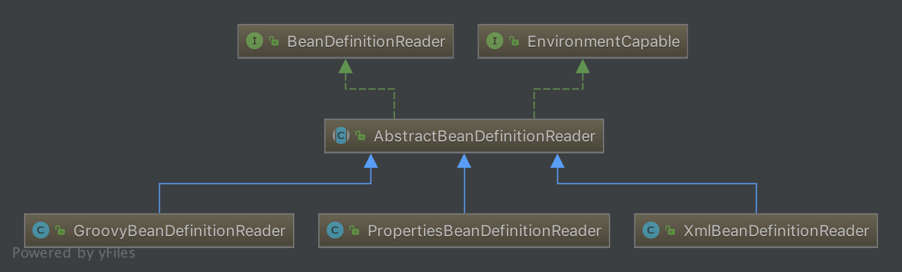
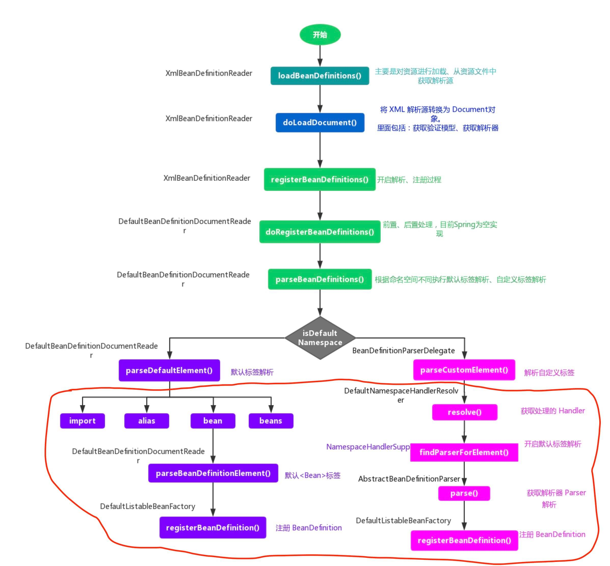
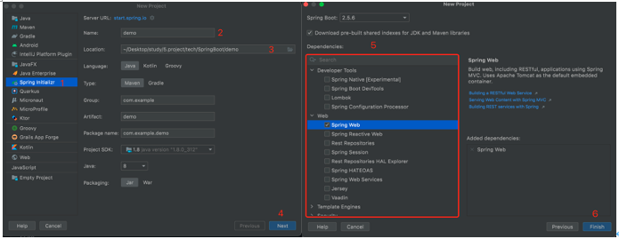

<!-- TOC -->

- [94.Spring](#94spring)
  - [94.1 模块组成](#941-模块组成)
  - [94.2 涉及到的设计模式](#942-涉及到的设计模式)
  - [94.3 循环依赖](#943-循环依赖)
    - [94.3.1 概念](#9431-概念)
    - [94.3.2 spring如何做到的循环依赖](#9432-spring如何做到的循环依赖)
    - [94.3.2 如何解决循环依赖](#9432-如何解决循环依赖)
    - [94.3.3 三级缓存](#9433-三级缓存)
      - [94.3.3.1 种类](#94331-种类)
      - [为什么是三级缓存](#为什么是三级缓存)
      - [94.3.3.2 工作流程](#94332-工作流程)
    - [94.3.4 早期暴露的对象](#9434-早期暴露的对象)
  - [94.4 事件](#944-事件)
- [95.IOC](#95ioc)
  - [95.1 IOC概念](#951-ioc概念)
    - [95.1.1 Spring的 IOC 容器比New对象究竟好在哪](#9511-spring的-ioc-容器比new对象究竟好在哪)
  - [95.2 原理](#952-原理)
  - [95.3 耦合](#953-耦合)
  - [95.2 IOC体系综述](#952-ioc体系综述)
  - [95.2 IOC容器](#952-ioc容器)
    - [95.2.1 概念](#9521-概念)
    - [95.2.2 容器的表现形式](#9522-容器的表现形式)
    - [95.2.3 IOC容器种类](#9523-ioc容器种类)
      - [95.2.3.1 BeanFactory](#95231-beanfactory)
  - [95.3 IOC初始化](#953-ioc初始化)
  - [95.4 IOC创建过程](#954-ioc创建过程)
  - [95.5 自己去实现springIOC](#955-自己去实现springioc)
  - [95.6 DI](#956-di)
    - [95.6.1 DI概念](#9561-di概念)
    - [95.6.2 依赖注入的方式](#9562-依赖注入的方式)
    - [95.6.3 依赖注入方式的区别](#9563-依赖注入方式的区别)
  - [95.7 区别](#957-区别)
    - [95.7.1 IOC和DI区别](#9571-ioc和di区别)
    - [95.7.2 BeanFactory与ApplicationContext区别](#9572-beanfactory与applicationcontext区别)
    - [95.7.3 BeanFactory和FactoryBean的区别（51期）](#9573-beanfactory和factorybean的区别51期)
- [96. IOC初始化底层逻辑](#96-ioc初始化底层逻辑)
  - [96.1 IOC初始化](#961-ioc初始化)
  - [96.2 Resource和ResourceLoader体系](#962-resource和resourceloader体系)
    - [95.8.1 为什么有Resource/ResourceLoader体系？](#9581-为什么有resourceresourceloader体系)
    - [95.8.2 Resource加载策略的工作](#9582-resource加载策略的工作)
    - [Resource抽象类--AbstractResource](#resource抽象类--abstractresource)
    - [Resource接口---ContextResource和WritableResource](#resource接口---contextresource和writableresource)
  - [96.3 继续讲ResourceLoader体系（将上面分开了）](#963-继续讲resourceloader体系将上面分开了)
    - [基类ResourceLoader](#基类resourceloader)
    - [DefaultResourceLoader](#defaultresourceloader)
      - [构造函数](#构造函数)
      - [成员变量](#成员变量)
      - [实现方法----getResource（核心方法）](#实现方法----getresource核心方法)
      - [实现方法---getClassLoader()](#实现方法---getclassloader)
      - [ProtocolResolver](#protocolresolver)
      - [DefaultResourceLoader的两个子类](#defaultresourceloader的两个子类)
    - [FileSystemResourceLoader](#filesystemresourceloader)
      - [实现方法---getResourceByPath](#实现方法---getresourcebypath)
      - [实现方法---FileSystemContextResource](#实现方法---filesystemcontextresource)
        - [为什么要有FileSystemContextResource 类](#为什么要有filesystemcontextresource-类)
    - [ClassRelativeResourceLoader](#classrelativeresourceloader)
      - [实现方法---getResourceByPath](#实现方法---getresourcebypath-1)
    - [ResourcePatternResolver](#resourcepatternresolver)
    - [PathMatchingResourcePatternResolver](#pathmatchingresourcepatternresolver)
      - [构造器](#构造器)
      - [实现方法---getResource](#实现方法---getresource)
      - [实现方法---getResources](#实现方法---getresources)
      - [实现方法---findAllClassPathResources](#实现方法---findallclasspathresources)
      - [实现方法---findPathMatchingResources](#实现方法---findpathmatchingresources)
      - [实现方法---doFindAllClassPathResources](#实现方法---dofindallclasspathresources)
      - [实现方法---determineRootDir](#实现方法---determinerootdir)
  - [96.4 BeanDefinition体系](#964-beandefinition体系)
  - [96.5 BeanDefinitionReader体系](#965-beandefinitionreader体系)
    - [BeanDefinitionReader处理流程](#beandefinitionreader处理流程)
    - [BeanDefinitionReader接口](#beandefinitionreader接口)
    - [实现类XmlBeanDefinitionReader](#实现类xmlbeandefinitionreader)
      - [实现方法---loadBeanDefinitions](#实现方法---loadbeandefinitions)
        - [为什么要把其封装为EncodedResource？](#为什么要把其封装为encodedresource)
      - [实现方法---doLoadBeanDefinitions](#实现方法---doloadbeandefinitions)
      - [xml文件验证模式](#xml文件验证模式)
        - [为什么要有xml文件验证模式](#为什么要有xml文件验证模式)
        - [xml文件格式](#xml文件格式)
        - [xml验证模式方法---doLoadDocument](#xml验证模式方法---doloaddocument)
          - [实现方法---getValidationModeForResource](#实现方法---getvalidationmodeforresource)
          - [实现方法---detectValidationMode](#实现方法---detectvalidationmode)
      - [获取Document实例---DocumentLoader](#获取document实例---documentloader)
          - [实现类---DefaultDocumentLoader](#实现类---defaultdocumentloader)
          - [实现类---EntityResolver](#实现类---entityresolver)
      - [注册Bean实现方法---registerBeanDefinitions](#注册bean实现方法---registerbeandefinitions)
        - [createBeanDefinitionDocumentReader方法](#createbeandefinitiondocumentreader方法)
        - [registerBeanDefinitions方法](#registerbeandefinitions方法)
    - [实现类DefaultBeanDefinitionDocumentReader](#实现类defaultbeandefinitiondocumentreader)
      - [解析bean标签的方式](#解析bean标签的方式)
      - [默认标签解析---parseDefaultElement](#默认标签解析---parsedefaultelement)
      - [importBeanDefinitionResource方法](#importbeandefinitionresource方法)
        - [路径判断](#路径判断)
      - [Bean解析---processBeanDefinition方法](#bean解析---processbeandefinition方法)
        - [parseBeanDefinitionElement方法](#parsebeandefinitionelement方法)
- [97.Bean](#97bean)
  - [97.1 概念](#971-概念)
  - [97.2 Bean的配置定义](#972-bean的配置定义)
  - [97.2 如何加载bean](#972-如何加载bean)
  - [97.3 作用域](#973-作用域)
  - [97.4 线程安全](#974-线程安全)
    - [97.4.1 Spring中的单例bean的线程安全吗？](#9741-spring中的单例bean的线程安全吗)
    - [97.4.2 解决方案](#9742-解决方案)
  - [97.5 生命周期](#975-生命周期)
  - [97.7 初始化bean的工作](#977-初始化bean的工作)
  - [97.8 自动装配](#978-自动装配)
    - [97.8.1 分类](#9781-分类)
    - [97.8.2 xml装配](#9782-xml装配)
    - [97.8.3 注解自动装配](#9783-注解自动装配)
        - [97.8.3.1 前期准备工作](#97831-前期准备工作)
    - [97.8.4 常用注解](#9784-常用注解)
  - [97.9 FactoryBean](#979-factorybean)
    - [概念](#概念)
    - [实现](#实现)
      - [方法1---getObject()](#方法1---getobject)
- [98.AOP](#98aop)
  - [98.1 概念](#981-概念)
  - [98.2 常用概念](#982-常用概念)
    - [98.2.1 什么是 Aspect](#9821-什么是-aspect)
    - [98.2.2 什么是 JoinPoint](#9822-什么是-joinpoint)
    - [98.2.3 什么是 PointCut](#9823-什么是-pointcut)
    - [98.2.4 什么是 Advice ？](#9824-什么是-advice-)
      - [98.2.4.1 有哪些类型的 Advice？](#98241-有哪些类型的-advice)
      - [98.2.4.2 advice的执行顺序](#98242-advice的执行顺序)
    - [98.2.5 什么是Target](#9825-什么是target)
    - [98.2.6 什么是编织](#9826-什么是编织)
    - [98.2.7 区别](#9827-区别)
      - [98.2.7.1 JoinPoint 和 PointCut 的区别](#98271-joinpoint-和-pointcut-的区别)
      - [98.2.7.2 切面、切点、连接点、通知，四者的关系](#98272-切面切点连接点通知四者的关系)
  - [98.2 原理](#982-原理)
  - [98.3 AOP实现](#983-aop实现)
    - [98.3.1 AOP实现方式](#9831-aop实现方式)
      - [98.3.1.1 什么时候使用jdk，什么时候使用cglib](#98311-什么时候使用jdk什么时候使用cglib)
      - [98.3.1.2 JDK的动态代理为什么需要接口](#98312-jdk的动态代理为什么需要接口)
    - [98.3.2 JDK动态代理的步骤](#9832-jdk动态代理的步骤)
    - [98.3.3 cglib动态代理实现步骤](#9833-cglib动态代理实现步骤)
    - [98.3.4 jdk与cglib区别](#9834-jdk与cglib区别)
  - [98.3 AOP使用](#983-aop使用)
    - [第二种方式](#第二种方式)
    - [第三种方式](#第三种方式)
  - [98.4 应用场景](#984-应用场景)
- [7.事务](#7事务)
  - [7.1 概念](#71-概念)
  - [7.2 两种管理方式](#72-两种管理方式)
    - [7.2.1 种类](#721-种类)
    - [7.2.2 事务管理的优点](#722-事务管理的优点)
    - [7.2.3 你更倾向用那种事务管理类型？](#723-你更倾向用那种事务管理类型)
    - [7.2.4 Spring两种事务区别](#724-spring两种事务区别)
  - [7.3 原理](#73-原理)
    - [7.3.1 为什么在Spring事务中不能切换数据源？(位置不确定)](#731-为什么在spring事务中不能切换数据源位置不确定)
  - [7.4 传播机制](#74-传播机制)
  - [7.5 管理接口](#75-管理接口)
  - [7.6 隔离级别](#76-隔离级别)
    - [7.6.1 种类](#761-种类)
    - [7.6.1 Spring的事务和数据库的事务隔离是一个概念么](#761-spring的事务和数据库的事务隔离是一个概念么)
  - [7.7 传播行为](#77-传播行为)
    - [7.7.1 概念](#771-概念)
    - [7.7.2 传播行为分类](#772-传播行为分类)
  - [7.8 回滚规则](#78-回滚规则)
  - [7.9 常见属性](#79-常见属性)
    - [7.9.1 只读属性](#791-只读属性)
    - [7.9.2 超时属性](#792-超时属性)
  - [7.10 事务注解](#710-事务注解)
    - [7.10.1 @Transaction原理](#7101-transaction原理)
    - [7.10.2 实际应用](#7102-实际应用)
    - [7.10.3 注解属性失效](#7103-注解属性失效)
- [8.注解](#8注解)
  - [8.1 @Component, @Controller, @Repository, @Service 有何区别](#81-component-controller-repository-service-有何区别)
  - [8.2 @Autowired和@Resource之间的区别](#82-autowired和resource之间的区别)
- [-------------------------------------------------------------------------](#-------------------------------------------------------------------------)
- [9.过滤器与拦截器](#9过滤器与拦截器)
  - [9.1 过滤器](#91-过滤器)
  - [9.2 拦截器](#92-拦截器)
  - [9.3 拦截器和过滤器的区别](#93-拦截器和过滤器的区别)
  - [9.4 拦截器和过滤器的执行顺序](#94-拦截器和过滤器的执行顺序)
  - [9.5 所用的设计模式](#95-所用的设计模式)
- [10.spring、springboot、springmvc区别](#10springspringbootspringmvc区别)
  - [10.1 spring和springboot的区别](#101-spring和springboot的区别)
  - [10.2 springboot和springmvc区别](#102-springboot和springmvc区别)
  - [10.3 spring与springMVC关系](#103-spring与springmvc关系)
    - [10.3.1 Spring和SpringMVC容器冲突的原因？](#1031-spring和springmvc容器冲突的原因)
    - [10.3.2 如何解决冲突](#1032-如何解决冲突)
  - [10.4 Spring MVC与Struts2异同点](#104-spring-mvc与struts2异同点)
- [11.SpringMVC](#11springmvc)
  - [11.1 概念](#111-概念)
  - [11.2 Spring MVC 有什么优点？](#112-spring-mvc-有什么优点)
- [12.MVC](#12mvc)
  - [12.1 概念](#121-概念)
  - [12.2 MVC优缺点（为什么使用MVC）](#122-mvc优缺点为什么使用mvc)
  - [12.3 如何改善](#123-如何改善)
- [13.组件](#13组件)
  - [13.1 种类](#131-种类)
  - [13.2 什么是DispatcherServlet](#132-什么是dispatcherservlet)
  - [13.3 HandlerMapping映射策略](#133-handlermapping映射策略)
  - [13.4 HandlerInterceptor](#134-handlerinterceptor)
  - [13.5 handler](#135-handler)
  - [13.6 HandlerExecutionChain](#136-handlerexecutionchain)
  - [13.7 ModelAndView](#137-modelandview)
  - [13.8 ViewResolver](#138-viewresolver)
    - [13.8.1 概念](#1381-概念)
    - [13.8.2 寻找策略](#1382-寻找策略)
  - [13.9 view](#139-view)
- [14.工作流程](#14工作流程)
  - [14.1 相同url会出现什么问题](#141-相同url会出现什么问题)
- [15.REST](#15rest)
  - [15.1 概念](#151-概念)
    - [15.1.1 REST是可扩展的或说是协同的吗](#1511-rest是可扩展的或说是协同的吗)
  - [15.2 REST与RESTful](#152-rest与restful)
  - [15.3 资源](#153-资源)
  - [15.4 网络问题](#154-网络问题)
    - [15.4.1 REST用哪种HTTP方法](#1541-rest用哪种http方法)
    - [15.4.2  什么是幂等操作](#1542--什么是幂等操作)
    - [15.4.3 删除的 HTTP 状态返回码是什么 ?](#1543-删除的-http-状态返回码是什么-)
  - [15.5 状态](#155-状态)
  - [15.6 安全](#156-安全)
  - [15.7 模板](#157-模板)
  - [15.8 接口](#158-接口)
    - [21-1：如何创建HttpMessageConverter的自定义实现来支持一种新的请求/响应？](#21-1如何创建httpmessageconverter的自定义实现来支持一种新的请求响应)
- [6.SpringMVC----控制器](#6springmvc----控制器)
  - [6-1:Spring MVC的控制器是不是单例模式,如果是,有什么问题,怎么解决？](#6-1spring-mvc的控制器是不是单例模式如果是有什么问题怎么解决)
  - [6-2:SpingMvc中的控制器的注解一般用哪个](#6-2spingmvc中的控制器的注解一般用哪个)
- [8.SpringMVC 拦截器](#8springmvc-拦截器)
  - [8-1：Spring MVC 的拦截器应用场景](#8-1spring-mvc-的拦截器应用场景)
  - [8-2：Spring MVC的拦截器和Filter过滤器有什么差别？](#8-2spring-mvc的拦截器和filter过滤器有什么差别)
  - [8-3:拦截器怎么写？](#8-3拦截器怎么写)
- [16.注解](#16注解)
- [9.注解---概念](#9注解---概念)
- [10.常用注解](#10常用注解)
  - [10-1:@Controller注解的作用](#10-1controller注解的作用)
  - [10-2:@RequestMapping注解的作用](#10-2requestmapping注解的作用)
    - [10-2-1:@RequestMapping注解属性](#10-2-1requestmapping注解属性)
  - [10-3:@ResponseBody注解的作用](#10-3responsebody注解的作用)
  - [10-4:@PathVariable和@RequestParam的区别](#10-4pathvariable和requestparam的区别)
- [11.SprigMVC----数据](#11sprigmvc----数据)
  - [11-1:Spring MVC怎么样设定重定向和转发的？](#11-1spring-mvc怎么样设定重定向和转发的)
  - [11-2：Spring MVC怎么和AJAX相互调用的？](#11-2spring-mvc怎么和ajax相互调用的)
  - [11-3:如何解决POST请求中文乱码问题，GET的又如何处理呢？](#11-3如何解决post请求中文乱码问题get的又如何处理呢)
- [14.SpringMVC的参数绑定概念](#14springmvc的参数绑定概念)
  - [14-1：SpringMVC的参数绑定支持类型](#14-1springmvc的参数绑定支持类型)
- [15.SpringMVC---异常处理](#15springmvc---异常处理)
- [---------------------------------------------------------------------------](#---------------------------------------------------------------------------)
- [19.MyBatis](#19mybatis)
  - [19.1 概念](#191-概念)
  - [19.2 MyBatis优点](#192-mybatis优点)
  - [19.3 myBatis缺点](#193-mybatis缺点)
  - [19.4 Mybatis是半自动ORM映射工具](#194-mybatis是半自动orm映射工具)
  - [19.5 传统JDBC开发存在的问题，如何解决的](#195-传统jdbc开发存在的问题如何解决的)
- [20.组成](#20组成)
  - [20.1 组成种类](#201-组成种类)
- [21.创建流程](#21创建流程)
  - [21.1 出现的问题---maven资源过滤](#211-出现的问题---maven资源过滤)
- [22.MyBatis原理](#22mybatis原理)
  - [22.1 MyBatis的解析和运行原理](#221-mybatis的解析和运行原理)
  - [22.2 MyBatis的工作原理(启动)](#222-mybatis的工作原理启动)
  - [22.3 MyBatis底层原理](#223-mybatis底层原理)
- [24.设计模式](#24设计模式)
- [25. Mapper接口](#25-mapper接口)
  - [25.1 接口工作原理](#251-接口工作原理)
  - [25.2 Mapper接口绑定实现方式](#252-mapper接口绑定实现方式)
  - [25.3 加载mapper原理](#253-加载mapper原理)
  - [25.4 接口绑定](#254-接口绑定)
    - [25.4.1 概念](#2541-概念)
    - [25.4.2 接口绑定实现方式](#2542-接口绑定实现方式)
    - [23-2:两种接口绑定的选择](#23-2两种接口绑定的选择)
- [26.动态sql](#26动态sql)
  - [26.1 概念](#261-概念)
  - [26.2 动态sql种类](#262-动态sql种类)
  - [26.3 原理](#263-原理)
  - [26.4 sql注入问题](#264-sql注入问题)
    - [26.4.1 概念](#2641-概念)
    - [26.4.2 Mybatis如何防止SQL注入](#2642-mybatis如何防止sql注入)
  - [26.5 MyBatis的预编译](#265-mybatis的预编译)
    - [26.5.1 概念](#2651-概念)
    - [26.5.2 MyBatis是如何做到SQL预编译的呢](#2652-mybatis是如何做到sql预编译的呢)
    - [26.5.3 #{}和${}的区别是什么](#2653-和的区别是什么)
    - [26.5.1 mybatis的$存在安全问题，为什么又不得不用？](#2651-mybatis的存在安全问题为什么又不得不用)
- [27.XML映射文件](#27xml映射文件)
  - [27.1 概念](#271-概念)
  - [27.2 Xml映射文件中有哪些标签](#272-xml映射文件中有哪些标签)
    - [27.2.1 不同的Xml映射文件，id是否可以重复？](#2721-不同的xml映射文件id是否可以重复)
    - [27.2.2 为什么id不能重复](#2722-为什么id不能重复)
  - [27.3 XML映射文件与mybatis数据结构的关系](#273-xml映射文件与mybatis数据结构的关系)
  - [27.4 Mybatis是否可以映射Enum枚举类](#274-mybatis是否可以映射enum枚举类)
    - [14-4-1：TypeHandler 有两个作用](#14-4-1typehandler-有两个作用)
- [28.执行器](#28执行器)
  - [28.1 概念](#281-概念)
  - [28.2 种类](#282-种类)
    - [28.2.1 Mybatis中如何指定使用哪一种Executor执行器？](#2821-mybatis中如何指定使用哪一种executor执行器)
  - [28.3 三种执行器的区别](#283-三种执行器的区别)
- [29.延迟加载](#29延迟加载)
  - [29.1 概念](#291-概念)
  - [29.2 Mybatis是否支持延迟加载](#292-mybatis是否支持延迟加载)
- [30.分页](#30分页)
  - [30.1 原理](#301-原理)
  - [30.2 Mybatis是如何进行分页的？](#302-mybatis是如何进行分页的)
- [31.插件](#31插件)
  - [31.1 原理](#311-原理)
  - [31.2 如何编写一个插件](#312-如何编写一个插件)
- [32.一级二级缓存](#32一级二级缓存)
- [33.MyBatis核心配置文件](#33mybatis核心配置文件)
  - [33.1 种类](#331-种类)
  - [33.2 环境配置environment](#332-环境配置environment)
    - [33.2.1 事务管理器transactionManager](#3321-事务管理器transactionmanager)
    - [33.2.2 数据源dataSource](#3322-数据源datasource)
  - [33.3 映射器mappers](#333-映射器mappers)
    - [33.3.1 映射器产生的意义与原理](#3331-映射器产生的意义与原理)
    - [33.3.2 引入资源的方式](#3332-引入资源的方式)
  - [33.4 映射语句文件mapper](#334-映射语句文件mapper)
    - [33.4.1命名空间---namespace](#3341命名空间---namespace)
    - [33.4.2 注意的坑](#3342-注意的坑)
  - [33.5 properties](#335-properties)
    - [33.5.1 properties存在的意义](#3351-properties存在的意义)
    - [33.5.2 配置步骤](#3352-配置步骤)
  - [33.6 设置别名typeAliases](#336-设置别名typealiases)
    - [33.6.1 存在的意义](#3361-存在的意义)
    - [33.6.2 流程](#3362-流程)
- [34.自动映射---ResultMap](#34自动映射---resultmap)
  - [34.1 产生](#341-产生)
  - [34.2 使用](#342-使用)
- [---------------------------------------------------------------------------](#----------------------------------------------------------------------------1)
- [35.SpringBoot](#35springboot)
  - [35.1 Spring Boot 有哪些优点](#351-spring-boot-有哪些优点)
  - [35.2 Spring Boot 有哪些缺点](#352-spring-boot-有哪些缺点)
  - [35.3 Spring Boot项目结构](#353-spring-boot项目结构)
  - [35.4 循环依赖](#354-循环依赖)
- [36.启动流程  修订](#36启动流程--修订)
- [37.配置文件](#37配置文件)
  - [37.1 种类](#371-种类)
    - [37.1.1 默认配置文件](#3711-默认配置文件)
  - [37.2 JavaConfig](#372-javaconfig)
    - [37.2.1 概念](#3721-概念)
    - [37.2.2 JavaConfig优点](#3722-javaconfig优点)
  - [37.3 Spring Boot 有哪几种读取配置的方式？](#373-spring-boot-有哪几种读取配置的方式)
  - [37.4 Spring Boot 是否可以使用 XML 配置](#374-spring-boot-是否可以使用-xml-配置)
  - [37.5 spring boot 核心的两个配置文件](#375-spring-boot-核心的两个配置文件)
  - [37.6 加载顺序](#376-加载顺序)
  - [37.6 配置文件xml](#376-配置文件xml)
    - [37.6.1SpringBoot是如何做到去xml的?](#3761springboot是如何做到去xml的)
- [38.自动配置](#38自动配置)
  - [38.1 概念](#381-概念)
  - [38.2 原理](#382-原理)
- [39.安全](#39安全)
  - [39.1 概念](#391-概念)
  - [39.2 什么是 CSRF 攻击？](#392-什么是-csrf-攻击)
- [40.视图技术Thymeleaf](#40视图技术thymeleaf)
- [41.监视器](#41监视器)
  - [41.1 概念](#411-概念)
  - [41.2 如何在 Spring Boot 中禁用 Actuator 端点安全性？](#412-如何在-spring-boot-中禁用-actuator-端点安全性)
  - [41.3 我们如何监视所有 Spring Boot 微服务？](#413-我们如何监视所有-spring-boot-微服务)
- [42. SpringBoot内置Tomcat浅析](#42-springboot内置tomcat浅析)
  - [42.1 tomcat容器与spring容器的关系？](#421-tomcat容器与spring容器的关系)
- [43.常用注解](#43常用注解)
- [---Servlet--------------------------------------------------------------------------------](#---servlet--------------------------------------------------------------------------------)
- [44.Servlet](#44servlet)
- [45.生命周期](#45生命周期)
  - [1-1：forward和redirect的区别](#1-1forward和redirect的区别)
  - [1-3：典型的应用场景](#1-3典型的应用场景)
- [2.servlet---如何使用](#2servlet---如何使用)
- [3.Servlet----缺点](#3servlet----缺点)
- [4.Servlet-----安全性](#4servlet-----安全性)
- [5.servlet、jsp与SpringMVC区别](#5servletjsp与springmvc区别)
  - [5-1：servlet和springmvc区别](#5-1servlet和springmvc区别)
  - [5-2：jsp和servlet区别](#5-2jsp和servlet区别)
- [6.servlet加载顺序](#6servlet加载顺序)
- [7.tomcat与servlet](#7tomcat与servlet)
  - [7-1：tomcat容器是如何创建servlet类实例](#7-1tomcat容器是如何创建servlet类实例)
- [MyBatisPlu创建过程](#mybatisplu创建过程)
- [日志](#日志)
  - [如何配置日志](#如何配置日志)
- [CURD操作](#curd操作)
  - [insert添加操作](#insert添加操作)
- [---------------------------------------------------------------------------](#----------------------------------------------------------------------------2)
- [创建SpringBoot项目](#创建springboot项目)
  - [创建SpringBoot流程](#创建springboot流程)
  - [SpringBoot运行原理](#springboot运行原理)
- [YAML](#yaml)
  - [YAML使用](#yaml使用)
- [YAML语法](#yaml语法)
- [---------------------------------------------------------------------------------------------------------](#---------------------------------------------------------------------------------------------------------)
- [Tomcat](#tomcat)
  - [Tomcat安装](#tomcat安装)
- [Servlet](#servlet)
  - [两种架构](#两种架构)
  - [servlet是什么](#servlet是什么)
  - [servlet架构](#servlet架构)
  - [servlet生命周期](#servlet生命周期)

<!-- /TOC -->


# 94.Spring

## 94.1 模块组成

1. spring core：提供了框架的基本组成部分，
               包括控制反转（IOC）和依赖注入（DI）功能。
2. spring beans：提供了BeanFactory，是工厂模式的一个经典实现，Spring将管理对象称为Bean。
3. spring context：构建于 core 封装包基础上的 context 封装包，提供了一种框架式的对象访问方法。
4. spring jdbc：提供了一个JDBC的抽象层，用于简化JDBC。
               消除了烦琐的JDBC编码和数据库厂商特有的错误代码解析
5. spring aop：提供了面向切面的编程实现，让你可以自定义拦截器、切点等。
6. spring Web：提供了针对 Web 开发的集成特性，例如文件上传，
               利用 servlet listeners 进行 ioc容器初始化
               和针对 Web 的 ApplicationContext。
7. spring test：主要为测试提供支持的，
                支持使用JUnit或TestNG
                对Spring组件进行单元测试和集成测试。

## 94.2 涉及到的设计模式

1. 工厂模式:通过 BeanFactory 或 ApplicationContext 创建 bean 对象。

2. 单例模式:Bean默认为单例模式。
    xml : <bean id="userService" class="top.snailclimb.UserService" scope="singleton"/>
    注解：@Scope(value = "singleton")

3. 代理模式:Spring 的AOP功能用到了JDK的动态代理和CGLIB字节码生成技术;

4. 模板模式:
   Spring 中 jdbcTemplate、hibernateTemplate 等以 Template 结尾的对数据库操作的类，它们就使用到了模板模式。
   一般情况下，我们都是使用继承的方式来实现模板模式，但是 Spring 并没有使用这种方式，
   而是使用Callback 模式与模板方法模式配合，既达到了代码复用的效果，同时增加了灵活性。

5. 观察者模式:
   Spring 事件驱动模型就是观察者模式，比如我们每次添加商品的时候都需要重新更新商品索引，
   这个时候就可以利用观察者模式来解决这个问题。

6. 适配器模式
   
   * 在SpringAOP和SpringMVC中都有适配器模式虽然Spring AOP 的实现是基于代理模式，
     但是 Spring AOP 的增强或通知(Advice)使用到了适配器模式，比如说Spring预定义要通过对应的适配器，
     适配成 MethodInterceptor接口(方法拦截器)类型的对象
     如：MethodBeforeAdviceInterceptor 负责适配 MethodBeforeAdvice
  
  * spring MVC中的适配器模式
    在Spring MVC中，DispatcherServlet根据请求信息，调用HandlerMapping，解析请求对应的Handler。
    解析到对应的 Handler,也就是我们平常说的 Controller 控制器后，开始由HandlerAdapter 适配器处理。
    HandlerAdapter 作为期望接口，具体的适配器实现类用于对目标类进行适配，Controller 作为需要适配的类。
    因为Spring MVC 中的 Controller 种类众多，不同类型的 Controller 通过不同的方法来对请求进行处理。
    如果不利用适配器模式的话，DispatcherServlet 直接获取对应类型的 Controller，需要的自行来判断

7. 装饰者模式
   当我们需要修改原有的功能，但我们又不愿直接去修改原有的代码时，设计一个Decorator套在原有代码外面
   Spring 中配置 DataSource 的时候，DataSource 可能是不同的数据库和数据源。我们能否根据客户的需求在少
   修改原有类的代码下动态切换不同的数据源，这个时候就要用到装饰者模式。Spring 中用到的包装器模式
   在类名上含有 Wrapper或者 Decorator。这些类基本上都是动态地给一个对象添加一些额外的职责

## 94.3 循环依赖

### 94.3.1 概念

比如说，我有一个A对象，他的属性是B对象，而B对象的属性又是A对象，

### 94.3.2 spring如何做到的循环依赖

比如说，
首先A对象实例化，然后对属性进行注入，发现依赖B对象，
B对象此时还没有创建出来，所以转头去实例化B对象
B对象实例化之后，发现需要依赖A对象，那因为A对象已经实例化了，所以B对象最终能完成创建
B对象返回到A对象的属性注入的方法上，A对象最终完成创建

### 94.3.2 如何解决循环依赖

主要是用三级缓存来解决循环依赖问题

比如说A、B类的互相依赖注入

A对象实例化之后，属性注入之前，其实会把A对象放入到三级缓存中的，key就是beanname，value就是objectfactory
等到A对象属性注入的时候，发现依赖B，又去实例化B时，
B属性注入需要去获取A对象，这里就是从三级缓存里拿出objectfactory，从objectfactory得到对应的bean，也就是对象A
把三级缓存的A记录给干掉，然后放到二级缓存中，
这样，二级缓存中，key是beanname，value就是bean，也就是没做完属性注入相关工作的bean
等到完全初始化之后呢，就会把二级缓存给remove掉，塞到了一级缓存汇总，
我们自己去getbean的时候，实际已经拿到了一级缓存了

### 94.3.3 三级缓存

#### 94.3.3.1 种类

1. 第一级缓存：单例缓存池 singletonObjects。
2. 第二级缓存：早期提前暴露的对象缓存 earlySingletonObjects。
3. 第三级缓存：singletonFactories 单例对象工厂缓存

#### 为什么是三级缓存

从三级缓存来说，key就是beanname，value就是objectfactory
我们的对象是单例的，有可能a对象依赖的b对象是有aop的，b对象需要代理，
假设没有三级缓存，只有二级缓存，value存对象，而不是工厂模式
在有aop情况下，在存入二级缓存之前都要做aop代理，这样不合适的
所以一定要考虑到代理情况，比如说，a对象是一个被aop增量的对象，b对象依赖a的时候，
得到的a肯定是一个代理对象，所以三级缓存的value就是objectfactory，可以从里面拿到代理对象
而二级缓存的存在是为了性能，因为从三级缓存的工厂里创建出对象，在扔到二级缓存里，这样就不用每次从工厂拿了

#### 94.3.3.2 工作流程

A对象实例化之后，属性注入之前，其实会把A对象放入到三级缓存中的，key就是beanname，value就是objectfactory
等到A对象属性注入的时候，发现依赖B，又去实例化B时，
B属性注入需要去获取A对象，这里就是从三级缓存里拿出objectfactory，从objectfactory得到对应的bean，也就是对象A
把三级缓存的A记录给干掉，然后放到二级缓存中，
这样，二级缓存中，key是beanname，value就是bean，也就是没做完属性注入相关工作的bean
等到完全初始化之后呢，就会把二级缓存给remove掉，塞到了一级缓存汇总，
我们自己去getbean的时候，实际已经拿到了一级缓存了

### 94.3.4 早期暴露的对象

你是一个不完整的对象，你的属性还没有值，
你的对象也没有被初始化。这就是早期暴露的对象，
只是提前拿出来给你认识认识。但他非常重要。
这是多级缓存解决循环依赖问题的一个巧妙的地方。

## 94.4 事件

Spring 提供了以下5种标准的事件：
1. 上下文更新事件（ContextRefreshedEvent）
   在调用ConfigurableApplicationContext 接口中的refresh()方法时被触发。
2. 上下文开始事件（ContextStartedEvent）：
   当容器调用ConfigurableApplicationContext的Start()方法开始/重新开始容器时触发该事件。
3. 上下文停止事件（ContextStoppedEvent）：
   当容器调用ConfigurableApplicationContext的Stop()方法停止容器时触发该事件。
4. 上下文关闭事件（ContextClosedEvent）：
   当ApplicationContext被关闭时触发该事件。容器被关闭时，其管理的所有单例Bean都被销毁。
5. 请求处理事件（RequestHandledEvent）：
   在Web应用中，当一个http请求（request）结束触发该事件。
   如果一个bean实现了ApplicationListener接口，
   当一个ApplicationEvent 被发布以后，bean会自动被通知。


# 95.IOC

## 95.1 IOC概念

IOC我理解的就是原来是需要什么东西自己去拿，现在是需要什么东西让别人（IoC Service Provider）送过来

1. IOC容器控制对象：在传统的开发模式下，我们都是采用直接new一个对象的方式来创建对象
                  但是如果注入的对象有被依赖的对象，那么我就需要自己去创建
                  但是有了IoC容器后，则直接由IoC容器来控制。
2. 控制什么：控制对象。
3. 为何是反转：没有 IoC 的时候我们都是在自己对象中主动去创建被依赖的对象，这是正转。
             但是有了IoC后，所依赖的对象直接由IoC容器创建后注入到被注入的对象中，
             依赖的对象由原来的主动获取变成被动接受，所以是反转。
4. 哪些方面反转了：所依赖对象的获取被反转了。

### 95.1.1 Spring的 IOC 容器比New对象究竟好在哪

比如说甲乙双方卖袜子，甲乙可以在对方不真实存在的情况下独立存在，而且保证不交易时候无联系，
想交易的时候可以很容易的产生联系。甲乙交易活动不需要双方见面，避免了双方的互不信任造成交易失败的问题。
因为交易由第三方来负责联系，而且甲乙都认为第三方可靠。那么交易就能很可靠很灵活的产生和进行了。

这样我就可以把我的资源集中管理，并且降低了资源双方的依赖程度

## 95.2 原理

## 95.3 耦合


## 95.2 IOC体系综述

1. Resource和ResourceLoader体系
2. BeanFactory体系
3. BeanDefinition体系
4. BeanDefinitionReader体系
5. ApplicationContext体系

## 95.2 IOC容器

### 95.2.1 概念

管理所有组件（也就是管理类），容器类似于婚介所的中介，把主动获取变为了被动资源接受

ps:之前找对象，主动出击，现在找对象，找个婚介所就可以了。

### 95.2.2 容器的表现形式

xxx.xml文件

<bean id="hello" class="pojo.Hello">   类似于创建构造器，id就是要实例化的对象，class是他的位置
      <property name="name" value="Spring"/> 类似于构造器赋值，name属性是javabean哪个属性
</bean>

### 95.2.3 IOC容器种类

Spring 提供了两种IoC 容器，分别是 BeanFactory、ApplicationContext 。

#### 95.2.3.1 BeanFactory

BeanFactory 最常用的是 XmlBeanFactory 。它可以根据 XML 文件中定义的内容，创建相应的 Bean。

## 95.3 IOC初始化


1. 资源定位。一般用外部资源来描述Bean对象，所以在初始化IoC容器的第一步就是需要定位这个外部资源。
2. 装载。在IoC容器内部维护着一个BeanDefinition Map的数据结构
        那么如何把资源文件中每一个<bean>转换为BeanDefinition就是装载的意义所在
3. 注册。把解析好的BeanDefinition向IOC容器进行注册

## 95.4 IOC创建过程

1. 本次使用的是maven方式，那么需要在pom.xml中加入spring-webmvc依赖
   ```java
   <dependency>
      <groupId>org.springframework</groupId>
      <artifactId>spring-webmvc</artifactId>
      <version>5.1.10.RELEASE</version>
   </dependency>
   ```
2. （这个就是一个bean）创建一个类，比如说hello类
3. （这个就是一个容器）编写我们的spring文件,也就是一个xml文件，这个文件就相当于new xxx的作用
   ```java
   <?xml version="1.0" encoding="UTF-8"?>
   <beans xmlns="http://www.springframework.org/schema/beans"
         xmlns:xsi="http://www.w3.org/2001/XMLSchema-instance"
         xsi:schemaLocation="http://www.springframework.org/schema/beans
         http://www.springframework.org/schema/beans/spring-beans.xsd">

      <!--bean就是java对象 , 由Spring创建和管理-->
      <bean id="hello" class="pojo.Hello">   id就是要药实例化的对象，class是他的位置
         <property name="name" value="Spring"/>  这个就相当于是构造器一样的作用
      </bean>
   </beans>
   ```
4. 在测试中进行测试

```java
public class test {
    public static void main(String[] args) {
        //解析beans.xml文件 , 生成管理相应的Bean对象
        ApplicationContext context = new ClassPathXmlApplicationContext("createhelloworld.xml");
        //getBean : 参数即为spring配置文件中bean的id .
        Hello hello = (Hello) context.getBean("hello");
        hello.show();
    }
}
```

## 95.5 自己去实现springIOC

1. 首先，我们定义一个Bean类，这个类用来存放一个Bean拥有的属性
   Bean的属性主要包含了

## 95.6 DI

### 95.6.1 DI概念

IoC的一个重点是在系统运行中，动态的向某个对象提供它所需要的其他对象。
这一点是通过DI，也就是依赖注入来实现的。

### 95.6.2 依赖注入的方式

1. setter方法注入
2. 构造器注入
3. p命名空间注入
4. 接口注入

---------------------------------------------------------------
1. set注入
   `1. set注入，通过IOC容器赋值`
   ```java
   public void setperson(){.....}
   ```
   ```java
   ioc.getbean("person");
   ```
   ```java
   <bean id="person" class="pojo.Hello">   id就是要药实例化的对象，class是他的位置
         <property name="name" value="Spring"/>  这个就相当于是构造器一样的作用
   </bean>
   ```

   `2. 通过bean的类型赋值`

   ```java
   ioc.getbean(person.class);
   ioc.getbean("person01",person.class)//如果存在多个bean，那么就需要通过这种方式进行区分
   ```
   xml文件同上
   
   `3.数组/list/map/set/null/properties注入`

2. 通过构造器为bean赋值

```java
public person(a,b,c,d)
public person(a,c,d)
public person(a,b,c)
```
构造器中bean对象创建有三种方式：

   1. 正常创建
   ```java
   <bean id="person03" class="com.atguigu.bean.Person">
   		<!-- 调用有参构造器进行创建对象并赋值；掌握 -->
   		<!-- public Person(String lastName, Integer age, String gender, String email) -->
   		<constructor-arg name="lastName" value="小明"></constructor-arg>
   		<constructor-arg name="email" value="xiaoming@atguigu.com"></constructor-arg>
   		<constructor-arg name="gender" value="男"></constructor-arg>
   		<constructor-arg name="age" value="18"></constructor-arg>
   	</bean>
   ```
   如果缺少一个，那么就会报错

   2. 省略name属性，要严格按照参数位置书写，如果不按照位置，可以用index属性
   ```java
   <bean id="person04" class="com.atguigu.bean.Person">
   		<constructor-arg value="小花"></constructor-arg>
   		<constructor-arg value="18"></constructor-arg>
   		<!--  index="3"：为参数指定索引，从0开始 -->
   		<constructor-arg value="xiaohua@atguigu.com" index="3"></constructor-arg>
   		<constructor-arg value="男" index="2"></constructor-arg>
   	</bean>
   ```

   3. 重载情况下，可以采用使用type来制定参数类型用来区分
   ```java
   <bean id="person05" class="com.atguigu.bean.Person">
   		<constructor-arg value="小丽"></constructor-arg>
   		<constructor-arg value="10" index="1" type="java.lang.Integer"></constructor-arg>
   		<constructor-arg value="男"></constructor-arg>
   	</bean>
   ```

3. 命名空间注入

xml文件中
```java
<bean id="person06" class="com.atguigu.bean.Person"
	  	p:age="18" p:email="xiaoming@atguigu.com" 
	  	p:lastName="哈哈" p:gender="男">
</bean>
```

4. 接口注入

### 95.6.3 依赖注入方式的区别


## 95.7 区别

### 95.7.1 IOC和DI区别

比如对象A需要操作数据库，以前我们总是要在A中自己编写代码来获得一个Connection对象，
有了 spring我们就只需要告诉spring，A中需要一个Connection，至于这个Connection怎么构造，何时构造，A不需要知道。
在系统运行时，spring会在适当的时候制造一个Connection，然后像打针一样，注射到A当中，这样就完成了对各个对象之间关系的控制。
A需要依赖 Connection才能正常运行，而这个Connection是由spring注入到A中的，依赖注入的名字就这么来的。
Java 1.3之后一个重要特征是反射（reflection），它允许程序在运行的时候动态的生成对象、执行对象的方法、改变对象的属性，
spring就是通过反射来实现注入的。

### 95.7.2 BeanFactory与ApplicationContext区别

1. 依赖关系
   BeanFactory:是Spring里面最底层的接口，维护 bean之间的依赖关系。
   ApplicationContext 接口作为 BeanFactory的派生，除了提供BeanFactory所具有的功能外，
   还提供了更完整的框架功能

2. 加载方式
   BeanFactroy采用的是延迟加载形式来注入Bean的，即只有在使用到某个Bean时
   (调用getBean())，才对该Bean进行加载实例化。这样，我们就不能发现一些存在的Spring
   的配置问题。如果Bean的某一个属性没有注入，BeanFacotry加载后，直至第一次使用调用
   getBean方法才会抛出异常。
   ApplicationContext，它是在容器启动时，一次性创建了所有的Bean。这样，在容器启动
   时，我们就可以发现Spring中存在的配置错误，这样有利于检查所依赖属性是否注
   入。ApplicationContext启动后预载入所有的单实例Bean，通过预载入单实例bean ,确保当
   你需要的时候，你就不用等待，因为它们已经创建好了。相对于基本的 BeanFactory，
   ApplicationContext唯一的不足是占用内存空间。当应用程序配置Bean较多时，
   程序启动较慢。

3. 创建方式
   BeanFactory通常以编程的方式被创建，ApplicationContext还能以声明的方式创建，

4. 注册方式
   BeanFactory和 ApplicationContext 都支持 BeanPostProcessor、
   BeanFactoryPostProcessor的使用，但两者之间的区别是: BeanFactory需要手动注册，
   而ApplicationContext则是自动注册。

### 95.7.3 BeanFactory和FactoryBean的区别（51期）

BeanFactory是个Factory，也就是IOC容器或对象工厂，
FactoryBean是个Bean。在Spring中，
所有的Bean都是由BeanFactory(也就是IOC容器)来进行管理的。
但对FactoryBean而言，这个Bean不是简单的Bean，
而是一个能生产或者修饰对象生成的工厂Bean,
它的实现与设计模式中的工厂模式和修饰器模式类似


# 96. IOC初始化底层逻辑

## 96.1 IOC初始化

1. 资源定位。一般用外部资源来描述Bean对象，所以在初始化IoC容器的第一步就是需要定位这个外部资源。
2. 装载。在IoC容器内部维护着一个BeanDefinition Map的数据结构
        那么如何把资源文件中每一个<bean>转换为BeanDefinition就是装载的意义所在
3. 注册。把解析好的BeanDefinition向IOC容器进行注册

## 96.2 Resource和ResourceLoader体系


Resource是一个抽象类，它的每一个实现类都代表了一种资源的访问策略，

如 ClassPathResource、RLResource、FileSystemResource 等。

那么我有了资源，我就要对资源进行加载，这样就产生了ResourceLoader体系


Spring 提供了 Resource 和 ResourceLoader 来统一抽象整个资源及其定位。
使得资源与资源的定位有了一个更加清晰的界限，并且提供了合适的 Default 类，使得自定义实现更加方便和清晰。

1. AbstractResource 为 Resource 的默认抽象实现，它对 Resource 接口做了一个统一的实现，
   子类继承该类后只需要覆盖相应的方法即可，同时对于自定义的 Resource 我们也是继承该类。

2. DefaultResourceLoader 同样也是 ResourceLoader 的默认实现，在自定 ResourceLoader 的时候我们除了可以继承该
   类外还可以实现 ProtocolResolver 接口来实现自定资源加载协议。
   - DefaultResourceLoader 每次只能返回单一的资源，所以 Spring 针对这个提供了另外一个接口 
   - ResourcePatternResolver ，该接口提供了根据指定的 locationPattern 返回多个资源的策略。  
     - PathMatchingResourcePatternResolver 是一个集大成者的 ResourceLoader ，因为它即实现了 
       ResourcegetResource(String location) 方法，也实现了 Resource[] getResources(String 
       locationPattern) 方法。

### 95.8.1 为什么有Resource/ResourceLoader体系？

在Java SE的时候，有一个URL标准类（java.net.URL），该类在 Java SE 中的定位为统一资源定位器（Uniform Resource Locator），但是我们知道它的实现基本只限于网络形式发布的资源的查找和定位。然而，实际上资源的定义比较广泛，除了网络形式的资源，还有以二进制形式存在的、以文件形式存在的、以字节流形式存在的等等。而且它可以存在于任何场所，比如网络、文件系统、应用程序中。所以 java.net.URL 的局限性迫使 Spring 必须实现自己的资源加载策略，

### 95.8.2 Resource加载策略的工作

1. 职能划分清楚。资源的定义和资源的加载应该要有一个清晰的界
   限；
2. 统一的抽象。统一的资源定义和资源加载策略。资源加载后要返回
   统一的抽象给客户端，客户端要对资源进行怎样的处理，应该由抽
   象资源接口来界定。

### Resource抽象类--AbstractResource

为 Resource 接口的默认抽象实现。它实现了 Resource 接口的大
部分的公共实现，如果要自定义resource直接实现
AbstractResource就可以了

```java
public abstract class AbstractResource implements Resource {

	/**
	 * 判断文件是否存在，若判断过程产生异常（因为会调用SecurityManager来判断），就关闭对应的流
	 */
	@Override
	public boolean exists() {
		try {
		  // 基于 File 进行判断
			return getFile().exists();
		}
		catch (IOException ex) {
			// Fall back to stream existence: can we open the stream?
			// 基于 InputStream 进行判断
			try {
				InputStream is = getInputStream();
				is.close();
				return true;
			} catch (Throwable isEx) {
				return false;
			}
		}
	}

	/**
	 * 直接返回true，表示可读
	 */
	@Override
	public boolean isReadable() {
		return true;
	}

	/**
	 * 直接返回 false，表示未被打开
	 */
	@Override
	public boolean isOpen() {
		return false;
	}

	/**
	 * 直接返回false，表示不为 File
	 */
	@Override
	public boolean isFile() {
		return false;
	}

	/**
	 * 抛出 FileNotFoundException 异常，交给子类实现
	 */
	@Override
	public URL getURL() throws IOException {
		throw new FileNotFoundException(getDescription() + " cannot be resolved to URL");

	}

	/**
	 * 基于 getURL() 返回的 URL 构建 URI
	 */
	@Override
	public URI getURI() throws IOException {
		URL url = getURL();
		try {
			return ResourceUtils.toURI(url);
		} catch (URISyntaxException ex) {
			throw new NestedIOException("Invalid URI [" + url + "]", ex);
		}
	}

	/**
	 * 抛出 FileNotFoundException 异常，交给子类实现
	 */
	@Override
	public File getFile() throws IOException {
		throw new FileNotFoundException(getDescription() + " cannot be resolved to absolute file path");
	}

	/**
	 * 根据 getInputStream() 的返回结果构建 ReadableByteChannel
	 */
	@Override
	public ReadableByteChannel readableChannel() throws IOException {
		return Channels.newChannel(getInputStream());
	}

	/**
	 * 获取资源的长度
	 *
	 * 这个资源内容长度实际就是资源的字节长度，通过全部读取一遍来判断
	 */
	@Override
	public long contentLength() throws IOException {
		InputStream is = getInputStream();
		try {
			long size = 0;
			byte[] buf = new byte[255]; // 每次最多读取 255 字节
			int read;
			while ((read = is.read(buf)) != -1) {
				size += read;
			}
			return size;
		} finally {
			try {
				is.close();
			} catch (IOException ex) {
			}
		}
	}

	/**
	 * 返回资源最后的修改时间
	 */
	@Override
	public long lastModified() throws IOException {
		long lastModified = getFileForLastModifiedCheck().lastModified();
		if (lastModified == 0L) {
			throw new FileNotFoundException(getDescription() +
					" cannot be resolved in the file system for resolving its last-modified timestamp");
		}
		return lastModified;
	}

	protected File getFileForLastModifiedCheck() throws IOException {
		return getFile();
	}

	/**
	 * 抛出 FileNotFoundException 异常，交给子类实现
	 */
	@Override
	public Resource createRelative(String relativePath) throws IOException {
		throw new FileNotFoundException("Cannot create a relative resource for " + getDescription());
	}

	/**
	 * 获取资源名称，默认返回 null ，交给子类实现
	 */
	@Override
	@Nullable
	public String getFilename() {
		return null;
	}

	/**
	 * 返回资源的描述
	 */
	@Override
	public String toString() {
		return getDescription();
	}

	@Override
	public boolean equals(Object obj) {
		return (obj == this ||
			(obj instanceof Resource && ((Resource) obj).getDescription().equals(getDescription())));
	}

	@Override
	public int hashCode() {
		return getDescription().hashCode();
	}

}
```

### Resource接口---ContextResource和WritableResource

1. ContextResource接口增加了一个方法：
```java
String getPathWithinContext(); //返回上下文内的路径  
　　这个方法使得它的实现类有了返回当前上下文路径的能力。
```
2. WritableResource接口增加了2个方法：
```java
    boolean isWritable();  //  是否可写
    OutputStream getOutputStream() throws IOException; //返回资源的写入流
　　这个方法使得它的实现类拥有了写资源的能力。
```

## 96.3 继续讲ResourceLoader体系（将上面分开了）

因为Resource 定义了统一的资源，那资源的加载则由 ResourceLoader 来统一定义。

### 基类ResourceLoader

主要应用于根据给定的资源文件地址，返回对应的Resource 。

```java
public interface ResourceLoader {
	String CLASSPATH_URL_PREFIX = ResourceUtils.CLASSPATH_URL_PREFIX; // CLASSPATH URL 前缀。默认为："classpath:"
   //根据提供的资源路径返回resource
	Resource getResource(String location);
   //返回classloader实例
	ClassLoader getClassLoader();
}
```
### DefaultResourceLoader

#### 构造函数

```java
public DefaultResourceLoader() { // 无参构造函数
	this.classLoader = ClassUtils.getDefaultClassLoader();
}

public DefaultResourceLoader(@Nullable ClassLoader classLoader) { // 带 ClassLoader 参数的构造函数
	this.classLoader = classLoader;
}
```

#### 成员变量

```java
@Nullable
private ClassLoader classLoader;

public void setClassLoader(@Nullable ClassLoader classLoader) {
	this.classLoader = classLoader;
}
```

#### 实现方法----getResource（核心方法）

主要思路：

1. 首先，通过ProtocolResolver方法来加载资源，成功返回 
   Resource 。
2. 其次，若location以 "/" 开头，则调用 
   getResourceByPath()方法，这个方法是构造了 
   ClassPathContextResource 类型资源并返回。
```java   
protected Resource getResourceByPath(String path) {
	return new ClassPathContextResource(path, 
   getClassLoader());
}
```
3. 再次，若location 以 "classpath:" 开头，则构造 
   ClassPathResource 类型资源并返回。
4. 然后，构造 URL ，尝试通过它进行资源定位，若没有抛出 
   MalformedURLException 异常，则判断是否为 FileURL , 
   如果是则构造 FileUrlResource 类型的资源，否则构造 
   UrlResource 类型的资源。
5. 最后，若在加载过程中抛出 MalformedURLException 异常，
   则委派 #getResourceByPath() 方法，实现资源定位加载。

```java
// DefaultResourceLoader.java

@Override
public Resource getResource(String location) {
    Assert.notNull(location, "Location must not be null");

    // 首先，通过 ProtocolResolver 来加载资源
    for (ProtocolResolver protocolResolver : this.protocolResolvers) {
        Resource resource = protocolResolver.resolve(location, this);
        if (resource != null) {
            return resource;
        }
    }
    // 其次，以 / 开头，返回 ClassPathContextResource 类型的资源
    if (location.startsWith("/")) {
        return getResourceByPath(location);
    // 再次，以 classpath: 开头，返回 ClassPathResource 类型的资源
    } else if (location.startsWith(CLASSPATH_URL_PREFIX)) {
        return new ClassPathResource(location.substring(CLASSPATH_URL_PREFIX.length()), getClassLoader());
    // 然后，根据是否为文件 URL ，是则返回 FileUrlResource 类型的资源，否则返回 UrlResource 类型的资源
    } else {
        try {
            // Try to parse the location as a URL...
            URL url = new URL(location);
            return (ResourceUtils.isFileURL(url) ? new FileUrlResource(url) : new UrlResource(url));
        } catch (MalformedURLException ex) {
            // 最后，返回 ClassPathContextResource 类型的资源
            // No URL -> resolve as resource path.
            return getResourceByPath(location);
        }
    }
}
```

#### 实现方法---getClassLoader()

```java
@Override
@Nullable
public ClassLoader getClassLoader() {
	return (this.classLoader != null ? this.
   classLoader : ClassUtils.getDefaultClassLoader())
   ;
}
```

#### ProtocolResolver

之后补充

#### DefaultResourceLoader的两个子类

1. FileSystemResourceLoader
2. ClassRelativeResourceLoader

这两个字类都是覆盖重写了一个getResourceByPath方法，
由于这个方法在DefaultResourceLoader中描述的并不是那么恰当。

### FileSystemResourceLoader

#### 实现方法---getResourceByPath

由于DefaultResourceLoader的getResourceByPath()方法处理其实不是很恰当，
只是返回了一个ClassPathContextResource类型，

重写之后，使之从文件系统加载资源并以FileSystemResource类型返回

```java
@Override
protected Resource getResourceByPath(String path) {
	// 截取首 /
	if (path.startsWith("/")) {
		path = path.substring(1);
	}
	// 创建 FileSystemContextResource 类型的资源
	return new FileSystemContextResource(path);
}
```

#### 实现方法---FileSystemContextResource

FileSystemContextResource是FileSystemResourceLoader的内部类

```java
private static class FileSystemContextResource extends FileSystemResource implements ContextResource {

	public FileSystemContextResource(String path) {
		super(path);//直接调用了父类来构造
	}

	@Override
	public String getPathWithinContext() {
		return getPath();
	}
}
```
##### 为什么要有FileSystemContextResource 类

主要是要实现getPathWithinContext()接口方法，主要作用是返回上下文内的路径

### ClassRelativeResourceLoader

ClassRelativeResourceLoader具有从给定的class所在的路径下加载资源的能力

[例子例证](https://blog.csdn.net/seasonsbin/article/details/80914911)
这个例子说明了一个事情，如果是以“/”开头的话，是走不了getResourceByPath方法的，详细见DefaultResourceLoader


#### 实现方法---getResourceByPath

```java
@Override
	protected Resource getResourceByPath(String path) {
		return new ClassRelativeContextResource(path, this.clazz);
	}
```
### ResourcePatternResolver

前言：xxxResourceLoader主要是根据资源进行返回相应的信息
     但是ResourceLoader方法（也就是最核心的那个方法）只能根据 location 返回一个 Resource 

那么我们就新建了一个接口，ResourcePatternResolver就可以作为ResourceLoader的扩展
这个扩展的主要功能就是根据指定的 资源路径匹配模式 每次返回多个 Resource 实例
     
```java
public interface ResourcePatternResolver extends ResourceLoader {
	String CLASSPATH_ALL_URL_PREFIX = "classpath*:";//增加了一个新的前缀协议
	Resource[] getResources(String locationPattern) throws IOException;
}
```

### PathMatchingResourcePatternResolver

作为ResourcePatternResolver的最重要实现类

#### 构造器

```java
/**
 * 内置的 ResourceLoader 资源定位器
 */
private final ResourceLoader resourceLoader;
/**
 * Ant 路径匹配器
 */
private PathMatcher pathMatcher = new AntPathMatcher();

public PathMatchingResourcePatternResolver() {
	this.resourceLoader = new DefaultResourceLoader();//默认实现DefaultResourceLoader资源加载
}

public PathMatchingResourcePatternResolver(ResourceLoader resourceLoader) {
	Assert.notNull(resourceLoader, "ResourceLoader must not be null");
	this.resourceLoader = resourceLoader;
}

public PathMatchingResourcePatternResolver(@Nullable ClassLoader classLoader) {
	this.resourceLoader = new DefaultResourceLoader(classLoader);
}
```

#### 实现方法---getResource

直接委托给了DefaultResourceLoader来进行
```java
@Override
public Resource getResource(String location) {
	return getResourceLoader().getResource(location);
}

public ResourceLoader getResourceLoader() {
	return this.resourceLoader;
}
```

#### 实现方法---getResources

主要的处理逻辑：

1. 以classpath*：开头，包含通配符，直接给findPathMatchingResources处理
                     不包含通配符，直接给 findAllClassPathResources
2. 非 "classpath*:" 开头，且路径不包含通配符，直接委托给相应的 ResourceLoader 来实现。
                   如果说包含通配符，findPathMatchingResources

注意：包含通配符，都是使用findPathMatchingResources

```java
@Override
public Resource[] getResources(String locationPattern) throws IOException {
    Assert.notNull(locationPattern, "Location pattern must not be null");
    // 以 "classpath*:" 开头
    if (locationPattern.startsWith(CLASSPATH_ALL_URL_PREFIX)) {
        // 路径包含通配符
        if (getPathMatcher().isPattern(locationPattern.substring(CLASSPATH_ALL_URL_PREFIX.length()))) {
            return findPathMatchingResources(locationPattern);
        // 路径不包含通配符
        } else {
            return findAllClassPathResources(locationPattern.substring(CLASSPATH_ALL_URL_PREFIX.length()));
        }
    // 不以 "classpath*:" 开头
    } else {
         // 通常只在这里的前缀后面查找模式
         // 而在 Tomcat 上只有在 “*/ ”分隔符之后才为其 “war:” 协议
        int prefixEnd = (locationPattern.startsWith("war:") ? locationPattern.indexOf("*/") + 1 :
                locationPattern.indexOf(':') + 1);
        // 路径包含通配符
        if (getPathMatcher().isPattern(locationPattern.substring(prefixEnd))) {
            // a file pattern
            return findPathMatchingResources(locationPattern);
        // 路径不包含通配符
        } else {
            //委托给DefaultResourceLoader
            return new Resource[] {getResourceLoader().getResource(locationPattern)};
        }
    }
}
```

#### 实现方法---findAllClassPathResources

其主要作用是该方法返回 classes 路径下和所有 jar 包中的所有相匹配的资源。

```java
protected Resource[] findAllClassPathResources(String location) throws IOException {
	String path = location;
	// 去除首个 /
	if (path.startsWith("/")) {
		path = path.substring(1);
	}
	// 真正执行加载所有 classpath 资源
	Set<Resource> result = doFindAllClassPathResources(path);
	if (logger.isTraceEnabled()) {
		logger.trace("Resolved classpath location [" + location + "] to resources " + result);
	}
	// 转换成 Resource 数组返回
	return result.toArray(new Resource[0]);
}
```

#### 实现方法---findPathMatchingResources

主要思路：

1. 确定目录，获取该目录下得所有资源。
2. 在所获得的所有资源后，进行迭代匹配获取我们想要的资源。

```java
protected Resource[] findPathMatchingResources(String locationPattern) throws IOException {
    // 确定根路径、子路径
    String rootDirPath = determineRootDir(locationPattern);
    String subPattern = locationPattern.substring(rootDirPath.length());
    // 获取根据路径下的资源
    Resource[] rootDirResources = getResources(rootDirPath);
    // 遍历，迭代
    Set<Resource> result = new LinkedHashSet<>(16);
    for (Resource rootDirResource : rootDirResources) {
        rootDirResource = resolveRootDirResource(rootDirResource);
        URL rootDirUrl = rootDirResource.getURL();
        // bundle 资源类型
        if (equinoxResolveMethod != null && rootDirUrl.getProtocol().startsWith("bundle")) {
            URL resolvedUrl = (URL) ReflectionUtils.invokeMethod(equinoxResolveMethod, null, rootDirUrl);
            if (resolvedUrl != null) {
                rootDirUrl = resolvedUrl;
            }
            rootDirResource = new UrlResource(rootDirUrl);
        }
        // vfs 资源类型
        if (rootDirUrl.getProtocol().startsWith(ResourceUtils.URL_PROTOCOL_VFS)) {
            result.addAll(VfsResourceMatchingDelegate.findMatchingResources(rootDirUrl, subPattern, getPathMatcher()));
        // jar 资源类型
        } else if (ResourceUtils.isJarURL(rootDirUrl) || isJarResource(rootDirResource)) {
            result.addAll(doFindPathMatchingJarResources(rootDirResource, rootDirUrl, subPattern));
        // 其它资源类型
        } else {
            result.addAll(doFindPathMatchingFileResources(rootDirResource, subPattern));
        }
    }
    if (logger.isTraceEnabled()) {
        logger.trace("Resolved location pattern [" + locationPattern + "] to resources " + result);
    }
    // 转换成 Resource 数组返回
    return result.toArray(new Resource[0]);
}
```

#### 实现方法---doFindAllClassPathResources

```java
protected Set<Resource> doFindAllClassPathResources(String path) throws IOException {
	Set<Resource> result = new LinkedHashSet<>(16);
	ClassLoader cl = getClassLoader();
	// <1> 根据 ClassLoader 加载路径下的所有资源
	Enumeration<URL> resourceUrls = (cl != null ? cl.getResources(path) : ClassLoader.getSystemResources(path));
	// <2>
	while (resourceUrls.hasMoreElements()) {
		URL url = resourceUrls.nextElement();
		// 将 URL 转换成 UrlResource
		result.add(convertClassLoaderURL(url));
	}
	// <3> 加载路径下得所有 jar 包
	if ("".equals(path)) {
		addAllClassLoaderJarRoots(cl, result);
	}
	return result;
}
```

#### 实现方法---determineRootDir

```java
protected String determineRootDir(String location) {
	// 找到冒号的后一位
	int prefixEnd = location.indexOf(':') + 1;
	// 根目录结束位置
	int rootDirEnd = location.length();
	// 在从冒号开始到最后的字符串中，循环判断是否包含通配符，如果包含，则截断最后一个由”/”分割的部分。
	// 例如：在我们路径中，就是最后的ap?-context.xml这一段。再循环判断剩下的部分，直到剩下的路径中都不包含通配符。
	while (rootDirEnd > prefixEnd && getPathMatcher().isPattern(location.substring(prefixEnd, rootDirEnd))) {
		rootDirEnd = location.lastIndexOf('/', rootDirEnd - 2) + 1;
	}
	// 如果查找完成后，rootDirEnd = 0 了，则将之前赋值的 prefixEnd 的值赋给 rootDirEnd ，也就是冒号的后一位
	if (rootDirEnd == 0) {
		rootDirEnd = prefixEnd;
	}
	// 截取根目录
	return location.substring(0, rootDirEnd);
}
```


## 96.4 BeanDefinition体系


## 96.5 BeanDefinitionReader体系

作用是读取Spring的配置文件的内容，并将其转换成Ioc容器内部的数据结构：BeanDefinition 




### BeanDefinitionReader处理流程



### BeanDefinitionReader接口

```java
    /**
     * 从 单个/多个 指定的资源对象中加载BeanDefintion，并返回加载的BeanDefintion个数
     */
    int loadBeanDefinitions(Resource resource) throws BeanDefinitionStoreException;
    int loadBeanDefinitions(Resource... resources) throws BeanDefinitionStoreException;

    /**
     * 从单个/多个指定的资源地址中加载BeanDefintion，并返回加载的BeanDefintion个数。
     * 如果资源加载器是ResourcePatternResolver对象，那么location参数可以使用通配符。
     */
    int loadBeanDefinitions(String location) throws BeanDefinitionStoreException;
    int loadBeanDefinitions(String... locations) throws BeanDefinitionStoreException;
```

### 实现类XmlBeanDefinitionReader


#### 实现方法---loadBeanDefinitions

资源加载，

1. 先把资源封装成一个EncodedResource类型
2. loadBeanDefinitions(EncodedResource encodedResource)

```java
@Override
public int loadBeanDefinitions(Resource resource) throws BeanDefinitionStoreException {
	return loadBeanDefinitions(new EncodedResource(resource));
}
```

```java
/**
 * 当前线程，正在加载的 EncodedResource 集合。
 */
private final ThreadLocal<Set<EncodedResource>> resourcesCurrentlyBeingLoaded = new NamedThreadLocal<>("XML bean definition resources currently being loaded");

public int loadBeanDefinitions(EncodedResource encodedResource) throws BeanDefinitionStoreException {
	Assert.notNull(encodedResource, "EncodedResource must not be null");
	if (logger.isTraceEnabled()) {
		logger.trace("Loading XML bean definitions from " + encodedResource);
	}

	// <1> 获取已经加载过的资源
	Set<EncodedResource> currentResources = this.resourcesCurrentlyBeingLoaded.get();
	if (currentResources == null) {
		currentResources = new HashSet<>(4);
		this.resourcesCurrentlyBeingLoaded.set(currentResources);
	}
	if (!currentResources.add(encodedResource)) { // 将当前资源加入记录中。如果已存在，抛出异常
		throw new BeanDefinitionStoreException("Detected cyclic loading of " + encodedResource + " - check your import definitions!");
	}
	try {
		// <2> 从 EncodedResource 获取封装的 Resource ，并从 Resource 中获取其中的 InputStream
		InputStream inputStream = encodedResource.getResource().getInputStream();
		try {
			InputSource inputSource = new InputSource(inputStream);
			if (encodedResource.getEncoding() != null) { // 设置编码
				inputSource.setEncoding(encodedResource.getEncoding());
			}
			// 核心逻辑部分，执行加载 BeanDefinition
			return doLoadBeanDefinitions(inputSource, encodedResource.getResource());
		} finally {
			inputStream.close();
		}
	} catch (IOException ex) {
		throw new BeanDefinitionStoreException("IOException parsing XML document from " + encodedResource.getResource(), ex);
	} finally {
		// 从缓存中剔除该资源 <3>
		currentResources.remove(encodedResource);
		if (currentResources.isEmpty()) {
			this.resourcesCurrentlyBeingLoaded.remove();
		}
	}
}
```

##### 为什么要把其封装为EncodedResource？

主要是为了对 Resource 进行编码，保证内容读取的正确性。

#### 实现方法---doLoadBeanDefinitions

这个方法主要完成了三件事情：

1. 获取指定资源（xml）的验证模式
2. 同时获取 XML Document 实例
3. 根据获取的 Document 实例，注册 Bean 信息。

```java
protected int doLoadBeanDefinitions(InputSource inputSource, Resource resource)
		throws BeanDefinitionStoreException {
	try {
		// <1> 获取 XML Document 实例
		Document doc = doLoadDocument(inputSource, resource);
		// <2> 根据 Document 实例，注册 Bean 信息
		int count = registerBeanDefinitions(doc, resource);
		if (logger.isDebugEnabled()) {
			logger.debug("Loaded " + count + " bean definitions from " + resource);
		}
		return count;
	} catch (BeanDefinitionStoreException ex) {
		throw ex;
	} catch (SAXParseException ex) {
		throw new XmlBeanDefinitionStoreException(resource.getDescription(),
                "Line " + ex.getLineNumber() + " in XML document from " + resource + " is invalid", ex);
	} catch (SAXException ex) {
		throw new XmlBeanDefinitionStoreException(resource.getDescription(),
				"XML document from " + resource + " is invalid", ex);
	} catch (ParserConfigurationException ex) {
		throw new BeanDefinitionStoreException(resource.getDescription(),
				"Parser configuration exception parsing XML from " + resource, ex);
	} catch (IOException ex) {
		throw new BeanDefinitionStoreException(resource.getDescription(),
				"IOException parsing XML document from " + resource, ex);
	} catch (Throwable ex) {
		throw new BeanDefinitionStoreException(resource.getDescription(),
				"Unexpected exception parsing XML document from " + resource, ex);
	}
}
```

#### xml文件验证模式

##### 为什么要有xml文件验证模式

XML 文件的验证模式保证了 XML 文件的正确性

##### xml文件格式

1. DTD

要在 Spring 中使用 DTD，需要在 Spring XML 文件头部声明：

<?xml version="1.0" encoding="UTF-8"?>
<!DOCTYPE beans PUBLIC  "-//SPRING//DTD BEAN//EN"  "http://www.springframework.org/dtd/spring-beans.dtd">

2. XSD

##### xml验证模式方法---doLoadDocument

```java
protected Document doLoadDocument(InputSource inputSource, Resource resource) throws Exception {
	return this.documentLoader.loadDocument(inputSource, getEntityResolver(), this.errorHandler,
			getValidationModeForResource(resource), isNamespaceAware());
}
```

###### 实现方法---getValidationModeForResource

1. 获取指定的验证模式，就是一个get/set方法
2. 如果手动指定，就返回
3. 如果自动验证，就进入detectValidationMode方法

```java

// 禁用验证模式
public static final int VALIDATION_NONE = XmlValidationModeDetector.VALIDATION_NONE;
// 自动获取验证模式
public static final int VALIDATION_AUTO = XmlValidationModeDetector.VALIDATION_AUTO;
// DTD 验证模式
public static final int VALIDATION_DTD = XmlValidationModeDetector.VALIDATION_DTD;
// XSD 验证模式
public static final int VALIDATION_XSD = XmlValidationModeDetector.VALIDATION_XSD;
	
/**
 * 验证模式。默认为自动模式。
 */
private int validationMode = VALIDATION_AUTO;
	
protected int getValidationModeForResource(Resource resource) {
	// <1> 获取指定的验证模式
	int validationModeToUse = getValidationMode();----就是get/set方法
	// <2>首先，如果手动指定，则直接返回
	if (validationModeToUse != VALIDATION_AUTO) {
		return validationModeToUse;
	}
	// <3>其次，自动获取验证模式
	int detectedMode = detectValidationMode(resource);
	if (detectedMode != VALIDATION_AUTO) {
		return detectedMode;
	}
	// 最后，使用 VALIDATION_XSD 做为默认
	return VALIDATION_XSD;
}
```

###### 实现方法---detectValidationMode

```java
/**
   * XML 验证模式探测器
   */
  private final XmlValidationModeDetector validationModeDetector 
                  = new XmlValidationModeDetector();
	
  protected int detectValidationMode(Resource resource) {
// 不可读，抛出 BeanDefinitionStoreException 异常
  	if (resource.isOpen()) {
  		throw new BeanDefinitionStoreException(
  				"Passed-in Resource [" + resource + "] contains an open stream: " +
  				"cannot determine validation mode automatically. Either pass in a Resource " +
  				"that is able to create fresh streams, or explicitly specify the validationMode " +
  				"on your XmlBeanDefinitionReader instance.");
  	}
  
  	// 打开 InputStream 流
  	InputStream inputStream;
  	try {
  		inputStream = resource.getInputStream();
  	} catch (IOException ex) {
  		throw new BeanDefinitionStoreException(
  				"Unable to determine validation mode for [" + resource + "]: cannot open InputStream. " +
  				"Did you attempt to load directly from a SAX InputSource without specifying the " +
  				"validationMode on your XmlBeanDefinitionReader instance?", ex);
  	}
  
  	// <x> 获取相应的验证模式
  	try {
  		return this.validationModeDetector.detectValidationMode(inputStream);
  	} catch (IOException ex) {
  		throw new BeanDefinitionStoreException("Unable to determine validation mode for [" +
  				resource + "]: an error occurred whilst reading from the InputStream.", ex);
  	}
  }
```

#### 获取Document实例---DocumentLoader

目的是把资源文件转换为Document文件

```java
public interface DocumentLoader {

	Document loadDocument(
			InputSource inputSource, EntityResolver entityResolver,
			ErrorHandler errorHandler, int validationMode, boolean namespaceAware)
			throws Exception;

}
```

###### 实现类---DefaultDocumentLoader

```java
@Override
public Document loadDocument(InputSource inputSource, EntityResolver entityResolver,
		ErrorHandler errorHandler, int validationMode, boolean namespaceAware) throws Exception {
	// <1> 创建 DocumentBuilderFactory
	DocumentBuilderFactory factory = createDocumentBuilderFactory(validationMode, namespaceAware);
	if (logger.isTraceEnabled()) {
		logger.trace("Using JAXP provider [" + factory.getClass().getName() + "]");
	}
	// <2> 创建 DocumentBuilder
	DocumentBuilder builder = createDocumentBuilder(factory, entityResolver, errorHandler);
	// <3> 解析 XML InputSource 返回 Document 对象
	return builder.parse(inputSource);
}
```

###### 实现类---EntityResolver


#### 注册Bean实现方法---registerBeanDefinitions

```java
// AbstractBeanDefinitionReader.java
private final BeanDefinitionRegistry registry;
// XmlBeanDefinitionReader.java
public int registerBeanDefinitions(Document doc, Resource resource) throws BeanDefinitionStoreException {
	// <1> 创建 BeanDefinitionDocumentReader 对象
	BeanDefinitionDocumentReader documentReader = createBeanDefinitionDocumentReader();
	// <2> 获取已注册的 BeanDefinition 数量
	int countBefore = getRegistry().getBeanDefinitionCount();
	// <3> 创建 XmlReaderContext 对象
	// <4> 注册 BeanDefinition
	documentReader.registerBeanDefinitions(doc, createReaderContext(resource));
	// 计算新注册的 BeanDefinition 数量
	return getRegistry().getBeanDefinitionCount() - countBefore;
}
```

##### createBeanDefinitionDocumentReader方法

```java
private Class<? extends BeanDefinitionDocumentReader> documentReaderClass 
                                   = DefaultBeanDefinitionDocumentReader.class;

protected BeanDefinitionDocumentReader createBeanDefinitionDocumentReader() {
	return BeanUtils.instantiateClass(this.documentReaderClass);
}
```

##### registerBeanDefinitions方法

```java
public interface BeanDefinitionDocumentReader {
	void registerBeanDefinitions(Document doc, XmlReaderContext readerContext)
			throws BeanDefinitionStoreException;
}
```

### 实现类DefaultBeanDefinitionDocumentReader

这个类主要是对配置文件里的标签进行相关的解析与注册

1. 解析：其实是解析 Ddocument 的内容并将其添加到 BeanDefinition 实例的过程。
2. 注册：就是将 BeanDefinition 添加进 BeanDefinitionHolder 的过程，这样做的目的是保存它的信息。

#### 解析bean标签的方式

1. 如果根节点或者子节点采用默认命名空间的话，则调用parseDefaultElement(...) 方法，进行默认标签解析
2. 否则，调用 BeanDefinitionParserDelegate#parseCustomElement(...) 方法，进行自定义解析。

#### 默认标签解析---parseDefaultElement

```java
public static final String IMPORT_ELEMENT = "import";
public static final String ALIAS_ATTRIBUTE = "alias";
public static final String BEAN_ELEMENT = BeanDefinitionParserDelegate.BEAN_ELEMENT;
public static final String NESTED_BEANS_ELEMENT = "beans";

private void parseDefaultElement(Element ele, BeanDefinitionParserDelegate delegate) {
	if (delegate.nodeNameEquals(ele, IMPORT_ELEMENT)) { // import
		importBeanDefinitionResource(ele);//----import解析
	} else if (delegate.nodeNameEquals(ele, ALIAS_ELEMENT)) { // alias
		processAliasRegistration(ele);//--------
	} else if (delegate.nodeNameEquals(ele, BEAN_ELEMENT)) { // bean
		processBeanDefinition(ele, delegate);
	} else if (delegate.nodeNameEquals(ele, NESTED_BEANS_ELEMENT)) { // beans
		// recurse
		doRegisterBeanDefinitions(ele);
	}
}
```

#### importBeanDefinitionResource方法

如果把所有配置全部放入到一个spring.xml文件中，有时候看起来会十分混乱，为了解决这个问题，spring采用了分模块思想，就是用了import标签

```java
<?xml version="1.0" encoding="UTF-8"?>
<beans xmlns="http://www.springframework.org/schema/beans"
       xmlns:xsi="http://www.w3.org/2001/XMLSchema-instance"
       xsi:schemaLocation="http://www.springframework.org/schema/beans
       http://www.springframework.org/schema/beans/spring-beans.xsd">
    <import resource="spring-student.xml"/>
    <import resource="spring-student-dtd.xml"/>
</beans>
```

那么importBeanDefinitionResource主要思路就是：

1. 获取source属性的值，该值表示资源的路径。
2. 解析路径中的系统属性，如 "${user.dir}" 。
3. 判断资源路径 location 是绝对路径还是相对路径。
   - 如果是绝对路径，则调递归调用 Bean 的解析过程，进行另一次的解析。
   - 如果是相对路径，则先计算出绝对路径得到 Resource，然后进行解析。详细解析，见 「2.3 处理相对路径」 。
4. 通知监听器，完成解析。

```java
protected void importBeanDefinitionResource(Element ele) {
    // <1> 获取 resource 的属性值
    String location = ele.getAttribute(RESOURCE_ATTRIBUTE);
    // 为空，直接退出
    if (!StringUtils.hasText(location)) {
        getReaderContext().error("Resource location must not be empty", ele); // 使用 problemReporter 报错
        return;
    }
    // <2> 解析系统属性，格式如 ："${user.dir}"
    location = getReaderContext().getEnvironment().resolveRequiredPlaceholders(location);
    // 实际 Resource 集合，即 import 的地址，有哪些 Resource 资源
    Set<Resource> actualResources = new LinkedHashSet<>(4);
    // <3> 判断 location 是相对路径还是绝对路径
    boolean absoluteLocation = false;
    try {
        absoluteLocation = ResourcePatternUtils.isUrl(location) || ResourceUtils.toURI(location).isAbsolute();
    } catch (URISyntaxException ex) {
    }
    // <4> 绝对路径
    if (absoluteLocation) {
        try {
            // 添加配置文件地址的 Resource 到 actualResources 中，并加载相应的 BeanDefinition 们
            int importCount = getReaderContext().getReader().loadBeanDefinitions(location, actualResources);
            if (logger.isTraceEnabled()) {
                logger.trace("Imported " + importCount + " bean definitions from URL location [" + location + "]");
            }
        } catch (BeanDefinitionStoreException ex) {
            getReaderContext().error(
                    "Failed to import bean definitions from URL location [" + location + "]", ele, ex);
        }
    // <5> 相对路径
    } else {
        try {
            int importCount;
            // 创建相对地址的 Resource
            Resource relativeResource = getReaderContext().getResource().createRelative(location);
            // 存在
            if (relativeResource.exists()) {
                // 加载 relativeResource 中的 BeanDefinition 们
                importCount = getReaderContext().getReader().loadBeanDefinitions(relativeResource);
                // 添加到 actualResources 中
                actualResources.add(relativeResource);
            // 不存在
            } else {
                // 获得根路径地址
                String baseLocation = getReaderContext().getResource().getURL().toString();
                // 添加配置文件地址的 Resource 到 actualResources 中，并加载相应的 BeanDefinition 们
                importCount = getReaderContext().getReader().loadBeanDefinitions(
                        StringUtils.applyRelativePath(baseLocation, location) /* 计算绝对路径 */, actualResources);
            }
            if (logger.isTraceEnabled()) {
                logger.trace("Imported " + importCount + " bean definitions from relative location [" + location + "]");
            }
        } catch (IOException ex) {
            getReaderContext().error("Failed to resolve current resource location", ele, ex);
        } catch (BeanDefinitionStoreException ex) {
            getReaderContext().error(
                    "Failed to import bean definitions from relative location [" + location + "]", ele, ex);
        }
    }
    // <6> 解析成功后，进行监听器激活处理
    Resource[] actResArray = actualResources.toArray(new Resource[0]);
    getReaderContext().fireImportProcessed(location, actResArray, extractSource(ele));
}
```

##### 路径判断

上面有一部分是来判断路径是绝对路径还是相对路径

```java
absoluteLocation = ResourcePatternUtils.isUrl(location) // <1>
    || ResourceUtils.toURI(location).isAbsolute(); // <2>
```

#### Bean解析---processBeanDefinition方法

```java
protected void processBeanDefinition(Element ele, BeanDefinitionParserDelegate delegate) {
    // 进行 bean 元素解析。
    // <1> 如果解析成功，则返回 BeanDefinitionHolder 对象。
    //而 BeanDefinitionHolder 为 name 和 alias 的 BeanDefinition 对象
    // 如果解析失败，则返回 null 。
    BeanDefinitionHolder bdHolder = delegate.parseBeanDefinitionElement(ele);
    if (bdHolder != null) {
        // <2> 进行自定义标签处理
        bdHolder = delegate.decorateBeanDefinitionIfRequired(ele, bdHolder);
        try {
            // <3> 进行 BeanDefinition 的注册
            // Register the final decorated instance.
            BeanDefinitionReaderUtils.registerBeanDefinition(bdHolder, getReaderContext().getRegistry());
        } catch (BeanDefinitionStoreException ex) {
            getReaderContext().error("Failed to register bean definition with name '" +
                    bdHolder.getBeanName() + "'", ele, ex);
        }
        // <4> 发出响应事件，通知相关的监听器，已完成该 Bean 标签的解析。
        // Send registration event.
        getReaderContext().fireComponentRegistered(new BeanComponentDefinition(bdHolder));
    }
}
```
##### parseBeanDefinitionElement方法


# 97.Bean

## 97.1 概念

Spring beans是那些形成Spring应用的java对象。
它们被Spring IOC容器初始化，装配，和管理。
这些beans通过容器中配置的元数据创建。
比如，以XML文件中 的形式定义

## 97.2 Bean的配置定义

1. 基于 xml 配置
   bean 所需的依赖项和服务在 XML 格式的配置文件中指定。
   这些配置文件通常包含许多 bean 定义和特定于应用程序的配置选项。
   它们通常以 bean 标签开头。

2. 基于注解配置
   可以通过在相关的类，方法或字段声明上使用注解，将 bean 配置为组件类本
   身，而不是使用 XML 来描述 bean 装配。默认情况下，Spring 容器中未打开
   注解装配。因此，您需要在使用它之前在 Spring 配置文件中启用它。

3. 基于 Java API 配置
   Spring 的 Java 配置是通过使用 @Bean 和 @Configuration 来实现。
   1、 @Bean 注解扮演与 <bean/> 元素相同的角色。
   2、 @Configuration 类允许通过简单地调用同一个类中的其他 @Bean 方法
                     来定义 bean 间依赖关系

## 97.2 如何加载bean

1. 经过容器初始化阶段（也就是资源定位，装载，注册）后，应用程序中定义的 bean 信息已经全部加载到系统中了，
   当我们显示或者隐式地调用 BeanFactory#getBean(...) 方法时，则会触发加载 Bean 阶段。
2. 在这阶段，容器会首先检查所请求的对象是否已经初始化完成了，
   如果没有，则会根据注册的 Bean 信息实例化请求的对象，并为其注册依赖，然后将其返回给请求方。

## 97.3 作用域

singleton : 唯一 bean 实例，Spring 中的 bean 默认都是单例的。
prototype : 每次请求都会创建一个新的 bean 实例。
request : 每一次HTTP请求都会产生一个新的bean，该bean仅在当前HTTP request内有效。
session : 每一次HTTP请求都会产生一个新的 bean，该bean仅在当前 HTTP session 内有效。
global-session： 全局session作用域，
                 仅仅在基于portlet的web应用中才有意义，

## 97.4 线程安全

### 97.4.1 Spring中的单例bean的线程安全吗？

单例 bean 存在线程问题，
主要是因为当多个线程操作同一个对象的时候，
对这个对象的非静态成员变量的写操作会存在线程安全问题。

### 97.4.2 解决方案

1. 在Bean对象中尽量避免定义可变的成员变量（不太现实）。
2. 在类中定义一个ThreadLocal成员变量，
   将需要的可变成员变量保存在 ThreadLocal 中（推荐的一种方式）。

## 97.5 生命周期

1. spring有beandefintion来存储着我们日常给springbean定义的元数据
   spring在启动的时候，需要扫描在xml或者注解或者javaconfig需要被Spring管理的bean信息
   之后，会把这些信息封装成beandefintion，然后放入到beandefintionmap中，这个map的key就是beanname，
   value就是beandefinition对象，这样我们就可以把定义的元数据加载起来了
2. 之后会遍历beandefintionmap，执行beanfactorypostprocessor这个bean工厂后置处理器的逻辑
   比如说，我们平时定义的占位符信息，就是通过beanfactorypostprocessor的子类propertyplaceholderconfiguer
   进行注入进去的，然后呢beanfactorypostprocessor后置处理器执行完了之后，就开始了实例化对象
3. 在spring里面都是通过反射来实现的，一般情况下，会通过反射选择合适的构造器来把对象实例化
   但是这里只是吧对象创建出来了，并没有把对象的一些具体属性注入
   比如说我的对象是userservice，然而userservice对象还依赖着sendservice对象，这个时候sendservice还是null
   所以我就要把对象的相关属性给注入，相关属性注入之后，就可以初始化工作了
4. 首先要判断这个bean是否实现了aware相关接口，如果存在就填充相关的资源，比如说
   我希望通过弟阿玛程序的方式获取指定的Springbean，我就可以抽取称一个工具类，去实现
   applicationcontextaware接口，来获取applicationcontext对象进而获取springbean
5. aware相关的接口处理完之后，就会到beanpostprocessor后置处理器了，这个处理器有两个方法，一个before、一个after
   这个就是aop实现的关键，所以执行完aware接口之后会先执行before方法，然后执行init方法，比如说
   @postconstruct，实现了initializingBean接口，定义了init-method方法
6. 等到init方法执行完之后，我就可以执行after方法了，这样，我就可以获取到对象了
7. 销毁的时候，看看有没有配置相关的destroy方法，执行就完事了

## 97.7 初始化bean的工作

1. 激活 Aware 方法
2. 后置处理器的应用
3. 激活自定义的 init 方法

## 97.8 自动装配

### 97.8.1 分类

1. xml自动装配
2. 注解自动装配

### 97.8.2 xml装配

主要是通过属性autowire来进行控制装配的，主要参数有：
1. default/no----不自动装配
2. byName--------按照类的属性名作为id去容器中找，如果找不到赋值为null
3. byType--------按照类的属性类型作为查找依据去容器中查找，如果在容器找到多个，报错；如果没有找到，装配null
4. constructor---按照有参构造器参数的类型进行装配，没有赋值null；如果说按照类型找到了多个，就用参数名作为id匹配

### 97.8.3 注解自动装配

##### 97.8.3.1 前期准备工作

1. 在spring配置文件中引入context文件头
```java
xmlns:context="http://www.springframework.org/schema/context"
http://www.springframework.org/schema/context
http://www.springframework.org/schema/context/spring-context.xsd
```
2. 开启属性注解支持
```java
<context:annotation-config/>
```

### 97.8.4 常用注解

1. 装配：@Autowired、@Resource、@Qualifier
2. 分层：@Component、@Controller、@Service、@Repository
3. 作用域：@scope
4. 属性注入：@value("值")

## 97.9 FactoryBean

### 概念

是一个Java Bean，但是它是一个能生产对象的工厂Bean，它的实现和工厂模式及修饰器模式很像。
比如下：我们把bean比作是人，那么FactoryBean可以算是一个女人，首先它本身也是一个人，但它能够生产人。

### 实现

1. 实现一个FactoryBean的类
2. 在spring中进行注册

```java
public class BookBean implements FactoryBean<Book> {
    @Override
    public Book getObject() throws Exception {
        Book book = new Book();
        book.setId(1);
        book.setName("dashan");
        book.setPrice(123);
        return book;
    }

    @Override
    public Class<?> getObjectType() {
        return Book.class;
    }

    @Override
    public boolean isSingleton() {
        return true;
    }
}
```

```java
<bean id="bookbean" class="Bean.BookBean"></bean>
```
#### 方法1---getObject()

单实力bean，在容器创建的时候就一静创建好了
多，在获取的时候

# 98.AOP

## 98.1 概念

aop主要是把非业务代码进行抽取
比如说，我们业务当中需要监控个直播间会不会退出来，
那么就需要有一个只白哦了，像QPS、RT、ERROR等等
对外暴露的监控直播间只能在代码里写对应的埋点信息
然后就可以使用aop封装了，方法调用的时候，就会上报信息

## 98.2 常用概念

### 98.2.1 什么是 Aspect

@Aspect 注解的类就是切面
Aspect 由 PointCut 和 Advice 组成。
   它既包含了横切逻辑的定义，也包括了连接点的定义。
   Spring AOP 就是负责实施切面的框架，它将切面所定义的横切逻辑编织到切面所指定的连接点中。

### 98.2.2 什么是 JoinPoint

JoinPoint ，切点，程序运行中的一些时间点, 例如：
一个方法的执行。
或者是一个异常的处理。
在 Spring AOP 中，JoinPoint 总是方法的执行点。

### 98.2.3 什么是 PointCut

PointCut 是匹配 JoinPoint 的条件。

Advice 是和特定的 PointCut 关联的，
并且在 PointCut 相匹配的 JoinPoint 中执行。
在 Spring 中, 所有的方法都可以认为是 JoinPoint ，
但是我们并不希望在所有的方法上都添加 Advice 。
而 PointCut 的作用，就是提供一组规则 来匹配 JoinPoint ，
给满足规则的 JoinPoint 添加 Advice 。

### 98.2.4 什么是 Advice ？

通知。
比如说特定 JoinPoint 处的 Aspect 所采取的动作称为 Advice 。
Spring AOP 使用一个 Advice 作为拦截器，
在 JoinPoint “周围”维护一系列的拦截器。

#### 98.2.4.1 有哪些类型的 Advice？

前置通知 (@Before) 。
返回通知 (@AfterReturning) 。
异常通知 (@AfterThrowing) 。
后置通知 (@After)。
环绕通知 (@Around) :（优先级最高）

1. Before - 这些类型的 Advice 在 JoinPoint 方法之前执行，
            并使用 @Before 注解标记进行配置。
2. After Returning - 这些类型的 Advice 在连接点方法正常执行后执行，
                     并使用 @AfterReturning 注解标记进行配置。
3. After Throwing - 这些类型的 Advice 仅在 JoinPoint 
                    方法通过抛出异常退出并使用 
                    @AfterThrowing 注解标记配置时执行。
4. After Finally - 这些类型的 Advice 在连接点方法之后执行，
                   无论方法退出是正常还是异常返回，
                   并使用 @After 注解标记进行配置。
5. Around - 这些类型的 Advice 在连接点之前和之后执行，
            并使用 @Around 注解标记进行配置。

#### 98.2.4.2 advice的执行顺序

②有异常情况下的执行顺序：
around before advice
before advice
target method 执行
around after advice
after advice
afterThrowing:异常发生
java.lang.RuntimeException: 异常发生

①没有异常情况下的执行顺序：
around before advice
before advice
target method 执行
around after advice
after advice
afterReturning

### 98.2.5 什么是Target

Target ，织入Advice的目标对象。目标对象也被称为Advised Object 。

因为 Spring AOP 使用运行时代理的方式来实现 Aspect ，
因此 Advised Object 总是一个代理对象(Proxied Object) 。
注意, Advised Object 指的不是原来的对象，而是织入 Advice 后所产生的代理对象。
Advice + Target Object = Advised Object = Proxy 。

### 98.2.6 什么是编织

为了创建一个 Advice 对象而链接一个 Aspect 和其它应用类型或对象，叫做编织。
在 Spring AOP 中，编织在运行时执行，即动态代理

### 98.2.7 区别

#### 98.2.7.1 JoinPoint 和 PointCut 的区别

1. 在 Spring AOP 中，所有的方法执行都是 JoinPoint 。
   而 PointCut 是一个描述信息，它修饰的是 JoinPoint ，
   通过 PointCut ，我们就可以确定哪些 JoinPoint 可以被织入 Advice 。
2. Advice 是在 JoinPoint 上执行的，
   而 PointCut 规定了哪些 JoinPoint 可以执行哪些 Advice 。

首先，Advice 通过 PointCut 查询需要被织入的 JoinPoint 。
然后，Advice 在查询到 JoinPoint 上执行逻辑。

#### 98.2.7.2 切面、切点、连接点、通知，四者的关系

切面，一定要给spring 管理
切点，目的是为了将注解写在上面而已
pointcut是连接点的集合
通知---》配置切点

## 98.2 原理

通过代理模式为目标对象生产代理对象，并将横切逻辑插入到目标方法执行的前后

比如，我们需要确定是否应该为某个 bean 生成代理，如果应该的话，还要进一步确定将横切逻辑插入到哪些方法上

## 98.3 AOP实现

### 98.3.1 AOP实现方式

1. 静态代理
2. 动态代理

在静态代理中，使用 AOP 框架提供的命令进行编译，从而在编译阶段就可生成 AOP 代理类，因此也是`编译时增强`。
在动态代理中，在运行时在内存中“临时”生成 AOP 动态代理类，因此也被称为运行时增强。目前 Spring 中使用了两种动态代理库：
   - JDK 动态代理
   - CGLIB
JDK动态代理中，通过反射来接收被代理的类，并且要求被代理的类必须实现一个接口。
JDK动态代理的核心是 InvocationHandler 接口和 Proxy 类。

CGLIB动态代理，如果目标类没有实现接口，那么 Spring AOP 会选择使用 CGLIB 来动态代理目标类。

#### 98.3.1.1 什么时候使用jdk，什么时候使用cglib

要看条件，如果实现了接口的类，是使用jdk。
如果没实现接口，就使用cglib。

#### 98.3.1.2 JDK的动态代理为什么需要接口

1. 在需要继承proxy类获得有关方法和InvocationHandler构造方法传参的同时,
   java不能同时继承两个类，我们需要和想要代理的类建立联系，只能实现一个接口
2. 需要反射获得代理类的有关参数，必须要通过某个类，
   反射获取有关方法，
3. 成功返回的是object类型，要获取原类，
   只能继承/实现，或者就是那个代理类
4. 对具体实现的方法内部并不关心，
   这个交给InvocationHandler.invoke那个方法里去处理就好了，
   我只想根据你给我的接口反射出对我有用的东西。
5. 考虑到设计模式，以及proxy编者编写代码的逻辑

### 98.3.2 JDK动态代理的步骤

1. 先检查委托类是否实现了相应接口，保证被访问方法在接口中也要有定义
2. 创建一个实现InvocationHandler接口的类
3. 在类中定义一个被代理对象的成员属性，为了扩展方便可以直接使用Object类，
   也可以根据需求定义相应的接口
4. 在invoke方法中实现对委托对象的调用，根据需求对方法进行增强
5. 使用Proxy.newProxyInstance(...)方法创建代理对象，并提供要给获取代理对象的方法

### 98.3.3 cglib动态代理实现步骤

1. 创建一个实现MethodInterceptor接口的类
2. 在类中定义一个被代理对象的成员属性，
   为了扩展方便可以直接使用Object类，也可以根据需求定义相应的接口
3. 在invoke方法中实现对委托对象的调用，根据需求对方法进行增强
4. 使用Enhancer创建生成代理对象，并提供要给获取代理对象的方法

### 98.3.4 jdk与cglib区别

1. JDK Proxy 的优势：
    * 最小化依赖关系，减少依赖意味着简化开发和维护，
      JDK 本身的支持，可能比 cglib 更加可靠。
    * 平滑进行 JDK 版本升级，
      而字节码类库通常需要进行更新以保证在新版 Java 上能够使用。
    * 代码实现简单。
2. cglib 优势：
    * 有的时候调用目标可能不便实现额外接口，
      从某种角度看，限定调用者实现接口是有些侵入性的实践，
      类似cglib 动态代理就没有这种限制。
    * 只操作我们关心的类，而不必为其他相关类增加工作量。


## 98.3 AOP使用

aop一共有三种方式

1. 使用默认的spring api作为切点
2. 使用自定义切点
3. 使用注解作为切点

注意：

1. maven依赖
   ```java
   <dependencies>
        <dependency>
            <groupId>org.aspectj</groupId>
            <artifactId>aspectjweaver</artifactId>
            <version>1.9.4</version>
        </dependency>
        <dependency>
            <groupId>org.springframework</groupId>
            <artifactId>spring-aop</artifactId>
            <version>5.3.10</version>
        </dependency>
        <dependency>
            <groupId>junit</groupId>
            <artifactId>junit</artifactId>
            <version>4.13</version>
            <scope>test</scope>
        </dependency>
        <dependency>
            <groupId>org.springframework</groupId>
            <artifactId>spring-context</artifactId>
            <version>5.3.10</version>
            <scope>test</scope>
        </dependency>
    </dependencies>
    ```

2. 业务层代码
   1. userservice接口
   2. userserviceImpl实现类

### 第一种方式

1. 写增强类，作为切点
2. 容器配置文件进行相关的aop配置

```java
public class Log implements MethodBeforeAdvice {
   @Override
   public void before(Method method, Object[] objects, Object o) throws Throwable {
       System.out.println( o.getClass().getName() + "的" + method.getName() + "方法被执行了");
  }
}

public class AfterLog implements AfterReturningAdvice {
   @Override
   public void afterReturning(Object returnValue, Method method, Object[] args, Object target) throws Throwable {
       System.out.println("执行了" + target.getClass().getName()
       +"的"+method.getName()+"方法,"
       +"返回值："+returnValue);
  }
}
```

```java
<!--注册bean-->
   <bean id="userService" class="com.kuang.service.UserServiceImpl"/>
   <bean id="log" class="com.kuang.log.Log"/>
   <bean id="afterLog" class="com.kuang.log.AfterLog"/>

<!--aop的配置-->
   <aop:config>
       <aop:pointcut id="pointcut" expression="execution(* com.kuang.service.UserServiceImpl.*(..))"/>
       <aop:advisor advice-ref="log" pointcut-ref="pointcut"/>
       <aop:advisor advice-ref="afterLog" pointcut-ref="pointcut"/>
   </aop:config>
```

### 第二种方式

1. 自己写一个切点类来代替增强类
2. 容器配置文件

```java
public class DiyPointcut {
   public void before(){System.out.println("---------方法执行前---------");}
   public void after(){System.out.println("---------方法执行后---------");}
}
```

```java
<bean id="userService" class="service.UserServiceImpl"/>
<bean id="BeforeLog" class="log.BeforeLog"/>
<bean id="AfterLog" class="log.AfterLog"/>
<bean id="aopdiy" class="diy.diyPointCut"/>

    <aop:config>
        <aop:aspect ref="aopdiy">
            <aop:pointcut id="diypointcut"
                          expression="execution(* service.UserServiceImpl.*(..))"/>
            <aop:before method="before" pointcut-ref="diypointcut"/>
            <aop:after method="after" pointcut-ref="diypointcut"/>
        </aop:aspect>
    </aop:config>
```

### 第三种方式

1. 注解方式写一个切点
2. 配置文件

```java
@Aspect
public class AnnotationPointcut {
   @Before("execution(* com.kuang.service.UserServiceImpl.*(..))")
   public void before(){
       System.out.println("---------方法执行前---------");
  }

   @After("execution(* com.kuang.service.UserServiceImpl.*(..))")
   public void after(){
       System.out.println("---------方法执行后---------");
  }

   @Around("execution(* com.kuang.service.UserServiceImpl.*(..))")
   public void around(ProceedingJoinPoint jp) throws Throwable {
       System.out.println("环绕前");
       System.out.println("签名:"+jp.getSignature());
       //执行目标方法proceed
       Object proceed = jp.proceed();
       System.out.println("环绕后");
       System.out.println(proceed);
  }
}
```

```java
<bean id="userService" class="service.UserServiceImpl"/>
<bean id="annotationPointCut" class="config.annotationPointCut"/>
<aop:aspectj-autoproxy/>
```

## 98.4 应用场景

1、日志记录
2、权限验证
3、效率检查
4、事务管理

# 7.事务

## 7.1 概念

事务就是对一系列的数据库操作（比如插入多条数据）进行统一的提交或回滚操作，
比如说，如果插入成功，那么一起成功，如果中间有一条出现异常，那么回滚之前的所有操作。

这样可以防止出现脏数据，防止数据库数据出现问题。

## 7.2 两种管理方式

### 7.2.1 种类

spring支持`编程式事务管理`和`声明式事务管理`两种方式

1. 编程式事务管理使用TransactionTemplate.
2. 声明式事务管理建立在AOP之上的。其本质是通过AOP功能，对方法前后进行拦截，
   将事务处理的功能编织到拦截的方法中，也就是在目标方法开始之前加入一个事务，在执行完
   目标方法之后根据执行情况提交或者回滚事务。

### 7.2.2 事务管理的优点

为不同的事务API 如 JTA，JDBC，Hibernate，JPA 和JDO，提供一个不变的编程模式。
为编程式事务管理提供了一套简单的API而不是一些复杂的事务API
支持声明式事务管理。
和Spring各种数据访问抽象层很好得集成

### 7.2.3 你更倾向用那种事务管理类型？

选择声明式事务管理，因为它对应用代码的影响最小，
因此更符合一个无侵入的轻量级容器的思想。
声明式事务管理要优于编程式事务管理，
虽然比编程式事务管理（这种方式允许你通过代码控制事务）少了一点灵活性。
唯一不足地方是，最细粒度只能作用到方法级别，
无法做到像编程式事务那样可以作用到代码块级别。

### 7.2.4 Spring两种事务区别

1）声明式事务最大的优点就是不需要在业务逻辑代码中掺杂事务管理的代码，
   只需在配置文件中做相关的事务规则声明或通过@Transactional注解的方式，便可以将事务规则应用到业务逻辑中。
2）声明式事务管理要优于编程式事务管理，
   使业务代码不受污染，只要加上注解就可以获得完全的事务支持。唯一不足地方是，最细粒度只能作用到方法级别，
   无法做到像编程式事务那样可以作用到代码块级别。

## 7.3 原理

真正的数据库层的事务提交和回滚是通过binlog或者redo log实现的

1. 划分处理单元 IOC
    之前在看源码，发现Spring 解决的问题是对单个数据库进行局部事务处理的，
    具体的实现首先使用 Spring 中的 IOC 划分了事务处理单元。
    并且将对事务的各种配置放到了 IOC 容器中
    （设置事务管理器，设置事务的传播特性及隔离机制）。
2. AOP 拦截需要进行事务处理的类
    Spring 事务处理模块是通过 AOP 功能来实现声明式事务处理的，
    具体操作（比如事务实行的配置和读取，事务对象的抽象），
    用 TransactionProxyFactoryBean 接口来使用 AOP 功能，
    生成 proxy 代理对象，通过 TransactionInterceptor 完成对代理方法的拦截，
    将事务处理的功能编织到拦截的方法中。读取 IOC 容器事务配置属性，
    转化为 Spring 事务处理需要的内部数据结构
    （TransactionAttributeSourceAdvisor），
    转化为 TransactionAttribute 表示的数据对象。
3. 对事物处理实现（事务的生成、提交、回滚、挂起）
    Spring 委托给具体的事务处理器实现。实现了一个抽象和适配。
    适配的具体事务处理器：DataSource 数据源支持、
    Hibernate 数据源事务处理支持、JDO 数据源事务处理支持，
    JPA、JTA 数据源事务处理支持。
    这些支持都是通过设计 PlatformTransactionManager、
    AbstractPlatforTransaction 一系列事务处理的支持。 
    为常用数据源支持提供了一系列的 TransactionManager。

### 7.3.1 为什么在Spring事务中不能切换数据源？(位置不确定)

因为，在 Spring 的事务管理中，
所使用的数据库连接会和当前线程所绑定，
即使我们设置了另外一个数据源，使用的还是当前的数据源连接。
另外，多个数据源且需要事务的场景，
本身会带来多事务一致性的问题，暂时的话，可能没有太好的解决方案
所以一般一个应用，推荐除非了读写分离所带来的多数据源，
其它情况下，建议只有一个数据源。


## 7.4 传播机制

事务在多个方法的调用中是如何传递的，
是重新创建事务还是使用父方法的事务？
父方法的回滚对子方法的事务是否有影响？这些都是可以通过事务传播机制来决定的。

## 7.5 管理接口

主要分为了三类
1. PlatformTransactionManager：（平台）事务管理器，Spring 事务策略的核心。
2. TransactionDefinition： 事务定义信息(事务隔离级别、传播行为、超时、只读、回滚规则)。
3. TransactionStatus： 事务运行状态。

我们可以把 PlatformTransactionManager 接口可以被看作是事务上层的管理者，
而 TransactionDefinition 和 TransactionStatus 这两个接口可以看作是事物的描述。
PlatformTransactionManager 会根据 TransactionDefinition 
的定义比如事务超时时间、隔离界别、传播行为等来进行事务管理 ，
而 TransactionStatus 接口则提供了
一些方法来获取事务相应的状态比如是否新事务、是否可以回滚等等。

## 7.6 隔离级别

### 7.6.1 种类

ISOLATION_DEFAULT:这是个PlatfromTransactionManager默认的隔离级别，
                   使用数据库默认的事务隔离级别。
ISOLATION_READ_UNCOMMITTED:读未提交，
                           允许另外一个事务可以看到这个事务未提交的数据。
ISOLATION_READ_COMMITTED:读已提交，
                         保证一个事务修改的数据提交后
                         才能被另一事务读取，
                         而且能看到该事务对已有记录的更新。
ISOLATION_REPEATABLE_READ:可重复读，
                          保证一个事务修改的数据提交后
                          才能另一事务读取，
                          但是不能看到该事务对已有记录的更新。
ISOLATION_SERIALIZABLE:一个事务在执行的过程中
                       完全看不到其他事务对数据库所

### 7.6.1 Spring的事务和数据库的事务隔离是一个概念么

Spring 并不直接管理事务，而是提供了多种事务管理器 。
Spring 事务管理器的接口是： PlatformTransactionManager 。通过这个接口，Spring 为各个平台如 
JDBC(DataSourceTransactionManager)、Hibernate(HibernateTransactionManager)、
JPA(JpaTransactionManager)等都提供了对应的事务管理器，但是具体的实现就是各个平台自己的事情了。

## 7.7 传播行为

### 7.7.1 概念

事务传播行为是为了解决业务层方法之间互相调用的事务问题。当事务方法被另一个事务方法调用时，必须指定事务应该如何传播。
例如我们在 A 类的aMethod（）方法中调用了 B 类的 bMethod() 方法。这个时候就涉及到业务层方法之间互相调用的事务问题。
如果我们的 bMethod()如果发生异常需要回滚，如何配置事务传播行为才能让 aMethod()也跟着回滚呢
这个时候就需要事务传播行为的知识了，

### 7.7.2 传播行为分类

`PROPAGATION_REQUIRED`:       如果当前没有事务，就创建一个新事务，
                              如果当前存在事务，就加入该事务，
`PROPAGATION_SUPPORTS`:       支持当前事务，
                              如果当前存在事务，就加入该事务，
                              如果当前不存在事务，就以非事务执行。
`PROPAGATION_MANDATORY`:      支持当前事务，
                              如果当前存在事分，
                              如果当前不存在事务，就抛出异常。
`PROPAGATION_REOUIRES NEW`:   创建新事务，
                              无论当前存不存在事务，都创建新事务。
`PROPAGATION_NOT_SUPPORTED`:  以非事务方式执行操作，
                              如果当前存在事务，就把当前事务挂起。
`PROPAGATION_NEVER`:          以非事务方式执行，
                              如果当前存在事务，则抛出异常。
`PROPAGATION_NESTED`:         如果当前存在事务，
                              则在嵌套事务内执行。如果当前没有事务，则按 REQUIRED属性执行。

## 7.8 回滚规则

回滚规则，定义了哪些异常会导致事务回滚而哪些不会。

默认情况下，事务只有遇到运行期异常时才会回滚，
而在遇到检查型异常时不会回滚（这一行为与EJB的回滚行为是一致的）。
但是你可以声明事务在遇到特定的检查型异常时像遇到运行期异常那样回滚。
同样，你还可以声明事务遇到特定的异常不回滚，即使这些异常是运行期异常。

## 7.9 常见属性

### 7.9.1 只读属性

事务的只读属性是指，对事务性资源进行只读操作或者是读写操作。

### 7.9.2 超时属性

就是指一个事务所允许执行的最长时间，如果超过该时间限制但事务还没有完成，则自动回滚事务。
在 TransactionDefinition 中以 int 的值来表示超时时间，其单位是秒。
当然，这个属性，貌似我们基本也没用过。

## 7.10 事务注解

### 7.10.1 @Transaction原理

@Transactional 的工作机制是基于 AOP 实现的，
AOP 又是使用动态代理实现的。如果目标对象实现了接口，
默认情况下会采用 JDK 的动态代理，
如果目标对象没有实现了接口,会使用 CGLIB 动态代理。
通过createAopProxy() 方法决定了是使用 JDK 还是 Cglib 来做动态代理
如果一个类或者一个类中的 public 方法上
被标注@Transactional 注解的话，
Spring 容器就会在启动的时候为其创建一个代理类，
在调用被@Transactional 注解的 public 方法的时候，
实际调用的是，TransactionInterceptor 类中的 invoke()方法。
这个方法的作用就是在目标方法之前开启事务方法
执行过程中如果遇到异常的时候回滚事务，
方法调用完成之后提交事务。

### 7.10.2 实际应用

@Transactional 可以作用在接口、类、类方法。

1. 作用于类：当把@Transactional 注解放在类上时，
            表示所有该类的public方法都配置相同的事务属性信息。

2. 作用于方法：当类配置了@Transactional，
              方法也配置了@Transactional，
              方法的事务会覆盖类的事务配置信息。

3. 作用于接口：不推荐这种使用方法，
              因为一旦标注在Interface上并且配置了Spring AOP 使用CGLib动态代理，
              将会导致@Transactional注解失效

### 7.10.3 注解属性失效

1. 检查方法是不是public。由于@Transactional注解只能应用到public的方法上，
   如果应用在protected、private或者package的方法上，也不会报错，不过事务设置不会起作用。

愿意：
因为在Spring AOP 代理时，TransactionInterceptor （事务拦截器）在目标方法执行前后进行拦截，
DynamicAdvisedInterceptor（CglibAopProxy 的内部类）
的 intercept 方法或 JdkDynamicAopProxy 的 invoke 方法会
间接调用 AbstractFallbackTransactionAttributeSource
的 computeTransactionAttribute 方法，获取Transactional 注解的事务配置信息。
此方法会检查目标方法的修饰符是否为 public，不是 public则不会获取@Transactional 的属性配置信息。

2. @Transactional 注解属性 propagation 设置错误
   主要是由于配置错误造成的，若是错误配置propagation，事务不会回滚

   1. TransactionDefinition.PROPAGATION_SUPPORTS：
      如果当前存在事务，则加入该事务；如果当前没有事务，则以非事务的方式继续运行。
   2. TransactionDefinition.PROPAGATION_NOT_SUPPORTED：
       以非事务方式运行，如果当前存在事务，则把当前事务挂起。
   3. TransactionDefinition.PROPAGATION_NEVER：
      以非事务方式运行，如果当前存在事务，则抛出异常。

3. @Transactional  注解属性 rollbackFor 设置错误
   由于rollbackFor 可以指定能够触发事务回滚的异常类型。
   Spring默认抛出了未检查unchecked异常（继承自 RuntimeException 的异常）
   或者 Error才回滚事务；其他异常不会触发回滚事务。如果在事务中抛出其他类型的异常，
   但却期望 Spring 能够回滚事务，就需要指定 rollbackFor属性。
   
4. 同一个类中方法调用，导致@Transactional失效
   比如有一个类Test，它的一个方法A，A再调用本类的方法B
   （不论方法B是用public还是private修饰），但方法A没有声明注解事务，
   而B方法有。则外部调用方法A之后，方法B的事务是不会起作用的。

   原因：由于使用Spring AOP代理造成的，
        因为只有当事务方法被当前类以外的代码调用时，
        才会由Spring生成的代理对象来管理。

5. 异常被catch误导，导致@Transactional失效
   比如说，当ServiceB中抛出了一个异常以后，
   ServiceB标识当前事务需要rollback。
   但是ServiceA中由于你手动的捕获这个异常并进行处理，
   ServiceA认为当前事务应该正常commit。
   此时就出现了前后不一致，也就是因为这样，
   抛出了前面的UnexpectedRollbackException异常。

   spring的事务是在调用业务方法之前开始的，
   业务方法执行完毕之后才执行commit or rollback，
   事务是否执行取决于是否抛出runtime异常。
   如果抛出runtime exception 并在你的业务方法中没有catch到的话，事务会回滚。

   一般不需要catch异常，
   如果非要catch一定要抛出throw new RuntimeException()，
   或者注解中指定抛异常类型@Transactional(rollbackFor=Exception.class)，
   否则会导致事务失效，数据commit造成数据不一致，所以有些时候 try catch反倒会画蛇添足。

6. 数据库引擎不支持事务  
   如果是mysql，注意表要使用支持事务的引擎，比如innodb，如果是myisam，事务是不起作用的。


# 8.注解

## 8.1 @Component, @Controller, @Repository, @Service 有何区别

1. @Component：将java类标记为bean。它是任何 Spring 管理组件的通用构造型。
               spring的组件扫描机制现在可以将其拾取并将其拉入应用程序环境中。

2. @Controller：这将一个类标记为Spring Web MVC控制器。
                标有它的 Bean 会自动导入到 IoC 容器中

3. @Service：此注解是组件注解的特化。它不会对 @Component 注解提供任何其他行为。
             可以在服务层类中使用 @Service 而不是 @Component，因为它以更好的方式指定了意图。

4. @Repository：这个注解是具有类似用途和功能的 @Component 注解的特化。
                它将DAO导入IoC容器，并使未经检查的异常有资格转换为 Spring DataAccessException。

## 8.2 @Autowired和@Resource之间的区别

1. @Autowired默认是按照类型装配注入的，
   默认情况下它要求依赖对象必须存在（可以设置它required属性为false）。

2. @Resource默认是按照名称来装配注入的，
             只有当找不到与名称匹配的bean才会按照类型来装配注入。

# -------------------------------------------------------------------------

# 9.过滤器与拦截器

## 9.1 过滤器

## 9.2 拦截器

## 9.3 拦截器和过滤器的区别

           Filter                                                    Interceptor		                                                                           
Filter 接口定义在 javax.servlet 包中	                           接口 HandlerInterceptor
                                                         定义在org.springframework.web.servlet 包中	 
Filter 定义在 web.xml 中	 	 
Filter在只在 Servlet 前后起作用。                         拦截器能够深入到方法前后、异常抛出前后等，
Filters 通常将 请求和响应（request/response）        因此拦截器的使用具有更大的弹性。允许用户介入（hook into）请求的生命周期，
当做黑盒子，Filter 通常不考虑servlet 的实现。           在请求过程中获取信息，Interceptor 通常和请求更加耦合。
 
Filter 是 Servlet 规范规定的。	                     拦截器既可以用于Web程序，也可以用于Application、Swing程序中。	使用范围不同

Filter 是在 Servlet 规范中定义的，是 Servlet 容器支持的。	而拦截器是在 Spring容器内的，是Spring框架支持的。	规范不同

Filter 不能够使用 Spring 容器资源	                     拦截器是一个Spring的组件，归Spring管理，配置在Spring文件中，
                                                       因此能使用Spring里的任何资源、对象，例如 Service对象、数据源、事务管理等，
                                                       通过IoC注入到拦截器即可	Spring 中使用 interceptor 更容易

Filter 是被 Server(like Tomcat) 调用	                           Interceptor 是被 Spring 调用

## 9.4 拦截器和过滤器的执行顺序

过滤前-拦截前-Action处理-拦截后-过滤后

## 9.5 所用的设计模式

责任链设计模式

# 10.spring、springboot、springmvc区别 

## 10.1 spring和springboot的区别

SpringBoot开发中简化了很多XML的配置，引入自动配置的概念，做到零配置开箱即用。
还有就是内置了容器，不需要配置Tomcat，可以直接打包Jar运行

## 10.2 springboot和springmvc区别

1. Spring框架就像一个家族，但他们的基础都是Spring 的ioc和 aop，ioc 提供了依赖注入的容器，
   aop解决了面向横切面的编程，然后在此两者的基础上实现了其他延伸产品的高级功能。
2. Spring MVC提供了一种轻度耦合的方式来开发web应用。
   它是Spring的一个模块，是一个web框架。
   通过Dispatcher Servlet, ModelAndView 和 View Resolver，
   开发web应用变得很容易。
   解决的问题领域是网站应用程序或者服务开发——URL路由、Session、模板引擎、静态Web资源等等。
3. Spring Boot实现了自动配置，降低了项目搭建的复杂度。
   它主要是为了解决使用Spring框架需要进行大量的配置太麻烦的问题，
   所以它并不是用来替代Spring的解决方案，
   而是和Spring框架紧密结合用于提升Spring开发者体验的工具。
   同时它集成了大量常用的第三方库配置(例如Jackson, JDBC, Mongo, Redis, Mail等等)，
   Spring Boot应用中这些第三方库几乎可以零配置的开箱即用(out-of-the-box)。
所以
Spring 是一个“引擎”;
Spring MVC 是基于Spring的一个 MVC 框架;
Spring Boot 是基于Spring4的条件注册的一套快速开发整合包。

## 10.3 spring与springMVC关系

1. Spring和SpringMVC是父子容器关系。

2. Spring整体框架的核心思想是容器，用来管理bean的生命周期，
   而一个项目中会包含很多容器，并且它们分上下层关系，
   目前最常用的一个场景是在一个项目中导入Spring和SpringMVC框架，
   而Spring和SpringMVC其实就是两个容器，Spring是父容器，SpringMVC是子容器，
   Spring父容器中注册的Bean对SpringMVC子容器是可见的，反之则不行。

3. 按照官方文档推荐，根据不同的业务模块来划分不同的容器中注册不同的Bean，
   SpringMVC主要就是为我们构建web应用程序，那么SpringMVC子容器用来注册web组件的Bean，
   如控制器、处理器映射、视图解析器等。而Spring用来注册其他Bean，
   这些Bean通常是驱动应用后端的中间层和数据层组件。

### 10.3.1 Spring和SpringMVC容器冲突的原因？

当SpringMVC初始化时，会寻找SpringMVC容器中的所有使用了@Controller注解的Bean，来确定其是否是一个handler。

由于在在applicationContext.xml中配置了负责所有需要注册的Bean的扫描和注册工作
和在applicationContext-MVC.xml中配置了负责SpringMVC相关注解的工作
使得当前springMVC容器中并没有注册带有@Controller注解的Bean，
而是把所有带有@Controller注解的Bean都注册在Spring这个父容器中了，
所以springMVC找不到处理器，不能进行跳转。

### 10.3.2 如何解决冲突

把不同类型的Bean分配到不同的容器中进行管理
Spring父容器负责所有其他非@Controller注解的Bean的注册，
而SpringMVC只负责@Controller注解的Bean的注册，使得他们各负其责、明确边界。

## 10.4 Spring MVC与Struts2异同点

`相同点`
   都是基于mvc的表现层框架，都用于web项目的开发。

`不同点`

1. 前端控制器不一样。Spring MVC的前端控制器是servlet：DispatcherServlet。
   struts2的前端控制器是filter：StrutsPreparedAndExcutorFilter。

2. 请求参数的接收方式不一样。
   1. Spring MVC是使用方法的形参接收请求的参数，基于方法的开发，线程安全，
            可以设计为单例或者多例的开发，推荐使用单例模式的开发（执行效率更高），默认就是单例开发模式。
   2. struts2是通过类的成员变量接收请求的参数
             是基于类的开发，线程不安全，只能设计为多例的开发。
3. Struts采用值栈存储请求和响应的数据，通过OGNL存取数据，
   Spring MVC通过参数解析器是将request请求内容解析，并给方法形参赋值，
   将数据和视图封装成ModelAndView对象，最后又将ModelAndView中的模型数据
   通过reques域传输到页面。Jsp视图解析器默认使用jstl。
4. 与spring整合不一样。Spring MVC是spring框架的一部分，不需要整合。
   在企业项目中，Spring MVC使用更多一些

# 11.SpringMVC

## 11.1 概念

Spring MVC是一个基于Java的实现了MVC设计模式的请求驱动类型的轻量级Web框架，
通过把模型-视图-控制器分离，将web层进行职责解耦，把复杂的web应用分成逻辑清晰的几部分，
简化开发，减少出错，方便组内开发人员之间的配合。

## 11.2 Spring MVC 有什么优点？

1. 使用非常方便，无论是添加 HTTP 请求方法映射的方法，还是不同数据格式的响应。
2. 提供拦截器机制，可以方便的对请求进行拦截处理。
3. 提供异常机制，可以方便的对异常做统一处理。
4. 可以任意使用各种视图技术，而不仅仅局限于 JSP ，
   例如 Freemarker、Thymeleaf 等等。
5. 不依赖于 Servlet API 
   目标虽是如此，但是在实现的时候确实是依赖于 Servlet 的，
   当然仅仅依赖 Servlet ，而不依赖 Filter、Listener。

# 12.MVC

## 12.1 概念

MVC应该是一个设计模式，把一个应用程序的输入，处理和输出分开。将一个应用程序分为三个部分：Model，View，Controller。
1. Model 模型
   完成业务逻辑：由javaBean构成，在MVC的三个部件中，模型拥有最多的处理任务。
   例如它可能用象EJBs和javabean这样的构件对象来处理数据库。
   由于应用于模型的代码只需写一次就可以被多个视图重用，所以减少了代码的重复性。
2. View 视图
   就是负责跟用户交互的界面。一般就是由HTML，css元素组成的界面，
   当然现在还有一些像js，ajax，flex一些也都属于视图层。 
   在视图层里没有真正的处理发生，之负责数据输出，并允许用户操纵的方式。
   MVC能为应用程序处理很多不同的视图。 
3. Controller 控制器
   接收请求—>调用模型—>根据结果派发页面并经过模型处理返回相应数据

## 12.2 MVC优缺点（为什么使用MVC）

`优点`
1. 分工明确,开发人员可以只关注整个结构中的其中某一层使用MVC可以把数据库开发，程序业务逻辑开发，
   页面开发分开，每一层都具有相同的特征，方便以后的代码维护。
2. 可以降低层与层之间的依赖：视图层和业务层分离，这样就允许更改视图层代码而不用重新编译模型和控制器代码，
   同样，一个应用的业务流程或者业务规则的改变只需要改动MVC的模型层即可。
3. 方便各层逻辑的复用：  
`缺点:`
1. 如果在表示层中需要增加一个功能，为保证其设计符合分层式结构，可能需要在相应的业务逻辑层和数据访问层中都增加相应的代码。
2. 降低了系统的性能。如果不采用分层式结构，很多业务可以直接造访数据库，以此获取相应的数据，如今却必须通过中间层来完成。
3. 由于它没有明确的定义，所以完全理解MVC并不是很容易。使用MVC需要精心的计划，
4. MVC并不适合小型甚至中等规模的应用程序，花费大量时间将MVC应用到规模并不是很大的应用程序通常会得不偿失。 

## 12.3 如何改善

第一个缺点，可以采用一些设计模式来到改善。
第二个缺点，可以通过系统的缓存机制来减小对性能的影响；

# 13.组件

## 13.1 种类

（1）前端控制器 DispatcherServlet（不需要程序员开发）
    作用：接收请求、响应结果，相当于转发器，有了DispatcherServlet 就减少了其它组件之间的耦合度。
（2）处理器映射器HandlerMapping（不需要程序员开发）
    作用：根据请求的URL来查找Handler
（3）处理器适配器HandlerAdapter
    在编写Handler的时候要按照HandlerAdapter要求的规则去编写，
    这样适配器HandlerAdapter才可以正确的去执行Handler。
（4）处理器Handler（需要程序员开发）
    真正执行业务逻辑的类
（5）视图解析器 ViewResolver（不需要程序员开发）
    作用：进行视图的解析，根据视图逻辑名解析成真正的视图（view）
（6）视图View（需要程序员开发jsp）
     View是一个接口， 它的实现类支持不同的视图类型（jsp，freemarker，pdf等等）

## 13.2 什么是DispatcherServlet

它用来处理所有的HTTP请求和响应。

## 13.3 HandlerMapping映射策略

1. SimpleUrlHandlerMapping
   通过配置请求路径和Controller映射建立关系，找到相应的Controller

2. ControllerClassNameHandlerMapping
   通过 Controller 的类名找到请求的Controller。

3. BeanNameUrlHandlerMapping
   通过定义的 beanName 进行查找要请求的Controller

4. DefaultAnnotationHandlerMapping
   通过注解 @RequestMapping(“/userlist”) 来查找对应的Controller。

## 13.4 HandlerInterceptor

Filter拦截的对象是Serlvet，而HandlerInterceptor拦截的则是Handler(Controller)
HandlerInteceptor可以配置多个，其中任何一个返回false的话，请求都将被拦截，直接返回。

## 13.5 handler

真正执行业务逻辑的类

## 13.6 HandlerExecutionChain

主要使用了责任链设计模式，
HandlerExecutionChain将HandlerInterceptor与Handler串成一个执行链的形式，
首先请求会被第一个HandlerInterceptor拦截，
如果返回false,那么直接短路请求，如果返回true,
那么再交给第二个HandlerInterceptor处理，
直到所有的HandlerInterceptor都检查通过，
请求才到达Handler(Controller)，交由Handler正式的处理请求。
执行完成之后再逐层的返回。

DispatcherServlet拿到的就是这样一个
串联好的HandlerExecutionChain，然后顺序的执行请求。

## 13.7 ModelAndView

DispatcherServlet就使用了ModelAndView保存我们的数据和想要跳转的路径，
handler只负责业务逻辑就行了，一些url就不用handler负责

调用业务逻辑层获取数据，并将数据封装到ModelAndView中，
同时设置ModelAndView的view逻辑视图名称。
它保存了Handler执行完成之后所需要发送到前端的数据，以及需要跳转的路径。

## 13.8 ViewResolver

### 13.8.1 概念

将数据的获取与数据的显示渲染相分离的关键，
前端可能采用各种各样的方式显示数据，可能是Jsp,可能是Html,也可能是其他的方式。
DispatcherServlet已经拿到了ModelAndView，
这里面有执行完成请求后返回的响应结果数据，还有逻辑视图的路径，
这个时候DispatcherServlet就需要根据这个逻辑视图的路径去查找谁能把数据进行解析与渲染。

### 13.8.2 寻找策略

1. BeanNameViewResolver将逻辑视图名解析为一个Bean,Bean的id等于逻辑视图名。
2. XmlViewResolver:和BeanNameViewResolver类似，
   只不过目标视图Bean对象定义在一个独立的XML文件中，
   而非定义在DispatcherServlet上下文的主配置文件中
3. InternalResourceViewResovlver:将视图名解析为一个URL文件，
   一般使用该解析器将视图名映射为保存在WEB-INF目录中的程序文件（如JSP）
4. XsltViewResolver:将视图名解析为一个指定XSLT样式表的URL文件
5. JasperReportsViewResolver:JasperReports是一个基于java的开源报表工具，
   这个解析器将视图名解析为报表文件对应的URL
6. FreeMarkerViewResolver:解析为基于FreeMarker模板技术的模板文件
7. VelocityViewResolver和VelocityLayoutViewResolver:解析为基于Velocity模板技术的模板文件

## 13.9 view

借助ViewResolver查找到对应的View实现类之后，
DispatcherServlet就会将ModelAndView中的数据交给View实现类来进行渲染，
待该View渲染完成之后，会将渲染完成的数据交给DispatcherServlet，
这时候DispatcherServlet将其封装到Response返回给前端显示。

# 14.工作流程

1. 发送请求
   用户向服务器发送 HTTP 请求，请求被SpringMVC的调度控制器 DispatcherServlet 捕获。

2. DispatcherServlet（前端控制器） 根据请求 URL ，
   调用HandlerMapping获得该Handler配置的所有相关的对象
   包括Handler对象以及Handler对象对应的拦截器，
   最后以HandlerExecutionChain对象的形式返回。

3. DispatcherServlet根据获得的Handler，选择一个合适的HandlerAdapter。
   如果成功获得 HandlerAdapter 后，此时将开始执行拦截器的 #preHandler(...) 方法
   提取请求 Request 中的模型数据，填充 Handler 入参，
   开始执行Handler（Controller)。 在填充Handler的入参过程中，根据配置
   会进行比如说利用HttpMessageConverter将请求消息（如 JSON、XML 等数据）转换成一个对象。
   数据转换：对请求消息进行数据转换。如 String 转换成 Integer、Double 等。
   数据格式化：对请求消息进行数据格式化。如将字符串转换成格式化数字或格式化日期等。
   数据验证： 验证数据的有效性（长度、格式等），验证结果存储到 BindingResult 或 Error 中。
   等等，执行完成后，向 DispatcherServlet 返回一个ModelAndView对象

4. 根据返回的 ModelAndView ，选择一个已经在spring容器中注册过的适合ViewResolver，
   解析出 View 对象，然后返回给 DispatcherServlet。

5. ViewResolver 结合 Model 和 View，来渲染视图，并写回给用户或者说是浏览器

## 14.1 相同url会出现什么问题

会报异常，registerHandlerMethod方法上注解说明url名称相同时会抛出异常

# 15.REST

## 15.1 概念

REST 代表着抽象状态转移，它是根据 HTTP 协议从客户端发送数据到服务端，
例如：服务端的一本书可以以 XML 或 JSON 格式传递到客户端。

### 15.1.1 REST是可扩展的或说是协同的吗

是的，REST 是可扩展的和可协作的。
它既不托管一种特定的技术选择，也不定在客户端或者服务端。
你可以用 Java, C++, Python, 或 JavaScript 来创建 RESTful Web 服务，
也可以在客户端使用它们。

## 15.2 REST与RESTful

基于REST构建的API就是Restful风格

## 15.3 资源

资源是指数据在REST架构中如何显示的。将实体作为资源公开 ，
它允许客户端通过 HTTP 方法如：GET, POST,PUT, DELETE 等读，写，修改和创建资源。

## 15.4 网络问题

### 15.4.1 REST用哪种HTTP方法

REST 能用任何的 HTTP 方法，比如说

用 GET 来检索服务端资源
用 POST 来创建服务端资源
用 PUT 来更新服务端资源
用 DELETE 来删除服务端资源。

### 15.4.2  什么是幂等操作

有一些HTTP方法，

如：GET，不管你使用多少次它都能产生相同的结果，
在没有任何一边影响的情况下，发送多个 GET 请求到相同的URI 将会产生相同的响应结果。因此，这就是所谓幂等操作。

POST方法不是幂等操作 ，因为如果发送多个 POST 请求，它将在服务端创建不同的资源。
但是，假如你用PUT更新资源，它将是幂等操作。
甚至多个 PUT 请求被用来更新服务端资源，将得到相同的结果。

### 15.4.3 删除的 HTTP 状态返回码是什么 ?

在删除成功之后，它可以返回 200 或 204 没有内容。

一般来说，如果删除操作成功，响应主体为空，返回 204 。
如果删除请求成功且响应体不是空的，则返回 200 。

## 15.5 状态

REST API 应该是无状态的，因为它是基于 HTTP 的，它也是无状态的。
REST API 中的请求应该包含处理它所需的所有细节。
它不应该依赖于以前或下一个请求或服务器端维护的一些数据，例如会话。

## 15.6 安全

REST 通常不是安全的，但是您可以通过使用 Spring Security 来保护它。
至少，可以通过在 Spring Security 配置文件中使用 HTTP 来启用 HTTP Basic Auth 基本认证。
类似地，如果底层服务器支持 HTTPS ，你可以使用 HTTPS 公开 REST API 。

## 15.7 模板

在 Spring Framework 中，RestTemplate 类是 模板方法模式 的实现。
跟其他主流的模板类相似，如 JdbcTemplate 或 JmsTempalte ，
它将在客户端简化跟 RESTful Web 服务的集成。
也可以使用OKHTTP，因为更好的性能，使用也便捷，并且无需依赖 Spring 库。

## 15.8 接口

HttpMessageConverter是一种策略接口 ，
它指定了一个转换器，它可以转换 HTTP 请求和响应。
Spring REST 用这个接口转换 HTTP 响应到多种格式，例如：JSON 或 XML 。
每个 HttpMessageConverter 实现都有一种或几种相关联的MIME协议。
Spring 使用 "Accept" 的标头来确定客户端所期待的内容类型。
然后，它将尝试找到一个注册的 HTTPMessageConverter ，
它能够处理特定的内容类型，并使用它将响应转换成这种格式，然后再将其发送给客户端。

### 21-1：如何创建HttpMessageConverter的自定义实现来支持一种新的请求/响应？

仅需要创建自定义的 AbstractHttpMessageConverter 的实现，
并使用 WebMvcConfigurerAdapter 的 
#extendMessageConverters(List<HttpMessageConverter<?>> converters) 
方法注中册它，该方法可以生成一种新的请求 / 响应类型。


# 6.SpringMVC----控制器

控制器提供一个访问应用程序的行为，此行为通常通过服务接口实现。
控制器解析用户输入并将其转换为一个由视图呈现给用户的模型。
Spring用一个非常抽象的方式实现了一个控制层，允许用户创建多种用途的控制器。

## 6-1:Spring MVC的控制器是不是单例模式,如果是,有什么问题,怎么解决？

是单例模式,
所以在多线程访问的时候有线程安全问题,不要用同步,会影响性能的,
解决方案是在控制器里面不能写字段。

## 6-2:SpingMvc中的控制器的注解一般用哪个

一般用@Controller注解,也可以使用@RestController,
@RestController注解相当于@ResponseBody ＋ @Controller,表示是表现层

# 8.SpringMVC 拦截器

一共有三个方法，分别为：
#preHandle(...) 方法，调用 Controller 方法之前执行。
#postHandle(...) 方法，调用 Controller 方法之后执行。
#afterCompletion(...) 方法，处理完 Controller 方法返回结果之后执行。
无论调用 Controller 方法是否成功，都会执行。

比如说：
当俩个拦截器都实现放行操作时，
执行顺序为 preHandle[1] => preHandle[2] => 
postHandle[2] => postHandle[1] => afterCompletion[2] => afterCompletion[1] 。
当第一个拦截器 #preHandle(...) 方法返回 false ，
也就是对其进行拦截时，第二个拦截器是完全不执行的，第一个拦截器只执行 #preHandle(...) 部分。
当第一个拦截器 #preHandle(...) 方法返回 true ，
第二个拦截器 #preHandle(...) 返回 false ，
执行顺序为 preHandle[1] => preHandle[2] => afterCompletion[1] 。

## 8-1：Spring MVC 的拦截器应用场景

比如说记录访问日志。
记录异常日志。
需要登陆的请求操作，拦截未登陆的用户。

## 8-2：Spring MVC的拦截器和Filter过滤器有什么差别？

1. 功能相同：拦截器和 Filter都能实现相应的功能，我认为应该差不多
2. 容器不同：拦截器构建在 Spring MVC 体系中；Filter 构建在 Servlet 容器之上。
3. 使用便利性不同：拦截器提供了三个方法，
                 分别在不同的时机执行；过滤器仅提供一个方法，
                 当然也能实现拦截器的执行时机的效果，就是麻烦一些。

## 8-3:拦截器怎么写？

1. 一种是实现HandlerInterceptor接口，
2. 一种是继承适配器类，接着在接口方法当中，实现处理逻辑；
                   然后在Spring MVC的配置文件中配置拦截器即可：


# 16.注解

# 9.注解---概念

注解本质是一个继承了Annotation的特殊接口，其具体实现类是Java运行时生成的动态代理类。我们通
过反射获取注解时，返回的是Java运行时生成的动态代理对象。通过代理对象调用自定义注解的方法，
会最终调用AnnotationInvocationHandler的invoke方法。该方法会从memberValues这个Map中索引
出对应的值。而memberValues的来源是Java常量池。

# 10.常用注解

1. @RequestMapping：用于处理请求 url 映射的注解，可用于类或方法上。用于类上，则表示类中的所有
                    响应请求的方法都是以该地址作为父路径。
2. @RequestBody：注解实现接收http请求的json数据，将json转换为java对象。
3. @ResponseBody：注解实现将conreoller方法返回对象转化为json对象响应给客户。
4. @PathVariable 是 Spring MVC 中有用的注解之一，
                  它允许您从 URI 读取值，比如查询参数。
                  它在使用 Spring 创建 RESTful Web 服务时特别有用，
                  因为在 REST 中，资源标识符是 URI 的一部分。

## 10-1:@Controller注解的作用

1. 在Spring MVC 中提供了一个非常简便的定义Controller 的方法，
   无需继承特定的类或实现特定的接口，只需使用@Controller 标记一个类是Controller ，
   然后使用@RequestMapping 和@RequestParam 等
   一些注解用以定义URL 请求和Controller 方法之间的映射，
   这样的Controller 就能被外界访问到。
   此外Controller不会直接依赖于HttpServletRequest和HttpServletResponse等HttpServlet对象，
  它们可以通过Controller的方法参数灵活的获取到。

2. @Controller用于标记在一个类上，使用它标记的类就是一个Spring MVC Controller对象。
   分发处理器将会扫描使用了该注解的类的方法，
   并检测该方法是否使用了@RequestMapping 注解

3. @Controller定义了一个控制器类，而使用@RequestMapping注解的方法才是真正处理请求的处理器。
   因为单单使用@Controller 标记在一个类上还不能真正意义上的说它就是Spring MVC 的一个控制器类，
   这个时候就需要我们把这个控制器类交给Spring 来管理。有两种方式：
      在Spring MVC 的配置文件中定义MyController 的bean 对象。
      在Spring MVC 的配置文件中告诉Spring 该到哪里去找标记为@Controller 的Controller 控制器。

## 10-2:@RequestMapping注解的作用

RequestMapping是一个用来处理请求地址映射的注解，
可用于类或方法上。
1. 用于类上，表示类中的所有响应请求的方法都是以该地址作为父路径。

### 10-2-1:@RequestMapping注解属性

1. value， method
   value： 指定请求的实际地址，指定的地址可以是URI Template 模式（后面将会说明）；
   method： 指定请求的method类型， GET、POST、PUT、DELETE等；
2. consumes，produces
   consumes： 指定处理请求的提交内容类型（Content-Type），例如application/json, text/html;
   produces: 指定返回的内容类型，仅当request请求头中的(Accept)类型中包含该指定类型才返回；
3. params，headers
   params： 指定request中必须包含某些参数值是，才让该方法处理。
   headers： 指定request中必须包含某些指定的header值，才能让该方法处理请求。

## 10-3:@ResponseBody注解的作用

用于将Controller的方法返回的对象，
通过适当的HttpMessageConverter转换为指定格式后，写入到Response对象的body数据区。

使用时机：返回的数据不是html标签的页面，而是其他某种格式的数据时（如json、xml等）使用；

## 10-4:@PathVariable和@RequestParam的区别

请求路径上有个id的变量值，
可以通过@PathVariable来获取 @RequestMapping(value = “/page/{id}”,
method = RequestMethod.GET)

@RequestParam用来获得静态的URL请求入参 spring注解时action里用到

# 11.SprigMVC----数据

## 11-1:Spring MVC怎么样设定重定向和转发的？

（1）转发：在返回值前面加"forward:"，譬如"forward:user.do?name=method4"
（2）重定向：在返回值前面加"redirect:"，譬如"redirect:http://www.baidu.com"

## 11-2：Spring MVC怎么和AJAX相互调用的？

通过Jackson框架就可以把Java里面的对象直接转化成Js可以识别的Json对象。具体步骤如下 ：
（1）加入Jackson.jar
（2）在配置文件中配置json的映射
（3）在接受Ajax方法里面可以直接返回Object,List等,但方法前面要加上@ResponseBody注解。

## 11-3:如何解决POST请求中文乱码问题，GET的又如何处理呢？

（1）解决post请求乱码问题：
   在web.xml中配置一个CharacterEncodingFilter过滤器，设置成utf-8；
（2）get请求中文参数出现乱码解决方法有两个：
   ①修改tomcat配置文件添加编码与工程编码一致，
   ②另外一种方法对参数进行重新编码：

# 14.SpringMVC的参数绑定概念

参数绑定，我认为就是客户端发送请求，而请求中包含一些数据，
在 SpringMVC 中，提交请求的数据是通过方法形参来接收的。
从客户端请求的 key/value 数据，经过参数绑定，
将 key/value 数据绑定到 Controller 的形参上，
然后在 Controller 就可以直接使用该形参。
在是一个参数绑定组件，将请求的数据转换
为我们需要的数据称为参数绑定组件，
也就是参数绑定转换器。
SpringMVC 内置了很多参数转换器，
只有在极少数情况下需要我们自定义参数转换器。

## 14-1：SpringMVC的参数绑定支持类型

1. 默认支持类型
      1. HttpServletRequest 对象
      2. HttpServletResponse 对象
      3. HttpSession 对象
      4. Model/ModelMap 对象

2. 基本数据类型的绑定
3. 包装数据类型的绑定
4. POJO（实体类）类型的绑定
5. 复合POJO（实体类）类型的绑定
6. 数组类型的绑定
7. List类型的绑定
8. Map类型的绑定

# 15.SpringMVC---异常处理

Spring MVC 提供了异常解析器 HandlerExceptionResolver 接口，
将处理器( handler )执行时发生的异常，解析( 转换 )成对应的 ModelAndView 结果。
如果异常被解析成功，则会返回 ModelAndView 对象。

还有一种方法是通过注解的方式，使用 @ExceptionHandler 注解来实现过异常的处理

# ---------------------------------------------------------------------------


# 19.MyBatis

## 19.1 概念

1. Mybatis是一个半ORM框架，它内部封装了JDBC，开发时只需要关注SQL语句本身，
   就不用花费精力去处理加载驱动、创建连接、创建statement等繁杂的过程。

2. MyBatis可以使用XML或注解来配置和映射信息，
   将POJO映射成数据库中的记录，这样就可以避免了JDBC代码和手动设置参数。

## 19.2 MyBatis优点

1. 简单易学，容易上手（相比于Hibernate） ---- 基于SQL编程
2. 消除了JDBC大量冗余的代码，不需要手动开关连接
3. 很好的与各种数据库兼容
      因为MyBatis使用JDBC来连接数据库，
     所以只要JDBC支持的数据库MyBatis都支持，
     而JDB提供了可扩展性，所以只要这个数据库有针对Java的
     jar包就可以就可以与MyBatis兼容），开发人员不需要考虑数据库的差异性。
4. 提供了很多第三方插件（分页插件 / 逆向工程）
5. 能够与Spring很好的集成

## 19.3 myBatis缺点

1. SQL语句依赖于数据库，导致数据库移植性差，不能随意更换数据库。
2. SQL语句的编写工作量较大，尤其当字段多、关联表多时，对开发人员编写SQL语句的功底有一定要求。

## 19.4 Mybatis是半自动ORM映射工具

Hibernate 属于全自动 ORM 映射工具，
使用 Hibernate 查询关联对象或者关联集合对象时，
可以根据对象关系模型直接获取，所以它是全自动的。
而 Mybatis 在查询关联对象或关联集合对象时，
需要手动编写 sql 来完成，
所以，称之为半自动 ORM 映射工具。

## 19.5 传统JDBC开发存在的问题，如何解决的

1. 数据库链接创建、释放频繁造成系统资源浪费从而影响系统性能，
   如果使用数据库链接池可解决此问题。
   `解决：在SqlMapConfig.xml中配置数据链接池，使用连接池管理数据库链接。`
2. Sql语句写在代码中造成代码不易维护，
   实际应用sql变化的可能较大，sql变动需要改变java代码。
   `解决：将Sql语句配置在XXXXmapper.xml文件中与java代码分离。`
3. 向sql语句传参数麻烦，因为sql语句的where条件不一定，
   可能多也可能少，占位符需要和参数一一对应。
   `解决： Mybatis自动将java对象映射至sql语句。`
4. 对结果集解析麻烦，sql变化导致解析代码变化，
   且解析前需要遍历，如果能将数据库记录
   封装成pojo对象解析比较方便。
    `解决：Mybatis自动将sql执行结果映射至java对象。`


# 20.组成

## 20.1 组成种类

1. Configuration：用于描述 MyBatis 主配置文件信息，
                MyBatis 框架在启动时会加载主配置文件，
                将配置信息转换为 Configuration 对象。
2. SqlSession：面向用户的 API，是 MyBatis 与数据库交互的接口。
3. Executor：SQL 执行器，用于和数据库交互。
             SqlSession 可以理解为 Executor 组件的外观（外观模式），
             真正执行 SQL 的是 Executor 组件。
4. MappedStatement：用于描述 SQL 配置信息，
                    MyBatis 框架启动时，XML 文件或者注解配置
                    的 SQL 信息会被转换为 MappedStatement 
                    对象注册到 Configuration 组件中。
5. StatementHandler：封装了对 JDBC 中 Statement 对象的操作，
                    包括为 Statement 参数占位符设置值，
                    通过 Statement 对象执行 SQL 语句。
6. TypeHandler：类型处理器，用于 Java 类型与 JDBC 类型之间的转换。
7. ParameterHandler：用于处理 SQL 中的参数占位符，为参数占位符设置值。
8. ResultSetHandler：封装了对 ResultSet 对象的处理逻辑，
                    将结果集转换为 Java 实体对象。

# 21.创建流程

1. 搭建好maven所需要的jar包

```java
<dependency>
   <groupId>org.mybatis</groupId>
   <artifactId>mybatis</artifactId>
   <version>3.5.2</version>
</dependency>
<dependency>
   <groupId>mysql</groupId>
   <artifactId>mysql-connector-java</artifactId>
   <version>5.1.47</version>
</dependency>
```

2. 编写mybatis的核心配置文件

```java
<?xml version="1.0" encoding="UTF-8" ?>
<!DOCTYPE configuration
       PUBLIC "-//mybatis.org//DTD Config 3.0//EN"
       "http://mybatis.org/dtd/mybatis-3-config.dtd">
<configuration>
   <environments default="development">
       <environment id="development">
           <transactionManager type="JDBC"/>
           <dataSource type="POOLED">
               <property name="driver" value="com.mysql.jdbc.Driver"/>
               <property name="url" value="jdbc:mysql://localhost:3306/mybatis?useSSL=true&amp;useUnicode=true&amp;characterEncoding=utf8"/>
               <property name="username" value="root"/>
               <property name="password" value="123456"/>
           </dataSource>
       </environment>
   </environments>
   <mappers>
       <mapper resource="com/kuang/dao/userMapper.xml"/>
   </mappers>
</configuration>
```

3. 编写工具类

```java
public class MybatisUtils {

   private static SqlSessionFactory sqlSessionFactory;

   static {
       try {
           String resource = "mybatis-config.xml";
           InputStream inputStream = Resources.getResourceAsStream(resource);
           sqlSessionFactory = new SqlSessionFactoryBuilder().build(inputStream);
      } catch (IOException e) {
           e.printStackTrace();
      }
  }

   //获取SqlSession连接
   public static SqlSession getSession(){
       return sqlSessionFactory.openSession();
  }
}
```

4. 创建user实体类

5. 编写mapper接口类和mapper的配置文件

```java
public interface UserMapper {
   List<User> selectUser();
}
```

```java
<?xml version="1.0" encoding="UTF-8" ?>
<!DOCTYPE mapper
       PUBLIC "-//mybatis.org//DTD Mapper 3.0//EN"
       "http://mybatis.org/dtd/mybatis-3-mapper.dtd">

<mapper namespace="com.kuang.dao.UserMapper">
 
 <select id="selectUser" resultType="com.kuang.pojo.User">
  select * from user
 </select>

</mapper>
```

6. 测试类

```java
public class MyTest {
   @Test
   public void selectUser() {
       SqlSession session = MybatisUtils.getSession();
       //方法一:
       //List<User> users = session.selectList("com.kuang.mapper.UserMapper.selectUser");
       //方法二:
       UserMapper mapper = session.getMapper(UserMapper.class);
       List<User> users = mapper.selectUser();

       for (User user: users){
           System.out.println(user);
      }
       session.close();
  }
}
```

## 21.1 出现的问题---maven资源过滤

通过添加resources资源

```java
<build>
        <resources>
            <resource>
                <directory>src/main/java</directory>
                <includes>
                    <include>**/*.properties</include>
                    <include>**/*.xml</include>
                </includes>
                <filtering>false</filtering>
            </resource>
            <resource>
                <directory>src/main/resources</directory>
                <includes>
                    <include>**/*.properties</include>
                    <include>**/*.xml</include>
                </includes>
                <filtering>false</filtering>
            </resource>
        </resources>
    </build>
```

# 22.MyBatis原理

## 22.1 MyBatis的解析和运行原理

MyBatis的运行过程分为两大步：

1. 读取配置文件缓存到Configuration对象，用以创建SqlSessionFactory；
   - 第一步：通过org.apache.ibatis.builder.xml.XMLConfigBuilder解析配置的XML文件，
             对出所配置的参数，并将读取的能容存入org.apache.ibatis.session.
             Configuration类对象中。而Configuration采用的是单例模式，
             几乎所有的MyBatis配置内容都会存放在这个单例对象中，以便后续将这些内容读出。
   - 第二步：使用Configuration对象去创建SqlSessionFactory。
             MyBatis中的SqlSessionFactory是个接口，
             而不是一个实现类，为此MyBatis提供了一个默认的实现类
             org.apache.ibatis.session.default.DefaultSqlSessionFactory。
             在大部分情况下都没有必要自己创建新的SqlSessionFactory实现类。

2. SqlSession的执行过程。
    主要使用JDK动态代理

## 22.2 MyBatis的工作原理(启动)

1、 加载mybatis全局配置文件（数据源、mapper映射文件等），
    解析配置文件，MyBatis基于XML配置文件生成Configuration，
    和一个个MappedStatement（包括了参数映射配置、动态SQL语句、结果映射配置），
    其对应着<select | update | delete | insert>标签项。
2、SqlSessionFactoryBuilder通过Configuration对象生成SqlSessionFactory，
   用来开启SqlSession。
3、SqlSession对象完成和数据库的交互：
a、用户程序调用mybatis接口层api（即Mapper接口中的方法）
b、SqlSession通过调用api的Statement ID找到对应的MappedStatement对象
c、通过Executor（负责动态SQL的生成和查询缓存的维护）将MappedStatement对象进行解析，
   sql参数转化、动态sql拼接，生成jdbc Statement对象
d、JDBC执行sql。
e、借助MappedStatement中的结果映射关系，将返回结果转化成HashMap、JavaBean等存储结构并返回。

## 22.3 MyBatis底层原理

SqlSession为主要的调配者，持有Configuration与Executor，
先是创建Mapper委托Configuration去以MapperProxy给Mapper接口做动态代理，
底层查询方法根据mapper.xml的查询类型执行SqlSession的查询方法，
而SqlSession在查询时又委托Executor去做实际的查询，
Executor会使用Statement查询结果集，然后使用ResultSetmapping做结果集的映射POJO，
然后返回给SqlSession，因为动态代理，所以mapper的方法实际是SqlSession执行的查询方法，
所以这时候SqlSession返回给方法查询结果，
表面看起来像是Mapper的方法返回的结果，实际上却是SqlSession在做事情。

# 24.设计模式

1. Builder模式
   例如SqlSessionFactoryBuilder、XMLConfigBuilder、
       XMLMapperBuilder、XMLStatementBuilder、CacheBuilder；

   如何使用的：
   在Mybatis环境的初始化过程中，SqlSessionFactoryBuilder
   会调用XMLConfigBuilder读取所有的MybatisMapConfig.xml和所有的*Mapper.xml文件，
   构建Mybatis运行的核心对象Configuration对象，
   然后将该Configuration对象作为参数构建一个SqlSessionFactory对象。
   而XMLConfigBuilder在构建Configuration对象时，
   也会调用XMLMapperBuilder用于读取*Mapper文件，
   而XMLMapperBuilder会使用XMLStatementBuilder来读取和build所有的SQL语句。
   Builder会读取文件或者配置，然后做大量的XpathParser解析、配置或语法的解析、
   反射生成对象、存入结果缓存等步骤，这么多的工作都不是一个构造函数所能包括的，
   因此大量采用了Builder模式来解决。

2. 工厂模式
   例如SqlSessionFactory、ObjectFactory、MapperProxyFactory；
   
   如何使用的：
   比如说，DefaultSqlSessionFactory的openSession方法，
   该方法先从configuration读取对应的环境配置，
   然后初始化TransactionFactory获得一个Transaction对象，
   然后通过Transaction获取一个Executor对象，
   最后通过configuration、Executor、是否autoCommit三个参数构建了SqlSession。
   这样子，SqlSession的执行，其实是委托给对应的Executor来进行的。

3. 单例模式，
   例如ErrorContext和LogFactory；

   如何使用的：
   ErrorContext是用在每个线程范围内的单例，
               用于记录该线程的执行环境错误信息，
   LogFactory则是提供给整个Mybatis使用的日志工厂，
             用于获得针对项目配置好的日志对象。

4. 代理模式，
   Mybatis实现的核心，比如MapperProxy、ConnectionLogger，用的jdk的动态代理；
   executor.loader包使用了cglib或者javassist达到延迟加载的效果；

   如何使用的：
   比如说，在MapperProxy中，实现了InvocationHandler接口，并且实现了该接口的invoke方法。
   通过这种方式，我们只需要编写Mapper.java接口类，
   当真正执行一个Mapper接口的时候，就会转发给MapperProxy.invoke方法，
   而该方法则会调用后续的sqlSession.cud>executor.execute>prepareStatement等一系列方法，
   完成SQL的执行和返回。

5. 组合模式，例如SqlNode和各个子类ChooseSqlNode等；

6. 模板方法模式，例如BaseExecutor和SimpleExecutor，还有BaseTypeHandler和所有的子类例如IntegerTypeHandler；

7. 适配器模式，例如Log的Mybatis接口和它对jdbc、log4j等各种日志框架的适配实现；

8.  装饰者模式，例如Cache包中的cache.decorators子包中等各个装饰者的实现；

9.  迭代器模式，例如迭代器模式PropertyTokenizer；

# 25. Mapper接口

## 25.1 接口工作原理

Dao接口即Mapper接口。

接口的全限名，就是映射文件中的 "namespace" 的值。
接口的方法名，就是映射文件中 MappedStatement 的 "id" 值。
接口方法内的参数，就是传递给 SQL 的参数。

Mapper 接口是没有实现类的，当调用接口方法时，
接口全限名 + 方法名拼接字符串作为 key 值，
可唯一定位一个对应的 MappedStatement 。
举例：com.mybatis3.mappers.StudentDao.findStudentById ，
可以唯一找到 "namespace" 为 com.mybatis3.mappers.StudentDao 
下面 "id" 为 findStudentById 的 MappedStatement 。

在 Mybatis 中，比如说 
<select/>、<insert />、<update />、<delete /> 这些标签，
都会被解析为一个 MappedStatement 对象。
另外，Mapper 接口的实现类，通过 MyBatis 
使用 JDK Proxy 自动生成其代理对象 Proxy ，
而代理对象 Proxy 会拦截接口方法，
从而“调用”对应的 MappedStatement 方法，最终执行 SQL ，
返回执行结果。

## 25.2 Mapper接口绑定实现方式

第一种，通过 XML Mapper 里面写 SQL 来绑定。
       在这种情况下，要指定 XML 映射文件里面
       的 "namespace" 必须为接口的全路径名。
第二种，通过注解绑定，就是在接口的方法上面加上
        @Select、@Update、@Insert、@Delete 注解，里面包含 SQL 语句来绑定。
第三种，是第二种的特例，也是通过注解绑定，
        在接口的方法上面加上 @SelectProvider、
        @UpdateProvider、@InsertProvider、@DeleteProvider
        注解，通过 Java 代码，生成对应的动态 SQL 。


## 25.3 加载mapper原理

用户可利用 SqlSession 获取想要的
Mapper 对象（MapperProxy 代理对象）；当执行 Mapper 的方法，
MapperProxy 会创建对应的 MapperMetohd，
然后 MapperMethod 底层其实是利用 SqlSession 来执行 SQL。
但是真正执行 SQL 操作的应该是 Executor组 件，
Executor 可以理解为 SQL 执行器，
它会使用 StatementHandler 组件对 JDBC 的 Statement 对象进行操作。
当 Statement 类型为 CallableStatement 和 PreparedStatement 时，
会通过 ParameterHandler 组件为参数占位符赋值。
ParameterHandler 组件中会根据 Java 类型找到对应的 TypeHandler 对象，
TypeHandler 中会通过 Statement 对象提供的 
setXXX() 方法（例如setString()方法）为 Statement 
对象中的参数占位符设置值。
StatementHandler 组件使用 JDBC 
中的 Statement 对象与数据库完成交互后，
当 SQL 语句类型为 SELECT 时，MyBatis 
通过 ResultSetHandler 组件从 
Statement 对象中获取 ResultSet 对象，
然后将 ResultSet 对象转换为 Java 对象。

## 25.4 接口绑定

### 25.4.1 概念

接口绑定，就是在MyBatis中任意定义接口,然后把接口里面的方法和SQL语句绑定, 

### 25.4.2 接口绑定实现方式

1. 一种是通过注解绑定，就是在接口的方法上面加上
   @Select、@Update等注解，里面包含Sql语句来绑定；
   这种方式不用写mapper.xml
2. 一种就是通过xml里面写SQL来绑定, 
   在这种情况下,要指定xml映射文件里面的namespace必须为接口的全路径名。
  
### 23-2:两种接口绑定的选择

当Sql语句比较简单时候,用注解绑定, 
当SQL语句比较复杂时候,用xml绑定,一般用xml绑定的比较多。

# 26.动态sql

## 26.1 概念

Mybatis 动态 sql 可以让我们在 Xml 映射文件内，
以标签的形式编写动态 sql，完成逻辑判断和动态拼接 sql 的功能

## 26.2 动态sql种类

Mybatis 提供了 9 种动态 sql 标签 
trim|where|set|foreach|if|choose|when|otherwise|bind。

## 26.3 原理

使用 OGNL 从 sql 参数对象中计算表达式的值，
根据表达式的值动态拼接 sql，以此来完成动态 sql 的功能。

## 26.4 sql注入问题

### 26.4.1 概念

它不是利用操作系统的BUG来实现攻击，
而是针对程序员编写时的疏忽，通过SQL语句，实现无账号登录，甚至篡改数据库。

### 26.4.2 Mybatis如何防止SQL注入

攻击者在界面的表单信息或URL上输入一些奇怪的SQL片段（例如“or ‘1’=’1’”这样的语句），
有可能入侵参数检验不足的应用程序。所以，在我们的应用中需要做一些工作，来防备这样的攻击方式。

在编写MyBatis的映射语句时，尽量采用“#{xxx}”这样的格式。
若不得不使用“${xxx}”这样的参数，要手工地做好过滤工作，来防止SQL注入攻击。

## 26.5 MyBatis的预编译

### 26.5.1 概念

预编译（#{}）会将SQL提前编译好，#{}位置为占位符，
执行时候一个占位符就对应一个变量，不会影响到SQL结构，
所以不会存在SQL注入问题；
非预编译（${}）不会提前编译SQL，
${}位置会直接将变量拼接进来会影响到SQL的本身机构

### 26.5.2 MyBatis是如何做到SQL预编译的呢

在框架底层，是JDBC中的PreparedStatement类在起作用，
PreparedStatement是我们很熟悉的Statement的子类，它的对象包含了编译好的SQL语句。
这种“准备好”的方式不仅能提高安全性，而且在多次执行同一个SQL时，能够提高效率。
原因是SQL已编译好，再次执行时无需再编译。

### 26.5.3 #{}和${}的区别是什么

1. ${}是 Properties 文件中的变量占位符，
   它可以用于标签属性值和 sql 内部，
   属于静态文本替换，比如${driver}会被静态替换为com.mysql.jdbc.Driver。
2. #{}是 sql 的参数占位符，Mybatis 会将 sql 中的#{}替换为?号，
   在 sql 执行前会使用 PreparedStatement 的参数设置方法，
   按序给 sql 的?号占位符设置参数值，
   比如 ps.setInt(0, parameterValue)，#{item.name} 
   的取值方式为使用反射从参数对象中获取 item 对象的 name 属性值，
   相当于 param.getItem().getName()。

### 26.5.1 mybatis的$存在安全问题，为什么又不得不用？

1. 比如说某个参数的值是ID，那么${参数}会变成ID，#{参数}会被替换成'ID',变成了字符串，注意引号。
2. 比如说我想对id列进行排序，但是没有列名'ID'，为了防止sql注入问题，
   我们只能限制传入的参数内容或者形式，不能让任意的参数内容传入进来

# 27.XML映射文件

## 27.1 概念

MyBatis 的真正强大在于它的映射语句，
与JDBC相比，省下了很大一批的代码

## 27.2 Xml映射文件中有哪些标签

select|insert|updae|delete 
<resultMap>、<parameterMap>、<sql>、<include>、<selectKey>，
加上动态 sql 的 9 个标签，trim|where|set|foreach|if|choose|when|otherwise|bind等，
其中为 sql 片段标签，通过<include>标签引入 sql 片段，<selectKey>为不支持自增的主键生成策略标签。

### 27.2.1 不同的Xml映射文件，id是否可以重复？

不同的 Xml 映射文件，如果配置了namespace，那么 id 可以重复；
如果没有配置 namespace，那么 id 不能重复；毕竟 namespace 不是必须的，

### 27.2.2 为什么id不能重复

原因就是 namespace+id 是作为 Map<String, MappedStatement>的 key 使用的，
如果没有 namespace，就剩下 id，那么，id 重复会导致数据互相覆盖。
有了 namespace，自然 id 就可以重复，namespace 不同，namespace+id 自然也就不同。

## 27.3 XML映射文件与mybatis数据结构的关系

Mybatis 将所有 Xml 配置信息都封装到 All-In-One 
重量级对象 Configuration 内部。
在 Xml 映射文件中，<parameterMap>标签会被解析为 ParameterMap 对象，
其每个子元素会被解析为 ParameterMapping 对象。
<resultMap>标签会被解析为 ResultMap 对象，
其每个子元素会被解析为 ResultMapping 对象。
每一个<select>、<insert>、<update>、<delete>标签均会
被解析为 MappedStatement 对象，
标签内的 sql 会被解析为 BoundSql 对象。

## 27.4 Mybatis是否可以映射Enum枚举类

Mybatis 可以映射枚举类，
不单可以映射枚举类，
Mybatis 可以映射任何对象到表的一列上。
映射方式为自定义一个 TypeHandler，
实现 TypeHandler 的 setParameter()和 getResult()接口方法。
TypeHandler 有两个作用，
一是完成从 javaType 至 jdbcType 的转换，
二是完成 jdbcType 至 javaType 的转换，
主要是通过setParameter()和 getResult()两个方法实现
分别代表设置 sql 问号占位符参数和获取列查询结果。

### 14-4-1：TypeHandler 有两个作用

一是，完成从 javaType至jdbcType 的转换。
二是，完成 jdbcType至javaType 的转换。

# 28.执行器

## 28.1 概念

执行器负责整个SQL执行过程的总体控制，

所有我们在应用层通过sqlSession执行
各类增删改操作在做了动态sql和参数相关的封装处理后，
都被委托给具体的执行器去执行，

## 28.2 种类

Mybatis 有三种基本的 Executor 执行器，SimpleExecutor、ReuseExecutor、BatchExecutor。
1. SimpleExecutor：每执行一次 update 或 select，
   就开启一个 Statement 对象，用完立刻关闭 Statement 对象。
2. ReuseExecutor：执行 update 或 select，以 sql 作为 key 查找 Statement 对象，
   存在就使用，不存在就创建，用完后，不关闭 Statement 对象，
   而是放置于 Map<String, Statement>内，供下一次使用。
   简言之，就是重复使用 Statement 对象。
3. BatchExecutor：执行 update（没有 select，JDBC 批处理不支持 select），
   将所有 sql 都添加到批处理中（addBatch()），等待统一执行（executeBatch()），
   它缓存了多个 Statement 对象，每个 Statement 对象都是 addBatch()完毕后，
   等待逐一执行 executeBatch()批处理。与 JDBC 批处理相同。
   作用范围：Executor 的这些特点，都严格限制在 SqlSession 生命周期范围内。

### 28.2.1 Mybatis中如何指定使用哪一种Executor执行器？

在 Mybatis 配置文件中，可以指定默认的ExecutorType执行器类型，
也可以手动给 DefaultSqlSessionFactory 的
创建 SqlSession 的方法传递 ExecutorType 类型参数。

## 28.3 三种执行器的区别


# 29.延迟加载

## 29.1 概念

容器启动之后会将所有作用域为单例的 Bean 都创建好，但是有的业务场景我们并不需要它提前都创建好。
此时，我们可以在Bean 中设置 lzay-init = "true" 。这样，当容器启动之后，作用域为单例的 Bean ，就不在创建。
而是在获得该 Bean 时，才真正在创建加载。

## 29.2 Mybatis是否支持延迟加载

Mybatis 仅支持 association 关联对象和 collection 关联集合对象的延迟加载，
association 指的就是一对一，collection 指的就是一对多查询。在 Mybatis 配置文件中，
可以配置是否启用延迟加载 lazyLoadingEnabled=true|false。
它的原理是，使用 CGLIB 创建目标对象的代理对象，当调用目标方法时，
进入拦截器方法，比如调用 a.getB().getName()，
拦截器 invoke()方法发现 a.getB()是 null 值，
那么就会单独发送事先保存好的查询关联 B 对象的 sql，把 B 查询上来，
然后调用 a.setB(b)，于是 a 的对象 b 属性就有值了，
接着完成 a.getB().getName()方法的调用。
这就是延迟加载的基本原理。

# 30.分页

## 30.1 原理

分页插件的基本原理是使用 Mybatis 提供的插件接口，
实现自定义插件，在插件的拦截方法内拦截待执行的 sql，
然后重写 sql，根据 dialect 方言，添加对应的物理分页语句和物理分页参数。

举例：select * from student，
拦截 sql 后重写为：select t._ from （select \* from student）t limit 0，10

## 30.2 Mybatis是如何进行分页的？

Mybatis 使用 RowBounds 对象进行分页，
它是针对 ResultSet 结果集执行的内存分页，
而非物理分页，
可以在 sql 内直接书写带有物理分页的参数
来完成物理分页功能，
也可以使用分页插件来完成物理分页。

# 31.插件

## 31.1 原理

Mybatis 仅可以编写针对 ParameterHandler、
ResultSetHandler、StatementHandler、Executor
这 4 种接口的插件，
Mybatis 使用 JDK 的动态代理，
为需要拦截的接口生成代理对象以实现接口方法拦截功能，
每当执行这 4 种接口对象的方法时，
就会进入拦截方法，
具体就是 InvocationHandler 的 invoke()方法，
当然，只会拦截那些你指定需要拦截的方法。

## 31.2 如何编写一个插件

实现 Mybatis 的 Interceptor 接口
并复写 intercept()方法，
然后在给插件编写注解，
指定要拦截哪一个接口的哪些方法即可，
在配置文件中配置你编写的插件。

# 32.一级二级缓存

一级缓存是mybatis默认就帮我们开启的，一级缓存是SqlSession级别的缓存。
在操作数据库时需要构造sqlSession对象，
在对象中有一个数据结构（HashMap）用于存储缓存数据。
不同的sqlSession之间的缓存数据区域（HashMap）是互相不影响的。

二级缓存是mapper级别的缓存，
多个SqlSession去操作同一个Mapper的sql语句，
多个SqlSession可以共用二级缓存，二级缓存是跨SqlSession的。

# 33.MyBatis核心配置文件

## 33.1 种类

```java
configuration（配置）
properties（属性）
settings（设置）
typeAliases（类型别名）
typeHandlers（类型处理器）
objectFactory（对象工厂）
plugins（插件）
environments（环境配置）
environment（环境变量）
transactionManager（事务管理器）
dataSource（数据源）
databaseIdProvider（数据库厂商标识）
mappers（映射器）
<!-- 注意元素节点的顺序！顺序不对会报错 -->
```
## 33.2 环境配置environment

### 33.2.1 事务管理器transactionManager

主要的语法结构是
```java
<transactionManager type="[ JDBC | MANAGED ]"/>
```

来确定我们是使用哪一个数据源

### 33.2.2 数据源dataSource

其中有三种数据源类型：UNPOOLED|POOLED|JNDI

   1. unpooled：这个数据源的实现只是每次被请求时打开和关闭连接。
   2. pooled：这种数据源的实现利用“池”的概念将JDBC连接对象组织起来
              这是一种使得并发 Web 应用快速响应请求的流行处理方式。
   3. jndi：这个数据源的实现是为了能在如Spring或应用服务器这类容器中使用
            容器可以集中或在外部配置数据源，然后放置一个 JNDI 上下文的引用。

同时确定好数据源类型之后，我们就需要进行数据库的各种设置,如driver、url等等

```java
<property name="driver" value="${driver}"/>
     <property name="url" value="${url}"/>
     <property name="username" value="${username}"/>
     <property name="password" value="${password}"/>
```

## 33.3 映射器mappers

### 33.3.1 映射器产生的意义与原理

我已经把定义好的mapper文件去哪里寻找

既然 MyBatis 的行为其他元素已经配置完了，我们现在就要定义 SQL 映射语句了。
但是首先我们需要告诉 MyBatis 到哪里去找到这些语句，由于java并没有提供一个很好的方法，
所以就使用类路径的资源饮用来进行查找

### 33.3.2 引入资源的方式

```java
<!-- 使用相对于类路径的资源引用 -->
<mappers>
 <mapper resource="org/mybatis/builder/PostMapper.xml"/>
</mappers>
```

```java
<!-- 使用完全限定资源定位符（URL） -->
<mappers>
 <mapper url="file:///var/mappers/AuthorMapper.xml"/>
</mappers>
```

```java
<!--
使用映射器接口实现类的完全限定类名
需要配置文件名称和接口名称一致，并且位于同一目录下
-->
<mappers>
 <mapper class="org.mybatis.builder.AuthorMapper"/>
</mappers>
```

```java
<!--
将包内的映射器接口实现全部注册为映射器
但是需要配置文件名称和接口名称一致，并且位于同一目录下
-->
<mappers>
 <package name="org.mybatis.builder"/>
</mappers>
```

## 33.4 映射语句文件mapper

```java
<?xml version="1.0" encoding="UTF-8" ?>
<!DOCTYPE mapper
       PUBLIC "-//mybatis.org//DTD Mapper 3.0//EN"
       "http://mybatis.org/dtd/mybatis-3-mapper.dtd">
<mapper namespace="com.kuang.mapper.UserMapper">
   <select id="selectUser" resultType="pojo.User">
        select * from mybatis.user
    </select>

    <insert id="addUser" parameterType="pojo.User">
        insert into user(id,name,pwd) value (#{id},#{name},#{pwd});
    </insert>
</mapper>
```
### 33.4.1命名空间---namespace

命名空间必须与接口名称保持一致
接口中的方法与映射文件中的sql语句id也要保持一致

### 33.4.2 注意的坑

1. update user set name = #{name} , pwd = #{pwd} where id = #{id}
   更新语句中，不能用and要用“，”
2. delete from user where id = #{id}
   删除语句中可以省略*

## 33.5 properties

### 33.5.1 properties存在的意义

数据库属性都是外部配置的，

### 33.5.2 配置步骤

1. resources目录下新建一个db.properties

```java
driver=com.mysql.jdbc.Driver
url=jdbc:mysql://localhost:3306/mybatis?useSSL=true&useUnicode=true&characterEncoding=utf8
username=root
password=123456
```

2. 将配置文件导入到配置文件mybatis-config.xml中
```java
<configuration>
   <!--导入properties文件-->
   <properties resource="db.properties"/>

   <environments default="development">
       <environment id="development">
           <transactionManager type="JDBC"/>
           <dataSource type="POOLED">
               <property name="driver" value="${driver}"/>
               <property name="url" value="${url}"/>
               <property name="username" value="${username}"/>
               <property name="password" value="${password}"/>
           </dataSource>
       </environment>
   </environments>
   <mappers>
       <mapper resource="mapper/UserMapper.xml"/>
   </mappers>
</configuration>
```

## 33.6 设置别名typeAliases

### 33.6.1 存在的意义

用来减少类完全限定名的冗余

### 33.6.2 流程

```java
<!--配置别名,注意顺序-->
<typeAliases>
   <typeAlias type="com.kuang.pojo.User" alias="User"/>
</typeAliases>
```
这样，user就可以在任何使用com.kuang.pojo.user的地方进行使用

# 34.自动映射---ResultMap

## 34.1 产生

由于我们之前的使用，只是指定了resultype类型是pojo.user
```java
<select id="selectUserByNP" resultType="pojo.User">
        select * from mybatis.user where name = #{username} and pwd = #{pwd}
</select>
```

但是我是需要JDBC的resultsets数据中提取数据的

## 34.2 使用

1. 编写resultmap实现手动映射

```java
<resultMap id="UserMap" type="User">
   <!-- id为主键 -->
   <id column="id" property="id"/>
   <!-- column是数据库表的列名 , property是对应实体类的属性名 -->
   <result column="name" property="name"/>
   <result column="pwd" property="password"/>
</resultMap>
```

2. 返回值类型为resultmap

```java
<select id="selectUserById" resultMap="UserMap">
  select id , name , pwd from user where id = #{id}
</select>
```


# ---------------------------------------------------------------------------

# 35.SpringBoot

Spring Boot 是 Spring 开源组织下的子项目，是 Spring 组件一站式解决方案，
主要是简化了使用 Spring 的难度，简省了繁重的配置，提供了各种启动器，开发者能快速上手。

## 35.1 Spring Boot 有哪些优点

1. 容易上手，提升开发效率，为 Spring 开发提供一个更快、更广泛的入门体验。
2. 开箱即用，远离繁琐的配置。
3. 提供了一系列大型项目通用的非业务性功能，
   例如：内嵌服务器、安全管理、运行数据监控、
         运行状况检查和外部化配置等。
4. 没有代码生成，也不需要XML配置。
5. 避免大量的 Maven 导入和各种版本冲突。

## 35.2 Spring Boot 有哪些缺点

1. 没有提供相应的【服务发现和注册】的配套功能。

## 35.3 Spring Boot项目结构

方式一，controller、service、dao 三个包，
       每个包下面添加相应的 XXXController、YYYService、ZZZDAO 。
方式二，按照业务模块分包，每个包里面放 Controller、Service、DAO 类。
       例如，业务模块分成 user、order、item 等等包，
       在 user 包里放 UserController、UserService、UserDAO 类。

## 35.4 循环依赖

当然最好的方法是重构代码抽取公用部分被大家一起依赖，当然代价也比较大。
将两个service类进行松耦合，我们常见的循环依赖多发生于多个业务类之间，
由于业务需要，可能会发生方法互相调用的情况。
这种方式，我们可以将公开的方法抽成接口，
而方法的实现类里面值注入接口就可以，这样就不会发生循环依赖。
也即是在A实现类里面@autowired是B的接口，
B实现类里面@autowired是A的接口，这样就不会循环依赖。
在你的配置文件中，在互相依赖的两个bean的任意
一个@autowired后面加上@lazy-init属性。在你注入bean时，
在互相依赖的两个bean上加上@Lazy注解也可以。


# 36.启动流程  修订

1. SpringApplication.run中执行了两步操作，先封装了一个SpringApplication的实例，
   再执行该实例的重载run方法
2. SpringApplication封装实例时，读取了classpath下所有的MTEA-INF/spring.factories xml配置文件的
   ApplicationContextInitializer（容器初始化器）还有ApplicaiontListener（侦听器），
   将这两者封装到SpringApplication实例中
3. 执行SpringApplication实例的run方法
4. run方法中默认初始化了Annotation配置的容器AnnotationConfigApplicationContext
5. 执行上面ApplicationContextInitializer的initial方法
6. 然后加载Bean到容器中

# 37.配置文件

## 37.1 种类

`1、XML配置文件`
  Bean 所需的依赖项和服务在XML格式的配置文件中指定。
  这些配置文件通常包含许多 bean 定义和特定于应用程序的配置选项。
  通常以 bean 标签开头。例如：
```java
<bean id="studentBean" class="org.edureka.firstSpring.StudentBean">
    <property name="name" value="Edureka"></property>
</bean>
```

`2、注解配置。`

可以通过在相关的类，方法或字段声明上使用注解，
将 Bean 配置为组件类本身，而不是使用 XML 来描述 Bean 装配。
默认情况下，Spring 容器中未打开注解装配。
因此，您需要在使用它之前在 Spring 配置文件中启用它。例如：
```java
<beans>
<context:annotation-config/>
<!-- bean definitions go here -->
</beans>
```

`3、Java Config 配置`

Spring的Java配置是通过使用@Bean和@Configuration来实现。
@Bean 注解扮演与 <bean/> 元素相同的角色。
@Configuration 类允许通过简单地调用同一个类中的其他 @Bean 方法来定义 Bean 间依赖关系。
```java
@Configuration
public class StudentConfig {
    
    @Bean
    public StudentBean myStudent() {
        return new StudentBean();
    }  
}
```

### 37.1.1 默认配置文件

对于 Spring Boot 应用，
默认的配置文件根目录下的 application 配置文件，
当然可以是 Properties 格式，也可以是 YAML 格式。

## 37.2 JavaConfig

### 37.2.1 概念

它提供了配置 Spring IoC容器的纯Java方法。因此它有助于避免使用XML配置。

### 37.2.2 JavaConfig优点

使用 JavaConfig 的优点在于：

（1）面向对象的配置。由于配置被定义为 JavaConfig 中的类，因此用户可以充分利用 Java 
     中的面向对象功能。一个配置类可以继承另一个，重写它的@Bean 方法等。
（2）减少或消除 XML 配置。基于依赖注入原则的外化配置的好处已被证明。但是，许多开发人员
      不希望在 XML 和 Java 之间来回切换。JavaConfig 为开发人员提供了一种纯 Java 
      方法来配置与 XML 配置概念相似的 Spring 容器。从技术角度来讲，
      只使用 JavaConfig 配置类来配置容器是可行的，
      但实际上很多人认为将JavaConfig 与 XML 混合匹配是理想的。
（3）类型安全和重构友好。JavaConfig 提供了一种类型安全的方法来配置 Spring容器。
     由于 Java 5.0 对泛型的支持，现在可以按类型而不是按名称检索 bean，
     不需要任何强制转换或基于字符串的查找。

## 37.3 Spring Boot 有哪几种读取配置的方式？

1. @Value 注解，读取配置到属性。最常用的
   另外，支持和@PropertySource 注解一起使用，指定使用的配置文件。
2. @ConfigurationProperties 注解，读取配置到类上。
   另外，支持和 @PropertySource 注解一起使用，指定使用的配置文件。

## 37.4 Spring Boot 是否可以使用 XML 配置

可以使用，不推荐使用

Spring Boot 推荐使用 Java 配置而非 XML 配置，但是 Spring Boot 中也可以使用 XML 配置，
通过 @ImportResource 注解可以引入一个 XML 配置。
spring boot 核心配置文件是什么？bootstrap.properties 和 application.properties 有何区别 ?
单纯做 Spring Boot 开发，可能不太容易遇到 bootstrap.properties 配置文件，但是在结合 Spring Cloud 时，
这个配置就会经常遇到了，特别是在需要加载一些远程配置文件的时侯。

## 37.5 spring boot 核心的两个配置文件

bootstrap (. yml 或者 . properties)：boostrap 由父 ApplicationContext 加载的，
比 applicaton 优先加载，配置在应用程序上下文的引导阶段生效。一般来说我们在 Spring Cloud Config 
或者 Nacos 中会用到它。且 boostrap 里面的属性不能被覆盖；
application (. yml 或者 . properties)：由ApplicatonContext 加载，用于 spring boot 项目的自动化配置。
什么是 Spring Profiles？

Spring Profiles 允许用户根据配置文件（dev，test，prod 等）来注册 bean。因此，当应用程序在开发中运行时，
只有某些 bean 可以加载，而在 PRODUCTION中，某些其他 bean 可以加载。假设我们的要求是 Swagger 文档仅适用于 QA 环境，
并且禁用所有其他文档。这可以使用配置文件来完成。Spring Boot 使得使用配置文件非常简单。

## 37.6 加载顺序

1. spring-boot-devtools依赖的spring-boot-devtools.properties 配置文件。
2. 单元测试上的 @TestPropertySource 和 @SpringBootTest 注解指定的参数。
3. 命令行指定的参数。例如 java -jar springboot.jar --server.port=9090。
4. 命令行中的spring.application.json指定参数。
   例如 java -Dspring.application.json='{"name":"Java"}' -jar springboot.jar 。
5. ServletConfig 初始化参数。
6. ServletContext 初始化参数。
7. JNDI 参数。例如 java:comp/env 。
8. Java 系统变量，即 System#getProperties() 方法对应的。
9. 操作系统环境变量。
10. RandomValuePropertySource 配置的 random.* 属性对应的值。
11. Jar 外部的带指定 profile 的 application 配置文件。例如 application-{profile}.yaml 。
12. Jar 内部的带指定 profile 的 application 配置文件。例如 application-{profile}.yaml 。
13. Jar 外部 application 配置文件。例如 application.yaml 。
14. Jar 内部 application 配置文件。例如 application.yaml 。
15. 在自定义的 @Configuration 类中定于的 @PropertySource 。
16. 启动的 main 方法中，定义的默认配置。
    即通过 SpringApplication
    #setDefaultProperties(Map<String, Object> defaultProperties) 
    方法进行设置。

## 37.6 配置文件xml

### 37.6.1SpringBoot是如何做到去xml的?

1. 全注解，@Configuration去spring配置文件
   使用configuration注解替换替换applicationContext.xml中的<beans>标签

2. 在Servlet3.0环境中,Web容器会在类路径(META-INF/services)
   目录下查找javax.servlet.ServletContainerInitilalizer文件(文件配置其实现类)，
   web容器加载时，会执行该接口实现类的onStart方法

3. yaml 配置替换属性文件配置

# 38.自动配置

## 38.1 概念

通过注解或者一些简单的配置就能在 Spring Boot 的帮助下实现某块功能。
比如说，想要在项目中使用redis的话，直接在项目中引入对应的 starter 即可

## 38.2 原理

主要是Spring Boot的启动类上的核心注解SpringBootApplication注解主配置类，
有了这个主配置类启动时就会为SpringBoot开启一个@EnableAutoConfiguration注解自动配置功能。

有了这个EnableAutoConfiguration的话就会：

   1. 从配置文件META_INF/Spring.factories加载可能用到的自动配置类
   2. 去重，并将exclude和excludeName属性携带的类排除
   3. 过滤，将满足条件（@Conditional）的自动配置类返回

# 39.安全

## 39.1 概念

为了实现 Spring Boot 的安全性，我们使用 spring-boot-starter-security 依赖项，
并且必须添加安全配置。
它只需要很少的代码。配置类将必须扩展WebSecurityConfigurerAdapter 并覆盖其方法。

## 39.2 什么是 CSRF 攻击？

CSRF 代表跨站请求伪造。这是一种攻击，迫使最终用户在当前通过身份验证的Web 
应用程序上执行不需要的操作。CSRF 攻击专门针对状态改变请求，而不是数据窃取，
因为攻击者无法查看对伪造请求的响应。

# 40.视图技术Thymeleaf

用来替代jsp
Thymeleaf 最大的特点是能够直接在浏览器中打开并正确显示模板页面，
而不需要启动整个 Web 应用。

# 41.监视器

## 41.1 概念

Spring boot actuator 是 spring 启动框架中的重要功能之一。
Spring boot 监视器可帮助您访问生产环境中正在运行的应用程序的当前状态。
有几个指标必须在生产环境中进行检查和监控。
即使一些外部应用程序可能正在使用这些服务来向相关人员触发警报消息。
监视器模块公开了一组可直接作为 HTTP URL 访问的REST 端点来检查状态。

## 41.2 如何在 Spring Boot 中禁用 Actuator 端点安全性？

默认情况下，所有敏感的 HTTP 端点都是安全的，只有具有 ACTUATOR 
角色的用户才能访问它们。安全性是使用标准的 HttpServletRequest.isUserInRole 
方法实施的。我们可以使用来禁用安全性。只有在执行机构端点在防火墙后访问时，才建议禁用安全性。

## 41.3 我们如何监视所有 Spring Boot 微服务？

Spring Boot 提供监视器端点以监控各个微服务的度量。
这些端点对于获取有关应用程序的信息（如它们是否已启动）
以及它们的组件（如数据库等）是否正常运行很有帮助。但是，
使用监视器的一个主要缺点或困难是，我们必须单独打开应用程序的知识点以了解其状态或健康状况。
想象一下涉及 50 个应用程序的微服务，
管理员将不得不击中所有 50 个应用程序的执行终端。
为了帮助我们处理这种情况，我们将使用位于的开源项目。
它建立在 Spring Boot Actuator 之上，它提供了一个 Web UI，使我们能够可视化多个应用程序的度量。

# 42. SpringBoot内置Tomcat浅析

1. 方便，单独的tomacat可以部署多个wai
2. 其次，在部署微服务和云部署的时候，springboot是面向微服务架构和云考虑的

## 42.1 tomcat容器与spring容器的关系？

Tomcat是web服务器，也就是接受用户请求的
Spring是Java的一个开发框架，二者是没有任何关系的，
但是Spring项目需要弄到网上，那么就需要打成war包，然后再Tomcat中部署

# 43.常用注解


# ---Servlet--------------------------------------------------------------------------------

# 44.Servlet

# 45.生命周期

1. 加载 Servlet；当 Tomcat 第一次访问 Servlet 的时候，Tomcat 负责创建 Servlet 的实例；
   只有第一次访问 Servlet 时会创建 Servlet 实例，第一次之后就会检查已经装载了的该 Servlet 实例对象；

2. 初始化：当 Servlet 实例化时，Tomcat 调用 init() 方法初始化对象；

3. 执行服务：接收浏览器传来的请求，调用 service() 方法处理请求并返回响应；
   service() 方法通常是开发者需要重新实现的方法；
4. 销毁 Servlet：当 Tomcat 关闭，或者检测到 Servlet 要从 Tomcat 中删除时，
                调用 Servlet 的 destroy() 接口，释放该 Servlet 实例占的资源；
5. 卸载：Servlet 调用 destroy() 方法后等待垃圾回收。

   只要访问 Servlet，service() 方法就会被调用；init() 方法只有第一次访问 Servlet 的时候才会被调用；
   destroy() 方法只有在 Tomcat 关闭销毁时才会被调用。

## 1-1：forward和redirect的区别

1. 实际发生位置不同，地址栏不同
    `转发`是发生在服务器的
    转发是由服务器进行跳转的，在转发的时候，
    浏览器的地址栏是没有发生变化的，在
    我访问Servlet111的时候，
    即使跳转到了Servlet222的页面，
    浏览器的地址还是Servlet111的。
    也就是说浏览器是不知道该跳转的动作，
    转发是对浏览器透明的。
    通过上面的转发时序图我们也可以发现，
    实现转发只是一次的http请求，
    一次转发中request和response对象都是同一个。
    `重定向`是发生在浏览器的
    重定向是由浏览器进行跳转的，进行重定向跳转的时候，
    浏览器的地址会发生变化的。
    实现重定向的原理是由response的状态码
    和Location头组合而实现的。
    这是由浏览器进行的页面跳转
    实现重定向会发出两个http请求，
    request域对象是无效的，
    因为它不是同一个request对象
2. 用法不同:
    request.getRequestDispatcher("/资源名 URI").forward(request,response)
    转发时"/"代表的是本应用程序的根目录【zhongfucheng】
    response.send("/web应用/资源名 URI");
    重定向时"/"代表的是webapps目录
3. 能够去往的URL的范围不一样:
    转发是服务器跳转只能去往当前web应用的资源
    重定向是服务器跳转，可以去往任何的资源
4. 传递数据的类型不同
    转发的request对象可以传递各种类型的数据，包括对象
    重定向只能传递字符串
5. 跳转的时间不同
    转发时：执行到跳转语句时就会立刻跳转
    重定向：整个页面执行完之后才执行跳转

## 1-3：典型的应用场景

转发: 访问 Servlet 处理业务逻辑，
      然后 forward 到 jsp 显示处理结果，
      浏览器里 URL 不变
重定向: 提交表单，
        处理成功后 redirect 
        到另一个 jsp，防止表单重复提交，
        浏览器里 URL 变了


# 2.servlet---如何使用

1. 首先我们通常要编写一个自己的Servlet然后继承自HttpServlet,
   然后重写其doGet()与doPost()方法。
   这两个方法都会将HttpServletRequest与HttpServletResponse作为参数传递进去，
   然后我们从Request中提取前端传来的参数，
   在相应的doXXX方法内调用事先编写好的Service接口，
   Dao接口即可将数据准备好放置到Response中并跳转到指定的页面即可，
   跳转的方式可以选择转发或者重定向。

2. Servlet使用的是模板方法的设计模式，在Servlet顶层将会调用service方法，
   该方法会构造HttpServletRequest与HttpServletResponse对象作为参数调用子类重写的doXXX()方法。
   然后返回请求。

3. 最后我们需要将我们编写的自定义Servlet注册到web.xml中，
   在web.xml中配置servlet-mapping来为该servlet指定处理哪些请求。

# 3.Servlet----缺点

1. 每个Servlet只能处理一个请求，这样当系统比较大，
   业务比较复杂的时候可能会存在成百上千的Servlet，找起来都眼花。

2. 每次我们都需要手动的从Request中获取请求参数，
   然后封装成我们想要的对象，这其中可能还要对参数进行校验，
   在调用业务逻辑层获取到数据之后，我们还要手动的设置到响应中，
   同时手动的选择转发或者重定向进行跳转。

3. 我们的请求的url是硬配置到web.xml中的，
   缺乏灵活性，如果可以动态的配置这种请求url与处理的对应关系就好了。

4. 我们的Servlet与前端的渲染框架紧耦合在一块，
   这样当前端换一种显示技术的时候就需要改动较大的代码，
   如果能把数据的处理与数据的显示分离，让其松散耦合就更好了。

# 4.Servlet-----安全性

Servlet不是线程安全的

比如说，当Tomcat接收到Client的HTTP请求时，
Tomcat从线程池中取出一个线程，
之后找到该请求对应的Servlet对象并进行初始化，
之后调用service()方法。
要注意的是每一个Servlet对象再Tomcat容器中只有一个实例对象，
即是单例模式。
如果多个HTTP请求请求的是同一个Servlet，
那么着两个HTTP请求对应的线程
将并发调用Servlet的service()方法。
Thread1和Thread2调用了同一个Servlet1，
所以此时如果Servlet1中定义了
实例变量或静态变量，
那么可能会发生线程安全问题（因为所有的线程都可能使用这些变量）

# 5.servlet、jsp与SpringMVC区别

## 5-1：servlet和springmvc区别

1. 比如说在数据库进行了添加删除更改功能，
   在web.xml中注册新sevlet，
   并映射对应的/insert /delete /update /XXX，
   在这些新的servlet中调用View和Model层完成功能。
   这样新定义servlet的方法比较麻烦，
   要去继承HttpServlet接口，
   实现接口方法，手写调用jsp的重定向或者请求转发，
   还要再web.xml中注册。

2. Spring主要也是通过DispatcherServlet实现了Servlet这个接口，
   又叫前端控制器，
   来自前端的请求会先到达这里，
   它负责到后台去匹配合适的handler。
   DispatcherServlet的主要工作流程如下：
   前端请求到达DispatcherServlet。
   前端控制器请求HandlerMappering 查找Handler。
   如果查找到存在的处理器，进一步去调用service和dao层
   返回结果再到controller层，渲染具体的视图，返回结果给页面。

## 5-2：jsp和servlet区别

通过 http 请求一个 JSP 页面是，
首先 Tomcat 会调用 service（）方法将JSP编译成为 Servlet，然后执行 Servlet。

# 6.servlet加载顺序

web.xml 的加载顺序是：
context- param -> listener -> filter -> servlet

# 7.tomcat与servlet

## 7-1：tomcat容器是如何创建servlet类实例

当容器启动时，会读取在webapps目录下所有的web应用中的web.xml文件，
然后对 xml文件进行解析，并读取servlet注册信息。
然后，将每个应用中注册的servlet类都进行加载，
并通过反射的方式实例化。
（有时候也是在第一次请求时实例化）
在servlet注册时加上
<load-on-startup>1</load-on-startup>
如果为正数，则在一开始就实例化，
如果不写或为负数，则第一次请求实例化。


# MyBatisPlu创建过程


1. 导入pom.xml文件和数据库连接
2. 创建pojo类，和usermapper文件的接口
3. 需要在主启动类上去扫描mapper包下的的所有接口
4. 测试

# 日志

## 如何配置日志

由于MyBatisPlus所有的sql不可见，所以通过在application.yml文件中添加配置信息

```java
mybatis-plus:
  configuration:
    log-impl: org.apache.ibatis.logging.stdout.StdOutImpl
```


# CURD操作

## insert添加操作

考察点：
1. [主间生成策略]()


# ---------------------------------------------------------------------------

# 创建SpringBoot项目

## 创建SpringBoot流程



总体说来主要是

1. 选择spring initalizr，然后确定好相对应的项目信息
2. 选择初始化的组件，等待项目构建成功

## SpringBoot运行原理


# YAML

## YAML使用


# YAML语法


# ---------------------------------------------------------------------------------------------------------


# Tomcat

## Tomcat安装

第一步、先去tomcat

# Servlet

## 两种架构

1. B/S架构
2. C/S架构
   


## servlet是什么

处理请求和发送响应都是通过servlet来完成的，而需要servlet最主要的原因还是为了实现动态网页


## servlet架构


1. 红色部分：是正常的方式web发送请求，经过过滤器，然后到达servlet，同步方式下就可以通过forward（请求转发）到不同的servlet
2. 绿色部分：也是正常web发送请求，通过servlet到达jsp，也就是一个页面，同时认定jsp也是一个servlet，
3. 蓝色部分：拦截器起了作用，不能到达servlet了，到达某个fliter就停止了？
4. 黄色部分：是一个重定向的请求过程，servlet发送一个请求到web浏览器上去，然后web获取到后，会重定向到指定的servlet中去，这是一个异步的过程

疑问点：

疑问点：1. 什么是请求转发？与重定向又有什么区别？
             2. 如何通过重定向到达下一个servlet的？

疑问点：1. 为什么可以通过servlet到达jsp？
             2. jsp为什么也是servlet？
             3.servlet到底是个什么？

疑问点：1. fliter拦截原理是什么？是如何拦截的？
             2. 拦截之后会发生什么事情？

疑问点：1. 为什么重定向是一个异步的？异步与同步区别到底在哪里？

## servlet生命周期

1. servlet初始化后调用init()方法
2. servlet调用service()方法来处理客户端的请求
3. servlet销毁前调用destroy()方法
4. servlet由JVM垃圾回收器进行垃圾回收


