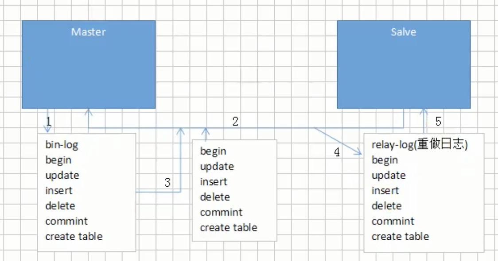

# MySQL架构

## MySQL处理流程

1. 客户端和服务端通过TCP/IP协议进行连接，发送sql语句给服务端，
2. 首先进入**查询缓存**，sql会经过hash算法得到hash值，然后转换为key，
   当前sql的key与缓存中的key进行比较，如果存在，直接返回给客户端
3. 对于不存在的key的sql进入**解析器**，用来分析是否存在关键字拼写错误/执行顺序错误，
   如果存在直接返回，否则进入通过`解析树`这种数据结构，对sql进行拆分,之后进入**预处理器**
   检查数据库中的表列是否存在（比如说from test123，但是test123不存在，只存在test）
   检查语句是否存在歧义（比如说sql注入问题），之后会产生一个新的解析树
4. 自己写的sql，mysql会使用自带的查询优化器进行优化
5. 优化完成之后生成一个执行计划，执行计划就会查看这次sql语句所在表使用了什么引擎
6. 之后把结果返回给客户端，然后将结果缓存到**查询缓存**中

## MySQL数据库分层设计

一、连接层

主要是提供与客户端的连接服务
包含本地的sock通讯还有TCP/IP的通讯，在连接层主要有：
连接处理、授权认证、以及相关的安全方案。
每个客户端在连接服务端的时候，服务端都会创建一个独有的线程，每次连接的查询就会在这个线程中进行
服务端会负责缓存线程，就不需要每次连接都要创建线程和销毁线程了。
使用了安全套接字ssl的方式连接，一旦连接成功后，服务器也会继续验证客户端是否具有执行某个特定查询的权限

二、服务层

提供各种用户使用的接口，如查询语句等

三、存储引擎层

存储引擎主要是负责mysql数据的存储和提取。

### 为什么分层设计

这么做的好处就是规定了各层的功能那个，出现什么问题就去找各层的问题。大大减少了工作量。

### SQL层的执行流程

sql语句--》缓存查询（`sql8.0之后省了这一步`）--》解析器--》优化器--》执行器

## sql语句执行流程

### 一条sql语句的执行过程

1. `连接Mysql`
   客户端连接MySql服务时是半双工通信，
   客户端和服务端交互发送数据时必须一次发送完毕，
   在传输特别大的数据包时系统性能开销非常大，
   所以当客户端使用insert等语句发送大量的数据包时服务端就会拒绝连接，
   原因是服务端默认限制客户端发送的数据包大小不能超过4MB，
   这点可以通过修改MySql参数来更改大小限制，
   或者将需要发送的数据包在客户端进行分批发送处理。
   同理，在服务端返回给客户端数据时也要避免大量的数据包传输，
   所以要避免使用不带Limit的查询语句进行批量查询，
   或者可以先使用count做数据量预估，根据数据量进行分批查询。
2. `缓存与解析器`
   当缓存是打开的情况下，MySql服务端拿到Sql语句后，
   首先会到缓存判断是否有完全一致
   的Sql语句查询记录（判断时Sql语句连空格都不能有误差），
   有就将相应的结果集返回给客户端，
   当缓存中不存在时，会将Sql语句交给解析器来处理，
   解析器通过关键字将SQL语句进行解析，并生成一棵对应的“解析树”，
   接着会验证Sql语句是否有词法、语法等错误，
   例如，它将验证是否使用错误的关键字，
   或者使用关键字的顺序是否正确等，
   再或者它还会验证引号是否能前后正确匹配。
3. `预处理器（Preprocessor）`
   预处理器会对解析树行进一步检查解析树是否合法，
   例如，这里将检查数据表和数据列是否存在，
   还会解析名字和别名，
   看看它们是否有歧义。
   接着预处理器会验证权限。
   这通常很快，除非服务器上有非常多的权限配置。
4. `优化器（查询优化器 Query Optimizer）`
   一条Sql语句并不是只有一种执行路径。
   当优化器拿到预处理器发来的解析树后，
   会根据解析树生成不同的执行路径，
   这些执行路径就是常说的执行计划（Execution Plan），
   优化器会对这些执行计划计算对应的开销（cost），
   当得到不同的执行计划与相应的开销后，
   优化器将它认为最佳的执行计划去交给下一个部件去执行
5. `查询执行引擎`
   当优化器将执行计划交到查询执行引擎手里时，
   剩下的任务就简单多了，
   查询执行引擎调用相应的API接口来操作存储引擎，
   将存储引擎返回的查询结果返回给客户端，
   如果缓存开启的情况也会在缓存中进行缓存。
6. `存储引擎`
   存储引擎就有很多了，像Mysql5.5版本前默认使用的MyIsan存储引擎，
   5.5版本后默认使用的InnoDB存储引擎，

### 一条sql更新/删除/增加语句时怎么执行的。

1.执行器先取到ID=2这行。因为ID是主键，引擎直接用树搜索找到这一行。
  如果ID=2这一行所在的数据页本来就在内存中，
  就直接返回给执行器。
  否则需要先从磁盘读入内存，然后再返回。
2.执行器拿到引擎给的行数据，把这个值加1，
  比如原来N，现在是N+1，得到新的一行数据，
  再调用引擎接口写入这行数据。
3.引擎将这行新数据更新到内存中，
  同时将这个`更新/删除/增加`操作记录在redo log里面，
  此时redo log处于prepare状态。
  然后告知执行器执行完成了，随时可以提交事务。
4.执行器生成这个操作的binlog，并把binlog写入磁盘中。
5.执行器调用引擎的提交事务接口，
  引擎把刚刚写入的redo log改成提交（commit）状态，
  更新完成。

## 存储引擎

### 概念

不同的数据文件在物理磁盘上的不同的组织形式

mysql默认的存储引擎是innodb

### 分类

1. MyISAM
2. InnoDB
3. Memory

#### InnoDB（补充与修改）

实现了四个标准的隔离级别，
默认级别是可重复读（REPEATABLE READ）。在可重复读隔离级别下，
通过多版本并发控制（MVCC）+ Next-Key Locking 防止幻影读。

主索引是聚集索引，在索引中保存了数据，从而避免直接读取磁盘，
因此对查询性能有很大的提升。其次是聚集索引每个叶子节点按照主键id从小到大顺序存储了大量数据行，
而每个叶子节点在实现上是一个内存页，磁盘IO读取时是读取一个内存页，
会进行一定的预读，所以在进行范围查找时，InnoDB引擎效率更高，
而MyISAM则需要对查找范围内所有数据行进行随机读取。(每条数据都是存储在不同地址上)

内部做了很多优化，包括从磁盘读取数据时采用的可预测性读、
能够加快读操作并且自动创建的自适应哈希索引、
能够加速插入操作的插入缓冲区等。

支持真正的在线热备份。其它存储引擎不支持在线热备份，
要获取一致性视图需要停止对所有表的写入，而在读写混合场景中，
停止写入可能也意味着停止读取。

#### MyISAM（补充修改）

myisam主要是通过格式文件（表结构定义），数据文件（存储的内容），索引文件（存储上的索引），
这三个文件来表示每个表
myisam的优势就在于可被转换为压缩、只读表来节省空间

MyISA索引的实现主要依赖B+树

MyISAM 中索引检索的算法为首先按照 B+Tree 搜索算法搜索索引，
如果指定的 Key 存在，则取出其 data 域的值，
然后以 data 域的值为地址，读取相应数据记录。

1）主键索引：
   MyISAM引擎使用B+Tree作为索引结构，叶节点的data域存放的是数据记录的地址
2）辅助索引：
    在 MyISAM中，主索引和辅助索引在结构上没有任何区别，只是主索引要求key是唯一的，
    而辅助索引的key可以重复。

#### MySQL存储引擎MyISAM与InnoDB区别

1、MyISAM是非事务安全的，而InnoDB是事务安全的
2、MyISAM锁的粒度是表级的，而 InnoDB支持行级锁、表锁，但是默认是行锁
4、MylSAM相对简单，效率上要优于InnoDB，小型应用可以考虑使用MyISAM
5、MyISAM表保存成文件形式，跨平台使用更加方便
7、InnoDB用于事务处理，具有ACID事务支持等特性，如果在应用中执行大量 insert 和update操作，可选择。
8、InnoDB支持外键（从A表一个列（外键）去检索B表的主键）
9、MyISAM一般是非聚集索引，InnoDB是聚集索引

### 引擎与锁的关联

MyISAM采用表级锁(table-level locking)。
InnoDB支持行级锁(row-level locking)和表级锁,默认为行级锁


# 数据存储过程

创建数据库---》确定字段---》创建数据表---》插入数据

## 为什么不直接创建数据表，还需要创建数据库呢？

1. 首先从架构层次来说，数据库分为了
   数据库服务器、数据库、数据表、数据表的行和列
   由于安装的时候直接安装了数据库服务器，所以，就直接从数据库开始就可以了

2. 数据库是mysql里面的最大存储单元，没有数据库作为载体，数据表也就不复存在了。

# 数据存储过程---数据库的创建

```sql
create database xxx；
```

## 数据库内置种类

1. xxx：这个是我们通过自己的sql语句创建的
2. infromation_schema:自带数据库，
3. 其余的

## 数据库的存储结构

数据库是以`页`进行存储的

### 行、页、区、段、表的关系

表中包含了一个或者多个段，

一个段包含了一个或者多个区

一个区包含了多个页

一个页包含了多个行

### 页

# 数据存储过程---确定字段

理解字段是什么？字段就是一列，列肯定是要有数据类型的

## 字段的数据类型

整数类型：TINYINT、SMALLINT、MEDIUMINT、INT、BIGINT
浮点数类型：FLOAT、DOUBLE
定点数类型：DECIMAL
字符串类型：VARCHAR、CHAR、TEXT、ENUM、SET
日期类型：Date、DateTime、TimeStamp、Time、Year

### 整数类型的选取标准

1. 数据不会超过范围的的可靠性
2. 考虑存储空间
   
比如说某个数据我采用了smallint，但是数据量在不断变大，
一旦超过范围，就会出现出现系统崩溃问题，那么就得不偿失了

### 无符号浮点数类型为什么范围比有符号浮点数类型小？

MySQL是按照符号、尾数、阶码进行存储浮点数的

### 浮点类型为什么不精准？

浮点类型主要是采用二进制的方式进行存储，比如说9.625，是1001.101
但是如果尾数不是0或者5，无法用一个二进制精确表达，只能在取值的
允许范围内近似得到

定点型主要是因为他把十进制的整数部分和小数部分进行了分割，
分别转换为十六进制进行存储

### char类型与varchar类型的区别？

1. char类型是定长的，在内部存储时实际使用长度较短时会在右边用空格填充，
   所以插入的数据如果右边有空格会自动截断，因为没有办法知道是自带的还是填充的。
   对英文字符（ASCII）占用1个字节，对一个汉字占用两个字节。
   适合每行数据的长度比较平均的情况，否则会造成存储空间的浪费。

2. varchar类型是不定长的，有一个字节用来存储长度(当长度大于255时，使用两个字节来存储长度)，
   内部存储时，使用多少长度，内存中就占用多少长度，不会有空余，所以比较节省空间。
   varchar的存储方式是，对每个英文字符占用2个字节，汉字也占用2个字节。
   效率上其实varchar会好一点

###  int(5)这个5代表什么？

表示如果数值宽度小于5位，mysql会自动补0填满宽度，保证总宽度为5位。

### varchar(50)中50的涵义

varchar(50)中50的涵义最多存放50个字符


# 数据存储过程---创建数据表

```sql
create table xxx
(
   barcode text,
   goodname text,
   price int
);
```
## 数据表结构

```sql
desc xxx;
```

### 数据表常用字段

1. type：字段类型
2. null：这个字段可不可以为空值----mysql空值和空字符串是不一样的
3. key：键---很多类型的键
4. default：默认值
5. extra：额外信息

## 约束

1. 主键约束----primary key
2. 唯一性约束--unique
3. 外键约束---foreign key
4. 非空约束---not null
5. 自增约束---Auto_increment

### union和unionall的区别是什么？

1. union就是将两个SELECT语句查询的结果集合并(两个SELECT可以是同一个表，也可以是不同表)，
   如果需要排序，在第二个SELECT语句后加ORDER BY语句，会对所有结果进行排序。

2. union默认是会去除重复的数据的，会对结果集做去重处理，union all不会做去重处理。
   所以union效率慢一些，如果能确定结果不会重复或者需要不去重的结果，
   那么应该使用union all，效率会高一些。

### 字段为什么要求定义为not null?

null值会占用更多的字节,且会在程序中造成很多与预期不符的情况

## CRUD（运行关键字）

1. from:需要从哪个数据表检索数据
2. join：联合多表查询返回记录时，并生成一张临时表
3. on：在生成临时表时使用的条件
4. where:过滤表中数据的条件
5. group by:如何将上面过滤出的数据分组
6. having:对上面已经分组的数据进行过滤的条件
7. select:查看结果集中的哪个列，或列的计算结果
8. order by:按照什么样的顺序来查看返回的数据
9. limit:限制查询结果返回的数量

### change与modify区别

1. change是修改字段
2. modify是修改字段类型的

### where和having区别

1. where的效率要高于having
   主要是因为where可以先进行筛选，筛选完成后用一个筛选后较小的数据集和关联表进行连接，
   这样占用的资源比较小
   having是先把数据集准备好，然后进行筛选

2. where不能使用分组中的计算函数作为筛选条件，
   主要是因为where是在group by的前面
   比如说哪个收银员在哪天卖了2单商品，如果用group by的话，我就直接可以使用分组函数了

### on和where的区别

1. on的条件是在连接生成临时表时使用的条件,以左表为基准 ,不管on中的条件真否,都会返回左表中的记录
2. where条件是在临时表生成好后,再对临时表过滤。
   此时和left join有区别(返回左表全部记录),条件不为真就全部过滤掉,on后的条件来生成左右表关联的临时表,
   where后的条件是生成临时表后对临时表过滤

### exits 和in，join的区别是什么？

exists是拿外表作为驱动表，外表的数据做循环，每次循环去内表中查询数据，使用适内表比较大的情况
例如select * from t1 where t1.tid exists (select t2.tid from t2)

in的话正好相反，是那内表作为驱动表，内表的数据做循环，每次循环去外表查询数据，适合内表比较小的情况。

join的实现其实是先从一个表中找出所有行（或者根据where子句查出符号条件的行)，
然后去下一个表中循环寻找匹配的行，依次下去，直到找到所有匹配的行，
使用join不会去创建临时表，使用in的话会创建临时表，销毁临时表

三折的关键的点在关联表的顺序，如果是join连接查询，MySQL会自动调整表之间的关联顺序，
选择最好的一种关联方式。如果能够实现小表驱动大表是最好的选择。

### groupby和having的区别

1. 通过使用GROUP BY 子句，比如说可以让SUM和 COUNT 这些函数对属于一组的数据起作用。
   当你指定 GROUP BY A 时，表中所有除A(地区)外的字段，只能通过 SUM, COUNT等聚合函数运算后返回一个值。

2. HAVING子句可以让我们筛选成组后的各组数据，WHERE子句在聚合前先筛选记录.
   也就是说作用在GROUP BY 子句和HAVING子句前.
   而 HAVING子句在聚合后对组记录进行筛选。

### group by注意事项

1、group by函数通常联合分组函数(sum,avg,max,min,count)进行使用，
   而且分组函数是在group by执行结束后才执行的。
2、在进行分组的时候select后面跟的字段最好是分组函数或者group by后面跟的那个字段。
3、group by有一个原则，就是select后面所有的列中，没有使用聚合函数的列，必须出现在group by子句中。


## 键

1. 主键：一个数据列只能有一个主键，且主键的取值不能缺失，
        即不能为空值（Null）
2. 超键：一个属性可以为作为一个超键，
        多个属性组合在一起也可以作为一个超键。超键包含候选键和主键。
3. 候选键：是最小超键，即没有冗余元素的超键。
4. 外键：比如说有两张表，通过一个共同的字段id进行关联，id在表b中就是一个外键了
        外键就是让从表引来主表数据的一个公共字段

### 哪些不能做主键

1. 与业务字段相关的字段---比如说会员卡不用了，但是卡号给了两外一个人
2. 自增字段做主键----多机联合使用

### 为什么用自增列作为主键

如果表使用自增主键，那么每次插入新的记录，
记录就会顺序添加到当前索引节点的后续位置，
当一页写满，就会自动开辟一个新的页
如果使用非自增主键，由于每次插入主键的值近似于随机，
因此每次新纪录都要被插到现有索引页得中间某个位置，
此时MySQL不得不为了将新记录插到合适位置而移动数据，
甚至目标页面可能已经被回写到磁盘上而从缓存中清掉，
此时又要从磁盘上读回来，这增加了很多开销，
同时频繁的移动、分页操作造成了大量的碎片，
得到了不够紧凑的索引结构，
后续不得不通过OPTIMIZE TABLE来重建表并优化填充页面。

### 主键使用自增ID还是UUID?

推荐使用自增ID,不要使用UUID.

因为在InnoDB存储引擎中,主键索引是作为聚簇索引存在的,
也就是说,主键索引的B+树叶子节点上存储了
主键索引以及全部的数据(按照顺序),
如果主键索引是自增ID,
那么只需要不断向后排列即可,
如果是UUID,由于到来的ID与原来的大小不确定,
会造成非常多的数据插入,数据移动,
然后导致产生很多的内存碎片,
进而造成插入性能的下降.

#### 自增id的缺点

①别人一旦爬取你的数据库,就可以根据数据库的自增id获取到你的业务增长信息，
 很容易分析出你的经营情况
②对于高并发的负载，innodb在按主键进行插入的时候会造成明显的锁争用，
  主键的上界会成为争抢的热点，因为所有的插入都发生在这里，并发插入会导致间隙锁竞争
③Auto_Increment（自增）锁机制，会造成自增锁的抢夺,有一定的性能损失

### MySQL不推荐使用uuid或者雪花id作为主键？

自增的主键的值是顺序的,所以Innodb把每一条记录都存储在一条记录的后面。

当达到页面的最大填充因子时候：

①下一条记录就会写入新的页中，一旦数据按照这种顺序的方式加载，
主键页就会近乎于顺序的记录填满，提升了页面的最大填充率，不会有页的浪费

②新插入的行一定会在原有的最大数据行下一行,mysql定位和寻址很快，
不会为计算新行的位置而做出额外的消耗

③减少了页分裂和碎片的产生，因为uuid相对顺序的自增id来说是毫无规律可言的,
新行的值不一定要比之前的主键的值要大,所以innodb无法做到总是把新行插入到索引的最后,
而是需要为新行寻找新的合适的位置从而来分配新的空间。这个过程需要做很多额外的操作，
数据的毫无顺序会导致数据分布散乱，将会导致一些问题：
比如说
①写入的目标页很可能已经刷新到磁盘上并且从缓存上移除，或者还没有被加载到缓存中，
innodb在插入之前不得不先找到，并从磁盘读取目标页到内存中，将导致大量的随机IO

②因为写入是乱序的,innodb不得不频繁的做页分裂操作,以便为新的行分配空间,页分裂导致移动大量的数据，
一次插入最少需要修改三个页以上

③由于频繁的页分裂，页会变得稀疏并被不规则的填充，最终会导致数据会有碎片
在把随机值（uuid和雪花id）载入到聚簇索引(innodb默认的索引类型)以后,
有时候会需要做一次OPTIMEIZE TABLE来重建表并优化页的填充，这将又需要一定的时间消耗。


## 关联查询（join）

### 关联查询的概念

如果不考虑多并发状态的话
首先要进行外键约束，然后进行关联才可以查询得到

#### 关联查询一定要在外键约束的基础上进行呢？

也不是必须的，但是如果有了外键约束，避免出现误删的情况，提高系统的可靠性

比如说之前遇到的问题，

我有两张表，一个是单头表数据，一个是单明细表数据，如果我先插入数据到单明细表，
会造成mysql找不到参照的主表信息，会提示错误

#### 为什么mysql里，没有外键约束也可以进行关联查询？

因为外键约束是有成本的，需要消耗资源，对于大型网站的中央数据库，
可能会因为外键约束的系统开销变得非常慢
一般在应用层面完成数据一致性的逻辑就可以了

#### 如果说我在表里真的找不到怎么办

那就自己创建呗

```sql
alert table xxx
add column number int primary key auto_increment;
```

### 分类

主要有两种连接

1. 内连接：只返回符合连接条件的记录

2. 外连接：查询结果值返回某一个表中的所有数据 + 另一个表中符合条件的数据
   1. 左连接：返回左表中所有记录 + 右表中符合条件的记录
   2. 右连接

### join原理

比如说a join b
通过a表的结果集作为循环基础，一条条的通过结果集中的数据作为过滤条件到下一个表中的数据，然后合并结果

[join优化](#join优化)

## SQL函数

### -1:时间函数

1. extract（type from time）从time时间里提取哪个时间
2. second/minute/hour/day/month/year
3. date_add(date,interval 表达式 type)/adddate
             从date时间点开始，向前或者向后一段时间间隔的时间
4. last_day(date) 获取date所在月份的最后一天

### -2:数学函数

1. 取整函数
   1. floor  向下取整
   2. ceil   向上取整
   3. round  四舍五入
2. 绝对值函数
   1. abs
3. 求余函数
   1. mod

### -3:字符串函数

1. 拼接
   - concat（s1，s2...）
2. 转换
   cast(表达式 as char)
3. 获取长度
   char_length(字符串)
   space(n)

### -4:条件判断函数

1. ifnull(v1,v2)
2. if(表达式，v1，v2)

### truncate、 delete区别

1、TRUNCATE在各种表上无论是大的还是小的都非常快。
   如果有ROLLBACK命令DELETE将被撤销，而TRUNCATE则不会被撤销。
2、truncate不能进行回滚操作。
3、truncate不触发任何delete触发器。
4、当表被truncate后，这个表和索引所占用的空间会恢复到初始大小，
   而delete操作不会减少表或索引所占用的空间。
5、不能truncate一个带有外键的表，如果要删除首先要取消外键，然后再删除。
    DELETE语句执行删除的过程是每次从表中删除一行，
    并且同时将该行的的删除操作作为事务记录
    在日志中保存以便进行进行回滚操作。

## 聚合函数

1. sum（）
2. avg（）
3. max（）
4. min（）
5. count（）---注意的是只计算非空的值
   - count（*）  统计一共有多少条记录
   - count（字段）统计有多少个不为空的字段

### count(*)、count(1)、count(column)的区别

count(*)对行的数目进行计算,
包含NULL，
count(1)这个用法和count(*)的结果是一样的
count(column)对特定的列的值具有的行数进行计算,不包含NULL值。

## 事务

### 事物概念

事务是逻辑上的⼀组操作，要么都执⾏，要么都不执⾏。

#### 事务只是确保要么执行，要么不执行

如果遇到错误，是失败还是回滚，程序员决定

### 创建事务

```java
set autocommit = 0；
start transaction
DML语句
commit/rollback  二选一
```

### 事务特性（四大特征）

1. 原⼦性（Atomicity）：事务是最⼩的执⾏单位，
                       不允许分割。事务的原⼦性确保动作要么全部完成，
                       要么完全不起作⽤；
2. ⼀致性（Consistency）： 执⾏事务前后，数据保持⼀致，
                          多个事务对同⼀个数据读取的结果是相同的；
3. 隔离性（Isolation）： 并发访问数据库时，
                       ⼀个⽤户的事务不被其他事务所⼲扰，
                       各并发事务之间数据库是独⽴的；
4. 持久性（Durability）： ⼀个事务被提交之后。
                         它对数据库中数据的改变是持久的，
                         即使数据库发⽣故障也不应该对其有任何影响。

#### 事务四大特征的底层原理

`A原子性`由undo log日志保证，
         它记录了需要回滚的日志信息，
         事务回滚时撤销已经执行成功的sql
`C一致性`一般由代码层面来保证
`I隔离性`由MVCC来保证
`D持久性`由内存+redo log来保证，
         mysql修改数据同时在内存和redo log记录这次操作，
         事务提交的时候通过redo log刷盘，
         宕机的时候可以从redo log恢复

#### 题外话----Java如何保证原子性

1. 第一个方法是循环CAS
   只能保证一个共享变量的原子操作。
   当对一个共享变量执行操作时，
   我们可以使用循环CAS的方式来保证原子操作，
   但是对多个共享变量操作时，
   循环CAS就无法保证操作的原子性，这个时候就可以用锁
   或者有一个取巧的办法，
   就是把多个共享变量合并成一个共享变量来操作。
   比如有两个共享变量i＝2,j=a，合并一下ij=2a，然后用CAS来操作ij
2. 锁
   锁机制保证了只有获得锁的线程能够操作锁定的内存区域。

### 事务的原子性---崩溃恢复机制

为了满足事务的原子性，在操作任何数据之前，
首先将数据备份到一个地方，这个存储数据备份的地方称为UndoLog。
然后进行数据的修改。
如果出现了错误或者用户执行了回滚，
系统可以利用Undo Log中的备份将数据恢复到事务开始之前的状态。

### 事务隔离性---并发带来什么问题（多事务访问相同数据库）

1. 脏读---针对更新（本来有）
    a读取了b更新但是还有没有提交的数据，如果b回滚，a数据就是无效的
2. 不可重复读
    a读取了一个字段，b后来有更新了这个字段，a再次读取，值不一样了
    假如A在取款事务的过程中，B往该账户转账100，A两次读取的余额发生不一致。
3. 幻读---针对插入（根本没有）
    a读取一个表中的一个字段，b往表中插入了一些新数据，a再次读取，发现多出了几行数据
4. 第一类丢失更新
    A事务撤销时，把已经提交的B事务的更新数据覆盖了。
5. 第二类丢失更新
    A事务覆盖B事务已经提交的数据，造成B事务所做的操作丢失 。

#### 不可重复读和幻读的区别

不可重复读是指读到了已经提交的事务的更改数据（修改或删除），
幻读是指读到了其他已经提交事务的新增数据。
对于这两种问题解决采用不同的办法，
防止读到更改数据，只需对操作的数据添加行级锁，
防止操作中的数据发生变化；
二防止读到新增数据，往往需要添加表级锁，
将整张表锁定，防止新增数据（oracle采用多版本数据的方式实现）。

#### 幻读解决方案

因为读的时候有快照读和实时读两种，所以

1. 针对于快照读
   由于读取的数据都是事务开始时的数据，所以可以采用MVCC解决（见下一节）

2. 针对实时读
   我们可以在实时读取的数据中申请共享锁/排他锁，
   并且读的时候会加入next-key lock锁住这个查询范围内的所有数据了，
   这样你就无法插入数据了。

### 事务隔离级别---并发问题解决方案

#### 为什么要有事务隔离级别

因为事物隔离级别越高，在并发下会产生的问题就越少，
但同时付出的性能消耗也将越大，
因此很多时候必须在并发性和性能之间做一个权衡。
所以设立了几种事物隔离级别，
以便让不同的项目可以根据自己项目的
并发情况选择合适的事物隔离级别，
对于在事物隔离级别之外会产生的并发问题，在代码中做补偿。

#### 事务隔离级别

1. 读取未提交(RU)：最低的隔离级别，允许读取尚未提交的数据变更， 
                 可能会导致脏读、幻读或不可重复读
2. 读取已提交(RC)：允许读取并发事务已经提交的数据， 可以阻⽌脏读，
                 但是幻读或不可重复读仍有可能发⽣。
      - 读是不加锁的，写，更新，删除是加锁的，如果更新的行是可以通过索引查找到，
        那么是对这些行加行锁，否则会将所有行都加锁，然后返回给MySQL Server，
        让他来进行过滤，对于不满足条件的行解锁。
      - 幻读是会发生的，就是事务A在读取和写入符合的条件的记录时，
        其他事务又插入了一条符合条件的记录，
        此时事务A二次读取时会产生幻行，一般发生在INSERT操作。
3. 可重复读(RR)：对同⼀字段的多次读取结果都是⼀致的，除⾮数据是被本身事务⾃⼰所修改， 
               可以阻⽌脏读和不可重复读，但幻读仍有可能发⽣。
      - MySQL在可重复读的隔离级别下，通过MVCC机制和Next-key Lock解决了幻读的问题。

4. 可串⾏化(S)：   最⾼的隔离级别，
                 该级别可以防⽌脏读、不可重复读以及幻读。


##### RC（读已提交）和RR（可重复读）隔离级别的区别

1. RR支持gap lock，而RC则没有gap lock（间隙锁）。
   因为MySQL的RR需要gap lock来解决幻读问题。
   而RC隔离级别则是允许存在不可重复读和幻读的。所以RC的并发一般要好于RR；
2. RC 隔离级别，通过 where 条件过滤之后，不符合条件的记录上的行锁，
   会释放掉；但是RR隔离级别，即使不符合where条件的记录，
   也不会是否行锁和gap lock；所以从锁方面来看，RC的并发应该要好于RR；
3. RC 隔离级别不支持 statement 格式的bin log，
   因为该格式的复制，会导致主从数据的不一致；
   只能使用 mixed 或者 row 格式的bin log
4. RC隔离级别时，事务中的每一条select语句会读取到他自己执行时已经提交了的记录，
   而RR隔离级别时，事务中的一致性读的是以第一条select语句的运行时，
   作为本事务的一致性读的建立时间点的。只能读取该时间点之前已经提交的数据
5. RC隔离级别下的update语句，
   使用的是半一致性读(semi consistent)；
   而RR隔离级别的update语句使用的是当前读；当前读会发生锁的阻塞

#### 事务隔离级别的原理

1. READ_UNCOMMITED（`读取未提交`） 的原理
   - *事务对当前被读取的数据不加锁；*
   - `事务在更新某数据的瞬间（就是发生更新的瞬间），`
     `必须先对其加行级共享锁，直到事务结束才释放。`
2. READ_COMMITED(`读取已提交`)的原理
   - *事务对当前被读取的数据加 行级共享锁（当读到时才加锁），一旦读完该行，立即释放该行级共享锁；*
   - `事务在更新某数据的瞬间（就是发生更新的瞬间），必须先对其加 行级排他锁，直到事务结束才释放。`
3. REPEATABLE READ 的原理:
   - *事务在读取某数据的瞬间（就是开始读取的瞬间），必须先对其加 行级共享锁，直到事务结束才释放；*
   - `事务在更新某数据的瞬间（就是发生更新的瞬间），必须先对其加 行级排他锁，直到事务结束才释放。`
4. SERIALIZABLE 的原理:
   - *事务在读取数据时，必须先对其加 表级共享锁 ，直到事务结束才释放；*
   - `事务在更新数据时，必须先对其加 表级排他锁 ，直到事务结束才释放。`

#### MVCC

就是每一行数据中额外保存两个隐藏的列：

1. 插入或上次更新该行的事务ID
   (删除也被认为是一次更新，只不过在代表删除的更新操作中，
   行中的特殊位被设置为将其标记为已删除。
   这个事务ID可以认为是数据行的修改版本号。)

2. 回滚指针(指向undo log中用于事务回滚的日志记录)。

主要流程，比如说，

1.插入操作
   每次开始事务时，会对系统版本号+1作为当前事务的版本号。
   插入数据后，将事务的版本号作为数据行的创建版本号。

2.删除操作
  在使用SQL语句删除行时，并不会立即将其从数据库中物理删除，
  只会将其标记为删除，并且修改更新该行的事务ID。
  （InnoDB只会在丢弃为删除而编写的undo log日志记录时，
  才物理删除相应的行及其索引记录。此删除操作称为purge，
  它非常快，通常花费与执行删除操作的SQL语句相同的时间顺序。）

4.或更新操作
  将当前的事务版本号作为数据行的更新版本号。

5.查询操作
  数据行要被查询出来必须满足两个条件，
  数据行没有标记为删除或者标记为删除
  但是删除的事务ID>当前事务ID的数据（否则数据已经被标记删除了)
  更新事务ID<=当前事务ID的数据（否则数据是后面的事务创建出来的，
  或者是被修改过的，那么需要去undo log中找上次的快照数据。）
  如果查询时，该行数据被加了X锁，那么读数据的事务不会进行等待，
  而是会根据该行数据中的回滚指针undo log日志中读之前版本的数据
  （这里存储的数据本身是用于回滚的），在可重复读的隔离级别下，
  从undo log中读取的数据总是事务开始时的快照数据
  (也就是版本号小于当前事务id的数据)，
  在提交读的隔离级别下，
  从undo log中读取的总是最新的快照数据。

## 事务隔离性带来的---锁

### 锁的概念

数据库锁出现的目的：处理并发问题
并发控制的主要采用的技术手段：乐观锁、悲观锁和时间戳。

### 锁的原理


### 锁的种类

1. 行锁
2. 表锁
3. 页锁

其中
**行锁**
   - 第一点：（概念）用于innodb引擎，并发最高，支持事物
   - 第二点：（转换）因为锁主要是加在索引上，对于非索引字段更新，行锁会升级为表锁
   - 第三点：（危害）动同一行数据/不存在的数据，在没有commit之前，另一个session会阻塞

**表锁**
   - 第一点：（概念）用于myisam引擎，并发最低
   - 第二点：（转换）
   - 第三点：（危害）

#### 行锁、表锁的实现

`第一种方式：`
只有明确的指定 主键 ，才会执行 行锁，否则执行 表锁

比如说，主键不明确或者主键不存在

```sql
SELECT * FROM products WHERE id=-1 FOR UPDATE; //主键不存在---直接无锁
SELECT * FROM products WHERE id LIKE '3' FOR UPDATE;//主键不明确---直接表锁
SELECT * FROM products WHERE name='Mouse' FOR UPDATE;
```

`第二种方式：`

lock table 表名字 read/write，表名字2 read/write；

### 锁算法（锁机制）

#### 行锁算法

1. 普通行锁（Record lock）
   在范围之内的数据，并且存在，就用普通行锁
2. 间隙锁
   在范围之内的数据，不存在，加间隙锁
3. 普通行锁+间隙锁（next-key lock）
   在范围之内，存在加普通行锁，不存在加间隙锁

比如说id只有1-101，对id〉100的加锁，

```sql
select * from  user where user_id > 100 for update;
```

##### 间隙

如果我们使用的是范围查询(a > 1 and a <6 ),并且请求共享或者排他锁的时候
innodb会给符合的数据记录的索引项加锁（不管存在不存在都加锁），
对于范围内的也就是a > 1 and a <6不存在的记录，叫做间隙

#### 表锁算法

1. 意向锁
   当一个事物带着表锁，去访问一个加入行锁的资源，行锁会升级为意向锁
```sql
事务A---表锁
select * from xxx where name = "kkkk" for update;
事务B---行锁
 select * from xxx where id = 1;
事务A去访问事务B
```

2. 自增锁
   事物插入自增类型的列可以获取

### 锁升级的情况

1. 给非索引的字段更新操作，行锁变为表锁
2. 没有明确指定主键，行锁变为表锁
3. 当一个事物带着表锁，去访问一个加入行锁的资源，行锁会升级为意向锁

### 锁的实现

1. 共享锁
2. 排他锁

**共享锁**

  - 第一点：（实现方式）select 。。。 lock in share mode

**排他锁**

  - 第一点：（实现方式）select 。。。 for update
                     update
                     delete
                     insert

### 乐观锁

每次去拿数据的时候都认为别人不会修改，所以，不会上锁。
但是在更新的时候会判断一下在此期间别人有没有更新这个数据，

#### 乐观锁的实现方式---修改

1. 版本号
2. 时间戳
3. 所有字段/待更新的字段

**版本号**

第一：操作方式----update tab set name = 'xxx' where id = 1 and version = xxx
第二：原理：表中增加一个version字段，每次更新把这个字段加1，
          读取数据的时候把version读出来，更新的时候比较version，

**时间戳**

**字段**

#### 乐观锁实现方式区别---修改

### 悲观锁

每次去拿数据的时候都认为别人会修改，
所以每次在拿数据的时候都会上锁，
这样别人拿这个数据就会block（阻塞），
直到它拿锁别人才可以不阻塞。

共享锁 & 排它锁都是悲观锁的具象实现，显示地控制行或表锁属于悲观锁

### 死锁

#### 死锁概念

两个或者多个事务在同一资源上相互占用，请请求锁定对方占用的资源

比如说，

事务a
 update money set jinzhang = 45 where date =‘2021-9-8’
 update money set jinzhang = 25 where date =‘2021-9-7’

事务b
 update money set jinzhang = 25 where date =‘2021-9-8’
 update money set jinzhang = 45 where date =‘2021-9-7’

如果事务a和事务b同时执行第一条语句，那么也就锁定了该行数据，那么在执行第二条的时候，
执行不下去了，被锁住了，就只能被批等待

#### 死锁必备条件---修改

#### 死锁的预防与解除

1. 应尽可能缩短事务。在同一DB中并发执行多个需要长时间运行的事务时，
   发生死锁的概率较大。事务运行时间越长，持有排它锁的时间便越长，
   从而堵塞了其它活动并可能导致死锁。保持事务在一个批处理中，
   可以最小化事务的网络通信往返量，减少完成事务可能的延迟并释放锁。
   同时，涉及多个表的查询更新操作，若比较耗时，尽量不要放在一个事务内处理，
   能分割便分割。若不能分割，便尽可能使之在业务量较小的时间
   例如子夜或者午餐时间执行。
2. 应按同一顺序访问数据对象。如果所有并发事务按同一顺序访问对象，
   则发生死锁的可能性会降低。例如，如果两个并发事务获得Supplier表上的锁，
   然后获得Part表上的锁，则在其中一个事务完成之前，另一个事务被阻塞在Supplier表上。
   第一个事务提交或回滚后，第二个事务继续进行。不发生死锁。
   将存储过程用于所有的数据修改可以标准化访问对象的顺序。
3. 必须避免编写包含用户交互的事务。因为运行没有用户交互的批处理的速度要
   远远快于用户手动响应查询的速度，若用户不能及时反馈，则此事务将挂起。
   因而将严重降低系统的吞吐量，因为事务持有的任何锁只有在事务提交或回滚时才会释放。
   即使不出现死锁的情况，访问同一资源的其它事务也会被阻塞，等待该事务完成。
4. 可使用低隔离级别。确定事务是否能在更低的隔离级别上运行。
   执行提交读允许事务读取另一个事务已读取（未修改）的数据，
   而不必等待第一个事务完成。使用较低的隔离级别（例如提交读）
   而不使用较高的隔离级别（例如可串行读）可以缩短持有共享锁的时间，从而降低了锁定争夺。
5. 可考虑体系结构的优化与代码重构，提高系统整体的运行效率。
   例如尽可能不采用效率低下的计算模型，复杂的业务应采用异步任务调度处理。
6. 可通过程序控制事务提交的时机。如果一次检索出了10万条记录但只更改了其中的100条，
   就可以通过代码来执行100个update。或是用分段提交，即所有的修改使用多个事务进行提交，
   但这样会使事务不完整，应酌情使用。
7. 宜将经常更新的数据库和查询数据库分开。定期将不改变的数据导入查询数据库中，
   这样查询和更新就可以分开进行，而降低死锁机率。
8. 在进行数据库模式设计时，应注意外键引用的完整性，并对外键加索引。
   如果更新了父表的主键，由于外键上没有索引，所以子表会被锁定；如果删除了父表中的一行，
   整个子表也会被锁定。

2.4---2.23---7月份三片文章

## 事务原子性带来的---日志

### 什么是日志

### 日志的种类

1. 回滚日志（undo log）
2. 重做日志（redo log）
3. 二进制日志（binlog）
4. 错误日志（error log）
5. 慢查询日志（slow query log）
6. 一般查询日志（general log）
7. 中继日志（relay log）

#### undo log 回滚日志

undo log，在数据库事务开始之前， 会把要修改的记录放在undo日志中，
当事务回滚或者数据库崩溃了，可以利用undo log撤销没有提交的事务恢复之前的某个状态

**undolog产生与销毁**
undo log产生于事务之前，在事务提交之后，undo log不会立即消除，innodb会将该事务对应的
undo log放入到删除列表中，后面会通过后台线程purge thread进行回收处理

undo log其实是记录了一个变化过程，比如说，执行一个delete，undolog会记录一个insert
执行一个update，undolog会记录一个相反的update

**undo log存储**
采用段的方式进行管理和记录，innodb包含了一个rollback segement回滚段
内部包含了1024个undolog segment。

##### undo log 的作用

1. 实现事务的原子性
   一旦出现错误或者回滚了，可以用undolog的备份将数据恢复到事务之间的状态

2. 实现多版本控制
   事务未提交之前，undolog保存了未提交之前的版本数据，
   undolog的数据可以作为数据旧版本快照供其他并发事务进行快照读
   比如说，我有两个事务，事务a是执行的update更新操作，事务b是执行的查询操作
   当事务a执行的时候，先把旧数据备份到undo bufferr，之后持久化到undo log
   然后进行更新操作，但是事务a没有提交数据，这个时候，
   此时事务b开始执行查询操作，事务b是读取undo buffer或者说undo log的数据

##### undo log缺陷

每个事务提交前将数据和Undo Log写入磁盘，这样会导致大量的磁盘IO，因此性能很低。
因此引入了另外一种机制来实现持久化，也就是Redo Log。
Redo Log记录的是新数据的备份。在事务提交前，只要将Redo Log持久化即可，
不需要将数据持久化。当系统崩溃时，虽然数据没有持久化，但是Redo Log已经
持久化。系统可以根据Redo Log的内容，将所有数据恢复到最新的状态。

#### redo log 重做日志

事务中修改任何的数据，都会将最新的数据备份存储的位置
比如说我某一个节点

**redo log的生成与释放**
随着事务操作的执行，就会生成redo log，事务提交的时候将产生的redolog写入logbuffer
等事务操作的脏页写入到磁盘后，redolog占用的空间就可以被覆盖重写了

##### redolog工作原理

比如说执行某个事务，事务执行了几个操作，我们就把事务的操作之后的新数据提交到redobuffer中
然后持久化到redolog，一旦数据发生丢失现象，就可以通过redolog进行恢复

###### redoBuffer持久化到redolog的策略

0：每秒从buffer池中提交数据到logBuffer，后台通过master主线程每隔一秒钟输出一次，
   通过操作系统的缓存到磁盘的日志文件中中
   缺陷是一旦数据库断电，logbuffer停止运作，那么这一秒钟的事务就会丢失

1：每次提交执行时，buffer池的数据会写入logbuffer，同时log日志也会提交到操作系统的缓存
   然后马上启动异步刷新操作，把数据从操作系统的缓存写入到日志文件中
   缺陷就是性能太低

2：每次提交执行logbuffer写入到操作系统缓存，然后后台master线程每隔一秒钟
   执行os cache--》读取磁盘文件的操作
   缺点时服务器挂掉了，那么数据就丢失了

##### redolog写入机制

redolog文件的内容是按照顺序循环的方式依次写入的，一旦写满我就回溯到第一个文件，
进行覆盖重写。redolog的写入机制是通过两个指针来实现的，
一个是write pos 记录当前的位置，一边写入数据一边往后移动，一旦写入数据到达文件的末尾就回到0号文件的开头
一个是checkpoint 记录当前要擦除的位置
一旦write pos追赶上了checkpoint，那么不再执行任何操作，等待擦除完成，write pos继续。

#### binlog 二进制日志

redolog是innodb引擎的特有日志，binlog是mysql server的日志，
它主要是用来记录所有的数据库表结构变更以及表数据修改的二进制日志，
主要是以事件形式记录

##### binlog的使用场景

1. 主从复制：主库开启binlog，主库就可以把数据传递给从库，从库就可以实现数据恢复了
2. 数据恢复

##### binlog文件记录模式

1. row
2. statement
3. mixed

**Row:不记录sql语句上下文相关信息，仅保存哪条记录被修改。**
`优点`：binlog中可以不记录执行的sql语句的上下文相关的信息，
       仅需要记录那一条记录被修改成什么了。
`缺点`：所有的执行的语句当记录到日志中的时候，都将以每行记录的修改来记录，
       这样可能会产生大量的日志内容。比如一条update语句，修改多条记录，
       则binlog中每一条修改都会有记录，这样造成binlog日志量会很大，
       特别是当执行alter table之类的语句的时候，由于表结构修改，每条记录都发生改变，
       那么该表每一条记录都会记录到日志中。
**Statement：每一条会修改数据的sql都会记录在binlog中。**
`优点`：不需要记录每一行的变化，减少了binlog日志量，节约了IO，提高性能。
        相比row能节约多少性能与日志量，这个取决于应用的SQL情况，
        正常同一条记录修改或者插入row格式所产生的
        日志量还小于Statement产生的日志量，但是考虑到如果带条件的update操作，
        以及整表删除，alter表等操作，ROW格式会产生大量日志，
        因此在考虑是否使用ROW格式日志时应该根据应用的实际情况，
        其所产生的日志量会增加多少，以及带来的IO性能问题。
`缺点`：由于记录的只是执行语句，为了这些语句能在slave上正确运行，
        因此还必须记录每条语句在执行的时候的一些相关信息，以保证所有语句能
        在slave得到和在master端执行时候相同的结果。
**Mixedlevel: 以上两种level的混合使用。**
一般的语句修改使用statment格式保存binlog，如一些函数，statement无法完成主从复制的操作，
则采用row格式保存binlog,MySQL会根据执行的每一条具体的sql语句来区分对待记录的日志形式，
也就是在Statement和Row之间选择一种。

##### binlog文件结构

通过一种叫做log event的数据结构表示修改的操作，不同的修改操作对应着不同类型的log event
比如说 query event、row event等等
logevent的结构主要包含

1. 时间开始的时间  4字节
2. 指明事件的类型  1字节
3. server_id     1字节
4. 事件长度       4字节
5. next_log pos  4字节
6. flag          2字节
7. fixed part
8. variable part

##### binlog写入机制

首先根据记录模式和操作所触发的event事件封装成log event
然后将事务执行过程中产生的log event写入到缓冲区，每个事务线程都有一个缓冲区
   其中在这个缓冲区里保存了一个binlog_cache_mngr的数据结构，
   log event就保存在这个数据结构中，在这个结构里有两个缓冲区，
   一个是用于存放不支持事务的信息缓冲区
   一个是存放支持事务信息的
最后事务提交的阶段会将产生log event写入到外部binlog文件中
   不同的事务以串行方式将log event写入到binlog中

##### https://www.bilibili.com/video/BV1tN411Z7iJ?p=4 没有看操作

#### 慢查询日志。

MySQL中响应时间超过阀值的语句会被记录到慢查询日志中。

#### 区别

##### binlog、redolog的区别

1. `层次不同`
   redolog属于innodb引擎功能，binlog属于mysql server自带功能
2. `存储内容来说`
   binlog是逻辑日志，记录的是更新过程，比如说update/delete/insert这样的SQL语句，
   redo log是物理日志，记录的是数据页的更新状态内容，比如说xxxx页修改了xxx。
3. `大小`
   redolog日志是循环写的，日志空间大小固定，写完了就得覆盖写，undolog是追加写，
4. `功能`
   redo log的作用是宕机之后数据自动恢复使用。写完内存，如果数据库挂了，
   那我们可以通过redo log来恢复内存还没来得及刷到磁盘的数据，
   将redo log加载到内存里边，那内存就能恢复到挂掉之前的数据了。
   binlog的作用是复制和恢复而生的。主从服务器需要保持数据的一致性，
   通过binlog来同步数据。如果整个数据库的数据都被删除了，
   binlog存储着所有的数据变更情况，那么可以通过binlog来对数据进行恢复。
5. `第三方面来说，写入内容来说`
   redo log事务开始的时候，就开始记录每次的变更信息，而binlog是在事务提交的时候才记录。

##### 如何保证redo log和binlog的数据是一致的

MySQL通过两阶段提交来保证redo log和binlog的数据是一致的。
`阶段1：InnoDBredo log 写盘，InnoDB 事务进入 prepare 状态`
`阶段2：binlog 写盘，InooDB 事务进入 commit 状态`
每个事务binlog的末尾，会记录一个 XID event，
标志着事务是否提交成功，
也就是说，恢复过程中，
binlog 最后一个 XID event 之后的内容都应该被 purge。

### 两阶段提交。

“两阶段提交”是为了让两份日志之间的逻辑一致。
由于redo log和binlog是两个独立的逻辑，如果不用两阶段提交
会出现错误
比如说
`先写redo log后写binlog。`
假设在redo log写完，binlog还没有写完的时候，MySQL进程异常重启。redo log写完之后，
系统即使崩溃，仍然能够把数据恢复回来，所以恢复后这一行c的值是1。
但是由于binlog没写完就crash了，这时候binlog里面就没有记录这个语句。
因此，之后备份日志的时候，存起来的binlog里面就没有这条语句。
然后发现，如果需要用这个binlog来恢复临时库的话，由于这个语句的binlog丢失，
这个临时库就会少了这一次更新，恢复出来的这一行c的值就是0，与原库的值不同。
如果
`先写binlog后写redo log。`
如果在binlog写完之后crash，由于redo log还没写，
崩溃恢复以后这个事务无效，所以这一行c的值是0。
但是binlog里面已经记录了“把c从0改成1”这个日志。
所以，在之后用binlog来恢复的时候就多了一个事务出来，
恢复出来的这一行c的值就是1，与原库的值不同。

### 事务日志（redo+undo）的实现方式

事务日志是通过redo和innodb的存储引擎日志
缓冲来实现的，当开始一个事务的时候，
会记录该事务的lsn号;
当事务执行时，会往InnoDB存储引擎的日志
的日志缓存里面插入事务日志；
当事务提交时，必须将存储引擎的日志
缓冲写入磁盘，通过innodb_flush_log_at_trx_commit来控制，
也就是写数据前，需要先写日志。这种方式称为“预写日志方式”

### 三阶段封锁协议---理论上的东西

1. 一级封锁协议：事务T中如果对数据R有写操作，
              必须在这个事务中对R的第一次读操作前对它加X锁，
              直到事务结束才释放。事务结束包括正常结束（COMMIT）和非正常结束（ROLLBACK）。

2. 二级封锁协议：一级封锁协议加上事务T在读取数据R之前必须先对其加S锁，读完后方可释放S锁。

3. 三级封锁协议 ：一级封锁协议加上事务T在读取数据R之前必须先对其加S锁，直到事务结束才释放。

#### 三阶段封锁协议的缺陷

一级锁协议就要在第一次读加x锁，
直到事务结束。几乎就要在整个事务加写锁了，效率非常低。
三级封锁协议只是一个理论上的东西，实际数据库常用另一套方法来解决事务并发问题。

## 日志---快照读和实时读

## 日志---脏页

## 索引

### 概念

不使用索引，逐行查找，每次都要进行IO操作

因为索引的本质他就是拍好序的数据结构，因为希望查询数据的速度尽可能快一些，
所以设计了很多的查询算法，比如说顺序查找、二分查找、二叉树查找等等，但是由于数据
本身的组织结构不可能完全满足各种数据结构（例如，理论上不可能同时将两列都按顺序进行组织），
所以，在数据之外，数据库系统还维护着满足特定查找算法的数据结构，
这些数据结构以某种方式引用（指向）数据，这样就可以在这些数据结构上实现高级查找算法。
所以才有了索引这个概念

### 优劣势

索引有什么好处？

1. 提高数据的检索速度，降低数据库IO成本：
   使用索引的意义就是通过缩小表中需要查询的记录的数目
   从而加快搜索的速度。

2. 降低数据排序的成本，降低CPU消耗：
   索引之所以查的快，是因为先将数据排好序，若该字段正好需要排序，
   则正好降低了排序的成本。

索引有什么坏处？

1. 占用存储空间：索引实际上也是一张表，记录了主键与索引字段，
   一般以索引文件的形式存储在磁盘上。
2. 降低更新表的速度：表的数据发生了变化，对应的索引也需要一起变更，
   从而减低的更新速度。否则索引指向的物理数据可能不对，
   这也是索引失效的原因之一。

### 为什么能够提高速度

因为树的结构最大的优点就是查询性能高，因此所有需要提高查询性能的都可以考虑树。

比如：
1. HashMap 中的数据冲突时，链表转化成红黑树；
2. 数据库索引使用的 B+ 树；

索引能够提高查询速度我觉得主要源自

1. 数据存储在磁盘（SSD跟CPU性能也不在一个量级），而磁盘处理数据很慢；
   提高磁盘性能主要通过减少 I/O 次数，以及单次 I/O 有效数据量；
2. 索引通过多阶（一个节点保存多个数据，指向多个子节点）使树的结构更矮胖，从而减少 I/O 次数；
3. 索引通过 B+ 树，把业务数据与索引数据分离，来提高单次 I/O 有效数据量，从而减少 I/O 次数；
4. 索引通过树数据的有序和「二分查找」（多阶树可以假设为多分查找），大大缩小查询范围；
5. 索引针对的是单个字段或部分字段，数据量本身比一条记录的数据量要少的多，
   这样即使通过扫描的方式查询索引也比扫描数据库表本身快的多；

### 创建（使用）/删除

`1. 数据表创建索引`

```sql
create index 索引名 on table 表名（字段）
```
`2. 创建表的时候创建索引`
```sql
create table 表名(
   字段 类型
   。。。
   index 索引名（字段）
)
```
`3. 修改表的时候创建索引`
```sql
alter table 表名 add index 索引名（字段）
```
`4. 删除`
```sql
drop index 索引名 on 表名
```
`5. 如果是主键索引就必须通过修改表来进行删除`
```sql
alter table 表名 drop primary key
```

### 索引创建时机

#### -1:什么时候创建索引

1. 主键、unquie字段会自动创建索引
2. 

#### -2:什么时候不创建索引

1. 唯一性太差的字段，不适合创建索引，比如说，性别还有状态不多的列
   比如说现在做的需求，用户选择的课程类型，一共只有14中类型，数据库里面一共有500w数据，这样，查找起来，效率并不是很高了
   如果说，真的只能这么查找了，就只能考虑提升方式了，[见](#-3索引优化)
2. 更新非常频繁的字段不适合，主要是索引有维护成本，[见](#索引成本索引维护)
   但是不会出现在where子句中的字段，我也不创建索引
   （很傲娇，太多也不行，太少也不行，不用还不行）

#### -3:索引为什么不是越多越好

1. 每次查询，我只能按照一个索引进行查询（因为一个索引就是一颗树）
2. 索引与索引之间是独立的，每一个索引都需要单独维护

### 索引原则---最左匹配原则

提供这个索引对应的字段中从最左边的字段进行对应的匹配，比如说针对a，b，c创建了一个联合索引
   1. 假如我的筛选条件是a = 11 and b = 1 and c = 100，这样是可以使用索引的
   2. 假如我的筛选条件是b = 1 and c = 100，由于最左匹配的时候，a找不到了，就出现中断了，不能使用索引

### 索引失效

#### 失效情况

1. 模糊查询like 以%开头，索引无效
2. or语句左右两侧如果同时没有索引，会失效
3. 复合索引，没有满足最左匹配原则，也会失效
4. where当中的索引参加了运算、使用了函数也会失效
5. 索引只是一个原始之，不支持函数索引，也就是计算后的值作为索引

#### 如果我就想给函数创建索引

1. 给函数创建索引
2. 把函数转化为一个区间

### 索引成本（索引维护）

1. 存储空间的开销
   索引需要单独占用存储空间

2. 操作系统的开销
   如果一旦数据表有变动，无论是插入一条新数据，还是删除一条旧数据
   只要设计索引字段，都需要对索引本身进行修改，以确保索引能够指向正确的记录。

### 索引的选择性

不重复的索引数量除以总记录数，范围是（0,1]

### 原理

#### 单列索引原理

索引的原理就是把无序的数据变成一个有序的查询，核心就是一个倒排表
比如说我一个sql语句：
select * from student where account_id = 1；我在account_id上创建索引

因为我们在没有索引的情况下
   1. 是需要遍历整张表的，比较account_id是否为1
   2. 如果为1，我就把数据或者记录放到内存中的结果集中
   3. 这样就需要做全表扫描，io次数多


如果创建了索引
   1. 首先把数据按照account_id进行排序，，比如说，account_id为1的，1，1，1，1都在一起，为2的，2，2，2都在一起
   2. 我再把排序好的结果变成一个倒排表，把account_id对应的数据倒序放入
   3. 在查询的时候，在索引中查询到account_id = 1的倒排表数据，我就可以得到有哪些数据account_id =1
      然后把数据放入到结果集中
   4. 在增加数据的时候，查询到account_id对应的倒排表，然后把数据放入倒排表的最后一个
   5. 如果说是删除数据，就找到account_id对应的倒排表，从表中删除
   6. 如果说是修改数据，一旦涉及到索引的值发生改变，先删除倒排表的数据，在添加数据

#### 复合索引原理


在排序和分组的时候，也就是创建倒排表的时候，按照多个列进行排序和合并
比如说有两个字段，一个时间字段，一个编号字段，我先按照时间排，排完之后按照编号排序，这样下一步开始创建倒排表，

### 分类

#### 分类

`功能`分的话，主要是：

   1. 普通索引
      没有任何约束，主要是用来提高效率的

   2. 唯一索引
      在普通索引的基础上增加了数据唯一性的约束

   3. 主键索引
      在唯一索引的基础上增加了不为空的约束
      **注意的是，如果一个表里没有索引，数据库会给主键自动添加索引**
   4. 全文索引

`物理实现方式`，主要是：

   1. 聚簇索引
      按照主键来进行排序存储数据，
      比如说在字典里找“数”这个字，我就先找到shu这个拼音，然后往后找就行了

   2. 非聚簇索引
      索引项是按照顺序进行存储的，索引项所指的内容是随机存储的
      需要两次进行查找才能够查找得到
      比如说，“数”这个字，先找到偏旁部首（索引项），看看他在第几页
      然后去相应的页数找到这个字（内容）

`字段个数`分类，主要是：

   1. 单一索引
   2. 联合（复合）索引

#### 没有设置索引，怎么办？

如果没有设置主键，innodb会选择第一个非空唯一索引作为聚集索引。
如果没有设置主键，也没有合适的唯一索引，
那么会生成一个隐藏的id作为索引的主键，这个值会随着插入而自增。
主键如果是自增的，那么插入数据的位置是已知的，而且不用移动已有数据。
如果是非自增的，首先需要查找到要插入的位置，
近似于随机查找，然后将后面的数据向后移动。

#### 索引比较（疑问点）

##### -1:主键，唯一性索引，普通索引的区别是什么？

一个表中可以有多个唯一性索引，但只能有一个主键。

1.在查询时，如果是使用的是主键，或者是唯一性索引查询，查到后就返回了，
  普通索引还会继续向后遍历，直到第一个不满足条件的才会返回，
  普通索引会多检索几次。几乎没有什么影响。
2.更新时普通索引需要判断唯一性。
3.主键是聚集索引，普通所以是非聚集索引。

##### -2:主键、唯一索引区别

主键是一种约束，唯一索引是一种索引，两者在本质上是不同的。
主键创建后一定包含一个唯一性索引，唯一性索引并不一定就是主键。
唯一性索引列允许空值，而主键列不允许为空值。
主键列在创建时，已经默认为空值 + 唯一索引了。
主键可以被其他表引用为外键，而唯一索引不能。
一个表最多只能创建一个主键，但可以创建多个唯一索引。
主键更适合那些不容易更改的唯一标识，如自动递增列、身份证号等。

##### 对主键索引或者唯一索引会用Gap锁吗

如果where条件全部命中，则不会用Gap锁，只会加记录锁
如果where条件部分命中或者全不命中，则会加Gap锁

##### 字符串索引和数字类型索引的区别

因为字符串索引在索引树上两个节点比较会比较慢，数字类型的索引会快一些，

##### 如何解决字符串索引的速度问题

1. 对字符串的前n个字符建立前缀索引，前缀索引不能使用order by。
2. 增加一列，对字符串转换为整型的hash值address_key=hashToInt(address)，
   对address_key建立索引，查询时同时限定hash值也限定地址。
   可以用如下查询where address_key = hashToInt(‘beijing,china’) and address = ‘beijing,china’;

#### 聚簇索引和非聚簇索引优缺点

##### -1:聚簇索引优缺点

`一、优点`
    由于数据都是紧密相连，数据库不用从多个数据块中提取数据，
    所以节省了大量的io操作。
`二、缺点`
   1. 对于mysql数据库目前只有innodb数据引擎支持聚簇索引，
      而Myisam并不支持聚簇索引。
   2. 由于数据物理存储排序方式只能有一种，
      所以每个Mysql的表只能有一个聚簇索引。
      一般情况下就是该表的主键。
   3. 为了充分利用聚簇索引的聚簇的特性，
      所以innodb表的主键列尽量选用有序的顺序id，
      而不建议用无序的id，比如uuid这种。

##### -2:非聚簇索引的优缺点

`一、优点`
   更新代价比聚集索引要小，非聚集索引的叶子节点是不存放数据的
`二、缺点`
   非聚集索引也依赖于有序的数据
   可能会二次查询(回表) 
   当查到索引对应的指针或主键后，
   可能还需要根据指针或主键再到数据文件或表中查询。

#### 聚簇索引和非聚簇索引区别

最主要的区别是：叶节点是否存放一整行记录

1. 聚簇索引的叶子结点存储的就是我们的数据
   非聚簇索引的叶子节点存储的是数据位置

2. 一个表只能有一个聚簇索引，因为只能有一种排序存储方式
   但是可以有多个非聚簇索引

3. 聚簇索引数据查询效率高，但对数据进行插入删除修改操作，比非聚簇索引低。

#### 辅助索引

叶子节点中存储主键值，每次查找数据时，根据索引找到叶子节点中的主键值，
根据主键值再到聚簇索引中得到完整的一行记录。

比如说id是一个索引，name也是一个索引，那么找的话，就得name---》id了

##### 二级索引为什么不存储主键索引的物理地址（内存地址）

1. 我们线上的数据库是肯定要备份，即便不需要备份，哪天数据库需要迁移了，也是需要导出/入库的。
   那么问题就来了，如果二级索引存储的是物理地址，那么当数据发生迁移的时候，
   原来的物理地址到新的环境中就基本gg了，所以该想法不可取。

2. 页会发生变化
   虽然绝大部分情况下，企业都不会对数据进行物理删除，但并不是100%的企业都这样做。
   无法避免一些情况要进行物理删除，而物理删除可能会触发页合并，页合并会导致物理地址产生变化。
   同时当插入一定数据以后，会产生页分裂，页分裂同样会导致物理地址产生变化。

3. 加锁来看
   无法给物理地址加行级锁，尤其是做插入和更新的时候。因为无论是插入或更新时：
   数据会经历redo日志、缓冲池(update是buffer pool，insert则是另一个缓冲区)等步骤才得以落盘，
   而在落盘前，都无法保证二级索引记录的物理地址是否会被其它东西占用。

##### 为什么需要一个自增的id来作为我们的主键

若表的主键不是顺序的id，而是无规律数据，比如字符串，
InnoDB无法加单的把一行记录插入到索引的最后，而是需要找一个合适的位置（已有数据的中间位置），
甚至产生大量的页分裂并且移动大量数据，在寻找合适位置进行插入时，
目标页可能不在内存中，这就导致了大量的随机IO操作，影响插入效率。
除此之外，大量的页分裂会导致大量的内存碎片。

### 数据结构---B/B+树等

1. B-Tree 索引
2. B+tree 索引
3. Hash 索引

#### B树与B+树

1. B树
   
一个节点里面每个元素一共有三个关键信息：
   1. 键值（key值），也就是表中的主键
        （这个主键的意思是，对主键创建了索引，在叶子节点存储记录，
        如果没有主键，就选择唯一见，如果没有唯一键，
        就会生成一个row_id不可见的作为主键）
   2. 指针，存储子节点的地址信息（用来之乡子节点）
   3. 数据，记录除主键外的数据
（一个节点里有多少个元素，主要取决于16k/数据类型的字节长度）

2. B+树
   
因为一个磁盘块是16kb，假设一个元素是10个字节，那么就会有1600个数据

1. 所有的数据我都存放在叶子节点中，非叶子节点之存放指针和键值（key值）
2. 支持两种查询方式，一种是通过根节点一层层进行查找
                  二种是底层有一个双向链表进行查找
3. innodb在叶子节点存放的就是实际的数据
   myisam存放的是一个地址，根据地址去表中找到数据

如果说，ID是一个索引，我又想在name创建一个索引，那么的b+树叶子节点存放的是主键索引的序列号
查找了两颗b+树，二级索引的时候才产生回调
二级索引和辅助索引是一个概念

##### B树的存储结构


这个图也就表示了为什么主键索引比其他普通索引要快

#### Hash索引

hash索引就是采用一定的哈希算法，把键值换算成新的哈希值，检索时不用像B+树那样
从根节点开始逐级查找，只需要一次哈希算法就可以找到了

##### hash索引的存储结构


#### 索引存放的元素数量计算

1. B树存放的数据
    16*16*16

2. B+树存放的数据
   两层高度的b+树能存储的数量 = 根节点指针数*每个指针对应第二层的行记录数
   1. 根节点指针数
      B+树的非叶子节点仅保存索引字段和指针，假设主键为bigint类型，
      InnoDB 的bigint占用8个字节，指针占用6个字节，8+6=14，
      所以我们可以得出，一个page能存放的指针个数为16k/(8+6)约等于1170
   2. 每个指针对应第二层的行记录数
      常规的互联网项目单条行记录大小约为1k，那么一个page能存储的行记录数为16k/1k=16

#### 索引数据为什么最终选择了B+树

首先是hash结构，hash会存在碰撞冲突问题，
              会存在某一条链路会非常长，有的基本没有
              需要自己设计很好的hash算法，而且放入内存空间，需要左移2的31次方
              范围查询，hash不合适

其次二叉树、红黑树，树的深度过深造成io次数变多，影响数据读取的效率

#### B+树比B树区别

1. B+树空间利用率更高，可减少I/O次数
   一般来说，索引本身也很大，不可能全部存储在内存中，
   因此索引往往以索引文件的形式存储的磁盘上。这样的话，
   索引查找过程中就要产生磁盘1O消耗。
   而因为B+树的内部节点只是作为索引使用，
   而不像B-树那样每个节点都需要存储硬盘指针。
   也就是说: B+树中每个非叶子节点
   没有指向某个关健字具体信息的指针，
   所以好个节点可以存放更多的关键字数量，
   减少了I/0操作。
2. 增删文件(节点)时，效率更高
   因为B+树的叶子节点包含所有关键字，
   并以有序的链表结构存储，
   这样可很好提高增删效率，
   基于范围查询更好。
3. B+树的查询效率更加稳定
   因为B+树的每次查询过程中，
   都需要遍历从根节点到叶子节点的某条路径。
   所有关键字的查询路径长度相同，
   导致每一次查询的效率相当。

#### B树索引和hash索引的区别

1. 哈希索引就是采用一定的哈希算法，
   把键值换算成新的哈希值
   检索时不需要类似B+树那样从根节点到叶子节点逐级查找，
   只需一次哈希算法即可立刻定位到相应的位置，速度非常快。

2. 利用hash存储的话，所有的数据文件都是要加载到内存中的
   比较耗费内存资源

3. 如果是等值查询，那么哈希索引明显有绝对优势，
   因为只需要经过一次算法即可找到相应的键值；
   但是在实际应用中，还是范围查询比较普及，这时候哈希索引就毫无用武之地了，
   因为原先是有序的键值，经过哈希算法后，有可能变成不连续的了，
   就没办法再利用索引完成范围查询检索；
   
4. B+树索引的关键字检索效率比较平均，
   不像B树那样波动幅度大，在有大量重复键值情况下，
   哈希索引的效率也是极低的，因为存在所谓的哈希碰撞问题。

#### B+树与红黑树比较

1. 更少的查找次数
   复杂度和树高h相关，红黑树的树高h很明显比B+Tee大非常多，
   查找的次数也就更多。
2. 利用磁盘预读特性
   为了减少磁盘IO操作，磁盘往往不是严格按需读取，
   而是每次都会预读。预读过程中，磁盘进行顺序读取，
   顺序读取不需要进行磁盘寻道，
   并且只需要很短的旋转时间，速度会非常快。

#### B+树与跳表

1. 主要区别，那就是一个是关系型，另一个是非关系型，redis是基于某个key进行排序构造的，
   如果像mysql哪样建立二级索引，那么每一个都是“聚簇索引”，
   得不偿失，维护也麻烦（就是说跳表无法解决索引问题）。

2. 还是数据关系型的问题，虽然说跳表这个结构也可以以Json格式来存储数据库的行数据，
   但是类似主外键关系、模糊查找等功能，无法提供或者提供起来较为繁琐。

3. 如果考虑到足够大的数据，大到需要使用硬盘的话，内存和磁盘进行io的内容是跳表的每一层数据，
   前几层可能还好，越往下，可能不是一次页交换可以容纳下的，
   那么跳表在查找上的优势尽失，对于mysql，每次交换出来的非叶子节点都是索引，
   可查找范围大，io次数少，性能高。

### 性能分析---explain

包含信息主要有：
1. id---控制表的读取顺序
   如果id相同，执行顺序从上到下进行
   如果有子查询，id越大，优先级越高
2. select_type---什么类型的查询
   共有六种类型
3. table----这一行数据是哪个表的数据
4. type---表的访问级别
   一共8种类型，system--》const--》eq_ref--》ref--》range--》index--》all
5. possible_keys---可能用在这张表的索引
6. key---实际使用的索引
7. key_len---索引使用的字节数
8. ref---显示索引哪一列被使用了
9. rows---每张表有多少行数据被优化器查询到
10. extra---其他信息

热身case未看

#### explain应用场景000修改

1. 表的读取顺序
2. 哪些索引可以使用
3. 数据读取操作的操作类型
4. 哪些索引被实际使用
5. 表之间的引用
6. 每张表有多少行被优化器查询


### 索引覆盖

一个sql在执行的时候，我需要查询出来的结果或者字段已经包含在索引的字段里面了，
也就是包含在B+树里面了，我就不需要在回表了

如select * from xxx where name = ？
  
select id from xxx where name = ？

### 索引下推

select id from xxx where name = ？and age =?

### 回表

#### 回表为什么成本高

原因就在于每次从二级索引定位到记录以后（假如没有索引覆盖/索引下推），
都要重新到聚簇索引根据主键去查找完整记录。

对于一条批量查询的sql而言，如果每一次查询都涉及回表，
那么【二级索引定位】->【二级获取的主键id进行聚簇索引定位】
->【下一条二级索引定位】->【下一条二级获取的主键id进行聚簇索引定位】
-> …这个一来一回的过程其实就是随机I/O，效率低下。

每次获取到主键id之后都要回聚簇索引重新定位完整记录的具体位置

#### 什么情况下会回表

表tbl有a,b,c三个字段，其中a是主键，b上建了索引，
然后编写sql语句SELECT * FROM tbl WHERE a=1这样不会产生回表，
因为所有的数据在a的索引树中均能找到SELECT * FROM tbl WHERE b=1这样就会产生回表，
因为where条件是b字段，那么会去b的索引树里查找数据，
但b的索引里面只有a,b两个字段的值，没有c，那么这个查询为了取到c字段，
就要取出主键a的值，然后去a的索引树去找c字段的数据。查了两个索引树，这就叫回表。

## 临时表

### 临时表分类

1. 内部临时表
   主要是用于性能优化，系统自动产生
2. 外部临时表
   通过sql语句进行创建

```sql
create temporary table 表名
(
   字段名 字段类型
)
```

#### 临时表与普通表区别

1. 临时表的创建需要使用temporary关键字
2. 临时表创建之后，只有当前连接可见，当前连接结束后，自动删除

# 数据连接池

## 概念

创建数据库连接是一个很耗时的操作，也容易对数据库造成安全隐患。所以，在程序初始化的时候，集中创建多个数据库连接，并把他们集中管理，供程序使用，可以保证较快的数据库读写速度，还更加安全可靠。

## 种类/分类

1、C3P0 C3P0是一个开放源代码的JDBC连接池，
            它在lib目录中与Hibernate[1]一起发布,
            包括了实现jdbc3和jdbc2扩展规范
            说明的Connection 和Statement 池的DataSources 对象。
2、Druid，但它不仅仅是一个数据库连接池，
         它还包含一个ProxyDriver，
         一系列内置的JDBC组件库，一个SQL Parser。

## 原理

1. 连接池的建立。
   一般在系统初始化时，连接池会根据系统配置建立，并在池中建立几个连接对象，以便使用时能从连接池中获取。java 中提供了很多容器类，可以方便的构建连接池，例如 Vector（线程安全类），linkedlist 等。
2. 连接池的管理。
   连接池管理策略是连接池机制的核心，连接池内连接的分配和释放对系统的性能有很大的影响。主要就是当客户请求数据库连接时，首先查看连接池中是否有空闲连接，如果存在空闲连接，则将连接分配给客户使用并作相应处理也就是标记该连接为正在使用，引用计数加 1；如果没有空闲连接，则查看当前所开的连接数是否已经达到最大连接数，如果没有达到最大连接数，就重新创建一个连接给请求的客户；如果达到，就按设定的最大等待时间进行等待，如果超出最大等待时间，则抛出异常给客户。当客户释放数据库连接时，先判断该连接的引用次数是否超过了规定值，如果超过了就从连接池中删除该连接，并判断当前连接池内总的连接数是否小于最小连接数，若小于就将连接池充满；如果没超过就将该连接标记为开放状态，可供再次复用。
3. 连接池的关闭。
   当应用程序退出时，关闭连接池中所有的链接，释放连接池相关资源，该过程正好与创建相反。

### 传统的连接机制与数据库连接池的运行机制区别

传统统链接: 一般来说，Java应用程序访问数据库的过程是：
　　①装载数据库驱动程序；
　　②通过JDBC建立数据库连接；
　　③访问数据库，执行SQL语句；
　　④断开数据库连接。
使用了数据库连接池的机制：
（1） 程序初始化时创建连接池
（2） 使用时向连接池申请可用连接
（3） 使用完毕，将连接返还给连接池
（4） 程序退出时，断开所有连接，并释放资源

# 视图

视图是一种虚拟表，

## 视图的创建

```sql
create 
view 视图名称（字段列表）
as 查询语句
```
## 视图优缺点

# 存储过程

预先用SQL语句写好并用一个指定的名称存储起来，只需调用execute,即可自动完成命令。

### 8-8-1：存储过程有哪些优缺点？

1. 一般SQL语句每执行一次就编译一次,使用存储过程创建进行编译，可提高数据库执行速度。
2. 当对数据库进行复杂操作时
   (如对多个表进行Update,Insert,Query,Delete时），
   可将此复杂操作用存储过程封装起来。
3. 存储过程可以重复使用,可减少数据库开发人员的工作量
4. 安全性高,可设定只有某此用户才具有对指定存储过程的使用权

## 概念

# 优化

## mysql影响性能的因素

1. 不合理的sql语句，假定说现在业务要求实时更新，
   比如说select count（ID）与select count（*）性能就不一样
   但是呢，伴随着数据量的增加，select count（ID）性能也会降低，那么我们可以创建一张表
   在这个表中更新这个汇总数据，比如说百度贴吧这种的，假定某一个时刻有上百万的发帖量，
   原因update在执行更新操作的时候，会执行锁表（行）---更新---操作，那么万一因为锁的原因造成了
   请求失败，假定说30w请求失败，那么就会重新提交，那么在下次100w请求的时候，就会变成130w的请求
   万一有很多用户因为请求失败，不断地狂刷提交，那么这个请求就不仅仅是130w的问题了，可能会上千万
   一瞬间就会垮掉，那么最后可以创建一个统计表，每隔一段时间统计一次然后存入。
2. 比如说二进制数据（比如说声音、图像）、超大文本、流水队列数据放在数据库里面也会影响性能
   主要是通过增加了io次数从而会降低查询效率
3. 合理的cache（缓存）
   比如说系统配置信息、活跃用户的基本信息、某个时间段的统计信息，读写的数据等都可以放入缓存中
4. 数据库交互次数，减少次数可以进行优化
5. 表结构设计对系统性能影响，[见](#SQL如何优化)
6. 硬件属性上的指标，比如说cpu计算能力、网络能力、io能力等等

## 优化常用工具

1. explain
2. 慢查询日志

## SQL如何优化

### 优化原则

1. 适当的冗余数据可以提高系统的整体查询性能
2. 大表拆成小表，大数据列拆成小表
3. 常用属性分离成小表

### 索引优化

#### 索引太长了，使用前缀索引

由于索引有时候有很长的字符，这样就会造成，索引又大又慢

那么为了解决这个问题，就提出了改良方法---前缀索引，使用字符串的前几个字符作为索引


#### 区分度不高的字段，如何提升

1. 单独创建一个表，比如说，我要计算某个类型的课程在某个时间段里购买课程的总金额，每次多购买一次课程，我就在这个单独创建的表中增加一个值，一旦我要查询这个用户的总值，我就去这个表中查询就行了。（但是会出现充值过快，出现表的锁定问题）
2. 使用增量查询 + 每日结算的方式进行解决，比如说我创建一个日表（只记录当天之前的数据），一个月表（只记录当月之前的数据），并在日表、月表中设置定时器进行定时结算，如果说，我要查询总金额，那么我就可以当月数据+当天数据+流水表中当天的流水，就可以了。

### join优化

1. 尽可能减少join语句中的循环总次数，用小结果集驱动大结果集
   比如说大表结果集 join 小表结果集，那么需要大表进行循环，次数过多
   **为什么要用结果集，有可能a表可能先筛选，后连接，可能a表变成了小表**
2. 优先内层循环，并对内层循环sql语句进行优化
   比如说，我已经小表 join 大表了，那么两表的连接sql语句优化将成为重点内容，比如说a表 account_id ，b表id，那么我可以给account_id做索引进行优化
3. 扩大join buffer的大小
   因为a join b，这个中间表是放在join buffer这个join的缓存中的，

### -2:数据库优化

1. `限定数据的范围`
务必禁止不带任何限制数据范围条件的查询语句。
比如：我们当用户在查询订单历史的时候，我们可以控制在一个月的范围内；
2. `读/写分离`
经典的数据库拆分方案，主库负责写，从库负责读；
3. `垂直分区`
根据数据库里面数据表的相关性进行拆分。
4. `水平分区`
保持数据表结构不变，通过某种策略存储数据分片。
这样每一片数据分散到不同的表或者库中，
达到了分布式的目的。
水平拆分可以支撑非常大的数据量。

### -4:查询优化

1、使用 Explain进行分析
   Explain用来分析SELECT 查询语句，
 
2、优化数据访问
   （1）减少请求的数据量
         只返回必要的列:最好不要使用SELECT*语句。
         只返回必要的行:使用 LIMIT 语句来限制返回的数据。
         缓存重复查询的数据:使用缓存可以避免在数据库中进行查询，特别在要查询的数据经常被
         重复查询时，缓存带来的查询性能提升将会是非常明显的。
   （2）减少服务器端扫描的行数
         最有效的方式是使用索引来覆盖查询。
3、重构查询方式
（1）切分大查询
一个大查询如果一次性执行的话，可能一次锁住很多数据、耗尽系统资源、阻塞很多小的但重要的查询。
   DELETE FROM messages WHERE create <DATE sLIB(NOWoINTERVAL 3 MONTH);
   rows_affected= O
   do {
   rows_affected= do_query(
   "DELETEFROM messages WHEREcreate<DATE SUB(NOWO.INTERVAL 3 MONTH)
   LIMIT10000")
   }while rows_affected>0
(2）分解大连接查询
   将一个大连接查询分解成对每一个表进行一次单表查询，然后在应用程序中进行关联，这样
   做的好处有:
   让缓存更高效。对于连接查询，如果其中一个表发生变化，那么整个查询缓存就无法使用。
   而分解后的多个查询，即使其中一个表发生变化，对其它表的查询缓存依然可以使用。
   分解成多个单表查询，这些单表查询的缓存结果更可能被其它查询使用到，从而减少冗余记
   录的查询。

### 慢查询优化


### 创建时优化

1. 数据类型优化
   1. 尽量使用对应的数据类型。比如，不要用字符串类型保存时间，用整型保存IP。
   2. 选择更小的数据类型。能用TinyInt不用Int。
   3. 标识列（identifier column），建议使用整型，不推荐字符串类型，
      占用更多空间，而且计算速度比整型慢。
   4. 不推荐ORM系统自动生成的Schema，通常具有不注重数据类型，
      使用很大的VarChar类型，索引利用不合理等问题。
   5. 真实场景混用范式和反范式。冗余高查询效率高，插入更新效率低；
      冗余低插入更新效率高，查询效率低。
   6. 创建完全的独立的汇总表\缓存表，定时生成数据，用于用户耗时时间长的操作。
      对于精确度要求高的汇总操作，
      可以采用 历史结果+最新记录的结果 来达到快速查询的目的。
   7. 数据迁移，表升级的过程中可以使用影子表的方式，通过修改原表的表名，达到保存历史数据，
      同时不影响新表使用的目的。
2. 索引优化
   注意每种索引的适用范围和适用限制。索引的列如果是表达式的一部分或者是函数的参数，则失效。
   针对特别长的字符串，可以使用前缀索引，根据索引的选择性选择合适的前缀长度。
   使用多列索引的时候，可以通过 AND 和 OR 语法连接。重复索引没必要，如（A，B）和（A）重复。
   索引在where条件查询和group by语法查询的时候特别有效。将范围查询放在条件查询的最后，
   防止范围查询导致的右边索引失效的问题。索引最好不要选择过长的字符串，而且索引列也不宜为null。

### 分页查询优化

因为分页查询方式会从数据库第一条记录开始扫描，
所以越往后，查询速度越慢，而且查询的数据越多，也会拖慢总查询速度。

1. 使用子查询优化，这种方式先定位偏移位置的 id，然后往后查询，这种方式适用于 id 递增的情况。
2. 使用 id 限定优化，这种方式假设数据表的id是连续递增的，
   则我们根据查询的页数和查询的记录数可以算出查询的id的范围，可以使用 id between and 来查询：
3. 使用临时表优化，这种应该不属于查询优化，对于使用 id 限定优化中的问题，
   需要 id 是连续递增的，但是在一些场景下，
   比如使用历史表的时候，或者出现过数据缺失问题时，
   可以考虑使用临时存储的表来记录分页的id，
   使用分页的id来进行 in 查询。
   这样能够极大的提高传统的分页查询速度，尤其是数据量上千万的时候。

### 优化器追踪--针对很复杂的sql语句

1. 查看优化器状态
   show variables like 'optimizer_trace';
2. 会话级别临时开启
   set session optimizer_trace="enabled=on",end_markers_in_json=on;
3. 设置优化器追踪的内存大小
   set OPTIMIZER_TRACE_MAX_MEM_SIZE=1000000;
4. 执行自己的SQL，比如说
   select host,user,plugin from user;
5. 优化器追踪的内容进行查看
   SELECT trace FROM information_schema.OPTIMIZER_TRACE;
6. 导入到一个命名为xx.trace的文件，然后用JSON阅读器来查看
   （如果没有控制台权限，或直接交由运维，让他把该 trace 文件，输出给你就行了。 ）。
    SELECT TRACE INTO DUMPFILE "E:\\test.trace" FROM INFORMATION_SCHEMA.OPTIMIZER_TRACE;
注意：不设置优化器最大容量的话，可能会导致优化器返回的结果不全。

## 主从复制

### 概念

**主从在一定程度上可以认定为是一个集群**

因为在做系统优化的时候，如果请求激增，还有大量的查询到mysql，
还有比如说我要执行排他锁的sql语句，这样，导致主表就不能进行读操作了，会影响业务
等等这些情况

我们就把mysql拆开，
一般是在服务器里，设置了另外一个mysql应用，而不是在一个应用里面的一个额外数据库
也有能是在不同服务器里，设置了另外一个应用，


同时要分清出主从mysql，
从mysql应用的数据主要是主mysql应用**同步**到从mysql应用
所有的写操作必须在主mysql上进行的，从mysql可以进行读操作
但是一旦涉及到同步问题，就会有延时问题，也就是在读的时候产生脏数据，所以在使用主从的时候一定要对
脏数据有一定的容忍性，比如说登陆日志、后台报表等等

### 应用场景---修改

1. 比如说主服务器出现问题提，我们可以人工或者自动切换到从服务器上进行服务
2. 主从服务器分担压力，比如说某个首页，查询请求太多，这个时候从服务器的读写分离负载均衡就可以有效解决

### 优势

1、做数据的热备，作为后备数据库，主数据库服务器故障后，可切换到从数据库继续工作，避免数据丢失。
2、架构的扩展。业务量越来越大，I/O访问频率过高，单机无法满足，此时做多库的存储，降低磁盘I/O访问的频率，
  提高单个机器的I/O性能。
3、读写分离，使数据库能支撑更大的并发。在报表中尤其重要。由于部分报表sql语句非常的慢，
   导致锁表，影响前台服务。如果前台使用master，报表使用slave，那么报表sql将不会造成前台锁，保证了前台速度。

### 原理



1. 在主库上将binlog打开，binlog文件就可以记录在mysql上所有执行的dml、dcl、tcl的命令
   mysql使用被动注册的方式，让从库请求同步主库的binlog
   使用被动注册的好处就是在于我的主库不需要知道有哪些从库或者我删除了哪些从库，增加了哪些从库对于主库来说没有任何影响
2. 从库后台一个线程发送一个请求到主库，用来亲故更新数据，那么这次我更新的数据主要是请求binlog数据某一行之后的数据，
   比如说binlog有10w数据，我现在请求第5w之后的数据
3. 主库后台一个线程接收到从库发送的请求，然后读取binlog文件中指定的内容，并放在mysql请求响应中
4. 从库的请求带回同步数据，然后写在从库的redolog当中，redolog就是记录了有哪些sql数据
5. 从库后台一个线程专门用于从redolog中读取同步回来的数据，并写入到mysql中，完成同步

#### 主从同步延时怎么解决？


## 分库分表

### 为什么分库分表

1. 从性能方面来说，由于关系型数据库大多采用 B+ 树类型的索引，在数据量超过阈值的情况下，
   索引深度的增加也将使得磁盘访问的 IO 次数增加，进而导致查询性能的下降。同时，
   高并发访问请求也使得集中式数据库成为系统的最大瓶颈。

2. 从可用性的方面来讲，服务化的无状态型，能够达到较小成本的随意扩容，
   这必然导致系统的最终压力都落在数据库之上。
   而单一的数据节点，或者简单的主从架构，已经越来越难以承担。
   数据库的可用性，已成为整个系统的关键。

3. 从运维成本方面考虑，当一个数据库实例中的数据达到阈值以上，
   对于 DBA 的运维压力就会增大。数据备份和恢复的时间成本都将随着数据量的大小而愈发不可控。
   一般来讲，单一数据库实例的数据的阈值在 1TB 之内，是比较合理的范围。

### 概念

随着数据量猛增，访问性能变慢，单机存储容量、连接数、处理能力都有限，一旦数据量过大，
这样查询起来会相当麻烦，所以把数据分散到不同的数据库中。

### 分库分表的方式

1. 垂直分库/分表
2. 水平分库/分表
3. 分片（垂直、水平）

注意：可以垂直（水平）分库也可以垂直（水平）分表

#### 垂直分库

按照业务将数据库进行分类，分不到不同的数据库上
比如说目前的购买课程库
可以分为用户库、商品库、订单库等等

#### 垂直分表

把一张表中字段拆分到另一张表中，
从而保证第一张表中字段较少，避免出现数据库跨页存储问题。

比如说一个用户表，把基本信息放入一张表，通讯信息这些用的不是很频繁的放入一张表，
用户照片这些大数据类型的放入一张表，等等吧

#### 垂直分表优缺点

`优点：`

1. 拆分后业务清晰，拆分规则明确，
   比如说我的用户表，分成了基本信息、通信信心、图片信息等等，这样我就方便数据的维护和扩展
2. 行数据变小，一个数据块可以存放更多的数据，这样在查询的时候可以减少io次数（主要是针对B+树来说的）
3. 把不常用的放在一起，常用的放在一起，我就可以把经常使用的放在缓存里，不经常使用的放在db里，这样就做到了比较好的分离设计

`缺点：`

1. 主键出现冗余字段，还得管理冗余列
2. 会引起表连接join操作，增加cpu开销
3. 事务处理复杂，有多个从表，有主表
4. 虽然拆分了，但是吧某个字段的数据量还是超级大，也会影响效率，就得介入水平拆分

#### 水平分库、表

根据某种规则将数据分散到多个库多个表

比如说，id % 2 = 0我就放入a表（库），否则就放入b表（库）

#### 水平分表优缺点

`优点：`
1. 不存在单库数据很大的情况
2. 切分表结构是相通的，这样改造就会变少

`缺点：`
1. 跨库join性能差
2. 

### 分库分表存在的问题

1. 分布式事务
2. 分布式主键
3. 跨库join

#### 如何解决分布式主键？

1. UUID
2. 数据库ID表
3. Redis生成ID
4. SNOWFLAKE（雪花算法）

## 分片

# 实际应用

## -1:查询的数据量过大，如何解决卡顿问题？

可以采用分页策略，根据用户电脑的屏幕大小，计算一屏可以显示的记录数，
每次值返回用户电脑屏幕可以显示的数据集

## 如何锁定一行

直接select * from xxx where id =1 for update


# 范式

主要就是解决列行表的问题

第一范式，列不可再分，比如说员工的电话这一列就不能再分了
第二范式，数据库的每一行要被唯一的区分，而如何唯一区分就是加入了一个主键约束，更多的要依赖于主键约束
第三范式，表与表之间的关联要使用主键进行关联

比如说我们现在的业务，有一个用户信息，主要包含了，基本信息字段，这些基本信息就占据了很多字段，
在一个是课程信息字段，但是课程信息的内部还有很多字段，这样就不符合第一范式，就需要在创建一个表，
用来存放课程信息的字段。但是一旦第一个表，存在重复信息，比如说有两个章三，一个20，一个55很难去区分，
这样就需要依赖于主键去解决，但是我在实际业务场景中，我还是需要知道某个用户某个课程的具体信息，
这样我就需要第一张表和第二张表进行关联。

# ---------------------------------------------------------------

# 4.MySQL---预编译

指的是数据库驱动在发送 sql 语句和参数
给 DBMS 之前对 sql 语句进行编译，
这样 DBMS 执行 sql 时，就不需要重新编译。

## 4-1：预编译出现的原因

1、很多情况下，一条SQL语句可能会反复执行，或者每次执行的时候只有个别的值不同
2、比如query的where条件的值不同，
   update的set的值不同,insert的values值不同，都会造成SQL语句的不同。
3、每次因为这些值的不同就进行词法语义解析、优化、制定执行计划，就会很影响效率。

## 4-2：预编译的好处

1、预编译之后的 SQL 多数情况下可以直接执行，DBMS 不需要再次编译。
2、越复杂的SQL，编译的复杂度将越大，预编译阶段可以合并多次操作为一个操作。
3、相同的预编译 SQL 可以重复利用。
   把一个 SQL 预编译后产生的 PreparedStatement 对象缓存下来，
　 下次对于同一个 SQL，
   可以直接使用这个缓存的 PreparedState 对象。
4、可以将这类SQL语句中的值用占位符替代，不需要每次编译，可以直接执行，
　　只需执行的时候，直接将每次请求的不同的值设置到占位符的位置。
5、预编译可以视为将sql语句模板化或者说参数化。

# 6.MySQL---大小写

如何解决需要区分英文大小写的场景

解决方案一

MySQL默认的字符检索策略：utf8_general_ci，表示不区分大小写。
可以使用utf8_general_cs，表示区分大小写，
也可以使用utf8_bin，表示二进制比较，同样也区分大小写 。
创建表时，直接设置表的collate属性为utf8_general_cs
或者utf8_bin；
如果已经创建表，则直接修改字段的Collation
属性为utf8_general_cs或者utf8_bin。

```sql
CREATE TABLE testt(
id INT PRIMARY KEY,
name VARCHAR(32) NOT NULL
) ENGINE = INNODB COLLATE =utf8_bin;

-- 修改表结构的Collation属性
ALTER TABLE TABLENAME 
MODIFY COLUMN COLUMNNAME VARCHAR(50) BINARY CHARACTER 
SET utf8 COLLATE utf8_bin DEFAULT NULL;
```

解决方案二

直接修改sql语句，在要查询的字段前面加上binary关键字

```sql
-- 在每一个条件前加上binary关键字
select * from user where 
binary username = 'admin' 
and binary password = 'admin';

-- 将参数以binary('')包围
select * from user 
where username 
like binary('admin') 
and password like binary('admin');
```
# 7.SQL---注入

## 7-1：SQL注入简介

通过把SQL命令插入到Web表单提交或输入域名或页面请求的查询字符串，
最终达到欺骗服务器执行恶意的SQL命令。
它不是利用操作系统的BUG来实现攻击，
而是针对程序员编程时的疏忽，
通过SQL语句，实现无帐号登录，甚至篡改数据库。

## 7-2：SQL注入攻击实例

  比如在一个登录界面，要求输入用户名和密码：
  可以这样输入实现免帐号登录：
  用户名： ‘or 1 = 1 –
  密 码：空白
  点登陆,如若没有做特殊处理,那么这个非法用户就很得意的登陆进去了.
  从理论上说，后台认证程序中的SQL语句还是很正常的
  ```sql
  String sql = "select * from user_table where username=
  ' "+userName+" ' and password=' "+password+" '";
  ```
  但是当输入了上面的用户名和密码，上面的SQL语句变化了：
  ```SQL
  SELECT * FROM user_table WHERE username=
  '’or 1 = 1 -- and password='’
  ```
  条件后面username=”or 1=1 用户名等于 ” 或1=1 
  那么这个条件一定会成功；
  然后后面加两个-，这意味着注释，
  它将后面的语句注释，
  让他们不起作用，
  这样语句永远都能正确执行，
  用户轻易骗过系统，获取合法身份。

## 7-3：SQL注入解决方案

1. `PreparedStatement最直接方法`

  采用预编译语句集，它内置了处理SQL注入的能力，
  只要使用它的setXXX方法传值即可。
使用好处：
  (1).代码的可读性和可维护性.
  (2).PreparedStatement尽最大可能提高性能.
  (3).最重要的一点是极大地提高了安全性.
原理：
  sql注入只对sql语句的准备(编译)过程有破坏作用
  而PreparedStatement已经准备好了,执行阶段只是把输入串作为数据处理,
  而不再对sql语句进行解析,准备,因此也就避免了sql注入问题.

2. `使用正则表达式过滤传入的参数`
3. `字符串过滤`
  比较通用的一个方法：
 （||之间的参数可以根据自己程序的需要添加）
4. jsp中调用该函数检查是否包函非法字符
5. JSP页面判断代码：
  使用JavaScript在客户端进行不安全字符屏蔽
  检查是否含有”‘”,”\\”,”/”


# -1:一条SQL语句执行得很慢的原因有哪些

要分两种情形：

1. 大多数情况是正常的，只是偶尔会出现很慢的情况。
   
   * 数据库在刷新脏页，例如 redo log 写满了需要同步到磁盘。
      
      当我们要往数据库插入一条数据、或者要更新一条数据的时候，
      我们知道数据库会在内存中把对应字段的数据更新了，但是更新之后，
      这些更新的字段并不会马上同步持久化到磁盘中去，
      而是把这些更新的记录写入到 redo log 日记中去，等到空闲的时候，
      在通过 redo log 里的日记把最新的数据同步到磁盘中去。

      当内存数据页跟磁盘数据页内容不一致的时候，我们称这个内存页为“脏页”。
      比如说：
       1. redolog写满了：redo log 里的容量是有限的，
          如果数据库一直很忙，更新又很频繁，这个时候 redo log 很快就会被写满了，
          这个时候就没办法等到空闲的时候再把数据同步到磁盘的，只能暂停其他操作，
          全身心来把数据同步到磁盘中去的，而这个时候，
          就会导致我们平时正常的SQL语句突然执行的很慢，
          所以说，数据库在在同步数据到磁盘的时候，就有可能导致我们的SQL语句执行的很慢了。

       2. 内存不够用了：如果一次查询较多的数据，恰好碰到所查数据页不在内存中时，
          需要申请内存，而此时恰好内存不足的时候就需要淘汰一部分内存数据页，
          如果是干净页，就直接释放，如果恰好是脏页就需要刷脏页。

       3. MySQL 认为系统“空闲”的时候：这时系统没什么压力。

       4. MySQL 正常关闭的时候：这时候，MySQL 会把内存的脏页都 flush 到磁盘上，
         这样下次 MySQL 启动的时候，就可以直接从磁盘上读数据，启动速度会很快。

   * 执行的时候，遇到锁，如表锁、行锁。

2. 在数据量不变的情况下，这条SQL语句一直以来都执行的很慢。
   
   * 没有用上索引
   * 数据库选错了索引

# -1-2：为什么数据库会选错了索引

系统在执行的时候，会进行预测，是走 c 索引扫描的行数少，
还是直接扫描全表扫描的行数少，扫描全表的话，那么扫描的次数就是这个表的总行数了，
假设为 n；而如果走索引c的话，我们通过索引c找到主键之后，
还得再通过主键索引来找我们整行的数据，需要走两次索引，
而且，我们也不知道符合这个条件的数据有多少行，
万一真的是n条，那就惨了，
所以系统是有可能走全表扫描而不走索引的
系统如何进行预判，主要依赖于索引的区分度来判断的，
一个索引上不同的值越多，意味着出现相同数值的索引越少，
意味着索引的区分度越高。这个区分度也叫做基数，
系统当然是不会遍历全部来获得一个索引的基数的，
代价太大了，索引系统是通过遍历部分数据，
也就是通过采样的方式，来预测索引的基数的
那么出现失误的地方就是采样，比如采样的那一部分数据刚好基数很小，
然后就误以为索引的基数很小，然后，系统就不走索引了，
直接走全部扫描了。主要是由于统计的失误，
导致系统没有走索引，而是走了全表扫描。

# 13-10:MySQL 数据库 CPU 飙升到 500% 的话，怎么处理？

1. 先看看是不是IO压力较大，可以使用iostat命令，查看哪个进程占用了磁盘IO

# 8-11-2：MySQL 如何高效率随机获取N条数据？

ID连续的情况下（注意不能带where，否则结果不好）：

```sql
SELECT *
FROM `mm_account` AS t1 
JOIN (SELECT ROUND(RAND() * (SELECT MAX(id) FROM `mm_account`)) 
AS id) AS t2
WHERE t1.id >= t2.id
ORDER BY t1.id ASC LIMIT 4;
```

ID不连续的情况下：

```sql
SELECT * FROM `mm_account` 
WHERE id >= 
(SELECT floor(RAND() * (SELECT MAX(id) FROM `mm_account`)))  
and city="city_91" and showSex=1
ORDER BY id LIMIT 4;
```

如果有一个字段叫id，最快的方法如下（随机获取5条）：

```sql
SELECT * FROM mm_account 
WHERE id >= 
((SELECT MAX(id) FROM mm_account)-
(SELECT MIN(id) FROM mm_account)) * RAND() 
+ (SELECT MIN(id) FROM mm_account)
limit 5;
```
如果带where语句，上面就不适合了，带where语句请看下面：
```sql
SELECT *
FROM `mm_account` AS t1 
JOIN (SELECT ROUND(RAND() * (
(SELECT MAX(id) 
FROM `mm_account` where id<1000 )
-(SELECT MIN(id) FROM `mm_account` 
where id<1000 ))+(SELECT MIN(id) 
FROM `mm_account` where id<1000 )) 
AS id) AS t2
WHERE t1.id >= t2.id
ORDER BY t1.id LIMIT 5;
```

# 16.阻塞---概念

当多个事务都需要对某一资源进行锁定时，
默认情况下会发生阻塞。
被阻塞的请求会一直等待，
直到原来的事务释放相关的锁。
锁定超时期限可以限制，这样就可以限制被
阻塞的请求在超时之前要等待的时间。
比如说
有两个事务
事务A请求资源S1，
事务不对资源S1进行操作
事务A用锁A锁定资源S1，
事务B请求对资源S1进行不兼容的锁定（锁B）,
锁B的请求被阻塞，事务B将进入等待状态
事务A正在释放锁A，事务B等待锁A释放，
事务A的锁A已释放，事务B用锁B锁定资源S1


# 数据库扩容---原因

分库之后的数据库会遇到数据扩容或者数据迁移的情况。

## 18-4-2：主从数据库扩容

假设有两个数据库集群，每个集群分别有 M1 S1 和 M2 S2 互为主备。
由于 M1 和 S1 互为主备所以数据是一样的，
M2 和 S2 同样。把原有的 ID %2 模式切换成 ID %4 模式，
也就是把两个数据集群扩充到 4 个数据库集群。
负载均衡器直接把数据路由到原来两个 S1 和 S2 上面，
同时 S1 和 S2 会停止与 M1 和 M2 的数据同步，
单独作为主库（写操作）存在。
这些修改不需要重启数据库服务，
只需要修改代理配置就可以完成。
由于 M1 M2 S1 S2 中会存在一些冗余的数据，
可以后台起服务将这些冗余数据删除，不会影响数据使用。
此时，再考虑数据库可用性，将扩展后的 4 个主库进行主备操作，
针对每个主库都建立对应的从库，
前者负责写操作，后者负责读操作。
下次如果需要扩容也可以按照类似的操作进行。

## 18-4-3：双写数据库扩容

在没有数据库主从配置的情况下的扩容，假设有数据库M1 M2
需要对目前的两个数据库做扩容，
扩容之后是4个库
新增的库是 M3，M4 路由的方式分别是 ID%2=0 和 ID%2=1。
这个时候新的数据会同时进入 M1 M2 M3 M4 四个库中，
而老数据的使用依旧从 M1 M2 中获取。
与此同时，后台服务对 M1 M3，M2 M4 做数据同步，
可以先做全量同步再做数据校验。
当完成数据同步之后，四个库的数据保持一致了，
修改负载均衡代理的配置为 ID%4 的模式。
此时扩容就完成了，从原来的 2 个数据库扩展成 4 个数据库。
当然会存在部分的数据冗余，
需要像上面一个方案一样通过后台服务删除这些冗余数据，
删除的过程不会影响业务。
