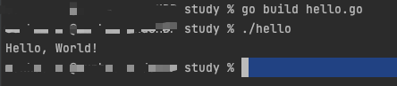

# 1.Hello world

## 1.1 如何使用goland

详见<https://geekr.dev/posts/first-go-app>

## 1.2 代码解析

```go
package main //生成可执行程序必须要有main

import "fmt"

func main() {//必须是main方法
    fmt.Println("Hello World!")//可以不用写分号
}
```

### 1.2.1 返回值

通过os.Exit()来完成`return`的工作

### 1.2.2 传入参数

需要通过os.Args来获取命令行的参数

## 1.3 运行程序

方式一：
    可以通过go build先进行编译，然后直接运行编译后的可执行文件
    

方式二：
   直接运行

# 2. 测试

1. 文件以_test结尾
2. 方法要以Test开头 func TextXxxx（t *testing.T）{}

# 3. 变量

## 3.1 声明变量

1. 标准声明

```go
var 变量 变量类型
```

2. 批量声明

```go
var(
    a int
    b bool
    c string
)
```

**注意：**

1. go语言中声明的`非全局变量`必须要使用，不使用无法编译通过

## 3.2 变量赋值

1. 声明变量同时赋值

```go
var s string = “study”
```

2. 类型推导(通过值判断变量是什么类型)

```go
var s = "study"
```

3. 短变量声明

通过`:=`方式声明并初始化变量

```go
s3 := "study"
```

## 3.3 匿名变量

用一个`_`来表示，

# 4. 常量

## 4.1 声明变量

1. 单个声明

```go
const s = 2.7
```

2. 批量声明

```go
const(
      s = 2.7
      c = 3.4
)
```


