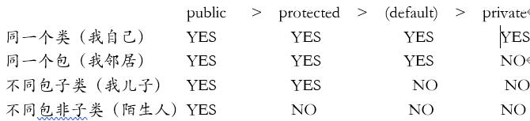

<!--
 * @Author: 孙浩然
 * @Date: 2020-07-01 10:38:12
 * @LastEditors: 孙浩然
 * @LastEditTime: 2020-07-08 09:21:51
 * @FilePath: \Java-Point\docs\9.interview\1.面经\1-java基础.md
 * @博客地址: 个人博客，如果各位客官觉得不错，请点个赞，谢谢。[地址](https://codefool0307.github.io/JavaScholar/#/)
--> 
# Java十八讲

# 1.java基础-数据类型-8种常见类型
##  1-1：八种数据类型是什么？

1. 字符型   char
2. 布尔型  boolean
3. 数值型
   1. 整型：byte、short、int、long
   2. 浮点型：float、double

<font?color=red>特别注意</font>：String不是基本数据类型，是引用类型。
                                                          
##  1-2：为什么byte类型是-128~+127

1. -0的补码来表示-128, 所以-128并没有原码和反码表示
2. 使用补码, 不仅仅修复了0的符号以及存在两个编码的问题, 而且还能够多表示一个最低数.

##  1-3：java为什么除了基本数据类型还要有引用数据类型

引用数据类型是在堆里，基本数据类型在栈储缓存
引用数据类型需要多一次解引用，而且还要存储对象头，这样对于基本数据类型

##  1-4：什么是单精度和双精度？
单精度浮点数在计算机存储器中占用4个字节（32?bits），
双精度浮点数(double)使用64位（8字节）来存储一个浮点数。

##  1-5：什么是浮点数？
由一个有效数字加上幂数来表示，使用浮点数的主要原因是由于计算机二进制的运算


# 2.java基础-数据类型-自动拆装箱
## 2-1：为什么要有自动拆装箱

比如说集合类中，要求元素必须是Object类，而int、double等基本数据类型无法使用，那么我们就把基本数据类型包装起来，使其具有对象的特征，并让他有了属性和方法

## 2-2：Integer缓存机制

Integer对小数据（-128~=127）具有缓存机制，当jvm在初始化的时候，如果数据是小数据，那么就会把数据存储在本地内存当中，当下次使用的时候，如果属于小数据，那么就可以直接从本地内存进行调用，就不需要再次创建对象来进行姐姐

## 2-3：Integer的源码分析

1. 其中会有一个valueof函数，用来判断内存中是否有着这个数值，
   * 如果说有，那么直接从内存进行读取
   * 如果说没有，那么就需要创建一个对象
2. 在jvm初始化的时候，低值是不能改变的，但是高值是可以改变的，可以通过jvm进行参数设置，但是只有Integer源码可以对高值、低值进行改变。

## 2-4：自动拆装箱的原理

    * 自动装箱：调用valueOf（）方法将原始类型值转换成对象
    * 自动拆箱：调用intValue()方法，其他的（xxxValue())这类的方法将对象转换成原始类型值。

## 2-5:自动拆装箱使用场景

1. 场景一、将基本数据类型放入集合类
2. 场景二、包装类型和基本类型的大小比较
3. 场景三、包装类型的运算
4. 场景四、三目运算符的使用如果i是包装类，j是null就会NPE报错
5. 场景五、函数参数与返回值

## 2-6：自动拆装箱带来的问题

1. 包装对象的数值比较，不能简单的使用==，~~虽然-128到127之间的数字可以，但是这个范围之外还是需要使用equals比较~~。（笔试选择较为频繁，跟谁学考过）

2. 如果包装类对象为null，那么自动拆箱时就有可能抛出NPE（NullPointException）。

3. 如果一个for循环中有大量拆装箱操作，会浪费很多资源。

引申：==与equals的区别

1. ==在基本数据类型是值的比较，在引用数据类型是对象的比较（只要是创建了对象就不可以了）
2. equals主要是内容的比较
   * 其中equals源码主要代码思路：
      * 判定传入的对象和当前对象是否为同一个对象，如果是就直接返回true.
      * 判定传入的类型值是否为String,若不是则返回false;
      * 判定传入的String与当前的String的床都是否一致，若不一致就返回false;
      * 循环对比两个字符串的char[]数组，逐个对比字符是否一致，若存在不一致的情况，则直      接返回false;
      * 循环结束都没有找到不匹配的，所以最后返回true; 

# 3.java基础-关键字-访问权限关键字
## 3-1：访问控制关键字级别



## 3-2: 通过反射访问private成员和方法，既然能访问为什么要private？

1. private并不是解决安全问题的，如果想让解决代码的安全问题，请用别的办法。
2. private的意义是OOP（面向对象编程）的封装概念。

# 4.java基础-关键字-static

## 4-1:static使用场景

1. 修饰成员变量和成员方法 
     * 被 static 修饰的成员属于类，不属于单个这个类的某个对象，被类中所有对象共享，可以并且建议通过类名调用。
     * 被static 声明的成员变量属于静态成员变量，静态变量 存放在 Java 内存区域的方法区。调用格式：类名.静态变量名 类名.静态方法名()
2. 静态代码块: 
   * 静态代码块定义在类中方法外, 静态代码块在非静态代码块之前执行(静态代码块—>非静态代码块—>构造方法)。 该类不管创建多少对象，静态代码块只执行一次.
3. 静态内部类（static修饰类的话只能修饰内部类）： 
   * 静态内部类与非静态内部类之间存在一个最大的区别: 非静态内部类在编译完成之后会隐含地保存着一个引用，该引用是指向创建它的外围类，但是静态内部类却没有。没有这个引用就意味着：1. 它的创建是不需要依赖外围类的创建。2. 它不能使用任何外围类的非static成员变量和方法。
4. 静态导包: 
   * 格式为：import static 这两个关键字连用可以指定导入某个类中的指定静态资源，并且不需要使用类名调用类中静态成员，可以直接使用类中静态成员变量和成员方法。

# 5.java基础-关键字-final关键字

## 5-1 final关键字使用特点

1. final修饰的类不能被继承

2. final修饰的方法不能被重写；

3. final修饰的变量是常量，如果是基本数据类型的变量，则其数值一旦在初始化之后便不能更改；如果是引用类型的变量，则在对其初始化之后便不能让其指向另一个对象。

## 5-2 final使用场景

1. 把方法锁定，以防任何继承类修改它的含义；

2. 想通过使用final提升程序性能
   * 因为编译器能从final中获取额外的信息，因此可以对类或者方法调用进行额外的优化处理。但这中优化对程序性能的提升极其有限。

3. 权限控制,也就是说这个类或方法不希望被继承和重写

# 6.java基础-关键字-this关键字和super关键字

1. this程序
```java
class Manager {
    Employees[] employees;
     
    void manageEmployees() {
        int totalEmp = this.employees.length;
        System.out.println("Total employees: " + totalEmp);
        this.report();
    }
     
    void report() { }
}
```

主要是访问本类（自己）的成员变量和方法（可写可不写）
super主要是通过子类去访问父类的成员变量和方法，必须写
2. super程序

```java
public class Super {
    protected int number;
     
    protected showNumber() {
        System.out.println("number = " + number);
    }
}
 
public class Sub extends Super {
    void bar() {
        super.number = 10;
        super.showNumber();
    }
}
```

1. 在构造器中使用 super（） 调用父类中的其他构造方法时，该语句必须处于构造器的首行，否则编译器会报错。
2. this 调用本类中的其他构造方法时，也要放在首行。
3. this、super不能用在static方法中。

# 7.java基础-关键字-transient

## 7-1： transient使用场景

阻⽌实例中那些⽤此关键字修饰的的变量序列化；当对象被反序列化时，被 transient 修饰的变量值不会被持久化和恢复。 transient 只能修饰变量，不能修饰类和⽅法。

# 8.java基础-关键字-synchronized关键字

## 8-1：synchronized关键字理解

1. 解决的是多个线程之间访问资源的同步性， synchronized关键字可以保证被它修饰的⽅法或者代码块在任意时刻只能有⼀个线程执⾏。
2. 在 Java 早期版本中， synchronized属于重量级锁，效率低下，因为监视器锁（monitor）是依赖于底层的操作系统的 Mutex Lock 来实现的， Java 的线程是映射到操作系统的原⽣线程之上的。如果要挂起或者唤醒⼀个线程，都需要操作系统帮忙完成，⽽操作系统实现线程之间的切换时需要从⽤户态转换到内核态，这个状态之间的转换需要相对⽐较⻓的时间，时间成本相对较⾼，但是在JDK1.6对锁的实现引⼊了⼤量的优化，如⾃旋锁、适应性⾃旋锁、锁消除、锁粗化、偏向锁、轻量级锁等技术来减少锁操作的开销。

## 8-2：JDK1.6优化有哪些？

JDK1.6 对锁的实现引⼊了⼤量的优化，如偏向锁、轻量级锁、⾃旋锁、适应性⾃旋锁、锁消除、锁粗化等技术来减少锁操作的开销。

~~锁主要存在四种状态，依次是：⽆锁状态、偏向锁状态、轻量级锁状态、重量级锁状态，他们会随着竞争的激烈⽽逐渐升级。锁可以升级单绝对不可以降级，这种策略是为了提⾼获得锁和释放锁的效率。~~

①偏向锁

引入偏向锁的目是为了没有多线程竞争的前提下，减少传统的重量级锁使用操作系统互斥量产生的性能消耗。但是不同是：轻量级锁在无竞争的情况下使用 CAS 操作去代替使用互斥量。而偏向锁在无竞争的情况下会把整个同步都消除掉。

② 轻量级锁

轻量级锁不是为了代替重量级锁，它的本意是在没有多线程竞争的前提下，减少传统的重量级锁使用操作系统互斥量产生的性能消耗，因为使用轻量级锁时，不需要申请互斥量。

如果没有竞争，轻量级锁使用 CAS 操作避免了使用互斥操作的开销。但如果存在锁竞争，除了互斥量开销外，还会额外发生CAS操作，因此在有锁竞争的情况下，轻量级锁比传统的重量级锁更慢！如果锁竞争激烈，那么轻量级将很快膨胀为重量级锁！

③ 自旋锁和自适应自旋

一般线程持有锁的时间都不是太长，所以仅仅为了这一点时间去挂起线程/恢复线程是得不偿失的。为了让一个线程等待，我们只需要让线程执行一个忙循环（自旋）也就是自旋。

自旋次数的默认值是10次，用户可以修改--XX:PreBlockSpin来更改。

另外,在 JDK1.6 中引入了自适应的自旋锁。自适应的自旋锁带来的改进就是：自旋的时间不在固定了，而是和前一次同一个锁上的自旋时间以及锁的拥有者的状态来决定。

④ 锁消除

指的就是虚拟机即使编译器在运行时，如果检测到那些共享数据不可能存在竞争，那么就执行锁消除。锁消除可以节省毫无意义的请求锁的时间。

⑤ 锁粗化

原则上，我们在编写代码的时候，总是推荐将同步块的作用范围限制得尽量小，——直在共享数据的实际作用域才进行同步，这样是为了使得需要同步的操作数量尽可能变小，如果存在锁竞争，那等待线程也能尽快拿到锁。

但是如果一系列的连续操作都对同一个对象反复加锁和解锁，那么会带来很多不必要的性能消耗。
   
# 8-3：说说⾃⼰是怎么使⽤ synchronized 关键字，在项⽬中⽤到了吗

💀💀💀

## 8-4：synchronized关键字最主要的三种使⽤⽅式（与单例模式结合比较高）

1. 修饰实例⽅法: 作⽤于当前对象实例加锁，进⼊同步代码前要获得当前对象实例的锁
2. 修饰代码块: 指定加锁对象，对给定对象加锁，进⼊同步代码库前要获得给定对象的锁。
3. 修饰静态⽅法: 也就是给当前类加锁，会作⽤于类的所有对象实例。

补充：
* synchronized 关键字加到 static 静态⽅法和 synchronized(class)代码块上都是是给 Class类上锁。 
* synchronized 关键字加到实例⽅法上是给对象实例上锁。尽量不要使⽤synchronized(String a) 因为JVM中，字符串常量池具有缓存功能！

## 8-5：synchronized 关键字底层原理

① synchronized 同步语句块的情况
synchronized 同步语句块的实现使⽤的是 monitorenter 和 monitorexit 指令，其中 monitorenter
指令指向同步代码块的开始位置， monitorexit 指令则指明同步代码块的结束位置。 

② synchronized 修饰⽅法的的情况
synchronized 修饰的⽅法并没有 monitorenter 指令和 monitorexit 指令，取得代之的确实是
ACC_SYNCHRONIZED 标识，该标识指明了该⽅法是⼀个同步⽅法， JVM 通过该 ACC_SYNCHRONIZED 访问
标志来辨别⼀个⽅法是否声明为同步⽅法，从⽽执⾏相应的同步调⽤。

## 8-6：synchronized和ReentrantLock的区别
1. 两者都是可重⼊锁

* “可重⼊锁”概念是：⾃⼰可以再次获取⾃⼰的内部锁。⽐如⼀个线程获得了某个对象的锁，此时这个对象锁还没有释放，当其再次想要获取这个对象的锁的时候还是可以获取的，如果不可锁重⼊的话，就会造成死锁。同⼀个线程每次获取锁，锁的计数器都⾃增1，所以要等到锁的计数器
下降为0时才能释放锁。

2. synchronized 依赖于 JVM ⽽ ReentrantLock 依赖于 API

3. ReentrantLock ⽐ synchronized 增加了⼀些⾼级功能
 1. 等待可中断； 
 2. 可实现公平锁； 
 3. 可实现选择性通知（锁可以绑定多个条件）

# 9.java基础-关键字-volatile关键字

## 9-1：volatile 关键字作用以及Java内存数据不一致

作⽤就是保证变量的可⻅性然后还有⼀个作⽤是防⽌指令重排序。


## 9-2：说说 synchronized 关键字和 volatile 关键字的区别

1. volatile关键字是线程同步的轻量级实现，但是volatile关键字只能⽤于变量⽽synchronized关键字可以修饰⽅法以及代码块。
2. synchronized关键字在JavaSE1.6之后进⾏了主要包括为了减少获得锁和释放锁带来的性能消耗⽽引⼊的偏向锁和轻量级锁以及其它各种优化之后执⾏效率有了显著提升。
3. 多线程访问volatile关键字不会发⽣阻塞，⽽synchronized关键字可能会发⽣阻塞
4. volatile关键字能保证数据的可⻅性，但不能保证数据的原⼦性。 synchronized关键字两者都能保证。
5. volatile关键字主要⽤于解决变量在多个线程之间的可⻅性，⽽ synchronized关键字解决的是多个线程之间访问资源的同步性。

## 9-3：get需要加锁么，为什么？ （蚂蚁金服）

get操作全程不需要加锁是因为Node的成员变量是用volatile修饰的，数组用volatile修饰主要是保证在数组扩容的时候保证可见性。

# 10.java基础-集合-hashmap

## 10-1：HashMap的底层实现
1. JDK1.8之前HashMap底层是数组和链表。HashMap通过key的hashCode经过扰动函数处理过后得到hash值，然后通过(n-1)&hash判断当前元素存放的位置，如果当前位置存在元素的话，就判断该元素与要存入的元素的hash值以及key是否相同，如果相同的话，直接覆盖，不相同就通过拉链法解决冲突。
   
2. JDK1.8之后在解决哈希冲突时有了较大的变化，当链表长度大于阈值（默认为8）（将链表转换成红黑树前会判断，如果当前数组的长度小于64，那么会选择先进行数组扩容，而不是转换为红黑树）时，将链表转化为红黑树，以减少搜索时间。

## HashMap中(tab.length - 1) & hash作用

1. 保证不会发生数组越界

2. 保证元素尽可能的均匀分布

## 10-2：扰动函数以及作用

HashMap的hash方法。

使用hash方法也就是扰动函数是为了防止一些实现比较差的hashCode()方法，换句话说使用扰动函数之后可以减少碰撞。


## 10-3：哈希冲突的解决方法

1. 拉链法
   
将链表和数组相结合。也就是说创建一个链表数组，数组中每一格就是一个链表。若遇到哈希冲突，则将冲突的值加到链表中即可。

2. 开发地址法

所有输入的元素全部存放在哈希表里，先通过哈希函数进行判断，若是发生哈希冲突，就以当前地址为基准，根据再寻址的方法（探查序列），去寻找下一个地址，若发生冲突再去寻找，直至找到一个为空的地址为止。

## 10-4：HashMap的put操作

HashMap通过key的hashCode经过扰动函数处理过后得到hash值，然后通过(n-1)&hash判断当前元素存放的位置

1. 如果数组的这个位置是空的，把key放进去，put操作就完成了。

2. 如果数组位置不为空，就判断该元素与要存入的元素的?hash?值以及?key?是否相同，如果相同的话，直接覆盖

3. 若果不相等，这个元素必然是个链表。遍历链表逐一比对value，如果value在链表中不存在，就把新建节点，将value放进去，put操作完成。

4. 如果链表中value存在，则替换原节点的value，put操作完成。

5. 如果链表节点数已经达到8个，首先判断当前hashMap的长度，如果不足64，只进行resize，扩容table，如果达到64就将冲突的链表为红黑树。

## 10-5 reHash过程

1. 首先创建一个比现有哈希表更大的新哈希表（expand）
2. 然后将旧哈希表的所有元素都迁移到新哈希表去（rehash）

## 10-6：hash函数以及常用方法

1. 直接定址法：直接以key或者key上加上某个常数作为哈希地址
2. 数字分析法：提取key中取值比较均匀的数字作为哈希地址
3. 除留余数法：用key除以某个不大于哈希表长度m的数，将所得余数作为哈希地址
4. 分段叠加法：按照哈希表地址位数将关键字分成了位数相等的几部分，其中最后一部分可以比较短，然后将这几部分相加，舍弃最高位仅为后的结果就是该关键字的哈希地址
5. 平方取中法：如果key的各部分分部都不均匀，可以先求出他的平方值，然后按照需求求取中间的几位作为哈希地址
6. 伪随机数法：采用一个伪随机数作为哈希函数

## 10-6：hashmap树化门槛及作用

* 链表长度大于8
* 数组长度大于64

作用：
这个本质上，是一个安全问题。因为在元素放置过程中，如果一个对象哈希冲突，都被放置到同一个桶中，则会形成一个链表。而链表查询是线性的，会严重影响存取的性能。

## 10-7：hashmap性能提升作用和好处

主要是为了避免哈希碰撞拒绝服务攻击。

* 如：String的hashcode函数的强度很弱，有人可以很容易的构造出大量hashcode相同的String对象。如果向服务器一次提交数万个hashcode相同的字符串，服务器的查询时间过长，让服务器的CPU被大量占用，当有其他更多的请求时服务器会拒绝服务。而使用红黑树可以将查询时间降低到一定的数量级，可以有效避免哈希碰撞拒绝服务攻击。


## 10-8：hashmap的特性

1. 允许空键和空值（但空键只有一个，且放在第一位）
2. 元素是无序的，而且顺序会不定时改变
3. key?用?Set?存放，所以想做到?key?不允许重复，key?对应的类需要重写?hashCode?和?equals?方法。
4. 底层实现是?链表数组，JDK?8?后又加了红黑树。
5. 实现了?Map?全部的方法

## 10-9：java8为什么要对hashmap进行改造，用红黑树替代

提高效率

## 10-10：HashMap的扩容机制

书本

## 10-11：请解释一下HashMap的参数loadFactor，它的作用是什么？

loadFactor表示HashMap的拥挤程度

作用：影响hash操作到同一个数组位置的概率。默认loadFactor等于0.75，当HashMap里面容纳的元素已经达到HashMap数组长度的75%时，表示HashMap太挤了，需要扩容，在HashMap的构造器中可以定制loadFactor。

## 10-12：HashMap的树化门槛为什么是8

1. 当hashCode离散性很好的时候，树型bin用到的概率非常小，因为数据均匀分布在每个bin中，几乎不会有bin中链表长度会达到阈值（树华门槛）。
   
2. 在随机hashCode下，离散性可能会变差，然而JDK又不能阻止用户实现这种不好的hash算法，因此就可能导致不均匀的数据分布。
   
3. 不过理想情况下随机hashCode算法下所有bin中节点的分布频率会遵循泊松分布，一个bin中链表长度达到8个元素的概率是一个非常小的值，几乎是不可能事件。

## 10-13：HashMap的扩容因子为什么是0.75

1. 如果设置过大，如0.85，桶中键值对碰撞的几率就会越大，同一个桶位置可能会存放好几个value值，这样就会增加搜索的时间，性能下降。
   
2. 如果设置过小，如0.1，那么10个桶，threshold为1，你放两个键值对就要扩容，太浪费空间了。

## 10-14:为什么默认初始化桶数组大小为16

如果桶初始化桶数组设置太大，就会浪费内存空间，16是一个折中的大小，既不会像1，2，3那样放几个元素就扩容，也不会像几千几万那样可以只会利用一点点空间从而造成大量的浪费。

## 10-15:hashMap是否线程安全

1. put的时候导致的多线程数据不一致

2. resize而引起死循环（JDK1.8已经不会出现该问题）

## 10-16：线程安全的Map

* Hashtable
* ConcurrentHashMap
* SynchronizedMap

1. Hashtable源码中是使用synchronized来保证线程安全的
   
2. ConcurrentHashMap沿用了与它同时期的HashMap版本的思想，底层依然由“数组”+链表+红黑树的方式思想，但是ConcurrentHashMap没有对整个hash表进行锁定，而是采用了分离锁（segment）的方式进行局部锁定。具体体现在，它在代码中维护着一个segment数组。
   
3. 在SynchronizedMap类中使用了synchronized同步关键字来保证对Map的操作是线程安全的。

## 10-17：hashmap为什么是2的秘方次

如果length为2的N次方，取模运算可以变成位与运算，效率显著提高！但是要浪费一些空间。

## 10-18：hashmap的多线程导致死循环

并发下的Rehash会造成元素之间会形成一个循环链表。在JDK8之后，使用了链表转化为红黑树的形式，可以解决这个问题，但是呢还会有数据丢失等弊端

# 11.java基础-集合-ConcurrentHashMap

## 11-1：ConcurrentHashMap的底层实现，怎么做到线程安全的

在JDK1.7的时候，ConcurrentHashMap（分段锁）?对整个桶数组进行了分割分段(Segment)，每一把锁只锁容器其中一部分数据，多线程访问容器里不同数据段的数据，就不会存在锁竞争，提高并发访问率。?到了?JDK1.8?的时候已经摒弃了Segment的概念，而是直接用?Node?数组+链表+红黑树的数据结构来实现，并发控制使用?synchronized?和?CAS?来操作。（JDK1.6以后?对?synchronized锁做了很多优化）?整个看起来就像是优化过且线程安全的?HashMap，虽然在JDK1.8中还能看到?Segment?的数据结构，但是已经简化了属性，只是为了兼容旧版本；

## 11-2：为何会出现ConcurrenHashMap?

线程安全，读写还快，以空间换时间
内存直接分为了16个segment，每个segment实际上还是存储的哈希表，写入的时候，先找到对应的segment，然后锁这个segment，写完，解锁，汗！就这么简单解决了，锁segment的时候，其他segment还可以继续工作

## 11-3：为什么ConcurrentHashMap为何不支持null键和null值

无法分辨是key没找到的null还是有key值为null，这在多线程里面是模糊不清的，所以压根就不让put=null。

## 分段锁原理

首先将数据分成一段一段的存储，然后给每一段数据配一把锁，当一个线程占用锁访问其中一个段数据的时候，其他段的数据也能被其他线程访问。

# 12.java基础-集合-TreeMap

## 12-1:TreeMap底层原理：

TreeMap的实现就是红黑树数据结构，也就说是一棵自平衡的排序二叉树，这样就可以保证当需要快速检索指定节点。


## 11-3：java8中map相关红黑树引用背景

书本

## 11-4：为什么要重写hashcode与equals

往HashMap添加元素的时候，需要先定位到在数组的位置（hashCode方法）；如果只重写了 equals 方法，两个对象 equals 返回了true，集合是不允许出现重复元素的，只能插入一个；此时如果没有重写 hashCode 方法，那么就无法定位到同一个位置，集合还是会插入元素。这样集合中就出现了重复元素了。那么重写的equals方法就没有意义了。

# 12.java基础-集合-Collection

## 12-1：ArrayList数组长度源码

一部分是用来存储数据元素，一部分是用来存储数组大小，标志，锁定，类信息指针等对象头信息，对象头信息最大占用内存不可超过8字节。

## 12-2：arraylist扩容机制

如果元素的个数，大于其容量，则把其容量扩展为原来容量的1.5倍。

## 12-3：遍历删除arraylist元素

1. 直接使用普通for循环进行操作
2. 直接使用Iterator进行操作
3. 使用Java8中提供的filter过滤
4. 使用增强for循环其实也可以
5. 直接使用fail-safe的集合类

## 12-4：hashset原理

1. HashSet会先计算对象的hashcode值来判断对象加入的位置，同时也会与其他加入的对象的hashcode值作比较，如果没有相符的hashcode，HashSet会假设对象没有重复出现。但是如果发现有相同hashcode值的对象，这时会调用equals()方法来检查hashcode相等的对象是否真的相同。如果两者相同，HashSet就不会让加入操作成功。
  
2. TreeSet是用compareTo()来判断重复元素的。

## 12-5：Enumeration和itrator区别
1. 函数接口不同
   * Enumeration只有2个函数接口。通过Enumeration，我们只能读取集合的数据，而不能对数据进行修改。
   * Iterator只有3个函数接口。Iterator除了能读取集合的数据之外，也能数据进行删除操作。
1. Iterator支持fail-fast机制，而Enumeration不支持。
2. Enumeration迭代器只能遍历Vector、Hashtable这种古老的集合，因此通常不要使用它，除非在某些极端情况下，不得不使用Enumeration，否则都应该选择Iterator迭代器。

## 12-6：comparable和Comparator的区别

书本

## 12-7：SynchronizedList

1. SynchronizedList有很好的扩展和兼容功能。他可以将所有的List的子类转成线程安全的类。
   
2. 使用SynchronizedList的时候，进行遍历时要手动进行同步处理。

3. SynchronizedList可以指定锁定的对象。

# 13.java基础-集合-Collections

## 13-1：Collection和collections区别

1. Collection是一个集合接口。它提供了对集合对象进行基本操作的通用接口方法
2. Collections是一个包装类。它包含有各种有关集合操作的静态多态方法。此类不能实例化，就像一个工具类，服务于Java的Collection框架。

# 14.java基础-集合-Arrays


# 15.java基础-集合-集合大比较（区别和使用场景）

## 15-1：set和list、map的区别

1. List(对付顺序的好帮手)：List接口存储一组不唯一（可以有多个元素引用相同的对象），有序的对象

2. Set(注重独一无二的性质):不允许重复的集合。不会有多个元素引用相同的对象。

3. Map(用Key来搜索的专家):使用键值对存储。Map会维护与Key有关联的值。两个Key可以引用相同的对象，但Key不能重复，典型的Key是String类型，但也可以是任何对象。

## 15-2：arraylist、linkedlist区别和适用场景

1. 是否保证线程安全： ArrayList 和 LinkedList 都是不同步的，也就是不保证线程安全；
2. 底层数据结构： Arraylist 底层使用的是 Object 数组；LinkedList 底层使用的是 双向链表 数据结构
3. 插入和删除是否受元素位置的影响： 
   ① ArrayList 采用数组存储，所以插入和删除元素的时间复杂度受元素位置的影响。 
   ② LinkedList 采用链表存储，插入，删除元素时间复杂度不受元素位置的影响，如果是要在指定位置i插入和删除元素的话需要先移动到指定位置再插入。
4. 是否支持快速随机访问： LinkedList 不支持高效的随机元素访问，而 ArrayList 支持。快速随机访问就是通过元素的序号快速获取元素对象(对应于get(int index) 方法)。<br>
5. 内存空间占用： ArrayList的空间浪费主要体现在在list列表的结尾会预留一定的容量空间，而LinkedList的空间花费则体现在它的每一个元素都需要消耗比ArrayList更多的空间（因为要存放直接后继和直接前驱以及数据）

<font color="#986078">使用场景：</font>

当需要对数据进行对此访问的情况下选用ArrayList，当需要对数据进行多次增加删除修改时采用LinkedList。

## 15-3：vector、Arraylist区别和适用场景

1. Vector是多线程安全的，
2. Vector类中的方法很多有synchronized进行修饰，这样就导致了Vector在效率上无法与ArrayList相比
3. 两个都是采用的线性连续空间存储元素，但是当空间不足的时候，两个类的增加方式是不同。
4. Vector可以设置增长因子，而ArrayList不可以
   
<font color="#986078">使用场景：</font>

1. 安全因素
2. 在集合中使用数据量比较大的数据

## 15-4：treeset、hashset区别和适用场景

1. TreeSet 是二差树实现的,Treeset中的数据是自动排好序的，不允许放入null值
   HashSet 是哈希表实现的,HashSet中的数据是无序的，可以放入null，但只能放入一个null，两者中的值都不能重复，就如数据库中唯一约束

2. HashSet要求放入的对象必须实现HashCode()方法，放入的对象，是以hashcode码作为标识的，而具有相同内容的String对象，hashcode是一样，所以放入的内容不能重复。但是同一个类的对象可以放入不同的实例	

<font color="#986078">使用场景：</font>

在我们需要排序的功能时，我们才使用TreeSet。

## 15-5：HashMap、Treemap区别和适用场景

1. HashMap：基于哈希表实现，使用HashMap要求添加的键明确定义了hasCode（）和equals（），为了优化hashMap空间的使用，可以调优初始容量和负载因子。hashmap适用于在map中插入，删除和定位元素。hashmap的结果是没有排序的的。
2. TreeMap：基于红黑树实现，TreeMap没有调优选项，该树总是处于平衡状态。treemap适用于按自然顺序或自定义顺序遍历键（key），TreeMap实现SortMap接口，能够把保存的额近路根据键排序，默认是按键值的升序排序，也可以指定排序的比较器。

<font color="#986078">使用场景：</font>

## 15-6：HashTable、Hashmap区别和适用场景

1 继承和实现方式不同<br>
2 线程安全不同<br>
3 对null值的处理不同<br>
4 支持的遍历种类不同<br>
5 通过Iterator迭代器遍历时，遍历的顺序不同<br>
6 容量的初始值 和 增加方式都不一样<br>
7 添加key-value时的hash值算法不同<br>
8 部分API不同<br>"	
   
<font color="#986078">使用场景：</font>

1. 若在单线程中，我们往往会选择HashMap；
2. 而在多线程中，则会选择Hashtable。(02)，
3. 若不能插入null元素，则选择Hashtable；否则，可以选择HashMap。

## 15-7： ConcurrentHashMap、Hashmap区别和适用场景
1. ConcurrentHashMap对桶数组进行了分段，而HashMap并没有。
2. ConcurrentHashMap在每一个分段上都用锁进行了保护。HashMap没有锁机制。所以，前者线程安全的，后者不是线程安全的。
   
<font color="#986078">使用场景：</font>

1.安全因素

## 15-8： Hashset、Hashmap区别和适用场景

1. 接口：实现了Map接⼝ 实现Set接⼝
2. 存储：存储键值对 仅存储对象
3. 添加元素：调⽤ put（）向map中添加元素       调⽤ add（） ⽅法向Set中添加元素
4. 计算：HashMap使⽤键（Key）计算Hashcode     HashSet使⽤成员对象来计算hashcode值，对于两个对象来说hashcode可能相同，所以equals()⽅法⽤来判断对象的相等性，
   
<font color="#986078">使用场景：</font>


## JAVA集合类

1. Collection
   1. List
        * Arraylist： Object数组
        * Vector： Object数组
        * LinkedList： 双向链表(JDK1.6之前为循环链表， JDK1.7取消了循环)
    2. Set
        * HashSet（⽆序，唯⼀） : 基于 HashMap 实现的，底层采⽤ HashMap 来保存元素
        * LinkedHashSet： LinkedHashSet 继承于 HashSet，并且其内部是通过 LinkedHashMap 来实现的。有点类似于我们之前说的LinkedHashMap 其内部是基于 HashMap 实现⼀样，不过还是有⼀点点区别的
        * TreeSet（有序，唯⼀）： 红⿊树(⾃平衡的排序⼆叉树)
2. Map
    1. HashMap： JDK1.8之前HashMap由数组+链表组成的，数组是HashMap的主体，链表则是主要为了解决哈希冲突⽽存在的（“拉链法”解决冲突）。 JDK1.8以后在解决哈希冲突时有了较⼤的变化，当链表⻓度⼤于阈值（默认为8）时，将链表转化为红⿊树，以减少搜索时间
    2. LinkedHashMap： LinkedHashMap 继承⾃ HashMap，所以它的底层仍然是基于拉链式散列结构即由数组和链表或红⿊树组成。另外， LinkedHashMap 在上⾯结构的基础上，增加了⼀条双向链表，使得上⾯的结构可以保持键值对的插⼊顺序。同时通过对链表进⾏相应的操作，实现了访问顺序相关逻辑。详细可以查看： 《LinkedHashMap 源码详细分析（JDK1.8）》
    3. Hashtable： 数组+链表组成的，数组是 HashMap 的主体，链表则是主要为了解决哈希冲突⽽存在的
    4. TreeMap： 红⿊树（⾃平衡的排序⼆叉树）


# java基础-设计类问题

## 如果想要一个key对应多个Value的话，怎么设计Map

https://blog.csdn.net/yanzhenjie1003/article/details/51550264?utm_medium=distribute.pc_relevant_t0.none-task-blog-BlogCommendFromMachineLearnPai2-1.nonecase&depth_1-utm_source=distribute.pc_relevant_t0.none-task-blog-BlogCommendFromMachineLearnPai2-1.nonecase


## 插入一万个元素之后会不会扩容，扩容扩多少

1. HashMap 构造方法传递的 initialCapacity，它实际表示 table 的容量。
   
   * 只是代表了 table 数组容量为 1000

2. 构造方法传递的initialCapacity，最终会被tableSizeFor()方法动态调整为2的N次幂，以方便在扩容的时候，计算数据在newTable中的位置。

  * 虽然你传入了10000，但是实际传入的是10000/loadFactor，但是呢会调整为最接近的2 的 N 次幂
  
    * 如：实际传入了10000/0.75=13333，最接近的是2^13=16384，那么就采用16384
  
3. 如果设置了table的初始容量，会在初始化 table 时，将扩容阈值 threshold 重新调整为 table.size * loadFactor。

  * 那么可以储存的最大容量就是：16384*0.75=12288

注：HashMap 是否扩容，由 threshold 决定，而 threshold 又由初始容量和 loadFactor 决定。


# 20.java基础-IO-各种流

## 20-1：为何还要有字符流

因为我们不知道编码类型很容易出现乱码，所以IO就提供了一个直接操作字符的接口


## 20-2：BIO\NIO\AIO区别

1. BIO （Blocking I/O）：同步阻塞I/O模式，数据的读取写入必须阻塞在一个线程内等待其完成。

* 这里使用那个经典的烧开水例子，这里假设一个烧开水的场景，有一排水壶在烧开水，BIO的工作模式就是， 叫一个线程停留在一个水壶那，直到这个水壶烧开，才去处理下一个水壶。但是实际上线程在等待水壶烧开的时间段什么都没有做。

2. NIO （New I/O）：同时支持阻塞与非阻塞模式，NIO的做法是叫一个线程不断的轮询每个水壶的状态，看看是否有水壶的状态发生了改变，从而进行下一步的操作。

* 查询每个水壶的状态

1. AIO （ Asynchronous I/O）：异步非阻塞I/O模型。异步非阻塞无需一个线程去轮询所有IO操作的状态改变，在相应的状态改变后，系统会通知对应的线程来处理。
   
* 对应到烧开水中就是，为每个水壶上面装了一个开关，水烧开之后，水壶会自动通知我水烧开了。

注意：

1. 阻塞/非阻塞主要是说别人通知还是不通知你？
2. 同步/非同步主要是说你需不需要看着水壶？


## 20-3：BIO\NIO\AIO使用场景

1. BIO方式适用于连接数目比较小且固定的架构，这种方式对服务器资源要求比较高，并发局限于应用中，JDK1.4以前的唯一选择，但程序直观简单易理解。

2. NIO方式适用于连接数目多且连接比较短（轻操作）的架构，比如聊天服务器，并发局限于应用中，编程比较复杂，JDK1.4开始支持。

3. AIO方式适用于连接数目多且连接比较长（重操作）的架构，比如相册服务器，充分调用OS参与并发操作，编程比较复杂，JDK7开始支持。


## 20-4：linux的5种IO模型

1. 阻塞式IO模型

2. 非阻塞IO模型

3. IO复用模型

4. 信号驱动IO模型

5. 异步IO模型

## 20-5:IO多路复用

如果有一百万个I/O流进来，那我们就需要开启一百万个进程一一对应处理这些I/O流，这样会造成CPU占有率会多高，这个实现方式及其的不合理。

所以人们提出了I/O多路复用这个模型，一个线程，通过记录I/O流的状态来同时管理多个I/O，可以提高服务器的吞吐能力

三种常用的实现方式：

1. select大妈 每一个女生下楼, select大妈都不知道这个是不是你的女神, 她需要一个一个询问, 并且select大妈能力还有限, 最多一次帮你监视1024个妹子
2. poll大妈不限制盯着女生的数量, 只要是经过宿舍楼门口的女生, 都会帮你去问是不是你女神
3. epoll大妈不限制盯着女生的数量, 并且也不需要一个一个去问. 那么如何做呢? epoll大妈会为每个进宿舍楼的女生脸上贴上一个大字条,上面写上女生自己的名字, 只要女生下楼了, epoll大妈就知道这个是不是你女神了, 然后大妈再通知你.


