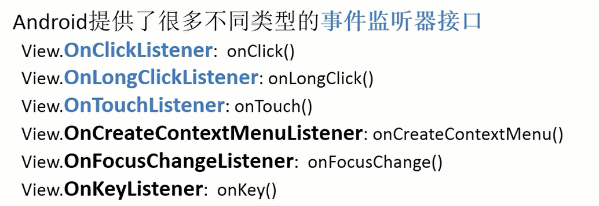

<!--
 * @Author: your name
 * @Date: 2021-03-16 08:41:09
 * @LastEditTime: 2021-03-16 10:09:55
 * @LastEditors: Please set LastEditors
 * @Description: In User Settings Edit
 * @FilePath: \Codefool0307_Blog\docs\7.Andriod\1.Andriodbasic\0.监听方式.md
-->
# 1.Android时间机制

## 1-0：综述

Android提供了两种两种方式的事件处理机制

- 基于监听事件处理
- 基于回调事件处理

## 1-1：基于监听的事件处理

基于监听的事件处理更是一种面向对象的事件处理方式，

监听处理通常会涉及到三个类（以火灾为例）

- 事件源，可以理解为事件发生的场所（比如说某个居民楼，超市），那么在Android就是按键、菜单等
- 事件，不过多解释
- 事件监听器，负责监听事件源所发生的事情，并作出响应（事件监听器的核心就是它所包含的**方法**，这些**方法**也叫做`事件处理器`）

当用户按下一个按键或者菜单的时候，这些动作就会激发一个相应的事件，这些事件就会触发事件源（如按键等）上的事件监听器（Java对象），事件监听器就会调用相对应的事件处理器（也就是事件监听器里的方法）

用一个很好理解的例子，

某个居民楼（`事件源`），当火苗出现了（`事件`），居民楼（`事件源`）就会反映给消防局（`事件监听器`）让其处理,同时消防局（`事件监听器`）肯定监听了很多很多楼



举个例子

```java
public class FirstActivity extends AppCompatActivity {

    @Override
    protected void onCreate(Bundle savedInstanceState) {
        super.onCreate(savedInstanceState);
        setContentView(R.layout.first_layout);
        Button button = findViewById(R.id.button);
        button.setOnClickListener(new MyClickLister());
    }

    class MyClickLister implements View.OnClickListener{
        @Override
        public void onClick(View v) {
            TextView text = findViewById(R.id.textView);
            text.setText("出现了");
        }
    }
}
```

### 1-1-1：事件监听器的接口

```java

```

### 1-1-2：实现事件监听器的常用几种形式

1. layout中:   android:onclick=“方法名”
               Activity中: public void 方法名(View v) {   }
2. view.setOnclickListener(new View.OnclickListener(){    })
3. view.setOnclickListener(this)
4. view.setOnclickListener(onclickListener 成员变量)

<hr>

#### 1-1-2-1：直接绑定到标签

<font color="red" size='5'>第一步、在布局中增加onclick的属性</font>

```html
<Button
        android:id="@+id/button"
        android:layout_width="match_parent"
        android:layout_height="wrap_content"
        android:text="按键001"
        android:onClick="click"
        />
```
<font color="red" size='5'>第二步、在Activity中实现T功能</font>

```java
public void click(View view){
        Toast.makeText(FirstActivity.this,"布局实现其功能",Toast.LENGTH_SHORT).show();
    }
```
注意：
1. public void click(View xxx){/**View参数是必须的，不传递参数会抛出运行异常**/
2. android:onClick="方法名" 这个方法名一定要跟活动中的函数名保持一致

#### 1-1-2-2：使用内部类

```java
//初始化
        Button event_button02 = (Button)findViewById(R.id.button02);
        //设置监听，
        //第二种方式，匿名内部类设置监听
        event_button02.setOnClickListener(new View.OnClickListener() {
            @Override
            public void onClick(View v) {
                Toast.makeText(FirstActivity.this,"匿名内部类设置",Toast.LENGTH_SHORT).show();
            }
        });
```

#### 1-1-2-3：使用this设置监听

```java
public class FirstActivity extends AppCompatActivity implements View.OnClickListener {
//第三种方式，使用this设置监听
        Button event_button03 = (Button)findViewById(R.id.button03);
        event_button03.setOnClickListener(this);

@Override
    public void onClick(View v) {
        Toast.makeText(FirstActivity.this,"使用this实现其功能",Toast.LENGTH_SHORT).show();
    }
}
```
注意：
1. 使用this，必须要实现OnClickListener 接口，实现这个接口后，会让我们去<font color="red" size='4'>重写 onClick()方法</font>
2. this是访问当前类的接口的一个对象，就是把当前OnClick事件绑定到控件view上面去

#### 1-1-2-4：独立类

不建议使用
