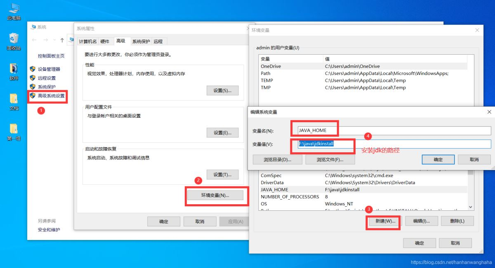
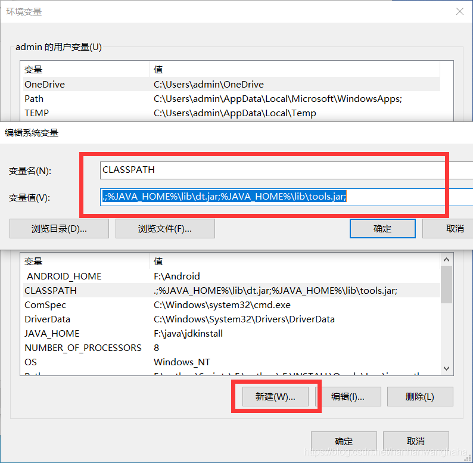
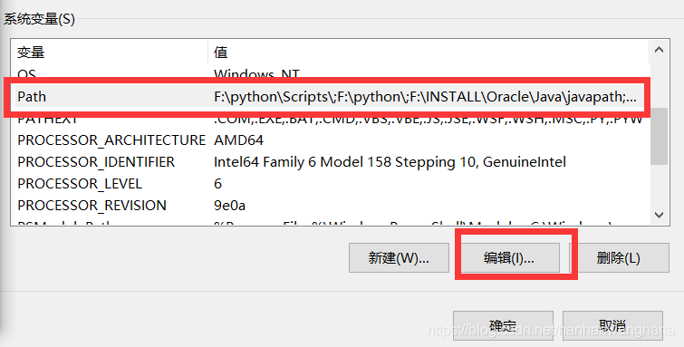
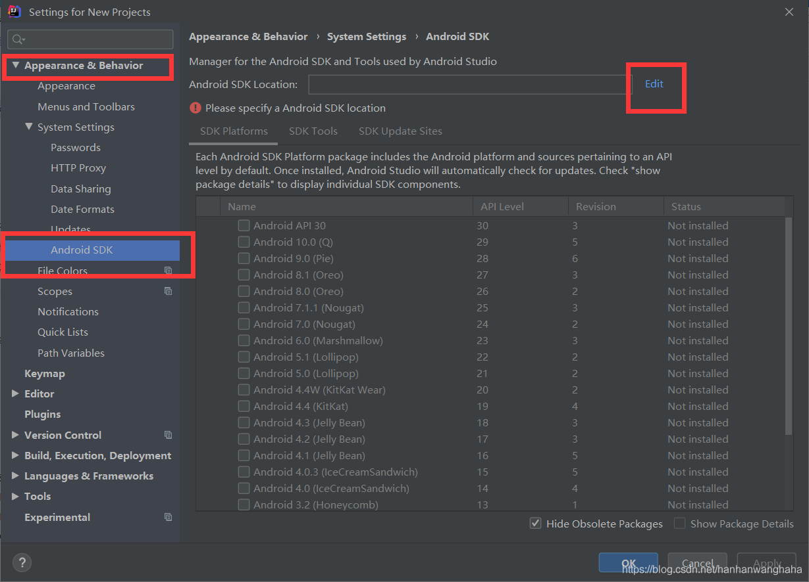
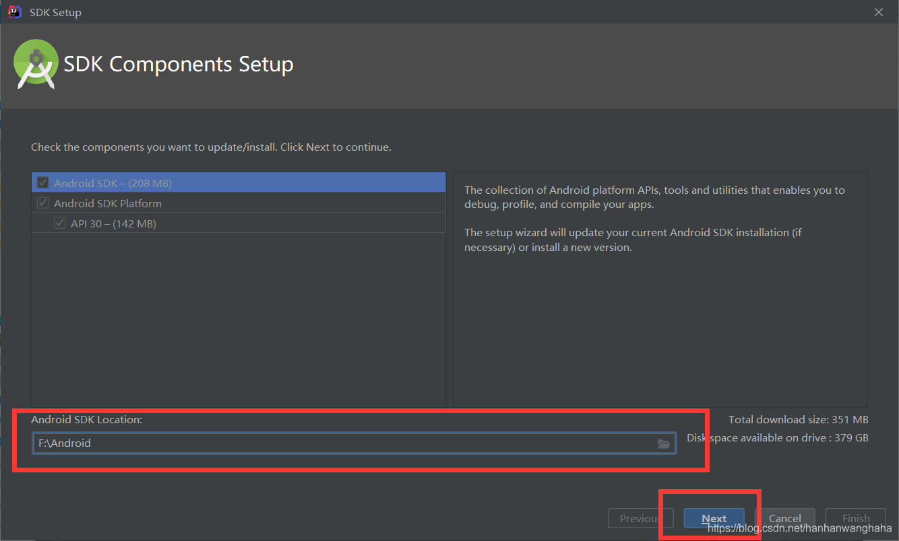
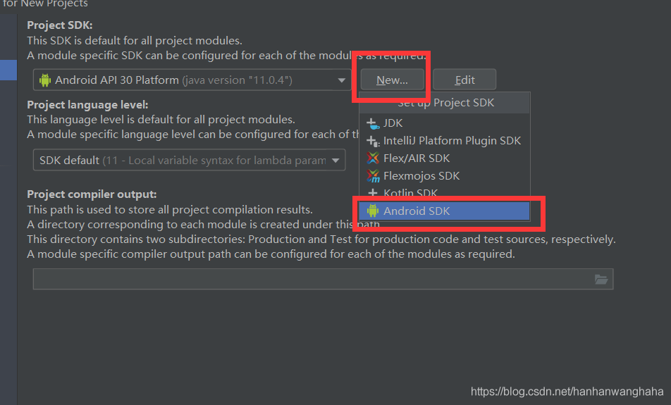
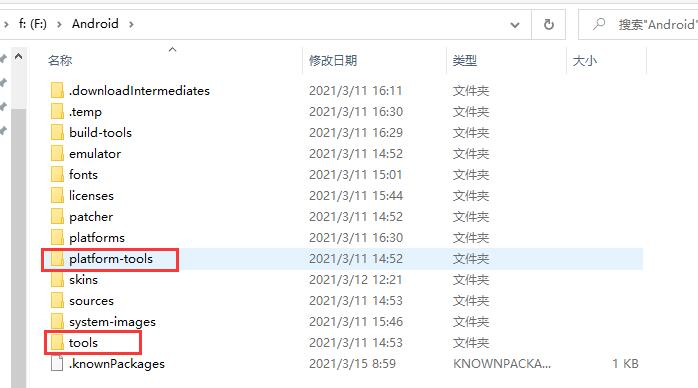
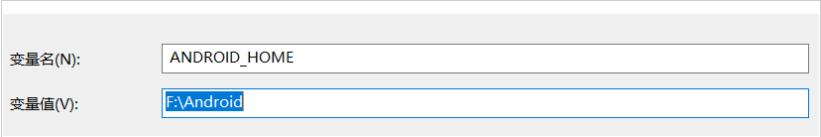
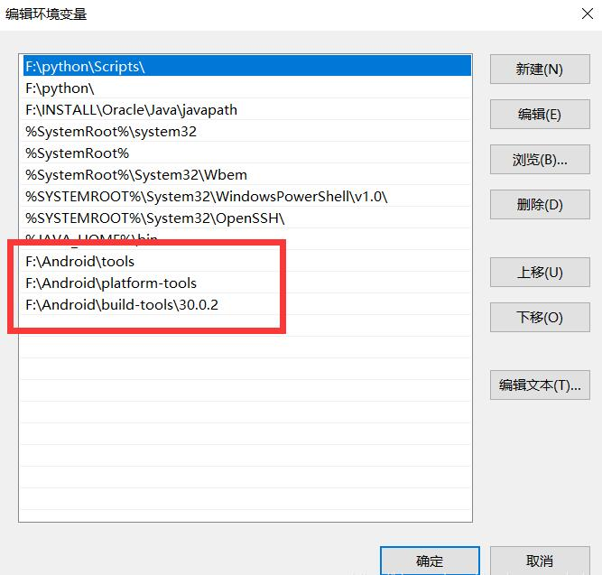

<!--
 * @Author: your name
 * @Date: 2021-01-19 15:41:45
 * @LastEditTime: 2021-03-15 11:21:11
 * @LastEditors: Please set LastEditors
 * @Description: In User Settings Edit
 * @FilePath: \Codefool0307_Blog\docs\7.Andriod\1.Andriodbasic\1.HelloWorld.md
-->
# 1 Andriod初学习

## 1-1：Andriod的系统架构

## 1-2：Andriod相关包与安装

### 1-2-1：JDK安装与配置

1.1 首先进入官网下载JDK，必须要进行注册然后才可以下载

1.2 下载完成之后，进行一系列的安装，一路next就可以了

1.3 安装完成之后，开始配置环境变量了
特别注意的是添加的环境变量一定要`全英文路径`和`没有空格`

右击此电脑，点击属性-->高级系统配置-->环境变量-->新建变量名为：`JAVA_HOME` 变量值为jdk的安装目录

1.4 新建系统变量CLASSPATH
点击新建-->变量名-->变量值：`.;%JAVA_HOME%\lib\dt.jar;%JAVA_HOME%\lib\tools.jar;`

1.5 在系统变量中，在path中添加

变量值为`%JAVA_HOME%\bin`，

1.6 最后就可以打开cmd界面进行显示

输入java -version或者java -V

### 1-2-2：SDK安装与配置

1.1 在菜单设置里面，找到Android SDK（可以通过搜索进行查找到）

就可以选择SDK要安装在哪里了（但是要切记不要有`中文路径`和`空格`）

之后可以正常进行安装了，就是费点流量

1.2 在菜单项目结构-->8项目里面，添加你想要的SDK

1.3 配置环境变量

因为安装完成Android SDK之后，会在相应的文件夹下有tools和platform-tools目录，那么就需要填入到环境变量中去

首先在系统变量中新建系统ANDROID_HOME 系统变量，变量值为你的 Android SDK 根目录路径

再把tools、platform-tools、build-tools目录添加到环境变量path中，

注意的是，有是有使用相对路径，可能AS会出现错误，可能绝对路径比较好用

1.4 测试SDK环境是否可以正常使用

 输入android -h，出现图片所示，一般就没问题了

### 1-2-3：gradle下载与配置

1.1 gradle包的安装

下载网址：https://gradle.org/releases/

目前我选择的是gradle-6.61

1.2 gradle包添加环境变量

## 1-3：Andriod相关理论

1. 四大组件
   - 活动 Acticity
   - 服务 Service
   - 广播接收器 
   - 内容提供器
2. 系统控件
3. SQLite数据库
4. 多媒体
5. 地理位置定位

## 1-4：第一个HelloWorld程序

### 1-4-1：创建项目过程

## 1-5：项目中的资源介绍

## 1-6：三个开发调试工具

## 1-7：尺寸的相关单位

## 1-8：练习---模拟下载
