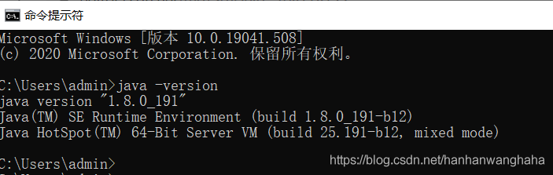
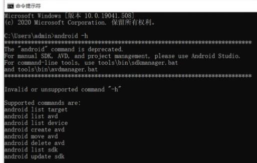
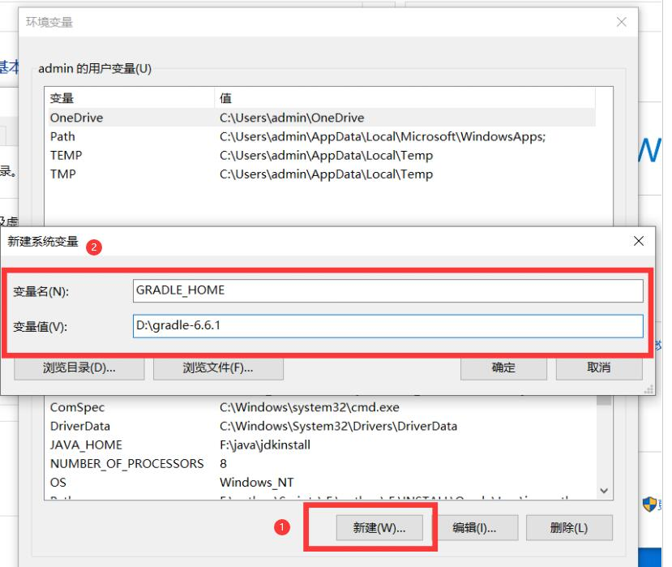
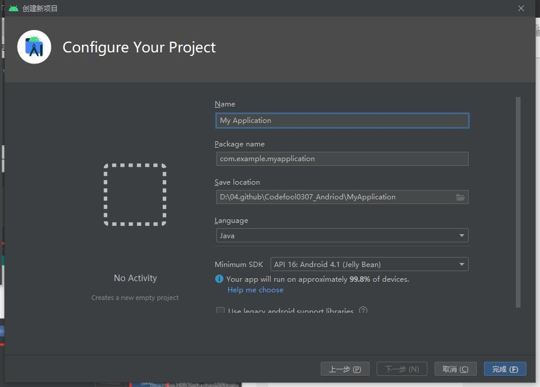
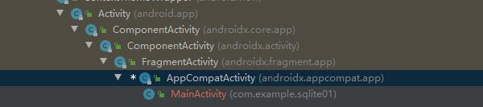
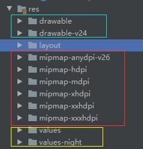

<!--
 * @Author: your name
 * @Date: 2021-01-19 15:41:45
 * @LastEditTime: 2021-03-15 17:08:59
 * @LastEditors: Please set LastEditors
 * @Description: In User Settings Edit
 * @FilePath: \Codefool0307_Blog\docs\7.Andriod\1.Andriodbasic\1.HelloWorld.md
-->
# 1 Andriod初学习

## 1-1：Andriod的系统架构


## 1-2：Andriod相关包与安装

### 1-2-1：JDK安装与配置

<font color=pink size='6'>1.1 首先进入官网下载JDK，必须要进行注册然后才可以下载</font>

<font color=pink size='6'>1.2 下载完成之后，进行一系列的安装，一路next就可以了</font>

<font color=pink size='6'>1.3 安装完成之后，开始配置环境变量了</font>
特别注意的是添加的环境变量一定要`全英文路径`和`没有空格`

右击此电脑，点击属性-->高级系统配置-->环境变量-->新建变量名为：`JAVA_HOME` 变量值为jdk的安装目录


<font color=pink size='6'>1.4 新建系统变量CLASSPATH</font>
点击新建-->变量名-->变量值：`.;%JAVA_HOME%\lib\dt.jar;%JAVA_HOME%\lib\tools.jar;`


<font color=pink size='6'>1.5 在系统变量中，在path中添加</font>

变量值为`%JAVA_HOME%\bin`，


<font color=pink size='6'>1.6 最后就可以打开cmd界面进行显示</font>

输入java -version或者java -V



### 1-2-2：SDK安装与配置

<font color=pink size='6'>1.1 在菜单设置里面，找到Android SDK（可以通过搜索进行查找到）</font>


就可以选择SDK要安装在哪里了（但是要切记不要有`中文路径`和`空格`）


之后可以正常进行安装了，就是费点流量

<font color=pink size='6'>1.2 在菜单项目结构-->8项目里面，添加你想要的SDK</font>


<font color=pink size='6'>1.3 配置环境变量</font>

因为安装完成Android SDK之后，会在相应的文件夹下有tools和platform-tools目录，那么就需要填入到环境变量中去


首先在系统变量中新建系统ANDROID_HOME 系统变量，变量值为你的 Android SDK 根目录路径


再把tools、platform-tools、build-tools目录添加到环境变量path中，


注意的是，有是有使用相对路径，可能AS会出现错误，可能绝对路径比较好用

<font color=pink size='6'>1.4 测试SDK环境是否可以正常使用</font>

 输入android -h，出现图片所示，一般就没问题了



### 1-2-3：gradle下载与配置

<font color=pink size='6'>1.1 gradle包的安装</font>

下载网址：https://gradle.org/releases/

目前我选择的是gradle-6.61

<font color=pink size='6'>1.2 gradle包添加环境变量</font>

依旧如第一部分一样，新建变量名和变量值



还要在path中添加路径


<font color=pink size='6'>1.3 gradle包测试</font>

通过命令窗口输入cmd进行测试

gradle -v


<font color=pink size='6'>1.4 IDEA/AS中添加gradle</font>

在设置中，找到编译,执行，创建(Build,Excecution,Deployment)--->gradle--->输入你想要的地址


### 1-2-4：添加虚拟设备AVD

<font color=pink size='6'>1.1 创建AVD</font>


<font color=pink size='6'>1.2 选择样式</font>

主要是包括尺寸信息等等


注意，这里可能会出现一个`a system image must be selected to continue`报错，那么就需要去设置里面


等待安装完成之后，就可以恢复正常了

## 1-3：Andriod相关理论

1. 四大组件
   - 活动 Acticity
   - 服务 Service
   - 广播接收器 
   - 内容提供器
2. 系统控件
3. SQLite数据库
4. 多媒体
5. 地理位置定位

## 1-4：第一个HelloWorld程序

### 1-4-1：创建项目过程

<font color=red size='6'>1.1 选择Activity</font>


AS/IDEA提供了很多中的内置模块，可以按照需求进行选择



- application name表示应用名称，安装在手机上显示该名称，
- Company Domain表示公司域名

之后可以按照我们选择的模拟器运行程序

## 1-5：分析第一个Android程序

### 1-5-1：Android程序的项目结构


因为AS新建项目都会默认使用Android模式的项目结构，但是可能有时候这种结构看的不是那么好，可以点击Android旁边向下的箭头，选择`project模式`


但是里面的东西确实不少，也是需要看看哪些是我现在就需要的东西，哪些东西是不需要的

### 1-5-2：文件介绍

1. <font color=red size='5'>.gradle和.idea</font>
   这两个目录下放置的是AS自动生成的一些问价你，我们就不用管了
2. <font color=red size='5'>app</font>
   项目的代码、资源都是在这个目录下进行的
   1. ~~<font color=green size='6'>build</font>~~
      这个与外层的buile目录类似，主要是在编译的时候自动生成文件，可以不用关心
   2. <font color=green size='6'>libs</font>
      第三方jar包放在这个目录下边，会自动添加到路径里面去
   3. <font color=green size='6'>androidTest</font>
      主要是对项目进行一些自动化测试
   4. <font color=green size='6'>java</font>
      java代码编写的地方，没什么好说的
   5. <font color=green size='6'>res</font>
      这个目录下面主要是项目中所有的图片、布局、字符串等资源都放在这个目录下，但是每一个都有一个规定好了的文件夹，[详细](https://codefool0307.github.io/Codefool0307_Blog/#/./7.Andriod/1.Andriodbasic/1.HelloWorld?id=_1-5-2%ef%bc%9a%e6%96%87%e4%bb%b6%e4%bb%8b%e7%bb%8d)
   6. <font color=green size='6'>AndroidManifest.xml</font>
      Android项目的配置文件，像程序中定义的所有四大组件都要在这个xml问价那种进行注册，还可以为应用程序添加权限声明。
   7. <font color=green size='6'>test</font>
      项目的自动化测试的一种方式
   8. <font color=green size='6'>.gitignore</font>
      将app模块内的指定的目录或者文件排除在控制之外                
   9. ~~<font color=green size='6'>app.iml</font>~~
      IDEA项目自动生成的文件，不用关心
   10. <font color=green size='6'>build.gradle</font>
       这个是app模块的gradle构建脚本，指定很多项目构建的相关配置，下面会详细进行介绍
   11. <font color=green size='6'>proguard-rules.pro</font>
       用于指定项目代码的混淆规则，因为代码开发成安装包文件，我不想被他人破解，所以将代码进行混淆。
3. <font color=red size='5'>gradle</font>
   包含了gradle wrapper的配置文件，使用gradle wrapper的方式不需要提前将gradle下载好，而是会自动的根据本地的缓存情况决定是否需要联网下载gradle，在设置中的Build，Excecution，Deployment-->Gradle进行配置更改
4. <font color=red size='5'>.gitgnore</font>
   将app模块内的指定的目录或者文件排除在控制之外  
5. <font color=red size='5'>build.gradle</font>
   这个是项目全局模块的gradle构建脚本，指定很多项目构建的相关配置，下面会详细进行介绍
6. <font color=red size='5'>gradle.properties</font>
   全局的gradle配置文件，这个配置的属性将会影响所有的gradle编译脚本
7. <font color=red size='5'>gradlew和gradlew.bat</font>
   主要是在命令串口执行gradle命令使用的，`gradlew`是在linux或者Mac系统使用，`gradlew.bat`是在windows中使用
8. ~~<font color=red size='5'>HelloWorld.iml</font>~~
   iml文件是多有的IDEA项目都会自动生成一个文件，不需要我们关心
9. <font color=red size='5'>local.prperties</font>
   用于指定本机的AndroidSDK的路径，自动生成，不需要我们关心
10. <font color=red size='5'>settings.gradle</font>
   指定项目中所有引入的模块

### 1-5-3：Android启动的次底层逻辑

为什么叫次顶层原因是，我没有从源码的角度去分析，就不算是很底层的逻辑，只是通过各个代码的去分析

开始正题

1. 首先打开Androidmanifest.xml

```java
<?xml version="1.0" encoding="utf-8"?>
<manifest xmlns:android="http://schemas.android.com/apk/res/android"
    package="com.example.sqlite01">

    <application
        android:allowBackup="true"
        android:icon="@mipmap/ic_launcher"
        android:label="@string/app_name"
        android:roundIcon="@mipmap/ic_launcher_round"
        android:supportsRtl="true"
        android:theme="@style/Theme.Sqlite01">
        <activity android:name=".MainActivity">
            <intent-filter>
                <action android:name="android.intent.action.MAIN" />
                <category android:name="android.intent.category.LAUNCHER"/>
            </intent-filter>
        </activity>
    </application>
</manifest>
```

其中，

```java
<activity android:name=".MainActivity">
            <intent-filter>
                <action android:name="android.intent.action.MAIN" />
                <category android:name="android.intent.category.LAUNCHER"/>
            </intent-filter>
</activity>
```
这段代码是对HelloWorldActivity活动进行注册，没有在xml里注册的活动（或者是说没有在xml中注册的组件）是不能够使用的， 然后又通过action和category两个标签进行说明项目的使用方式（在activity这一章进行详细的阐述）

2. 那么注册完成之后，就可以使用Activity，因为Activity是应用中你能够看到的东西，所以就可以使用HelloWorldActivity了，

```java
public class MainActivity extends AppCompatActivity {

    @Override
    protected void onCreate(Bundle savedInstanceState) {
        super.onCreate(savedInstanceState);
        setContentView(R.layout.activity_main);

    }
}
```

那么我们知道了MainActivity是继承自AppCompatActivity，

因为Activity是所有Android的一个活动积累，我们所有的活动必须继承他或者他的子类才能拥有活动的特性，



这个AppCompatActivity是Activity的一个子类，一个向下兼容，可以将Activity在各个系统版本中增加的特性和功能最低兼容到Android 2.1系统，同时，继承AppComatActivity会重写一个onCreate方法，这个是活动被创建时必定要执行的方法，

但是我想把我的内容Hello World显示，

---------------------------------
ps：

查看类结构"alt" + "7"

查看继承关系"ctrl" + "h"

----------------------------------

3. 因为Android是提倡逻辑和试图分离的，因此不会建议直接编写界面的，而是在布局文件（layout）中编写界面，然后活动把它引过来

所以在onCreate（）方法的第二行中，调用了setContentView方法，通过这个方法给当前活动引入了一个layout布局，`但是`，**如何引进来的呢？通过什么指令引进来的呢？**

```java
<?xml version="1.0" encoding="utf-8"?>
<LinearLayout xmlns:android="http://schemas.android.com/apk/res/android"
    xmlns:app="http://schemas.android.com/apk/res-auto"
    xmlns:tools="http://schemas.android.com/tools"
    android:layout_width="match_parent"
    android:layout_height="match_parent"
    tools:context=".MainActivity">

    <TextView
        android:layout_width="wrap_content"
        android:layout_height="wrap_content"
        android:text="Hello World!"
        app:layout_constraintBottom_toBottomOf="parent"
        app:layout_constraintLeft_toLeftOf="parent"
        app:layout_constraintRight_toRightOf="parent"
        app:layout_constraintTop_toTopOf="parent" />

</LinearLayout>
```

4. 那么就需要介绍一下项目中的资源了，
   
   

- drawable 主要是用来放置图片的
- mipmap 主要是用来放置图标的

那么如何引用他呢？比如说res/values/Strings，

```java
<resources>
    <string name="app_name">Sqlite01</string>
</resources>
```

1. 在代码汇总，通过R.string.app_name可以获得该字符串的引用
2. 在xml中通过@string/app_name可以获得该字符串的引用

注：`string部分`可以替换的，

5. 一旦我们我们想要导入的包不是本地的，那么我们就需要使用build.gradle来进行


## 1-6：日志工具——Log

Android的日志工具类是Log，一共提供了五个方法可以打印日志，级别由低到高分别是

```java
1.Log.v()：打印一些最为繁琐、意义不大的日志信息
2.Log.d()：打印一些调试信息(logd+tab)
3.Log.i()：打印一些比较重要的数据，可帮助你分析用户行为数据（logi+tab）
4.Log.w()：打印一些警告信息，提示程序该处可能存在的风险(logw+tab)
5.Log.e()：打印程序中的错误信息(loge+tab)
```

那么除了Log可以实现过滤器的功能，俺么我们还可以通过logcat（AS功能）来进行实现，


