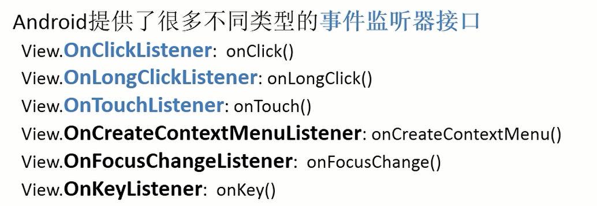

<!--
 * @Author: your name
 * @Date: 2021-03-01 16:15:55
 * @LastEditTime: 2021-03-09 16:30:30
 * @LastEditors: Please set LastEditors
 * @Description: In User Settings Edit
 * @FilePath: \docs\7.Andriod\1.Andriodbasic\3.UI开发.md
-->
# 1.UI的理解

UI顾名思义就是用户界面，

## 1-1：View和ViewGroup

那么我们来看看UI类，在Android系统中，所有的UI类都是建立在View和ViewGroup基础上的，按照Andriod官方给定的View和ViewGroup的理解来看，~~ViewGroup作为布局容器类的最上层，布局容器里面又可以有View和ViewGroup。而ViewGroup是容纳View及其派生类的容器，ViewGroup也是从View派生出来的~~

我是看不明白了，后来我在CSDN找到了一个[作者感恩的心_Dream](https://blog.csdn.net/u014225510/article/details/45936485?utm_medium=distribute.pc_relevant.none-task-blog-BlogCommendFromMachineLearnPai2-3.control&dist_request_id=&depth_1-utm_source=distribute.pc_relevant.none-task-blog-BlogCommendFromMachineLearnPai2-3.control)写的帖子中，大体有了一个基本的了解，

Activity是一个工人，他来控制窗口（window），window他就只是一个简单的显示屏，显示信息，View就是要显示在显示屏的信息，这些View都是层层重叠在一起放在，xml布局是生成View的原料，那么既然是原料他就不能直接使用，需要通过ViewGrouup来进行添加操作

### 1-1-1：View的api


## 1-2：UI的组成

1. layout（布局）
2. 各个UI组件

注意：应用组件与UI组件是不一样的，应用组件在Android中共有四大类，而UI组件更多的可以理解为是一个视图

## 1-3：UI事件

当用户通过触摸UI的时候，系统会自动创建对应的event对象，
Android提供了多种处理事件的方式



其中比较重要的是前三个，后续会对事件监听器进行详细阐述

那么我们就开始看看什么是事件？什么是事件源？什么是事件监听器？

- 事件就是发生了什么事情?比如说长按了某个按键
- 事件源就是事件发生在谁身上？


# 2.常用控件

## 2-0：常用的控件使用方法

## 2-1：TextView文本视图

我们来看看TextView的一些常用属性，就可以对其有了很基本的了解了

首先继续创建我们项目过程（如忘记，请看2.activity）

我们先设计好布局文件，

```html
<TextView
        android:id="@+id/textView"
        android:layout_width="match_parent"
        android:layout_height="wrap_content"
        android:gravity="center"
        android:textSize="24sp"
        android:textColor="#00f"
        android:text="1.文本显示" />
```

展示效果就是：


1. android：id，他是给当前空间定义了一个唯一标识符（也就是身份证）
2. android:layout_width和android:layout_height指定了空间的宽度和高度，有三个可选值
   - match_parent:父布局决定当前控件大小,**官方推荐**
   - fill_parent:与match_parent意义一样
   - wrap_parent:空间内容决定当前控件大小
3. android：text 用来置顶显示的文本内容，但是因为TextView默认是居左上角对齐
4. android：gravity 用来指定文字的对齐方式
   - top
   - bottom
   - center
   - 等等
5. android：textSize指定文字的大小，单位是sp
6. android：textColor指定文字的颜色

## 2-2：EditText

可以通过在空间里输入和编辑内容，比如说qq、微信等用的最为频繁

```html
<EditText
        android:id="@+id/edit_query"
        android:layout_width="match_parent"
        android:layout_height="wrap_content"
        android:hint="请输入内容"
        android:inputType="phone"
        android:maxLines="2"
        />
```

展示效果就是：


7. android:hint指定一段提示的文本
8. android:inputType指定输入的类型
9. android:maxLines最大行数，超过最大行数，文本就会向上滚动

## 2-3：Button按键

```html
<Button
        android:id="@+id/button"
        android:layout_width="match_parent"
        android:layout_height="wrap_content"
        android:text="Button"
        android:textAllCaps="false"
        />
```
展示效果就是：


10. android:textAllCaps系统会对所有英文字母进行自动大写转换

<hr>

button更多的是与其他空间一起使用的，那么我就结合EditText一起使用，

功能描述：希望点击Button，能够进入打电话界面

```java

public class FirstActivity extends AppCompatActivity implements View.OnClickListener {

    private EditText edit;
    @Override
    protected void onCreate(Bundle savedInstanceState) {
        super.onCreate(savedInstanceState);
        setContentView(R.layout.first_layout);
        Button button = (Button)findViewById(R.id.button);
        edit = (EditText)findViewById(R.id.edit_query);
        button.setOnClickListener(this);
    }

    @Override
    public void onClick(View v) {
        String action = "android.intent.action.DIAL";//
        action = Intent.ACTION_DIAL;//一样的
        //注意了，隐式Intent中，action和category必须保持一致，因为action只能有一个，所以在这里要重新进行定义他的新功能
        Intent intent = new Intent(action);
        String number = edit.getText().toString();
        intent.setData(Uri.parse("tel:"+number));
        startActivity(intent);
    }
}
```
注意：
在这里有一个新的方法：

```java
getText() 获取输入的内容
```

## 2-4：ImageView展示图片

```html
<ImageView
        android:id="@+id/imageView"
        android:layout_width="wrap_content"
        android:layout_height="wrap_content"
        android:src="@mipmap/ic_launcher"
         />
```

展示效果就是：


11. android:src 指定图片，as自带了默认的图片
12. android:background 指定背景

<hr>

功能描述：当我点击一下按键的时候，图片会进行变化

```java
 @Override
    public void onClick(View v) {
        switch (v.getId()){
            case R.id.button:
                imageView.setImageResource(R.drawable.ic_launcher_background);
                break;
            default:
                break;
        }
    }
```
注意：

常用方法：

```java
setImageResource(int resid) 设置图片
setBackgroundResource(int resid) 设置背景图片
```

## 2-5：多选框

```html
<CheckBox
        android:id="@+id/checkBox"
        android:layout_width="wrap_content"
        android:layout_height="wrap_content"
        android:checked="true"
        android:text="football" />

    <CheckBox
        android:id="@+id/checkBox2"
        android:layout_width="wrap_content"
        android:layout_height="wrap_content"
        android:text="basketball" />

    <CheckBox
        android:id="@+id/checkBox4"
        android:layout_width="wrap_content"
        android:layout_height="wrap_content"
        android:text="volleyball" />
```

展示效果就是：


11. android:checked指定复选框是否选择上

<hr>

常用方法：

```java
boolean isChecked() 判断是否已经勾选了
void setChecked(boolean checked) 判断checkBox是否勾选
void setOnCheckedChangeListener(OnCheckedChangerListener listener) 设置选中状态改变的监听
```

功能描述：当我点击复选框，可以进行提示信息

```java
@Override
    protected void onCreate(Bundle savedInstanceState) {
        super.onCreate(savedInstanceState);
        setContentView(R.layout.first_layout);
        checkBox=(CheckBox)findViewById(R.id.checkBox);
        //20210302 19:45
        checkBox.setOnCheckedChangeListener(new CompoundButton.OnCheckedChangeListener() {
            @Override
            public void onCheckedChanged(CompoundButton buttonView, boolean isChecked) {
               if (isChecked==true){
                   Toast.makeText(FirstActivity.this,"已经勾选了",Toast.LENGTH_SHORT).show();
               }
            }
        });
    }
```

## 2-6：单选框

```html
<RadioGroup
        android:layout_width="match_parent"
        android:layout_height="match_parent" >

        <RadioButton
            android:id="@+id/radioButton"
            android:layout_width="match_parent"
            android:layout_height="wrap_content"
            android:text="RadioButton" />
    </RadioGroup>
```

## 2-7：ProgressBar进度条

```html
<ProgressBar
        android:id="@+id/progressBar"
        style="?android:attr/progressBarStyle"
        android:layout_width="match_parent"
        android:layout_height="wrap_content" />
```
展示效果就是：


12. style 指定选择的类型
13. android：visibility 指定控件的可见属性
    - visible 可见，是默认值
    - invisible 不可见，但是仍然占据原来的位置
    - gone 不仅不可见，而且不占用任何屏幕的地方
14. android:max 在变成水平进度条后，给进度条设置一个最大值

常用方法：

```java
void setProgress(int progress) 设置当前的进度
int getProgress() 得到当前进度
void setMax(int max) 设置最大进度
int getMax()设置或者得到最大进度
getVisibility()判断ProgressBar是否可见
----------------------------------------------------
void setVisblity(int visiblity)设置视图的可见性
View.VISIBLE 
View.INVISIBLE 
View.GONE
```

功能描述：当我点击button的时候，控件消失,再次点击，控件出现

```java
@Override
    public void onClick(View v) {
        switch (v.getId()){
            case R.id.button:
                if (progressBar.getVisibility()==View.GONE){
                    progressBar.setVisibility(View.VISIBLE);
                }else{
                    progressBar.setVisibility(View.GONE);
                }
                break;
            default:
                break;
        }
    }
```

功能描述：点击button，进度+10

```java
@Override
    public void onClick(View v) {
        switch (v.getId()){
            case R.id.button:
                int progress = progressBar.getProgress();
                progress = progress+ 10;
                progressBar.setProgress(progress);
                break;
            default:
                break;
        }
    }
```

## 2-8：SeekBar可移动滑动条

```html
<SeekBar
        android:id="@+id/seekBar"
        android:layout_width="match_parent"
        android:layout_height="wrap_content" />
```
展示效果就是：


常用方法：

```java
setOnSeekBarChangeListener(OnSeekBarChangeListener i) 设置改变的监听
onProgressChanged(SeekBar seekBar, int progress, boolean fromUser):进度改变
onStartTrackingTouch(SeekBar seekBar):按下滑杆
onStopTrackingTouch(SeekBar seekBar):从滑杆离开
```

## 2-9：AlertDialog对话框

常用方法

```java
show() :显示警告框
由于没有公开的构造方法,只能通过其内部类Builder来创建AlertDialog.Builder:
create():创建AlertDialog对象
show():创建AlertDialog对象，同时将其显示出来setTitle(CharSequence title):设置标题
setTitle(message)设置标题
setMessage(CharSequence message):设置内容
setPositiveButton(String text, OnClickListener listener):设置正面按钮
setNegativeButton(String text, OnClickListener listener):设置负面按钮
dismiss():移除dialog
setCancelable(boolean cancelable) 
setItems(items, OnClickListener listener)单选框
setSingleChoiceItems(items, 数组, OnClickListener listener) 单选框（有箭头）
```    

功能描述：展示对话框

```java
@Override
    public void onClick(View v) {
        switch (v.getId()){
            case R.id.button:
                AlertDialog.Builder dialog = new AlertDialog.Builder(FirstActivity.this);
                dialog.setTitle("选择")
                        .setMessage("是否正确")
                        .setCancelable(false)
                        .setPositiveButton("ok", new DialogInterface.OnClickListener() {
                            @Override
                            public void onClick(DialogInterface dialog, int which) {

                            }
                        });
                dialog.setNegativeButton("cancle",new DialogInterface.OnClickListener() {
                    @Override
                    public void onClick(DialogInterface dialog, int which) {

                    }
                });
                  dialog.create().show();
                break;
            default:
                break;
        }
    }
```

## 2-9：ProgressDialog对话进度框

基本与上面类似，

常用方法：
```java

```

## 2-10：ListView

ListView是目前最常用的控件，因为手机屏幕空间有限，能够一次性在屏幕上显示的内容是有限的，当我们的程序有大量的数据需要展示的时候，ListView可以允许用户用过手指上下滑动的方式将屏幕外（可以这么理解，就是在下方或者上方的内容）滚动的屏幕内，最常用的就是QQ聊天记录，微博等等

### 2-10-1：ListView简单使用

1. 在布局中加入ListView控件

```html
<LinearLayout xmlns:android="http://schemas.android.com/apk/res/android"
    android:orientation="vertical" android:layout_width="match_parent"
    android:layout_height="match_parent">

    <ListView
        android:id="@+id/list_view"
        android:layout_width="match_parent"
        android:layout_height="match_parent" />
</LinearLayout>
```

2. 显示

```java
public class FirstActivity extends AppCompatActivity {
   private String[] data={"apple","Banana","orange","Watermelon","pear","Grape","pineapple",
           "strawberry","cherry","Mango","apple","Banana","orange","Watermelon","pear","Grape","pineapple",
           "strawberry","cherry","Mango"};
     @Override
    protected void onCreate(Bundle savedInstanceState) {
        super.onCreate(savedInstanceState);
        setContentView(R.layout.first_layout);
         ListView listView = (ListView)findViewById(R.id.list_view);
         ArrayAdapter<String> adapter = new ArrayAdapter<String>(FirstActivity.this,
                 android.R.layout.simple_list_item_1,data);
        listView.setAdapter(adapter);
     }
}
```

注：
1. 因为我们读取的数据是无法直接传递给ListView的，所以我们需要借助<font color="red" size='4'>适配器</font>来完成，Android提供了很多<font color="red" size='4'>适配器</font>的实现类，本次使用ArrayAdapter,只简单介绍一下，后续会讲一下

```java
ArrayAdapter(Context context, int resource)
context:当前的上下文，不能为null
resource:布局的资源ID，实例化视图是TextView
```

ListView的常用方法

```java
setAdapter() 把数据传输进去
```

### 2-10-2：定制ListView界面


## 2-11：RecyclerView

ListView如果不提升他的运行效率，那么性能就会变的非常差，而且他只能实现纵向滚动，无法实现横向滚动

再次基础上就推出了RecyclerView

# 3.自定义控件

当系统自带的控件无法满足我们的使用需求的时候，可以自己进行创建控件

## 3-1：引入布局

因为如果在每个活动的布局中都写一遍同样的标题栏代码，会导致大量的重复代码，所以可以使用布局的方式来解决这个问题

1. 首先创建一个title.xml,

```html
<LinearLayout xmlns:android="http://schemas.android.com/apk/res/android"
    xmlns:app="http://schemas.android.com/apk/res-auto"
    xmlns:tools="http://schemas.android.com/tools"
    android:orientation="horizontal"
    android:layout_width="match_parent"
    android:layout_height="match_parent"
    tools:context=".MainActivity">

    <Button
        android:id="@+id/button4"
        android:layout_width="0dp"
        android:layout_height="wrap_content"
        android:layout_weight="1"
        android:text="返回" />

    <TextView
        android:id="@+id/textView2"
        android:layout_width="0dp"
        android:layout_height="wrap_content"
        android:layout_weight="2"
        android:gravity="center"
        android:text="设置内容" />

    <Button
        android:id="@+id/button5"
        android:layout_width="0dp"
        android:layout_height="wrap_content"
        android:layout_weight="1"
        android:text="退出" />
</LinearLayout>
```

2. 在activity_main.xml中使用include引入

```html
<LinearLayout xmlns:android="http://schemas.android.com/apk/res/android"
    xmlns:app="http://schemas.android.com/apk/res-auto"
    xmlns:tools="http://schemas.android.com/tools"
    android:orientation="horizontal"
    android:layout_width="match_parent"
    android:layout_height="match_parent"
    tools:context=".MainActivity">

    <include layout="@layout/title"/>
</LinearLayout>
```
那么结果可以进行展示


那么我还是想把系统自带的标题栏隐藏掉，可以使用ActionBar的相应方法（会在后续讲解）

3. 隐藏默认的标题栏

```java
public class MainActivity extends AppCompatActivity {

    @Override
    protected void onCreate(Bundle savedInstanceState) {
        super.onCreate(savedInstanceState);
        setContentView(R.layout.activity_main);
        ActionBar bar = getSupportActionBar();
        if (bar!=null){
            bar.hide();
        }
    }
}
```

## 3-2：自定义控件

那么自定义布局已经完成了，我可以通过include的方法进行，那么我要给控件上加入事件监听

1. 首先创建一个TitleLayout继承LinearLayout

```java
public class TitleLayout extends LinearLayout {

    public TitleLayout(Context context, AttributeSet attrs) {
        super(context, attrs);
        LayoutInflater.from(context).inflate(R.layout.title,this);
        Button backButton = (Button)findViewById(R.id.back);
        Button editButton = (Button)findViewById(R.id.edit);
        backButton.setOnClickListener(new OnClickListener() {
            @Override
            public void onClick(View v) {
                ((Activity)getContext()).finish();
            }
        });
        editButton.setOnClickListener(new OnClickListener() {
            @Override
            public void onClick(View v) {
                Toast.makeText(getContext(),"编辑内容",Toast.LENGTH_SHORT).show();
            }
        });
    }
}
```

2. 同时把我们已经写好的事件监听器放入到布局当中

```html
<com.example.ui03.TitleLayout
        android:layout_width="match_parent"
        android:layout_height="match_parent"/>
```

# 4.常用布局

## 4-1：LinearLayout线性布局

这种布局，所有的空间在线性方向上依次排列，线性方向可能是水平方向上也可能是垂直方向上

但是之前的都是通过一个属性来确定了排列的方向

15. android：orientation指定排列方向
    - vertical垂直
    - horizontal水平，默认的排列方向
16. android：layout_gravity指定控件在布局中的对齐方式(那么android：gravity是文字的对齐方式)
17. android：layout_weight允许我们使用比例的方式来指定控件的大小

```html
<EditText
        android:id="@+id/editTextNumber"
        android:layout_width="0dp"
        android:layout_height="wrap_content"
        android:layout_weight="1"
        android:ems="10"
        android:inputType="number" />

    <Button
        android:id="@+id/button"
        android:layout_width="wrap_content"
        android:layout_height="wrap_content"
        android:text="Send" />
```

注意：
1. 为什么把EditText宽度设置为0dp，还能显示?
   
   因为使用了android：layout_weight属性，这个时候控件的宽度就是这个属性才进行控制了

2. EditText和Button都添加了android:layout_weight="1"，那么为什么会评分屏幕宽度呢？
   
   因为系统会先把LinearLayout所有的空间指定的layout_weight值相加，得到一个总值，然后每个控件所占大小的比例就是用该控件的layout_weight值除以刚才算的总值。
   
3. 如果自己调试界面会显得很麻烦，有没有更加简单的方式？

## 4-2：RelativeLayout相对布局

它可以通过<font color="red" size='4'>相对定位的方式</font>让控件出现在布局的任何位置

那么相对定位肯定是要有参考系的，要么以父布局，要么以控件等等

1. 以父布局

```java
    android:layout_centerHrizontal  水平居中 
    android:layout_centerVertical 垂直居中 
    android:layout_centerInparent    相对于父元素完全居中 
    android:layout_alignParentBottom 位于父元素的下边缘 
    android:layout_alignParentLeft   位于父元素的左边缘 
    android:layout_alignParentRight  位于父元素的右边缘 
    android:layout_alignParentTop    位于父元素的上边缘 
    android:layout_alignWithParentIfMissing  如果对应的兄弟元素找不到的话就以父元素做参照物
```


2. 相对控件

```java
    android:layout_below      位于元素的下方 
    android:layout_above      位于元素的的上方 
    android:layout_toLeftOf   位于元素的左边 
    android:layout_toRightOf  位于元素的右边 

    android:layout_alignTop   该元素的上边缘和某元素的的上边缘对齐 
    android:layout_alignLeft  该元素的左边缘和某元素的的左边缘对齐 
    android:layout_alignBottom 该元素的下边缘和某元素的的下边缘对齐 
    android:layout_alignRight  该元素的右边缘和某元素的的右边缘对齐 
-----以上的属性值必须为id的引用名“@id/id-name” ---------------------------------

-----给属性赋予像素值----------------------------------------------------------
    android:layout_marginBottom      底边缘的距离 
    android:layout_marginLeft           左边缘的距离 
    android:layout_marginRight         右边缘的距离 
    android:layout_marginTop           上边缘的距离
```
3. margin与padding

```java
margin 是相对越控件来说向偏移
padding 是相对于控件内部元素的边界填充
```


功能描述：


## 4-23：FrameLayout帧布局

帧布局默认所有的空间都会摆放在左上角

## 4-4：百分比布局

因为比如说只有在LinearLayout可以使用Layout_weight属性来实现按照比例指定控件大小

但是相对布局和帧布局却不支持，所以Android引入了一个全新的布局方式来解决这个问题，就是百分比布局，允许直接指定空间在布局汇总所占的百分比，但是注意，百分比布局只能给相对布局和帧布局使用

但是百分比布局属于新增布局，想要所有的Android使用，

1. 首先要把百分比布局定义子啊support库中，也就是只需要在项目的build.gradle中添加百分比布局库的依赖

```java
dependencies {

    implementation 'androidx.appcompat:appcompat:1.1.0'
    implementation 'com.google.android.material:material:1.1.0'
    testImplementation 'junit:junit:4.+'
    compile 'com.android.support:percent:24.2.1'
    androidTestImplementation 'androidx.test.ext:junit:1.1.1'
    androidTestImplementation 'androidx.test.espresso:espresso-core:3.2.0'
}
```

2. 可以在项目中进行使用了

```java
```


# 5.练习


<font color="red" size='4'></font>

<font color="red" size='4'></font>
<font color="red" size='4'></font>
<font color="red" size='4'></font>
<font color="red" size='4'></font>
<font color="red" size='4'></font>
<font color="red" size='4'></font>