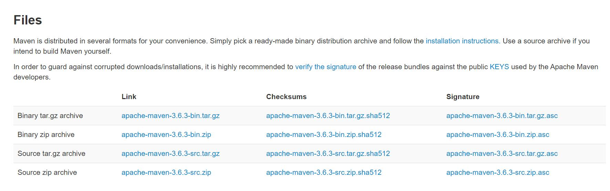
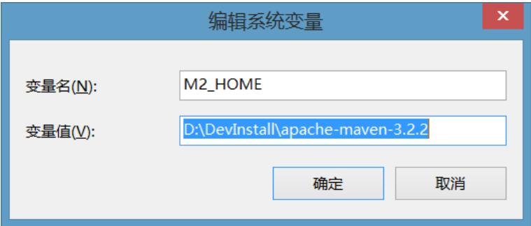
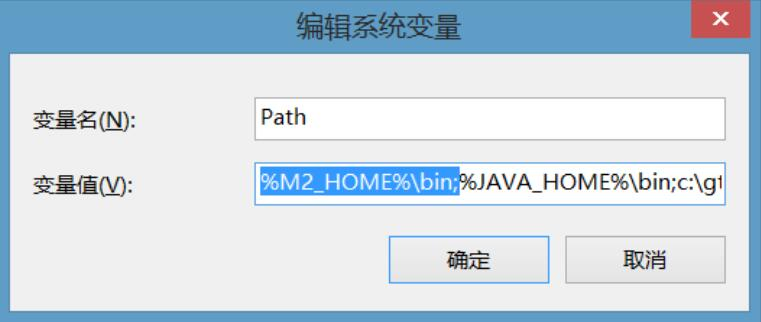
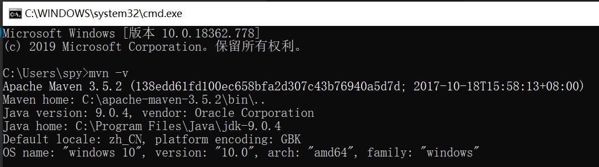
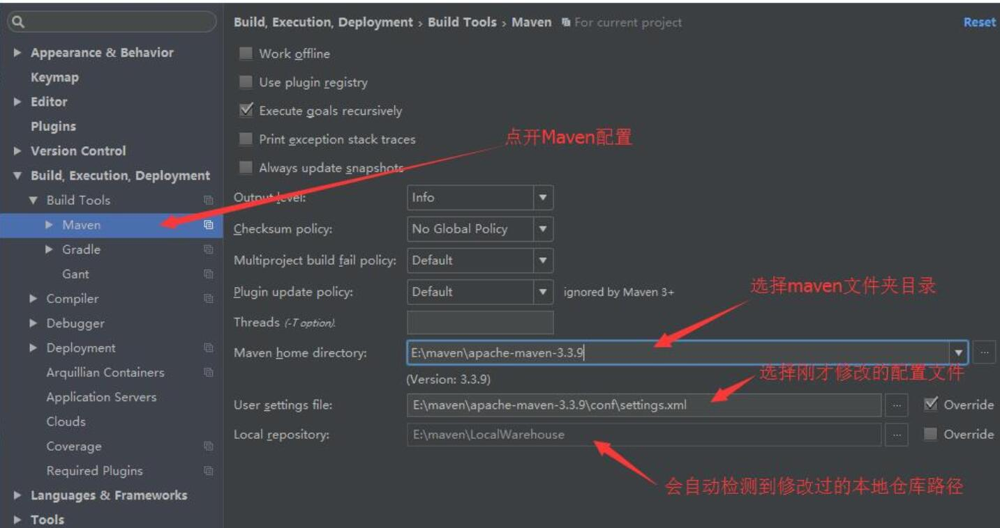

# 1 Maven配置

# 1.1 Maven安装

1. 从官网下载[apache-maven](http://maven.apache.org/download.cgi)



2. 将maven放入到没有中文没有空格的文件夹（最好是系统盘，有时候可能不好用）

3. 到环境变量设置MAVEN_HOME 



4. 配置 path 环境变量



5. 最后在本机调试是否安装成功：mvn -v



6. 设置仓库，这里有两种办法：

* 方法一：查找到本地Maven安装包到conf\settings.xml下进行修改
  <localRepository>包的安装位置<localRepository>

同时需要下载一个本地仓库，随着更新还要不断更新，这样就会造成文件太大，还有就是更新可能失败，亲身体验，太难受了。

* 方法二：还是查找到本地Maven安装包到conf\settings.xml下进行修改

```java
<mirrors>
        <mirror>  
            <id>alimaven</id>  
            <name>aliyun maven</name>  
            <url>http://maven.aliyun.com/nexus/content/groups/public/</url>  
            <mirrorOf>central</mirrorOf>          
        </mirror>  
      </mirrors>
```

这样就可以使用我大阿里的源了。快速了很多。

# 1.2 IDEA配置Maven

一图到手，解决所有



