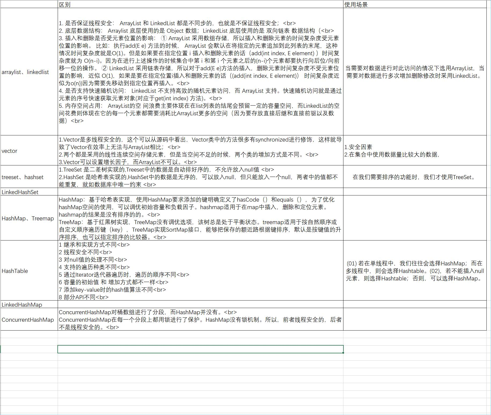

# 面经总结

总结牛客网、个人实习遇到的知识点

<!-- TOC -->

- [面经总结](#面经总结)
- [1.java基础-数据类型-8种常见类型](#1java基础-数据类型-8种常见类型)
    - [问题1：八种数据类型是什么？](#问题1八种数据类型是什么)
    - [问题2：为什么byte类型是-128~+127](#问题2为什么byte类型是-128127)
    - [问题3：java为什么除了基本数据类型还要有引用数据类型](#问题3java为什么除了基本数据类型还要有引用数据类型)
    - [问题4：什么是单精度和双精度？](#问题4什么是单精度和双精度)
- [2.java基础-数据类型-自动拆装箱](#2java基础-数据类型-自动拆装箱)
    - [问题1：为什么要有自动拆装箱](#问题1为什么要有自动拆装箱)
    - [问题2：Integer缓存机制](#问题2integer缓存机制)
    - [问题3：自动拆装箱相对应的程序问题：](#问题3自动拆装箱相对应的程序问题)
    - [问题4：Integer的源码分析](#问题4integer的源码分析)
    - [问题5：自动拆装箱的原理与使用场景](#问题5自动拆装箱的原理与使用场景)
    - [问题6：自动拆装箱带来的问题](#问题6自动拆装箱带来的问题)
- [3.java基础-语法](#3java基础-语法)
- [4.java基础-关键字-static](#4java基础-关键字-static)
    - [问题1：static的使用场景](#问题1static的使用场景)
- [5.java基础-关键字-final](#5java基础-关键字-final)
    - [问题1：final使用场景](#问题1final使用场景)
- [6.java基础-关键字-this和super](#6java基础-关键字-this和super)
    - [问题1：this、super不能用在static方法中。](#问题1thissuper不能用在static方法中)
- [7. java基础-集合-map](#7-java基础-集合-map)
    - [问题1：HashMap 的底层实现](#问题1hashmap 的底层实现)
    - [问题2：扰动函数以及作用](#问题2扰动函数以及作用)
    - [问题3： 拉链法](#问题3-拉链法)
    - [问题4：HashMap 的 put 操作](#问题4hashmap 的 put 操作)
    - [问题5：hashmap的hash函数以及常用方法](#问题5hashmap的hash函数以及常用方法)
    - [问题6：hashmap树化门槛及作用](#问题6hashmap树化门槛及作用)
    - [问题7：hashmap性能提升作用和好处](#问题7hashmap性能提升作用和好处)
    - [问题8：hashmap的特性](#问题8hashmap的特性)
    - [问题9：java8为什么要对hashmap进行改造，用红黑树替代](#问题9java8为什么要对hashmap进行改造用红黑树替代)
    - [问题10：HashMap 的扩容机制](#问题10hashmap 的扩容机制)
    - [问题11：加入hashmap有100w个元素，第二维链表的长度是多少](#问题11加入hashmap有100w个元素第二维链表的长度是多少)
    - [问题12：请解释一下HashMap的参数loadFactor，它的作用是什么？](#问题12请解释一下hashmap的参数loadfactor它的作用是什么)
    - [问题13：HashMap的树化门槛为什么是8](#问题13hashmap的树化门槛为什么是8)
    - [问题14：HashMap的扩容因子为什么是0.75](#问题14hashmap的扩容因子为什么是075)
    - [问题15: 为什么默认初始化桶数组大小为16](#问题15-为什么默认初始化桶数组大小为16)
    - [问题16: hashMap是否线程安全](#问题16-hashmap是否线程安全)
    - [问题17：线程安全的Map](#问题17线程安全的map)
    - [问题18：ConcurrentHashMap 的底层实现，怎么做到线程安全的](#问题18concurrenthashmap 的底层实现怎么做到线程安全的)
    - [问题19：hashtable如何保持线程安全](#问题19hashtable如何保持线程安全)
    - [问题20：为何会出现ConcurrenHashMap?](#问题20为何会出现concurrenhashmap)
    - [问题21：hashmap为什么是2的秘方次](#问题21hashmap为什么是2的秘方次)
    - [问题22：hashmap的多线程导致死循环](#问题22hashmap的多线程导致死循环)
    - [问题23：java8中map相关红黑树引用背景](#问题23java8中map相关红黑树引用背景)
    - [问题24：hashmap的扩容机制](#问题24hashmap的扩容机制)
    - [问题25：hashcode与equals](#问题25hashcode与equals)
    - [问题26：==与equals的区别](#问题26与equals的区别)
- [8.java基础-集合-Collection](#8java基础-集合-collection)
- [8-1 java基础-集合-Collection-list](#8-1-java基础-集合-collection-list)
    - [问题1：ArrayList数组长度的大小机制](#问题1arraylist数组长度的大小机制)
    - [问题2：arraylist扩容机制](#问题2arraylist扩容机制)
    - [问题3：遍历删除arraylist元素](#问题3遍历删除arraylist元素)
- [8-2 java基础-集合-Collection-set](#8-2-java基础-集合-collection-set)
    - [问题1：set的不变形](#问题1set的不变形)
- [9 java基础-集合-Collections](#9-java基础-集合-collections)
    - [问题1：Collection和collections区别](#问题1collection和collections区别)
    - [问题2：Collection如何迭代](#问题2collection如何迭代)
    - [问题3：Enumeration和itrator区别](#问题3enumeration和itrator区别)
    - [问题4：comparable 和 Comparator的区别](#问题4comparable-和-comparator的区别)
    - [问题5：](#问题5)
- [10 java基础-集合-Arrays](#10-java基础-集合-arrays)
    - [问题1：arrays.aslist获取的list使用注意](#问题1arraysaslist获取的list使用注意)
- [11 java基础-集合-集合大比较（区别和使用场景）](#11-java基础-集合-集合大比较区别和使用场景)
    - [问题1：set和list、map的区别](#问题1set和listmap的区别)
    - [问题2：区别和适用场景](#问题2区别和适用场景)
- [12 java基础-IO](#12-java基础-io)
    - [问题1：为何还要有字符流](#问题1为何还要有字符流)
    - [问题2：BIO\NIO\AIO区别与用法](#问题2bio\nio\aio区别与用法)
    - [问题3：同步、异步](#问题3同步异步)
    - [问题4：阻塞、非阻塞](#问题4阻塞非阻塞)
    - [问题5：同步、非同步、阻塞、非阻塞](#问题5同步非同步阻塞非阻塞)
    - [问题6：linux的5种IO模型](#问题6linux的5种io模型)

<!-- /TOC -->

# 1.java基础-数据类型-8种常见类型
## 问题1：八种数据类型是什么？

字符型
char

布尔型
boolean

数值型
1.整型：byte、short、int、long

2.浮点型：float、double

特别注意：String不是基本数据类型，是引用类型。

## 问题2：为什么byte类型是-128~+127

## 问题3：java为什么除了基本数据类型还要有引用数据类型

引用数据类型是在堆里，基本数据类型在栈里
栈所占空间小而且连续，常用来存储缓存
引用数据类型需要多一次解引用，而且还要存储对象头，这样对于基本数据类型

## 问题4：什么是单精度和双精度？
单精度浮点数在计算机存储器中占用4个字节（32 bits），
双精度浮点数(double)使用 64 位（8字节） 来存储一个浮点数。

# 2.java基础-数据类型-自动拆装箱
## 问题1：为什么要有自动拆装箱

比如说集合类中，要求元素必须是Object类，而int、double等基本数据类型无法使用，那么我们就把基本数据类型包装起来，使其具有对象的特征，并让他有了属性和方法

## 问题2：Integer缓存机制

Integer对小数据（-128~=127）具有缓存机制，当jvm在初始化的时候，如果数据是小数据，那么就会把数据存储在本地内存当中，当下次使用的时候，如果属于小数据，那么就可以直接从本地内存进行调用，就不需要再次创建对象来进行姐姐

## 问题3：自动拆装箱相对应的程序问题：
1.创建对象，那么必定不相等，

## 问题4：Integer的源码分析
1. 其中会有一个valueof函数，用来判断内存中是否有着这个数值，
    * 如果说有，那么直接从内存进行读取
    * 如果说没有，那么就需要创建一个对象
2. 在jvm初始化的时候，低值是不能改变的，但是高值是可以改变的，可以通过jvm进行参数设置
3. 不仅在Integer源码这样分析，其他的也这样分析
   
    有ByteCache用于缓存Byte对象
    有ShortCache用于缓存Short对象
    有LongCache用于缓存Long对象
    有CharacterCache用于缓存Character对象

但是除了Integer以外，这个范围高值、低值都是不能改变。

## 问题5：自动拆装箱的原理与使用场景
 1. 原理：自动装箱都是通过包装类的valueOf()方法来实现的.自动拆箱都是通过包装类对象的xxxValue()来实现的。
 2. 使用场景：
    场景一、将基本数据类型放入集合类
    场景二、包装类型和基本类型的大小比较
    场景三、包装类型的运算
    场景四、三目运算符的使用如果i是包装类，j是null就会NPE报错
    场景五、函数参数与返回值

## 问题6：自动拆装箱带来的问题

1. 包装对象的数值比较，不能简单的使用==，虽然-128到127之间的数字可以，但是这个范围之外还是需要使用equals比较。

2. 如果包装类对象为null，那么自动拆箱时就有可能抛出NPE。

3. 如果一个for循环中有大量拆装箱操作，会浪费很多资源。
 
引申：==与equals的区别[]

# 3.java基础-语法

# 4.java基础-关键字-static
## 问题1：static的使用场景

1. 修饰成员变量和成员方法: 被 static 修饰的成员属于类，不属于单个这个类的某个对象，被类中所有对象共享，可以并且建议通过类名调用。被static 声明的成员变量属于静态成员变量，静态变量 存放在 Java 内存区域的方法区。调用格式：类名.静态变量名 类名.静态方法名()
   
2. 静态代码块: 静态代码块定义在类中方法外, 静态代码块在非静态代码块之前执行(静态代码块—>非静态代码块—>构造方法)。 该类不管创建多少对象，静态代码块只执行一次.静态代码块可能在第一次new的时候执行，但不一定只在第一次new的时候执行。比如通过 Class.forName("ClassDemo")创建 Class 对象的时候也会执行。
   
3. 静态内部类（static修饰类的话只能修饰内部类）： 静态内部类与非静态内部类之间存在一个最大的区别: 非静态内部类在编译完成之后会隐含地保存着一个引用，该引用是指向创建它的外围类，但是静态内部类却没有。没有这个引用就意味着：1. 它的创建是不需要依赖外围类的创建。2. 它不能使用任何外围类的非static成员变量和方法。
   
4. 静态导包(用来导入类中的静态资源，1.5之后的新特性): 格式为：import static 这两个关键字连用可以指定导入某个类中的指定静态资源，并且不需要使用类名调用类中静态成员，可以直接使用类中静态成员变量和成员方法。

# 5.java基础-关键字-final
## 问题1：final使用场景

1. 对于一个final变量，
   * 如果是基本数据类型的变量，则其数值一旦在初始化之后便不能更改；
   * 如果是引用类型的变量，则在对其初始化之后便不能再让其指向另一个对象。

2. 当用final修饰一个类时，表明这个类不能被继承。final类中的所有成员方法都会被隐式地指定为final方法。

3. 使用final方法的原因有两个。第一个原因是把方法锁定，以防任何继承类修改它的含义；第二个原因是效率。类中所有的private方法都隐式地指定为final。

# 6.java基础-关键字-this和super
## 问题1：this、super不能用在static方法中。

被 static 修饰的成员属于类，不属于单个这个类的某个对象，被类中所有对象共享。而 this 代表对本类对象的引用，指向本类对象；而 super 代表对父类对象的引用，指向父类对象；所以， this和super是属于对象范畴的东西，而静态方法是属于类范畴的东西。

# 7. java基础-集合-map
## 问题1：HashMap 的底层实现
1. JDK1.8 之前 HashMap 底层是数组和链表。HashMap 通过 key 的 hashCode 经过扰动函数处理过后得到hash值，然后通过(n-1)&hash判断当前元素存放的位置，如果当前位置存在元素的话，就判断该元素与要存入的元素的 hash 值以及 key 是否相同，如果相同的话，直接覆盖，不相同就通过拉链法解决冲突。
2. JDK1.8之后在解决哈希冲突时有了较大的变化，当链表长度大于阈值（默认为8）（将链表转换成红黑树前会判断，如果当前数组的长度小于64，那么会选择先进行数组扩容，而不是转换为红黑树）时，将链表转化为红黑树，以减少搜索时间。
## 问题2：扰动函数以及作用
指的就是 HashMap 的 hash 方法。使用 hash 方法也就是扰动函数是为了防止一些实现比较差的 hashCode() 方法 换句话说使用扰动函数之后可以减少碰撞。
## 问题3： 拉链法 
将链表和数组相结合。也就是说创建一个链表数组，数组中每一格就是一个链表。若遇到哈希冲突，则将冲突的值加到链表中即可。
## 问题4：HashMap 的 put 操作
HashMap 通过 key 的 hashCode 经过扰动函数处理过后得到hash值，然后通过(n-1)&hash判断当前元素存放的位置，书本

## 问题5：hashmap的hash函数以及常用方法
书本

## 问题6：hashmap树化门槛及作用
* 链表长度大于8
* 数组长度大于64
    两者缺一不可
作用：
这个本质上，是一个安全问题。因为在元素放置过程中，如果一个对象哈希冲突，都被放置到同一个桶中，则会形成一个链表。而链表查询时线性的，会严重影响存取的性能。

## 问题7：hashmap性能提升作用和好处

前面产生冲突的那些KEY对应的记录只是简单的追加到一个链表后面，这些记录只能通过遍历来进行查找。但是超过这个阈值后HashMap开始将列表升级成一个二叉树，使用哈希值作为树的分支变量，如果两个哈希值不等，但指向同一个桶的话，较大的那个会插入到右子树里。如果哈希值相等，HashMap希望key值最好是实现了Comparable接口的，这样它可以按照顺序来进行插入。这对HashMap的key来说并不是必须的，不过如果实现了当然最好。如果没有实现这个接口，在出现严重的哈希碰撞的时候，你就并别指望能获得性能提升了。

好处：

主要是为了避免哈希碰撞拒绝服务攻击。如：String的hashcode函数的强度很弱，有人可以很容易的构造出大量hashcode相同的String对象。如果向服务器一次提交数万个hashcode相同的字符串，服务器的查询时间过长，让服务器的CPU被大量占用，当有其他更多的请求时服务器会拒绝服务。而使用红黑树可以将查询时间降低到一定的数量级，可以有效避免哈希碰撞拒绝服务攻击。
## 问题8：hashmap的特性
1. 允许空键和空值（但空键只有一个，且放在第一位）
2. 元素是无序的，而且顺序会不定时改变
3. key 用 Set 存放，所以想做到 key 不允许重复，key 对应的类需要重写 hashCode 和 equals 方法。
4. 底层实现是 链表数组，JDK 8 后又加了红黑树。
5. 实现了 Map 全部的方法

## 问题9：java8为什么要对hashmap进行改造，用红黑树替代
提高效率

## 问题10：HashMap 的扩容机制
书本

## 问题11：加入hashmap有100w个元素，第二维链表的长度是多少
发现链表的长度几乎从来没有超过7这个数字，当我增大loadFactor的时候，才会偶尔冒出几个长度为8的链表来

## 问题12：请解释一下HashMap的参数loadFactor，它的作用是什么？
loadFactor表示HashMap的拥挤程度，影响hash操作到同一个数组位置的概率。默认loadFactor等于0.75，当HashMap里面容纳的元素已经达到HashMap数组长度的75%时，表示HashMap太挤了，需要扩容，在HashMap的构造器中可以定制loadFactor。

## 问题13：HashMap的树化门槛为什么是8

当hashCode离散性很好的时候，树型bin用到的概率非常小，因为数据均匀分布在每个bin中，几乎不会有bin中链表长度会达到阈值（树华门槛）。但是在随机hashCode下，离散性可能会变差，然而JDK又不能阻止用户实现这种不好的hash算法，因此就可能导致不均匀的数据分布。不过理想情况下随机hashCode算法下所有bin中节点的分布频率会遵循泊松分布，我们可以看到，一个bin中链表长度达到8个元素的概率为0.00000006，几乎是不可能事件。

## 问题14：HashMap的扩容因子为什么是0.75
加载因子设置为0.75而不是1，是因为设置过大，桶中键值对碰撞的几率就会越大，同一个桶位置可能会存放好几个value值，这样就会增加搜索的时间，性能下降，设置过小也不合适，如果是0.1，那么10个桶，threshold为1，你放两个键值对就要扩容，太浪费空间了。

## 问题15: 为什么默认初始化桶数组大小为16
如果桶初始化桶数组设置太大，就会浪费内存空间，16是一个折中的大小，既不会像1，2，3那样放几个元素就扩容，也不会像几千几万那样可以只会利用一点点空间从而造成大量的浪费。

## 问题16: hashMap是否线程安全

1. put的时候导致的多线程数据不一致

2. resize而引起死循环（JDK1.8已经不会出现该问题）
   
## 问题17：线程安全的Map
* Hashtable
* ConcurrentHashMap
* Synchronized Map

1. Hashtable 源码中是使用 synchronized 来保证线程安全的，
2. ConcurrentHashMap沿用了与它同时期的HashMap版本的思想，底层依然由“数组”+链表+红黑树的方式思想，但是ConcurrentHashMap没有对整个hash表进行锁定，而是采用了分离锁（segment）的方式进行局部锁定。具体体现在，它在代码中维护着一个segment数组。
3. 在 SynchronizedMap 类中使用了 synchronized 同步关键字来保证对 Map 的操作是线程安全的。

## 问题18：ConcurrentHashMap 的底层实现，怎么做到线程安全的

在JDK1.7的时候，ConcurrentHashMap（分段锁） 对整个桶数组进行了分割分段(Segment)，每一把锁只锁容器其中一部分数据，多线程访问容器里不同数据段的数据，就不会存在锁竞争，提高并发访问率。 到了 JDK1.8 的时候已经摒弃了Segment的概念，而是直接用 Node 数组+链表+红黑树的数据结构来实现，并发控制使用 synchronized 和 CAS 来操作。（JDK1.6以后 对 synchronized锁做了很多优化） 整个看起来就像是优化过且线程安全的 HashMap，虽然在JDK1.8中还能看到 Segment 的数据结构，但是已经简化了属性，只是为了兼容旧版本；

## 问题19：hashtable如何保持线程安全

Hashtable(同一把锁) :使用 synchronized 来保证线程安全，效率非常低下。当一个线程访问同步方法时，其他线程也访问同步方法，可能会进入阻塞或轮询状态，如使用 put 添加元素，另一个线程不能使用 put 添加元素，也不能使用 get，竞争会越来越激烈效率越低。

## 问题20：为何会出现ConcurrenHashMap?
线程安全，读写还快，以空间换时间
内存直接分为了16个segment，每个segment实际上还是存储的哈希表，写入的时候，先找到对应的segment，然后锁这个segment，写完，解锁，汗！就这么简单解决了，锁segment的时候，其他segment还可以继续工作

## 问题21：hashmap为什么是2的秘方次
如果length为2的N次方，取模运算可以变成位与运算，效率显著提高！但是要浪费一些空间。

## 问题22：hashmap的多线程导致死循环
并发下的Rehash 会造成元素之间会形成一个循环链表。不过，jdk 1.8 后解决了这个问题，但是还是不建议在多线程下使用 HashMap,因为多线程下使用 HashMap 还是会存在其他问题比如数据丢失。并发环境下推荐使用 ConcurrentHashMap 。

## 问题23：java8中map相关红黑树引用背景
书本

## 问题24：hashmap的扩容机制
书本

## 问题25：hashcode与equals
hashCode()与equals()的相关规定：

如果两个对象相等，则hashcode一定也是相同的
两个对象相等,对两个equals方法返回true
两个对象有相同的hashcode值，它们也不一定是相等的
综上，equals方法被覆盖过，则hashCode方法也必须被覆盖
hashCode()的默认行为是对堆上的对象产生独特值。如果没有重写hashCode()，则该class的两个对象无论如何都不会相等（即使这两个对象指向相同的数据）。

## 问题26：==与equals的区别

书本

# 8.java基础-集合-Collection
# 8-1 java基础-集合-Collection-list
## 问题1：ArrayList数组长度的大小机制
需要减去的空间就是用来存储数组大小，标志，锁定，类信息指针等对象头信息，对象头信息最大占用内存不可超过8字节。

## 问题2：arraylist扩容机制
ArrayList 的内部实现，其实是用一个对象数组进行存放具体的值，然后用一种扩容的机制，进行数组的动态增长。
其扩容机制可以理解为，如果元素的个数，大于其容量，则把其容量扩展为原来容量的1.5倍。

[详细源码](https://github.com/Snailclimb/JavaGuide/blob/master/docs/java/collection/ArrayList-Grow.md)

## 问题3：遍历删除arraylist元素
1. 直接使用普通for循环进行操作
2. 直接使用Iterator进行操作
3. 使用Java 8中提供的filter过滤
4. 使用增强for循环其实也可以
5. 直接使用fail-safe的集合类

# 8-2 java基础-集合-Collection-set
## 问题1：set的不变形

TreeSet 是二叉树实现的,Treeset中的数据是自动排好序的，不允许放入null值。TreeSet的底层是TreeMap的keySet()，而TreeMap是基于红黑树实现的，红黑树是一种平衡二叉查找树，它能保证任何一个节点的左右子树的高度差不会超过较矮的那棵的一倍。

当你把对象加入HashSet时，HashSet会先计算对象的hashcode值来判断对象加入的位置，同时也会与其他加入的对象的hashcode值作比较，如果没有相符的hashcode，HashSet会假设对象没有重复出现。但是如果发现有相同hashcode值的对象，这时会调用equals()方法来检查hashcode相等的对象是否真的相同。如果两者相同，HashSet就不会让加入操作成功。

TreeMap是按key排序的，元素在插入TreeSet时compareTo()方法要被调用，所以TreeSet中的元素要实现Comparable接口。TreeSet作为一种Set，它不允许出现重复元素。TreeSet是用compareTo()来判断重复元素的。

# 9 java基础-集合-Collections

## 问题1：Collection和collections区别

1. Collection 是一个集合接口。它提供了对集合对象进行基本操作的通用接口方法
2. Collections 是一个包装类。它包含有各种有关集合操作的静态多态方法。此类不能实例化，就像一个工具类，服务于Java的Collection框架。

## 问题2：Collection如何迭代

提供一个iterator()函数，该函数返回一个対类集头的迭代函数。通过使用这个迭代函数对象，可以访问类集中的每一个元素，一次一个元素。通常迭代函数循环通过类集的内容

## 问题3：Enumeration和itrator区别
1. 函数接口不同
    Enumeration只有2个函数接口。通过Enumeration，我们只能读取集合的数据，而不能对数据进行修改。
    Iterator只有3个函数接口。Iterator除了能读取集合的数据之外，也能数据进行删除操作。
2. Iterator支持fail-fast机制，而Enumeration不支持。
3. Enumeration迭代器只能遍历Vector、Hashtable这种古老的集合，因此通常不要使用它，除非在某些极端情况下，不得不使用Enumeration，否则都应该选择Iterator迭代器。

## 问题4：comparable 和 Comparator的区别

## 问题5：

1.SynchronizedList有很好的扩展和兼容功能。他可以将所有的List的子类转成线程安全的类。 

2.使用SynchronizedList的时候，进行遍历时要手动进行同步处理。 

3.SynchronizedList可以指定锁定的对象。

# 10 java基础-集合-Arrays
## 问题1：arrays.aslist获取的list使用注意
asList 得到的只是一个 Arrays 的内部类，一个原来数组的视图 List，因此如果对它进行增删操作会报错
用 ArrayList 的构造器可以将其转变成真正的 ArrayList

# 11 java基础-集合-集合大比较（区别和使用场景）
## 问题1：set和list、map的区别
List(对付顺序的好帮手)： List接口存储一组不唯一（可以有多个元素引用相同的对象），有序的对象
Set(注重独一无二的性质): 不允许重复的集合。不会有多个元素引用相同的对象。
Map(用Key来搜索的专家): 使用键值对存储。Map会维护与Key有关联的值。两个Key可以引用相同的对象，但Key不能重复，典型的Key是String类型，但也可以是任何对象。

## 问题2：区别和适用场景

# 12 java基础-IO
## 问题1：为何还要有字符流

字符流是由 Java 虚拟机将字节转换得到的，问题就出在这个过程还算是非常耗时，并且，如果我们不知道编码类型就很容易出现乱码问题。所以， I/O 流就干脆提供了一个直接操作字符的接口，方便我们平时对字符进行流操作。如果音频文件、图片等媒体文件用字节流比较好，如果涉及到字符的话使用字符流比较好。

## 问题2：BIO\NIO\AIO区别与用法

BIO (Blocking I/O): 同步阻塞 I/O 模式，数据的读取写入必须阻塞在一个线程内等待其完成。在活动连接数不是特别高（小于单机 1000）的情况下，这种模型是比较不错的，可以让每一个连接专注于自己的 I/O 并且编程模型简单，也不用过多考虑系统的过载、限流等问题。线程池本身就是一个天然的漏斗，可以缓冲一些系统处理不了的连接或请求。但是，当面对十万甚至百万级连接的时候，传统的 BIO 模型是无能为力的。因此，我们需要一种更高效的 I/O 处理模型来应对更高的并发量。
NIO (Non-blocking/New I/O): NIO 是一种同步非阻塞的 I/O 模型，在 Java 1.4 中引入了 NIO 框架，对应 java.nio 包，提供了 Channel , Selector，Buffer 等抽象。NIO 中的 N 可以理解为 Non-blocking，不单纯是 New。它支持面向缓冲的，基于通道的 I/O 操作方法。 NIO 提供了与传统 BIO 模型中的 Socket 和 ServerSocket 相对应的 SocketChannel 和 ServerSocketChannel 两种不同的套接字通道实现,两种通道都支持阻塞和非阻塞两种模式。阻塞模式使用就像传统中的支持一样，比较简单，但是性能和可靠性都不好；非阻塞模式正好与之相反。对于低负载、低并发的应用程序，可以使用同步阻塞 I/O 来提升开发速率和更好的维护性；对于高负载、高并发的（网络）应用，应使用 NIO 的非阻塞模式来开发
AIO (Asynchronous I/O): AIO 也就是 NIO 2。在 Java 7 中引入了 NIO 的改进版 NIO 2,它是异步非阻塞的 IO 模型。异步 IO 是基于事件和回调机制实现的，也就是应用操作之后会直接返回，不会堵塞在那里，当后台处理完成，操作系统会通知相应的线程进行后续的操作。AIO 是异步 IO 的缩写，虽然 NIO 在网络操作中，提供了非阻塞的方法，但是 NIO 的 IO 行为还是同步的。对于 NIO 来说，我们的业务线程是在 IO 操作准备好时，得到通知，接着就由这个线程自行进行 IO 操作，IO 操作本身是同步的。查阅网上相关资料，我发现就目前来说 AIO 的应用还不是很广泛，Netty 之前也尝试使用过 AIO，不过又放弃了。

## 问题3：同步、异步
同步与异步描述的是被调用者的。

如A调用B：

如果是同步，B在接到A的调用后，会立即执行要做的事。A的本次调用可以得到结果。

如果是异步，B在接到A的调用后，不保证会立即执行要做的事，但是保证会去做，B在做好了之后会通知A。A的本次调用得不到结果，但是B执行完之后会通知A。

## 问题4：阻塞、非阻塞

阻塞与非阻塞描述的是调用者的

如A调用B：

如果是阻塞，A在发出调用后，要一直等待，等着B返回结果。

如果是非阻塞，A在发出调用后，不需要等待，可以去做自己的事情。

## 问题5：同步、非同步、阻塞、非阻塞
同步，异步，是描述被调用方的。

阻塞、非阻塞，是描述调用方的。

同步不一定阻塞，异步也不一定非阻塞。没有必然关系。

## 问题6：linux的5种IO模型

1. 阻塞式IO模型

2. 非阻塞IO模型

3. IO复用模型

4. 信号驱动IO模型

5. 异步IO模型

