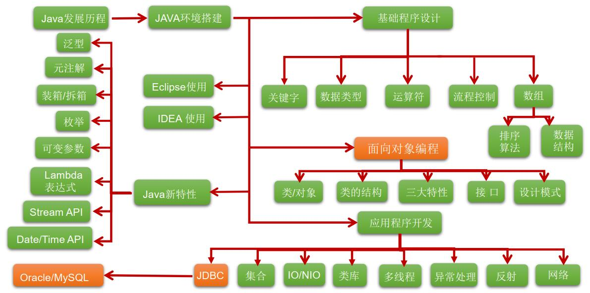

<!--
 * @Author: your name
 * @Date: 2020-04-15 22:09:18
 * @LastEditTime: 2020-04-17 11:22:18
 * @LastEditors: your name
 * @Description: In User Settings Edit
 * @FilePath: \docs\menu.md
 -->
<!--
 * @Author: your name
 * @Date: 2020-04-09 20:00:28
 * @LastEditTime: 2020-04-17 11:20:19
 * @LastEditors: Please set LastEditors
 * @Description: In User Settings Edit
 * @FilePath: \docs\menu.md
 -->
# Java学习路线图

## Java总体学习

个人理解，欢迎各位提出宝贵意见：

我把java目前共分为了十大部分：

  第一部分、Java

  * A、java基础概念，一共分为了20讲，每一部分正在加速完成中。主要是参考了toBeJavaer这位大佬的思维导图下进行的扩展

  * B、基础部分我把并发单独摘出来，成为一个专门的专题，因为并发过于重要，同时知识点也是比较多的
  [并发知识点](https://github.com/xingshaocheng/architect-awesome/blob/master/README.md#%E5%B9%B6%E5%8F%91)

  * C、JVM，大厂面试的关键所在

  第二部分、OS

  * A、linux操作系统

  * B、shell脚本

  * C、TCP/IP+HTTP+计算机网络

  * D、操作系统

  第三部分、数据库

  * A、MySQL

  * B、Redis

  * C、ORacle

  * D、JDBC

  * E、MyCat

  第四部分、算法

  * 栈与排序
  * 链表
  * 二叉树
  * 递归
  * 字符串
  * 大数据
  * 位运算
  * 数组矩阵
  * 排序
  * 查找
  * 图
  * 哈希
  * KMP
  * 分治
  * 贪心
  * 
  * 算法共分为了十八部分进行讲解

  第五部分、前端

  2021.1月开始学习

  目前学习的理论主要有：XML/Tomcat、Servlt、EL/JSTL/JSP（大体一看就好了）、Cookie/Session、Filter/Listen、Json/AJAX、i18n国际化

  A、HTML+CSS+less+Boostrap

  B、JS+JQ

  C、NodeJS+MongoDB

  D、Zepto+AngularJS

  E、ES5_6_7+git（前端）

  F、Grunt+Gulp+WebPack

  G、框架

     React/Vue（选一个就够了应该）+Promise（异步操作）+axios（与后端交互的比较重要技术）+mpvue（美团推出的小程序技术，比较火哎）
     
     注：由于JS主要是同步操作，学会异步操作比较重要

  第六部分、框架

  A、基础框架

     SSM（包括Spring+SpringMVC+MyBatis）然后另外学习MyBatisPlus+通用Mapper+iBatis

     SpringBoot（大佬们说现在用这个比较多，我觉得好像也是这么回事）

     Hibernate+JPA+Spring Data

     shiro

     自认为的老技术（认为说的不对，请喷我，我改）：SSH、SSSP、RBAC  

之后的知识，可以看一下这个大佬的，

[github地址1](https://github.com/doocs/advanced-java)

[github地址2](https://github.com/xingshaocheng/architect-awesome)

  B、消息队列
    
     ActiveMQ

     kafka

     RabbitMQ

     RocketMQ

  C、缓存中间件

     Redis

     MongoDB

     memcache 

  D、RPC
   
     SpringCloud（热门）

     Dubbo

     Netty

  E、搜索引擎

     ES

     Lucene

     Logstash

  第七部分、工具
  A、Git

  B、maven

  C、网关（ngnix/LVS/Apache）

  D、maven

  E、SVN

  F、容器

     Docker

     K8S

  E、Gradle

  F、Jenkins

  第八部分、大数据
   
   Hadoop

   Spark

  第九部分、面经

  我就只能把自家面试情况说一下，我的都很水，给你一个大佬的链接，上到BAT，下到传统都有，[链接在此](https://github.com/0voice/interview_internal_reference)

  第九部分、项目

  目前主要做博客系统、电商平台、众筹、教育在线很传统的项目，有新项目请在issue给我留言，促进我学习，[链接来了](https://github.com/codefool0307/JavaStudyer/issues)

  比较好的项目——[秒杀](https://github.com/qiurunze123/miaosha)

  第十部分、热门技术
  A、K8S

## 第一部分、Java基础学习路线

